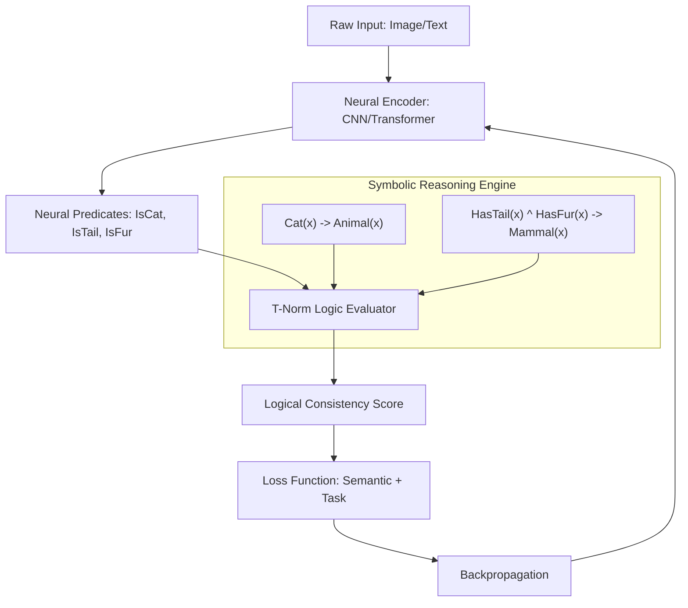

# Neural-Symbolic Integration: Combining Learning and Reasoning

> Neural-symbolic integration (NeSy) is a paradigm that fuses the statistical pattern recognition capabilities of neural networks (Connectionism) with the high-level, deductive reasoning of formal logic (Symbolism) to create AI systems that are both robust to noise and capable of rigorous, explainable inference.

## 1. Historical Background & Motivation

The history of Artificial Intelligence has long been bifurcated between two dominant philosophies: the **Symbolic** camp (Good Old-Fashioned AI or GOFAI) and the **Connectionist** camp. In the 1970s and 80s, researchers like John McCarthy and Marvin Minsky championed symbolic logic, where intelligence is viewed as the manipulation of discrete tokens according to formal rules (e.g., [[temporal-logic]], [[description-logics]]). While these systems were transparent and logically sound, they suffered from the "Knowledge Bottleneck"—the difficulty of manually encoding every rule—and the "Symbol Grounding Problem"—the inability to connect abstract symbols to raw sensory data.

Conversely, the Connectionist revolution, led by figures like Geoffrey Hinton and Yann LeCun, focused on neural networks inspired by the brain. While deep learning has achieved superhuman performance in perception tasks, it is often criticized for being a "black box" that lacks interpretability, requires massive amounts of data, and struggles with out-of-distribution reasoning. Neural-Symbolic Integration emerged in the late 1990s (notably through the work of Artur Garcez and others on Knowledge-Based Artificial Neural Networks) as a "third way." It seeks to satisfy Kahneman’s "System 1" (fast, intuitive perception) and "System 2" (slow, logical reasoning) within a single architecture. Today, NeSy is critical for safety-critical domains like medicine and autonomous driving, where a model must not only predict but also adhere to known physical laws and logical constraints.

## 2. Visual Intuition
:::demo
<div style="background:#1e1e1e;padding:16px;border-radius:10px;color:#e5e7eb;font-family:system-ui,sans-serif">
  <h3 style="margin:0 0 8px 0;color:#7dd3fc">Neural-Symbolic Integration: Combining Learning and Reasoning - Concept Map</h3>
  <svg width="100%" height="280" viewBox="0 0 640 280" role="img" aria-label="Neural-Symbolic Integration: Combining Learning and Reasoning visual intuition" style="background:#111827;border-radius:8px">
    <rect x="24" y="28" width="180" height="64" rx="10" fill="#1d4ed8" />
    <text x="114" y="66" text-anchor="middle" fill="#e5e7eb" font-size="14">Problem</text>
    <rect x="230" y="28" width="180" height="64" rx="10" fill="#0f766e" />
    <text x="320" y="66" text-anchor="middle" fill="#e5e7eb" font-size="14">Process</text>
    <rect x="436" y="28" width="180" height="64" rx="10" fill="#7c3aed" />
    <text x="526" y="66" text-anchor="middle" fill="#e5e7eb" font-size="14">Outcome</text>

    <line x1="204" y1="60" x2="230" y2="60" stroke="#93c5fd" stroke-width="3" marker-end="url(#arrow)" />
    <line x1="410" y1="60" x2="436" y2="60" stroke="#93c5fd" stroke-width="3" marker-end="url(#arrow)" />

    <rect x="24" y="130" width="592" height="120" rx="10" fill="#0b1220" stroke="#334155" />
    <text x="320" y="156" text-anchor="middle" fill="#cbd5e1" font-size="14">Key intuition for Neural-Symbolic Integration: Combining Learning and Reasoning</text>
    <text x="320" y="182" text-anchor="middle" fill="#94a3b8" font-size="12">Track state changes, constraints, and final behavior.</text>
    <text x="320" y="206" text-anchor="middle" fill="#94a3b8" font-size="12">Use this as a mental model before formal proofs or code.</text>

    <defs>
      <marker id="arrow" markerWidth="10" markerHeight="10" refX="8" refY="3" orient="auto">
        <polygon points="0 0, 10 3, 0 6" fill="#93c5fd" />
      </marker>
    </defs>
  </svg>
  <p style="margin-top:10px;color:#cbd5e1">Interactive-ready visual scaffold for the topic.</p>
</div>
:::
*Caption: The Neural-Symbolic cycle. Raw data is processed by neural layers into "grounded" concepts (predicates), which are then passed to a symbolic reasoning engine. The reasoning engine provides feedback (logical gradients) to refine the neural perceptions.*

## 3. Core Theory & Mathematical Foundations

The fundamental challenge of NeSy is **differentiability**. Standard logic uses discrete Boolean values $\{0, 1\}$, which have zero gradients almost everywhere, making them incompatible with backpropagation. NeSy solves this by mapping logical operations to continuous functions over the interval $[0, 1]$.

### 3.1 Differentiable Logic via T-Norms
To integrate logic into neural networks, we treat truth values as fuzzy memberships. A **T-Norm** (Triangular Norm) $T:[0,1] \times [0,1] \to [0,1]$ generalizes the logical AND operator. The three primary T-norms used in NeSy are:

1.  **Product T-Norm:** $T(a, b) = a \cdot b$. This represents independent probabilities.
2.  **Gödel T-Norm:** $T(a, b) = \min(a, b)$.
3.  **Łukasiewicz T-Norm:** $T(a, b) = \max(0, a + b - 1)$.

The corresponding **S-Norm** (logical OR) is derived via De Morgan's laws: $S(a, b) = 1 - T(1-a, 1-b)$.

### 3.2 Logic Tensor Networks (LTN)
In Logic Tensor Networks, symbols are grounded into real-valued tensors. A predicate $P$ of arity $n$ is interpreted as a function $G(P): \mathbb{R}^{d \times n} \to [0, 1]$. If we have a rule $\forall x (Cat(x) \implies Mammal(x))$, the "satisfaction level" of this rule is computed as:
$$\text{Sat}(\phi) = \text{Agg}_{x \in \mathcal{X}} [ I(G(Cat)(x), G(Mammal)(x)) ]$$
where $I(a, b)$ is a fuzzy implication (e.g., the Reichenbach implication $1-a+ab$) and $\text{Agg}$ is an aggregation operator like the generalized mean.

### 3.3 The Semantic Loss Function
A common approach is to add a "semantic loss" term $\mathcal{L}_s$ to the standard cross-entropy loss $\mathcal{L}_{ce}$:
$$\mathcal{L}_{total} = (1 - w)\mathcal{L}_{ce} + w \cdot \mathcal{L}_s$$
The semantic loss $\mathcal{L}_s$ penalizes the network when its outputs violate a set of logical constraints $\mathcal{K}$. If $\mathcal{K}$ is a formula in Conjunctive Normal Form (CNF), $\mathcal{L}_s$ is defined as the negative log-likelihood of the probability that the constraints are satisfied:
$$\mathcal{L}_s(\mathcal{K}, y) = -\log \sum_{z \models \mathcal{K}} \prod_{i: z_i=1} y_i \prod_{i: z_i=0} (1-y_i)$$
where $z \models \mathcal{K}$ are the states that satisfy the logic.

### 3.4 Formal Analysis (Complexity)
The complexity of NeSy systems often depends on the "Knowledge Compilation" step.
- **Time Complexity:** Computing the semantic loss exactly is **#P-complete**, as it involves counting satisfying assignments (the Model Counting problem).
- **Optimization:** To remain tractable, NeSy systems use **Circuit Compilation** (transforming logic into SDDs - Sentential Decision Diagrams) which allows linear-time inference relative to the size of the compiled graph, though the compilation itself remains exponential in the worst case (treewidth-dependent).

## 4. Algorithm / Process (Step-by-Step)

The typical workflow for training a Neural-Symbolic system (specifically a Semantic Loss approach) is as follows:

1.  **Symbolic Definition:** Define the domain knowledge as a set of First-Order Logic (FOL) formulas $\Phi$.
2.  **Grounding:** Map every constant in $\Phi$ to a feature vector and every predicate to a neural network head that outputs a value in $[0, 1]$.
3.  **Compilation:** Convert logical formulas into a computational graph. For simple constraints, use T-norms; for complex probabilistic constraints, compile to an Algebraic Decision Diagram (ADD).
4.  **Forward Pass:** Pass input $X$ through the neural network to get probabilities $P(y|X)$.
5.  **Reasoning Pass:** Evaluate the satisfaction degree of $\Phi$ using the neural outputs as inputs to the T-norm functions.
6.  **Backpropagation:** Calculate the gradient of the satisfaction degree with respect to the neural network weights $\theta$.
    $$\nabla_\theta \mathcal{L}_s = \frac{\partial \mathcal{L}_s}{\partial G(P)} \cdot \frac{\partial G(P)}{\partial \theta}$$
7.  **Update:** Update weights to maximize the likelihood of both the labels and the logical consistency.

## 5. Visual Diagram


*Caption: Feedback loop where logical violations contribute to the gradient, forcing the neural network to learn representations that are consistent with background knowledge.*

## 6. Implementation

### 6.1 Core Implementation: Differentiable Logic Layer
This example demonstrates a "Logic Layer" in PyTorch that enforces the constraint $A \implies B$ (If it's a Square, it's a Rectangle).

```python
import torch
import torch.nn as nn

class LukasiewiczLogicLayer(nn.Module):
    """
    Implements differentiable logic gates using the Lukasiewicz T-Norm.
    Logic: A -> B is equivalent to !A v B
    """
    def __init__(self):
        super().__init__()

    def logical_not(self, a):
        return 1 - a

    def logical_and(self, a, b):
        # T_luk(a, b) = max(0, a + b - 1)
        return torch.clamp(a + b - 1, min=0)

    def logical_or(self, a, b):
        # S_luk(a, b) = min(1, a + b)
        return torch.clamp(a + b, max=1)

    def logical_implies(self, a, b):
        # A -> B is equivalent to (not A) OR B
        return self.logical_or(self.logical_not(a), b)

# Example Usage:
# Predicate A: Is_Square, Predicate B: Is_Rectangle
# Input: Neural Network outputs (probabilities)
pred_a = torch.tensor([0.9], requires_grad=True) # Model is 90% sure it's a square
pred_b = torch.tensor([0.2], requires_grad=True) # Model is 20% sure it's a rectangle

logic = LukasiewiczLogicLayer()
satisfaction = logic.logical_implies(pred_a, pred_b)
loss = 1 - satisfaction # We want to maximize satisfaction

loss.backward()
print(f"Satisfaction: {satisfaction.item():.4f}") # 0.3 (Highly inconsistent)
print(f"Gradient for A: {pred_a.grad.item()}")   # 1.0 (Increase A's loss to decrease A's value)
```

### 6.2 Optimized / Production Variant: Semantic Loss with SDD
In production, logic is often compiled into a **Sentential Decision Diagram (SDD)** for efficient computation of the probability of satisfying a formula.

```python
# Pseudocode for a production-grade Semantic Loss integration
def semantic_loss(probabilities, sdd_manager, formula_sdd):
    """
    Calculates the semantic loss using a compiled SDD.
    Args:
        probabilities: Tensor of neural outputs [p1, p2, ..., pn]
        sdd_manager: The SDD manager object
        formula_sdd: The root node of the compiled formula
    Returns:
        Differentiable loss scalar
    """
    # WMC (Weighted Model Counting) on the SDD
    # This process is differentiable in many NeSy frameworks (like PySDD)
    prob_satisfied = sdd_manager.wmc(formula_sdd, probabilities)
    return -torch.log(prob_satisfied)
```

### 6.3 Common Pitfalls in Code
1.  **Gradient Vanishing:** Using the Gödel T-Norm ($\min/\max$) creates "dead zones" where only one input receives a gradient. Product or Łukasiewicz T-norms are generally preferred for smoother optimization.
2.  **Numerical Instability:** Continuous implications like $a \implies b = \min(1, 1-a+b)$ can lead to values exactly 1.0, where gradients become zero. Adding a small epsilon ($\epsilon$) helps.
3.  **The "Constraint Satisfaction Trap":** If the weight on logical loss is too high, the network might find a "shortcut" by making all predicates 0 (vacuous truth), satisfying $A \implies B$ simply by making $A$ false.

## 7. Interactive Demo

:::demo
<!-- title: Differentiable Logic Visualization -->
<!DOCTYPE html>
<html>
<head>
<meta charset="utf-8">
<style>
  body { margin:0; background:#0f1117; color:#e5e7eb; font-family: system-ui, sans-serif; font-size:13px; padding:16px; }
  .canvas-container { display: flex; flex-direction: column; align-items: center; }
  canvas { border: 1px solid #374151; background: #000; border-radius: 8px; cursor: crosshair; }
  .controls { margin-top: 15px; display: grid; grid-template-columns: 1fr 1fr; gap: 10px; width: 100%; max-width: 400px; }
  .stat { background: #1f2937; padding: 8px; border-radius: 4px; text-align: center; }
  .label { font-size: 10px; color: #9ca3af; text-transform: uppercase; margin-bottom: 4px; }
  .val { font-family: monospace; font-size: 16px; color: #60a5fa; }
  button { background: #3b82f6; color: white; border: none; padding: 8px; border-radius: 4px; cursor: pointer; }
  button:hover { background: #2563eb; }
</style>
</head>
<body>
  <div class="canvas-container">
    <div style="margin-bottom:10px; font-weight:bold;">T-Norm Surface: A AND B</div>
    <canvas id="logicCanvas" width="300" height="300"></canvas>
    <div class="controls">
      <div class="stat"><div class="label">A (Truth Value)</div><div id="valA" class="val">0.50</div></div>
      <div class="stat"><div class="label">B (Truth Value)</div><div id="valB" class="val">0.50</div></div>
      <div class="stat"><div class="label">Product T-Norm</div><div id="valProd" class="val">0.25</div></div>
      <div class="stat"><div class="label">Lukasiewicz</div><div id="valLuk" class="val">0.00</div></div>
      <button onclick="setNorm('product')">Use Product</button>
      <button onclick="setNorm('lukasiewicz')">Use Lukasiewicz</button>
    </div>
    <p style="font-size:11px; color:#9ca3af; margin-top:10px;">Drag on the canvas to change inputs A and B. Observe how different T-norms compute "AND".</p>
  </div>
<script>
  const canvas = document.getElementById('logicCanvas');
  const ctx = canvas.getContext('2d');
  let currentNorm = 'product';
  let inputA = 0.5, inputB = 0.5;

  function draw() {
    const w = canvas.width, h = canvas.height;
    ctx.clearRect(0, 0, w, h);
    
    // Draw background heatmap
    const step = 5;
    for(let x=0; x<w; x+=step) {
      for(let y=0; y<h; y+=step) {
        let a = x/w;
        let b = 1 - (y/h);
        let val = currentNorm === 'product' ? a * b : Math.max(0, a + b - 1);
        ctx.fillStyle = `rgb(0, ${val * 150 + 50}, ${val * 255})`;
        ctx.fillRect(x, y, step, step);
      }
    }

    // Draw Crosshair
    ctx.strokeStyle = '#fff';
    ctx.beginPath();
    ctx.moveTo(inputA * w, 0); ctx.lineTo(inputA * w, h);
    ctx.moveTo(0, (1-inputB) * h); ctx.lineTo(w, (1-inputB) * h);
    ctx.stroke();

    // Update Text
    document.getElementById('valA').innerText = inputA.toFixed(2);
    document.getElementById('valB').innerText = inputB.toFixed(2);
    document.getElementById('valProd').innerText = (inputA * inputB).toFixed(2);
    document.getElementById('valLuk').innerText = Math.max(0, inputA + inputB - 1).toFixed(2);
  }

  canvas.addEventListener('mousemove', (e) => {
    const rect = canvas.getBoundingClientRect();
    inputA = (e.clientX - rect.left) / canvas.width;
    inputB = 1 - (e.clientY - rect.top) / canvas.height;
    inputA = Math.max(0, Math.min(1, inputA));
    inputB = Math.max(0, Math.min(1, inputB));
    draw();
  });

  function setNorm(n) { currentNorm = n; draw(); }
  draw();
</script>
</body>
</html>
:::

## 8. Worked Examples

### Example 1: Differentiable Modus Ponens
Consider a model classifying animals. We have a rule: **If it has a trunk, it is an elephant.**
Suppose the neural network outputs:
- $P(\text{Trunk}) = 0.8$
- $P(\text{Elephant}) = 0.3$

Using **Product Logic** ($I(a, b) = 1 - a + ab$):
1.  Calculate Satisfaction: $S = 1 - 0.8 + (0.8 \times 0.3) = 1 - 0.8 + 0.24 = 0.44$.
2.  Semantic Loss: $\mathcal{L}_s = 1 - 0.44 = 0.56$.
3.  The gradient will push $P(\text{Trunk})$ down or $P(\text{Elephant})$ up to reconcile the inconsistency.

### Example 2: Transitive Dependency in NLP
In Entity Resolution, if $A=B$ and $B=C$, then $A=C$.
Suppose a transformer outputs similarities:
- $Sim(A, B) = 0.9$
- $Sim(B, C) = 0.9$
- $Sim(A, C) = 0.1$

In a pure neural model, these would be accepted. In a NeSy model, the transitivity constraint $\forall x,y,z (Eq(x,y) \land Eq(y,z) \implies Eq(x,z))$ would produce a high penalty. 
Under **Lukasiewicz logic**:
$T(0.9, 0.9) = \max(0, 0.9+0.9-1) = 0.8$.
$I(0.8, 0.1) = \min(1, 1 - 0.8 + 0.1) = 0.3$.
Satisfaction is only $30\%$. The backpropagation adjusts the embeddings of $A, B, C$ to be more consistent in vector space.

## 9. Comparison with Alternatives

| Approach | Interpretable? | Handles Noise? | Scaling Complexity | Best Used When |
| :--- | :--- | :--- | :--- | :--- |
| **Pure Symbolic** | Yes (High) | No | Exponential | Small, clean datasets with rigid rules. |
| **Pure Neural** | No | Yes | Linear (approx) | Large, noisy datasets (Images, Audio). |
| **NeSy (T-Norms)** | Partially | Yes | Quadratic/Poly | Domain rules are known but data is noisy. |
| **DeepProbLog** | Yes | Yes | #P-Complete | Probabilistic reasoning is required. |

## 10. Industry Applications & Real Systems

- **DeepMind (AlphaGeometry)**: Uses a neuro-symbolic approach to solve IMO-level geometry problems. A language model suggests auxiliary constructions (System 1), while a symbolic deduction engine verifies the proof steps (System 2).
- **IBM (Neuro-Symbolic AI for Finance)**: Combines LLMs with business rule engines to ensure that automated loan approvals strictly follow regulatory compliance logic that cannot be violated by "hallucinations."
- **Microsoft (PROSE)**: Uses program synthesis (a form of symbolic AI) guided by neural heuristics to power the "Flash Fill" feature in Excel, generating code from examples.
- **Autonomous Driving (Waymo/Tesla)**: Neural networks handle object detection, but "Safety Layers" (Symbolic constraints) enforce hard rules like "Never cross a double yellow line," overriding neural outputs if they conflict with traffic laws.

## 11. Practice Problems

### 🟢 Easy
1.  **T-Norm Calculation**: Given $a=0.7$ and $b=0.6$, calculate the result of the Gödel AND and the Product AND.
    *Hint: $\min(a,b)$ vs $a \cdot b$.*
    *Expected: 0.6 and 0.42.*

### 🟡 Medium
2.  **Vacuous Truth Avoidance**: Prove that the loss $\mathcal{L}_s = 1 - \text{Sat}(A \implies B)$ can be minimized by setting $P(A)=0$ regardless of $B$. Suggest a modification to the loss function to prevent the model from simply ignoring predicate $A$.
    *Hint: Combine with a supervised cross-entropy loss.*

3.  **Circuit Complexity**: Given a logical constraint with $N$ variables in a chain: $x_1 \implies x_2 \implies ... \implies x_n$. What is the size of the corresponding arithmetic circuit for computing satisfaction?

### 🔴 Hard
4.  **Differentiable Ranking**: Implement a NeSy layer that enforces transitivity in a ranking task ($A > B \land B > C \implies A > C$). Show the gradient of the loss with respect to a violation where $A=0.1, B=0.9, C=0.1$.
    *Expected complexity: $O(N^3)$ for all triplets.*

5.  **Model Counting**: Derive the Semantic Loss for the formula $(A \lor B) \land \neg C$. Assume $y_A, y_B, y_C$ are the neural output probabilities.
    *Hint: $\sum_{z \models \phi} P(z)$. Possible satisfying states for $(A \lor B)$ are $\{(1,0), (0,1), (1,1)\}$.*

## 12. Interactive Quiz

:::quiz
**Q1: Why is standard Boolean logic unsuitable for standard backpropagation?**
- A) It is too computationally expensive.
- B) It is not monotonic.
- C) Its derivative is zero or undefined everywhere, providing no signal for gradient descent.
- D) It cannot represent hierarchical relationships.
> C — Backpropagation requires gradients. Boolean functions are step functions ($0 \to 1$), whose derivatives are zero everywhere except at the jump, where it is undefined.

**Q2: Which T-norm is equivalent to the joint probability of two independent events?**
- A) Gödel T-Norm
- B) Product T-Norm
- C) Lukasiewicz T-Norm
- D) Hamacher T-Norm
> B — The Product T-Norm $T(a,b) = a \cdot b$ matches the definition of $P(A \cap B)$ for independent $A, B$.

**Q3: In a Logic Tensor Network, what does "grounding" refer to?**
- A) Ensuring the model is connected to electrical earth.
- B) Mapping abstract symbols/predicates to real-valued tensors or neural functions.
- C) Limiting the weights of the network to a specific range.
- D) Reducing the dimensionality of the input data.
> B — Grounding is the bridge between the symbolic world (concepts) and the neural world (vectors).

**Q4: What is the "vacuous truth" problem in NeSy?**
- A) The model learns that $1=0$.
- B) The model satisfies an implication $A \implies B$ by simply making $A$ always false.
- C) The logic becomes too complex to compile.
- D) The T-norms overflow to infinity.
> B — Logic rules like "If it's a car, it has wheels" are satisfied if the model simply decides nothing is a car.

**Q5: What is the computational complexity of exact model counting (required for perfect Semantic Loss)?**
- A) P
- B) NP-complete
- C) #P-complete
- D) O(N log N)
> C — Model counting (#SAT) is #P-complete, which is harder than NP-complete.
:::

## 13. Interview Preparation

### Conceptual Questions
**Q: Explain Neural-Symbolic Integration as if teaching it to a fellow engineer.**
*A: NeSy is about adding "common sense" or "guardrails" to neural networks. While a CNN might be 99% accurate at identifying objects, it doesn't "know" that a car can't be inside a toaster. NeSy allows us to write that rule in logic and convert it into a loss function. This forces the network to find a solution that fits the data AND the rules, making it more reliable and explainable.*

**Q: What are the time and space complexities? Derive them.**
*A: For simple T-norm integration, the complexity is $O(M)$ where $M$ is the number of logical operations, adding negligible overhead to the forward pass. However, for probabilistic logic (DeepProbLog), we must count satisfying assignments. For a formula with $k$ variables, this is $O(2^k)$ in the worst case. Using Knowledge Compilation (SDDs), we can reduce this to $O(size(SDD))$, where the size is exponential relative to the treewidth of the logic constraint graph.*

**Q: How would you choose between Product and Lukasiewicz logic?**
*A: Product logic is better when you want to interpret outputs as independent probabilities and need strictly non-zero gradients across the whole space. Lukasiewicz is better when you want to reach "absolute truth" (1.0) or "absolute false" (0.0) more quickly, though it suffers from "dead zones" where the gradient is zero if the sum is too low or too high.*

### Quick Reference (Cheat Sheet)
| Property | Value |
|---|---|
| Primary Goal | Bridging Perception (Neural) and Reasoning (Symbolic) |
| Core Mechanism | Differentiable Logic (T-Norms) or Semantic Loss |
| Complexity | Varies (T-norms: Linear; Probabilistic: #P-hard) |
| Key Benefit | Explainability, Data Efficiency, Safety Constraints |
| Popular Library | Logic Tensor Networks (LTN), DeepProbLog, PySDD |

## 14. Key Takeaways
1.  **Differentiability is Key:** NeSy turns discrete logic into continuous "fuzzy" functions so we can use SGD.
2.  **Knowledge as a Prior:** Symbolic rules act as a powerful inductive bias, allowing models to learn from fewer examples.
3.  **T-Norms:** These are the building blocks ($AND, OR, NOT$) of differentiable logic.
4.  **Vacuous Truth:** Always monitor if your model is satisfying rules by simply predicting "False" for everything.
5.  **Hybrid Systems:** NeSy is the foundation of "System 2" AI, which can reason step-by-step.
6.  **Safety:** In industry, NeSy is used to guarantee that neural models follow hard constraints (e.g., physical laws).

## 15. Common Misconceptions
- ❌ **"NeSy makes neural networks slower to run in production."** → ✅ Only the training is significantly slower if complex compilation is used. Inference is usually just a few extra tensor operations.
- ❌ **"Fuzzy logic is the same as probability."** → ✅ While they both use $[0, 1]$, they have different algebraic properties (e.g., in fuzzy logic, $A \land A = A$, while in probability $P(A \cap A) = P(A)$ but $P(A) \cdot P(A) \neq P(A)$).
- ❌ **"NeSy is only for small-scale logic."** → ✅ Recent advances in "Lifted Inference" and "Approximate Model Counting" allow NeSy to scale to millions of variables.

## 16. Further Reading
- *Neural-Symbolic Cognitive Reasoning*, Garcez et al. (The seminal textbook on the subject).
- *DeepProbLog: Neural Probabilistic Logic Programming*, Manhaeve et al. (NeurIPS 2018).
- *Logic Tensor Networks*, Badreddine et al. (IJCAI 2022).
- [[temporal-logic]] — For reasoning over time-series data in NeSy.
- [[description-logics]] — For hierarchical knowledge representation.

## 17. Related Topics
- [[heuristic-design]] — How symbolic rules can guide search.
- [[monte-carlo-tree-search]] — Often used as the "System 2" search component in NeSy models like AlphaZero.
- [[arc-consistency]] — The symbolic foundation for constraint satisfaction that NeSy tries to differentiate.
