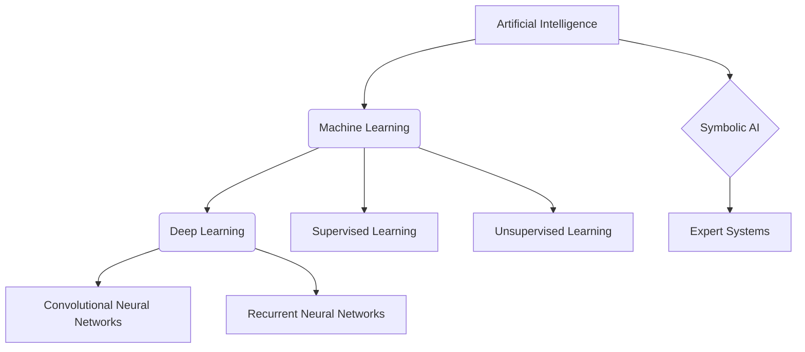

# Introduction to Artificial Intelligence

> Artificial Intelligence is the theory and development of computer systems able to perform tasks that normally require human intelligence.

## Overview
Artificial intelligence (AI) is a wide-ranging branch of computer science concerned with building smart machines capable of performing tasks that typically require human intelligence. The field was founded on the claim that human intelligence can be so precisely described that a machine can be made to simulate it. This raises philosophical arguments about the nature of the mind and the ethics of creating artificial beings, issues which have been explored in myth, fiction and philosophy since antiquity. AI research has been a catalyst for progress in various domains, including machine learning, natural language processing, computer vision, and robotics.

The history of AI is a fascinating journey of ambitious goals, theoretical breakthroughs, and cycles of funding and "AI winters". From the early days of symbolic AI, where researchers tried to codify human knowledge into formal rules, the field has evolved to embrace statistical methods and, more recently, deep learning models that learn from vast amounts of data. Today, AI is a major driver of innovation in science and industry, with applications ranging from medical diagnosis to self-driving cars.

## 2. Visual Intuition
:::demo
<div style="background:#1e1e1e;padding:16px;border-radius:10px;color:#e5e7eb;font-family:system-ui,sans-serif">
  <h3 style="margin:0 0 8px 0;color:#7dd3fc">Introduction to Artificial Intelligence - Concept Map</h3>
  <svg width="100%" height="280" viewBox="0 0 640 280" role="img" aria-label="Introduction to Artificial Intelligence visual intuition" style="background:#111827;border-radius:8px">
    <rect x="24" y="28" width="180" height="64" rx="10" fill="#1d4ed8" />
    <text x="114" y="66" text-anchor="middle" fill="#e5e7eb" font-size="14">Problem</text>
    <rect x="230" y="28" width="180" height="64" rx="10" fill="#0f766e" />
    <text x="320" y="66" text-anchor="middle" fill="#e5e7eb" font-size="14">Process</text>
    <rect x="436" y="28" width="180" height="64" rx="10" fill="#7c3aed" />
    <text x="526" y="66" text-anchor="middle" fill="#e5e7eb" font-size="14">Outcome</text>

    <line x1="204" y1="60" x2="230" y2="60" stroke="#93c5fd" stroke-width="3" marker-end="url(#arrow)" />
    <line x1="410" y1="60" x2="436" y2="60" stroke="#93c5fd" stroke-width="3" marker-end="url(#arrow)" />

    <rect x="24" y="130" width="592" height="120" rx="10" fill="#0b1220" stroke="#334155" />
    <text x="320" y="156" text-anchor="middle" fill="#cbd5e1" font-size="14">Key intuition for Introduction to Artificial Intelligence</text>
    <text x="320" y="182" text-anchor="middle" fill="#94a3b8" font-size="12">Track state changes, constraints, and final behavior.</text>
    <text x="320" y="206" text-anchor="middle" fill="#94a3b8" font-size="12">Use this as a mental model before formal proofs or code.</text>

    <defs>
      <marker id="arrow" markerWidth="10" markerHeight="10" refX="8" refY="3" orient="auto">
        <polygon points="0 0, 10 3, 0 6" fill="#93c5fd" />
      </marker>
    </defs>
  </svg>
  <p style="margin-top:10px;color:#cbd5e1">Interactive-ready visual scaffold for the topic.</p>
</div>
:::
*Caption: A conceptual diagram showing the relationship between Artificial Intelligence, Machine Learning, and Deep Learning.*

## Core Theory
The core theory of AI is built on the foundation of computation and the idea that intelligent behavior can be broken down into a set of computable steps. Early AI research focused on **symbolic AI**, which is based on the "physical symbol system hypothesis". This hypothesis states that "a physical symbol system has the necessary and sufficient means for general intelligent action." In this view, intelligence is the manipulation of symbols according to rules. This led to the development of expert systems, which could make decisions in a narrow domain by applying a set of hand-crafted rules.

A major shift in AI occurred with the rise of **machine learning**, which is based on the idea that machines can learn from data without being explicitly programmed. Instead of hand-crafting rules, machine learning algorithms use statistical techniques to find patterns in data. This led to the development of algorithms for classification, regression, and clustering.

**Deep learning** is a subfield of machine learning that uses artificial neural networks with many layers (hence "deep") to learn representations of data. Deep learning has been responsible for many of the recent breakthroughs in AI, including in computer vision and natural language processing. The core idea is that by stacking many simple non-linear transformations, the network can learn a hierarchy of features, from simple edges and textures to complex objects and concepts.

## Visual Diagram

*A flowchart showing the major subfields and concepts within Artificial Intelligence.*

## Code Example
```python
# A simple example of a rule-based AI
def get_bot_response(user_input):
    """
    A simple rule-based chatbot that responds to greetings and questions about its name.
    """
    user_input = user_input.lower()

    if "hello" in user_input or "hi" in user_input:
        return "Hello there! How can I help you?"
    elif "your name" in user_input:
        return "I am a simple AI bot."
    elif "how are you" in user_input:
        return "I am a computer program, so I don't have feelings, but thanks for asking!"
    else:
        return "I'm not sure how to respond to that."

# Example usage
print(get_bot_response("Hello, what is your name?"))
# Expected output: I am a simple AI bot.

print(get_bot_response("How are you doing?"))
# Expected output: I am a computer program, so I don't have feelings, but thanks for asking!
```

## Interactive Demo
:::demo
<!-- title: "Simple Rule-Based Chatbot" -->
<!DOCTYPE html>
<html>
<head>
<meta charset="utf-8">
<style>
  body { margin:0; background:#0f1117; color:#e5e7eb; font-family: system-ui, sans-serif; font-size:13px; padding:12px; }
  .chat-container { display: flex; flex-direction: column; height: 200px; border: 1px solid #374151; border-radius: 4px; }
  .chat-history { flex-grow: 1; padding: 8px; overflow-y: auto; }
  .chat-input { display: flex; }
  input { flex-grow: 1; background: #1f2937; border: 1px solid #374151; color: #e5e7eb; padding: 8px; border-radius: 0 0 0 4px; }
  button { background: #3b82f6; color: white; border: none; padding: 8px 12px; border-radius: 0 0 4px 0; cursor: pointer; }
</style>
</head>
<body>
<div class="chat-container">
  <div class="chat-history" id="chat-history"></div>
  <div class="chat-input">
    <input type="text" id="user-input" placeholder="Type your message...">
    <button id="send-btn">Send</button>
  </div>
</div>
<script>
  const chatHistory = document.getElementById('chat-history');
  const userInput = document.getElementById('user-input');
  const sendBtn = document.getElementById('send-btn');

  function getBotResponse(input) {
      input = input.toLowerCase();
      if (input.includes("hello") || input.includes("hi")) {
          return "Hello there! How can I help you?";
      } else if (input.includes("your name")) {
          return "I am a simple AI bot.";
      } else if (input.includes("how are you")) {
          return "I am a computer program, so I don't have feelings, but thanks for asking!";
      } else {
          return "I'm not sure how to respond to that.";
      }
  }

  function appendMessage(sender, message) {
      const messageElement = document.createElement('div');
      messageElement.innerHTML = `<strong>${sender}:</strong> ${message}`;
      chatHistory.appendChild(messageElement);
      chatHistory.scrollTop = chatHistory.scrollHeight;
  }

  function handleSend() {
      const message = userInput.value;
      if (message.trim() === '') return;
      appendMessage('You', message);
      userInput.value = '';
      setTimeout(() => {
          const botResponse = getBotResponse(message);
          appendMessage('Bot', botResponse);
      }, 500);
  }

  sendBtn.addEventListener('click', handleSend);
  userInput.addEventListener('keydown', (event) => {
      if (event.key === 'Enter') {
          handleSend();
      }
  });
</script>
</body>
</html>
:::

## Worked Example
**Problem:** You are building a simple expert system to recommend a pet. The rules are:
1. If the user wants a low-maintenance pet, recommend a cat.
2. If the user wants a loyal pet that can be trained, recommend a dog.
3. If the user wants a pet that can talk, recommend a parrot.

**Solution:**
This can be modeled as a simple set of if-elif-else statements, which is a basic form of a rule-based system.

- **User input:** "I want a pet that is loyal and I can teach it tricks."
- **Analysis:** The input contains the keywords "loyal" and "teach tricks".
- **Rule matching:** This matches rule 2.
- **Output:** "Based on your preferences, I recommend a dog."

## Industry Applications
- **Healthcare:** AI is used for analyzing medical images (like X-rays and MRIs) to detect diseases, for drug discovery, and for personalizing treatment plans. (e.g., Google Health, PathAI)
- **Finance:** Algorithmic trading, fraud detection, and credit scoring are all powered by AI. (e.g., J.P. Morgan, Stripe)
- **Retail:** Recommendation engines, personalized marketing, and supply chain optimization. (e.g., Amazon, Netflix)
- **Automotive:** Self-driving cars and advanced driver-assistance systems (ADAS). (e.g., Tesla, Waymo)

## Practice Problems

### Easy
1. What is the difference between strong AI and weak AI? *(Hint: Think about consciousness and the scope of intelligence.)*

### Medium
2. Describe two real-world applications of AI that you use in your daily life. For each, explain whether it is an example of symbolic AI or machine learning. *(Hint: Consider your phone, social media, and streaming services.)*

### Hard
3. Can a machine that passes the Turing Test be considered intelligent? Discuss the limitations of the Turing Test. *(Hint: Consider the Chinese Room Argument.)*

## Interactive Quiz
:::quiz
**Q1:** Which of the following is the best definition of Artificial Intelligence?
- A) A field of computer science that focuses on creating human-like robots.
- B) The theory and development of computer systems able to perform tasks that normally require human intelligence.
- C) A type of machine learning that uses neural networks.
- D) The study of how to make computers faster.
> B — This is the most widely accepted definition of AI, as it encompasses the broad goal of simulating human intelligence in machines.

**Q2:** What is the relationship between AI, Machine Learning, and Deep Learning?
- A) They are all different terms for the same thing.
- B) Machine Learning is a subset of AI, and Deep Learning is a subset of Machine Learning.
- C) AI is a subset of Machine Learning, which is a subset of Deep Learning.
- D) They are unrelated fields.
> B — AI is the broadest field, Machine Learning is a subfield of AI that focuses on learning from data, and Deep Learning is a subfield of Machine Learning that uses deep neural networks.

**Q3:** The "physical symbol system hypothesis" is most closely associated with which branch of AI?
- A) Deep Learning
- B) Symbolic AI
- C) Reinforcement Learning
- D) Computer Vision
> B — The physical symbol system hypothesis is a core tenet of symbolic AI, which posits that intelligence can be achieved through the manipulation of symbols according to rules.
:::

## Interview Questions

**Q: Explain Artificial Intelligence to a non-technical person.**
*A: Artificial Intelligence is about teaching computers to do things that humans are naturally good at, like understanding language, recognizing faces, or making decisions. Just like we learn from experience, we can teach computers to learn from data to make predictions or take actions.*

**Q: What is the difference between supervised and unsupervised learning?**
*A: Supervised learning is like learning with a teacher. The algorithm is given a dataset with both the input and the correct output, and its goal is to learn the mapping between them. Unsupervised learning is like learning without a teacher. The algorithm is only given the input data and has to find patterns or structure on its own.*

**Q: How would you design a system to recommend movies to a user?**
*A: I would use a collaborative filtering approach. The system would look at the movies that the user has rated and find other users who have rated those movies similarly. Then, it would recommend movies that those similar users have rated highly but the current user has not seen.*

**Q: What are the ethical implications of AI?**
*A: There are many ethical concerns with AI, including job displacement due to automation, algorithmic bias leading to unfair outcomes, the potential for autonomous weapons, and privacy concerns due to mass data collection. It's crucial to develop and deploy AI in a responsible and ethical manner.*

## Key Takeaways
- AI is a broad field of computer science focused on creating intelligent machines.
- Machine Learning and Deep Learning are important subfields of AI.
- Symbolic AI was an early approach based on rules, while modern AI is dominated by machine learning.
- AI has numerous applications across many industries.
- The development of AI raises important ethical questions.
- Supervised and unsupervised learning are two main types of machine learning.
- Collaborative filtering is a common technique for building recommendation systems.

## Common Misconceptions
- ❌ AI is the same as robotics. → ✅ AI is the software that makes a robot (or any system) intelligent. Robotics is the field of building robots.
- ❌ AI is sentient or conscious. → ✅ Current AI is "narrow AI", designed for specific tasks. General AI with human-like consciousness is still science fiction.
- ❌ Machine learning can solve any problem. → ✅ Machine learning requires large amounts of high-quality data and is not a magic bullet.

## Related Topics
- [[intelligent-agents]] — The core concept of an autonomous entity that perceives its environment and takes actions to achieve goals.
- [[search-algorithms]] — Fundamental algorithms for solving problems by exploring a state space.
- [[natural-language-processing]] — A subfield of AI that deals with the interaction between computers and humans using natural language.
