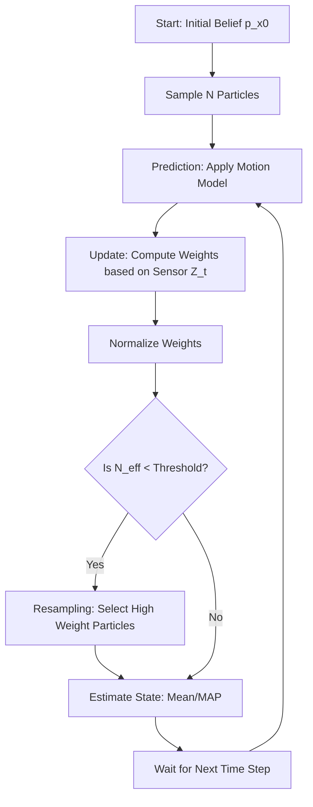

# Particle Filters: Sequential Monte Carlo Methods

> **Particle Filters** are a class of sequential Monte Carlo algorithms that solve the state-estimation problem in non-linear, non-Gaussian dynamic systems by representing the posterior probability distribution as a set of discrete, weighted samples called particles.

## 1. Historical Background & Motivation

The genesis of Particle Filters (PF) lies at the intersection of Bayesian statistics and the Monte Carlo method. While the foundations of Monte Carlo sampling were laid by Stanislaw Ulam and Nicholas Metropolis in the 1940s at Los Alamos, these methods were initially static. It wasn't until the 1960s and 70s that researchers attempted to apply these concepts to dynamic systems. However, early attempts suffered from a fatal flaw known as "weight collapse" or "degeneracy," where after a few iterations, all but one particle would have a weight of zero, rendering the simulation useless.

The modern era of Particle Filtering began in 1993 with the seminal paper by Gordon, Salmond, and Smith, who introduced the **Bootstrap Filter**. Their critical innovation was the *resampling* step, which mathematically revitalized the population of particles by duplicating those with high weights and discarding those with low weights. This solved the degeneracy problem and allowed for the tracking of complex, multimodal, and non-linear trajectories that the then-standard Kalman Filter (KF) and Extended Kalman Filter (EKF) could not handle. Today, Particle Filters are the backbone of modern robotics, from the localization modules in Tesla's Autopilot to the SLAM (Simultaneous Localization and Mapping) algorithms used in Mars Rovers.

## 2. Visual Intuition
:::demo
<div style="background:#1e1e1e;padding:16px;border-radius:10px;color:#e5e7eb;font-family:system-ui,sans-serif">
  <h3 style="margin:0 0 8px 0;color:#7dd3fc">Particle Filters: Sequential Monte Carlo Methods - Concept Map</h3>
  <svg width="100%" height="280" viewBox="0 0 640 280" role="img" aria-label="Particle Filters: Sequential Monte Carlo Methods visual intuition" style="background:#111827;border-radius:8px">
    <rect x="24" y="28" width="180" height="64" rx="10" fill="#1d4ed8" />
    <text x="114" y="66" text-anchor="middle" fill="#e5e7eb" font-size="14">Problem</text>
    <rect x="230" y="28" width="180" height="64" rx="10" fill="#0f766e" />
    <text x="320" y="66" text-anchor="middle" fill="#e5e7eb" font-size="14">Process</text>
    <rect x="436" y="28" width="180" height="64" rx="10" fill="#7c3aed" />
    <text x="526" y="66" text-anchor="middle" fill="#e5e7eb" font-size="14">Outcome</text>

    <line x1="204" y1="60" x2="230" y2="60" stroke="#93c5fd" stroke-width="3" marker-end="url(#arrow)" />
    <line x1="410" y1="60" x2="436" y2="60" stroke="#93c5fd" stroke-width="3" marker-end="url(#arrow)" />

    <rect x="24" y="130" width="592" height="120" rx="10" fill="#0b1220" stroke="#334155" />
    <text x="320" y="156" text-anchor="middle" fill="#cbd5e1" font-size="14">Key intuition for Particle Filters: Sequential Monte Carlo Methods</text>
    <text x="320" y="182" text-anchor="middle" fill="#94a3b8" font-size="12">Track state changes, constraints, and final behavior.</text>
    <text x="320" y="206" text-anchor="middle" fill="#94a3b8" font-size="12">Use this as a mental model before formal proofs or code.</text>

    <defs>
      <marker id="arrow" markerWidth="10" markerHeight="10" refX="8" refY="3" orient="auto">
        <polygon points="0 0, 10 3, 0 6" fill="#93c5fd" />
      </marker>
    </defs>
  </svg>
  <p style="margin-top:10px;color:#cbd5e1">Interactive-ready visual scaffold for the topic.</p>
</div>
:::
*Caption: In this animation, a robot (red) moves through a hallway. The particles (green dots) represent hypotheses of where the robot might be. As the robot perceives landmarks, particles that don't match the sensor data are discarded, and those that do match are cloned, causing the cloud to converge on the robot's true position.*

## 3. Core Theory & Mathematical Foundations

### 3.1 The Hidden Markov Model Framework
Particle filters operate on a State-Space Model (SSM). Let $x_t$ be the hidden state at time $t$ and $z_t$ be the observation. The system is governed by two densities:
1.  **The Transition Model:** $p(x_t | x_{t-1})$, describing the physics or dynamics.
2.  **The Observation Model:** $p(z_t | x_t)$, describing the sensor likelihood.

The goal is to calculate the posterior distribution $p(x_{0:t} | z_{1:t})$, which represents our belief about the trajectory given all observations.

### 3.2 The Recursive Bayesian Filter
The optimal Bayesian solution is recursive. Assuming we have $p(x_{t-1} | z_{1:t-1})$, we find the current posterior in two steps:
1.  **Prediction Step (Chapman-Kolmogorov):**
    $$p(x_t | z_{1:t-1}) = \int p(x_t | x_{t-1}) p(x_{t-1} | z_{1:t-1}) dx_{t-1}$$
2.  **Update Step (Bayes' Rule):**
    $$p(x_t | z_{1:t}) = \frac{p(z_t | x_t) p(x_t | z_{1:t-1})}{p(z_t | z_{1:t-1})}$$

For linear-Gaussian systems, the Kalman Filter provides an exact solution. For non-linear systems, the integral in the prediction step becomes analytically intractable.

### 3.3 Importance Sampling
Since we cannot sample from the posterior $p(x_{0:t} | z_{1:t})$ directly, we use an **Importance Density** $q(x_{0:t} | z_{1:t})$. We approximate the distribution using $N$ particles $\{x^{(i)}_t, w^{(i)}_t\}_{i=1}^N$.
The unnormalized weights are calculated as:
$$w^{(i)}_t \propto \frac{p(z_t | x^{(i)}_t) p(x^{(i)}_t | x^{(i)}_{t-1})}{q(x^{(i)}_t | x^{(i)}_{0:t-1}, z_{1:t})}$$

In the standard **Sequential Importance Resampling (SIR)** filter, we choose the transition model as our importance density: $q = p(x_t | x_{t-1})$. This simplifies the weight update to:
$$w^{(i)}_t = w^{(i)}_{t-1} \cdot p(z_t | x^{(i)}_t)$$

### 3.4 The Degeneracy Problem and Resampling
As $t$ increases, the variance of the weights increases. Eventually, one particle absorbs all weight. We measure this using the **Effective Sample Size ($N_{eff}$)**:
$$N_{eff} \approx \frac{1}{\sum_{i=1}^N (w^{(i)}_t)^2}$$
When $N_{eff} < N_{threshold}$, we perform **Resampling**. We draw $N$ new particles from the current set with replacement, where the probability of selecting particle $i$ is proportional to its weight $w^{(i)}_t$.

### 3.5 Formal Analysis (Complexity)
- **Time Complexity:** $O(N \cdot T)$, where $N$ is the number of particles and $T$ is the number of time steps. Each update step involves $N$ samples from the transition model and $N$ likelihood evaluations. Resampling (using the Alias method or Systematic sampling) is also $O(N)$.
- **Space Complexity:** $O(N)$ to store the particle set.
- **Correctness:** As $N \to \infty$, the discrete Dirac delta approximation $\sum w_i \delta(x - x_i)$ converges in distribution to the true posterior. However, for a finite $N$, the filter is subject to "sample impoverishment," where diversity in the particle set is lost.

## 4. Algorithm / Process (Step-by-Step)

The SIR Particle Filter follows these five steps iteratively:

1.  **Initialization:** Generate $N$ particles $\{x^{(i)}_0\}_{i=1}^N$ from the prior distribution $p(x_0)$. Assign equal weights $w^{(i)}_0 = 1/N$.
2.  **Prediction (Propagate):** For each particle, sample a new state $x^{(i)}_t$ from the transition model $p(x_t | x^{(i)}_{t-1})$. This adds process noise and spreads the particles.
3.  **Update (Weighting):** Calculate the importance weight for each particle using the likelihood of the current observation $z_t$: $w^{(i)}_t = p(z_t | x^{(i)}_t)$.
4.  **Normalization:** Normalize weights so they sum to 1: $w^{(i)}_t = \frac{w^{(i)}_t}{\sum w^{(j)}_t}$.
5.  **Resampling:**
    - Calculate $N_{eff}$.
    - If $N_{eff}$ is too low, resample $N$ particles from the current set based on weights.
    - Reset all weights to $1/N$.

## 5. Visual Diagram


*Caption: The recursive loop of a Sequential Monte Carlo filter, highlighting the critical Resampling decision gate.*

## 6. Implementation

### 6.1 Core Implementation (Vectorized NumPy)
This implementation tracks a 2D position (e.g., a robot on a plane).

```python
import numpy as np

class ParticleFilter:
    def __init__(self, num_particles, state_dim, world_size):
        """
        Initializes the filter with random particles.
        Args:
            num_particles: Number of samples to maintain
            state_dim: Dimension of state vector (e.g., 2 for x,y)
            world_size: Boundary for initial distribution
        """
        self.N = num_particles
        # Particles sampled uniformly across the world
        self.particles = np.random.uniform(0, world_size, (num_particles, state_dim))
        self.weights = np.ones(num_particles) / num_particles

    def predict(self, u, process_noise):
        """
        Propagate particles using motion model x_t = x_{t-1} + u + noise
        Args:
            u: Control vector (e.g., [dx, dy])
            process_noise: Standard deviation of movement noise
        Complexity: O(N)
        """
        noise = np.random.normal(0, process_noise, self.particles.shape)
        self.particles += u + noise

    def update(self, z, sensor_noise, landmarks):
        """
        Update weights based on observation likelihood.
        Assuming Gaussian sensor noise.
        Args:
            z: Observation (distance to landmarks)
            landmarks: Array of [x, y] positions of known markers
        Complexity: O(N * num_landmarks)
        """
        self.weights.fill(1.0)
        for i, landmark in enumerate(landmarks):
            # Calculate distance from each particle to the landmark
            dist = np.linalg.norm(self.particles - landmark, axis=1)
            # Gaussian PDF as likelihood
            likelihood = np.exp(-((dist - z[i])**2) / (2 * sensor_noise**2))
            self.weights *= likelihood
        
        self.weights += 1e-300 # Avoid division by zero
        self.weights /= np.sum(self.weights)

    def resample(self):
        """
        Systematic resampling to maintain particle diversity.
        Complexity: O(N)
        """
        indices = []
        C = [0.0] + [np.sum(self.weights[:i+1]) for i in range(self.N)]
        u0 = np.random.uniform(0, 1/self.N)
        j = 0
        for u in [u0 + i/self.N for i in range(self.N)]:
            while u > C[j]:
                j += 1
            indices.append(j-1)
            
        self.particles = self.particles[indices]
        self.weights.fill(1.0 / self.N)

    def estimate(self):
        """Returns the weighted mean of the particles."""
        return np.average(self.particles, weights=self.weights, axis=0)

# Sample Usage
pf = ParticleFilter(num_particles=1000, state_dim=2, world_size=100)
landmarks = np.array([[20, 20], [80, 80], [20, 80]])
# Move [5, 5] and observe
pf.predict(u=np.array([5, 5]), process_noise=1.0)
# Mock observation with some noise
z = [28.2, 56.5, 53.8] 
pf.update(z, sensor_noise=2.0, landmarks=landmarks)
pf.resample()
print(f"Estimated Position: {pf.estimate()}")
```

### 6.2 Optimized Production Variant (Low-Variance Sampling)
In high-performance systems, the standard `random.choice` for resampling is slow ($O(N \log N)$). We use **Low-Variance Resampling** (also called Stochastic Universal Sampling), which is $O(N)$ and samples more uniformly.

```python
def low_variance_resample(particles, weights):
    N = len(particles)
    new_particles = np.zeros_like(particles)
    r = np.random.uniform(0, 1/N)
    c = weights[0]
    i = 0
    for m in range(N):
        u = r + m/N
        while u > c:
            i += 1
            c += weights[i]
        new_particles[m] = particles[i]
    return new_particles
```

### 6.3 Common Pitfalls in Code
1.  **Floating Point Underflow:** If you have many landmarks, multiplying many small likelihoods results in `0.0`. Use **Log-Likelihoods** and the `log-sum-exp` trick for stability.
2.  **Particle Deprivation:** If the process noise is too small, particles might never reach the true state, and weights will collapse. Always ensure a "survival of the fittest" but also a "search for the new."
3.  **Incorrect Motion Model Noise:** If your model assumes a robot moves 1m but the real robot moves 1.1m, and your noise is only 0.01m, the filter will diverge quickly.

## 7. Interactive Demo

:::demo
<!-- title: Particle Filter Tracking Demo -->
<!DOCTYPE html>
<html>
<head>
<meta charset="utf-8">
<style>
  body { margin:0; background:#111827; color:#f3f4f6; font-family: sans-serif; overflow: hidden; }
  canvas { display: block; border-bottom: 1px solid #374151; }
  .controls { padding: 15px; display: flex; gap: 20px; align-items: center; background: #1f2937; }
  button { background: #3b82f6; color: white; border: none; padding: 8px 16px; border-radius: 4px; cursor: pointer; }
  button:hover { background: #2563eb; }
  .stat { font-family: monospace; font-size: 14px; color: #10b981; }
</style>
</head>
<body>
<canvas id="canvas"></canvas>
<div class="controls">
  <button id="resetBtn">Reset Filter</button>
  <button id="pauseBtn">Pause/Play</button>
  <div class="stat">Target: <span id="targetPos">0,0</span></div>
  <div class="stat">Estimate: <span id="estPos">0,0</span></div>
  <div class="stat">Particles: 200</div>
</div>
<script>
  const canvas = document.getElementById('canvas');
  const ctx = canvas.getContext('2d');
  canvas.width = window.innerWidth;
  canvas.height = window.innerHeight - 70;

  let target = { x: 100, y: 100, vx: 2, vy: 1.5 };
  let particles = [];
  const N = 200;
  let paused = false;

  function initParticles() {
    particles = [];
    for(let i=0; i<N; i++) {
      particles.push({
        x: Math.random() * canvas.width,
        y: Math.random() * canvas.height,
        w: 1/N
      });
    }
  }

  function update() {
    if(paused) return;

    // 1. Move Target (Ground Truth)
    target.x += target.vx + (Math.random()-0.5)*2;
    target.y += target.vy + (Math.random()-0.5)*2;
    if(target.x < 0 || target.x > canvas.width) target.vx *= -1;
    if(target.y < 0 || target.y > canvas.height) target.vy *= -1;

    // 2. Predict (Particles move with noise)
    particles.forEach(p => {
      p.x += target.vx + (Math.random()-0.5)*15; // Higher noise for search
      p.y += target.vy + (Math.random()-0.5)*15;
    });

    // 3. Update (Weight by distance to target - simulating a radar)
    let sumW = 0;
    particles.forEach(p => {
      let d = Math.sqrt((p.x-target.x)**2 + (p.y-target.y)**2);
      p.w = Math.exp(-(d**2)/(2 * 30**2)); // Likelihood
      sumW += p.w;
    });
    
    // Normalize
    particles.forEach(p => p.w /= (sumW + 1e-9));

    // 4. Resample
    let newP = [];
    let index = Math.floor(Math.random() * N);
    let beta = 0;
    let maxW = Math.max(...particles.map(p => p.w));
    for(let i=0; i<N; i++) {
      beta += Math.random() * 2 * maxW;
      while(beta > particles[index].w) {
        beta -= particles[index].w;
        index = (index + 1) % N;
      }
      newP.push({ ...particles[index], w: 1/N });
    }
    particles = newP;

    draw();
    requestAnimationFrame(update);
  }

  function draw() {
    ctx.fillStyle = '#111827';
    ctx.fillRect(0,0,canvas.width, canvas.height);

    // Draw Particles
    ctx.fillStyle = 'rgba(16, 185, 129, 0.5)';
    particles.forEach(p => {
      ctx.beginPath();
      ctx.arc(p.x, p.y, 2, 0, Math.PI*2);
      ctx.fill();
    });

    // Draw Target
    ctx.fillStyle = '#ef4444';
    ctx.beginPath();
    ctx.arc(target.x, target.y, 8, 0, Math.PI*2);
    ctx.fill();

    // Stats
    document.getElementById('targetPos').innerText = `${Math.round(target.x)}, ${Math.round(target.y)}`;
    let meanX = particles.reduce((a,b) => a+b.x, 0)/N;
    let meanY = particles.reduce((a,b) => a+b.y, 0)/N;
    document.getElementById('estPos').innerText = `${Math.round(meanX)}, ${Math.round(meanY)}`;
  }

  document.getElementById('resetBtn').onclick = initParticles;
  document.getElementById('pauseBtn').onclick = () => paused = !paused;
  initParticles();
  update();
</script>
</body>
</html>
:::

## 8. Worked Examples

### Example 1 — 1D Localization
Imagine a robot in a 1D corridor of length 10m. It knows it is near $x=2$ (initial belief $N(2, 1)$).
1.  **Prediction:** Robot moves 3m forward. Process noise $\sigma=1$.
    - Particle 1 at $x=1.8$ becomes $1.8 + 3 + \epsilon = 4.9$.
2.  **Observation:** Robot sees a door. There is a door at $x=5$ and $x=9$.
    - Sensor sees a door at distance 0.1m.
3.  **Update:** 
    - Particle at $x=4.9$ (near door 1) gets high weight: $p(z|x) \approx \text{high}$.
    - Particle at $x=8.9$ (near door 2) gets high weight.
    - Particle at $x=7.0$ (no door) gets near zero weight.
4.  **Resampling:** The particles cluster around $x=5$ and $x=9$. The distribution is now **bimodal**, correctly representing the ambiguity.

### Example 2 — The Kidnapped Robot Problem
If a robot is picked up and moved to an unknown location, a standard Kalman Filter will fail because its single Gaussian belief will be far from the truth and never recover.
A Particle Filter handles this via **Importance Resampling with Random Injection**:
- At each step, replace 5% of the particles with brand new samples drawn uniformly from the entire map.
- When the robot sees a landmark at the new location, these "random" particles will suddenly get huge weights.
- In 2-3 iterations, the filter "teleports" its belief to the new location.

## 9. Comparison with Alternatives

| Approach | Time Complexity | Linearity | Distribution | Cons |
|---|---|---|---|---|
| **Kalman Filter** | $O(k^{2.4})$ | Linear | Univariate Gaussian | Cannot handle multimodal |
| **Extended KF** | $O(k^{2.4})$ | Non-linear (Taylor) | Univariate Gaussian | Diverges on high non-linearity |
| **Unscented KF** | $O(k^{2.4})$ | Non-linear (Sigma) | Univariate Gaussian | Still unimodal |
| **Particle Filter** | $O(N \cdot d)$ | Any | Any (Non-Parametric) | **Curse of Dimensionality** |

## 10. Industry Applications & Real Systems

- **Tesla Autopilot / Waymo**: Particle filters are used for **Multi-Target Tracking (MTT)**. When the vision system detects a pedestrian, a particle filter tracks their position and velocity, handling occlusions (e.g., if a pedestrian walks behind a tree, the particles continue moving based on the motion model until the pedestrian reappears).
- **SpaceX (Falcon 9 Recovery)**: During the landing of the Falcon 9 booster, sensor fusion from GPS, IMU, and radar altimeters must handle high vibration and non-linear dynamics. Particle filters assist in identifying the state of the vehicle in the presence of sporadic sensor noise.
- **Quantitative Finance**: Used in **Stochastic Volatility Models**. Traders use Sequential Monte Carlo to estimate the hidden volatility of an asset price, which is not directly observable but influences the "noise" in price movements.
- **Computer Vision (OpenCV `cv::ParticleFilter`)**: Used for tracking objects in video streams where the object may change shape or color, making a simple box-tracker insufficient.

## 11. Practice Problems

### 🟢 Easy
1. **Effective Sample Size Calculation**: Given weights $[0.4, 0.4, 0.1, 0.1]$, calculate $N_{eff}$. If the threshold for resampling is $N/2$, should you resample?
   *Hint: Use $1 / \sum w_i^2$.*
   *Expected: $1/(0.16 + 0.16 + 0.01 + 0.01) = 1/0.34 \approx 2.94$. Since $2.94 < 2$, no.*

### 🟡 Medium
2. **The Curse of Dimensionality**: Prove that for a $D$-dimensional state space, the number of particles $N$ required to maintain a certain level of accuracy grows exponentially with $D$.
   *Hint: Consider the volume of the space that the particles must cover.*

3. **Motion Model Derivation**: A robot uses a "Velocity Motion Model" where it moves with linear velocity $v$ and angular velocity $\omega$. Write the Python code to update a particle $[x, y, \theta]$ given time step $dt$.

### 🔴 Hard
4. **Rao-Blackwellized Particle Filter (RBPF)**: Explain how RBPF can be used to solve the SLAM problem (FastSLAM). Why is it more efficient than a standard PF?
   *Hint: Some variables can be solved analytically with KF if others are fixed by particles.*

5. **Degeneracy Proof**: Mathematically show why the variance of the importance weights $w_t$ can only increase over time if no resampling is performed.

## 12. Interactive Quiz

:::quiz
**Q1: Why is resampling necessary in a Particle Filter?**
- A) To increase the total number of particles over time.
- B) To prevent all weights from concentrating on a single particle (degeneracy).
- C) To make the algorithm linear so it can be solved by a Kalman Filter.
- D) To reduce the time complexity from $O(N^2)$ to $O(N)$.
> B — Without resampling, the variance of the weights grows until only one particle has a non-zero weight, failing to represent the distribution.

**Q2: What happens if the process noise (motion noise) is set to zero?**
- A) The filter becomes more accurate.
- B) The filter will eventually fail as particles will collapse to a single point and cannot explore new states.
- C) The computation time decreases significantly.
- D) It becomes an Extended Kalman Filter.
> B — Process noise is essential to maintain particle diversity and allow the filter to explore the state space.

**Q3: In a 100-dimensional state space, why is a Particle Filter usually avoided?**
- A) It is statistically biased in high dimensions.
- B) The weights become too small for 64-bit floats.
- C) The number of particles needed to cover the space grows exponentially ($N \propto e^D$).
- D) Python cannot handle 100D arrays efficiently.
> C — This is the "Curse of Dimensionality." Particle filters are best for low-dimensional (e.g., < 10D) states.

**Q4: Which sampling method is generally preferred for the resampling step in production?**
- A) Simple random sampling with replacement.
- B) Multinomial sampling.
- C) Low-variance systematic sampling.
- D) Gibbs sampling.
> C — Systematic sampling has $O(N)$ complexity and lower variance in the resulting particle set compared to multinomial sampling.

**Q5: How does a Particle Filter handle a non-Gaussian observation noise?**
- A) It approximates the noise as a Gaussian.
- B) It can't; it requires Gaussian noise like the Kalman Filter.
- C) By simply using the specific non-Gaussian PDF in the weight update step.
- D) By increasing the number of particles to $N^2$.
> C — The power of PF is that $p(z|x)$ can be any valid probability density function.
:::

## 13. Interview Preparation

### Conceptual Questions
**Q: Explain Particle Filters as if teaching it to a fellow engineer.**
*A: A Particle Filter is a "survival of the fittest" simulation for state estimation. We represent our uncertainty about a system as a cloud of samples. When the system moves, we move the samples. When we get a sensor reading, we give a higher "fitness score" (weight) to samples that match the sensor data. We then kill off the weak samples and clone the strong ones. This allows us to track things even when the physics are non-linear or the sensors have weird noise.*

**Q: What is the Effective Sample Size ($N_{eff}$)?**
*A: $N_{eff}$ is a metric that tells us how "healthy" our particle population is. It effectively tells us how many particles actually contribute significantly to our estimate. If $N_{eff}$ is low, it means our weights are unbalanced and we need to resample.*

**Q: How do you handle the trade-off between particle count and performance?**
*A: In a real system (like a drone), I would use an adaptive particle filter (KLD-sampling). I monitor the KL-divergence between the distribution before and after the update. If the particles are tightly clustered, I reduce $N$. If the uncertainty is high (e.g., during a turn), I increase $N$ to ensure we don't lose the track.*

### Quick Reference (Cheat Sheet)
| Property | Value |
|---|---|
| Time Complexity | $O(N \cdot \text{Landmarks})$ |
| Space Complexity | $O(N \cdot \text{Dimensions})$ |
| Stable? | Yes (with Resampling) |
| Non-Linear? | Yes (Fully) |
| Best used for | Robotics, Tracking, Non-Gaussian noise |

## 14. Key Takeaways
1. **Representing Probability:** Particles represent the PDF non-parametrically.
2. **Three-Step Loop:** Propagate, Weight, Resample.
3. **Resampling is Key:** It prevents the filter from becoming "dead" (degeneracy).
4. **Non-Gaussian/Non-Linear:** Unlike Kalman Filters, PFs handle any system.
5. **Dimensionality Trap:** PFs fail in very high dimensions.
6. **Estimation:** The final state is usually the weighted mean or the most likely particle (MAP).

## 15. Common Misconceptions
- ❌ **"More particles always make it better."** → ✅ Up to a point. After the posterior is well-represented, more particles just waste CPU cycles.
- ❌ **"PF is always better than EKF."** → ✅ Not if the system is nearly linear. EKF is much faster and requires significantly less memory.
- ❌ **"Resampling should happen every frame."** → ✅ Excessive resampling can lead to "sample loss," where you lose the variance needed to cover future possibilities. Only resample when $N_{eff}$ is low.

## 16. Further Reading
- **Probabilistic Robotics (Thrun, Burgard, Fox)** — The definitive guide to Particle Filters in robotics (Chapters 3 & 4).
- **Sequential Monte Carlo Methods in Practice (Doucet et al.)** — Advanced mathematical treatments.
- **"A Tutorial on Particle Filters for Online Nonlinear/Non-Gaussian Bayesian Tracking" (Arulampalam et al.)** — The foundational paper for the SIR filter.

## 17. Related Topics
- [[heuristic-design]] — Improving the proposal distribution $q(x)$.
- [[monte-carlo-tree-search]] — Using sampling for decision making rather than state estimation.
- [[local-search-optimization]] — Similarities between particle populations and Genetic Algorithms.
- [[temporal-logic]] — Formally verifying the properties of tracked trajectories.
