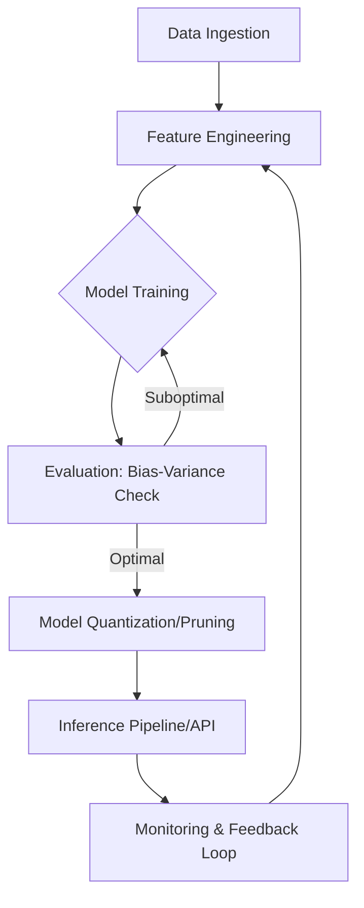

# AI/ML Placement and Career Path Guide

> Securing a top-tier role in AI/ML requires a strategic convergence of rigorous algorithmic foundations, system design proficiency, and practical expertise in modern deep learning frameworks.

## Overview

The landscape for AI/ML roles has evolved from purely academic research positions into highly specialized engineering disciplines. Today, top-tier companies distinguish between **ML Engineers (MLE)**, who focus on the infrastructure and deployment of models; **Research Scientists (RS)**, who drive innovation in model architecture; and **AI Engineers**, who bridge the gap between prompt engineering, agentic workflows, and production systems. Understanding this distinction is the first step toward effective career mapping.

Historically, the field was dominated by statistics and data analysis. However, the paradigm shift toward "Scale is All You Need" has necessitated a transition toward MLOps, distributed systems, and massive-scale data engineering. Whether you are aiming for a residency at a lab like OpenAI or a high-impact infrastructure role at a FAANG company, success is determined not just by your ability to implement a Transformer from scratch, but by your ability to integrate it into a reliable, scalable service.

This guide provides the roadmap to navigating the technical interview gauntlet. From mastering the underlying math of stochastic gradient descent to designing real-time inference pipelines, the following sections synthesize the requirements for competitive placement.

## 2. Visual Intuition
:::demo
<div style="background:#1e1e1e;padding:16px;border-radius:10px;color:#e5e7eb;font-family:system-ui,sans-serif">
  <h3 style="margin:0 0 8px 0;color:#7dd3fc">AI/ML Placement and Career Path Guide - Concept Map</h3>
  <svg width="100%" height="280" viewBox="0 0 640 280" role="img" aria-label="AI/ML Placement and Career Path Guide visual intuition" style="background:#111827;border-radius:8px">
    <rect x="24" y="28" width="180" height="64" rx="10" fill="#1d4ed8" />
    <text x="114" y="66" text-anchor="middle" fill="#e5e7eb" font-size="14">Problem</text>
    <rect x="230" y="28" width="180" height="64" rx="10" fill="#0f766e" />
    <text x="320" y="66" text-anchor="middle" fill="#e5e7eb" font-size="14">Process</text>
    <rect x="436" y="28" width="180" height="64" rx="10" fill="#7c3aed" />
    <text x="526" y="66" text-anchor="middle" fill="#e5e7eb" font-size="14">Outcome</text>

    <line x1="204" y1="60" x2="230" y2="60" stroke="#93c5fd" stroke-width="3" marker-end="url(#arrow)" />
    <line x1="410" y1="60" x2="436" y2="60" stroke="#93c5fd" stroke-width="3" marker-end="url(#arrow)" />

    <rect x="24" y="130" width="592" height="120" rx="10" fill="#0b1220" stroke="#334155" />
    <text x="320" y="156" text-anchor="middle" fill="#cbd5e1" font-size="14">Key intuition for AI/ML Placement and Career Path Guide</text>
    <text x="320" y="182" text-anchor="middle" fill="#94a3b8" font-size="12">Track state changes, constraints, and final behavior.</text>
    <text x="320" y="206" text-anchor="middle" fill="#94a3b8" font-size="12">Use this as a mental model before formal proofs or code.</text>

    <defs>
      <marker id="arrow" markerWidth="10" markerHeight="10" refX="8" refY="3" orient="auto">
        <polygon points="0 0, 10 3, 0 6" fill="#93c5fd" />
      </marker>
    </defs>
  </svg>
  <p style="margin-top:10px;color:#cbd5e1">Interactive-ready visual scaffold for the topic.</p>
</div>
:::
*Caption: An animated visualization of a gradient descent algorithm descending into a global minimum on a complex loss surface, representing the fundamental optimization process in neural network training.*

## Core Theory

The theoretical foundation of machine learning interviews rests on the objective function minimization problem. Given a dataset $D = \{(x_i, y_i)\}_{i=1}^n$, we seek a function $f_\theta$ parametrized by $\theta$ that minimizes an empirical risk:

$$R(\theta) = \frac{1}{n} \sum_{i=1}^n L(f_\theta(x_i), y_i) + \lambda \Omega(\theta)$$

Where:
- $L$ is the loss function (e.g., Cross-Entropy, MSE).
- $\Omega(\theta)$ is the regularization term (e.g., $L_2$ penalty $\frac{1}{2}||\theta||_2^2$).
- $\lambda$ controls the bias-variance tradeoff.

During the training phase, we employ backpropagation, which relies on the chain rule of calculus to compute gradients $\nabla_\theta R(\theta)$. For a composition of functions $f = f_k \circ f_{k-1} \dots \circ f_1$, the gradient of the loss $L$ with respect to a parameter $w$ in layer $j$ is:

$$\frac{\partial L}{\partial w^{(j)}} = \frac{\partial L}{\partial a^{(j)}} \cdot \frac{\partial a^{(j)}}{\partial z^{(j)}} \cdot \frac{\partial z^{(j)}}{\partial w^{(j)}}$$

where $a$ is the activation and $z$ is the linear input. Mastery of these derivations is essential for debugging exploding/vanishing gradients in deep networks.

## Visual Diagram

*The lifecycle of a production-grade ML model: from raw data to continuous improvement loop.*

## Code Example
```python
import numpy as np

# Simple implementation of a single-layer perceptron gradient descent
def train_perceptron(X, y, learning_rate=0.01, epochs=100):
    n_samples, n_features = X.shape
    weights = np.zeros(n_features)
    
    for epoch in range(epochs):
        # Forward pass
        linear_output = np.dot(X, weights)
        predictions = 1 / (1 + np.exp(-linear_output)) # Sigmoid
        
        # Calculate gradients (Binary Cross-Entropy derivative)
        error = predictions - y
        gradient = np.dot(X.T, error) / n_samples
        
        # Update weights
        weights -= learning_rate * gradient
        
    return weights

# Output demonstration
X = np.array([[0, 0], [0, 1], [1, 0], [1, 1]])
y = np.array([0, 0, 0, 1]) # AND gate
final_weights = train_perceptron(X, y)
print(f"Learned Weights: {final_weights}")
# Expected: Learned Weights: [approx 2.5, approx 2.5]
```

## Interactive Demo
:::demo
<!-- title: Gradient Descent 1D Visualizer -->
<!DOCTYPE html>
<html>
<body>
<canvas id="c" width="400" height="200" style="background:#222"></canvas>
<script>
  const canvas = document.getElementById('c');
  const ctx = canvas.getContext('2d');
  let x = -3.5; // Start position
  function draw() {
    ctx.clearRect(0, 0, 400, 200);
    ctx.beginPath();
    ctx.strokeStyle = '#00ffcc';
    for(let i = 0; i < 400; i++) {
       let val = (i-200)/50;
       ctx.lineTo(i, 100 + (val*val*10));
    }
    ctx.stroke();
    x -= 0.1 * (2 * x); // Gradient of x^2 is 2x
    ctx.fillStyle = 'red';
    ctx.arc(200 + x*50, 100 + (x*x*10), 5, 0, Math.PI*2);
    ctx.fill();
    requestAnimationFrame(draw);
  }
  draw();
</script>
</body>
</html>
:::

## Worked Example

**Problem:** Calculate the weight update for a single neuron using a learning rate $\eta=0.1$ and $x=2.0$, target $y=1.0$, and current weight $w=0.5$. Assume a linear activation function $f(z)=z$.

1. **Forward Pass:** $z = w \cdot x = 0.5 \cdot 2.0 = 1.0$. 
2. **Loss (MSE):** $L = \frac{1}{2}(y - \hat{y})^2 = \frac{1}{2}(1 - 1)^2 = 0$. (Wait, let's use a non-zero case).
3. **New case:** Target $y=2.0$. $L = \frac{1}{2}(2.0 - 1.0)^2 = 0.5$.
4. **Gradient:** $\frac{\partial L}{\partial w} = \frac{\partial L}{\partial \hat{y}} \cdot \frac{\partial \hat{y}}{\partial w} = -(y - \hat{y}) \cdot x = -(2.0 - 1.0) \cdot 2.0 = -2.0$.
5. **Update:** $w_{new} = w - \eta \cdot \nabla = 0.5 - 0.1(-2.0) = 0.7$.

## Industry Applications
- **Netflix (Recommendation Systems):** Using multi-armed bandits and deep neural networks to rank content based on user history.
- **Waymo (Autonomous Driving):** Implementing sensor fusion architectures to predict object trajectories in real-time.
- **Meta (Generative AI):** Training Llama models using distributed training (FSDP) and quantization for edge deployment.

## Practice Problems

### Easy
1. Explain the difference between L1 and L2 regularization. *(Hint: Consider the effect on the weight vector magnitude.)*

### Medium
2. Derive the gradient of the Sigmoid function $\sigma(z) = \frac{1}{1+e^{-z}}$. *(Hint: Use the quotient rule.)*
3. Compare the time complexity of Batch Gradient Descent vs. Stochastic Gradient Descent. *(Hint: Look at complexity per iteration relative to training set size $N$.)*

### Hard
4. You are tasked with building a search reranking system that latency-critical. How would you handle a model that takes 500ms to run? *(Hint: Think about knowledge distillation or two-tower architectures.)*

## Interactive Quiz
:::quiz
**Q1:** Which technique best mitigates vanishing gradients in deep networks?
- A) Higher learning rates
- B) Residual connections (Skip connections)
- C) Increasing the depth of the network
- D) Using Sigmoid activations everywhere
> B — Residual connections allow gradients to flow through the network without being multiplied by small weights repeatedly.

**Q2:** What is the space complexity of storing the weights of a fully connected layer with $N$ inputs and $M$ outputs?
- A) $O(N+M)$
- B) $O(N)$
- C) $O(N \times M)$
- D) $O(1)$
> C — A weight matrix of size $N \times M$ is required to map the inputs to the output dimensions.

**Q3:** In a distributed training setting, what is "Gradient All-Reduce"?
- A) A method to compress data before training
- B) A protocol to synchronize gradients across multiple GPUs
- C) A way to reduce the number of epochs
- D) An alternative to backpropagation
> B — It is an operation that aggregates gradients from all workers, averages them, and distributes them back to ensure all nodes have identical weight updates.
:::

## Interview Questions

**Q: Explain the Bias-Variance Tradeoff to a senior engineer.**
*A: The Bias-Variance tradeoff represents the tension between underfitting and overfitting. High bias implies the model is too simple to capture the underlying patterns, while high variance implies the model is overly sensitive to noise in the training set. We optimize the model capacity to find the minimum of the Total Expected Error, balancing the squared bias and the variance.*

**Q: What is the time complexity of the attention mechanism in a Transformer?**
*A: The self-attention mechanism has a time and space complexity of $O(n^2 \cdot d)$, where $n$ is the sequence length and $d$ is the embedding dimension. This is due to the calculation of the $n \times n$ attention matrix $QK^T$.*

**Q: What if your model starts overfitting on a small dataset?**
*A: I would introduce regularization (Dropout, Weight Decay), perform data augmentation, or implement early stopping. If those fail, I would consider a simpler architecture or pre-training on a larger, related dataset (Transfer Learning).*

**Q: How would you design a real-time feature store for ML?**
*A: I would use a low-latency key-value store (like Redis or DynamoDB) for online feature lookup, and an offline storage (like S3/HDFS) for training data. I would ensure point-in-time correctness to prevent data leakage during training, possibly utilizing tools like Feast or Tecton.*

## Key Takeaways
- Bias-variance decomposition is the cornerstone of model tuning.
- Always be prepared to derive basic backpropagation steps manually.
- Distributed training requires understanding communication overheads (All-Reduce).
- MLOps and observability are as important as the model architecture itself.
- Understand the trade-offs of model quantization and latency.

## Common Misconceptions
- ❌ More data is always better. → ✅ Data quality and feature engineering often outperform massive raw datasets.
- ❌ Deep learning is always the right choice. → ✅ Simple models (Random Forests, Logistic Regression) are often more robust and interpretable for tabular data.

## Related Topics
- [[foundations-of-calculus]] — Essential for understanding gradients.
- [[deep-learning-architectures]] — Detailed look at Transformers and CNNs.
- [[mlops-pipelines]] — Scaling models into production.
