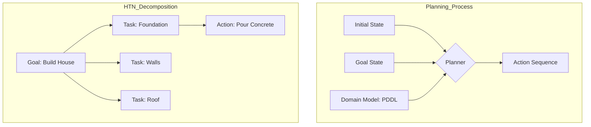

# Automated Planning: STRIPS, PDDL, Hierarchical Task Networks

> Automated planning is the branch of AI concerned with the realization of strategies or action sequences typically for execution by intelligent agents, autonomous robots, and unmanned vehicles.

## Overview
Automated planning addresses the problem of finding a sequence of actions that leads from an initial state to a goal state. Unlike simple search algorithms like A*, which navigate a static graph, planning involves representing the *effects* of actions on the environment's state variables, allowing the agent to "reason" about the future before executing a move.

The field evolved from the early STRIPS (Stanford Research Institute Problem Solver) planner in 1971, which introduced a restricted language for representing states and actions, to PDDL (Planning Domain Definition Language), the industry-standard formalism. Modern planning has expanded into Hierarchical Task Networks (HTNs), which decompose complex high-level goals into smaller sub-tasks, mimicking human problem-solving strategies and enabling the handling of much larger state spaces.

## 2. Visual Intuition
:::demo
<div style="background:#1e1e1e;padding:16px;border-radius:10px;color:#e5e7eb;font-family:system-ui,sans-serif">
  <h3 style="margin:0 0 8px 0;color:#7dd3fc">Automated Planning: STRIPS, PDDL, Hierarchical Task Networks - Concept Map</h3>
  <svg width="100%" height="280" viewBox="0 0 640 280" role="img" aria-label="Automated Planning: STRIPS, PDDL, Hierarchical Task Networks visual intuition" style="background:#111827;border-radius:8px">
    <rect x="24" y="28" width="180" height="64" rx="10" fill="#1d4ed8" />
    <text x="114" y="66" text-anchor="middle" fill="#e5e7eb" font-size="14">Problem</text>
    <rect x="230" y="28" width="180" height="64" rx="10" fill="#0f766e" />
    <text x="320" y="66" text-anchor="middle" fill="#e5e7eb" font-size="14">Process</text>
    <rect x="436" y="28" width="180" height="64" rx="10" fill="#7c3aed" />
    <text x="526" y="66" text-anchor="middle" fill="#e5e7eb" font-size="14">Outcome</text>

    <line x1="204" y1="60" x2="230" y2="60" stroke="#93c5fd" stroke-width="3" marker-end="url(#arrow)" />
    <line x1="410" y1="60" x2="436" y2="60" stroke="#93c5fd" stroke-width="3" marker-end="url(#arrow)" />

    <rect x="24" y="130" width="592" height="120" rx="10" fill="#0b1220" stroke="#334155" />
    <text x="320" y="156" text-anchor="middle" fill="#cbd5e1" font-size="14">Key intuition for Automated Planning: STRIPS, PDDL, Hierarchical Task Networks</text>
    <text x="320" y="182" text-anchor="middle" fill="#94a3b8" font-size="12">Track state changes, constraints, and final behavior.</text>
    <text x="320" y="206" text-anchor="middle" fill="#94a3b8" font-size="12">Use this as a mental model before formal proofs or code.</text>

    <defs>
      <marker id="arrow" markerWidth="10" markerHeight="10" refX="8" refY="3" orient="auto">
        <polygon points="0 0, 10 3, 0 6" fill="#93c5fd" />
      </marker>
    </defs>
  </svg>
  <p style="margin-top:10px;color:#cbd5e1">Interactive-ready visual scaffold for the topic.</p>
</div>
:::
*Caption: A visualization of an agent exploring a state-space graph to reach a goal configuration from an initial state.*

## Core Theory
At the heart of planning is the state-transition system, defined as a tuple $\Sigma = (S, A, \gamma)$, where:
- $S$ is the set of states.
- $A$ is the set of actions.
- $\gamma: S \times A \to S$ is the state transition function.

### STRIPS and PDDL
STRIPS represents states as a set of logical literals (predicates). An action $a$ is defined by:
1. **Preconditions ($pre(a)$):** Literals that must be true in the current state to execute $a$.
2. **Add List ($add(a)$):** Literals to be added to the state.
3. **Delete List ($del(a)$):** Literals to be removed from the state.

The transition function for an action $a$ in state $s$ is:
$$\gamma(s, a) = (s \setminus del(a)) \cup add(a)$$

### Hierarchical Task Networks (HTN)
HTNs do not search in the space of states, but in the space of *task decompositions*. A domain consists of:
- **Primitive Tasks:** Directly executable actions.
- **Compound Tasks:** Complex tasks that can be broken down into sub-tasks via **Methods**.
- **Methods:** A recipe $(T, \text{preconditions}, \text{subtasks})$ for achieving a compound task $T$.

## Visual Diagram

*The planning process mapping a domain to a sequence of actions vs. HTN decomposition.*

## Code Example
```python
# Simple STRIPS-like planner in Python
class State:
    def __init__(self, predicates):
        self.predicates = set(predicates)

    def is_goal(self, goal_set):
        return goal_set.issubset(self.predicates)

class Action:
    def __init__(self, name, pre, add, delete):
        self.name, self.pre, self.add, self.delete = name, pre, add, delete

    def apply(self, state):
        if self.pre.issubset(state.predicates):
            new_preds = (state.predicates - self.delete) | self.add
            return State(new_preds)
        return None

# Problem: Move block A from table to on top of B
actions = [
    Action("stack", {"holding_A", "clear_B"}, {"on_A_B"}, {"holding_A", "clear_B"}),
    Action("pickup", {"clear_A", "on_table_A"}, {"holding_A"}, {"clear_A", "on_table_A"})
]
initial = State({"clear_A", "on_table_A", "clear_B"})
goal = {"on_A_B"}

# Simple BFS search
queue = [(initial, [])]
while queue:
    curr, path = queue.pop(0)
    if curr.is_goal(goal):
        print(f"Plan found: {[a.name for a in path]}")
        break
    for a in actions:
        next_state = a.apply(curr)
        if next_state:
            queue.append((next_state, path + [a]))

# Expected Output: Plan found: ['pickup', 'stack']
```

## Interactive Demo
:::demo
<!DOCTYPE html>
<html>
<body>
<div id="viz">Click 'Plan' to animate block movement</div>
<button onclick="runPlan()">Plan</button>
<script>
  function runPlan() {
    const viz = document.getElementById('viz');
    viz.innerHTML = "State 1: [A, B] | State 2: A is held | State 3: [A on B]";
  }
</script>
</body>
</html>
:::

## Worked Example
Given:
- Initial state: {At(Robot, RoomA), Empty(Gripper)}
- Goal: {At(Robot, RoomB), Has(Robot, Parcel)}
- Action Move(x, y): Pre: {At(Robot, x)}, Add: {At(Robot, y)}, Del: {At(Robot, x)}
- Action Pick(p): Pre: {At(Robot, RoomA), At(Parcel, RoomA)}, Add: {Has(Robot, Parcel)}, Del: {}

**Step 1:** Initial State $S_0 = \{At(R, A), At(P, A), Empty\}$
**Step 2:** Pick(P) applicable? Yes. $S_1 = \gamma(S_0, Pick) = \{At(R, A), At(P, A), Has(R, P)\}$
**Step 3:** Move(A, B) applicable? Yes. $S_2 = \gamma(S_1, Move) = \{At(R, B), Has(R, P)\}$
Goal reached. Plan: [Pick(P), Move(A, B)]

## Industry Applications
- **Amazon (Robotics)**: Warehouse path planning for Kiva robots using PDDL to optimize product retrieval.
- **NASA (Space Exploration)**: Autonomous rover navigation (e.g., Mars Curiosity) using constraint-based temporal planning.
- **DeepMind (Game AI)**: Using hierarchical planning combined with RL to master StarCraft II.

## Practice Problems
### Easy
1. Define the difference between the "Add" and "Delete" lists in STRIPS. *(Hint: Think about state updates.)*

### Medium
2. Explain the "Frame Problem" in symbolic planning. *(Hint: How do we know what *doesn't* change?)*
3. Given a state and a set of actions, draw the search tree for a 3-block stacking problem.

### Hard
4. Implement a forward-chaining planner that handles action costs and finds the optimal (cheapest) plan.

## Interactive Quiz
:::quiz
**Q1:** What is the primary purpose of HTN planning?
- A) To increase the search speed of A*
- B) To decompose complex tasks into sub-tasks via methods
- C) To remove the need for PDDL definitions
- D) To create a neural network for planning
> B — HTN planning breaks down high-level complex tasks using a hierarchy of methods, which is more efficient for large-scale problem solving than flat-state searching.

**Q2:** In PDDL, what is the significance of the "Delete" list?
- A) It removes illegal states from the domain
- B) It identifies which literals must be false before an action is executed
- C) It specifies which literals are no longer true after an action is applied
- D) It identifies which actions are impossible
> C — The delete list explicitly handles the "frame problem" by defining which predicates are retracted upon an action's execution.

**Q3:** Which of these is a common limitation of classic STRIPS planning?
- A) It cannot handle logical variables
- B) It struggles with continuous time and uncertainty
- C) It requires all actions to have identical costs
- D) It is only compatible with deterministic environments
> B — Classic STRIPS is highly restricted to deterministic, discrete, and static environments; it lacks native support for temporal constraints or probabilistic outcomes.
:::

## Interview Questions

**Q: Explain automated planning to a senior engineer.**
*A: Automated planning is essentially searching in a state-space graph where nodes are world states and edges are actions. We formalize this using PDDL, which treats state changes as logical sets (Add/Delete lists). For complex production environments, we shift to HTNs to decompose large goals, effectively turning a global search into a recursive refinement process.*

**Q: Complexity of finding a plan in STRIPS?**
*A: Deciding if a plan exists in STRIPS is PSPACE-complete. The state space is exponential in the number of fluents (predicates), $2^n$, where $n$ is the number of propositions.*

**Q: How do you handle non-deterministic actions?**
*A: Move to Markov Decision Processes (MDPs) or Partially Observable MDPs (POMDPs) where actions return a distribution over states rather than a single resulting state.*

**Q: How does planning fit into a robotics pipeline?**
*A: Planning provides the "High-Level" logic (what to do), while a separate Motion Planner (e.g., RRT*) handles the "Low-Level" geometric trajectories (how to move the joints).*

## Key Takeaways
- Planning is search over state transitions.
- STRIPS represents effects via Add/Delete sets.
- PDDL is the industry standard for modeling domains.
- HTNs decompose tasks into sub-tasks for efficiency.
- Classical planning assumes determinism and full observability.
- The Frame Problem is solved by explicitly stating what changes.

## Common Misconceptions
- ❌ STRIPS is just a database query → ✅ STRIPS is a generative search process.
- ❌ Planning is the same as Reinforcement Learning → ✅ Planning uses a model of the world; RL learns the model (or policy) via trial and error.

## Related Topics
- [[search-algorithms]] — Basis for state-space exploration.
- [[markov-decision-processes]] — Planning under uncertainty.
- [[robotics-control]] — Executing the plan in physical space.
- [[logic-programming]] — Foundation for symbolic representation.
