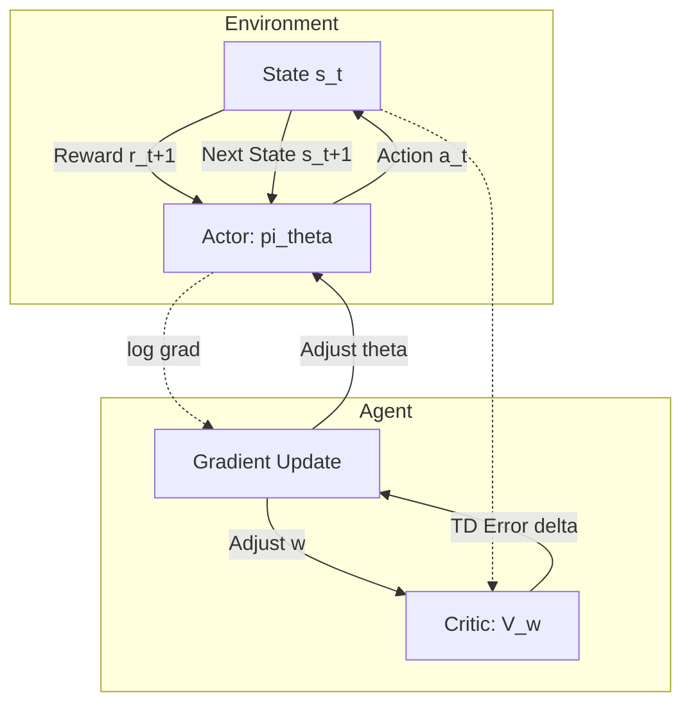

# Policy Gradient Methods: REINFORCE and Actor-Critic Architectures

> Policy Gradient methods optimize the parameters of a stochastic policy directly by performing gradient ascent on the expected return, bypassing the need for a separate value function to derive action selection.

## 1. Historical Background & Motivation

In the early decades of Reinforcement Learning (RL), the dominant paradigm was **Value-Based Learning**, exemplified by Q-Learning and SARSA. These methods rely on the Bellman equation to estimate the value of states or state-action pairs. However, value-based methods face significant hurdles in continuous action spaces (where finding the $\max Q(s, a)$ becomes a non-trivial optimization problem) and in environments requiring stochastic policies (such as Rock-Paper-Scissors, where any deterministic strategy is exploitable).

The breakthrough came in 1992 with Ronald Williams’s **REINFORCE** algorithm, which provided a mathematically rigorous way to compute gradients of the expected reward with respect to policy parameters. This was further solidified by the **Policy Gradient Theorem** (Sutton et al., 1999), which proved that the gradient of the performance measure does not depend on the derivative of the state distribution—a result that simplified the computation immensely. In the modern era, Policy Gradient methods form the backbone of state-of-the-art systems like OpenAI’s PPO (used for GPT-4 RLHF) and DeepMind’s AlphaStar, offering a more stable and direct path to learning complex behaviors in high-dimensional spaces.

## 2. Visual Intuition
:::demo
<div style="background:#1e1e1e;padding:16px;border-radius:10px;color:#e5e7eb;font-family:system-ui,sans-serif">
  <h3 style="margin:0 0 8px 0;color:#7dd3fc">Policy Gradient Methods: REINFORCE and Actor-Critic Architectures - Concept Map</h3>
  <svg width="100%" height="280" viewBox="0 0 640 280" role="img" aria-label="Policy Gradient Methods: REINFORCE and Actor-Critic Architectures visual intuition" style="background:#111827;border-radius:8px">
    <rect x="24" y="28" width="180" height="64" rx="10" fill="#1d4ed8" />
    <text x="114" y="66" text-anchor="middle" fill="#e5e7eb" font-size="14">Problem</text>
    <rect x="230" y="28" width="180" height="64" rx="10" fill="#0f766e" />
    <text x="320" y="66" text-anchor="middle" fill="#e5e7eb" font-size="14">Process</text>
    <rect x="436" y="28" width="180" height="64" rx="10" fill="#7c3aed" />
    <text x="526" y="66" text-anchor="middle" fill="#e5e7eb" font-size="14">Outcome</text>

    <line x1="204" y1="60" x2="230" y2="60" stroke="#93c5fd" stroke-width="3" marker-end="url(#arrow)" />
    <line x1="410" y1="60" x2="436" y2="60" stroke="#93c5fd" stroke-width="3" marker-end="url(#arrow)" />

    <rect x="24" y="130" width="592" height="120" rx="10" fill="#0b1220" stroke="#334155" />
    <text x="320" y="156" text-anchor="middle" fill="#cbd5e1" font-size="14">Key intuition for Policy Gradient Methods: REINFORCE and Actor-Critic Architectures</text>
    <text x="320" y="182" text-anchor="middle" fill="#94a3b8" font-size="12">Track state changes, constraints, and final behavior.</text>
    <text x="320" y="206" text-anchor="middle" fill="#94a3b8" font-size="12">Use this as a mental model before formal proofs or code.</text>

    <defs>
      <marker id="arrow" markerWidth="10" markerHeight="10" refX="8" refY="3" orient="auto">
        <polygon points="0 0, 10 3, 0 6" fill="#93c5fd" />
      </marker>
    </defs>
  </svg>
  <p style="margin-top:10px;color:#cbd5e1">Interactive-ready visual scaffold for the topic.</p>
</div>
:::
*Caption: The fundamental RL loop where the Agent (Policy) interacts with the Environment. Policy Gradient methods adjust the 'Actor' (the decision-making logic) based on the observed rewards, effectively 'pushing up' the probability of actions that lead to higher returns.*

## 3. Core Theory & Mathematical Foundations

Unlike value-based methods that learn $Q(s, a)$ and select $a = \arg\max Q(s, a)$, Policy Gradient (PG) methods parameterize the policy $\pi_\theta(a|s)$ directly. We define a performance objective $J(\theta)$, typically the expected discounted return:

$$J(\theta) = \mathbb{E}_{\pi_\theta} \left[ \sum_{t=0}^{\infty} \gamma^t r_t \right]$$

Our goal is to find $\theta^* = \arg\max_\theta J(\theta)$ using gradient ascent: $\theta_{t+1} = \theta_t + \alpha \nabla_\theta J(\theta)$.

### 3.1 The Policy Gradient Theorem
The central challenge is that the expected reward depends on both the actions chosen (controlled by $\theta$) and the distribution of states visited (which depends on $\theta$ in a complex, indirect way). The **Policy Gradient Theorem** elegantly solves this:

$$\nabla_\theta J(\theta) \propto \sum_{s \in \mathcal{S}} \mu(s) \sum_{a \in \mathcal{A}} q_\pi(s, a) \nabla_\theta \pi_\theta(a|s)$$

Where $\mu(s)$ is the on-policy distribution under $\pi_\theta$. Using the "log-derivative trick" (based on the identity $\nabla \log x = \frac{\nabla x}{x}$), we can rewrite this as an expectation suitable for Monte Carlo sampling:

$$\nabla_\theta J(\theta) = \mathbb{E}_{\pi_\theta} [G_t \nabla_\theta \log \pi_\theta(a_t|s_t)]$$

Here, $G_t$ is the return (total accumulated reward). This is the foundation of the **REINFORCE** algorithm.

### 3.2 Variance Reduction and Baselines
The REINFORCE estimator, while unbiased, suffers from extremely high variance. Because $G_t$ is a random variable dependent on an entire trajectory, a single "lucky" or "unlucky" sequence can lead to massive, noisy updates. To mitigate this, we subtract a **baseline** $b(s)$ that does not depend on action $a$:

$$\nabla_\theta J(\theta) = \mathbb{E}_{\pi_\theta} [(G_t - b(s_t)) \nabla_\theta \log \pi_\theta(a_t|s_t)]$$

A common choice for $b(s_t)$ is the state-value function $V^\pi(s_t)$. This modification reduces variance without introducing bias, as $\mathbb{E}[\nabla_\theta \log \pi_\theta(a|s) \cdot b(s)] = 0$.

### 3.3 Actor-Critic Architectures
To further improve stability, we replace the Monte Carlo return $G_t$ with a learned value estimate. This leads to the **Actor-Critic** framework:
1.  **The Actor**: Updates the policy $\pi_\theta(a|s)$ in the direction suggested by the Critic.
2.  **The Critic**: Estimates the value function $V_w(s)$ or $Q_w(s, a)$ to evaluate the Actor's actions.

The update usually employs the **Advantage Function** $A(s, a) = Q(s, a) - V(s)$. The gradient becomes:
$$\nabla_\theta J(\theta) \approx \sum_t \nabla_\theta \log \pi_\theta(a_t|s_t) \hat{A}(s_t, a_t)$$

### 3.4 Formal Analysis (Complexity / Correctness)
**Convergence:** Policy gradient methods are guaranteed to converge to a local optimum under standard stochastic approximation conditions (Robbins-Monro). Unlike Q-Learning, they do not suffer from the "chatter" or divergence issues associated with off-policy value function approximation (the "Deadly Triad").

**Complexity:** 
- **Time Complexity:** $O(T \cdot (|\theta| + |w|))$ per episode, where $T$ is the horizon, $|\theta|$ is the number of policy parameters, and $|w|$ is the number of critic parameters.
- **Space Complexity:** $O(|\theta| + |w|)$ to store the weights.

## 4. Algorithm / Process: REINFORCE

The REINFORCE algorithm (Monte Carlo Policy Gradient) follows these steps:

1.  **Initialize** policy parameters $\theta$ arbitrarily.
2.  **Generate an episode** $s_0, a_0, r_1, \dots, s_{T-1}, a_{T-1}, r_T$ by following policy $\pi_\theta$.
3.  **Loop for each step** $t = 0, 1, \dots, T-1$ in the episode:
    *   Calculate the return $G_t = \sum_{k=t+1}^{T} \gamma^{k-t-1} r_k$.
    *   Update parameters: $\theta \leftarrow \theta + \alpha \gamma^t G_t \nabla_\theta \log \pi_\theta(a_t|s_t)$.
4.  **Repeat** until $\theta$ converges.

In the **Actor-Critic** variant, we update $\theta$ at *every step* using the TD-error $\delta_t = r_{t+1} + \gamma V_w(s_{t+1}) - V_w(s_t)$ instead of waiting for the end of the episode to calculate $G_t$.

## 5. Visual Diagram


*Caption: The Actor-Critic interaction loop. The Actor produces actions, the Critic evaluates them using the state signal, and the resulting error signal (delta) optimizes both components simultaneously.*

## 6. Implementation

### 6.1 Core Implementation (REINFORCE with PyTorch)

```python
import torch
import torch.nn as nn
import torch.optim as optim
import numpy as np

class PolicyNetwork(nn.Module):
    """
    A simple MLP for a discrete action space.
    Complexity: O(H) where H is hidden layer size.
    """
    def __init__(self, state_dim, action_dim, hidden_dim=128):
        super(PolicyNetwork, self).__init__()
        self.network = nn.Sequential(
            nn.Linear(state_dim, hidden_dim),
            nn.ReLU(),
            nn.Linear(hidden_dim, action_dim),
            nn.Softmax(dim=-1)
        )

    def forward(self, x):
        return self.network(x)

def train_reinforce(env, policy, optimizer, gamma=0.99):
    """
    Standard REINFORCE implementation.
    Returns the total reward for the episode.
    """
    log_probs = []
    rewards = []
    state = env.reset()
    
    # 1. Generate Episode
    done = False
    while not done:
        state_t = torch.from_numpy(state).float()
        probs = policy(state_t)
        action_dist = torch.distributions.Categorical(probs)
        action = action_dist.sample()
        
        log_probs.append(action_dist.log_prob(action))
        state, reward, done, _ = env.step(action.item())
        rewards.append(reward)

    # 2. Calculate Returns (G_t)
    returns = []
    G = 0
    for r in reversed(rewards):
        G = r + gamma * G
        returns.insert(0, G)
    
    returns = torch.tensor(returns)
    # Standardize returns for variance reduction
    returns = (returns - returns.mean()) / (returns.std() + 1e-9)

    # 3. Policy Update
    policy_loss = []
    for log_prob, Gt in zip(log_probs, returns):
        policy_loss.append(-log_prob * Gt)
    
    optimizer.zero_grad()
    sum(policy_loss).backward()
    optimizer.step()
    
    return sum(rewards)

# Sample Usage:
# env = gym.make('CartPole-v1')
# policy = PolicyNetwork(4, 2)
# optimizer = optim.Adam(policy.parameters(), lr=1e-2)
# reward = train_reinforce(env, policy, optimizer)
```

### 6.2 Optimized Variant: Advantage Actor-Critic (A2C)
In production, synchronous or asynchronous Actor-Critic (A3C/A2C) is preferred over vanilla REINFORCE.

```python
class ActorCritic(nn.Module):
    def __init__(self, state_dim, action_dim):
        super(ActorCritic, self).__init__()
        self.affine = nn.Linear(state_dim, 128)
        self.actor = nn.Linear(128, action_dim)
        self.critic = nn.Linear(128, 1)

    def forward(self, x):
        x = torch.relu(self.affine(x))
        # Actor: policy distribution
        action_probs = torch.softmax(self.actor(x), dim=-1)
        # Critic: state value V(s)
        state_values = self.critic(x)
        return action_probs, state_values

# Optimization logic uses:
# Loss = Policy_Loss (Advantage) + Value_Loss (MSE) - Entropy_Bonus
```

### 6.3 Common Pitfalls in Code
*   **Vanishing Gradients:** In deep architectures, $\nabla \log \pi$ can become very small. Use gradient clipping.
*   **Premature Convergence:** Stochastic policies can collapse into deterministic ones too early. Add an **Entropy Bonus** to the loss function to encourage exploration.
*   **Credit Assignment:** Incorrectly calculating $G_t$ (e.g., forgetting the discount factor $\gamma$) will lead to biased gradients.

## 7. Interactive Demo

:::demo
<!-- title: Policy Gradient Visualizer (REINFORCE) -->
<!DOCTYPE html>
<html>
<head>
<style>
  body { margin:0; background:#1a1b26; color:#cfc9c2; font-family: monospace; overflow: hidden; }
  canvas { display: block; margin: 20px auto; border: 2px solid #414868; }
  .controls { text-align: center; padding: 10px; }
  button { background: #7aa2f7; border: none; color: #1a1b26; padding: 5px 15px; cursor: pointer; font-weight: bold; }
  .stats { position: absolute; top: 10px; left: 10px; background: rgba(0,0,0,0.5); padding: 10px; }
</style>
</head>
<body>
<div class="stats">
    Episode: <span id="ep">0</span><br>
    Avg Reward: <span id="rew">0</span><br>
    Policy ($\theta$): <span id="theta">0.50</span>
</div>
<div class="controls">
    <button onclick="togglePause()">Play/Pause</button>
    <button onclick="resetSim()">Reset</button>
</div>
<canvas id="pgCanvas" width="600" height="300"></canvas>
<script>
    const canvas = document.getElementById('pgCanvas');
    const ctx = canvas.getContext('2d');
    let epCount = 0;
    let totalRew = 0;
    let theta = 0.5; // Probability of going RIGHT
    let paused = false;

    class Agent {
        constructor() {
            this.reset();
        }
        reset() {
            this.x = 300;
            this.y = 150;
            this.history = [];
            this.done = false;
        }
        step() {
            if (this.done) return;
            const action = Math.random() < theta ? 1 : -1;
            this.history.push({x: this.x, action: action});
            this.x += action * 20;
            if (this.x <= 50 || this.x >= 550) this.done = true;
        }
    }

    let agent = new Agent();

    function draw() {
        ctx.clearRect(0, 0, canvas.width, canvas.height);
        
        // Draw boundaries (targets)
        ctx.fillStyle = "#f7768e"; ctx.fillRect(0, 0, 50, 300); // LEFT: BAD
        ctx.fillStyle = "#9ece6a"; ctx.fillRect(550, 0, 50, 300); // RIGHT: GOOD
        
        // Draw Agent
        ctx.fillStyle = "#7aa2f7";
        ctx.beginPath();
        ctx.arc(agent.x, agent.y, 10, 0, Math.PI*2);
        ctx.fill();

        if (!paused) {
            agent.step();
            if (agent.done) {
                // Policy Update (REINFORCE)
                const reward = agent.x >= 550 ? 1 : -1;
                totalRew = totalRew * 0.9 + reward * 0.1;
                
                // Gradient ascent on theta
                // Gradient of log(prob) is 1/theta for right, -1/(1-theta) for left
                agent.history.forEach(step => {
                    const grad = step.action === 1 ? 1/theta : -1/(1-theta);
                    theta += 0.01 * reward * grad;
                });
                theta = Math.max(0.1, Math.min(0.9, theta));
                
                epCount++;
                document.getElementById('ep').innerText = epCount;
                document.getElementById('rew').innerText = totalRew.toFixed(2);
                document.getElementById('theta').innerText = theta.toFixed(2);
                agent.reset();
            }
        }
        requestAnimationFrame(draw);
    }

    function togglePause() { paused = !paused; }
    function resetSim() { epCount=0; totalRew=0; theta=0.5; agent.reset(); }
    draw();
</script>
</body>
</html>
:::

## 8. Worked Examples

### Example 1 — Basic Gradient Update
Consider a simple discrete environment where an agent can move Left (L) or Right (R).
1.  **State**: $s_0$.
2.  **Current Policy**: $\pi_\theta(R|s_0) = 0.7$, $\pi_\theta(L|s_0) = 0.3$.
3.  **Episode**: Agent takes action $a_0 = R$ and receives return $G_0 = +10$.
4.  **Gradient Calculation**:
    *   Using the log-derivative: $\nabla_\theta \log \pi_\theta(R|s_0) = \frac{1}{\pi_\theta(R|s_0)} \nabla_\theta \pi_\theta(R|s_0)$.
    *   If $\pi_\theta(R|s_0) = \sigma(\theta)$, then $\nabla_\theta \log \pi_\theta = 1 - \pi_\theta$.
    *   Update: $\theta \leftarrow \theta + \alpha (10) (1 - 0.7) = \theta + 3\alpha$.
5.  **Result**: The probability of picking "Right" increases in the next iteration.

### Example 2 — Advantage Actor-Critic
Suppose $V_w(s_t) = 5.0$. The agent takes action $a_t$, receives $r_{t+1}=2$, and moves to $s_{t+1}$ where $V_w(s_{t+1}) = 4.0$.
*   **TD-Target**: $r_{t+1} + \gamma V(s_{t+1}) = 2 + 0.9(4.0) = 5.6$.
*   **Advantage**: $\hat{A} = 5.6 - 5.0 = 0.6$.
*   The Actor update uses $+0.6$ to scale the gradient, meaning the action was "better than expected."
*   The Critic update reduces the error $(5.6 - 5.0)^2 = 0.36$.

## 9. Comparison with Alternatives

| Approach | Type | Variance | Bias | Best Used When |
|---|---|---|---|---|
| **DQN** | Value-based | Low | High | Discrete action spaces, off-policy learning needed. |
| **REINFORCE** | Policy-based | High | Zero | Simple environments, need stochasticity. |
| **Actor-Critic** | Hybrid | Medium | Low | Large/Continuous action spaces, real-time updates. |
| **PPO** | Policy-based | Low | Low | State-of-the-art general RL (robotics, LLMs). |

## 10. Industry Applications & Real Systems

-   **OpenAI (Large Language Models)**: Proximal Policy Optimization (PPO), a robust Actor-Critic variant, is the standard for RL from Human Feedback (RLHF) to align GPT-4 with human preferences.
-   **Netflix (Recommendation Systems)**: Policy gradients are used to optimize the "slate" of movies shown to users, directly maximizing the long-term session reward rather than just click-through rate.
-   **DeepMind (AlphaStar)**: Used multi-agent Actor-Critic architectures to master the game of StarCraft II, handling a massive action space that is impossible for Q-learning.
-   **Waymo (Autonomous Driving)**: Employs policy gradients for motion planning, allowing the vehicle to learn smooth, human-like steering trajectories in complex urban environments.

## 11. Practice Problems

### 🟢 Easy
1.  **Likelihood Ratio derivation**: Prove that $\mathbb{E}_{x \sim p_\theta} [\nabla_\theta \log p_\theta(x)] = 0$.
    *Hint: Use the integral definition of expectation and the fact that $\int p_\theta(x)dx = 1$.*
    *Expected complexity: $O(1)$ derivation steps.*

### 🟡 Medium
2.  **Baseline Neutrality**: Show that adding a baseline $b(s)$ that does not depend on action $a$ does not change the expected value of the policy gradient.
    *Hint: Use the result from Problem 1.*
    *Expected complexity: $O(1)$ derivation.*

3.  **Entropy Bonus**: Calculate the gradient of the entropy $H(\pi_\theta) = -\sum \pi(a) \log \pi(a)$ with respect to $\theta$. How does this affect exploration?

### 🔴 Hard
4.  **Generalized Advantage Estimation (GAE)**: Derive the GAE formula $\hat{A}_t^{GAE} = \sum_{l=0}^\infty (\gamma \lambda)^l \delta_{t+l}$. Discuss how the parameter $\lambda$ manages the bias-variance trade-off.
    *Hint: Relate this to TD($\lambda$).*

5.  **Policy Collapse**: In a environment with two actions, if action A gives reward $+100$ and action B gives $+101$, explain why vanilla REINFORCE might take a long time to distinguish between them, and how centering the rewards helps.

## 12. Interactive Quiz

:::quiz
**Q1: What is the primary advantage of Policy Gradient methods over Value-based methods like DQN?**
- A) They are always more sample efficient.
- B) They can naturally handle continuous and stochastic action spaces.
- C) They do not require neural networks.
- D) They converge to the global optimum faster.
> B — Q-learning requires a max over actions, which is hard in continuous spaces. Policy gradients parameterize the policy directly, handling continuous distributions easily.

**Q2: Why do we use the "Log-Derivative Trick" in REINFORCE?**
- A) To turn the gradient of an expectation into an expectation of a gradient.
- B) To make the rewards smaller.
- C) To avoid using backpropagation.
- D) To calculate the value function.
> A — It allows us to sample trajectories and compute the gradient estimate without knowing the environment's transition dynamics.

**Q3: What role does the Critic play in an Actor-Critic architecture?**
- A) It selects the best action to take.
- B) It reduces the learning rate of the actor.
- C) It provides a baseline (value estimate) to reduce variance in the actor's gradient.
- D) It stores the replay buffer.
> C — By estimating $V(s)$, the Critic provides a reference point (baseline) that makes the Actor's updates much more stable.

**Q4: Which of the following is an unbiased estimator of the policy gradient?**
- A) REINFORCE with no baseline.
- B) REINFORCE with a state-dependent baseline.
- C) TD-Actor-Critic (bootstrapping).
- D) Both A and B.
> D — Adding a state-dependent baseline reduces variance but keeps the estimator unbiased. Bootstrapping (C) introduces bias.

**Q5: What happens if the entropy of the policy becomes zero too quickly?**
- A) The agent has found the optimal policy.
- B) The agent may get stuck in a local optimum (premature convergence).
- C) The learning rate will automatically increase.
- D) The variance of the gradient will increase.
> B — Low entropy means the policy is deterministic. If it becomes deterministic before exploring enough, it misses better rewards.
:::

## 13. Interview Preparation

### Conceptual Questions
**Q: Explain the difference between REINFORCE and Actor-Critic.**
*A: REINFORCE is a Monte Carlo method that waits until the end of an episode to calculate returns and perform an update. This makes it unbiased but high-variance. Actor-Critic uses "bootstrapping"—it uses a learned value estimate (Critic) to update the policy (Actor) at every step. This reduces variance and allows for online learning but introduces bias because the Critic's initial estimates are likely wrong.*

**Q: What is the "Deadly Triad" in RL, and do Policy Gradients suffer from it?**
*A: The Deadly Triad consists of Function Approximation, Bootstrapping, and Off-policy learning. When all three are present, value-based methods can diverge. Policy Gradient methods (specifically on-policy ones like REINFORCE or A2C) avoid this by remaining on-policy, making them more stable when using deep neural networks.*

**Q: How do you handle continuous action spaces in PG?**
*A: Instead of outputting probabilities for discrete actions, the neural network outputs the parameters of a distribution—for example, the mean $\mu$ and standard deviation $\sigma$ of a Gaussian. We then sample an action from $\mathcal{N}(\mu, \sigma)$ and use the log-probability of that sample for the gradient update.*

### Quick Reference (Cheat Sheet)
| Property | Value |
|---|---|
| Gradient Estimate | $\mathbb{E} [\nabla \log \pi \cdot \text{Signal}]$ |
| Variance Reduction | Baselines, Critic, GAE |
| Typical Objective | Maximize Expected Discounted Return |
| Convergence | Local Optimum (Stochastic Gradient Ascent) |

## 14. Key Takeaways
1.  **Direct Optimization**: PG methods optimize what we actually care about: the policy.
2.  **The Log-Prob Trick**: Essential for computing gradients of expectations without knowing the underlying distribution's derivative.
3.  **Variance is the Enemy**: Pure Monte Carlo (REINFORCE) is noisy; Actor-Critic and Baselines are the industry-standard solutions.
4.  **Stochasticity**: PG methods can learn optimal stochastic policies (crucial for POMDPs and Game Theory).
5.  **RLHF**: Policy gradients (PPO) are the core technology behind aligning modern LLMs.

## 15. Common Misconceptions
- ❌ **"Policy gradients always find the global optimum."** → ✅ **Fact**: Like all gradient-based methods in non-convex spaces, they only guarantee convergence to a local optimum.
- ❌ **"The Critic is the one taking actions."** → ✅ **Fact**: The Actor selects actions; the Critic only evaluates the current state or state-action pair to help the Actor learn.
- ❌ **"High variance in REINFORCE can be solved by just increasing the learning rate."** → ✅ **Fact**: Increasing the learning rate with high variance will likely lead to total instability and policy collapse. Variance reduction (baselines) is the correct path.

## 16. Further Reading
- *Reinforcement Learning: An Introduction* by Sutton and Barto (Chapter 13).
- *Algorithms for Reinforcement Learning* by Csaba Szepesvári.
- *Policy Gradient Methods for Reinforcement Learning with Function Approximation* (Sutton et al., 1999) — The seminal paper.
- *High-Dimensional Continuous Control Using Generalized Advantage Estimation* (Schulman et al., 2016).

## 17. Related Topics
- [[monte-carlo-tree-search]] — Used in AlphaZero alongside policy networks.
- [[local-search-optimization]] — Policy gradients are a form of stochastic local search.
- [[temporal-logic]] — Used for specifying complex reward conditions.
- [[alpha-beta-enhancements]] — Competitive with RL in perfect-information games.
