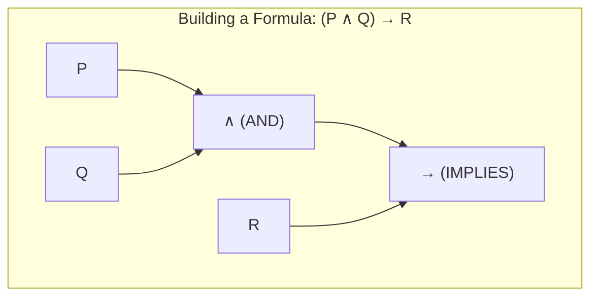

# Propositional Logic

> Propositional logic is the branch of logic that studies ways of joining and/or modifying entire propositions, statements or sentences to form more complicated propositions, statements or sentences.

## Overview
Propositional logic, also known as sentential logic, is a simple form of logic that deals with propositions (statements that can be either true or false) and the relationships between them. It is a fundamental tool for knowledge representation and reasoning in artificial intelligence. In propositional logic, complex sentences are built from simpler ones using logical connectives like "AND", "OR", "NOT", and "IMPLIES".

The main goal of propositional logic is to determine the truth value of complex sentences based on the truth values of their constituent parts. This allows us to reason about the world and draw logical conclusions. For example, if we know that "It is raining" is true and "If it is raining, then the ground is wet" is true, we can conclude that "The ground is wet" is also true. This process of inference is central to many AI systems.

## 2. Visual Intuition
:::demo
<div style="background:#1e1e1e;padding:16px;border-radius:10px;color:#e5e7eb;font-family:system-ui,sans-serif">
  <h3 style="margin:0 0 8px 0;color:#7dd3fc">Propositional Logic - Concept Map</h3>
  <svg width="100%" height="280" viewBox="0 0 640 280" role="img" aria-label="Propositional Logic visual intuition" style="background:#111827;border-radius:8px">
    <rect x="24" y="28" width="180" height="64" rx="10" fill="#1d4ed8" />
    <text x="114" y="66" text-anchor="middle" fill="#e5e7eb" font-size="14">Problem</text>
    <rect x="230" y="28" width="180" height="64" rx="10" fill="#0f766e" />
    <text x="320" y="66" text-anchor="middle" fill="#e5e7eb" font-size="14">Process</text>
    <rect x="436" y="28" width="180" height="64" rx="10" fill="#7c3aed" />
    <text x="526" y="66" text-anchor="middle" fill="#e5e7eb" font-size="14">Outcome</text>

    <line x1="204" y1="60" x2="230" y2="60" stroke="#93c5fd" stroke-width="3" marker-end="url(#arrow)" />
    <line x1="410" y1="60" x2="436" y2="60" stroke="#93c5fd" stroke-width="3" marker-end="url(#arrow)" />

    <rect x="24" y="130" width="592" height="120" rx="10" fill="#0b1220" stroke="#334155" />
    <text x="320" y="156" text-anchor="middle" fill="#cbd5e1" font-size="14">Key intuition for Propositional Logic</text>
    <text x="320" y="182" text-anchor="middle" fill="#94a3b8" font-size="12">Track state changes, constraints, and final behavior.</text>
    <text x="320" y="206" text-anchor="middle" fill="#94a3b8" font-size="12">Use this as a mental model before formal proofs or code.</text>

    <defs>
      <marker id="arrow" markerWidth="10" markerHeight="10" refX="8" refY="3" orient="auto">
        <polygon points="0 0, 10 3, 0 6" fill="#93c5fd" />
      </marker>
    </defs>
  </svg>
  <p style="margin-top:10px;color:#cbd5e1">Interactive-ready visual scaffold for the topic.</p>
</div>
:::
*Caption: A Hasse diagram illustrating the relationships between the 16 binary logical connectives.*

## Core Theory
The core of propositional logic consists of its syntax and semantics.

**Syntax:**
The syntax of propositional logic defines the rules for building well-formed formulas (sentences). The basic building blocks are:
-   **Propositional Symbols (Atoms):** `P`, `Q`, `R`, etc. These represent simple propositions.
-   **Logical Connectives:**
    -   `¬` (Negation): NOT
    -   `∧` (Conjunction): AND
    -   `∨` (Disjunction): OR
    -   `→` (Implication): IF...THEN
    -   `↔` (Biconditional): IF AND ONLY IF

**Semantics:**
The semantics of propositional logic define the meaning of sentences. The truth value of a sentence is determined by the truth values of its propositional symbols and the meaning of the connectives. This is often represented using truth tables.

| P | Q | ¬P | P ∧ Q | P ∨ Q | P → Q | P ↔ Q |
|---|---|----|-------|-------|-------|-------|
| F | F | T  | F     | F     | T     | T     |
| F | T | T  | F     | T     | T     | F     |
| T | F | F  | F     | T     | F     | F     |
| T | T | F  | T     | T     | T     | T     |

**Inference:**
Inference is the process of deriving new sentences from a knowledge base (a set of sentences that are known to be true). Common inference rules include:
-   **Modus Ponens:** If we have `P → Q` and `P`, we can infer `Q`.
-   **Resolution:** A more general inference rule that can be used to prove theorems in propositional logic.

## Visual Diagram

*A tree representation of a propositional logic formula, showing how it is built from atomic propositions and connectives.*

## Code Example
```python
# A simple truth table generator for a given formula
def truth_table(formula, variables):
    print(" | ".join(variables) + " | " + formula)
    print("-" * (len(variables) * 4 + len(formula) + 3))

    for i in range(2**len(variables)):
        assignments = {}
        temp = i
        for j in range(len(variables) - 1, -1, -1):
            assignments[variables[j]] = (temp % 2 == 1)
            temp //= 2
        
        # This is a hacky eval, not a real parser
        result = eval(formula, {}, assignments)

        print(" | ".join(str(assignments[v]) for v in variables) + " | " + str(result))

# Example usage
# Note: Python's 'and', 'or', 'not' can be used to simulate logical connectives
# In a real system, you would have a proper parser.
truth_table("P and Q", ["P", "Q"])
```

## Interactive Demo
:::demo
<!-- title: "Truth Table Explorer" -->
<!DOCTYPE html>
<html>
<head>
<meta charset="utf-8">
<style>
  body { margin:0; background:#0f1117; color:#e5e7eb; font-family: system-ui, sans-serif; padding: 20px; }
  table { border-collapse: collapse; margin-top: 15px; }
  th, td { border: 1px solid #4b5563; padding: 8px; text-align: center; }
</style>
</head>
<body>
<h3>Truth Table for (P and Q) or R</h3>
<table id="truth-table"></table>
<script>
    const table = document.getElementById('truth-table');
    const header = table.createTHead().insertRow();
    ['P', 'Q', 'R', '(P and Q) or R'].forEach(h => header.insertCell().textContent = h);

    for (let i = 0; i < 8; i++) {
        const row = table.insertRow();
        const p = (i & 4) > 0;
        const q = (i & 2) > 0;
        const r = (i & 1) > 0;
        const result = (p && q) || r;
        [p, q, r, result].forEach(val => row.insertCell().textContent = val ? 'T' : 'F');
    }
</script>
</body>
</html>
:::

## Worked Example
**Problem:** Given that `P` is true and `P → Q` is true, use Modus Ponens to derive `Q`.

**Solution:**
1.  **Premise 1:** `P` is true.
2.  **Premise 2:** `P → Q` is true. (If P is true, then Q is true).
3.  **Applying Modus Ponens:** From the two premises, we can logically conclude that `Q` must be true.

## Industry Applications
- **Hardware Circuit Design:** To design and verify digital logic circuits.
- **Software Engineering:** To specify and verify software requirements.
- **Database Systems:** To define constraints and queries.
- **Artificial Intelligence:** As a basis for more expressive logics and for building simple expert systems.

## Practice Problems

### Easy
1. Write the truth table for the formula `¬(P ∧ Q)`.

### Medium
2. Is the formula `(P → Q) ↔ (¬P ∨ Q)` a tautology? Prove it using a truth table.

### Hard
3. Translate the sentence "If it is not raining and I have an umbrella, then I am not wet" into a propositional logic formula.

## Interactive Quiz
:::quiz
**Q1:** What is the result of `True ∧ False`?
- A) True
- B) False
> B — The conjunction (AND) is only true if both operands are true.

**Q2:** The rule of inference "If `P → Q` and `P` are true, then `Q` is true" is called...
- A) Modus Tollens
- B) Modus Ponens
- C) Resolution
- D) Conjunction Introduction
> B — Modus Ponens is a fundamental rule of inference in propositional logic.

**Q3:** A sentence that is true in all interpretations is called a...
- A) Contradiction
- B) Tautology
- C) Contingency
- D) Proposition
> B — A tautology is a statement that is always true, regardless of the truth values of its components.
:::

## Interview Questions

**Q: What is propositional logic?**
*A: Propositional logic is the simplest form of logic, where statements are treated as atomic units called propositions. These propositions can be combined using logical connectives like AND, OR, and NOT to form more complex sentences. It's a fundamental tool for representing knowledge and performing logical reasoning.*

**Q: What is a truth table?**
*A: A truth table is a mathematical table used in logic to compute the functional values of logical expressions on each of their functional arguments, that is, for each combination of values taken by their logical variables. It shows whether a statement is true or false for all possible input values.*

**Q: What is the difference between satisfiability and validity?**
*A: A sentence is satisfiable if it is true in at least one interpretation. A sentence is valid (a tautology) if it is true in all possible interpretations. All valid sentences are satisfiable, but not all satisfiable sentences are valid.*

**Q: What are the limitations of propositional logic?**
*A: Propositional logic is not very expressive. It cannot represent objects, their properties, or relations between them. It also lacks the concept of quantification ("for all", "there exists"). For these reasons, more expressive logics like first-order logic are often needed.*

## Key Takeaways
- Propositional logic is a simple but powerful tool for reasoning.
- It is based on propositions, connectives, and truth tables.
- Inference rules like Modus Ponens allow us to derive new knowledge.
- Propositional logic has many applications in computer science and AI.
- It has limitations in expressiveness, which are addressed by more advanced logics.

## Common Misconceptions
- ❌ `P → Q` means "P causes Q". → ✅ Implication is a purely logical relationship. It only means that it is not the case that P is true and Q is false.
- ❌ Propositional logic is powerful enough for all AI applications. → ✅ It is too simple for many real-world problems that require representing objects and relations.

## Related Topics
- [[first-order-logic]] — A more expressive logic that builds upon propositional logic.
- [[knowledge-representation]] — Propositional logic is one of the primary methods for knowledge representation.
- [[constraint-satisfaction]] — The constraints in a CSP can often be expressed as propositional logic formulas.
