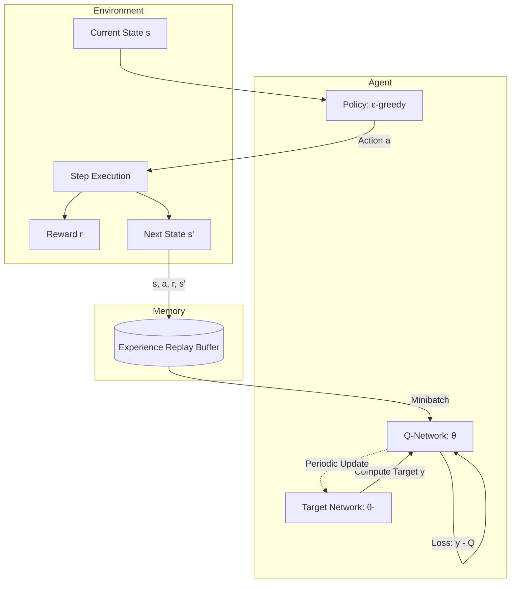

# Q-Learning to Deep Q-Networks: Value-Based Reinforcement Learning

> **Reinforcement Learning (RL)** is a computational approach to learning through interaction, where an agent learns to map situations to actions so as to maximize a numerical reward signal, specifically through the iterative refinement of a state-action value function $Q(s, a)$ governed by the Bellman Optimality Equation.

## 1. Historical Background & Motivation

The genesis of value-based reinforcement learning lies in the intersection of Optimal Control theory and Behavioral Psychology. While the foundations of Markov Decision Processes (MDPs) were laid by Richard Bellman in the 1950s, the specific algorithmic realization of "learning by doing" without a transition model—known as Model-Free RL—emerged much later. In 1989, Chris Watkins introduced **Q-Learning** in his doctoral thesis at Cambridge. Before Q-Learning, researchers primarily relied on Temporal Difference (TD) learning (pioneered by Richard Sutton) or Dynamic Programming. Q-Learning was revolutionary because it allowed an agent to learn the optimal policy $(\pi^*)$ indirectly by learning the values of actions in states, even if the agent followed a sub-optimal exploration policy. This "off-policy" nature decoupled the learning of the optimal strategy from the actual behavior of the agent.

The transition from Tabular Q-Learning to **Deep Q-Networks (DQN)** represents one of the most significant leaps in AI history. For decades, RL was confined to "toy" problems with small state spaces (e.g., Gridworld) because the Q-table grows exponentially with the number of state variables (the "Curse of Dimensionality"). In 2013, researchers at DeepMind (Mnih et al.) published "Playing Atari with Deep Reinforcement Learning," which utilized Deep Convolutional Neural Networks to approximate $Q(s, a)$. This marked the birth of Deep RL, demonstrating that a single architecture could learn to outperform human experts across dozens of different games using only raw pixel input and game scores. Today, these concepts underpin everything from high-frequency trading bots to the energy-saving cooling systems in Google’s data centers and the logic behind modern autonomous robotics.

## 2. Visual Intuition
:::demo
<div style="background:#1e1e1e;padding:16px;border-radius:10px;color:#e5e7eb;font-family:system-ui,sans-serif">
  <h3 style="margin:0 0 8px 0;color:#7dd3fc">Q-Learning to Deep Q-Networks: Value-Based Reinforcement Learning - Concept Map</h3>
  <svg width="100%" height="280" viewBox="0 0 640 280" role="img" aria-label="Q-Learning to Deep Q-Networks: Value-Based Reinforcement Learning visual intuition" style="background:#111827;border-radius:8px">
    <rect x="24" y="28" width="180" height="64" rx="10" fill="#1d4ed8" />
    <text x="114" y="66" text-anchor="middle" fill="#e5e7eb" font-size="14">Problem</text>
    <rect x="230" y="28" width="180" height="64" rx="10" fill="#0f766e" />
    <text x="320" y="66" text-anchor="middle" fill="#e5e7eb" font-size="14">Process</text>
    <rect x="436" y="28" width="180" height="64" rx="10" fill="#7c3aed" />
    <text x="526" y="66" text-anchor="middle" fill="#e5e7eb" font-size="14">Outcome</text>

    <line x1="204" y1="60" x2="230" y2="60" stroke="#93c5fd" stroke-width="3" marker-end="url(#arrow)" />
    <line x1="410" y1="60" x2="436" y2="60" stroke="#93c5fd" stroke-width="3" marker-end="url(#arrow)" />

    <rect x="24" y="130" width="592" height="120" rx="10" fill="#0b1220" stroke="#334155" />
    <text x="320" y="156" text-anchor="middle" fill="#cbd5e1" font-size="14">Key intuition for Q-Learning to Deep Q-Networks: Value-Based Reinforcement Learning</text>
    <text x="320" y="182" text-anchor="middle" fill="#94a3b8" font-size="12">Track state changes, constraints, and final behavior.</text>
    <text x="320" y="206" text-anchor="middle" fill="#94a3b8" font-size="12">Use this as a mental model before formal proofs or code.</text>

    <defs>
      <marker id="arrow" markerWidth="10" markerHeight="10" refX="8" refY="3" orient="auto">
        <polygon points="0 0, 10 3, 0 6" fill="#93c5fd" />
      </marker>
    </defs>
  </svg>
  <p style="margin-top:10px;color:#cbd5e1">Interactive-ready visual scaffold for the topic.</p>
</div>
:::
*Caption: An agent navigating a grid. The arrows represent the greedy action derived from the Q-table. As the agent explores, the "heat" (value) of the cells updates based on the rewards found at the goal state. Note how the values propagate backward from the reward source to the start position over multiple episodes.*

## 3. Core Theory & Mathematical Foundations

### 3.1 The Markov Decision Process (MDP)
Reinforcement Learning is formally framed as a Markov Decision Process, defined by the tuple $(S, A, P, R, \gamma)$:
- $S$: A finite set of states.
- $A$: A finite set of actions.
- $P(s' | s, a) = \mathbb{P}(S_{t+1}=s' | S_t=s, A_t=a)$: The transition probability matrix.
- $R(s, a, s')$: The reward function, returning a scalar $r \in \mathbb{R}$.
- $\gamma \in [0, 1)$: The discount factor, determining the present value of future rewards.

The agent's goal is to maximize the **Expected Return** $G_t$:
$$G_t = \sum_{k=0}^{\infty} \gamma^k R_{t+k+1}$$

### 3.2 The Bellman Equation and Q-Values
The action-value function, $Q^\pi(s, a)$, represents the expected return starting from state $s$, taking action $a$, and thereafter following policy $\pi$. The fundamental recursive relationship is the **Bellman Equation**:
$$Q^\pi(s, a) = \mathbb{E}_\pi [R_{t+1} + \gamma Q^\pi(S_{t+1}, A_{t+1}) | S_t=s, A_t=a]$$

For the optimal policy $\pi^*$, we seek the $Q$-function that satisfies the **Bellman Optimality Equation**:
$$Q^*(s, a) = \mathbb{E} [R_{t+1} + \gamma \max_{a'} Q^*(S_{t+1}, a') | S_t=s, A_t=a]$$

This equation implies that the value of the current state-action pair is the immediate reward plus the discounted value of the best possible action in the next state.

### 3.3 Tabular Q-Learning Update Rule
In a model-free setting where $P$ and $R$ are unknown, Q-learning uses stochastic approximation to converge to $Q^*$. The update rule is:
$$Q(S_t, A_t) \leftarrow Q(S_t, A_t) + \alpha [R_{t+1} + \gamma \max_a Q(S_{t+1}, a) - Q(S_t, A_t)]$$
Where $\alpha$ is the learning rate. The term in brackets $[...]$ is the **Temporal Difference (TD) Error**.

### 3.4 Convergence and the Contraction Mapping
Q-learning converges to the optimal $Q^*$ with probability 1, provided:
1. The state-action pairs are visited infinitely often.
2. The learning rate $\alpha$ satisfies the Robbins-Monro conditions: $\sum \alpha_t = \infty$ and $\sum \alpha_t^2 < \infty$.

The proof relies on the fact that the Bellman operator $\mathcal{T}$ is a **contraction mapping** in the sup-norm. Specifically, for any two value functions $Q_1$ and $Q_2$:
$$||\mathcal{T}Q_1 - \mathcal{T}Q_2||_\infty \leq \gamma ||Q_1 - Q_2||_\infty$$
Since $\gamma < 1$, repeated applications of the operator drive the function toward a unique fixed point, $Q^*$.

### 3.5 The Deep Q-Network (DQN) Extension
When $S$ is continuous or prohibitively large, we replace the table with a parameterized function $Q(s, a; \theta)$, usually a neural network. However, naive application of Q-learning to deep networks is notoriously unstable due to:
1. **Correlated Samples:** Sequential observations in RL are highly correlated, breaking the i.i.d. assumption of stochastic gradient descent.
2. **Moving Targets:** The target value $y = r + \gamma \max Q(s', a'; \theta)$ depends on the same parameters we are optimizing, leading to oscillations or divergence.

**DQN solves these via two key innovations:**
- **Experience Replay:** Stores transitions $(s, a, r, s')$ in a buffer $\mathcal{D}$. Training is performed on random minibatches from $\mathcal{D}$, decorrelating the data.
- **Fixed Target Networks:** Use a separate network with parameters $\theta^-$ to compute the target $y$. $\theta^-$ is updated to match $\theta$ only every $C$ steps, stabilizing the optimization landscape.

The DQN loss function is:
$$L(\theta) = \mathbb{E}_{(s,a,r,s') \sim \mathcal{D}} \left[ \left( r + \gamma \max_{a'} Q(s', a'; \theta^-) - Q(s, a; \theta) \right)^2 \right]$$

## 4. Algorithm / Process (Step-by-Step)

### Deep Q-Learning with Experience Replay
1. **Initialize** replay memory $\mathcal{D}$ to capacity $N$.
2. **Initialize** action-value function $Q$ with random weights $\theta$.
3. **Initialize** target action-value function $\hat{Q}$ with weights $\theta^- = \theta$.
4. **For** episode = 1 to $M$ **do**:
    1. Initialize sequence $s_1$ and pre-processed sequence $\phi_1 = \phi(s_1)$.
    2. **For** $t$ = 1 to $T$ **do**:
        1. With probability $\epsilon$ select a random action $a_t$.
        2. Otherwise select $a_t = \arg\max_a Q(\phi(s_t), a; \theta)$.
        3. Execute action $a_t$ in emulator and observe reward $r_t$ and image $x_{t+1}$.
        4. Set $s_{t+1} = s_t, a_t, x_{t+1}$ and pre-process $\phi_{t+1} = \phi(s_{t+1})$.
        5. Store transition $(\phi_t, a_t, r_t, \phi_{t+1})$ in $\mathcal{D}$.
        6. Sample random minibatch of transitions $(\phi_j, a_j, r_j, \phi_{j+1})$ from $\mathcal{D}$.
        7. Set $y_j = r_j$ if episode terminates at step $j+1$, otherwise set $y_j = r_j + \gamma \max_{a'} \hat{Q}(\phi_{j+1}, a'; \theta^-)$.
        8. Perform a gradient descent step on $(y_j - Q(\phi_j, a_j; \theta))^2$ with respect to the network parameters $\theta$.
        9. Every $C$ steps, reset $\hat{Q} = Q$ (i.e., $\theta^- \leftarrow \theta$).
    3. **End For**
5. **End For**

## 5. Visual Diagram


*Caption: The DQN architecture showing the separation of the behavior network (learning) and the target network (stability), mediated by the Experience Replay buffer.*

## 6. Implementation

### 6.1 Core Implementation: Tabular Q-Learning
This implementation demonstrates the basic logic on a 1D corridor (Cliff Walking variant).

```python
import numpy as np
import random

class TabularQLearner:
    """
    Standard Q-Learning for discrete state/action spaces.
    Complexity:
        Time: O(1) per update
        Space: O(S * A) to store the table
    """
    def __init__(self, states_n, actions_n, alpha=0.1, gamma=0.95, epsilon=0.1):
        self.q_table = np.zeros((states_n, actions_n))
        self.alpha = alpha
        self.gamma = gamma
        self.epsilon = epsilon
        self.actions_n = actions_n

    def choose_action(self, state):
        # Epsilon-greedy exploration
        if random.uniform(0, 1) < self.epsilon:
            return random.randint(0, self.actions_n - 1)
        return np.argmax(self.q_table[state])

    def update(self, state, action, reward, next_state):
        # TD Target: r + gamma * max(Q(s', a'))
        td_target = reward + self.gamma * np.max(self.q_table[next_state])
        # TD Error: Target - current value
        td_error = td_target - self.q_table[state, action]
        # Update rule
        self.q_table[state, action] += self.alpha * td_error

# Example Usage
env_size = 5
agent = TabularQLearner(states_n=env_size, actions_n=2) # 0: Left, 1: Right

# Simulated training loop
for episode in range(100):
    state = 0
    while state < env_size - 1:
        action = agent.choose_action(state)
        next_state = min(env_size - 1, max(0, state + (1 if action == 1 else -1)))
        reward = 1 if next_state == env_size - 1 else -0.1
        agent.update(state, action, reward, next_state)
        state = next_state

print("Final Q-Table:\n", agent.q_table)
```

### 6.2 Optimized Variant: Deep Q-Network (PyTorch style)
This variant utilizes Experience Replay and a Target Network.

```python
import torch
import torch.nn as nn
import torch.optim as optim
import collections

class DQN(nn.Module):
    def __init__(self, input_dim, output_dim):
        super(DQN, self).__init__()
        self.net = nn.Sequential(
            nn.Linear(input_dim, 64),
            nn.ReLU(),
            nn.Linear(64, 64),
            nn.ReLU(),
            nn.Linear(64, output_dim)
        )
    
    def forward(self, x):
        return self.net(x)

class DQNAgent:
    def __init__(self, state_dim, action_dim):
        self.model = DQN(state_dim, action_dim)
        self.target_model = DQN(state_dim, action_dim)
        self.target_model.load_state_dict(self.model.state_dict())
        self.optimizer = optim.Adam(self.model.parameters(), lr=1e-3)
        self.memory = collections.deque(maxlen=10000)
        self.gamma = 0.99
        self.batch_size = 32

    def train_step(self):
        if len(self.memory) < self.batch_size:
            return
        
        batch = random.sample(self.memory, self.batch_size)
        states, actions, rewards, next_states, dones = zip(*batch)
        
        states = torch.FloatTensor(states)
        actions = torch.LongTensor(actions).unsqueeze(1)
        rewards = torch.FloatTensor(rewards)
        next_states = torch.FloatTensor(next_states)
        dones = torch.FloatTensor(dones)

        # Current Q values
        current_q = self.model(states).gather(1, actions).squeeze()
        
        # Target Q values using the Target Network (Stability!)
        with torch.no_grad():
            max_next_q = self.target_model(next_states).max(1)[0]
            expected_q = rewards + (1 - dones) * self.gamma * max_next_q
            
        loss = nn.MSELoss()(current_q, expected_q)
        self.optimizer.zero_grad()
        loss.backward()
        self.optimizer.step()

    def sync_target(self):
        self.target_model.load_state_dict(self.model.state_dict())
```

### 6.3 Common Pitfalls in Code
*   **Target Network Sync Frequency:** Updating the target network every single step ($C=1$) defeats its purpose and leads to divergence. $C$ usually ranges from 100 to 10,000.
*   **Off-by-One in Terminal States:** When a state is terminal, the future reward must be zero ($y = r$). Failing to zero out the $\max Q(s')$ term for terminals prevents the agent from understanding the end of an episode.
*   **Dead Neurons:** Using ReLU without proper initialization or a learning rate that is too high can cause neurons to "die," outputting zero for all inputs, which stops the learning of specific state-action pairs.

## 7. Interactive Demo

:::demo
<!-- title: Q-Learning Gridworld Visualizer -->
<!DOCTYPE html>
<html>
<head>
<meta charset="utf-8">
<style>
  body { margin:0; background:#0f1117; color:#e5e7eb; font-family: monospace; padding:16px; display:flex; flex-direction:column; align-items:center; }
  #canvas-container { position:relative; margin-bottom:10px; }
  canvas { border: 2px solid #374151; background: #1f2937; cursor: crosshair; }
  .controls { display:flex; gap:10px; margin-top:10px; flex-wrap: wrap; justify-content: center; }
  button { background:#3b82f6; color:white; border:none; padding:8px 16px; border-radius:4px; cursor:pointer; font-weight:bold; }
  button:hover { background:#2563eb; }
  .stats { font-size: 14px; color: #9ca3af; margin-top: 10px; text-align: center; }
  .legend { display: flex; gap: 15px; margin-top: 10px; font-size: 11px; }
</style>
</head>
<body>
  <div id="canvas-container">
    <canvas id="rlCanvas" width="400" height="400"></canvas>
  </div>
  <div class="controls">
    <button onclick="toggleRun()">Play/Pause</button>
    <button onclick="resetAgent()">Reset Agent</button>
    <button onclick="setSpeed(10)">Slower</button>
    <button onclick="setSpeed(100)">Faster</button>
  </div>
  <div class="stats" id="statPanel">
    Episode: 0 | Steps: 0 | Total Reward: 0
  </div>
  <div class="legend">
    <span>🟦 Start</span>
    <span>🟩 Goal (+10)</span>
    <span>🟥 Lava (-10)</span>
    <span>⚪ Agent</span>
  </div>
<script>
  const canvas = document.getElementById('rlCanvas');
  const ctx = canvas.getContext('2d');
  const gridSize = 8;
  const cellSize = canvas.width / gridSize;
  
  let qTable = {}; // Key: "x,y", Value: [up, right, down, left]
  let agentPos = {x: 0, y: 7};
  let goalPos = {x: 7, y: 0};
  let lavaPos = [{x:3, y:3}, {x:3, y:4}, {x:4, y:3}, {x:4, y:4}, {x:2, y:2}, {x:5, y:5}];
  
  let alpha = 0.2;
  let gamma = 0.9;
  let epsilon = 0.2;
  let episode = 0;
  let steps = 0;
  let running = false;
  let speed = 50;

  function initQ() {
    for(let i=0; i<gridSize; i++) {
      for(let j=0; j<gridSize; j++) {
        qTable[`${i},${j}`] = [0, 0, 0, 0];
      }
    }
  }

  function draw() {
    ctx.clearRect(0, 0, canvas.width, canvas.height);
    
    // Draw Grid and Q-Values
    for(let i=0; i<gridSize; i++) {
      for(let j=0; j<gridSize; j++) {
        const x = i * cellSize;
        const y = j * cellSize;
        
        // Color based on max Q value
        const qValues = qTable[`${i},${j}`];
        const maxQ = Math.max(...qValues);
        const minQ = Math.min(...qValues);
        
        if (maxQ > 0) {
          ctx.fillStyle = `rgba(34, 197, 94, ${Math.min(maxQ/5, 0.5)})`;
          ctx.fillRect(x, y, cellSize, cellSize);
        } else if (minQ < 0) {
          ctx.fillStyle = `rgba(239, 68, 68, ${Math.min(Math.abs(minQ)/5, 0.5)})`;
          ctx.fillRect(x, y, cellSize, cellSize);
        }

        ctx.strokeStyle = '#374151';
        ctx.strokeRect(x, y, cellSize, cellSize);
      }
    }

    // Goal
    ctx.fillStyle = '#22c55e';
    ctx.fillRect(goalPos.x * cellSize + 5, goalPos.y * cellSize + 5, cellSize - 10, cellSize - 10);
    
    // Lava
    ctx.fillStyle = '#ef4444';
    lavaPos.forEach(p => ctx.fillRect(p.x * cellSize + 5, p.y * cellSize + 5, cellSize - 10, cellSize - 10));

    // Agent
    ctx.fillStyle = '#ffffff';
    ctx.beginPath();
    ctx.arc(agentPos.x * cellSize + cellSize/2, agentPos.y * cellSize + cellSize/2, cellSize/4, 0, Math.PI*2);
    ctx.fill();
  }

  function step() {
    if (!running) return;
    
    let s = `${agentPos.x},${agentPos.y}`;
    let action;
    if (Math.random() < epsilon) {
      action = Math.floor(Math.random() * 4);
    } else {
      action = qTable[s].indexOf(Math.max(...qTable[s]));
    }

    let nextPos = {...agentPos};
    if (action === 0) nextPos.y--; // Up
    if (action === 1) nextPos.x++; // Right
    if (action === 2) nextPos.y++; // Down
    if (action === 3) nextPos.x--; // Left
    
    // Bounds check
    if (nextPos.x < 0 || nextPos.x >= gridSize || nextPos.y < 0 || nextPos.y >= gridSize) {
      nextPos = {...agentPos};
    }

    let reward = -0.1;
    let done = false;
    if (nextPos.x === goalPos.x && nextPos.y === goalPos.y) {
      reward = 10;
      done = true;
    }
    if (lavaPos.some(p => p.x === nextPos.x && p.y === nextPos.y)) {
      reward = -10;
      done = true;
    }

    // Q-Update
    let ns = `${nextPos.x},${nextPos.y}`;
    let maxNextQ = Math.max(...qTable[ns]);
    qTable[s][action] += alpha * (reward + gamma * maxNextQ - qTable[s][action]);

    agentPos = nextPos;
    steps++;

    if (done) {
      agentPos = {x: 0, y: 7};
      episode++;
      steps = 0;
    }

    document.getElementById('statPanel').innerText = `Episode: ${episode} | Steps: ${steps} | Pos: ${agentPos.x},${agentPos.y}`;
    draw();
    setTimeout(step, 1000/speed);
  }

  function toggleRun() { running = !running; if(running) step(); }
  function setSpeed(val) { speed = val; }
  function resetAgent() {
    initQ();
    agentPos = {x: 0, y: 7};
    episode = 0;
    draw();
  }

  initQ();
  draw();
</script>
</body>
</html>
:::

## 8. Worked Examples

### Example 1 — Basic Application (Gridworld Update)
Consider a $2 \times 2$ grid.
- State $S_1$ (Bottom-Left), $S_2$ (Top-Left, Goal).
- Current $Q(S_1, \text{Up}) = 0$.
- Parameters: $\gamma = 0.9, \alpha = 0.5$.
- Agent moves from $S_1$ to $S_2$, receiving reward $R = 10$.
- In $S_2$ (terminal), all $Q(S_2, a) = 0$.

**Calculation:**
1. Calculate TD Target: $y = R + \gamma \max Q(S_2, a') = 10 + 0.9(0) = 10$.
2. Calculate TD Error: $\delta = y - Q(S_1, \text{Up}) = 10 - 0 = 10$.
3. Update $Q$: $Q(S_1, \text{Up}) = 0 + 0.5(10) = 5$.

After one update, the value of the action leading to the goal has increased from 0 to 5.

### Example 2 — Complex Edge Case: The "Deadly Triad"
The "Deadly Triad" refers to the simultaneous use of **Function Approximation** (Neural Networks), **Bootstrapping** (updating estimates based on other estimates), and **Off-policy learning** (learning about the optimal policy while following another).

**Problem:** In a linear function approximator $Q(s, a; w) = w^T \phi(s, a)$, if we use off-policy sampling without importance sampling, the weights $w$ can diverge to infinity.
**Why:** The Bellman operator is no longer a contraction mapping in the space of representable functions.
**Solution:** Techniques like *Double DQN* (to prevent overestimation bias) and *Gradient TD* methods were developed to stabilize this specifically in industry-scale RL systems.

## 9. Comparison with Alternatives

| Approach | Type | Updates | Pros | Cons | Best Used When |
|---|---|---|---|---|---|
| **Q-Learning** | Value-based | Off-policy | Simple, converges to $Q^*$ | Table size scales poorly | Discrete, small state spaces |
| **SARSA** | Value-based | On-policy | Safer exploration | Sub-optimal if epsilon is high | Risk-averse environments |
| **REINFORCE** | Policy-based | On-policy | High-dim action spaces | High variance, slow learning | Continuous action control |
| **DQN** | Value-based | Off-policy | Handles raw pixels/complex states | High memory usage (Replay) | Complex discrete actions (Atari) |
| **PPO** | Policy-Gradient | On-policy | Extremely stable, robust | Mathematically complex | General purpose "Gold Standard" |

## 10. Industry Applications & Real Systems

- **Google (DeepMind)**: Applied DQN-based variants to reduce the energy consumption of their data centers. The agent controlled cooling infrastructure (fans, windows, chillers) to minimize Power Usage Effectiveness (PUE) by 40%.
- **Netflix/Amazon**: Use value-based RL for **Recommendation Systems**. Rather than maximizing the probability of a single click, the agents maximize the "Lifetime Value" (LTV) of a user by suggesting a sequence of content that keeps the user subscribed longer.
- **Tesla/Waymo**: Use RL for **Path Planning**. While the vision system is supervised, the "decision layer" (should I pass this car?) is often trained in simulation using Deep RL to find optimal, safe trajectories.
- **Quantitative Finance**: High-frequency trading firms use DQN to determine optimal order execution. The agent learns to place "Limit Orders" or "Market Orders" to minimize price slippage and maximize profit across high-velocity market states.

## 11. Practice Problems

### 🟢 Easy
1. **Bellman Backstep**: Given $R_t = 0, R_{t+1} = 0, R_{t+2} = 100$ and $\gamma = 0.8$. Calculate the discounted return $G_t$ at time $t$.
   *Hint: $G_t = R_{t+1} + \gamma R_{t+2} + \gamma^2 R_{t+3}...$*
   *Expected complexity: O(1)*

### 🟡 Medium
2. **Exploration Trade-off**: An agent uses $\epsilon$-greedy with $\epsilon=0.1$. In a state with 4 actions, what is the probability that the agent selects the action currently deemed "optimal" by the Q-table?
   *Hint: The agent selects the best action in two scenarios: (1) during exploitation, and (2) by chance during exploration.*
   *Expected complexity: O(1)*

3. **Convergence Conditions**: Prove that if $\gamma = 1$ in an infinite horizon task without a terminal state, the Q-values will likely diverge.
   *Hint: Think about the summation of constant rewards over time.*

### 🔴 Hard
4. **Target Network Drift**: In a DQN, if we set the target network update frequency $C = \infty$ (i.e., we never update it after initialization), explain what happens to the training loss and the agent's performance.
   *Hint: Consider the fixedness of the target $y$.*

5. **Double DQN Derivation**: Standard DQN uses $y = r + \gamma \max_{a'} Q(s', a'; \theta^-)$. Explain how **Double DQN** modifies this to reduce overestimation bias.
   *Expected complexity: O(1) for formula, O(N) for logical explanation.*

## 12. Interactive Quiz

:::quiz
**Q1: Why is Q-learning considered "off-policy"?**
- A) It learns the value of the policy it is currently following.
- B) It learns the value of the optimal policy regardless of the agent's actions.
- C) It requires a human to provide the policy.
- D) It only works if the environment is deterministic.
> B — Q-Learning uses the `max` operator over next actions, which assumes the agent will act optimally in the future, even if the current action was chosen randomly (exploration).

**Q2: What is the primary purpose of the Experience Replay buffer in DQN?**
- A) To save memory by deleting old states.
- B) To allow the agent to "dream" about future states.
- C) To break temporal correlations between consecutive samples and improve sample efficiency.
- D) To store the weights of the neural network.
> C — Sequential frames in a game are very similar. Sampling randomly from the buffer ensures that the minibatch is representative of a wider variety of experiences, stabilizing SGD.

**Q3: If the discount factor $\gamma$ is set to 0, what is the agent's behavior?**
- A) It becomes extremely far-sighted.
- B) It ignores all rewards.
- C) It becomes purely "myopic," caring only about the immediate reward.
- D) The Q-table will never update.
> C — When $\gamma=0$, the Bellman equation reduces to $Q(s, a) = \mathbb{E}[R_{t+1}]$.

**Q4: Which component of the "Deadly Triad" is responsible for the "Moving Target" problem?**
- A) Function Approximation
- B) Bootstrapping
- C) Off-policy learning
- D) Non-stationarity of the environment
> B — Bootstrapping (updating an estimate using another estimate) causes the target to shift as the network parameters change.

**Q5: In Dueling DQN (a common optimization), why is the Q-value split into $V(s)$ and $A(s, a)$?**
- A) To make the network twice as deep.
- B) To learn which states are valuable without needing to learn the effect of every action in that state.
- C) To allow the agent to take two actions at once.
- D) To reduce the number of parameters in the network.
> B — In many states, the specific action taken doesn't change the outcome significantly. Dueling DQN allows the network to learn the value of being in a state $V(s)$ separately from the advantage $A(s, a)$ of each action.
:::

## 13. Interview Preparation

### Conceptual Questions
**Q: Explain the difference between Q-Learning and SARSA.**
*A: Q-learning is off-policy: it updates its Q-values assuming it will take the best possible action in the next state ($r + \max Q(s', a')$). SARSA is on-policy: it updates Q-values based on the action $a'$ that it actually took in the next state ($r + Q(s', a')$), following its exploration policy. Consequently, SARSA is more conservative (e.g., it will stay further away from a cliff if it knows it might randomly fall in due to $\epsilon$-exploration).*

**Q: What is the "Overestimation Bias" in DQN and how do we fix it?**
*A: The $\max$ operator in the DQN target calculation is susceptible to noise. If several actions have similar values but high variance, the $\max$ will consistently pick the overestimated noisy value. We fix this with **Double DQN**, where we use the online network to **select** the best action and the target network to **evaluate** that action's value.*

### Quick Reference (Cheat Sheet)
| Property | Value |
|---|---|
| Optimal Policy | $\pi^*(s) = \arg\max_a Q^*(s, a)$ |
| TD Error ($\delta$) | $R_{t+1} + \gamma \max Q(S_{t+1}, a) - Q(S_t, A_t)$ |
| DQN Complexity | Time: $O(\text{Backprop})$, Space: $O(\text{Replay Buffer Size})$ |
| Fundamental Theorem | Bellman Optimality Equation |
| Key Stabilizers | Experience Replay, Target Networks |

## 14. Key Takeaways
1. **Model-Free Advantage:** Q-learning allows agents to learn optimal behavior in environments where the physics (transition rules) are unknown.
2. **Bellman Equation:** The core of value-based RL is the recursive relationship between the current state and future expected rewards.
3. **Deep Learning Fusion:** DQN successfully combined high-capacity function approximators (CNNs) with RL by introducing Experience Replay and Target Networks.
4. **Exploration vs. Exploitation:** The $\epsilon$-greedy strategy is the simplest way to balance trying new things vs. using known information.
5. **Stability is Hard:** RL is inherently unstable due to the "Deadly Triad"; engineering tricks like gradient clipping and target freezing are essential in production.

## 15. Common Misconceptions
- ❌ **"RL always needs a simulator."** → ✅ While common, RL can learn from offline datasets (Offline RL) or real-world interaction, though the latter is risky.
- ❌ **"DQN can handle continuous actions (like steering a wheel)."** → ✅ DQN requires a `max` over actions, which is only feasible for a discrete, finite set of actions. For continuous control, one uses Actor-Critic methods like DDPG or PPO.
- ❌ **"Higher $\gamma$ is always better."** → ✅ A $\gamma$ too close to 1 makes the math "near-infinite," often preventing convergence because the agent becomes overwhelmed by future possibilities.

## 16. Further Reading
- *Reinforcement Learning: An Introduction* by Sutton and Barto — The "bible" of RL (Chapters 6 and 13).
- *Playing Atari with Deep Reinforcement Learning* (Mnih et al., 2013) — The original DQN paper.
- *Deep Reinforcement Learning Hands-On* by Maxim Lapan — Best for practical PyTorch implementation.
- [[monte-carlo-tree-search]] — To see how search-based AI differs from value-based RL.

## 17. Related Topics
- [[monte-carlo-tree-search]] — Used in AlphaZero alongside RL.
- [[heuristic-design]] — How rewards in RL function as dynamic heuristics.
- [[local-search-optimization]] — RL can be viewed as an optimization process over policy space.
- [[temporal-logic]] — Used to define complex reward structures for agents.
