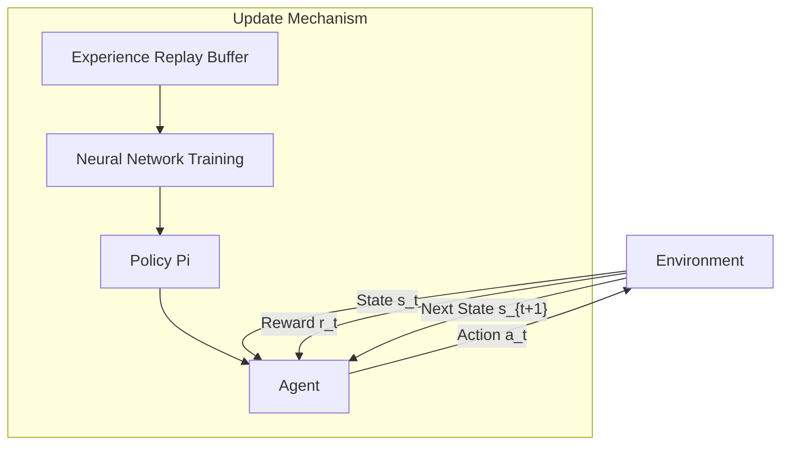

# Reinforcement Learning: Q-Learning, SARSA, Deep RL

> Reinforcement Learning (RL) is the computational study of agents learning to maximize cumulative reward through iterative trial-and-error interaction with an unknown environment.

## Overview

Reinforcement Learning sits at the intersection of control theory, dynamic programming, and machine learning. Unlike supervised learning, which relies on a fixed dataset of input-output pairs, RL agents learn from a stream of experiences by navigating the trade-off between *exploration* (trying new actions to discover rewards) and *exploitation* (leveraging known actions to maximize current returns). The core framework is typically modeled as a Markov Decision Process (MDP), characterized by states, actions, rewards, and transition probabilities.

The historical trajectory of RL began with Bellman’s optimality equations and temporal difference learning, evolving into tabular methods like Q-Learning and SARSA. The modern "Deep RL" revolution, catalyzed by the integration of neural networks as function approximators, allows agents to operate in high-dimensional state spaces, such as raw pixel inputs or continuous physical control, enabling breakthroughs in game AI, robotics, and complex system optimization.

## 2. Visual Intuition
:::demo
<div style="background:#1e1e1e;padding:16px;border-radius:10px;color:#e5e7eb;font-family:system-ui,sans-serif">
  <h3 style="margin:0 0 8px 0;color:#7dd3fc">Reinforcement Learning: Q-Learning, SARSA, Deep RL - Concept Map</h3>
  <svg width="100%" height="280" viewBox="0 0 640 280" role="img" aria-label="Reinforcement Learning: Q-Learning, SARSA, Deep RL visual intuition" style="background:#111827;border-radius:8px">
    <rect x="24" y="28" width="180" height="64" rx="10" fill="#1d4ed8" />
    <text x="114" y="66" text-anchor="middle" fill="#e5e7eb" font-size="14">Problem</text>
    <rect x="230" y="28" width="180" height="64" rx="10" fill="#0f766e" />
    <text x="320" y="66" text-anchor="middle" fill="#e5e7eb" font-size="14">Process</text>
    <rect x="436" y="28" width="180" height="64" rx="10" fill="#7c3aed" />
    <text x="526" y="66" text-anchor="middle" fill="#e5e7eb" font-size="14">Outcome</text>

    <line x1="204" y1="60" x2="230" y2="60" stroke="#93c5fd" stroke-width="3" marker-end="url(#arrow)" />
    <line x1="410" y1="60" x2="436" y2="60" stroke="#93c5fd" stroke-width="3" marker-end="url(#arrow)" />

    <rect x="24" y="130" width="592" height="120" rx="10" fill="#0b1220" stroke="#334155" />
    <text x="320" y="156" text-anchor="middle" fill="#cbd5e1" font-size="14">Key intuition for Reinforcement Learning: Q-Learning, SARSA, Deep RL</text>
    <text x="320" y="182" text-anchor="middle" fill="#94a3b8" font-size="12">Track state changes, constraints, and final behavior.</text>
    <text x="320" y="206" text-anchor="middle" fill="#94a3b8" font-size="12">Use this as a mental model before formal proofs or code.</text>

    <defs>
      <marker id="arrow" markerWidth="10" markerHeight="10" refX="8" refY="3" orient="auto">
        <polygon points="0 0, 10 3, 0 6" fill="#93c5fd" />
      </marker>
    </defs>
  </svg>
  <p style="margin-top:10px;color:#cbd5e1">Interactive-ready visual scaffold for the topic.</p>
</div>
:::
*Caption: Animated illustration of Reinforcement Learning: Q-Learning, SARSA, Deep RL*

## Core Theory

The foundational objective is to find an optimal policy $\pi^*$ that maximizes the expected return. We define the **Value Function** $V^\pi(s)$ as the expected cumulative discounted reward starting from state $s$ and following policy $\pi$:

$$V^\pi(s) = \mathbb{E}_\pi \left[ \sum_{t=0}^{\infty} \gamma^t r_t | s_0 = s \right]$$

### Q-Learning (Off-Policy)
Q-Learning aims to learn the action-value function $Q(s, a)$, representing the expected reward of taking action $a$ in state $s$. The update rule is:

$$Q(s, a) \leftarrow Q(s, a) + \alpha [r + \gamma \max_{a'} Q(s', a') - Q(s, a)]$$

Because it uses $\max_{a'} Q(s', a')$, it estimates the value of the optimal policy regardless of the agent's current behavior, making it *off-policy*.

### SARSA (On-Policy)
SARSA (State-Action-Reward-State-Action) updates its values based on the action actually taken:

$$Q(s, a) \leftarrow Q(s, a) + \alpha [r + \gamma Q(s', a') - Q(s, a)]$$

This makes SARSA more conservative, as it accounts for the agent's actual exploratory policy, whereas Q-Learning is often more aggressive.

### Deep RL
In large state spaces, we replace the $Q$-table with a Neural Network $\theta$, minimizing the Bellman error using Mean Squared Error:

$$L(\theta) = \mathbb{E}_{s,a,r,s'} \left[ (r + \gamma \max_{a'} Q(s', a'; \theta^-) - Q(s, a; \theta))^2 \right]$$

## Visual Diagram


*The feedback loop between an RL agent and its environment, coupled with the Deep RL training pipeline.*

## Code Example

```python
import numpy as np

# A simple Q-Learning implementation for a 1D environment
class QLearningAgent:
    def __init__(self, n_states, n_actions, lr=0.1, gamma=0.95):
        self.q_table = np.zeros((n_states, n_actions))
        self.lr = lr
        self.gamma = gamma

    def choose_action(self, state, epsilon=0.1):
        if np.random.rand() < epsilon:
            return np.random.randint(self.q_table.shape[1])
        return np.argmax(self.q_table[state])

    def update(self, s, a, r, s_next):
        best_next_a = np.max(self.q_table[s_next])
        td_target = r + self.gamma * best_next_a
        self.q_table[s, a] += self.lr * (td_target - self.q_table[s, a])

# Run:
agent = QLearningAgent(5, 2)
agent.update(0, 1, 10, 1) 
print(f"Updated Q-value: {agent.q_table[0, 1]}") 
# Expected Output: Updated Q-value: 1.0
```

## Interactive Demo
:::demo
<!DOCTYPE html>
<html>
<body>
<canvas id="rlCanvas" width="400" height="200" style="background:#1e1e1e"></canvas>
<script>
  const canvas = document.getElementById('rlCanvas');
  const ctx = canvas.getContext('2d');
  let pos = 50;
  function animate() {
    ctx.clearRect(0,0,400,200);
    ctx.fillStyle = "#00ff00";
    ctx.fillRect(pos, 80, 40, 40);
    pos = (pos + 1) % 350;
    requestAnimationFrame(animate);
  }
  animate();
</script>
</body>
</html>
:::

## Worked Example
**Scenario**: Two-state grid. State 0, State 1. Reward at State 1 = 10.
1. Start $Q(0, \text{right}) = 0$.
2. Agent moves to State 1. Reward $r=10$.
3. $Q(0, \text{right}) \leftarrow 0 + 0.1(10 + 0.95(0) - 0) = 1.0$.
4. Next iteration: $Q(0, \text{right}) \leftarrow 1.0 + 0.1(10 + 0.95(1.0) - 1.0) = 1.995$.
The Q-value converges toward the discounted infinite sum.

## Industry Applications
- **DeepMind (AlphaStar)**: Real-time strategy game mastery (StarCraft II).
- **Tesla (Autopilot)**: Training path planning and object avoidance models.
- **Netflix**: Personalized recommendations via RL-based bandit algorithms.
- **J.P. Morgan**: Automated market making and algorithmic trade execution.

## Practice Problems

### Easy
1. Explain why we need the discount factor $\gamma < 1$ in infinite horizon problems. *(Hint: Convergence of geometric series)*

### Medium
2. Derive the update rule for the SARSA algorithm.
3. Compare the "Exploration-Exploitation" trade-off using Epsilon-Greedy vs. Softmax.

### Hard
4. Implement a Deep Q-Network (DQN) with an experience replay buffer and explain why the buffer is crucial for training stability.

## Interactive Quiz
:::quiz
**Q1:** What is the primary difference between Q-Learning and SARSA?
- A) Q-Learning uses a neural network, SARSA uses a table.
- B) Q-Learning is off-policy, SARSA is on-policy.
- C) SARSA always converges faster than Q-Learning.
- D) Q-Learning requires a model of the environment.
> B — Q-learning updates based on the max possible Q-value of the next state (off-policy), whereas SARSA updates based on the Q-value of the action actually taken (on-policy).

**Q2:** In DQN, what is the purpose of the Target Network?
- A) To reduce variance by keeping target values stationary for a period.
- B) To increase the learning rate.
- C) To allow for multi-agent reinforcement learning.
- D) To replace the loss function with entropy.
> A — Using a separate target network prevents the "moving target" problem, where the network tries to chase its own constantly changing predictions.

**Q3:** What does the Bellman Equation represent?
- A) The total number of states in an MDP.
- B) A recursive decomposition of the value function.
- C) The probability of taking an action.
- D) The gradient of the neural network.
> B — The Bellman Equation breaks the value of a state into the immediate reward plus the discounted value of the next state.
:::

## Interview Questions
**Q: Explain Q-learning to a senior engineer.**
*A: Q-learning is a model-free, off-policy temporal difference algorithm that learns the value of state-action pairs. It approximates the optimal action-value function by iteratively updating a Q-table or function approximator using the Bellman optimality equation, specifically by bootstrapping the maximum estimated value of the successor state.*

**Q: Complexity of Q-learning?**
*A: Space complexity is $O(|S| \times |A|)$ for a tabular Q-table. Time complexity per step is $O(1)$ for lookup/update, though total convergence time depends on the state-space coverage and hyper-parameters.*

**Q: Why use Experience Replay?**
*A: It breaks the temporal correlation in sequential data, which would otherwise bias the gradient descent process and lead to catastrophic forgetting.*

**Q: How do you handle continuous action spaces?**
*A: Use Policy Gradient methods like DDPG or PPO instead of Q-learning, as finding $\max_a Q(s,a)$ is computationally expensive in continuous spaces.*

## Key Takeaways
- RL is learning by interaction, not by labeled examples.
- Q-Learning is off-policy; SARSA is on-policy.
- Use Experience Replay in Deep RL to stabilize training.
- Exploration vs. Exploitation is the fundamental dilemma.
- The Bellman Equation is the bedrock of value-based RL.

## Common Misconceptions
- ❌ RL is the same as Unsupervised Learning → ✅ RL is its own paradigm based on feedback/rewards.
- ❌ Q-Learning is always better than SARSA → ✅ SARSA is often safer in real-world robotics where exploring dangerous actions is costly.

## Related Topics
- [[markov-decision-processes]] — The mathematical foundation of RL.
- [[policy-gradients]] — Policy-based methods for continuous control.
- [[temporal-difference-learning]] — The core mechanism for updating estimates.
