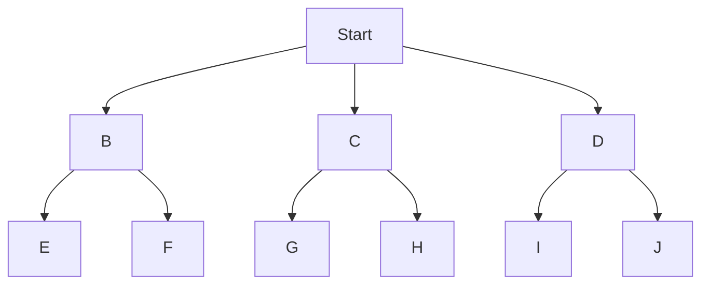

# Uninformed Search

> Uninformed search algorithms explore a problem's state space without any domain-specific knowledge or heuristics to guide them.

## Overview
Uninformed search, also known as blind search, is a class of general-purpose search algorithms that operate without any information about the problem domain other than the problem definition itself. These algorithms only know how to generate successor nodes and how to tell if a node is the goal state. They are systematic in their exploration of the state space, ensuring that they will eventually find a solution if one exists, but they are often inefficient because they don't have any guidance on which part of the search space is more promising.

The most common uninformed search algorithms are Breadth-First Search (BFS), Depth-First Search (DFS), Uniform-Cost Search (UCS), and Iterative Deepening DFS (IDDFS). Each of these algorithms has different properties in terms of completeness (does it always find a solution?), optimality (does it always find the best solution?), time complexity, and space complexity.

## 2. Visual Intuition
:::demo
<div style="background:#1e1e1e;padding:16px;border-radius:10px;color:#e5e7eb;font-family:system-ui,sans-serif">
  <h3 style="margin:0 0 8px 0;color:#7dd3fc">Uninformed Search - Concept Map</h3>
  <svg width="100%" height="280" viewBox="0 0 640 280" role="img" aria-label="Uninformed Search visual intuition" style="background:#111827;border-radius:8px">
    <rect x="24" y="28" width="180" height="64" rx="10" fill="#1d4ed8" />
    <text x="114" y="66" text-anchor="middle" fill="#e5e7eb" font-size="14">Problem</text>
    <rect x="230" y="28" width="180" height="64" rx="10" fill="#0f766e" />
    <text x="320" y="66" text-anchor="middle" fill="#e5e7eb" font-size="14">Process</text>
    <rect x="436" y="28" width="180" height="64" rx="10" fill="#7c3aed" />
    <text x="526" y="66" text-anchor="middle" fill="#e5e7eb" font-size="14">Outcome</text>

    <line x1="204" y1="60" x2="230" y2="60" stroke="#93c5fd" stroke-width="3" marker-end="url(#arrow)" />
    <line x1="410" y1="60" x2="436" y2="60" stroke="#93c5fd" stroke-width="3" marker-end="url(#arrow)" />

    <rect x="24" y="130" width="592" height="120" rx="10" fill="#0b1220" stroke="#334155" />
    <text x="320" y="156" text-anchor="middle" fill="#cbd5e1" font-size="14">Key intuition for Uninformed Search</text>
    <text x="320" y="182" text-anchor="middle" fill="#94a3b8" font-size="12">Track state changes, constraints, and final behavior.</text>
    <text x="320" y="206" text-anchor="middle" fill="#94a3b8" font-size="12">Use this as a mental model before formal proofs or code.</text>

    <defs>
      <marker id="arrow" markerWidth="10" markerHeight="10" refX="8" refY="3" orient="auto">
        <polygon points="0 0, 10 3, 0 6" fill="#93c5fd" />
      </marker>
    </defs>
  </svg>
  <p style="margin-top:10px;color:#cbd5e1">Interactive-ready visual scaffold for the topic.</p>
</div>
:::
*Caption: An animation of Depth-First Search. Notice how it explores as far as possible down one branch before backtracking.*

## Core Theory
The core theory of uninformed search is based on graph traversal. The state space of a problem is represented as a graph, where nodes are states and edges are actions. The goal is to find a path from the initial state to a goal state.

**Breadth-First Search (BFS):**
BFS explores the graph layer by layer. It uses a queue (First-In, First-Out) to store the nodes to be visited. It is complete and optimal (if all edge costs are equal), but its space complexity can be a major issue.
- **Time Complexity:** O(b^d)
- **Space Complexity:** O(b^d)
where 'b' is the branching factor and 'd' is the depth of the solution.

**Depth-First Search (DFS):**
DFS explores the graph by going as deep as possible along each branch before backtracking. It uses a stack (Last-In, First-Out) to store the nodes to be visited. It is not complete (can get stuck in infinite loops) and not optimal. However, its space complexity is much better than BFS.
- **Time Complexity:** O(b^m)
- **Space Complexity:** O(bm)
where 'm' is the maximum depth of the search space.

**Uniform-Cost Search (UCS):**
UCS is a variation of Dijkstra's algorithm. It explores the graph by expanding the node with the lowest path cost from the start node. It uses a priority queue to store the nodes to be visited. It is complete and optimal, but it can be inefficient if the edge costs are not uniform.

**Iterative Deepening DFS (IDDFS):**
IDDFS combines the space efficiency of DFS with the completeness and optimality of BFS. It performs a series of depth-limited DFS searches, increasing the depth limit with each iteration.

## Visual Diagram

*A simple tree structure that can be traversed by search algorithms.*

## Code Example
```python
# A simple implementation of Breadth-First Search
from collections import deque

def bfs(graph, start, goal):
    """
    Performs a Breadth-First Search on a graph.
    """
    visited = set()
    queue = deque([[start]])

    while queue:
        path = queue.popleft()
        node = path[-1]

        if node not in visited:
            if node == goal:
                return path
            visited.add(node)
            for neighbor in graph.get(node, []):
                new_path = list(path)
                new_path.append(neighbor)
                queue.append(new_path)

    return "No path found"

# Example usage
graph = {
    'A': ['B', 'C'],
    'B': ['D', 'E'],
    'C': ['F'],
    'D': [],
    'E': ['F'],
    'F': []
}

print(bfs(graph, 'A', 'F'))
# Expected output: ['A', 'C', 'F']
```

## Interactive Demo
:::demo
<!-- title: "BFS vs DFS Visualization" -->
<!DOCTYPE html>
<html>
<head>
<meta charset="utf-8">
<style>
  body { margin:0; background:#0f1117; color:#e5e7eb; font-family: system-ui, sans-serif; font-size:13px; padding:12px; display: flex; flex-direction: column; align-items: center; }
  .container { display: flex; gap: 40px; margin-top: 20px; }
  .panel { text-align: center; }
  .grid { display: grid; grid-template-columns: repeat(10, 25px); grid-template-rows: repeat(10, 25px); gap: 2px; }
  .cell { width: 25px; height: 25px; background: white; }
  .visited-bfs { background: #4dabf7; }
  .visited-dfs { background: #ff8787; }
  .start { background: #51cf66 !important; }
  .target { background: #fcc419 !important; }
</style>
</head>
<body>
<div class="container">
    <div class="panel">
        <h2>BFS</h2>
        <div id="bfs-grid" class="grid"></div>
    </div>
    <div class="panel">
        <h2>DFS</h2>
        <div id="dfs-grid" class="grid"></div>
    </div>
</div>
<script>
    const SIZE = 10;
    const START = [0, 0];
    const TARGET = [9, 9];

    function createGrid(id) {
        const grid = document.getElementById(id);
        grid.innerHTML = '';
        for (let r = 0; r < SIZE; r++) {
            for (let c = 0; c < SIZE; c++) {
                const cell = document.createElement('div');
                cell.className = 'cell';
                cell.id = `${id}-${r}-${c}`;
                if (r === START[0] && c === START[1]) cell.classList.add('start');
                if (r === TARGET[0] && c === TARGET[1]) cell.classList.add('target');
                grid.appendChild(cell);
            }
        }
    }

    async function bfs() {
        const queue = [START];
        const visited = new Set([START.join(',')]);
        while (queue.length > 0) {
            const [r, c] = queue.shift();
            if (r === TARGET[0] && c === TARGET[1]) return;
            const neighbors = [[r+1,c], [r-1,c], [r,c+1], [r,c-1]];
            for (const [nr, nc] of neighbors) {
                if (nr >= 0 && nr < SIZE && nc >= 0 && nc < SIZE && !visited.has(`${nr},${nc}`)) {
                    visited.add(`${nr},${nc}`);
                    queue.push([nr, nc]);
                    document.getElementById(`bfs-grid-${nr}-${nc}`).classList.add('visited-bfs');
                    await new Promise(r => setTimeout(r, 50));
                }
            }
        }
    }

    async function dfs() {
        const stack = [START];
        const visited = new Set([START.join(',')]);
        while (stack.length > 0) {
            const [r, c] = stack.pop();
            if (r === TARGET[0] && c === TARGET[1]) return;
            const neighbors = [[r+1,c], [r-1,c], [r,c+1], [r,c-1]];
            for (const [nr, nc] of neighbors) {
                if (nr >= 0 && nr < SIZE && nc >= 0 && nc < SIZE && !visited.has(`${nr},${nc}`)) {
                    visited.add(`${nr},${nc}`);
                    stack.push([nr, nc]);
                    document.getElementById(`dfs-grid-${nr}-${nc}`).classList.add('visited-dfs');
                    await new Promise(r => setTimeout(r, 50));
                }
            }
        }
    }

    createGrid('bfs-grid');
    createGrid('dfs-grid');
    bfs();
    dfs();
</script>
</body>
</html>
:::

## Worked Example
**Problem:** Given the graph from the code example, trace the execution of BFS to find a path from 'A' to 'F'.

**Solution:**
1.  **Initialize:** queue = [['A']], visited = {}
2.  **Iteration 1:** Pop ['A']. 'A' is not goal. Add neighbors to queue. queue = [['A', 'B'], ['A', 'C']], visited = {'A'}
3.  **Iteration 2:** Pop ['A', 'B']. 'B' is not goal. Add neighbors to queue. queue = [['A', 'C'], ['A', 'B', 'D'], ['A', 'B', 'E']], visited = {'A', 'B'}
4.  **Iteration 3:** Pop ['A', 'C']. 'C' is not goal. Add neighbors to queue. queue = [['A', 'B', 'D'], ['A', 'B', 'E'], ['A', 'C', 'F']], visited = {'A', 'B', 'C'}
5.  **Iteration 4:** Pop ['A', 'B', 'D']. 'D' is not goal. No unvisited neighbors. queue = [['A', 'B', 'E'], ['A', 'C', 'F']], visited = {'A', 'B', 'C', 'D'}
6.  **Iteration 5:** Pop ['A', 'B', 'E']. 'E' is not goal. Add neighbors to queue. queue = [['A', 'C', 'F'], ['A', 'B', 'E', 'F']], visited = {'A', 'B', 'C', 'D', 'E'}
7.  **Iteration 6:** Pop ['A', 'C', 'F']. 'F' is the goal. Return path ['A', 'C', 'F'].

## Industry Applications
- **Web Crawling:** Search engines use BFS-like algorithms to discover and index web pages.
- **GPS Navigation:** Finding the shortest path between two points on a map (often with heuristics, making it informed search, but the core is graph traversal).
- **Social Networks:** Finding the shortest path between two people (e.g., "degrees of separation").
- **AI for Games:** Pathfinding for characters in video games.

## Practice Problems

### Easy
1. What is the main difference between a queue and a stack, and how does this affect the behavior of BFS and DFS?

### Medium
2. When would you choose to use DFS over BFS, despite the fact that DFS is not complete or optimal?

### Hard
3. Explain how Iterative Deepening DFS combines the best of both BFS and DFS.

## Interactive Quiz
:::quiz
**Q1:** Which uninformed search algorithm is guaranteed to find the shortest path in a graph with uniform edge costs?
- A) Depth-First Search
- B) Breadth-First Search
- C) Greedy Search
- D) None of the above
> B — BFS explores layer by layer, so it will find the shortest path in terms of number of edges.

**Q2:** Which of the following is the main advantage of DFS over BFS?
- A) Completeness
- B) Optimality
- C) Lower space complexity
- D) Lower time complexity
> C — DFS has a space complexity of O(bm), while BFS is O(b^d).

**Q3:** Which data structure is used by Breadth-First Search?
- A) Stack
- B) Queue
- C) Priority Queue
- D) Hash Table
> B — BFS uses a queue to explore nodes in a first-in, first-out manner.
:::

## Interview Questions

**Q: Explain the difference between DFS and BFS.**
*A: DFS explores a graph by going as deep as possible down one path before backtracking, using a stack. BFS explores layer by layer, using a queue. BFS is complete and optimal for unweighted graphs, while DFS is not, but DFS has lower space complexity.*

**Q: How would you find a path through a maze?**
*A: I would model the maze as a graph, where empty squares are nodes and adjacent empty squares have an edge between them. Then I would use a search algorithm like BFS or A* to find a path from the start to the end.*

**Q: What is Uniform-Cost Search?**
*A: UCS is a search algorithm that expands the node with the lowest path cost from the start. It's like BFS, but instead of a regular queue, it uses a priority queue ordered by path cost. It's optimal for weighted graphs.*

**Q: Can you implement DFS recursively?**
*A: Yes. You can have a function that takes a node and a visited set. The function would mark the node as visited, process it, and then for each unvisited neighbor, call itself recursively.*

## Key Takeaways
- Uninformed search algorithms don't use any domain-specific knowledge.
- BFS is complete and optimal for unweighted graphs but has high space complexity.
- DFS has low space complexity but is not complete or optimal.
- UCS is optimal for weighted graphs.
- IDDFS combines the benefits of BFS and DFS.

## Common Misconceptions
- ❌ BFS is always better than DFS. → ✅ The best algorithm depends on the problem. DFS is better when the solution is deep and the search space is wide.
- ❌ Uninformed search is useless in practice. → ✅ Uninformed search algorithms are the basis for more advanced informed search algorithms and are used in many applications.

## Related Topics
- [[informed-search]] — Search algorithms that use heuristics to guide their search.
- [[adversarial-search]] — Search algorithms for competitive environments, like games.
- [[intelligent-agents]] — Agents that use search algorithms to plan their actions.
