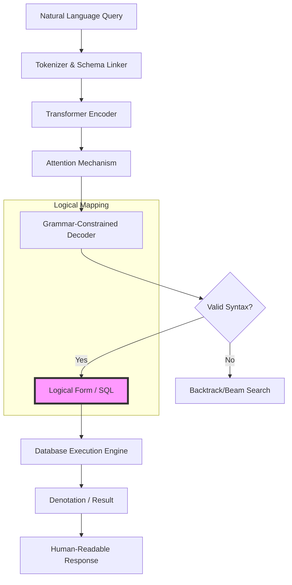

# Semantic Parsing: Mapping Language to Logical Forms

> **Semantic Parsing** is the task of transforming a natural language utterance into a machine-executable formal representation, such as SQL, SPARQL, or $\lambda$-calculus, enabling computers to reason over and execute human instructions within structured environments.

## 1. Historical Background & Motivation

The quest to bridge the gap between human language and formal logic dates back to the early days of Artificial Intelligence. In the 1970s, Terry Winograd’s **SHRDLU** demonstrated a breakthrough by allowing users to manipulate objects in a virtual "blocks world" using natural language. SHRDLU relied on handcrafted procedural rules, which, while impressive for its time, suffered from the "brittleness" characteristic of early AI—it could not handle any input outside its narrow domain. As the field evolved, the focus shifted toward mapping language to formal database queries. The **CHAT-80** system (1982) was a landmark in this regard, transforming English questions into Prolog expressions to query a geographical database.

By the late 1990s and early 2000s, the "Knowledge Bottleneck" led researchers toward statistical methods. Instead of manual rules, researchers like Luke Zettlemoyer and Raymond Mooney pioneered the use of **Combinatory Categorial Grammar (CCG)** and Inductive Logic Programming to learn mappings from pairs of sentences and logical forms. Today, semantic parsing is the engine behind modern voice assistants (Siri, Alexa), natural language interfaces to databases (Text-to-SQL), and code generation tools like GitHub Copilot. In the era of Large Language Models (LLMs), semantic parsing has transitioned from a task of "building a grammar" to one of "constrained decoding," where the challenge lies in ensuring that the generated code is not only syntactically correct but logically grounded in the target schema.

## 2. Visual Intuition
:::demo
<div style="background:#1e1e1e;padding:16px;border-radius:10px;color:#e5e7eb;font-family:system-ui,sans-serif">
  <h3 style="margin:0 0 8px 0;color:#7dd3fc">Semantic Parsing: Mapping Language to Logical Forms - Concept Map</h3>
  <svg width="100%" height="280" viewBox="0 0 640 280" role="img" aria-label="Semantic Parsing: Mapping Language to Logical Forms visual intuition" style="background:#111827;border-radius:8px">
    <rect x="24" y="28" width="180" height="64" rx="10" fill="#1d4ed8" />
    <text x="114" y="66" text-anchor="middle" fill="#e5e7eb" font-size="14">Problem</text>
    <rect x="230" y="28" width="180" height="64" rx="10" fill="#0f766e" />
    <text x="320" y="66" text-anchor="middle" fill="#e5e7eb" font-size="14">Process</text>
    <rect x="436" y="28" width="180" height="64" rx="10" fill="#7c3aed" />
    <text x="526" y="66" text-anchor="middle" fill="#e5e7eb" font-size="14">Outcome</text>

    <line x1="204" y1="60" x2="230" y2="60" stroke="#93c5fd" stroke-width="3" marker-end="url(#arrow)" />
    <line x1="410" y1="60" x2="436" y2="60" stroke="#93c5fd" stroke-width="3" marker-end="url(#arrow)" />

    <rect x="24" y="130" width="592" height="120" rx="10" fill="#0b1220" stroke="#334155" />
    <text x="320" y="156" text-anchor="middle" fill="#cbd5e1" font-size="14">Key intuition for Semantic Parsing: Mapping Language to Logical Forms</text>
    <text x="320" y="182" text-anchor="middle" fill="#94a3b8" font-size="12">Track state changes, constraints, and final behavior.</text>
    <text x="320" y="206" text-anchor="middle" fill="#94a3b8" font-size="12">Use this as a mental model before formal proofs or code.</text>

    <defs>
      <marker id="arrow" markerWidth="10" markerHeight="10" refX="8" refY="3" orient="auto">
        <polygon points="0 0, 10 3, 0 6" fill="#93c5fd" />
      </marker>
    </defs>
  </svg>
  <p style="margin-top:10px;color:#cbd5e1">Interactive-ready visual scaffold for the topic.</p>
</div>
:::
*Caption: A high-level view of semantic parsing where a natural language query is parsed into an abstract syntax tree (AST) or logical form, which is then executed against a knowledge base or database to produce a result (denotation).*

## 3. Core Theory & Mathematical Foundations

At its core, semantic parsing is a transduction problem where we seek a mapping function $f: \mathcal{X} \to \mathcal{Y}$, where $\mathcal{X}$ is the set of natural language sentences and $\mathcal{Y}$ is the set of formal logical expressions.

### 3.1 Logical Forms and $\lambda$-Calculus
The most common formalisms used in semantic parsing are **$\lambda$-calculus** and **FunQL**. $\lambda$-calculus allows us to represent the meaning of words as functions and constants. For example, the word "cities" might be represented as $\lambda x. \text{city}(x)$, a function that returns true if $x$ is a city. 

The composition of these functions follows the principle of **$\beta$-reduction**. If we have "cities in Texas," and "in Texas" is $\lambda f. \lambda x. [f(x) \land \text{loc}(x, \text{TX})]$, the application of this function to the city predicate results in:
$$(\lambda f. \lambda x. [f(x) \land \text{loc}(x, \text{TX})]) (\lambda y. \text{city}(y)) \to \lambda x. [\text{city}(x) \land \text{loc}(x, \text{TX})]$$

### 3.2 Compositional Semantics and CCG
**Combinatory Categorial Grammar (CCG)** is a grammar formalism that is particularly well-suited for semantic parsing because it provides a transparent interface between syntax and semantics. Every word in a lexicon is assigned a category that defines both its syntactic role and its semantic contribution.

A category is either a basic type (e.g., $S, NP, N$) or a functional type (e.g., $S \backslash NP$, meaning a function that takes an $NP$ on the left to produce an $S$). 
The mathematical backbone of CCG involves combinators, primarily:
1. **Application**: 
   - Forward ($>$): $A/B : f, B : g \implies A : f(g)$
   - Backward ($<$): $B : g, A \backslash B : f \implies A : f(g)$
2. **Composition ($B$)**: $A/B : f, B/C : g \implies A/C : \lambda x. f(g(x))$

### 3.3 Probabilistic Semantic Parsing
In modern systems, we model the probability of a logical form $y$ given a sentence $x$ using a log-linear model:
$$P(y|x; \theta) = \frac{\exp(\phi(x, y) \cdot \theta)}{\sum_{y' \in \mathcal{Y}} \exp(\phi(x, y') \cdot \theta)}$$
where $\phi(x, y)$ is a feature vector and $\theta$ is the weight vector. In neural approaches, this is typically handled by an encoder-decoder architecture where:
$$P(y|x) = \prod_{t=1}^{|y|} P(y_t | y_{<t}, x)$$
The model is trained to maximize the log-likelihood of the gold logical forms. However, in many real-world scenarios, we do not have the logical forms, only the **denotation** (the final answer). This leads to **Weakly Supervised Learning**, where we optimize:
$$J(\theta) = \mathbb{E}_{y \sim P(y|x; \theta)} [R(y, d)]$$
where $R$ is a reward function (e.g., 1 if the execution of $y$ yields denotation $d$, 0 otherwise). This is often solved using the **REINFORCE** algorithm or its variants.

### 3.4 Formal Analysis: Complexity and Correctness
The complexity of semantic parsing depends on the formalism. For rule-based CCG, parsing is generally $O(n^3)$ using a modified CKY algorithm. However, searching the space of all possible logical forms is NP-hard. In the neural sequence-to-sequence paradigm, the complexity is $O(n \cdot m)$ where $n$ is input length and $m$ is output length, but this assumes a fixed vocabulary. 

**Correctness** in semantic parsing is defined by **Execution Accuracy**: 
$$\text{Acc} = \mathbb{I}[\text{Execute}(y^*) = \text{Execute}(y)]$$
where $y^*$ is the ground truth and $y$ is the predicted form. This is superior to string-matching metrics like BLEU because multiple distinct logical forms (e.g., `SELECT name FROM users WHERE age > 20` and `SELECT name FROM users WHERE 20 < age`) are semantically equivalent.

## 4. Algorithm / Process (Step-by-Step)

The typical workflow for a modern Neural Semantic Parser (e.g., for Text-to-SQL) follows these steps:

1.  **Schema Linking**: Identify mentions of database tables and columns within the natural language utterance.
    - *Example*: "Find the email of users in NY" $\to$ "email" maps to `User.email`, "users" maps to `User` table.
2.  **Encoding**: Use a Transformer-based encoder (like BERT or RoBERTa) to generate contextualized embeddings for both the tokens in the query and the schema elements.
3.  **Constrained Decoding**: Generate the logical form token-by-token. To ensure the output is valid SQL/code, a **Grammar-based Decoder** is often used.
    - Instead of predicting tokens, the decoder predicts the **production rules** of the language's grammar (e.g., `Root -> Select Statement`, `Select Statement -> SELECT Column`).
4.  **Action Mapping**: Map the abstract rules back into a concrete string.
5.  **Execution and Refinement**: Execute the query against the target database. If it fails, a feedback loop (often seen in agentic systems) may attempt to re-parse the query.

## 5. Visual Diagram


*Caption: The architecture of a modern grammar-constrained semantic parser. The pink node represents the critical transition from neural latent space to formal code.*

## 6. Implementation

### 6.1 Core Implementation: A Simple Lambda-Parser
This implementation demonstrates a simplified recursive-descent semantic parser that maps natural language to a executable Python lambda.

```python
import re

class SimpleSemanticParser:
    """
    A toy semantic parser mapping NL to lambda functions for a list of dictionaries.
    Complexity: O(N) where N is number of tokens.
    """
    def __init__(self):
        # Lexicon mapping words to predicates and operators
        self.lexicon = {
            "cities": lambda x: x['type'] == 'city',
            "large": lambda x: x['population'] > 1000000,
            "in": lambda x, loc: x['location'] == loc,
            "and": lambda f1, f2: lambda x: f1(x) and f2(x)
        }

    def parse(self, query: str):
        """
        Naive recursive-descent parser for 'large cities in [Location]'
        Returns a filter function.
        """
        tokens = query.lower().split()
        
        # Simple pattern matching for "large cities in [location]"
        if "large" in tokens and "cities" in tokens and "in" in tokens:
            location = tokens[tokens.index("in") + 1]
            
            # Semantic Composition
            f_city = self.lexicon["cities"]
            f_large = self.lexicon["large"]
            f_combined = self.lexicon["and"](f_city, f_large)
            
            # Bind the location
            return lambda x: f_combined(x) and x['location'] == location
        
        raise ValueError("Query structure not supported.")

# --- Sample Usage ---
data = [
    {"name": "New York", "type": "city", "population": 8000000, "location": "usa"},
    {"name": "Austin", "type": "city", "population": 950000, "location": "usa"},
    {"name": "Paris", "type": "city", "population": 2100000, "location": "france"}
]

parser = SimpleSemanticParser()
query_fn = parser.parse("Find large cities in usa")
results = [item['name'] for item in data if query_fn(item)]

# Output: ['New York']
print(f"Results: {results}")
```

### 6.2 Optimized / Production Variant: Grammar-Based Decoding
In production (e.g., Text-to-SQL), we use a `TreeDecoder`. This snippet sketches the logic of ensuring only valid SQL keywords are generated.

```python
class ConstrainedDecoder:
    """
    Illustrates the concept of constrained decoding using a valid SQL state machine.
    Ensures that a 'WHERE' clause cannot follow another 'WHERE' clause.
    """
    def __init__(self, schema_columns):
        self.grammar_rules = {
            "START": ["SELECT"],
            "SELECT": ["COLUMN"],
            "COLUMN": ["FROM"],
            "FROM": ["TABLE"],
            "TABLE": ["WHERE", "END"],
            "WHERE": ["CONDITION"],
            "CONDITION": ["AND", "END"]
        }
        self.valid_columns = schema_columns

    def get_valid_next_tokens(self, current_state, partial_query):
        """
        Returns a mask of valid tokens for the next step.
        Complexity: O(G) where G is number of grammar rules.
        """
        valid_types = self.grammar_rules.get(current_state, [])
        # In a real model, this would filter the softmax output of the Transformer
        return valid_types

# Example production use-case:
# If current_state is 'SELECT', the model is forced to choose from 'self.valid_columns'
```

### 6.3 Common Pitfalls in Code
1.  **Schema Hallucination**: Neural parsers often invent column names that don't exist in the database. Use **Schema Linking** to constrain the output vocabulary.
2.  **Nested Subquery Complexity**: Linear Seq2Seq models struggle with deeply nested SQL (e.g., `SELECT ... WHERE x IN (SELECT ...)`). **Recursive Tree Decoders** are preferred here.
3.  **Handling Out-of-Vocabulary (OOV) Entities**: A user might query for a specific name "Zubrinsky." If this isn't in the training set, the parser might fail. **Pointer Networks** allow the decoder to "copy" tokens directly from the input.

## 7. Interactive Demo

:::demo
<!-- title: Interactive Semantic Parsing Visualizer -->
<!DOCTYPE html>
<html>
<head>
<meta charset="utf-8">
<style>
  body { margin:0; background:#0f1117; color:#e5e7eb; font-family: 'Segoe UI', Tahoma, Geneva, Verdana, sans-serif; padding:20px; }
  .container { max-width: 800px; margin: auto; border: 1px solid #374151; border-radius: 8px; padding: 20px; background: #1f2937; }
  .input-group { margin-bottom: 20px; }
  input { width: 70%; padding: 10px; border-radius: 4px; border: 1px solid #4b5563; background: #374151; color: white; }
  button { padding: 10px 20px; border: none; border-radius: 4px; background: #3b82f6; color: white; cursor: pointer; }
  button:hover { background: #2563eb; }
  .visualization { display: flex; flex-direction: column; align-items: center; margin-top: 20px; }
  .node { border: 2px solid #60a5fa; border-radius: 5px; padding: 10px; margin: 5px; min-width: 100px; text-align: center; background: #1e3a8a; transition: all 0.3s; }
  .arrow { font-size: 20px; color: #9ca3af; }
  .logical-form { font-family: 'Courier New', monospace; background: #000; padding: 15px; color: #34d399; width: 100%; border-radius: 4px; margin-top: 10px; min-height: 50px; }
  .status { font-style: italic; color: #9ca3af; margin-bottom: 10px; }
</style>
</head>
<body>
<div class="container">
  <h3>Semantic Parsing Trace: NL to Lambda</h3>
  <div class="input-group">
    <input type="text" id="queryInput" value="large cities in Texas">
    <button onclick="runParser()">Parse Query</button>
  </div>
  <div id="status" class="status">Enter a query like "cities in Texas" or "large cities"</div>
  <div class="visualization" id="viz">
    <!-- Steps will appear here -->
  </div>
  <div class="logical-form" id="lfOutput">Logical Form: _</div>
</div>

<script>
const lexicon = {
  "cities": "λx.city(x)",
  "large": "λf.λx.[f(x) ∧ population(x) > 1M]",
  "in": "λloc.λf.λx.[f(x) ∧ loc(x, loc)]",
  "Texas": "TX"
};

async function runParser() {
  const input = document.getElementById('queryInput').value;
  const viz = document.getElementById('viz');
  const lfOutput = document.getElementById('lfOutput');
  const status = document.getElementById('status');
  
  viz.innerHTML = "";
  lfOutput.innerText = "Logical Form: _";
  
  const tokens = input.split(" ");
  
  for(let i=0; i<tokens.length; i++) {
    status.innerText = `Step ${i+1}: Tokenizing and retrieving semantics for "${tokens[i]}"...`;
    const node = document.createElement('div');
    node.className = 'node';
    node.innerHTML = `<b>${tokens[i]}</b><br><small>${lexicon[tokens[i]] || 'Unknown'}</small>`;
    viz.appendChild(node);
    
    if(i < tokens.length - 1) {
      const arrow = document.createElement('div');
      arrow.className = 'arrow';
      arrow.innerHTML = '↓';
      viz.appendChild(arrow);
    }
    await new Promise(r => setTimeout(r, 600));
  }
  
  status.innerText = "Final Step: Performing β-reduction and Composition...";
  await new Promise(r => setTimeout(r, 800));
  
  // Hardcoded logic for demo purposes to show result
  if(input.includes("large") && input.includes("cities") && input.includes("Texas")) {
    lfOutput.innerText = "Logical Form: λx.[city(x) ∧ population(x) > 1M ∧ loc(x, TX)]";
  } else if (input.includes("cities") && input.includes("Texas")) {
    lfOutput.innerText = "Logical Form: λx.[city(x) ∧ loc(x, TX)]";
  } else {
    lfOutput.innerText = "Logical Form: Error - Semantic composition failed.";
  }
}
</script>
</body>
</html>
:::

## 8. Worked Examples

### Example 1 — Basic Text-to-SQL Application
**Input**: "Show names of teachers in the 'CS' department."
**Schema**: `Teacher(id, name, dept_id)`, `Department(id, name)`

**Step 1: Schema Linking**
- "teachers" $\to$ Table `Teacher`
- "names" $\to$ Column `Teacher.name`
- "CS" $\to$ Value for `Department.name`
- "department" $\to$ Table `Department`

**Step 2: Dependency Analysis**
The word "in" implies a join between `Teacher` and `Department` on `Teacher.dept_id = Department.id`.

**Step 3: Logical Construction**
1. `SELECT name`
2. `FROM Teacher`
3. `JOIN Department ON Teacher.dept_id = Department.id`
4. `WHERE Department.name = 'CS'`

**Final SQL**: `SELECT T1.name FROM Teacher AS T1 JOIN Department AS T2 ON T1.dept_id = T2.id WHERE T2.name = 'CS'`

### Example 2 — Complex Lambda Composition
**Input**: "Most populous city in Europe"
**Formalism**: Typed $\lambda$-calculus with superlatives.

1.  **city**: $\lambda x. \text{city}(x)$
2.  **in Europe**: $\lambda f. \lambda x. [f(x) \land \text{loc}(x, \text{Europe})]$
3.  **populous**: (An adjective mapping to a numeric property `population`)
4.  **most**: $\lambda f. \text{argmax}_{x} [f(x), \text{population}(x)]$

**Step-by-Step Composition**:
- `in Europe` + `city` $\to \lambda x. [\text{city}(x) \land \text{loc}(x, \text{Europe})]$
- `most` + `populous` + (result) $\to \text{argmax}_{x} [\text{city}(x) \land \text{loc}(x, \text{Europe}), \text{population}(x)]$

## 9. Comparison with Alternatives

| Approach | Complexity | Pros | Cons | Best Used When |
|---|---|---|---|---|
| **Rule-based (SHRDLU)** | $O(N)$ | Deterministic, Interpretable | Brittle, high manual effort | Narrow, static domains |
| **CCG (Statistical)** | $O(N^3)$ | Strong linguistic grounding | Requires lexicons, hard to scale | Academic research, mid-size datasets |
| **Seq2Seq (Neural)** | $O(N)$ | Scales with data, handles noise | Hallucinations, requires massive data | General purpose assistants |
| **Grammar-Constrained** | $O(N)$ | Guaranteed syntax correctness | Complex implementation | Production Text-to-SQL (Spider benchmark) |

## 10. Industry Applications & Real Systems

- **Salesforce (WikiSQL/Spider)**: Salesforce Research has been a leader in the Text-to-SQL domain, developing state-of-the-art models like **RAT-SQL** which use relational graph attention to link schema elements to query tokens.
- **GitHub Copilot**: While often seen as code completion, Copilot performs semantic parsing when it translates a docstring (e.g., `// function to find prime numbers`) into a functional code block. It maps natural language intent to the formal logical structure of a programming language.
- **WolframAlpha**: Uses a massive, proprietary rule-based and statistical semantic parser to map user queries into **Wolfram Language** expressions, which are then executed against their computational engine.
- **Google Assistant / Amazon Alexa**: These systems use "Semantic Role Labeling" combined with semantic parsing to convert "Turn off the lights in the kitchen" into a device-specific API call: `DeviceControl(action=OFF, target=LIGHTS, room=KITCHEN)`.

## 11. Practice Problems

### 🟢 Easy
1. **Manual $\beta$-reduction**: Given $f = \lambda x. \text{student}(x)$ and $g = \lambda P. \exists x [P(x) \land \text{graduated}(x)]$, compute $g(f)$.
   *Hint: Substitute the entire function $f$ for the variable $P$ in $g$.*
   *Expected: $\exists x [\text{student}(x) \land \text{graduated}(x)]$*

### 🟡 Medium
2. **Schema Linker Design**: Write a Python function that takes a string "What is the price of product 5?" and a list of columns `['product_id', 'price', 'name']`. Use fuzzy matching to return the most likely column.
   *Hint: Use Levenshtein distance.*

3. **SQL Translation**: Convert the following natural language into SQL: "Find the average age of users who joined in 2023." Assume table `Users(age, join_date)`.

### 🔴 Hard
4. **Constrained Decoder Implementation**: Implement a beam search decoder that prevents the model from predicting two consecutive "JOIN" keywords in a SQL generator.
   *Expected complexity: $O(K \cdot L)$ where $K$ is beam width, $L$ is sequence length.*

5. **Weak Supervision Trace**: Given an initial random policy $\theta$, a query $x$, and a database $D$. If the model generates 3 logical forms $y_1, y_2, y_3$, and only $y_2$ returns the correct answer from $D$, show how the gradient $\nabla_\theta J(\theta)$ would be updated using REINFORCE.

## 12. Interactive Quiz

:::quiz
**Q1: Why is Execution Accuracy generally preferred over BLEU score for evaluating semantic parsers?**
- A) BLEU score is too slow to calculate for long SQL queries.
- B) Multiple distinct logical forms can produce the same correct result.
- C) BLEU score requires a GPU to compute.
- D) Semantic parsing does not produce strings.
> B — Logical forms are formal languages where syntax can vary while semantics remain identical (e.g., swapping conditions in a WHERE clause). Execution accuracy measures if the "meaning" (the result) is correct.

**Q2: In CCG, what is the result of the forward application ($>$) of $S/NP$ and $NP$?**
- A) $S \backslash NP$
- B) $NP$
- C) $S$
- D) $S/S$
> C — The $NP$ cancels out the denominator of the functional type $S/NP$, leaving $S$.

**Q3: Which mechanism is most effective for handling the "out-of-vocabulary" problem when parsing specific names?**
- A) Adding more layers to the Transformer.
- B) Increasing the learning rate.
- C) Pointer Networks (Copy Mechanism).
- D) Using a larger BERT model.
> C — Pointer Networks allow the model to copy tokens (like names or specific IDs) directly from the input sequence to the output, bypassing the fixed vocabulary.

**Q4: What is the primary purpose of "Schema Linking"?**
- A) To connect the database to the internet.
- B) To identify which parts of a query refer to tables and columns.
- C) To encrypt the database schema.
- D) To translate SQL into natural language.
> B — It is the process of grounding NL tokens into structural database elements.

**Q5: In the context of semantic parsing, what does "Weak Supervision" mean?**
- A) The model is trained by a junior engineer.
- B) The model is trained only on small datasets.
- C) The model is trained using only (Sentence, Answer) pairs, without gold logical forms.
- D) The model is trained without an optimizer.
> C — Weak supervision leverages "denotations" (the answer) as a signal, often using RL to find a latent logical form that produces that answer.
:::

## 13. Interview Preparation

### Conceptual Questions
**Q: Explain Semantic Parsing to a non-technical stakeholder.**
*A: Semantic parsing is like a high-tech translator. Instead of translating English to French, it translates English into the specific language a computer database or software understands, like SQL or code. This allows anyone to talk to a computer or query a complex database using everyday language instead of needing to be a programmer.*

**Q: What are the time and space complexities of a Transformer-based semantic parser?**
*A: During inference, the time complexity is $O(L_{in} \cdot L_{out})$ due to the cross-attention mechanism, where $L_{in}$ is the input length and $L_{out}$ is the generated sequence length. Space complexity is $O(L_{in}^2 + L_{out}^2)$ for storing the self-attention maps, though optimizations like FlashAttention can reduce this.*

**Q: How do you handle a situation where the user's query is ambiguous (e.g., "Find John")?**
*A: This is a classic "entity resolution" and "semantic ambiguity" problem. In a real system, I would use a multi-stage approach: 1. Generate top-K candidates using beam search. 2. If candidates are significantly different, trigger a clarification dialog ("Did you mean John Smith or John Doe?"). 3. Use context (previous queries) to disambiguate.*

### Quick Reference (Cheat Sheet)
| Property | Value |
|---|---|
| Primary Metric | Execution Accuracy / Exact Set Match |
| Core Formalism | $\lambda$-calculus, SQL, CCG |
| Key Challenge | The "Knowledge Bottleneck" & Hallucination |
| Common Architecture | Encoder-Decoder + Attention + Constrained Decoding |
| State-of-the-art | Transformer-based (RAT-SQL, Picard) |

## 14. Key Takeaways
1. **Semantics $\neq$ Syntax**: A query can be syntactically perfect but logically nonsensical (e.g., querying a "color" column for "age" values).
2. **Compositionality**: The meaning of a complex expression is built from the meaning of its parts (Frege’s Principle).
3. **Constrained Decoding** is critical for production systems to avoid syntax errors in generated SQL/code.
4. **Weak Supervision** allows training on much larger datasets because gold logical forms are expensive to annotate, but answers (denotations) are often available.
5. **Schema Linking** is the bridge between the unstructured world of language and the structured world of databases.

## 15. Common Misconceptions
- ❌ **"LLMs have solved semantic parsing."** → ✅ While LLMs are excellent at zero-shot SQL, they still struggle with complex schemas (100+ tables) and specialized domain-specific languages (DSLs) without fine-tuning or RAG.
- ❌ **"BLEU score is a good way to measure if my SQL generator works."** → ✅ No. SQL is a set-based language. `WHERE A=1 AND B=2` is identical to `WHERE B=2 AND A=1`, but BLEU would penalize the latter.
- ❌ **"Semantic parsing is just text classification."** → ✅ It is much harder. Classification has a fixed set of labels; semantic parsing has an infinite number of possible logical forms.

## 16. Further Reading
- *Speech and Language Processing (3rd ed.)* by Jurafsky & Martin, **Chapter 15: Semantic Role Labeling and Semantic Parsing.**
- *The original paper on CCG*: Steedman, M. (2000). *The Syntactic Process.*
- *Learning to Parse Database Queries from Examples*: Zelle & Mooney (1996). The foundational paper for statistical semantic parsing.
- *Spider: A Large-Scale Hierarchical Dataset for Complex Semantic Parsing*: Yu et al. (2018). The benchmark that defined modern Text-to-SQL research.

## 17. Related Topics
- [[temporal-logic]] — For parsing queries involving time constraints (e.g., "before 2020").
- [[description-logics]] — The foundation for knowledge graph-based semantic parsing.
- [[arc-consistency]] — Used in the constraint satisfaction phase of complex parsing.
- [[heuristic-design]] — Essential for beam search and pruning in large logical spaces.
