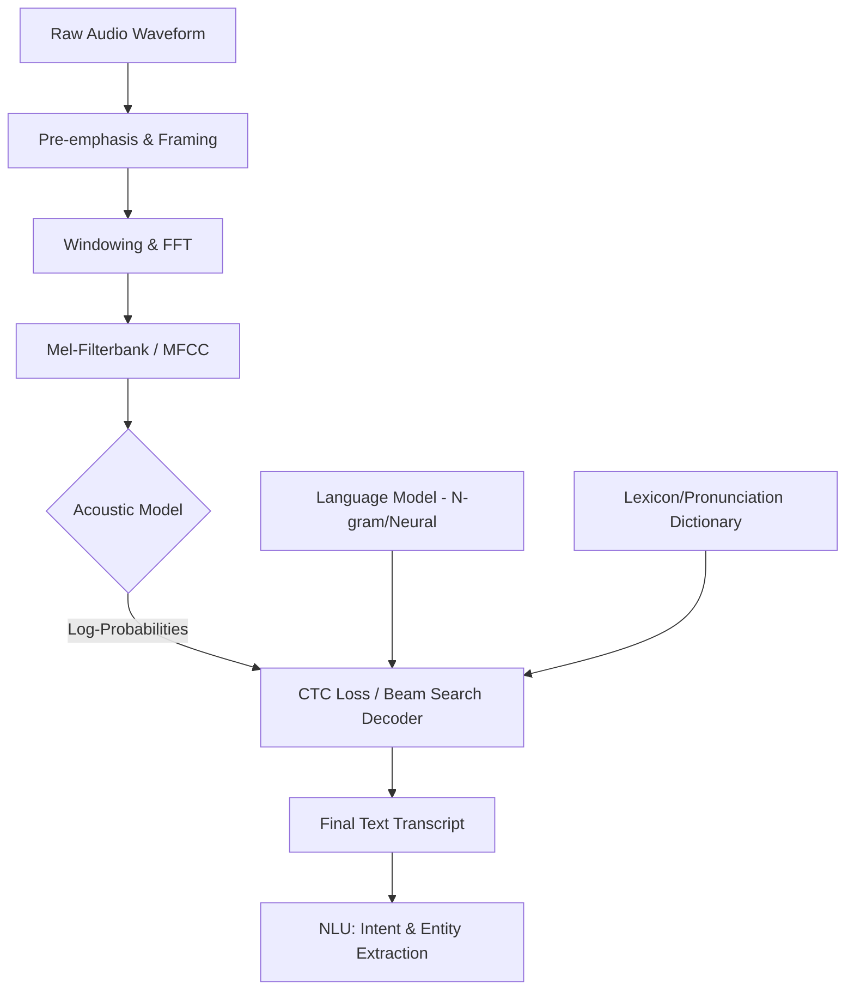

# Speech Understanding: ASR Pipelines and Acoustic Modeling

> **Speech Understanding** is the computational process of transforming a continuous acoustic signal into a discrete sequence of words (Automatic Speech Recognition, ASR) and subsequently extracting semantic meaning, typically formulated as a maximum a posteriori (MAP) estimation problem $P(W|O)$, where $W$ is the word sequence and $O$ is the acoustic observation sequence.

## 1. Historical Background & Motivation

The journey of speech understanding began in the 1950s at Bell Labs with the "Audrey" system, a massive relay-based computer capable of recognizing spoken digits (0-9) from a single speaker with 97-99% accuracy. However, Audrey was limited by its dependency on specific acoustic templates and could not generalize across speakers or vocabulary. The 1970s saw the emergence of the DARPA Speech Understanding Research (SUR) program, leading to systems like CMU's HARPY, which utilized a graph-based search over 1,000 words. The true paradigm shift occurred in the mid-1980s when Lawrence Rabiner and others at AT&T Bell Labs popularized the **Hidden Markov Model (HMM)**. This probabilistic framework allowed researchers to treat speech as a stochastic process, modeling the temporal variability of phonemes with transition probabilities and spectral variability with Gaussian Mixture Models (GMMs).

In the modern era, the "Deep Learning Revolution" (circa 2012) replaced GMMs with Deep Neural Networks (DNNs), leading to the "Hybrid HMM-DNN" architecture. This transition provided an immediate 20-30% relative reduction in Word Error Rate (WER). Today, we have moved toward **End-to-End (E2E)** systems using architectures like Conformers, Listen-Attend-Spell (LAS), and Connectionist Temporal Classification (CTC). Modern ASR is the backbone of the trillion-dollar voice economy, powering everything from Siri and Alexa to real-time captioning and warehouse automation. Understanding these pipelines is no longer a niche audio domain; it is a fundamental requirement for building robust multimodal AI systems.

## 2. Visual Intuition
:::demo
<div style="background:#1e1e1e;padding:16px;border-radius:10px;color:#e5e7eb;font-family:system-ui,sans-serif">
  <h3 style="margin:0 0 8px 0;color:#7dd3fc">Speech Understanding: ASR Pipelines and Acoustic Modeling - Concept Map</h3>
  <svg width="100%" height="280" viewBox="0 0 640 280" role="img" aria-label="Speech Understanding: ASR Pipelines and Acoustic Modeling visual intuition" style="background:#111827;border-radius:8px">
    <rect x="24" y="28" width="180" height="64" rx="10" fill="#1d4ed8" />
    <text x="114" y="66" text-anchor="middle" fill="#e5e7eb" font-size="14">Problem</text>
    <rect x="230" y="28" width="180" height="64" rx="10" fill="#0f766e" />
    <text x="320" y="66" text-anchor="middle" fill="#e5e7eb" font-size="14">Process</text>
    <rect x="436" y="28" width="180" height="64" rx="10" fill="#7c3aed" />
    <text x="526" y="66" text-anchor="middle" fill="#e5e7eb" font-size="14">Outcome</text>

    <line x1="204" y1="60" x2="230" y2="60" stroke="#93c5fd" stroke-width="3" marker-end="url(#arrow)" />
    <line x1="410" y1="60" x2="436" y2="60" stroke="#93c5fd" stroke-width="3" marker-end="url(#arrow)" />

    <rect x="24" y="130" width="592" height="120" rx="10" fill="#0b1220" stroke="#334155" />
    <text x="320" y="156" text-anchor="middle" fill="#cbd5e1" font-size="14">Key intuition for Speech Understanding: ASR Pipelines and Acoustic Modeling</text>
    <text x="320" y="182" text-anchor="middle" fill="#94a3b8" font-size="12">Track state changes, constraints, and final behavior.</text>
    <text x="320" y="206" text-anchor="middle" fill="#94a3b8" font-size="12">Use this as a mental model before formal proofs or code.</text>

    <defs>
      <marker id="arrow" markerWidth="10" markerHeight="10" refX="8" refY="3" orient="auto">
        <polygon points="0 0, 10 3, 0 6" fill="#93c5fd" />
      </marker>
    </defs>
  </svg>
  <p style="margin-top:10px;color:#cbd5e1">Interactive-ready visual scaffold for the topic.</p>
</div>
:::
*Caption: A spectrogram visualization of speech. The x-axis represents time, the y-axis represents frequency, and the intensity/color represents the amplitude of a specific frequency at a specific time. Speech recognition involves mapping these "visual" patterns of energy into linguistic units.*

## 3. Core Theory & Mathematical Foundations

### 3.1 The Fundamental Equation of ASR
ASR is traditionally framed as the "Noisy Channel Model." Given a sequence of acoustic observations $O = o_1, o_2, \dots, o_T$, we seek the most probable sequence of words $\hat{W} = w_1, w_2, \dots, w_n$:

$$\hat{W} = \arg\max_{W} P(W|O)$$

Using Bayes' Theorem:

$$\hat{W} = \arg\max_{W} \frac{P(O|W)P(W)}{P(O)}$$

Since $P(O)$ is constant for a given utterance during decoding, we focus on:

$$\hat{W} = \arg\max_{W} \underbrace{P(O|W)}_{\text{Acoustic Model}} \underbrace{P(W)}_{\text{Language Model}}$$

Here, $P(O|W)$ (the Acoustic Model) tells us how likely the audio is given the text, and $P(W)$ (the Language Model) tells us how likely the word sequence is in the target language.

### 3.2 Signal Processing: Feature Extraction
Raw audio is high-dimensional (e.g., 16,000 samples per second). To make it tractable, we extract **Mel-Frequency Cepstral Coefficients (MFCCs)**. 
1. **Pre-emphasis**: Boosting high frequencies to balance the spectrum ($y[n] = x[n] - \alpha x[n-1]$).
2. **Framing**: Dividing the signal into 20-30ms windows with 10ms overlap to assume "quasi-stationarity."
3. **Windowing**: Applying a Hamming window $w[n] = 0.54 - 0.46 \cos(\frac{2\pi n}{N-1})$ to prevent spectral leakage.
4. **Discrete Fourier Transform (DFT)**: Converting time-domain to frequency-domain:
   $$X[k] = \sum_{n=0}^{N-1} x[n] e^{-j\frac{2\pi}{N}kn}$$
5. **Mel-Filterbank**: Mapping frequencies to the Mel scale, which mimics human hearing:
   $$m = 2595 \log_{10}(1 + \frac{f}{700})$$

### 3.3 Connectionist Temporal Classification (CTC)
In modern End-to-End systems, the alignment between audio frames and characters/phonemes is unknown. CTC solves this by introducing a "blank" symbol ($\epsilon$) and summing over all possible alignments that map to the target sequence after removing repeats and blanks.
Let $\pi$ be a path (sequence of labels including blanks). The probability of a label sequence $Y$ is:
$$P(Y|O) = \sum_{\pi \in \mathcal{B}^{-1}(Y)} \prod_{t=1}^T P(\pi_t | o_t)$$
where $\mathcal{B}$ is the collapse function. This allows training without explicit forced alignment.

### 3.4 Formal Analysis: Decoding Complexity
The decoding process involves searching through a massive state space. In HMMs, we use the **Viterbi Algorithm**. Given $N$ states and $T$ time frames, the time complexity is $O(T \cdot N^2)$. However, in speech, the transitions are restricted (Bakis topology), reducing it to $O(T \cdot N \cdot K)$ where $K$ is the small number of possible next states. For large vocabularies, we use Weighted Finite State Transducers (WFSTs) to compose the lexicon ($L$), grammar ($G$), and acoustic model ($H$) into a single optimized graph $S = H \circ C \circ L \circ G$.

## 4. Algorithm / Process (Step-by-Step)

1. **Preprocessing**: Normalize volume (RMS normalization) and remove silence.
2. **Feature Extraction**: Compute MFCCs or Log-Mel Filterbanks. This transforms a vector of 16,000 samples into a sequence of 100 feature vectors (80 dimensions each) per second.
3. **Acoustic Modeling (Neural Network)**:
   - Input: Log-Mel features.
   - Architecture: CNNs for local patterns, followed by Bidirectional LSTMs or Transformers (Conformers) for global context.
   - Output: Probability distribution over phonemes or graphemes at each time step.
4. **Decoding (Beam Search)**:
   - Maintain the $k$ most likely hypotheses.
   - At each step, expand hypotheses based on AM probabilities and LM scores.
   - Apply "pruning" to remove low-probability paths.
5. **Post-processing**: Apply inverse text normalization (e.g., converting "ten dollars" to "$10").

## 5. Visual Diagram


*Caption: The standard ASR pipeline illustrating the flow from raw signal to semantic interpretation.*

## 6. Implementation

### 6.1 Core Implementation: MFCC Feature Extraction (NumPy)
This demonstrates how we transform raw audio into the spectral features required by deep learning models.

```python
import numpy as np
from scipy.fftpack import dct

def extract_mfcc(signal, sample_rate=16000, frame_size=0.025, frame_stride=0.01, num_filters=40, num_ceps=12):
    """
    Computes MFCC features from a raw audio signal.
    Args:
        signal: 1D numpy array of audio samples.
        sample_rate: Sampling frequency (Hz).
        frame_size: Length of each frame in seconds.
        frame_stride: Step size between frames in seconds.
    Returns:
        mfcc: (num_frames, num_ceps) matrix of features.
    Complexity: O(T * N log N) where T is frames and N is FFT size.
    """
    # 1. Pre-emphasis
    emphasized_signal = np.append(signal[0], signal[1:] - 0.97 * signal[:-1])
    
    # 2. Framing
    frame_length, frame_step = frame_size * sample_rate, frame_stride * sample_rate
    signal_length = len(emphasized_signal)
    num_frames = int(np.ceil(float(np.abs(signal_length - frame_length)) / frame_step))
    
    # Padding signal to ensure all frames have equal samples
    pad_signal_length = int(num_frames * frame_step + frame_length)
    z = np.zeros((pad_signal_length - signal_length))
    pad_signal = np.append(emphasized_signal, z)
    
    indices = np.tile(np.arange(0, frame_length), (num_frames, 1)) + \
              np.tile(np.arange(0, num_frames * frame_step, frame_step), (int(frame_length), 1)).T
    frames = pad_signal[indices.astype(np.int32, copy=False)]
    
    # 3. Windowing (Hamming)
    frames *= np.hamming(frame_length)
    
    # 4. FFT and Power Spectrum
    NFFT = 512
    mag_frames = np.absolute(np.fft.rfft(frames, NFFT))
    pow_frames = ((1.0 / NFFT) * (mag_frames ** 2))
    
    # 5. Filter Banks (Mel Scale)
    low_freq_mel = 0
    high_freq_mel = (2595 * np.log10(1 + (sample_rate / 2) / 700))
    mel_points = np.linspace(low_freq_mel, high_freq_mel, num_filters + 2)
    hz_points = (700 * (10**(mel_points / 2595) - 1))
    bin = np.floor((NFFT + 1) * hz_points / sample_rate)
    
    fbank = np.zeros((num_filters, int(np.floor(NFFT / 2 + 1))))
    for m in range(1, num_filters + 1):
        for k in range(int(bin[m-1]), int(bin[m])):
            fbank[m-1, k] = (k - bin[m-1]) / (bin[m] - bin[m-1])
        for k in range(int(bin[m]), int(bin[m+1])):
            fbank[m-1, k] = (bin[m+1] - k) / (bin[m+1] - bin[m])
            
    filter_banks = np.dot(pow_frames, fbank.T)
    filter_banks = np.where(filter_banks == 0, np.finfo(float).eps, filter_banks)
    filter_banks = 20 * np.log10(filter_banks) # dB
    
    # 6. MFCC (DCT)
    mfcc = dct(filter_banks, type=2, axis=1, norm='ortho')[:, 1 : (num_ceps + 1)]
    
    return mfcc

# Usage:
# audio = np.random.uniform(-1, 1, 16000) # 1 sec of white noise
# features = extract_mfcc(audio)
# print(features.shape) # Expected: (98, 12) approximately
```

### 6.2 Optimized Production Variant: Connectionist Temporal Classification (PyTorch Logic)
In production, we use optimized kernels for CTC loss.

```python
import torch
import torch.nn as nn

class SimpleSpeechModel(nn.Module):
    def __init__(self, input_dim, hidden_dim, output_dim):
        super(SimpleSpeechModel, self).__init__()
        # Use a Conformer or GRU for sequence modeling
        self.lstm = nn.LSTM(input_dim, hidden_dim, num_layers=3, 
                            batch_first=True, bidirectional=True)
        self.fc = nn.Linear(hidden_dim * 2, output_dim) # output_dim = vocab_size + 1 (blank)

    def forward(self, x):
        # x shape: (batch, time, features)
        out, _ = self.lstm(x)
        logits = self.fc(out)
        return torch.log_softmax(logits, dim=2)

# Training Loop snippet
# criterion = nn.CTCLoss(blank=0)
# log_probs = model(input_features).transpose(0, 1) # (T, N, C)
# loss = criterion(log_probs, targets, input_lengths, target_lengths)
```

### 6.3 Common Pitfalls in Code
*   **Sample Rate Mismatch**: Training on 16kHz audio but inferring on 8kHz (telephony) audio without resampling leads to garbage output.
*   **Log-Zero Errors**: When computing log-energy, if a frame is silent, `log(0)` will crash. Always add a small epsilon ($10^{-10}$).
*   **Gradient Explosion in CTC**: If the input sequence length $T$ is shorter than the target sequence length $L$, CTC loss is undefined. Always ensure $T \ge L$.
*   **Off-by-one in DCT**: Forgetting to drop the 0th DCT coefficient, which represents the DC offset (average energy), often makes models sensitive to absolute volume.

## 7. Interactive Demo

:::demo
<!-- title: MFCC Spectrogram Visualizer -->
<!DOCTYPE html>
<html>
<head>
<meta charset="utf-8">
<style>
  body { margin:0; background:#0f1117; color:#e5e7eb; font-family: system-ui, sans-serif; font-size:13px; padding:16px; }
  canvas { border: 1px solid #374151; background: #000; width: 100%; height: 200px; display: block; margin-top: 10px; }
  .controls { display: flex; gap: 10px; margin-bottom: 10px; align-items: center; }
  button { background: #3b82f6; color: white; border: none; padding: 6px 12px; border-radius: 4px; cursor: pointer; }
  button:hover { background: #2563eb; }
  .stat { font-family: monospace; color: #10b981; }
</style>
</head>
<body>
  <div class="controls">
    <button id="startBtn">Generate Synthetic Speech Signal</button>
    <button id="resetBtn">Reset</button>
    <span>State: <span id="state" class="stat">Idle</span></span>
  </div>
  <canvas id="waveCanvas"></canvas>
  <p>Raw Waveform (Time Domain)</p>
  <canvas id="specCanvas"></canvas>
  <p>Computed Mel Spectrogram (Frequency Domain - Approximation)</p>

<script>
  const waveCanvas = document.getElementById('waveCanvas');
  const specCanvas = document.getElementById('specCanvas');
  const wCtx = waveCanvas.getContext('2d');
  const sCtx = specCanvas.getContext('2d');
  let animationId;
  let time = 0;

  function drawWave(data) {
    wCtx.clearRect(0, 0, waveCanvas.width, waveCanvas.height);
    wCtx.beginPath();
    wCtx.strokeStyle = '#3b82f6';
    for(let i=0; i<data.length; i++) {
      const x = (i / data.length) * waveCanvas.width;
      const y = (data[i] * 50) + waveCanvas.height/2;
      if(i===0) wCtx.moveTo(x, y); else wCtx.lineTo(x, y);
    }
    wCtx.stroke();
  }

  function drawSpec(timeOffset) {
    const cols = 100;
    const rows = 40;
    const cw = specCanvas.width / cols;
    const ch = specCanvas.height / rows;
    
    for(let i=0; i<cols; i++) {
      for(let j=0; j<rows; j++) {
        const val = Math.abs(Math.sin((i+timeOffset)*0.1) * Math.cos(j*0.2) * 255);
        sCtx.fillStyle = `rgb(${val}, ${val/4}, 50)`;
        sCtx.fillRect(i*cw, specCanvas.height - (j*ch), cw, ch);
      }
    }
  }

  function animate() {
    const synthData = Array.from({length: 200}, (_, i) => 
      Math.sin((i + time) * 0.2) * 0.5 + Math.sin((i + time) * 0.5) * 0.2
    );
    drawWave(synthData);
    drawSpec(time);
    time += 1;
    animationId = requestAnimationFrame(animate);
  }

  document.getElementById('startBtn').onclick = () => {
    document.getElementById('state').innerText = "Processing...";
    if(!animationId) animate();
  };

  document.getElementById('resetBtn').onclick = () => {
    cancelAnimationFrame(animationId);
    animationId = null;
    wCtx.clearRect(0, 0, waveCanvas.width, waveCanvas.height);
    sCtx.clearRect(0, 0, specCanvas.width, specCanvas.height);
    document.getElementById('state').innerText = "Idle";
  };
</script>
</body>
</html>
:::

## 8. Worked Examples

### Example 1 — Viterbi Decoding Walkthrough
Imagine a tiny vocabulary: "hi" and "by". Our HMM states for "hi" are $s_1, s_2$. 
Observations $O = o_1, o_2$.
- $P(o_1 | s_1) = 0.8, P(o_1 | s_{other}) = 0.1$
- $P(s_1 \to s_1) = 0.5, P(s_1 \to s_2) = 0.5$

**Step 1 ($t=1$):**
$\delta_1(s_1) = P(s_1)P(o_1|s_1) = 1.0 \times 0.8 = 0.8$

**Step 2 ($t=2$):**
$\delta_2(s_2) = \max[\delta_1(s_1) a_{12}, \delta_1(s_2) a_{22}] \times P(o_2|s_2)$
$= \max[0.8 \times 0.5, 0] \times 0.7 = 0.28$

This numeric recursion determines the most likely phoneme path through the acoustic model.

### Example 2 — The CTC "Blank" Problem
Target: "CAT". Frames: 5. 
Possible valid CTC paths:
1. `C C A T T`
2. `_ C A _ T`
3. `C _ A A T`
The CTC loss sums the probability of all these paths. If the model predicts `C C C C C`, the loss will be extremely high because there is no way to collapse `CCCCC` into "CAT".

## 9. Comparison with Alternatives

| Approach | Architecture | Alignment | Pros | Cons | Best Used When |
|---|---|---|---|---|---|
| **HMM-GMM** | Probabilistic | Forced | Interpretable, works on small data | Poor accuracy, complex pipeline | Legacy systems, low-resource |
| **Hybrid HMM-DNN** | Neural + HMM | Forced | Very stable, handles long audio well | Hard to train end-to-end | Enterprise ASR |
| **CTC (E2E)** | RNN/CNN | Latent | Simpler pipeline, fast inference | Assumes frame independence | Streaming ASR |
| **Attention (AED)**| Transformer | Global | Best accuracy, no independence assumptions | Slow (auto-regressive), fails on long audio | Batch transcription (Whisper) |

## 10. Industry Applications & Real Systems

- **Google Assistant**: Uses a **RNN-Transducer (RNN-T)** model. This is an E2E model optimized for low latency, allowing the model to start outputting words before the user finishes speaking.
- **OpenAI Whisper**: A massive Transformer-based AED model trained on 680,000 hours of weakly supervised data. It is currently the industry standard for robust, multi-lingual transcription.
- **Amazon Alexa**: Employs a multi-stage approach where a "Wake Word" engine (small footprint) triggers a larger, cloud-based acoustic model.
- **Tesla/Automotive**: ASR is used for hands-free control. These systems often utilize **Beam Search** with a heavily constrained Language Model to ensure commands like "Set temperature" are recognized over general chatter.

## 11. Practice Problems

### 🟢 Easy
1. **Nyquist Frequency**: If a speech signal is sampled at 16,000 Hz, what is the maximum frequency that can be represented?
   *Hint: The Nyquist-Shannon sampling theorem states $f_{max} = f_s / 2$.*
   *Expected complexity: O(1)*

### 🟡 Medium
2. **Mel Scale Calculation**: Convert a 3000 Hz frequency to Mel. Use the formula $m = 2595 \log_{10}(1 + f/700)$.
   *Hint: Plug and play, but understand why 700 is the corner frequency.*

3. **CTC Path Count**: For a target word "HI" (length 2) and a sequence of 3 time frames, list all possible CTC paths that result in "HI".
   *Hint: Remember the blank symbol $\epsilon$ and repetitions.*

### 🔴 Hard
4. **Viterbi Backpointer**: Given a 3-state HMM and 100 time frames, derive the space complexity of the Viterbi algorithm if we need to reconstruct the path.
   *Hint: You must store the argmax at every step.*
   *Expected complexity: O(T \times N)*

5. **Beam Search Pruning**: Implement a logic where a beam of size 5 is pruned if the cumulative probability drops below 10% of the top candidate's probability. Show how this affects the search space for a depth-10 tree.

## 12. Interactive Quiz

:::quiz
**Q1: Why is the Mel scale used in ASR instead of a linear frequency scale?**
- A) It is computationally faster to calculate.
- B) It mimics the non-linear human perception of pitch.
- C) It reduces the number of FFT bins needed.
- D) It prevents aliasing in high-frequency speech.
> B — Humans are much better at distinguishing small changes in pitch at low frequencies than at high frequencies. The Mel scale captures this by using logarithmic spacing.

**Q2: What is the primary purpose of the "Blank" symbol in CTC loss?**
- A) To represent silence between words.
- B) To allow for alignments where the input is longer than the output.
- C) To indicate the end of a sentence.
- D) To handle unknown words (OOV).
> B — Since acoustic frames are usually 10ms and characters are much longer, CTC needs a way to "skip" or "bridge" frames that don't transition to a new character.

**Q3: In the fundamental equation $P(W|O) \propto P(O|W)P(W)$, what does $P(W)$ represent?**
- A) The likelihood of the audio given the word.
- B) The probability of a word sequence occurring in the language.
- C) The acoustic feature distribution.
- D) The Viterbi path probability.
> B — This is the Language Model. It ensures that "The weather is fair" is chosen over "The weather is fare."

**Q4: Which windowing function is most common in ASR to reduce spectral leakage?**
- A) Rectangular
- B) Hamming
- C) Gaussian
- D) Xavier
> B — Hamming windows taper the edges of the frame to zero, reducing the "discontinuity" that causes false high-frequency artifacts in the FFT.

**Q5: What is a major disadvantage of Attention-based Encoder-Decoder (AED) models compared to RNN-T?**
- A) They cannot handle multiple speakers.
- B) They are less accurate on short sentences.
- C) They typically require the entire audio sequence before they can start decoding (non-streaming).
- D) They do not use GPUs efficiently.
> C — Standard attention looks at the whole sequence, making it difficult to use for real-time applications like live captioning without complex "chunked attention" modifications.
:::

## 13. Interview Preparation

### Conceptual Questions
**Q: Explain the difference between MFCCs and Filterbanks. Which is better for Deep Learning?**
*A: MFCCs apply a Discrete Cosine Transform (DCT) to filterbanks to decorrelate the features. While MFCCs were essential for GMMs (which struggle with correlated data), Deep Learning models like CNNs and LSTMs can handle correlated features. Therefore, modern systems prefer raw Log-Mel Filterbanks because they preserve spatial relationships between frequency bins.*

**Q: Derive the time complexity of the Viterbi algorithm.**
*A: At each time step $t \in [1, T]$, for each state $j \in [1, N]$, we calculate the maximum probability coming from any state $i$ at $t-1$. This involves $N$ states at $t-1$. Thus, for one state at one time step, it is $O(N)$. For all $N$ states, it is $O(N^2)$. Over $T$ time steps, the total is $O(T \cdot N^2)$.*

**Q: How do you handle Out-of-Vocabulary (OOV) words in a speech system?**
*A: There are three main ways: 1) Sub-word units (Byte Pair Encoding or WordPieces), which allow the model to spell out new words phonetically. 2) Adding words to the Lexicon and Language Model and re-compiling the decoding graph. 3) Using a "speller" component in E2E systems that predicts characters directly.*

### Quick Reference (Cheat Sheet)
| Property | Value |
|---|---|
| Sampling Rate (Standard) | 16,000 Hz |
| Frame Size | 20ms - 30ms |
| Frame Stride | 10ms |
| MFCC dims | 12 - 13 (plus deltas) |
| Filterbank dims | 40 - 80 |
| Best Metric | Word Error Rate (WER) |

## 14. Key Takeaways
1. **Speech is a sequence-to-sequence problem** where the input length is significantly greater than the output length.
2. **The Mel scale** is critical because it aligns feature representation with human psychoacoustics.
3. **CTC Loss** is the "magic" that allows training models without needing to know exactly which millisecond corresponds to which letter.
4. **Hybrid models** (DNN-HMM) still dominate some high-reliability industrial sectors, but **E2E (Transformers/Conformers)** are the current SOTA.
5. **Data augmentation** (SpecAugment) - masking blocks of frequency/time - is essential for training robust acoustic models.

## 15. Common Misconceptions
- ❌ **"ASR is just NLP with audio."** → ✅ Actually, ASR must deal with continuous signals, noise, reverberation, and speaker variability before it ever reaches the "text" stage.
- ❌ **"More Mel filters is always better."** → ✅ Too many filters lead to overfitting and high-frequency noise sensitivity. 40-80 is the "sweet spot."
- ❌ **"HMMs are dead."** → ✅ Many production systems at FAANG still use WFST-based decoders (which are based on HMM principles) to integrate complex business logic and grammars.

## 16. Further Reading
- *Speech and Language Processing (3rd Ed.)* by Dan Jurafsky & James H. Martin — The "Bible" of the field.
- *Deep Learning for Acoustic Modeling* — Hinton et al. (2012 IEEE Signal Processing Magazine paper).
- *Connectionist Temporal Classification* — Alex Graves (2006 original paper).
- [[temporal-logic]] — For advanced understanding of sequence constraints.

## 17. Related Topics
- [[heuristic-design]] — Used in pruning during beam search.
- [[bidirectional-search]] — Relevant for optimizing the decoding of long utterances.
- [[local-search-optimization]] — Used in training acoustic model parameters.
- [[description-logics]] — Relevant for NLU (Natural Language Understanding) after the ASR step.
