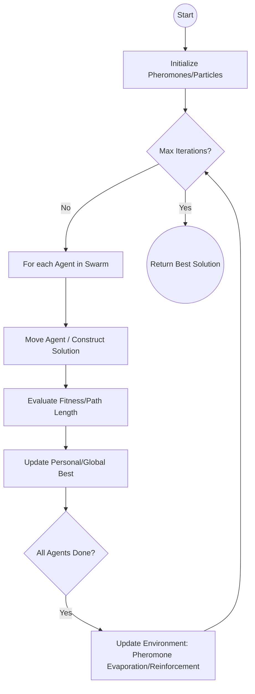

# Swarm Intelligence: Ant Colony Optimization and Particle Swarms

> **Swarm Intelligence (SI)** is the collective behavior of decentralized, self-organized systems—typically composed of a population of simple agents interacting locally with one another and their environment—to solve complex global optimization problems that are otherwise computationally intractable.

## 1. Historical Background & Motivation

The field of Swarm Intelligence emerged in the late 1980s and early 1990s as a paradigm shift from classical, top-down Artificial Intelligence. While traditional AI focused on the "centralized brain" (symbolic logic and expert systems), SI researchers looked toward nature's decentralized wonders: ant colonies, bird flocks, and fish schools. These biological systems exhibit "emergence," where the collective intelligence of the group far exceeds the sum of the intelligence of individual members. 

**Ant Colony Optimization (ACO)** was first proposed by Marco Dorigo in his 1992 PhD thesis. Inspired by the way ants find the shortest path between their nest and a food source using pheromone trails, Dorigo developed a metaheuristic to solve the Traveling Salesman Problem (TSP). Simultaneously, the field of **Particle Swarm Optimization (PSO)** was introduced in 1995 by James Kennedy and Russell Eberhart. They were initially attempting to simulate the graceful, synchronized movement of bird flocks and discovered that their social interaction models were remarkably effective at finding global minima in multi-dimensional continuous search spaces.

In modern computing, SI matters because of the "Curse of Dimensionality" and the NP-Hard nature of many real-world problems. Whether it is routing packets across a global telecommunications network (Cisco’s AntNet), optimizing the logistics of a fleet of thousands of delivery vehicles (UPS/FedEx), or tuning the millions of hyperparameters in a deep neural network, deterministic algorithms often fail. Swarm Intelligence provides a robust, parallelizable, and scalable framework for finding "good enough" solutions in environments where searching the entire space is impossible.

## 2. Visual Intuition
:::demo
<div style="background:#1e1e1e;padding:16px;border-radius:10px;color:#e5e7eb;font-family:system-ui,sans-serif">
  <h3 style="margin:0 0 8px 0;color:#7dd3fc">Swarm Intelligence: Ant Colony Optimization and Particle Swarms - Concept Map</h3>
  <svg width="100%" height="280" viewBox="0 0 640 280" role="img" aria-label="Swarm Intelligence: Ant Colony Optimization and Particle Swarms visual intuition" style="background:#111827;border-radius:8px">
    <rect x="24" y="28" width="180" height="64" rx="10" fill="#1d4ed8" />
    <text x="114" y="66" text-anchor="middle" fill="#e5e7eb" font-size="14">Problem</text>
    <rect x="230" y="28" width="180" height="64" rx="10" fill="#0f766e" />
    <text x="320" y="66" text-anchor="middle" fill="#e5e7eb" font-size="14">Process</text>
    <rect x="436" y="28" width="180" height="64" rx="10" fill="#7c3aed" />
    <text x="526" y="66" text-anchor="middle" fill="#e5e7eb" font-size="14">Outcome</text>

    <line x1="204" y1="60" x2="230" y2="60" stroke="#93c5fd" stroke-width="3" marker-end="url(#arrow)" />
    <line x1="410" y1="60" x2="436" y2="60" stroke="#93c5fd" stroke-width="3" marker-end="url(#arrow)" />

    <rect x="24" y="130" width="592" height="120" rx="10" fill="#0b1220" stroke="#334155" />
    <text x="320" y="156" text-anchor="middle" fill="#cbd5e1" font-size="14">Key intuition for Swarm Intelligence: Ant Colony Optimization and Particle Swarms</text>
    <text x="320" y="182" text-anchor="middle" fill="#94a3b8" font-size="12">Track state changes, constraints, and final behavior.</text>
    <text x="320" y="206" text-anchor="middle" fill="#94a3b8" font-size="12">Use this as a mental model before formal proofs or code.</text>

    <defs>
      <marker id="arrow" markerWidth="10" markerHeight="10" refX="8" refY="3" orient="auto">
        <polygon points="0 0, 10 3, 0 6" fill="#93c5fd" />
      </marker>
    </defs>
  </svg>
  <p style="margin-top:10px;color:#cbd5e1">Interactive-ready visual scaffold for the topic.</p>
</div>
:::
*Caption: Ant Colony Optimization in action. Ants initially explore randomly, but as pheromones accumulate on shorter paths (due to higher frequency of travel), the colony converges on the optimal route.*

## 3. Core Theory & Mathematical Foundations

### 3.1 Ant Colony Optimization (ACO): The Pheromone Logic
ACO is based on the principle of **stigmergy**: indirect coordination through the environment. When an ant finds food, it returns to the nest, laying a chemical trail called a pheromone. Other ants are probabilisticially attracted to these trails. Because ants traveling shorter paths return faster, they reinforce those paths more frequently before the pheromones evaporate.

The transition probability $P_{ij}^k$ for an ant $k$ moving from node $i$ to node $j$ is given by:

$$P_{ij}^k = \frac{[\tau_{ij}]^\alpha \cdot [\eta_{ij}]^\beta}{\sum_{l \in \text{allowed}_k} [\tau_{il}]^\alpha \cdot [\eta_{il}]^\beta}$$

Where:
- $\tau_{ij}$ is the pheromone intensity on the edge $(i, j)$.
- $\eta_{ij} = 1/d_{ij}$ is the visibility (inverse of distance).
- $\alpha$ is the weight of the pheromone (exploitation).
- $\beta$ is the weight of the heuristic/distance (exploration).

**Pheromone Update Rule:**
At the end of an iteration, pheromones evaporate and are reinforced:
$$\tau_{ij} \leftarrow (1 - \rho)\tau_{ij} + \sum_{k=1}^m \Delta \tau_{ij}^k$$
Where $\rho$ is the evaporation rate ($0 \le \rho \le 1$) and $\Delta \tau_{ij}^k$ is the pheromone deposited by ant $k$.

### 3.2 Particle Swarm Optimization (PSO): Social Dynamics
Unlike ACO, which constructs solutions on a graph, PSO explores a continuous $n$-dimensional space. Each "particle" has a position $x_i$ and a velocity $v_i$. Each particle remembers its personal best position ($p_{best}$) and the entire swarm's global best ($g_{best}$).

The velocity update for dimension $d$ is:
$$v_{id}^{t+1} = \omega v_{id}^t + c_1 r_1 (p_{best,id} - x_{id}^t) + c_2 r_2 (g_{best,d} - x_{id}^t)$$

The position update is:
$$x_{id}^{t+1} = x_{id}^t + v_{id}^{t+1}$$

Where:
- $\omega$ is the **inertia weight** (prevents chaotic oscillations).
- $c_1, c_2$ are **acceleration coefficients** (cognitive and social weights).
- $r_1, r_2$ are random numbers $\in [0, 1]$.

### 3.3 Formal Analysis: Complexity and Convergence
**Time Complexity:**
For ACO, one iteration involves $m$ ants constructing paths of length $n$. 
$$T(ACO) = O(\text{iterations} \cdot m \cdot n^2)$$ 
(The $n^2$ comes from checking allowed nodes at each step).
For PSO, calculating updates is simpler: 
$$T(PSO) = O(\text{iterations} \cdot \text{population\_size} \cdot \text{dimensions})$$

**Convergence Proof Sketch:**
ACO convergence is typically analyzed using the "Ant System" model. It can be shown that if the evaporation rate $\rho$ and pheromone update $\Delta \tau$ are appropriately balanced, the probability of finding the optimal path $P_{opt}$ approaches 1 as $t \to \infty$. However, in practice, we use "Pheromone Limiting" (Min-Max Ant System) to prevent the swarm from stagnating in a local optimum.

PSO convergence depends on the spectral radius of the transition matrix. If $\omega$ and $c_1+c_2$ satisfy the stability condition:
$$\omega > \frac{1}{2}(c_1 + c_2) - 1$$
the particles are guaranteed to converge to an equilibrium point.

## 4. Algorithm / Process (Step-by-Step)

### Ant Colony Optimization (for TSP)
1.  **Initialize**: Set pheromones $\tau_{ij}$ to a small constant value for all edges. Define $\alpha, \beta, \rho$.
2.  **Construct Paths**: For each ant:
    - Start at a random node.
    - Choose the next node using the transition probability $P_{ij}^k$.
    - Keep track of visited nodes (tabu list) to ensure a Hamiltonian cycle.
3.  **Evaluate**: Calculate the total distance $L_k$ for each ant's path.
4.  **Update Pheromones**:
    - Evaporate: $\tau_{ij} = (1 - \rho)\tau_{ij}$.
    - Deposit: For each edge $(i, j)$ in ant $k$'s path, add $\Delta \tau = Q/L_k$ (where $Q$ is a constant).
5.  **Iterate**: Repeat until convergence or max iterations.

### Particle Swarm Optimization (for Function Minimization)
1.  **Initialize**: Randomly position $N$ particles in the search space. Assign random initial velocities.
2.  **Evaluate**: Calculate the fitness $f(x_i)$ for each particle.
3.  **Personal/Global Best**:
    - If $f(x_i) < f(p_{best,i})$, update $p_{best,i} = x_i$.
    - If $f(x_i) < f(g_{best})$, update $g_{best} = x_i$.
4.  **Update Dynamics**: Calculate new velocities and positions using the PSO equations.
5.  **Iterate**: Repeat until the global best value stabilizes.

## 5. Visual Diagram


*Caption: The generalized logic flow for Swarm Intelligence algorithms. Note the interplay between local agent movement and global environment updates.*

## 6. Implementation

### 6.1 Core Implementation: Particle Swarm Optimization (Python)
This implementation optimizes the Rosenbrock function, a classic non-convex test problem for optimization algorithms.

```python
import numpy as np

class Particle:
    """Represents a single candidate solution in the search space."""
    def __init__(self, bounds):
        self.position = np.array([np.random.uniform(b[0], b[1]) for b in bounds])
        self.velocity = np.random.uniform(-1, 1, size=len(bounds))
        self.p_best_pos = np.copy(self.position)
        self.p_best_val = float('inf')

def pso_optimize(objective_func, bounds, num_particles=30, iterations=100):
    """
    Core PSO algorithm implementation.
    :param objective_func: Function to minimize
    :param bounds: List of tuples [(min, max), ...] for each dimension
    :param num_particles: Population size
    :return: Best position and value found
    """
    # Hyperparameters
    w = 0.5   # Inertia
    c1 = 1.5  # Cognitive (personal best)
    c2 = 2.0  # Social (global best)
    
    swarm = [Particle(bounds) for _ in range(num_particles)]
    g_best_pos = None
    g_best_val = float('inf')

    for _ in range(iterations):
        for p in swarm:
            # 1. Evaluate fitness
            current_val = objective_func(p.position)
            
            # 2. Update Personal Best
            if current_val < p.p_best_val:
                p.p_best_val = current_val
                p.p_best_pos = np.copy(p.position)
                
            # 3. Update Global Best
            if current_val < g_best_val:
                g_best_val = current_val
                g_best_pos = np.copy(p.position)
        
        # 4. Update Particle Dynamics
        for p in swarm:
            r1, r2 = np.random.rand(), np.random.rand()
            
            # Update velocity
            cognitive = c1 * r1 * (p.p_best_pos - p.position)
            social = c2 * r2 * (g_best_pos - p.position)
            p.velocity = w * p.velocity + cognitive + social
            
            # Update position
            p.position += p.velocity
            
            # Boundary constraint (clipping)
            for i in range(len(bounds)):
                p.position[i] = np.clip(p.position[i], bounds[i][0], bounds[i][1])

    return g_best_pos, g_best_val

# Example usage: Minimize f(x,y) = x^2 + y^2
def sphere_func(x):
    return np.sum(x**2)

best_pos, best_val = pso_optimize(sphere_func, [(-10, 10), (-10, 10)])
print(f"Optimal Position: {best_pos}, Value: {best_val}")
# Expected Output: Optimal Position: [~0, ~0], Value: ~1e-10 (near zero)
```

### 6.2 Optimized / Production Variant: Min-Max Ant System (MMAS)
In production, standard ACO often stalls. MMAS adds bounds to pheromone levels $[\tau_{min}, \tau_{max}]$ to ensure the probability of choosing any edge never drops to zero, preventing premature convergence.

```python
# Pseudo-code snippet highlighting MMAS logic
def update_pheromones_mmas(pheromones, best_path, rho, tau_min, tau_max):
    # Only the best-of-iteration or best-so-far ant deposits pheromones
    pheromones *= (1 - rho) # Evaporate
    for i, j in best_path:
        pheromones[i][j] += 1.0 / calculate_length(best_path)
    
    # Clip pheromones to [tau_min, tau_max]
    np.clip(pheromones, tau_min, tau_max, out=pheromones)
```

### 6.3 Common Pitfalls in Code
1.  **Velocity Explosion**: In PSO, if $c_1$ and $c_2$ are too high without an inertia weight $w$, velocities can grow exponentially, causing particles to oscillate wildly out of the search bounds.
2.  **Premature Convergence**: If the evaporation rate $\rho$ in ACO is too high, the swarm forgets good solutions too quickly. If too low, it fixates on the first "okay" solution it finds.
3.  **Floating Point Precision**: When pheromones evaporate, values can become extremely small. Using log-space calculations or clipping (as in MMAS) is essential for numerical stability.

## 7. Interactive Demo

:::demo
<!-- title: Particle Swarm Optimization Visualizer -->
<!DOCTYPE html>
<html>
<head>
<meta charset="utf-8">
<style>
  body { margin:0; background:#0f1117; color:#e5e7eb; font-family: monospace; padding:16px; display: flex; flex-direction: column; align-items: center;}
  canvas { background: #1e293b; border: 2px solid #334155; border-radius: 8px; cursor: crosshair; }
  .controls { margin-top: 15px; display: grid; grid-template-columns: repeat(3, 1fr); gap: 10px; width: 600px; }
  button { background: #3b82f6; color: white; border: none; padding: 8px; border-radius: 4px; cursor: pointer; }
  button:hover { background: #2563eb; }
  .stats { margin-bottom: 10px; font-size: 14px; color: #60a5fa; }
</style>
</head>
<body>
  <div class="stats" id="stats">Global Best Value: - | Iteration: 0</div>
  <canvas id="psoCanvas" width="600" height="400"></canvas>
  <div class="controls">
    <button onclick="resetSwarm()">Reset Swarm</button>
    <button onclick="togglePause()" id="pauseBtn">Pause</button>
    <button onclick="step()">Step Once</button>
  </div>

<script>
  const canvas = document.getElementById('psoCanvas');
  const ctx = canvas.getContext('2d');
  const stats = document.getElementById('stats');
  
  let particles = [];
  let gBest = { x: 0, y: 0, val: Infinity };
  let iteration = 0;
  let isPaused = false;

  // Objective: Minimize distance to a target (the "food")
  const target = { x: 300, y: 200 };

  function init() {
    particles = [];
    gBest = { x: 0, y: 0, val: Infinity };
    iteration = 0;
    for(let i=0; i<40; i++) {
      particles.push({
        x: Math.random() * canvas.width,
        y: Math.random() * canvas.height,
        vx: (Math.random() - 0.5) * 5,
        vy: (Math.random() - 0.5) * 5,
        pBestX: 0, pBestY: 0, pBestVal: Infinity
      });
    }
  }

  function objective(x, y) {
    // Goal: center of canvas
    return Math.sqrt((x-target.x)**2 + (y-target.y)**2);
  }

  function update() {
    if(isPaused) return;

    const w = 0.8, c1 = 0.1, c2 = 0.2;

    particles.forEach(p => {
      const fitness = objective(p.x, p.y);
      if(fitness < p.pBestVal) {
        p.pBestVal = fitness;
        p.pBestX = p.x; p.pBestY = p.y;
      }
      if(fitness < gBest.val) {
        gBest.val = fitness;
        gBest.x = p.x; gBest.y = p.y;
      }

      // Update velocity
      p.vx = w*p.vx + c1*Math.random()*(p.pBestX - p.x) + c2*Math.random()*(gBest.x - p.x);
      p.vy = w*p.vy + c1*Math.random()*(p.pBestY - p.y) + c2*Math.random()*(gBest.x - p.y);
      
      // Update position
      p.x += p.vx;
      p.y += p.vy;
    });

    iteration++;
    stats.innerText = `Global Best Distance: ${gBest.val.toFixed(2)} | Iteration: ${iteration}`;
  }

  function draw() {
    ctx.clearRect(0, 0, canvas.width, canvas.height);
    
    // Draw Target
    ctx.fillStyle = '#ef4444';
    ctx.beginPath();
    ctx.arc(target.x, target.y, 8, 0, Math.PI*2);
    ctx.fill();

    // Draw Particles
    ctx.fillStyle = '#3b82f6';
    particles.forEach(p => {
      ctx.beginPath();
      ctx.arc(p.x, p.y, 3, 0, Math.PI*2);
      ctx.fill();
      // Trail
      ctx.strokeStyle = 'rgba(59, 130, 246, 0.2)';
      ctx.beginPath();
      ctx.moveTo(p.x, p.y);
      ctx.lineTo(p.x - p.vx*2, p.y - p.vy*2);
      ctx.stroke();
    });

    update();
    requestAnimationFrame(draw);
  }

  function resetSwarm() { init(); }
  function togglePause() { 
    isPaused = !isPaused; 
    document.getElementById('pauseBtn').innerText = isPaused ? 'Resume' : 'Pause';
  }
  function step() { isPaused = false; update(); isPaused = true; }

  canvas.addEventListener('mousedown', (e) => {
    const rect = canvas.getBoundingClientRect();
    target.x = e.clientX - rect.left;
    target.y = e.clientY - rect.top;
    gBest.val = Infinity; // Reset search goal
  });

  init();
  draw();
</script>
</body>
</html>
:::

## 8. Worked Examples

### Example 1 — Ant Colony Transition Calculation
**Scenario**: An ant is at City A. It can go to City B or City C.
- Pheromone on A-B: $\tau_{AB} = 2.0$
- Pheromone on A-C: $\tau_{AC} = 1.0$
- Distance A-B: $d_{AB} = 10 \implies \eta_{AB} = 0.1$
- Distance A-C: $d_{AC} = 5 \implies \eta_{AC} = 0.2$
- Parameters: $\alpha=1, \beta=2$

**Step 1: Calculate Numerators**
- For B: $[\tau_{AB}]^1 \cdot [\eta_{AB}]^2 = 2.0 \cdot (0.1)^2 = 0.02$
- For C: $[\tau_{AC}]^1 \cdot [\eta_{AC}]^2 = 1.0 \cdot (0.2)^2 = 0.04$

**Step 2: Normalize**
- Total = $0.02 + 0.04 = 0.06$
- $P(B) = 0.02 / 0.06 = 0.333$
- $P(C) = 0.04 / 0.06 = 0.666$

**Decision**: Even though B has more pheromone, the ant is more likely to choose C because it is significantly closer ($\beta=2$ weights distance heavily).

### Example 2 — PSO Velocity Update
A particle is at $x=10$ with velocity $v=2$.
- $p_{best} = 5$
- $g_{best} = 0$
- $w=0.5, c_1=2, c_2=2, r_1=0.5, r_2=0.5$

**Update**:
$v_{new} = (0.5 \cdot 2) + [2 \cdot 0.5 \cdot (5 - 10)] + [2 \cdot 0.5 \cdot (0 - 10)]$
$v_{new} = 1 + (-5) + (-10) = -14$
$x_{new} = 10 + (-14) = -4$
The particle "overshoots" the best positions, but the inertia weight will eventually dampen this oscillation.

## 9. Comparison with Alternatives

| Approach | Time Complexity | Space Complexity | Pros | Cons | Best Used When |
|---|---|---|---|---|---|
| **ACO** | $O(I \cdot M \cdot N^2)$ | $O(N^2)$ (Pheromones) | Excellent for discrete/graph paths. | Slow convergence on large graphs. | TSP, Network routing. |
| **PSO** | $O(I \cdot P \cdot D)$ | $O(P \cdot D)$ | High-speed, simple math. | Can get stuck in local optima. | Continuous optimization, ML hyperparams. |
| **Genetic Alg** | $O(I \cdot P \cdot D)$ | $O(P \cdot D)$ | Good global search. | Requires complex crossover/mutation. | Feature selection, complex logic. |
| **Sim. Annealing** | $O(I \cdot \text{cost})$ | $O(D)$ | Guaranteed convergence. | Extremely slow (linear cooling). | VLSI layout, simple constraints. |

## 10. Industry Applications & Real Systems

- **Cisco Systems (AntNet)**: Cisco uses a modified ACO algorithm for packet routing in telecommunications. Mobile agents (ants) traverse the network and update routing tables based on congestion. This allows the network to adapt to link failures in milliseconds without a central controller.
- **Amazon Robotics (Kiva Systems)**: In fulfillment centers, hundreds of robots carry pods. SI algorithms manage path planning to prevent gridlock. The "swarm" approach ensures that if one robot stalls, the others dynamically re-route based on the "cost" of the paths.
- **NASA (Deep Space Network)**: Scheduling time on the limited number of satellite dishes for multiple space missions (Mars Rover, Voyager, etc.) is a high-dimensional scheduling problem. PSO is used to find optimal windows that maximize data throughput while respecting strict hardware constraints.
- **Financial Services (Portfolio Optimization)**: Large hedge funds use Particle Swarm Optimization to solve the Markowitz portfolio problem where the search space involves thousands of assets with non-linear constraints (transaction costs, minimum lot sizes).

## 11. Practice Problems

### 🟢 Easy
1. **Convergence Limit**: In PSO, if $w=0, c_1=0, c_2=0$, what happens to the swarm?
   *Hint: Look at the position update equation.*
   *Expected complexity: O(1)*

### 🟡 Medium
2. **Pheromone Stagnation**: Given a TSP with 100 cities, if you set $\rho=0$ (no evaporation), what is the likely outcome after 1000 iterations?
   *Hint: Consider how reinforcement works without decay.*
   *Expected complexity: O(N^2)*

3. **PSO Dynamics**: Prove that if $r_1, r_2$ are always $0$, a particle's trajectory is a straight line.

### 🔴 Hard
4. **Constriction Factor**: In modern PSO, a constriction factor $\chi$ is used: $v_{t+1} = \chi [w v_t + ...]$. Derive the value of $\chi$ given $c_1+c_2 = \phi > 4$.
   *Hint: This involves solving the characteristic equation of the recurrence relation.*
   *Expected complexity: O(Math Derivation)*

5. **Multi-Objective ACO**: Design a pheromone update rule for an ant colony that must minimize both distance and travel time simultaneously.
   *Hint: Think about Pareto Fronts.*

## 12. Interactive Quiz

:::quiz
**Q1: In Ant Colony Optimization, what is the purpose of the $\beta$ parameter?**
- A) To control the rate of pheromone evaporation.
- B) To weigh the importance of the heuristic information (like distance).
- C) To determine the number of ants in the colony.
- D) To prevent the pheromones from reaching zero.
> B — $\beta$ scales the $\eta$ (visibility) component. High $\beta$ makes ants greedy (preferring short paths immediately), while high $\alpha$ makes them follow the crowd.

**Q2: Which component of the PSO velocity equation represents "Social Learning"?**
- A) $\omega v_i$
- B) $c_1 r_1 (p_{best} - x)$
- C) $c_2 r_2 (g_{best} - x)$
- D) $x + v$
> C — The $g_{best}$ term represents the particle's tendency to move toward the best position found by the *entire* swarm.

**Q3: What is the primary advantage of Swarm Intelligence over Gradient Descent?**
- A) SI is faster for convex functions.
- B) SI does not require the objective function to be differentiable.
- C) SI always finds the absolute global minimum.
- D) SI uses less memory.
> B — SI is a "derivative-free" optimization technique. It works on "black-box" functions where we cannot calculate the gradient.

**Q4: If the evaporation rate $\rho$ in ACO is set to 1.0, what happens?**
- A) The ants find the optimal path instantly.
- B) Pheromones last forever.
- C) The colony loses all memory of previous paths every iteration.
- D) The ants stop moving.
> C — If $\rho=1$, the $(1-\rho)$ term becomes zero, deleting all existing pheromones before new ones are added.

**Q5: Why is the "Inertia Weight" $\omega$ crucial in PSO?**
- A) It speeds up the particles.
- B) It balances exploration (searching new areas) and exploitation (refining known good areas).
- C) It ensures the population size stays constant.
- D) It's only needed for 1D problems.
> B — Large $\omega$ facilitates global exploration; small $\omega$ facilitates local exploitation/fine-tuning.
:::

## 13. Interview Preparation

### Conceptual Questions
**Q: Explain the difference between "Exploration" and "Exploitation" in the context of ACO.**
*A: Exploration is the swarm's ability to search new, unvisited regions of the graph to find potentially better paths; in ACO, this is driven by the random nature of the probability formula and high $\beta$. Exploitation is the ability to concentrate the search around the best paths found so far; this is driven by pheromone accumulation and high $\alpha$. A successful algorithm must balance these to avoid getting stuck in local optima (too much exploitation) or never converging (too much exploration).*

**Q: How would you handle a dynamic environment in PSO (e.g., the global minimum moves over time)?**
*A: Standard PSO often stalls because particles lose their "momentum" once they converge. In dynamic environments, we can implement "re-diversification" where we reset the $p_{best}$ values or increase the velocity of particles if the $g_{best}$ value changes. Another approach is "Multi-swarm PSO," where different sub-swarms track different areas of the space.*

**Q: Design a system using SI to optimize traffic light timings in a city.**
*A: I would model each intersection as an agent in a swarm. The "fitness" is the negative of the average wait time of cars. Pheromones could represent the "influence" of one light's green phase on the next intersection's congestion. This creates a distributed system that doesn't need a central traffic computer but adapts locally to real-time flow.*

### Quick Reference (Cheat Sheet)
| Property | Ant Colony Optimization | Particle Swarm Optimization |
|---|---|---|
| **Space** | Discrete (Graph) | Continuous (Vector) |
| **Communication** | Indirect (Stigmergy/Pheromones) | Direct (Best positions) |
| **Complexity** | $O(I \cdot M \cdot N^2)$ | $O(I \cdot P \cdot D)$ |
| **Hyperparameters** | $\alpha, \beta, \rho, Q$ | $\omega, c_1, c_2$ |
| **Key Strength** | Combinatorial problems (TSP) | Function optimization |

## 14. Key Takeaways
1.  **Emergence**: Complex global behavior arises from simple local rules.
2.  **Stigmergy**: Environmental modification (pheromones) is a powerful communication tool for distributed systems.
3.  **Derivative-Free**: SI algorithms don't need gradients, making them ideal for messy, real-world objective functions.
4.  **Parallelism**: Both ACO and PSO are naturally parallel; each agent/particle can be computed independently.
5.  **Local Optima**: The biggest challenge in SI is preventing the swarm from converging on a "good" solution that isn't the "best" (premature convergence).
6.  **Parameter Tuning**: SI performance is highly sensitive to hyperparameters like $\rho$ and $\omega$.

## 15. Common Misconceptions
- ❌ **"Swarm Intelligence is always better than Genetic Algorithms."** → ✅ SI and GAs are both metaheuristics. PSO is often faster for continuous problems, while GAs can be more robust for problems with complex logical constraints.
- ❌ **"Ants communicate directly with each other."** → ✅ Biological ants and ACO agents use *indirect* communication. One ant doesn't "tell" another where to go; it modifies the environment, which then influences others.
- ❌ **"Higher population always means better results."** → ✅ Increasing the swarm size adds computational cost and can lead to "noise" that prevents convergence. There is usually a "sweet spot" (often 20-50 particles for PSO).

## 16. Further Reading
- *Ant Colony Optimization* by Marco Dorigo and Thomas Stützle. The definitive text on ACO.
- *Swarm Intelligence* by Kennedy, Eberhart, and Shi. Covers the origins and early applications of PSO.
- *Nature-Inspired Optimization Algorithms* by Xin-She Yang. A broader look at SI, including Firefly and Cuckoo Search.
- *CLRS (Introduction to Algorithms)* — Chapter on NP-Completeness (for context on why we need these heuristics).

## 17. Related Topics
- [[heuristic-design]] — How to choose the $\eta$ function.
- [[local-search-optimization]] — The foundation of move-based search.
- [[monte-carlo-tree-search]] — Another probabilistic approach to tree/graph search.
- [[temporal-logic]] — Used for proving properties of multi-agent systems.
