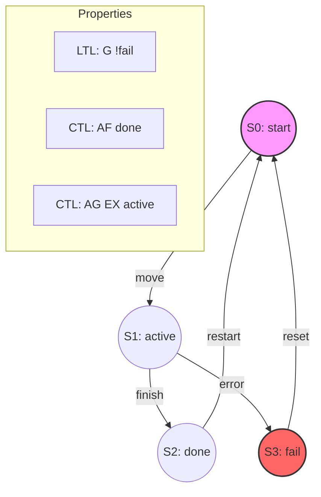

# Temporal Logic: LTL and CTL for Reasoning About Time

> **Temporal logic** is a formal symbolic system used to represent and reason about propositions whose truth values change over time, enabling the verification of safety and liveness properties in reactive systems.

## 1. Historical Background & Motivation

In the early days of computer science, program verification relied heavily on **Hoare Logic**, which uses pre-conditions and post-conditions to reason about programs that transform an input state into an output state and then terminate. However, by the 1970s, a new class of systems emerged: **reactive systems**. Operating systems, air traffic control software, and network protocols do not simply "terminate"; they are intended to run indefinitely, interacting with an environment. To reason about these systems, one needs to describe sequences of states rather than just a beginning and an end.

In 1977, **Amir Pnueli** published his seminal paper "The Temporal Logic of Programs," for which he later received the Turing Award. He proposed using temporal logic—a branch of modal logic—to specify the behavior of concurrent and reactive programs. This shifted the focus from "what the program computes" to "how the program behaves over time." Subsequently, **Edmund M. Clarke**, **E. Allen Emerson**, and **Joseph Sifakis** developed **Model Checking**, an automated technique to verify whether a finite-state model of a system satisfies a temporal logic specification. This work revolutionized hardware design at companies like Intel and IBM and remains the gold standard for safety-critical AI and autonomous systems today.

## 2. Visual Intuition
:::demo
<div style="background:#1e1e1e;padding:16px;border-radius:10px;color:#e5e7eb;font-family:system-ui,sans-serif">
  <h3 style="margin:0 0 8px 0;color:#7dd3fc">Temporal Logic: LTL and CTL for Reasoning About Time - Concept Map</h3>
  <svg width="100%" height="280" viewBox="0 0 640 280" role="img" aria-label="Temporal Logic: LTL and CTL for Reasoning About Time visual intuition" style="background:#111827;border-radius:8px">
    <rect x="24" y="28" width="180" height="64" rx="10" fill="#1d4ed8" />
    <text x="114" y="66" text-anchor="middle" fill="#e5e7eb" font-size="14">Problem</text>
    <rect x="230" y="28" width="180" height="64" rx="10" fill="#0f766e" />
    <text x="320" y="66" text-anchor="middle" fill="#e5e7eb" font-size="14">Process</text>
    <rect x="436" y="28" width="180" height="64" rx="10" fill="#7c3aed" />
    <text x="526" y="66" text-anchor="middle" fill="#e5e7eb" font-size="14">Outcome</text>

    <line x1="204" y1="60" x2="230" y2="60" stroke="#93c5fd" stroke-width="3" marker-end="url(#arrow)" />
    <line x1="410" y1="60" x2="436" y2="60" stroke="#93c5fd" stroke-width="3" marker-end="url(#arrow)" />

    <rect x="24" y="130" width="592" height="120" rx="10" fill="#0b1220" stroke="#334155" />
    <text x="320" y="156" text-anchor="middle" fill="#cbd5e1" font-size="14">Key intuition for Temporal Logic: LTL and CTL for Reasoning About Time</text>
    <text x="320" y="182" text-anchor="middle" fill="#94a3b8" font-size="12">Track state changes, constraints, and final behavior.</text>
    <text x="320" y="206" text-anchor="middle" fill="#94a3b8" font-size="12">Use this as a mental model before formal proofs or code.</text>

    <defs>
      <marker id="arrow" markerWidth="10" markerHeight="10" refX="8" refY="3" orient="auto">
        <polygon points="0 0, 10 3, 0 6" fill="#93c5fd" />
      </marker>
    </defs>
  </svg>
  <p style="margin-top:10px;color:#cbd5e1">Interactive-ready visual scaffold for the topic.</p>
</div>
:::
*Caption: Visualization of basic LTL operators: Next (X), Always (G), Eventually (F), and Until (U). Each dot represents a state in a discrete-time sequence.*

## 3. Core Theory & Mathematical Foundations

Temporal logic extends standard propositional logic with **temporal operators**. To define these formally, we model the system as a **Kripke Structure**.

### 3.1 The Kripke Structure
A Kripke Structure $M$ is a tuple $M = (S, S_0, R, L, \Phi)$ where:
- $S$ is a finite set of states.
- $S_0 \subseteq S$ is the set of initial states.
- $R \subseteq S \times S$ is a transition relation (must be total, meaning every state has at least one successor).
- $L: S \to 2^\Phi$ is a labeling function that assigns a set of atomic propositions to each state.
- $\Phi$ is a set of atomic propositions.

### 3.2 Linear Temporal Logic (LTL)
In LTL, time is viewed as a single, infinite linear sequence of states (a "path").
Let $\pi = s_0, s_1, s_2, \dots$ be a path. We denote the suffix starting at $s_i$ as $\pi^i$.
The semantics of LTL formulas are defined as follows:

1.  $\pi \models p$ if $p \in L(s_0)$.
2.  $\pi \models \neg \phi$ if $\pi \not\models \phi$.
3.  $\pi \models \phi \land \psi$ if $\pi \models \phi$ and $\pi \models \psi$.
4.  **Next:** $\pi \models X \phi$ (or $\bigcirc \phi$) if $\pi^1 \models \phi$.
5.  **Eventually:** $\pi \models F \phi$ (or $\diamondsuit \phi$) if $\exists i \geq 0$ such that $\pi^i \models \phi$.
6.  **Globally:** $\pi \models G \phi$ (or $\Box \phi$) if $\forall i \geq 0, \pi^i \models \phi$.
7.  **Until:** $\pi \models \phi U \psi$ if $\exists i \geq 0$ such that $\pi^i \models \psi$, and $\forall j < i, \pi^j \models \phi$.

### 3.3 Computation Tree Logic (CTL)
LTL reasons about a single path. However, at any state, a system may have multiple possible futures. CTL captures this "branching" nature by introducing path quantifiers:
- **A (All):** The property must hold on all paths starting from the current state.
- **E (Exists):** There exists at least one path starting from the current state where the property holds.

In CTL, every temporal operator ($X, F, G, U$) must be immediately preceded by a path quantifier ($A$ or $E$). Common operators include:
- $AG \phi$: In all paths, $\phi$ is globally true (Invariance).
- $EF \phi$: There exists a path where $\phi$ is eventually true (Reachability).
- $AF \phi$: In all paths, $\phi$ is eventually true (Liveness).

### 3.4 The Fixed-Point Characterization
CTL verification is often implemented using **Fixed-Point Iteration**. Let $[[\phi]]$ be the set of states where formula $\phi$ is true.
- $EF \phi = \mu Z . (\phi \lor EX Z)$ (Least Fixed Point)
- $AG \phi = \nu Z . (\phi \land AX Z)$ (Greatest Fixed Point)

Here, $\mu$ represents the smallest set satisfying the equation, starting from the empty set and growing. $\nu$ represents the largest set, starting from the set of all states and shrinking.

### 3.5 Formal Analysis (Complexity)
1.  **LTL Model Checking:** Given a structure $M$ and a formula $\phi$, checking $M \models \phi$ is **PSPACE-complete**. The size of the automaton generated from an LTL formula is $2^{O(|\phi|)}$.
2.  **CTL Model Checking:** Checking $M \models \phi$ is **P-complete**. The complexity is $O(|M| \times |\phi|)$, where $|M|$ is the number of states/transitions and $|\phi|$ is the number of operators.
3.  **Expressiveness:** LTL and CTL are incomparable. There are properties expressible in LTL that cannot be expressed in CTL (e.g., $FG p$ - "on all paths, eventually $p$ stays true forever"), and properties in CTL that cannot be expressed in LTL (e.g., $AGEF p$ - "from any state, it is always possible to reach a state where $p$ is true").

## 4. Algorithm: CTL Model Checking

The CTL model checking algorithm labels each state $s \in S$ with the sub-formulas of $\phi$ that are true in $s$. It processes formulas from the innermost sub-formulas to the outermost.

1.  **Decompose** formula $\phi$ into sub-formulas.
2.  **Base Case:** Label states with atomic propositions using the labeling function $L$.
3.  **Recursive Step:** For each sub-formula $\psi$:
    - If $\psi = \neg f$, label states not labeled with $f$.
    - If $\psi = f \land g$, label states labeled with both $f$ and $g$.
    - If $\psi = EX f$, label any state that has at least one successor labeled with $f$.
    - If $\psi = E[f U g]$, use a least fixed-point iteration. Start with states labeled $g$. Then, iteratively add states labeled $f$ that have a successor already in the set.
    - If $\psi = EG f$, use a greatest fixed-point iteration. Start with all states labeled $f$. Then, iteratively remove states that do not have at least one successor in the set.
4.  **Final Check:** The formula holds if all initial states $S_0$ are labeled with $\phi$.

## 5. Visual Diagram


*Caption: A Kripke Structure representing a simple task runner. $G \neg fail$ (LTL) asserts that the fail state is never reached. $AF done$ (CTL) asserts that on all paths, the task eventually completes.*

## 6. Implementation

### 6.1 Core CTL Model Checker
This implementation provides a basic labeling algorithm for a subset of CTL operators ($EX$, $EU$, $EG$, and Boolean logic).

```python
class KripkeStructure:
    def __init__(self, states, transitions, labeling):
        """
        states: set of state names
        transitions: dict {src: [dst1, dst2]}
        labeling: dict {state: set(propositions)}
        """
        self.states = states
        self.transitions = transitions
        self.labeling = {s: set(props) for s, props in labeling.items()}

    def check_proposition((self, prop):
        return {s for s in self.states if prop in self.labeling[s]}

    def EX(self, formula_states):
        """EX phi: Exists a next state where phi holds."""
        res = set()
        for s in self.states:
            if any(succ in formula_states for succ in self.transitions.get(s, [])):
                res.add(s)
        return res

    def EU(self, phi_states, psi_states):
        """E[phi U psi]: Exists path where phi holds until psi holds."""
        # Least Fixed Point
        added = True
        res = set(psi_states)
        while added:
            new_states = {s for s in self.states if s in phi_states 
                          and any(succ in res for succ in self.transitions.get(s, []))}
            before_size = len(res)
            res.update(new_states)
            added = len(res) > before_size
        return res

    def EG(self, phi_states):
        """EG phi: Exists path where phi holds globally."""
        # Greatest Fixed Point
        res = set(phi_states)
        added = True
        while added:
            new_states = {s for s in res if any(succ in res for succ in self.transitions.get(s, []))}
            before_size = len(res)
            res = new_states
            added = len(res) < before_size
        return res

# Sample Usage
states = {'s0', 's1', 's2'}
adj = {'s0': ['s1'], 's1': ['s0', 's2'], 's2': ['s2']}
labels = {'s0': {'start'}, 's1': {'work'}, 's2': {'done'}}

ks = KripkeStructure(states, adj, labels)
# Query: EF done (Exists a path eventually 'done')
# Note: EF p = E[True U p]
true_states = states
done_states = ks.check_proposition('done')
ef_done = ks.EU(true_states, done_states)
print(f"States satisfying EF done: {ef_done}") # Output: {'s0', 's1', 's2'}
```

### 6.2 Production Considerations: Symbolic Model Checking
In real systems, the number of states is astronomical ($2^{100}+$ for a simple CPU). Explicitly iterating over states (as shown above) fails.
- **BDDs (Binary Decision Diagrams):** Represent sets of states and transitions as boolean functions. Operations like "exists a next state" become logical manipulations on BDDs.
- **SAT-based Model Checking (BMC):** Unroll the transition relation $k$ times and use a SAT solver to find a counterexample path of length $k$ that violates the property.

### 6.3 Common Pitfalls in Code
- **Infinite Loops:** If the transition relation is not total (a state has no outgoing edges), many algorithms break. Always ensure a "self-loop" exists for terminal states.
- **Fixed Point Convergence:** Ensure your update set is monotonic. In $EG$, the set must strictly decrease; in $EU$, it must strictly increase.
- **Labeling Collisions:** When labeling sub-formulas, use unique identifiers (or internal hashes) to avoid overwriting atomic propositions.

## 7. Interactive Demo

:::demo
<!-- title: CTL State Labeling Visualization -->
<!DOCTYPE html>
<html>
<head>
<meta charset="utf-8">
<style>
  body { margin:0; background:#0f1117; color:#e5e7eb; font-family: system-ui, sans-serif; font-size:13px; padding:16px; }
  .canvas-container { position: relative; width: 100%; height: 300px; background: #1e293b; border-radius: 8px; margin-bottom: 10px; }
  canvas { width: 100%; height: 100%; }
  .controls { display: flex; gap: 10px; margin-bottom: 10px; }
  button { background: #3b82f6; color: white; border: none; padding: 6px 12px; border-radius: 4px; cursor: pointer; }
  button:hover { background: #2563eb; }
  .log { font-family: monospace; background: #000; padding: 10px; height: 80px; overflow-y: auto; color: #10b981; }
</style>
</head>
<body>
  <div class="controls">
    <button onclick="startEU()">Run E[phi U psi]</button>
    <button onclick="resetDemo()">Reset</button>
  </div>
  <div class="canvas-container">
    <canvas id="ctlCanvas"></canvas>
  </div>
  <div class="log" id="logBox">System initialized. Nodes: Red (Start), Blue (phi), Green (psi). Goal: Find states satisfying E[phi U psi].</div>

<script>
  const canvas = document.getElementById('ctlCanvas');
  const ctx = canvas.getContext('2d');
  const logBox = document.getElementById('logBox');
  
  canvas.width = canvas.offsetWidth;
  canvas.height = canvas.offsetHeight;

  const nodes = [
    { id: 0, x: 50, y: 150, type: 'start', label: 's0', satisfies: false },
    { id: 1, x: 150, y: 100, type: 'phi', label: 's1', satisfies: false },
    { id: 2, x: 150, y: 200, type: 'phi', label: 's2', satisfies: false },
    { id: 3, x: 250, y: 150, type: 'psi', label: 's3', satisfies: false },
    { id: 4, x: 350, y: 150, type: 'other', label: 's4', satisfies: false }
  ];

  const edges = [[0,1], [0,2], [1,3], [2,1], [3,4], [4,4]];

  function draw() {
    ctx.clearRect(0, 0, canvas.width, canvas.height);
    
    // Draw edges
    edges.forEach(([u, v]) => {
      ctx.beginPath();
      ctx.moveTo(nodes[u].x, nodes[u].y);
      ctx.lineTo(nodes[v].x, nodes[v].y);
      ctx.strokeStyle = "#475569";
      ctx.stroke();
    });

    // Draw nodes
    nodes.forEach(n => {
      ctx.beginPath();
      ctx.arc(n.x, n.y, 20, 0, Math.PI*2);
      if (n.satisfies) {
          ctx.fillStyle = '#f59e0b'; // Highlight color
          ctx.lineWidth = 4;
          ctx.strokeStyle = '#fff';
          ctx.stroke();
      } else {
          ctx.fillStyle = n.type === 'phi' ? '#3b82f6' : (n.type === 'psi' ? '#10b981' : '#64748b');
          ctx.lineWidth = 1;
      }
      ctx.fill();
      ctx.fillStyle = '#fff';
      ctx.fillText(n.label, n.x - 10, n.y + 5);
    });
  }

  function log(msg) {
    logBox.innerText += "\n> " + msg;
    logBox.scrollTop = logBox.scrollHeight;
  }

  async function startEU() {
    log("Starting EU: Base case - states with psi.");
    nodes.forEach(n => { if(n.type === 'psi') n.satisfies = true; });
    draw();
    await new Promise(r => setTimeout(r, 1000));

    let changed = true;
    while(changed) {
      changed = false;
      for(let i=0; i<nodes.length; i++) {
        if(!nodes[i].satisfies && nodes[i].type === 'phi') {
          // Check if any neighbor is satisfied
          const hasSatisfiedNeighbor = edges.some(([u, v]) => u === i && nodes[v].satisfies);
          if(hasSatisfiedNeighbor) {
            nodes[i].satisfies = true;
            changed = true;
            log(`State ${nodes[i].label} now satisfies EU because it's phi and leads to satisfied state.`);
            draw();
            await new Promise(r => setTimeout(r, 800));
          }
        }
      }
    }
    log("Fixed point reached.");
  }

  function resetDemo() {
    nodes.forEach(n => n.satisfies = false);
    logBox.innerText = "System reset.";
    draw();
  }

  draw();
</script>
</body>
</html>
:::

## 8. Worked Examples

### Example 1: Traffic Light Liveness
Consider a traffic light with states $Green, Yellow, Red$.
**Goal:** Prove that if the light is Red, it eventually becomes Green ($AG(Red \to AF Green)$).

1.  **Formula Breakdown:** We must check $AG(Red \to AF Green)$. In CTL, $Red \to AF Green$ is a state formula.
2.  **Kripke Structure:** $S = \{G, Y, R\}$, Transitions: $G \to Y, Y \to R, R \to G$.
3.  **Labeling:**
    - States with proposition $Green$: $\{G\}$.
    - States with $AF Green$:
        - Iteration 1: $\{G\}$ (since $Green$ holds).
        - Iteration 2: Add states where all successors are in $\{G\}$. $R$ transitions only to $G$. So $\{G, R\}$.
        - Iteration 3: Add states where all successors are in $\{G, R\}$. $Y$ transitions to $R$. So $\{G, R, Y\}$.
        - Result for $AF Green$: All states $\{G, Y, R\}$.
4.  **Implication:** $Red \to AF Green$ is true if $(\neg Red \lor AF Green)$. Since $AF Green$ is true everywhere, the implication is true everywhere.
5.  **Global check:** $AG(True)$ is true everywhere. Thus, the property holds.

### Example 2: Non-Reachability in a Distributed System
Verify that two processes $P1, P2$ are never in their critical section $CS$ simultaneously.
- **Formula:** $AG \neg(CS_1 \land CS_2)$.
- **Method:** Search for any state labeled with $(CS_1 \land CS_2)$. If the reachable set of states (starting from $S_0$) intersects with this set, the property is violated.
- **Edge Case:** If the transition relation allows $P1$ to stay in $CS_1$ forever without progressing, this is a **Fairness** violation. Standard CTL does not handle fairness constraints well without extensions (Fair CTL).

## 9. Comparison with Alternatives

| Logic / Method | Expressiveness | Verification Complexity | Perspective | Best Used For |
|---|---|---|---|---|
| **LTL** | High (Path-based) | PSPACE-complete | Linear | Fairness, specific trace analysis |
| **CTL** | Moderate (Branching) | P-complete | Tree-like | Efficient large-scale model checking |
| **CTL*** | Very High | PSPACE-complete | Hybrid | Academic research, complex properties |
| **TLA+** | High (Set Theory) | Manual/Model Check | State-based | Distributed systems, high-level design |

## 10. Industry Applications & Real Systems

- **Amazon Web Services (AWS)**: Uses **TLA+** (based on temporal logic) to verify the design of complex distributed systems like S3 and DynamoDB. This found bugs that had existed for years but were unreachable via testing.
- **Intel / NVIDIA**: Utilize **SystemVerilog Assertions (SVA)**, which incorporates LTL, to verify hardware logic. Post-Pentium FDIV bug, hardware verification is almost entirely formal.
- **Microsoft**: The **SLAM** project (Static Driver Verifier) uses temporal logic to ensure that third-party Windows drivers correctly interact with the kernel (e.g., "never release a lock that hasn't been acquired").
- **Autonomous Vehicles (Waymo/Tesla)**: Safety specifications are often written in **Signal Temporal Logic (STL)**, an extension of LTL for continuous-time signals, to define safety envelopes (e.g., "Always maintain distance $d$ unless speed is $< v$").

## 11. Practice Problems

### 🟢 Easy
1. **LTL Negation**: Express the negation of $G(p \to F q)$ in LTL.
   *Hint: Push the negation inside the operators. What is $\neg G \phi$?*
   *Expected: $F(p \land G \neg q)$*

### 🟡 Medium
2. **CTL Expressiveness**: Prove that $AF AG p$ is not equivalent to $AG AF p$. Provide a simple Kripke structure that distinguishes them.
   *Hint: $AF AG p$ means on every path, you eventually reach a state where $p$ stays true forever. $AG AF p$ means $p$ is infinitely often true.*

3. **Mutex Verification**: Given a 2-process mutex protocol, write a CTL formula to express "Strict Alternation": if Process 1 enters the critical section, Process 2 must be the next one to enter it.

### 🔴 Hard
4. **LTL to Büchi**: Convert the LTL formula $G(p \to X q)$ into a non-deterministic Büchi Automaton.
   *Hint: The states of the automaton must track whether $p$ was just seen and whether $q$ is expected next.*

5. **Fixed Point Derivation**: Derive the greatest fixed-point iteration steps for $AG p$ on a chain of 4 states $s_0 \to s_1 \to s_2 \to s_3 \to s_3$, where $p$ is false only at $s_3$.

## 12. Interactive Quiz

:::quiz
**Q1: Which operator is used to define "Liveness" (something good eventually happens)?**
- A) G p
- B) F p
- C) X p
- D) p U q
> B — F (Eventually) defines liveness. G defines safety (something bad never happens).

**Q2: What is the primary difference between LTL and CTL?**
- A) LTL is only for finite time; CTL is for infinite time.
- B) LTL views time as a sequence; CTL views time as a branching tree.
- C) LTL is faster to check than CTL.
- D) CTL does not support the "Until" operator.
> B — This is the fundamental distinction: linear vs. branching time.

**Q3: If a CTL formula is true in a Kripke structure, is it guaranteed to be true in all paths?**
- A) Yes, always.
- B) Only if the formula starts with the 'A' quantifier.
- C) Only if the formula starts with the 'E' quantifier.
- D) No, CTL only reasons about probabilities.
> B — 'A' (All) quantifies over all paths. 'E' only requires existence of one path.

**Q4: The complexity of CTL model checking is O(|M| * |phi|). What does |M| represent?**
- A) Number of propositions.
- B) Number of atomic variables.
- C) Sum of states and transitions in the Kripke structure.
- D) Maximum path length.
> C — The size of the model. This linear complexity is why CTL is popular for large systems.

**Q5: Which of these LTL formulas expresses "p is true infinitely often"?**
- A) FG p
- B) GF p
- C) G(p -> X p)
- D) F p
> B — GF p: "Globally, it is eventually true," meaning no matter how far you go, it will happen again.
:::

## 13. Interview Preparation

### Conceptual Questions
**Q: Explain the "State Explosion Problem" in Temporal Logic.**
*A: When modeling concurrent systems, the number of states in the Kripke structure grows exponentially with the number of components (e.g., $N$ boolean variables lead to $2^N$ states). This makes explicit-state model checking (like our Python implementation) impossible for complex systems. We solve this using Symbolic Model Checking (BDDs) or SAT-based Bounded Model Checking.*

**Q: How do you verify a safety property ($G \neg bad$) vs. a liveness property ($F good$)?**
*A: Safety properties are verified by showing no "bad" state is reachable from the start (Reachability analysis). Liveness properties are more complex; they require looking for cycles in the state graph where the "good" thing never happens (Lasso-shaped counterexamples).*

**Q: Compare LTL and Unit Testing.**
*A: Unit testing explores a finite set of specific execution traces. Temporal logic (via model checking) explores **all** possible executions, including those caused by non-deterministic thread scheduling or environment inputs. Model checking is "exhaustive testing."*

### Quick Reference
| Property | LTL | CTL |
|---|---|---|
| Model Checking Complexity | PSPACE-complete | P-complete |
| Satisfiability | PSPACE-complete | EXPTIME-complete |
| Quantification | Implicitly Universal | Explicit (A or E) |
| System Model | Paths | Computation Trees |

## 14. Key Takeaways
1. **LTL/CTL provide the grammar** for specifying time-varying behavior in AI and software systems.
2. **Safety** means "bad things never happen" ($G \neg error$); **Liveness** means "good things eventually happen" ($F goal$).
3. **Model Checking** is the automated process of checking a model against these formulas.
4. **CTL is computationally cheaper** but LTL can express complex fairness constraints more naturally.
5. **Symbolic methods (BDDs/SAT)** are necessary in industry to handle the state explosion problem.
6. **In AI Planning**, temporal logic allows agents to follow complex, multi-stage constraints beyond just reaching a goal.

## 15. Common Misconceptions
- ❌ **"LTL is always better because it's more expressive."** → ✅ CTL is significantly more efficient ($P$ vs $PSPACE$) and can express "reset" or "reachability" properties ($AGEF$) that LTL cannot.
- ❌ **"Model checking replaces testing."** → ✅ Model checking verifies the *design* (model). If the model doesn't match the actual code, bugs will still exist.
- ❌ **"Temporal logic is only for hardware."** → ✅ It is increasingly used in NLP for temporal extraction and in Robotics for safety-constrained path planning.

## 16. Further Reading
- *Principles of Model Checking* by Baier and Katoen — The definitive modern textbook.
- *Logic in Computer Science* by Huth and Ryan — Excellent introduction to LTL/CTL semantics.
- *Pnueli, A. (1977). "The temporal logic of programs"* — The seminal paper.
- *TLA+ Video Course* by Leslie Lamport — Practical application of these concepts at scale.

## 17. Related Topics
- [[arc-consistency]] — Used in the underlying constraint satisfaction for some logic solvers.
- [[monte-carlo-tree-search]] — While MCTS is probabilistic, CTL explores trees deterministically.
- [[description-logics]] — Another branch of logic used in Knowledge Representation.
- [[heuristic-design]] — Temporal logic can be used to prune search trees in state-space planning.
