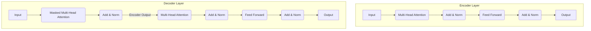

# Transformer Architecture

> The Transformer is a deep learning model architecture that uses a self-attention mechanism to process sequential data, allowing for parallelization and establishing a new state-of-the-art in natural language processing.

## Overview
The Transformer architecture, introduced in the 2017 paper "Attention Is All You Need," is a revolutionary deep learning model that has become the foundation for most modern natural language processing (NLP) systems. Unlike previous state-of-the-art models like Recurrent Neural Networks (RNNs) and LSTMs, which process data sequentially, the Transformer is designed for parallel processing, making it much more efficient to train on large datasets.

The key innovation of the Transformer is the **self-attention mechanism**, which allows the model to weigh the importance of different words in an input sequence when processing a particular word. This enables the model to capture long-range dependencies and complex contextual relationships in a way that was difficult for RNNs. The Transformer architecture is the basis for popular large language models like GPT, BERT, and T5.

## 2. Visual Intuition
:::demo
<div style="background:#1e1e1e;padding:16px;border-radius:10px;color:#e5e7eb;font-family:system-ui,sans-serif">
  <h3 style="margin:0 0 8px 0;color:#7dd3fc">Transformer Architecture - Concept Map</h3>
  <svg width="100%" height="280" viewBox="0 0 640 280" role="img" aria-label="Transformer Architecture visual intuition" style="background:#111827;border-radius:8px">
    <rect x="24" y="28" width="180" height="64" rx="10" fill="#1d4ed8" />
    <text x="114" y="66" text-anchor="middle" fill="#e5e7eb" font-size="14">Problem</text>
    <rect x="230" y="28" width="180" height="64" rx="10" fill="#0f766e" />
    <text x="320" y="66" text-anchor="middle" fill="#e5e7eb" font-size="14">Process</text>
    <rect x="436" y="28" width="180" height="64" rx="10" fill="#7c3aed" />
    <text x="526" y="66" text-anchor="middle" fill="#e5e7eb" font-size="14">Outcome</text>

    <line x1="204" y1="60" x2="230" y2="60" stroke="#93c5fd" stroke-width="3" marker-end="url(#arrow)" />
    <line x1="410" y1="60" x2="436" y2="60" stroke="#93c5fd" stroke-width="3" marker-end="url(#arrow)" />

    <rect x="24" y="130" width="592" height="120" rx="10" fill="#0b1220" stroke="#334155" />
    <text x="320" y="156" text-anchor="middle" fill="#cbd5e1" font-size="14">Key intuition for Transformer Architecture</text>
    <text x="320" y="182" text-anchor="middle" fill="#94a3b8" font-size="12">Track state changes, constraints, and final behavior.</text>
    <text x="320" y="206" text-anchor="middle" fill="#94a3b8" font-size="12">Use this as a mental model before formal proofs or code.</text>

    <defs>
      <marker id="arrow" markerWidth="10" markerHeight="10" refX="8" refY="3" orient="auto">
        <polygon points="0 0, 10 3, 0 6" fill="#93c5fd" />
      </marker>
    </defs>
  </svg>
  <p style="margin-top:10px;color:#cbd5e1">Interactive-ready visual scaffold for the topic.</p>
</div>
:::
*Caption: The complete architecture of the Transformer, showing the encoder stack on the left and the decoder stack on the right.*

## Core Theory
The Transformer architecture consists of an encoder and a decoder, each composed of a stack of identical layers.

**Encoder:**
Each encoder layer has two main sub-layers:
1.  **Multi-Head Self-Attention:** This mechanism allows the model to attend to different parts of the input sequence simultaneously. It computes a set of attention weights that determine how much focus to place on each word when encoding a specific word.
2.  **Position-wise Feed-Forward Network:** A fully connected feed-forward network that is applied to each position separately and identically.

**Decoder:**
Each decoder layer has three main sub-layers:
1.  **Masked Multi-Head Self-Attention:** Similar to the encoder's self-attention, but "masked" to prevent positions from attending to subsequent positions. This ensures that the predictions for position `i` can depend only on the known outputs at positions less than `i`.
2.  **Encoder-Decoder Attention:** This layer allows the decoder to attend to the output of the encoder, which contains the information from the input sequence.
3.  **Position-wise Feed-Forward Network:** Same as in the encoder.

**Positional Encoding:**
Since the Transformer does not use recurrence, it has no inherent sense of word order. To address this, **positional encodings** are added to the input embeddings to give the model information about the position of each word in thesequence.

## Visual Diagram

*A simplified view of the sub-layers within a single encoder and decoder layer of the Transformer.*

## Code Example
```python
# Using the Hugging Face Transformers library
# Note: You need to install transformers and torch: pip install transformers torch
from transformers import pipeline

# Load a pre-trained sentiment analysis pipeline
classifier = pipeline('sentiment-analysis')

# Analyze some text
results = classifier("The Transformer architecture is a major breakthrough in AI.")
print(results)
# Expected output (example): [{'label': 'POSITIVE', 'score': 0.999...}]

results = classifier("I find RNNs to be slow and difficult to train.")
print(results)
# Expected output (example): [{'label': 'NEGATIVE', 'score': 0.999...}]
```

## Interactive Demo
:::demo
<!-- title: "Self-Attention Visualization" -->
<!DOCTYPE html>
<html>
<head>
<meta charset="utf-8">
<style>
  body { margin:0; background:#0f1117; color:#e5e7eb; font-family: system-ui, sans-serif; padding: 20px; }
  .sentence { display: flex; gap: 10px; }
  .word { padding: 10px; border-radius: 5px; cursor: pointer; }
  .word.active { background: #3b82f6; }
</style>
</head>
<body>
<h3>Self-Attention (Conceptual)</h3>
<p>Click on a word to see its "attention" to other words.</p>
<div id="sentence" class="sentence"></div>
<script>
    const sentence = "The animal didn't cross the street because it was too tired".split(' ');
    const sentenceDiv = document.getElementById('sentence');

    sentence.forEach((word, idx) => {
        const wordDiv = document.createElement('div');
        wordDiv.className = 'word';
        wordDiv.textContent = word;
        wordDiv.dataset.idx = idx;
        wordDiv.addEventListener('click', (e) => highlightAttention(e.target));
        sentenceDiv.appendChild(wordDiv);
    });

    function highlightAttention(clickedWord) {
        const words = document.querySelectorAll('.word');
        words.forEach(w => w.style.opacity = 0.5);
        
        clickedWord.style.opacity = 1;
        clickedWord.classList.add('active');

        if (clickedWord.textContent === 'it') {
            const animalWord = Array.from(words).find(w => w.textContent === 'animal');
            animalWord.style.opacity = 1;
        }
    }
</script>
</body>
</html>
:::

## Worked Example
**Problem:** Why is masking necessary in the decoder's self-attention layer?

**Solution:**
The decoder in a Transformer is auto-regressive, meaning it generates the output sequence one token at a time. When predicting the token at position `i`, the model should only have access to the previously generated tokens (positions `1` to `i-1`). The mask is applied to the self-attention scores to prevent the model from "cheating" by looking at future tokens in the output sequence.

## Industry Applications
- **Machine Translation:** Google Translate and other services use Transformer-based models.
- **Search Engines:** To better understand user queries and the content of web pages.
- **Content Generation:** For writing articles, generating code, and creating marketing copy (e.g., GPT-3, Claude).
- **Drug Discovery:** To predict protein structures and design new molecules.

## Practice Problems

### Easy
1. What is the main advantage of the Transformer architecture over RNNs?

### Medium
2. What is the purpose of positional encodings?

### Hard
3. Explain the difference between the self-attention mechanism in the encoder and the masked self-attention mechanism in the decoder.

## Interactive Quiz
:::quiz
**Q1:** The key innovation of the Transformer architecture is the...
- A) Recurrent connection
- B) Convolutional layer
- C) Self-attention mechanism
- D) Fully connected layer
> C — The self-attention mechanism allows the model to weigh the importance of different words in a sequence.

**Q2:** Why are positional encodings necessary in a Transformer?
- A) To make the model run faster.
- B) Because the model has no inherent sense of word order.
- C) To reduce the memory usage of the model.
- D) To handle out-of-vocabulary words.
> B — Unlike RNNs, Transformers do not process data sequentially, so they need an explicit way to incorporate positional information.

**Q3:** Which of the following models is based on the Transformer architecture?
- A) Word2Vec
- B) LSTM
- C) BERT
- D) AlexNet
> C — BERT (Bidirectional Encoder Representations from Transformers) is one of the most well-known models based on the Transformer architecture.
:::

## Interview Questions

**Q: What is the Transformer architecture?**
*A: The Transformer is a deep learning architecture that relies on a self-attention mechanism to process sequential data. It consists of an encoder and a decoder, and it is highly parallelizable, which makes it very efficient for training on large datasets. It is the foundation for most modern NLP models.*

**Q: What is self-attention?**
*A: Self-attention is a mechanism that allows the model to weigh the importance of different words in an input sequence when processing a particular word. It does this by computing a set of attention scores between each pair of words, which are then used to create a weighted representation of the sequence.*

**Q: What is the difference between an encoder-only model like BERT and a decoder-only model like GPT?**
*A: An encoder-only model like BERT is designed to create a deep, bidirectional representation of the input text, making it very good for understanding tasks like text classification and named entity recognition. A decoder-only model like GPT is designed to generate text auto-regressively, making it very good for creative writing, summarization, and dialogue.*

**Q: What is multi-head attention?**
*A: Multi-head attention allows the model to jointly attend to information from different representation subspaces at different positions. It runs the self-attention mechanism multiple times in parallel and then concatenates the results. This allows the model to learn different types of relationships between words.*

## Key Takeaways
- The Transformer is the state-of-the-art architecture for NLP.
- The self-attention mechanism is the key innovation.
- Transformers are highly parallelizable and efficient to train.
- Positional encodings are used to incorporate word order information.
- The Transformer is the basis for popular models like GPT and BERT.

## Common Misconceptions
- ❌ Transformers are only useful for NLP. → ✅ Transformers are now being used in many other domains, including computer vision, audio processing, and bioinformatics.
- ❌ Bigger Transformer models are always better. → ✅ While larger models tend to be more powerful, they are also more expensive to train and run. The best model for a given task depends on the specific requirements.

## Related Topics
- [[natural-language-processing]] — The field where the Transformer architecture was first developed and has had the biggest impact.
- [[deep-learning]] — The Transformer is a type of deep neural network.
- [[recurrent-neural-networks]] — The architecture that the Transformer replaced as the state-of-the-art for NLP.
