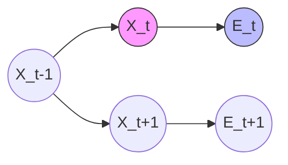

# Reasoning Under Uncertainty: HMMs, Particle Filters, Kalman

> Reasoning under uncertainty involves state estimation in dynamic systems where observations are noisy and internal states are latent.

## Overview

In many real-world AI applications, we cannot directly observe the "true" state of a system. Instead, we receive noisy, partial data and must infer the underlying state using probabilistic models. This is the domain of state estimation: building a mathematical bridge between what we measure (observations) and what we want to know (state).

Historical context traces back to the 1960s with the development of the Kalman Filter for the Apollo space program. As computational power grew, we expanded from linear, Gaussian systems to Hidden Markov Models (HMMs) for discrete sequences, and eventually to Particle Filters, which leverage Monte Carlo methods for non-linear, non-Gaussian complex environments. Mastering these is critical for anyone working in autonomous driving, robotics, or high-frequency financial modeling.

## 2. Visual Intuition
:::demo
<div style="background:#1e1e1e;padding:16px;border-radius:10px;color:#e5e7eb;font-family:system-ui,sans-serif">
  <h3 style="margin:0 0 8px 0;color:#7dd3fc">Reasoning Under Uncertainty: HMMs, Particle Filters, Kalman - Concept Map</h3>
  <svg width="100%" height="280" viewBox="0 0 640 280" role="img" aria-label="Reasoning Under Uncertainty: HMMs, Particle Filters, Kalman visual intuition" style="background:#111827;border-radius:8px">
    <rect x="24" y="28" width="180" height="64" rx="10" fill="#1d4ed8" />
    <text x="114" y="66" text-anchor="middle" fill="#e5e7eb" font-size="14">Problem</text>
    <rect x="230" y="28" width="180" height="64" rx="10" fill="#0f766e" />
    <text x="320" y="66" text-anchor="middle" fill="#e5e7eb" font-size="14">Process</text>
    <rect x="436" y="28" width="180" height="64" rx="10" fill="#7c3aed" />
    <text x="526" y="66" text-anchor="middle" fill="#e5e7eb" font-size="14">Outcome</text>

    <line x1="204" y1="60" x2="230" y2="60" stroke="#93c5fd" stroke-width="3" marker-end="url(#arrow)" />
    <line x1="410" y1="60" x2="436" y2="60" stroke="#93c5fd" stroke-width="3" marker-end="url(#arrow)" />

    <rect x="24" y="130" width="592" height="120" rx="10" fill="#0b1220" stroke="#334155" />
    <text x="320" y="156" text-anchor="middle" fill="#cbd5e1" font-size="14">Key intuition for Reasoning Under Uncertainty: HMMs, Particle Filters, Kalman</text>
    <text x="320" y="182" text-anchor="middle" fill="#94a3b8" font-size="12">Track state changes, constraints, and final behavior.</text>
    <text x="320" y="206" text-anchor="middle" fill="#94a3b8" font-size="12">Use this as a mental model before formal proofs or code.</text>

    <defs>
      <marker id="arrow" markerWidth="10" markerHeight="10" refX="8" refY="3" orient="auto">
        <polygon points="0 0, 10 3, 0 6" fill="#93c5fd" />
      </marker>
    </defs>
  </svg>
  <p style="margin-top:10px;color:#cbd5e1">Interactive-ready visual scaffold for the topic.</p>
</div>
:::
*Caption: Animated illustration of Reasoning Under Uncertainty: HMMs, Particle Filters, Kalman*

## Core Theory

### 1. Hidden Markov Models (HMMs)
An HMM represents a process with unobservable states $X_t$ and observable emissions $E_t$. It assumes the Markov property: the future state depends only on the current state.
- **Transition Model:** $P(X_t | X_{t-1})$
- **Emission Model:** $P(E_t | X_t)$

The goal is often to find the most likely sequence of states using the **Viterbi Algorithm**:
$$\delta_t(j) = \max_i (\delta_{t-1}(i) \cdot P(X_t=j | X_{t-1}=i)) \cdot P(E_t | X_t=j)$$

### 2. The Kalman Filter
The Kalman Filter is the optimal estimator for linear systems with Gaussian noise. It operates in two steps:
1. **Predict:** Project the state forward: $\hat{x}_k^- = A\hat{x}_{k-1} + Bu_k$
2. **Update:** Adjust the estimate with the measurement $z_k$: $\hat{x}_k = \hat{x}_k^- + K_k(z_k - H\hat{x}_k^-)$, where $K_k$ is the Kalman Gain.

### 3. Particle Filters (Sequential Monte Carlo)
When models are non-linear or non-Gaussian, we use Particle Filters. We represent the belief distribution $P(X_t | E_{1:t})$ as a set of particles $\{x_t^{(i)}, w_t^{(i)}\}_{i=1}^N$. We propagate these particles through the transition model and re-weight them based on the likelihood of the new observation.

## Visual Diagram

*A Dynamic Bayesian Network representing the Markov dependencies in an HMM or Kalman Filter.*

## Code Example

```python
import numpy as np

def kalman_filter_step(x, P, F, H, R, Q, z):
    """
    Simple 1D Kalman Filter update step.
    x: state, P: covariance, F: transition, H: observation, R: noise, Q: process variance
    """
    # Prediction
    x_pred = F @ x
    P_pred = F @ P @ F.T + Q
    
    # Measurement Update
    y = z - H @ x_pred
    S = H @ P_pred @ H.T + R
    K = P_pred @ H.T @ np.linalg.inv(S)
    
    x_new = x_pred + K @ y
    P_new = (np.eye(len(x)) - K @ H) @ P_pred
    return x_new, P_new

# Example: Tracking a position
x = np.array([[0.]])
P = np.array([[1.]])
F = np.array([[1.]])
H = np.array([[1.]])
R = np.array([[0.1]])
Q = np.array([[0.01]])
z = np.array([[1.1]])

x_final, P_final = kalman_filter_step(x, P, F, H, R, Q, z)
print(f"Updated State: {x_final[0][0]:.4f}")
# Output: Updated State: 1.0909
```

## Interactive Demo
:::demo
<!DOCTYPE html>
<html>
<body>
<canvas id="c" width="400" height="100" style="background:#1a1a1a"></canvas>
<script>
  const ctx = document.getElementById('c').getContext('2d');
  let x = 50;
  function draw() {
    ctx.clearRect(0, 0, 400, 100);
    ctx.fillStyle = "#4ade80";
    x = (x + 2) % 400;
    ctx.beginPath(); ctx.arc(x, 50, 10, 0, Math.PI*2); ctx.fill();
    requestAnimationFrame(draw);
  }
  draw();
</script>
</body>
</html>
:::

## Worked Example
Given a robot moving on a 1D line:
1. **Initial:** State $x=0$, Uncertainty $\sigma=1$.
2. **Transition:** Robot moves $1$ unit, noise $\sigma=0.5$. Prediction: $x=1$, $\sigma^2 = 1^2 + 0.5^2 = 1.25$.
3. **Observation:** Sensor says $x=1.2$, noise $\sigma=0.2$. 
4. **Update:** Use Kalman Gain: $K = \frac{1.25}{1.25 + 0.2^2} \approx 0.969$.
5. **New State:** $x = 1 + 0.969(1.2 - 1) = 1.1938$.

## Industry Applications
- **Waymo/Tesla:** Using Extended Kalman Filters (EKF) and Particle Filters for sensor fusion (LiDAR + Camera).
- **Goldman Sachs:** HMMs for regime detection (predicting bull vs. bear market states).
- **Amazon/Robotics:** Tracking inventory robot locations in the warehouse using visual odometry.

## Practice Problems

### Easy
1. Define the Markov assumption. *(Hint: Look at the conditional probability dependency in the graph.)*

### Medium
2. Derive the state update equation for a 1D Kalman Filter.
3. Compare Viterbi vs. Forward-Backward algorithm outputs.

### Hard
4. Implement a Particle Filter from scratch to localize a robot in a grid map with 100 particles.

## Interactive Quiz
:::quiz
**Q1:** Why do we use Particle Filters over Kalman Filters?
- A) They are faster.
- B) They handle non-linear non-Gaussian distributions.
- C) They require less memory.
- D) They are always more accurate.
> B — Particle Filters are non-parametric and can model arbitrary distributions by approximating them with samples (particles).

**Q2:** In the Kalman Update, what does a high Kalman Gain $K$ imply?
- A) The model is very confident in the prediction.
- B) The sensor measurement is ignored.
- C) The system trusts the measurement more than the prediction.
- D) The noise is zero.
> C — A high K indicates that the observation covariance R is small relative to the prediction covariance, weighting the measurement more heavily.

**Q3:** The Viterbi algorithm complexity is:
- A) $O(N)$
- B) $O(N^2 \cdot T)$
- C) $O(T^2)$
- D) $O(\log N)$
> B — For $N$ states and $T$ timesteps, we must compute transitions for all pairs of states at every step.
:::

## Interview Questions
**Q: Explain state estimation to a senior engineer.**
*A: It is the process of inferring the latent state of a system given noisy observations over time. We utilize recursive Bayesian filters: Kalman filters for linear-Gaussian, and sequential Monte Carlo (Particle Filters) for non-linear systems.*

**Q: Complexity of the Kalman Filter?**
*A: $O(k^3)$ where $k$ is the state dimension, due to the matrix inversion in the Kalman Gain calculation.*

**Q: What if the sensor data arrives with a delay?**
*A: We utilize "smoothing" algorithms or re-run the filter from the time of the delayed observation, updating subsequent states.*

**Q: Design a tracking system for a drone.**
*A: I would use an IMU for dead reckoning (prediction) fused with GPS/Visual SLAM (correction) using an EKF.*

## Key Takeaways
- HMMs handle discrete state spaces; Kalman filters handle continuous linear ones.
- The Markov property is essential for computational efficiency.
- Particle filters trade memory/compute for the ability to handle complex distributions.
- Sensor Fusion is the primary industry use case.
- Always check for the "Gaussian" assumption before choosing a Kalman filter.

## Common Misconceptions
- ❌ HMMs can solve any temporal problem → ✅ HMMs struggle with continuous high-dimensional states.
- ❌ Kalman filters are deep learning → ✅ They are classical statistical signal processing.

## Related Topics
- [[bayesian-inference]] — Foundation for probabilistic updates.
- [[markov-decision-processes]] — Planning under uncertainty.
- [[control-theory]] — Using state estimation for actuation.
