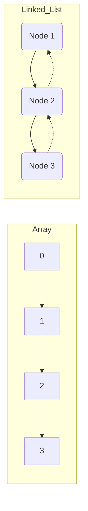

# Arrays and Linked Lists

> Arrays and linked lists represent the fundamental trade-off between memory locality and structural flexibility in computer science.

## Overview
Arrays and linked lists are the foundational building blocks of linear data structures. An array is a collection of elements identified by index or key, stored in a contiguous block of memory. This architecture favors "random access," allowing any element to be retrieved in constant time. Historically, arrays reflect the underlying structure of physical RAM, where CPU instructions perform address calculations to pinpoint data locations directly.

Linked lists represent a paradigm shift: instead of contiguous storage, they use nodes—discrete memory fragments—interconnected by pointers or references. This structure sacrifices the efficiency of random access for the benefit of "dynamic fluidity," allowing for constant-time insertions and deletions at any point in the sequence (provided the reference to the node is known). These structures are the scaffolding upon which complex abstractions like Stacks, Queues, Hash Tables, and Graphs are constructed.

Understanding these structures is essential for systems engineering. While high-level languages like Python abstract away memory management, professional engineers must understand how these structures interact with the CPU cache and memory hierarchy. Arrays exploit spatial locality, leading to higher performance in CPU caches, whereas linked lists introduce "pointer chasing," which can lead to cache misses and performance degradation in high-throughput systems.

## 2. Visual Intuition
:::demo
<div style="background:#1e1e1e;padding:16px;border-radius:10px;color:#e5e7eb;font-family:system-ui,sans-serif">
  <h3 style="margin:0 0 8px 0;color:#7dd3fc">Arrays vs. Linked Lists: Memory Layout</h3>
  <svg width="400" height="280" viewBox="0 0 400 280">
    <defs>
      <marker id="arrowhead" markerWidth="10" markerHeight="7" refX="0" refY="3.5" orient="auto">
        <polygon points="0 0, 10 3.5, 0 7" fill="#7dd3fc" />
      </marker>
    </defs>

    <!-- Array Section -->
    <text x="30" y="35" fill="#e5e7eb" font-size="14">Array (Contiguous Memory)</text>
    <!-- Element 0 -->
    <rect x="30" y="50" width="70" height="40" fill="#4a5568" stroke="#cbd5e1" stroke-width="1"></rect>
    <text x="40" y="75" fill="#e5e7eb" font-size="12">0: 10</text>
    <!-- Element 1 -->
    <rect x="100" y="50" width="70" height="40" fill="#4a5568" stroke="#cbd5e1" stroke-width="1"></rect>
    <text x="110" y="75" fill="#e5e7eb" font-size="12">1: 20</text>
    <!-- Element 2 -->
    <rect x="170" y="50" width="70" height="40" fill="#4a5568" stroke="#cbd5e1" stroke-width="1"></rect>
    <text x="180" y="75" fill="#e5e7eb" font-size="12">2: 30</text>

    <!-- Linked List Section -->
    <text x="30" y="135" fill="#e5e7eb" font-size="14">Linked List (Scattered Nodes)</text>
    <!-- Node 1 -->
    <rect x="30" y="150" width="50" height="40" fill="#4a5568" stroke="#cbd5e1" stroke-width="1"></rect>
    <text x="40" y="175" fill="#e5e7eb" font-size="12">A</text>
    <rect x="80" y="150" width="30" height="40" fill="#2d3748" stroke="#cbd5e1" stroke-width="1"></rect>
    <text x="85" y="175" fill="#e5e7eb" font-size="10">Next</text>

    <!-- Node 2 -->
    <rect x="180" y="200" width="50" height="40" fill="#4a5568" stroke="#cbd5e1" stroke-width="1"></rect>
    <text x="190" y="225" fill="#e5e7eb" font-size="12">B</text>
    <rect x="230" y="200" width="30" height="40" fill="#2d3748" stroke="#cbd5e1" stroke-width="1"></rect>
    <text x="235" y="225" fill="#e5e7eb" font-size="10">Next</text>

    <!-- Node 3 -->
    <rect x="300" y="150" width="50" height="40" fill="#4a5568" stroke="#cbd5e1" stroke-width="1"></rect>
    <text x="310" y="175" fill="#e5e7eb" font-size="12">C</text>
    <rect x="350" y="150" width="30" height="40" fill="#2d3748" stroke="#cbd5e1" stroke-width="1"></rect>
    <text x="355" y="175" fill="#e5e7eb" font-size="10">Null</text>
    <line x1="355" y1="155" x2="375" y2="185" stroke="#e57373" stroke-width="2" />
    <line x1="375" y1="155" x2="355" y2="185" stroke="#e57373" stroke-width="2" />

    <!-- Pointers (arrows) -->
    <line x1="110" y1="170" x2="180" y2="220" stroke="#7dd3fc" stroke-width="2" marker-end="url(#arrowhead)"/>
    <line x1="260" y1="220" x2="300" y2="170" stroke="#7dd3fc" stroke-width="2" marker-end="url(#arrowhead)"/>
  </svg>
  <p style="margin-top:10px;color:#cbd5e1">A visual comparison: The top portion shows a contiguous array where indexes map directly to memory; the bottom portion shows a linked list where nodes are scattered in memory, linked via directional pointers.</p>
</div>
:::
*Caption: A visual comparison of arrays using contiguous memory versus linked list nodes scattered and connected by pointers.*

## Core Theory

### Static and Dynamic Arrays
Static arrays have a fixed size $N$ defined at allocation. The address of an index $i$ is calculated via:
$$Address(i) = BaseAddress + (i \times SizeOfElement)$$
Because the calculation is a simple arithmetic operation, access is $O(1)$. 

Dynamic arrays (e.g., Python `list`) handle resizing by allocating a new, larger memory block (often $2N$) and copying elements when the capacity is exceeded. Using the **amortized analysis** method, we define the cost of $N$ insertions. Since resizing occurs at powers of 2, the total cost $T(N)$ is:
$$T(N) = N + \sum_{i=0}^{\log_2 N} 2^i = N + (2N - 1) = O(N)$$
Dividing by $N$ operations, we get an **amortized cost of $O(1)$** per insertion.

### Linked Lists
A linked list node is defined as $Node = \{data, next\}$.
- **Traversal**: To find the $k$-th element, we must follow $k$ pointers. This is $O(k)$.
- **Insertion/Deletion**: Given a reference to a node, inserting or removing a neighbor involves only updating the pointer:
$$Node.next = NewNode.next$$
$$PrevNode.next = NewNode$$
This is $O(1)$, independent of the total list size $N$.

## Visual Diagram

*Comparison of contiguous memory (Array) vs. node-based pointers (Doubly Linked List).*

## Code Example
```python
# A demonstration of Array vs Singly Linked List performance/logic
class Node:
    def __init__(self, data):
        self.data = data
        self.next = None

# 1. Dynamic Array (List)
my_array = [10, 20, 30]
my_array.append(40) # O(1) amortized
print(f"Array element at index 2: {my_array[2]}") # O(1)

# 2. Singly Linked List
head = Node(10)
head.next = Node(20)
head.next.next = Node(30)

# Traverse to find 30
current = head
while current and current.data != 30:
    current = current.next
print(f"Linked List found node: {current.data}") # O(N)

# Expected Output:
# Array element at index 2: 30
# Linked List found node: 30
```

## Interactive Demo
:::demo
<!DOCTYPE html>
<html>
<body>
<div id="viz" style="display:flex; gap:10px;"></div>
<button onclick="addNode()">Add Node</button>
<script>
  let nodes = 3;
  function addNode() {
    nodes++;
    render();
  }
  function render() {
    document.getElementById('viz').innerHTML = Array(nodes).fill('◯').join(' → ');
  }
  render();
</script>
</body>
</html>
:::

## Worked Example
**Problem:** Delete the node with value `20` from a Linked List: `10 -> 20 -> 30`.

1. **Step 1:** Initialize `current` at head (`10`).
2. **Step 2:** Check `current.next` (is `20`).
3. **Step 3:** The node to delete is `current.next`.
4. **Step 4:** Set `current.next` to `current.next.next` (now `10` points to `30`).
5. **Step 5:** `20` is now garbage collected, resulting in `10 -> 30`.

## Industry Applications
- **Database Indexing (MySQL/PostgreSQL):** Uses B-trees (arrays of pointers) for fast range queries.
- **Operating Systems:** Linked lists are used in Process Schedulers (Ready Queues) for efficient removal of tasks.
- **Web Browsers:** History navigation (Back/Forward) is implemented using Doubly Linked Lists.
- **Music Players:** Playlists often use linked lists to allow arbitrary reordering of tracks without reallocating arrays.

## Practice Problems
### Easy
1. Reverse a singly linked list. *(Hint: Use three pointers: prev, current, next)*
### Medium
2. Find the middle element of a linked list in one pass. *(Hint: Use a slow and fast pointer)*
3. Implement a dynamic array from scratch using a fixed-size array.
### Hard
4. Merge two sorted linked lists into one. *(Hint: Use a dummy head node)*

## Interactive Quiz
:::quiz
**Q1:** What is the primary reason arrays have better cache performance than linked lists?
- A) Arrays have smaller memory footprints.
- B) Linked lists require more pointers.
- C) Contiguous memory allows the CPU to pre-fetch subsequent elements.
- D) Arrays are always stored in the stack.
> C — Contiguous memory blocks allow hardware pre-fetchers to load memory into the L1/L2 cache efficiently.

**Q2:** What is the time complexity of searching in a sorted array using binary search?
- A) $O(N)$
- B) $O(\log N)$
- C) $O(1)$
- D) $O(N \log N)$
> B — Binary search halves the search space each step, resulting in logarithmic complexity.

**Q3:** In a doubly linked list, why might you prefer it over a singly linked list despite the memory overhead?
- A) It uses less memory.
- B) It allows O(1) deletion if the node reference is given.
- C) It is faster at random access.
- D) It avoids pointer chasing.
> B — By having a `prev` pointer, you can immediately access the predecessor to update the linkage, whereas a singly list requires an $O(N)$ search.
:::

## Interview Questions
**Q: Explain Arrays vs. Linked Lists to a senior engineer.**
*A: It comes down to memory access patterns. Arrays maximize spatial locality for cache efficiency, making them superior for read-heavy workloads. Linked lists provide stable memory pointers, allowing for O(1) mutation without shifting elements, at the cost of non-contiguous allocation and pointer chasing.*

**Q: What is the complexity of inserting at the head of an array vs. a linked list?**
*A: In a dynamic array, it is $O(N)$ because every existing element must be shifted right. In a linked list, it is $O(1)$ because we simply re-link the head pointer.*

**Q: What if I have a massive dataset that doesn't fit in contiguous memory?**
*A: You must use a linked structure or a fragmented structure like a Blocked List or B-Tree, as arrays require a single, unbroken contiguous block.*

**Q: How do you handle "Memory Fragmentation" in linked lists?**
*A: Fragmentation is an inherent risk. In systems programming, we often use "Memory Pools" or "Arenas" to allocate nodes in contiguous chunks, effectively simulating arrays to improve cache locality.*

## Key Takeaways
- Arrays: $O(1)$ access, $O(N)$ shift for insertions.
- Linked Lists: $O(N)$ access, $O(1)$ mutation.
- Use arrays for static, read-heavy data.
- Use lists for dynamic, mutation-heavy data.
- Always consider CPU cache locality (spatial locality).
- Amortized complexity is key for dynamic arrays.

## Common Misconceptions
- ❌ "Linked lists are always slower" → ✅ They are slower for searching, but faster for frequent middle-deletions.
- ❌ "Arrays are always faster" → ✅ They are slower for massive insertions in the middle due to $O(N)$ element shifting.

## Related Topics
- [[stacks-queues]] — Built using arrays and linked lists.
- [[hash-tables]] — Uses arrays for storage and linked lists for collision resolution.
- [[trees]] — Generalized linked structures for non-linear data.
