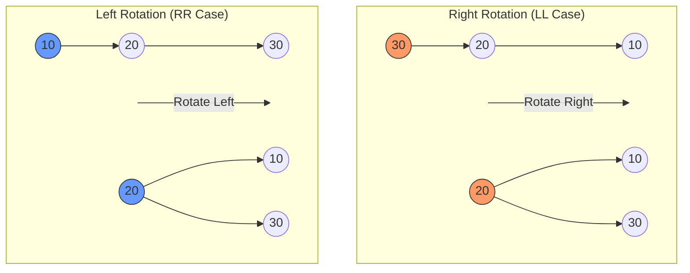

# AVL Trees: Rotation Operations, Balance Factor, and Height Analysis

> An AVL Tree is a self-balancing binary search tree where the heights of the two child subtrees of any node differ by at most one, maintaining $O(\log n)$ operational complexity through local transformations called rotations.

## 1. Historical Background & Motivation

The AVL tree represents a watershed moment in the history of computer science, as it was the first self-balancing binary search tree (BST) ever invented. It was introduced in 1962 by two Soviet mathematicians, **Georgy Adelson-Velsky** and **Evgenii Landis**, in their seminal paper, "An algorithm for the organization of information." Before the AVL tree, the primary concern with Binary Search Trees was their susceptibility to "degeneration." In a standard BST, if keys are inserted in sorted or near-sorted order, the tree collapses into a structure isomorphic to a linked list, causing the search complexity to plummet from $O(\log n)$ to $O(n)$.

In the early 1960s, as computer memory began to expand but processing power remained a bottleneck, the need for guaranteed logarithmic access times became critical for large-scale data retrieval. Adelson-Velsky and Landis solved this by introducing the concept of a "strictly balanced" tree. While subsequent structures like Red-Black Trees (1972) offered faster insertions by relaxing balance constraints, AVL trees remain the gold standard for lookup-intensive applications due to their more rigid height guarantees. Today, the principles of AVL balancing are fundamental to the study of persistent data structures and database indexing.

## 2. Visual Intuition

*Caption: This animation demonstrates the dynamic rebalancing of an AVL tree during sequential insertions. Notice how the tree performs "rotations" to ensure no node's left and right subtrees differ in height by more than one.*

## 3. Core Theory & Mathematical Foundations

The efficiency of an AVL tree is derived from its invariant: the **Balance Factor**.

### 3.1 The Balance Factor (BF)
For any node $N$ in a binary tree, we define the height $H(N)$ as the number of edges on the longest path from $N$ to a leaf. The balance factor $BF(N)$ is defined as:
$$BF(N) = Height(LeftSubtree(N)) - Height(RightSubtree(N))$$

An AVL tree maintains the invariant that for every node $N$:
$$BF(N) \in \{-1, 0, 1\}$$

If at any point the $|BF(N)| > 1$, the tree is considered "unbalanced," and a rotation is required to restore the invariant.

### 3.2 Height Analysis: The Fibonacci Connection
The most critical property of an AVL tree is that its height $h$ is strictly logarithmic relative to the number of nodes $n$. To prove this, we consider the "thinnest" possible AVL tree of height $h$—the tree with the minimum number of nodes $N_h$.

For a tree of height $h$ to be minimal, its subtrees must also be minimal. One subtree must have height $h-1$ and the other $h-2$. Thus:
$$N_h = N_{h-1} + N_{h-2} + 1$$
With base cases $N_0 = 1$ and $N_1 = 2$.

This recurrence relation is strikingly similar to the Fibonacci sequence $F_n = F_{n-1} + F_{n-2}$. Specifically, $N_h = F_{h+2} - 1$. Using the closed-form expression for Fibonacci numbers (Binet's Formula), we can show that:
$$N_h > \left(\frac{1+\sqrt{5}}{2}\right)^h / \sqrt{5} - 1$$
By taking the logarithm of both sides, we find that the height $h$ is bounded:
$$h < 1.44 \log_2(n + 2) - 1.328$$
This proves that even in the worst-case "sparse" scenario, an AVL tree is only roughly 44% taller than a perfectly complete binary tree.

### 3.3 Rotation Mechanics
To maintain balance, AVL trees use four types of rotations. Let $Z$ be the first node that becomes unbalanced after an insertion.

1.  **Left-Left (LL) Case / Right Rotation**: Occurs when a node is added to the left child of the left subtree of $Z$.
2.  **Right-Right (RR) Case / Left Rotation**: Occurs when a node is added to the right child of the right subtree of $Z$.
3.  **Left-Right (LR) Case**: Occurs when a node is added to the right child of the left subtree. This requires a Left Rotation followed by a Right Rotation.
4.  **Right-Left (RL) Case**: Occurs when a node is added to the left child of the right subtree. This requires a Right Rotation followed by a Left Rotation.

### 3.4 Formal Complexity Analysis
*   **Search**: $O(\log n)$. Since the height is $1.44 \log n$, the path from root to leaf is guaranteed logarithmic.
*   **Insertion**: $O(\log n)$. We perform a standard BST insertion ($O(\log n)$), then backtrack to the root, updating heights and performing at most one rotation sequence ($O(1)$) to restore balance.
*   **Deletion**: $O(\log n)$. Similar to insertion, but may require $O(\log n)$ rotations as rebalancing one node might unbalance its parent.

## 4. Algorithm / Process (Step-by-Step)

### Insertion Algorithm
1.  **Standard BST Insert**: Perform a recursive insertion based on key comparison.
2.  **Update Height**: As the recursion unwinds, update the height of each ancestor node: $H(N) = 1 + \max(H(L), H(R))$.
3.  **Calculate Balance Factor**: For each ancestor, calculate $BF = H(L) - H(R)$.
4.  **Check for Imbalance**:
    *   **If $BF > 1$ (Left Heavy)**:
        *   If $key < N.left.key$, perform **Right Rotation** (LL Case).
        *   If $key > N.left.key$, perform **Left Rotation** on $N.left$, then **Right Rotation** on $N$ (LR Case).
    *   **If $BF < -1$ (Right Heavy)**:
        *   If $key > N.right.key$, perform **Left Rotation** (RR Case).
        *   If $key < N.right.key$, perform **Right Rotation** on $N.right$, then **Left Rotation** on $N$ (RL Case).
5.  **Return Node**: Return the (potentially new) root of the subtree to the parent caller.

## 5. Visual Diagram


*Caption: Primitive single rotations. In the LL Case, node 30 is unbalanced (BF=2). A right rotation makes 20 the new root. In the RR Case, node 10 is unbalanced (BF=-2). A left rotation makes 20 the new root.*

## 6. Implementation

### 6.1 Core Implementation
The following Python implementation uses a recursive approach with height caching in each node.

```python
class Node:
    def __init__(self, key):
        self.key = key
        self.left = None
        self.right = None
        self.height = 1  # Height of a new node is 1

class AVLTree:
    def get_height(self, node):
        if not node:
            return 0
        return node.height

    def get_balance(self, node):
        if not node:
            return 0
        return self.get_height(node.left) - self.get_height(node.right)

    def rotate_right(self, z):
        """
        Performs a right rotation.
        Time: O(1)
        """
        y = z.left
        T3 = y.right

        # Perform rotation
        y.right = z
        z.left = T3

        # Update heights
        z.height = 1 + max(self.get_height(z.left), self.get_height(z.right))
        y.height = 1 + max(self.get_height(y.left), self.get_height(y.right))

        return y

    def rotate_left(self, z):
        """
        Performs a left rotation.
        Time: O(1)
        """
        y = z.right
        T2 = y.left

        # Perform rotation
        y.left = z
        z.right = T2

        # Update heights
        z.height = 1 + max(self.get_height(z.left), self.get_height(z.right))
        y.height = 1 + max(self.get_height(y.left), self.get_height(y.right))

        return y

    def insert(self, root, key):
        # 1. Standard BST Insert
        if not root:
            return Node(key)
        elif key < root.key:
            root.left = self.insert(root.left, key)
        else:
            root.right = self.insert(root.right, key)

        # 2. Update height of ancestor node
        root.height = 1 + max(self.get_height(root.left), self.get_height(root.right))

        # 3. Get balance factor
        balance = self.get_balance(root)

        # 4. Rebalance logic
        # Case LL
        if balance > 1 and key < root.left.key:
            return self.rotate_right(root)

        # Case RR
        if balance < -1 and key > root.right.key:
            return self.rotate_left(root)

        # Case LR
        if balance > 1 and key > root.left.key:
            root.left = self.rotate_left(root.left)
            return self.rotate_right(root)

        # Case RL
        if balance < -1 and key < root.right.key:
            root.right = self.rotate_right(root.right)
            return self.rotate_left(root)

        return root

# Example usage:
# tree = AVLTree()
# root = None
# keys = [10, 20, 30, 40, 50, 25]
# for key in keys:
#     root = tree.insert(root, key)
# # Resulting tree will be perfectly balanced.
```

### 6.2 Optimized / Production Variant
In production environments (like the implementation of `std::map` in some C++ libraries, though most use Red-Black trees), we often use an iterative approach to save stack space or use parent pointers to avoid full recursion.

```python
# Iterative balance factor check using a stack
def iterative_rebalance(self, path_stack):
    while path_stack:
        node = path_stack.pop()
        # Update height and check rotations without recursion
        # ... logic similar to recursive insert ...
        pass
```

### 6.3 Common Pitfalls in Code
1.  **Height vs. Depth**: Confusing height (bottom-up) with depth (top-down). AVL requires height.
2.  **Null Checks**: Forgetting to handle `None` children when calling `get_height`. Always use a helper function.
3.  **Rotation Order**: In LR/RL cases, the first rotation happens on the *child*, and the second on the *current node*. Swapping these causes structural corruption.
4.  **Height Updates**: Forgetting to update heights of nodes *after* the pointers have been swapped. The order is: children first, then parent.

## 7. Interactive Demo

:::demo
<!-- title: AVL Rotation Visualizer -->
<!DOCTYPE html>
<html>
<head>
<meta charset="utf-8">
<style>
  body { margin:0; background:#0f1117; color:#e5e7eb; font-family: 'Segoe UI', sans-serif; padding:20px; }
  canvas { background: #1e293b; border-radius: 8px; width: 100%; height: 400px; }
  .controls { margin-bottom: 20px; display: flex; gap: 10px; align-items: center; }
  input { background: #334155; border: 1px solid #475569; color: white; padding: 8px; border-radius: 4px; width: 60px; }
  button { background: #3b82f6; color: white; border: none; padding: 8px 16px; border-radius: 4px; cursor: pointer; }
  button:hover { background: #2563eb; }
  .log { font-family: monospace; font-size: 12px; color: #94a3b8; margin-top: 10px; }
</style>
</head>
<body>
  <div class="controls">
    <input type="number" id="val" value="10">
    <button onclick="addNode()">Insert Key</button>
    <button onclick="resetTree()">Reset</button>
    <span id="status">Add a key to see rotations!</span>
  </div>
  <canvas id="treeCanvas"></canvas>
  <div id="log" class="log"></div>

<script>
class Node {
    constructor(val) {
        this.val = val;
        this.left = null;
        this.right = null;
        this.height = 1;
        this.x = 0; this.y = 0;
    }
}

let root = null;
const canvas = document.getElementById('treeCanvas');
const ctx = canvas.getContext('2d');
const log = document.getElementById('log');

function getHeight(n) { return n ? n.height : 0; }
function getBalance(n) { return n ? getHeight(n.left) - getHeight(n.right) : 0; }

function rotateRight(z) {
    let y = z.left;
    let T3 = y.right;
    y.right = z;
    z.left = T3;
    z.height = Math.max(getHeight(z.left), getHeight(z.right)) + 1;
    y.height = Math.max(getHeight(y.left), getHeight(y.right)) + 1;
    addToLog(`Right Rotate around ${z.val}`);
    return y;
}

function rotateLeft(z) {
    let y = z.right;
    let T2 = y.left;
    y.left = z;
    z.right = T2;
    z.height = Math.max(getHeight(z.left), getHeight(z.right)) + 1;
    y.height = Math.max(getHeight(y.left), getHeight(y.right)) + 1;
    addToLog(`Left Rotate around ${z.val}`);
    return y;
}

function insert(node, val) {
    if (!node) return new Node(val);
    if (val < node.val) node.left = insert(node.left, val);
    else if (val > node.val) node.right = insert(node.right, val);
    else return node;

    node.height = 1 + Math.max(getHeight(node.left), getHeight(node.right));
    let b = getBalance(node);

    if (b > 1 && val < node.left.val) return rotateRight(node);
    if (b < -1 && val > node.right.val) return rotateLeft(node);
    if (b > 1 && val > node.left.val) {
        node.left = rotateLeft(node.left);
        return rotateRight(node);
    }
    if (b < -1 && val < node.right.val) {
        node.right = rotateRight(node.right);
        return rotateLeft(node);
    }
    return node;
}

function drawNode(n, x, y, spacing) {
    if (!n) return;
    n.x = x; n.y = y;
    if (n.left) {
        ctx.beginPath(); ctx.strokeStyle = '#64748b';
        ctx.moveTo(x, y); ctx.lineTo(x - spacing, y + 60); ctx.stroke();
        drawNode(n.left, x - spacing, y + 60, spacing / 1.8);
    }
    if (n.right) {
        ctx.beginPath(); ctx.strokeStyle = '#64748b';
        ctx.moveTo(x, y); ctx.lineTo(x + spacing, y + 60); ctx.stroke();
        drawNode(n.right, x + spacing, y + 60, spacing / 1.8);
    }
    ctx.beginPath();
    ctx.arc(x, y, 18, 0, 2 * Math.PI);
    ctx.fillStyle = '#3b82f6'; ctx.fill();
    ctx.fillStyle = 'white'; ctx.textAlign = 'center'; ctx.fillText(n.val, x, y + 5);
}

function render() {
    canvas.width = canvas.offsetWidth;
    canvas.height = canvas.offsetHeight;
    ctx.clearRect(0, 0, canvas.width, canvas.height);
    if (root) drawNode(root, canvas.width / 2, 40, canvas.width / 4);
}

function addNode() {
    const val = parseInt(document.getElementById('val').value);
    root = insert(root, val);
    render();
}

function resetTree() { root = null; log.innerHTML = ""; render(); }
function addToLog(msg) { log.innerHTML = msg + "<br>" + log.innerHTML; }

window.addEventListener('resize', render);
render();
</script>
</body>
</html>
:::

## 8. Worked Examples

### Example 1 — Sequential Insertion (LL & LR)
Insert keys: `30, 20, 10, 25`

1.  **Insert 30**: Root node created. Height=1.
2.  **Insert 20**: Standard BST. 20 is left child of 30. Height(30)=2, BF(30)=1.
3.  **Insert 10**: 10 is left child of 20.
    *   Update heights: H(10)=1, H(20)=2, H(30)=3.
    *   Check BF(30): $Height(20) - Height(None) = 2 - 0 = 2$. **UNBALANCED**.
    *   Path: Left-Left. Perform **Right Rotation** on 30.
    *   Result: 20 is root, 10 is left child, 30 is right child.
4.  **Insert 25**: 25 is left child of 30.
    *   Tree structure: 20 -> (10, 30 -> (25, None)).
    *   BF(20) = $H(10) - H(30) = 1 - 2 = -1$. (Balanced)

### Example 2 — The Deletion Domino Effect
Consider an AVL tree where we delete a leaf.
1.  Suppose node $X$ is deleted.
2.  We backtrack to the parent $P$ and update height.
3.  If $P$ is unbalanced, we rotate.
4.  Unlike insertion (where 1 rotation fixes the whole tree), rebalancing $P$ might decrease its height relative to $P$'s parent, potentially causing a balance violation further up the tree. We must check all the way to the root.

## 9. Comparison with Alternatives

| Structure | Search | Insert | Delete | Pros | Cons |
|---|---|---|---|---|---|
| **AVL Tree** | $O(\log n)$ | $O(\log n)$ | $O(\log n)$ | Strict balance, faster lookups. | More rotations than Red-Black. |
| **Red-Black Tree** | $O(\log n)$ | $O(\log n)$ | $O(\log n)$ | Faster insertions/deletions. | Taller tree than AVL. |
| **Splay Tree** | $O(\log n)$* | $O(\log n)$* | $O(\log n)$* | Excellent for "hot" keys (cache-like). | Worst-case $O(n)$ per operation. |
| **B-Tree** | $O(\log n)$ | $O(\log n)$ | $O(\log n)$ | Disk-optimized (high fan-out). | Complex implementation for in-memory. |

*\*Amortized complexity*

## 10. Industry Applications & Real Systems

-   **Database Engines (In-Memory)**: While many disk-based databases use B-Trees, in-memory databases or internal indices that require frequent lookups use AVL trees to minimize the number of pointers followed (as they are shorter than Red-Black trees).
-   **Oracle Database**: Uses AVL trees for some of its internal memory management and indexing of memory blocks to ensure strict $O(\log n)$ access times.
-   **V8 JavaScript Engine**: While V8 uses various structures, the concept of self-balancing trees is fundamental in managing the "Hidden Classes" and object property lookups where search performance is critical.
-   **Linux Kernel**: Some variations of the process scheduler and memory management subsystems use balanced trees (specifically Red-Black, but AVL principles apply) to track virtual memory areas (VMAs).
-   **Real-time Systems**: Because AVL trees have a tighter height bound ($1.44 \log n$) than Red-Black trees ($2 \log n$), they are preferred in systems where the "worst-case" lookup time must be strictly minimized.

## 11. Practice Problems

### 🟢 Easy
1.  **Height Check**: Given a BST, write a function to determine if it satisfies the AVL height property.
    *Hint: Use a recursive helper that returns height or -1 if unbalanced.*
    *Expected complexity: $O(n)$*

### 🟡 Medium
2.  **AVL Construction**: Given a sorted array, convert it into an AVL tree.
    *Hint: This is equivalent to finding the middle element repeatedly.*
    *Expected complexity: $O(n)$*

3.  **Rotation Logic**: Implement the `delete` operation for an AVL tree. Ensure you handle the case where a node has two children.
    *Hint: After a standard BST delete, rebalance the same way as insert.*

### 🔴 Hard
4.  **K-th Smallest Element**: Augment an AVL tree so that finding the $k$-th smallest element takes $O(\log n)$ time.
    *Hint: Store the size of the subtree at each node.*
    *Expected complexity: $O(\log n)$*

5.  **Tree Merging**: Given two AVL trees $T_1$ and $T_2$ where all keys in $T_1$ are less than keys in $T_2$, merge them into a single AVL tree in $O(H_1 - H_2)$ time.

## 12. Interactive Quiz

:::quiz
**Q1: What is the maximum height of an AVL tree with $n$ nodes?**
- A) $2 \log_2(n)$
- B) $1.44 \log_2(n)$
- C) $\log_2(n)$
- D) $n/2$
> B — While a perfectly balanced tree is $\log_2(n)$, the "sparse" AVL tree is bounded by approximately $1.44 \log_2(n)$.

**Q2: Which rotation is required if a node is inserted into the left subtree of a right child?**
- A) Single Left (RR)
- B) Single Right (LL)
- C) Right-Left (RL)
- D) Left-Right (LR)
> C — Inserting into the left subtree of a right child makes the node "zig-zag" (Right then Left), requiring an RL double rotation.

**Q3: How many rotations (maximum) are needed to rebalance an AVL tree after an insertion?**
- A) 1 single or double rotation
- B) $O(\log n)$ rotations
- C) 0 rotations
- D) $n$ rotations
> A — A single insertion only requires rebalancing at the first unbalanced node encountered while backtracking, which restores the height of that entire subtree.

**Q4: Why might a developer choose a Red-Black tree over an AVL tree?**
- A) Red-Black trees are faster for lookups.
- B) Red-Black trees have a smaller height.
- C) Red-Black trees require fewer rotations during frequent insertions/deletions.
- D) AVL trees are not $O(\log n)$.
> C — AVL trees are more strictly balanced, meaning they rotate more often to maintain that balance. Red-Black trees are "relaxed" and better for write-heavy workloads.

**Q5: If an AVL tree has a height of 4, what is the minimum number of nodes it can have?**
- A) 4
- B) 7
- C) 12
- D) 15
> C — Using $N_h = N_{h-1} + N_{h-2} + 1$: $N_0=1, N_1=2, N_2=4, N_3=7, N_4=12$.
:::

## 13. Interview Preparation

### Conceptual Questions
**Q: Explain the difference between AVL trees and Red-Black trees as if teaching a junior engineer.**
*A: Think of an AVL tree as a "perfectionist" and a Red-Black tree as "good enough." The AVL tree ensures that the height difference between subtrees is never more than 1, leading to very fast searches. However, maintaining this perfection requires frequent rotations. The Red-Black tree allows a bit more "slack" (one branch can be up to twice as long as another), which means it does less work during updates. Use AVL when you search often and Red-Black when you insert/delete often.*

**Q: Derive the time complexity of an AVL insertion.**
*A: Insertion involves three phases: 1) Searching for the insertion point, which takes $O(h)$ time. 2) Creating the node and updating heights while backtracking, also $O(h)$. 3) Performing at most one rotation sequence, which is $O(1)$. Since the height $h$ is guaranteed to be $O(\log n)$, the total time is $O(\log n) + O(1) = O(\log n)$.*

**Q: In a system design context, when would an AVL tree be a poor choice?**
*A: AVL trees are poor choices for disk-based storage (like file systems or large databases). Because they are binary trees, they have a low fan-out (only 2 children). For disk storage, we want high fan-out (like B-Trees) to minimize disk seeks. Also, if the data is purely sequential and only appended, a simple array or a different structure might be more cache-efficient.*

### Quick Reference (Cheat Sheet)
| Property | Value |
|---|---|
| Worst-case Search | $O(\log n)$ |
| Worst-case Insert | $O(\log n)$ |
| Worst-case Delete | $O(\log n)$ |
| Max Height | $\approx 1.44 \log_2 n$ |
| Balance Factor | $\in \{-1, 0, 1\}$ |
| Rotations on Insert | $\le 2$ (Single or Double) |

## 14. Key Takeaways
1.  **Height Invariant**: Every node's children must differ in height by no more than 1.
2.  **Logarithmic Guarantee**: AVL trees provide a stricter height bound than Red-Black trees, ensuring $O(\log n)$ even in edge cases.
3.  **Local Fixes**: Rotations are local pointer swaps ($O(1)$) that restore global balance.
4.  **Insert vs. Delete**: Insertion requires at most one rotation sequence; deletion may require rotations all the way up to the root.
5.  **Lookups are King**: Choose AVL when the ratio of reads to writes is high.
6.  **Fibonacci Relation**: The minimum number of nodes in an AVL tree follows a Fibonacci-like growth pattern.

## 15. Common Misconceptions
- ❌ **"AVL Trees are always perfectly balanced."** → ✅ They are *height-balanced*, not necessarily *perfectly* balanced (where every leaf is at the same depth).
- ❌ **"Double rotations are two different rebalancing steps."** → ✅ An LR or RL rotation is a single logical rebalancing event triggered by one insertion.
- ❌ **"AVL Trees are used in the Linux Kernel for scheduling."** → ✅ The Linux CFS (Completely Fair Scheduler) actually uses Red-Black Trees because they handle frequent task insertions/deletions more efficiently.

## 16. Further Reading
- *Introduction to Algorithms (CLRS), Chapter 13* — While CLRS focuses on Red-Black trees, the exercise sections provide the foundations for AVL balancing.
- *The Art of Computer Programming, Vol 3 (Knuth)* — Detailed historical analysis and the original mathematical proofs.
- *Adelson-Velsky and Landis (1962)* — The original paper "An algorithm for the organization of information."

## 17. Related Topics
- [[complexity-analysis]] — For understanding why $O(\log n)$ matters.
- [[recursion-basics]] — Essential for implementing tree traversals and insertions.
- [[binary-search-trees]] — The foundation upon which AVL trees are built.
- [[red-black-trees]] — The primary alternative to AVL trees in industry.