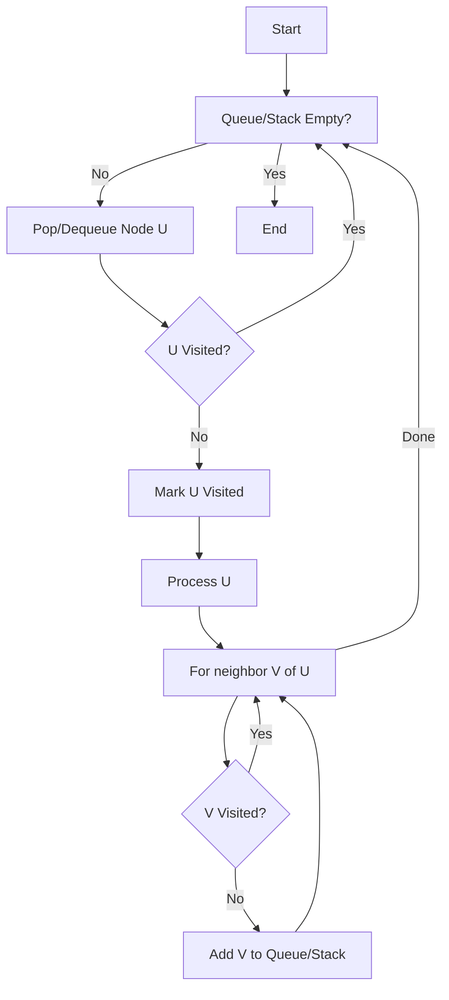

# BFS and DFS: Traversal, Connected Components, and Cycle Detection

> Graph traversal algorithms are the fundamental mechanisms for systematically exploring the vertices and edges of a graph, serving as the "atomic" building blocks for complex operations like shortest-path discovery, topological sorting, and network flow analysis.

## 1. Historical Background & Motivation

The formalization of graph traversal algorithms parallels the evolution of computer science itself. **Depth-First Search (DFS)** finds its roots in the 19th-century work of French mathematician **Charles Pierre Trémaux**, who devised a strategy for navigating mazes. However, it was the work of **John Hopcroft** and **Robert Tarjan** in the early 1970s that elevated DFS to a cornerstone of algorithmic theory. Their research proved that DFS could solve problems like finding biconnected components and planarity testing in linear time, earning them the Turing Award in 1986.

**Breadth-First Search (BFS)** was independently discovered by **Konrad Zuse** in 1945 (though his work was not published for decades) and formally rediscovered by **Edward F. Moore** in 1959 for finding the shortest path through a maze. Shortly after, **C.Y. Lee** applied it to the routing of wires on printed circuit boards. 

In modern engineering, these algorithms are ubiquitous. Whether you are building a web crawler (BFS), resolving dependency graphs in a build system like Bazel (DFS), or identifying clusters in a massive social network, you are applying these fundamental patterns. They represent the two primary ways human thought processes explore information: diving deep into a specific possibility (DFS) or scanning all immediate options before proceeding (BFS).

## 2. Visual Intuition


*Caption: A visualization of BFS expanding outward in concentric layers from a source node, ensuring the shortest path is found in an unweighted graph.*


*Caption: A visualization of DFS diving as deep as possible into a branch before backtracking to explore alternate paths.*

## 3. Core Theory & Mathematical Foundations

To understand BFS and DFS, we define a graph $G = (V, E)$, where $V$ is a set of vertices (nodes) and $E$ is a set of edges (connections). In algorithmic analysis, we typically represent these graphs using an **Adjacency List**, where each vertex $u$ points to a list of its neighbors $Adj[u]$.

### 3.1 Depth-First Search (DFS) and the Parenthesis Theorem
DFS explores a graph by following a path from a starting vertex $s$ as far as it can go before "backtracking." It utilizes a **Last-In, First-Out (LIFO)** strategy, naturally implemented via recursion or an explicit stack. 

A critical mathematical property of DFS is the assignment of **Discovery Times** $d[u]$ and **Finishing Times** $f[u]$ for every vertex $u$.
1. $d[u]$ is the time step when $u$ is first visited (and colored gray).
2. $f[u]$ is the time step when its adjacency list has been fully explored (and $u$ is colored black).

**The Parenthesis Theorem** states that for any two vertices $u$ and $v$, the intervals $[d[u], f[u]]$ and $[d[v], f[v]]$ are either entirely disjoint or one is contained within the other. This property is the foundation for finding **Strongly Connected Components (SCCs)** and performing **Topological Sorts**.

### 3.2 Breadth-First Search (BFS) and the Shortest Path Property
BFS explores the graph in "waves." Given a source $s$, it first visits all nodes at distance 1, then all nodes at distance 2, and so on. This is a **First-In, First-Out (FIFO)** strategy using a queue.

Let $\delta(s, v)$ be the shortest path distance (number of edges) from $s$ to $v$. BFS guarantees that the distance $d[v]$ calculated by the algorithm will satisfy:
$$d[v] = \delta(s, v)$$
This is only true for unweighted graphs. For weighted graphs, BFS fails to find the shortest path, necessitating Dijkstra’s algorithm (which is essentially a greedy BFS with a priority queue).

### 3.3 Classification of Edges
During a DFS traversal, edges $(u, v)$ can be classified into four types:
1. **Tree Edges**: Edges in the DFS forest. $v$ was first discovered by exploring edge $(u, v)$.
2. **Back Edges**: Edges connecting $u$ to an ancestor $v$ in a DFS tree (indicates a **cycle**).
3. **Forward Edges**: Non-tree edges connecting $u$ to a descendant $v$ in a DFS tree.
4. **Cross Edges**: All other edges (connecting nodes across different branches or trees).

### 3.4 Formal Analysis (Complexity & Correctness)
**Time Complexity:** 
In both BFS and DFS, every vertex is enqueued/visited exactly once, and every edge is examined exactly once (in directed graphs) or twice (in undirected graphs).
$$T(V, E) = O(V + E)$$

**Space Complexity:**
- **BFS**: $O(V)$ in the worst case (a "star" graph where the queue holds $V-1$ nodes).
- **DFS**: $O(V)$ in the worst case (a "line" graph where the recursion stack is $V$ deep).

**Correctness Proof Sketch for BFS:**
We use induction on the distance $k$. For $k=0$, $d[s]=0$ is correct. Suppose nodes at distance $k$ are correctly identified. Any node $v$ at distance $k+1$ must be adjacent to a node $u$ at distance $k$. Since BFS explores all neighbors of distance $k$ nodes before moving to $k+2$, $v$ will be discovered and assigned $d[v] = d[u] + 1 = k+1$.

## 4. Algorithm / Process (Step-by-Step)

### BFS Procedure
1. Initialize a `visited` set and a `queue` containing the starting node $s$.
2. While the `queue` is not empty:
   a. Dequeue the head node $u$.
   b. For each neighbor $v \in Adj[u]$:
      i. If $v$ is not in `visited`:
         - Mark $v$ as visited.
         - Enqueue $v$.
         - Set $v$'s parent to $u$ (if path reconstruction is needed).

### DFS Procedure (Recursive)
1. Mark the current node $u$ as `visited` and "in progress" (Gray).
2. For each neighbor $v \in Adj[u]$:
   a. If $v$ is "in progress": **Cycle detected!**
   b. If $v$ is not `visited`:
      - Recursively call DFS on $v$.
3. Mark $u$ as "fully explored" (Black).

## 5. Visual Diagram


*Caption: General flow of a graph traversal. BFS uses a FIFO Queue; DFS uses a LIFO Stack.*

## 6. Implementation

### 6.1 Core Implementation (Python)

```python
from collections import deque

class Graph:
    def __init__(self):
        self.adj = {}

    def add_edge(self, u, v, directed=False):
        if u not in self.adj: self.adj[u] = []
        if v not in self.adj: self.adj[v] = []
        self.adj[u].append(v)
        if not directed:
            self.adj[v].append(u)

    def bfs(self, start_node):
        """
        Performs BFS and returns the order of traversal.
        Complexity: O(V + E) time, O(V) space.
        """
        visited = set()
        queue = deque([start_node])
        order = []
        
        visited.add(start_node)
        
        while queue:
            u = queue.popleft()
            order.append(u)
            
            for v in self.adj.get(u, []):
                if v not in visited:
                    visited.add(v)
                    queue.append(v)
        return order

    def dfs_recursive(self, u, visited=None, order=None):
        """
        Performs DFS recursively.
        Complexity: O(V + E) time, O(V) space.
        """
        if visited is None: visited = set()
        if order is None: order = []
        
        visited.add(u)
        order.append(u)
        
        for v in self.adj.get(u, []):
            if v not in visited:
                self.dfs_recursive(v, visited, order)
        return order

# Example Usage
g = Graph()
g.add_edge(0, 1)
g.add_edge(0, 2)
g.add_edge(1, 2)
g.add_edge(2, 3)

print(f"BFS starting from 0: {g.bfs(0)}") # Expected: [0, 1, 2, 3] or [0, 2, 1, 3]
print(f"DFS starting from 0: {g.dfs_recursive(0)}") # Expected: [0, 1, 2, 3]
```

### 6.2 Optimized Variant: Cycle Detection (Directed Graph)

```python
def has_cycle(adj):
    """
    Uses DFS coloring to detect cycles in a directed graph.
    White (0): Unvisited
    Gray (1): Visiting (In recursion stack)
    Black (2): Visited
    """
    color = {u: 0 for u in adj}
    
    def dfs_visit(u):
        color[u] = 1 # Gray
        for v in adj.get(u, []):
            if color.get(v, 0) == 1: # Found a back-edge
                return True
            if color.get(v, 0) == 0:
                if dfs_visit(v):
                    return True
        color[u] = 2 # Black
        return False

    for node in list(adj.keys()):
        if color[node] == 0:
            if dfs_visit(node):
                return True
    return False
```

### 6.3 Common Pitfalls in Code
*   **Disconnected Components**: Forgetting that a graph might not be fully connected. Always loop through all vertices and call BFS/DFS on unvisited ones.
*   **Infinite Loops**: Failing to mark a node as `visited` *before* adding its neighbors to the queue/stack (especially in BFS).
*   **Stack Overflow**: Using recursion for DFS on extremely deep graphs (e.g., $10^5$ nodes). Use an iterative approach with an explicit stack in such cases.
*   **Graph Type Confusion**: Using an undirected cycle detection logic on a directed graph (or vice versa).

## 7. Interactive Demo

:::demo
<!-- title: BFS vs DFS Visualization -->
<!DOCTYPE html>
<html>
<head>
<meta charset="utf-8">
<style>
  body { margin:0; background:#0f1117; color:#e5e7eb; font-family: system-ui, sans-serif; font-size:13px; padding:16px; }
  .grid { display: grid; grid-template-columns: repeat(10, 30px); gap: 2px; margin-bottom: 20px; }
  .cell { width: 30px; height: 30px; background: #1f2937; border-radius: 4px; transition: background 0.3s; display: flex; align-items: center; justify-content: center; font-size: 10px; }
  .cell.visited { background: #3b82f6; }
  .cell.frontier { background: #10b981; }
  .cell.start { background: #f59e0b; }
  .controls { display: flex; gap: 10px; margin-top: 10px; }
  button { background: #374151; border: none; color: white; padding: 5px 12px; border-radius: 4px; cursor: pointer; }
  button:hover { background: #4b5563; }
  #status { font-family: monospace; color: #9ca3af; }
</style>
</head>
<body>
  <div id="grid" class="grid"></div>
  <div id="status">Mode: BFS | Click 'Start' to begin traversal</div>
  <div class="controls">
    <button onclick="setMode('BFS')">BFS Mode</button>
    <button onclick="setMode('DFS')">DFS Mode</button>
    <button onclick="start()">Start Traversal</button>
    <button onclick="reset()">Reset</button>
  </div>

<script>
  const size = 10;
  let grid = [];
  let visited = new Set();
  let frontier = [];
  let mode = 'BFS';
  let running = false;

  function initGrid() {
    const container = document.getElementById('grid');
    container.innerHTML = '';
    grid = [];
    for (let i = 0; i < size * size; i++) {
      const cell = document.createElement('div');
      cell.className = 'cell';
      cell.id = 'cell-' + i;
      container.appendChild(cell);
      grid.push(i);
    }
    document.getElementById('cell-0').classList.add('start');
  }

  function setMode(m) {
    mode = m;
    document.getElementById('status').innerText = `Mode: ${mode} | Click 'Start'`;
    reset();
  }

  function reset() {
    running = false;
    visited.clear();
    frontier = [0];
    const cells = document.querySelectorAll('.cell');
    cells.forEach(c => c.className = 'cell');
    document.getElementById('cell-0').classList.add('start');
  }

  async function start() {
    if (running) return;
    running = true;
    frontier = [0];
    
    while (frontier.length > 0 && running) {
      let current;
      if (mode === 'BFS') {
        current = frontier.shift(); // FIFO
      } else {
        current = frontier.pop(); // LIFO
      }

      if (visited.has(current)) continue;
      visited.add(current);

      const el = document.getElementById('cell-' + current);
      el.classList.remove('frontier');
      el.classList.add('visited');
      
      // Get neighbors (right and down for simplicity)
      const neighbors = [];
      if ((current + 1) % size !== 0) neighbors.push(current + 1);
      if (current + size < size * size) neighbors.push(current + size);
      
      for (let neighbor of neighbors) {
        if (!visited.has(neighbor)) {
          frontier.push(neighbor);
          document.getElementById('cell-' + neighbor).classList.add('frontier');
        }
      }
      
      await new Promise(r => setTimeout(r, 100));
      document.getElementById('status').innerText = `Frontier Size: ${frontier.length}`;
    }
  }

  initGrid();
</script>
</body>
</html>
:::

## 8. Worked Examples

### Example 1 — Connected Components (Undirected)
Given an undirected graph with nodes $\{A, B, C, D, E\}$ and edges $\{(A, B), (C, D)\}$. Find the number of connected components.

**Step-by-step Execution:**
1. **Initialize**: `visited = {}`, `count = 0`.
2. **Iteration 1**: Start with $A$. $A$ is not visited. `count = 1`.
   - Call DFS($A$):
     - Visit $A$, `visited = {A}`.
     - $A$ has neighbor $B$. Call DFS($B$).
     - Visit $B$, `visited = {A, B}`.
     - $B$ has neighbor $A$ (already visited). Return.
3. **Iteration 2**: Check $B$. Already visited.
4. **Iteration 3**: Check $C$. Not visited. `count = 2`.
   - Call DFS($C$):
     - Visit $C$, `visited = {A, B, C}`.
     - $C$ has neighbor $D$. Call DFS($D$).
     - Visit $D$, `visited = {A, B, C, D}`.
5. **Iteration 4**: Check $D$. Visited.
6. **Iteration 5**: Check $E$. Not visited. `count = 3`.
   - Call DFS($E$): Visit $E$.
**Result**: 3 Connected Components.

### Example 2 — Cycle Detection in Directed Graph
Graph: $1 \to 2, 2 \to 3, 3 \to 1$.

**Execution:**
1. Start DFS at 1. `Stack = [1]`, `Color[1] = Gray`.
2. Move to 2. `Stack = [1, 2]`, `Color[2] = Gray`.
3. Move to 3. `Stack = [1, 2, 3]`, `Color[3] = Gray`.
4. Neighbor of 3 is 1.
5. Check `Color[1]`. It is **Gray**.
6. Since 1 is Gray, it means we have encountered a node that is currently in our recursion stack. This is a **Back Edge**.
7. **Conclusion**: Cycle detected.

## 9. Comparison with Alternatives

| Approach | Time | Space | Pros | Cons | Best Used When |
|---|---|---|---|---|---|
| **BFS** | $O(V+E)$ | $O(V)$ | Guarantees shortest path in unweighted graphs. | High memory usage for wide graphs. | Shortest path, levels exploration. |
| **DFS** | $O(V+E)$ | $O(V)$ | Uses less memory for deep, narrow graphs. Good for connectivity. | Can get stuck in infinite paths (if not careful). | Topological sort, cycle detection, maze solving. |
| **Dijkstra** | $O(E \log V)$ | $O(V)$ | Works on weighted graphs. | Overkill for unweighted graphs. | Weighted shortest paths. |
| **IDDFS** | $O(V+E)$ | $O(D)$ | Combines BFS logic with DFS space efficiency. | Re-visits nodes multiple times. | Deep search trees with limited memory. |

## 10. Industry Applications & Real Systems

- **Google Search**: The original Google crawler (Googlebot) used a BFS-like approach to discover new pages. BFS ensures that "important" pages (closer to the seed URLs) are indexed before deep, obscure subdirectories.
- **Facebook / LinkedIn**: "Friends of Friends" or "People You May Know" is computed using BFS limited to a depth of 2 or 3. This explores the immediate social neighborhood efficiently.
- **Garbage Collection (JVM/V8)**: The "Mark and Sweep" garbage collection algorithm uses DFS (or BFS) to traverse the object graph starting from "Roots" (global variables, stack frames). Any object not visited is considered unreachable and is deleted.
- **Git**: When you run `git log`, Git performs a traversal of the commit graph (a Directed Acyclic Graph). Commands like `git merge-base` use graph traversal to find the lowest common ancestor of two branches.

## 11. Practice Problems

### 🟢 Easy
1. **Find if Path Exists**: Given an undirected graph, determine if there is a valid path between `source` and `destination`.
   *Hint: Any traversal (BFS or DFS) will work. If you reach the destination, return True.*
   *Expected complexity: $O(V + E)$*

### 🟡 Medium
2. **Number of Islands**: Given an $m \times n$ 2D binary grid which represents a map of '1's (land) and '0's (water), return the number of islands.
   *Hint: Treat the grid as a graph where each cell is a node and adjacent '1's have edges. Use DFS to "sink" an island.*
   *Expected complexity: $O(M \times N)$*

3. **Course Schedule**: There are $N$ courses you have to take, labeled from $0$ to $n-1$. Some courses have prerequisites. Determine if it is possible to finish all courses.
   *Hint: This is a cycle detection problem in a directed graph. If there's a cycle, you can't finish.*

### 🔴 Hard
4. **Word Ladder**: Given two words (beginWord and endWord), and a dictionary's word list, find the length of shortest transformation sequence.
   *Hint: This is a shortest path problem in an unweighted graph where each word is a node and edges exist between words differing by one letter. Use BFS.*
   *Expected complexity: $O(M^2 \times N)$ where M is word length and N is total words.*

5. **Web Crawler (Multithreaded)**: Design a system to crawl a subset of the internet starting from a seed URL.
   *Constraint: You must not crawl the same URL twice and must handle millions of URLs.*

## 12. Interactive Quiz

:::quiz
**Q1: Which data structure is used to implement Breadth-First Search?**
- A) Stack
- B) Queue
- C) Priority Queue
- D) Hash Map
> B — BFS uses a FIFO (First-In-First-Out) queue to explore nodes in layers.

**Q2: In a directed graph, what does a "Back Edge" during DFS signify?**
- A) The graph is a tree.
- B) There is a shortcut between two nodes.
- C) The graph contains at least one cycle.
- D) The graph is bipartite.
> C — A back edge connects a node to an ancestor in the DFS tree, which completes a cycle.

**Q3: What is the space complexity of DFS in the worst case (e.g., a graph that is just a long line)?**
- A) $O(1)$
- B) $O(E)$
- C) $O(V)$
- D) $O(V^2)$
> C — In a line-shaped graph, the recursion stack will contain all $V$ vertices.

**Q4: Why is BFS preferred over DFS for finding the shortest path in an unweighted graph?**
- A) BFS is faster in terms of Big-O.
- B) BFS uses less memory.
- C) BFS visits nodes in increasing order of their distance from the source.
- D) DFS cannot find a path between nodes.
> C — BFS explores all nodes at distance $k$ before any node at distance $k+1$.

**Q5: If you perform a DFS on a Directed Acyclic Graph (DAG) and output nodes in reverse order of their finishing times $f[u]$, what have you computed?**
- A) The shortest path
- B) A topological sort
- C) The minimum spanning tree
- D) A Hamiltonian path
> B — The finishing times in DFS provide a linear ordering that respects edge directions in a DAG.
:::

## 13. Interview Preparation

### Conceptual Questions
**Q: Explain BFS and DFS as if teaching it to a fellow engineer.**
*A: BFS and DFS are the two primary ways to explore a graph. Think of BFS as "wide-first"—it explores all immediate neighbors of a node before moving to the next level. It's essentially a level-order traversal and is the go-to for shortest paths in unweighted graphs. DFS is "deep-first"—it picks a direction and goes as deep as possible until it hits a dead end or a visited node, then backtracks. DFS is powerful for tasks involving structure, like identifying cycles or sorting dependencies.*

**Q: What are the time and space complexities? Derive them.**
*A: Both BFS and DFS run in $O(V + E)$ time. We visit each vertex $V$ exactly once. When we visit a vertex, we iterate over all its incident edges $E$. In total, every edge is looked at twice (undirected) or once (directed). The space complexity is $O(V)$. For BFS, the queue can hold up to $V$ nodes in a wide graph. For DFS, the recursion stack can go $V$ deep in a skewed graph.*

**Q: How would you choose between BFS and DFS in a real system?**
*A: It depends on the structure of the graph and the goal. If I need the shortest path, I use BFS. If the graph is extremely wide (like a game tree with many options), BFS might consume too much memory, so I'd use DFS or Iterative Deepening. If I'm looking for cycles or need to perform a topological sort (like for a build system), DFS is the natural choice because of its "finishing time" properties.*

### Quick Reference (Cheat Sheet)
| Property | BFS | DFS |
|---|---|---|
| **Data Structure** | Queue (FIFO) | Stack (LIFO) |
| **Shortest Path?** | Yes (unweighted) | No |
| **Complexity** | $O(V+E)$ | $O(V+E)$ |
| **Cycle Detection** | Possible (undirected) | Best (directed & undirected) |
| **Memory** | High for wide graphs | High for deep graphs |

## 14. Key Takeaways
1. **BFS = Layers**: Use it for shortest distance and levels.
2. **DFS = Paths**: Use it for connectivity, cycles, and exhausting possibilities.
3. **Connectivity**: Both can find connected components in $O(V+E)$.
4. **Cycle Detection**: Back-edges in DFS are the key indicator of cycles in directed graphs.
5. **Coloring**: Use the White/Gray/Black coloring scheme to track state in DFS.
6. **Efficiency**: Always use an `Adjacency List` for traversal unless the graph is extremely dense.
7. **Recursion vs. Iteration**: For production code, consider the iterative DFS to avoid `StackOverflowError`.

## 15. Common Misconceptions
- ❌ **"BFS always finds the shortest path."** → ✅ Only in unweighted graphs. For weights, use Dijkstra's or Bellman-Ford.
- ❌ **"DFS is always recursive."** → ✅ DFS can be implemented iteratively using an explicit stack.
- ❌ **"Time complexity depends only on edges."** → ✅ It is $O(V+E)$. In a graph with many isolated nodes, $V$ dominates.

## 16. Further Reading
- *Introduction to Algorithms (CLRS), Chapter 22* — Detailed proofs of the Parenthesis Theorem and Edge Classification.
- *Algorithms (Sedgewick & Wayne), Chapter 4* — Excellent visualizations and Java-based implementations.
- *The Algorithm Design Manual (Skiena)* — Focuses on practical applications and common graph problems.

## 17. Related Topics
- [[complexity-analysis]] — Understanding the $V+E$ notation.
- [[stack-implementation]] — The underlying engine for DFS.
- [[topological-sort]] — An application of DFS finishing times.
- [[dijkstra-algorithm]] — Expanding BFS for weighted graphs.