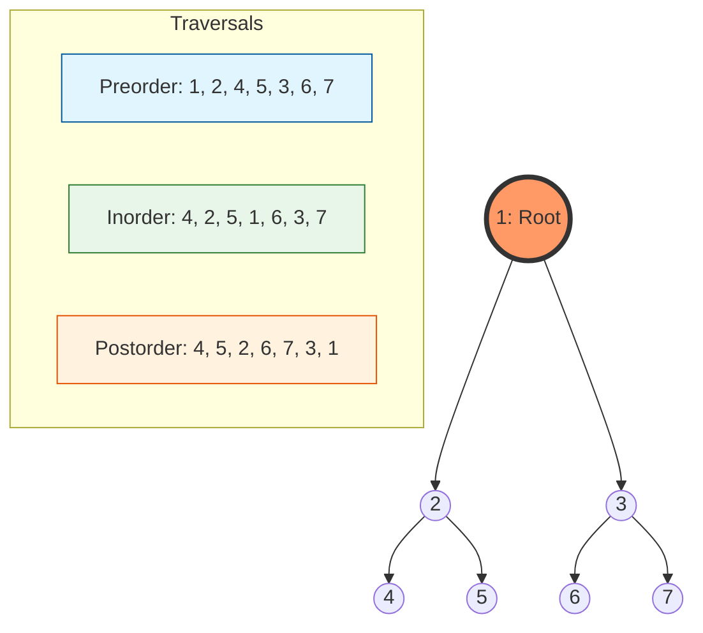

# Binary Tree Fundamentals: Properties, Traversals, and Reconstruction

> A binary tree is a hierarchical data structure in which each node has at most two children, referred to as the left child and the right child, serving as the foundational building block for efficient searching, sorting, and hierarchical data representation.

## 1. Historical Background & Motivation

The concept of "trees" in mathematics predates computer science by nearly a century. Arthur Cayley, a British mathematician, first coined the term in 1857 while studying chemical isomers. Cayley used trees to represent the possible arrangements of atoms in molecules, specifically alkanes ($C_nH_{2n+2}$). His work established the mathematical foundation of graph theory, defining a tree as a connected graph without cycles.

In the mid-20th century, as electronic computing emerged, the utility of trees transitioned from abstract mathematical objects to physical memory structures. In 1953, Kenneth E. Iverson of Harvard University (and later IBM) utilized trees to represent mathematical expressions in APL. By the early 1960s, Donald Knuth and others formalised the "binary" constraint—limiting each node to two descendants—to optimize hardware utilization and search performance. The binary tree solved a critical bottleneck: it bridged the gap between the constant-time access of arrays (which are hard to resize) and the dynamic nature of linked lists (which are slow to search). Today, binary trees and their variants (AVL, Red-Black, B-Trees) underpin everything from the file system on your SSD to the DOM tree in your web browser.

## 2. Visual Intuition
:::demo
<div style="background:#1e1e1e;padding:16px;border-radius:10px;color:#e5e7eb;font-family:system-ui,sans-serif">
  <h3 style="margin:0 0 8px 0;color:#7dd3fc">Binary Tree Fundamentals: Properties, Traversals, and Reconstruction - Concept Map</h3>
  <svg width="100%" height="280" viewBox="0 0 640 280" role="img" aria-label="Binary Tree Fundamentals: Properties, Traversals, and Reconstruction visual intuition" style="background:#111827;border-radius:8px">
    <rect x="24" y="28" width="180" height="64" rx="10" fill="#1d4ed8" />
    <text x="114" y="66" text-anchor="middle" fill="#e5e7eb" font-size="14">Problem</text>
    <rect x="230" y="28" width="180" height="64" rx="10" fill="#0f766e" />
    <text x="320" y="66" text-anchor="middle" fill="#e5e7eb" font-size="14">Process</text>
    <rect x="436" y="28" width="180" height="64" rx="10" fill="#7c3aed" />
    <text x="526" y="66" text-anchor="middle" fill="#e5e7eb" font-size="14">Outcome</text>

    <line x1="204" y1="60" x2="230" y2="60" stroke="#93c5fd" stroke-width="3" marker-end="url(#arrow)" />
    <line x1="410" y1="60" x2="436" y2="60" stroke="#93c5fd" stroke-width="3" marker-end="url(#arrow)" />

    <rect x="24" y="130" width="592" height="120" rx="10" fill="#0b1220" stroke="#334155" />
    <text x="320" y="156" text-anchor="middle" fill="#cbd5e1" font-size="14">Key intuition for Binary Tree Fundamentals: Properties, Traversals, and Reconstruction</text>
    <text x="320" y="182" text-anchor="middle" fill="#94a3b8" font-size="12">Track state changes, constraints, and final behavior.</text>
    <text x="320" y="206" text-anchor="middle" fill="#94a3b8" font-size="12">Use this as a mental model before formal proofs or code.</text>

    <defs>
      <marker id="arrow" markerWidth="10" markerHeight="10" refX="8" refY="3" orient="auto">
        <polygon points="0 0, 10 3, 0 6" fill="#93c5fd" />
      </marker>
    </defs>
  </svg>
  <p style="margin-top:10px;color:#cbd5e1">Interactive-ready visual scaffold for the topic.</p>
</div>
:::
*Caption: This animation demonstrates the construction of a Binary Search Tree (BST), a specific type of binary tree where nodes are ordered. Note the hierarchical branching: each decision (left vs. right) halves the remaining search space.*

## 3. Core Theory & Mathematical Foundations

A binary tree $T$ is defined as a finite set of nodes such that $T$ is either empty or consists of a root and two disjoint binary trees, $T_L$ and $T_R$.

### 3.1 Structural Classification
To master binary trees, one must distinguish between various "shapes" that dictate performance:

1.  **Full Binary Tree:** Every node has either 0 or 2 children. No node has only one child.
2.  **Complete Binary Tree:** Every level, except possibly the last, is completely filled, and all nodes in the last level are as far left as possible. This property is crucial for array-based heap implementations.
3.  **Perfect Binary Tree:** All internal nodes have two children and all leaf nodes are at the same level.
4.  **Degenerate (Skewed) Tree:** Every internal node has exactly one child. This effectively becomes a [[singly-linked-list]], with $O(N)$ search time.
5.  **Balanced Binary Tree:** The height of the left and right subtrees of every node differs by at most one.

### 3.2 Essential Theorems and Formulas
Let $n$ be the number of nodes, $h$ be the height (where the root is at height 0), and $L$ be the number of leaves.

*   **Theorem 1 (Maximum Nodes):** The maximum number of nodes in a binary tree of height $h$ is $2^{h+1} - 1$.
*   **Theorem 2 (Minimum Height):** For $n$ nodes, the minimum height is $\lceil \log_2(n+1) - 1 \rceil$.
*   **Theorem 3 (Leaf Relation):** In any non-empty binary tree, if $n_0$ is the number of leaf nodes and $n_2$ is the number of nodes with two children, then $n_0 = n_2 + 1$.
    *   *Proof Sketch:* Let $n$ be total nodes and $e$ be edges. We know $e = n-1$. Also, every node except the root has one incoming edge. In terms of outgoing edges: $e = 2n_2 + 1n_1 + 0n_0$. Substituting $n = n_0 + n_1 + n_2$, we get $n_0 + n_1 + n_2 - 1 = 2n_2 + n_1$, which simplifies to $n_0 = n_2 + 1$.
*   **Theorem 4 (Null Links):** A binary tree with $n$ nodes has exactly $n+1$ null pointers. This is why specialized structures like *Threaded Binary Trees* exist—to utilize this wasted space.

### 3.3 Combinatorial Complexity: Catalan Numbers
The number of distinct binary tree structures that can be formed with $n$ unlabeled nodes is given by the $n$-th **Catalan Number**:
$$C_n = \frac{1}{n+1} \binom{2n}{n} = \frac{(2n)!}{(n+1)!n!}$$
For $n=3$, $C_3 = 5$. This exponential growth explains why exhaustive search on tree structures is computationally expensive.

### 3.4 Formal Analysis of Traversals
Traversing a tree means visiting each node exactly once. Since we must visit $N$ nodes, the time complexity is strictly $\Theta(N)$.
The space complexity depends on the tree height $H$.
*   **Recursive/Stack-based:** $O(H)$. In the worst case (skewed tree), $H=N$. In the best case (balanced), $H = \log N$.
*   **Morris Traversal:** Uses the "null links" mentioned in Theorem 4 to thread the tree, achieving $O(N)$ time and $O(1)$ space.

## 4. Algorithm / Process: Tree Reconstruction

A common technical challenge is reconstructing a unique binary tree from its traversal sequences.

**The "Inorder Requirement" Rule:**
1.  **Preorder + Inorder:** Unique reconstruction possible.
2.  **Postorder + Inorder:** Unique reconstruction possible.
3.  **Preorder + Postorder:** Unique reconstruction is **NOT** possible (unless the tree is Full).

**Reconstruction from Preorder and Inorder:**
1.  The first element in **Preorder** is always the **Root**.
2.  Find the Root's index in the **Inorder** sequence.
3.  Everything to the left of this index in Inorder belongs to the **Left Subtree**.
4.  Everything to the right belongs to the **Right Subtree**.
5.  Recursively repeat the process for left and right subtrees, slicing the Preorder and Inorder arrays accordingly.

## 5. Visual Diagram


*Caption: A Perfect Binary Tree of height 2 and its three primary DFS traversal sequences.*

## 6. Implementation

### 6.1 Core Implementation (Python)

```python
from collections import deque

class TreeNode:
    """A standard Binary Tree Node."""
    def __init__(self, val=0, left=None, right=None):
        self.val = val
        self.left = left
        self.right = right

class BinaryTreeTools:
    @staticmethod
    def preorder_recursive(root: TreeNode) -> list:
        """Root -> Left -> Right. O(N) Time, O(H) Space."""
        res = []
        def traverse(node):
            if not node: return
            res.append(node.val)
            traverse(node.left)
            traverse(node.right)
        traverse(root)
        return res

    @staticmethod
    def inorder_iterative(root: TreeNode) -> list:
        """Left -> Root -> Right. Uses an explicit stack to mimic recursion."""
        res, stack = [], []
        curr = root
        while curr or stack:
            while curr:
                stack.append(curr)
                curr = curr.left
            curr = stack.pop()
            res.append(curr.val)
            curr = curr.right
        return res

    @staticmethod
    def level_order(root: TreeNode) -> list:
        """Breadth-First Search (BFS). O(N) Time, O(W) Space where W is max width."""
        if not root: return []
        res, queue = [], deque([root])
        while queue:
            node = queue.popleft()
            res.append(node.val)
            if node.left: queue.append(node.left)
            if node.right: queue.append(node.right)
        return res

# Sample usage:
# Constructed Tree:
#      1
#     / \
#    2   3
root = TreeNode(1, TreeNode(2), TreeNode(3))
tools = BinaryTreeTools()
print(f"Preorder: {tools.preorder_recursive(root)}")  # Output: [1, 2, 3]
print(f"Inorder: {tools.inorder_iterative(root)}")    # Output: [2, 1, 3]
print(f"Level-order: {tools.level_order(root)}")      # Output: [1, 2, 3]
```

### 6.2 Optimized / Production Variant (Morris Traversal)
Morris Traversal allows for Inorder traversal with $O(1)$ extra space by temporarily modifying the tree (creating threads) and restoring it later.

```python
def morris_inorder(root: TreeNode) -> list:
    """O(N) Time, O(1) Space traversal."""
    res = []
    curr = root
    while curr:
        if not curr.left:
            res.append(curr.val)
            curr = curr.right
        else:
            # Find the inorder predecessor of curr
            pre = curr.left
            while pre.right and pre.right != curr:
                pre = pre.right
            
            if not pre.right:
                # Create thread
                pre.right = curr
                curr = curr.left
            else:
                # Remove thread and visit
                pre.right = None
                res.append(curr.val)
                curr = curr.right
    return res
```

### 6.3 Common Pitfalls in Code
*   **Recursion Limit:** In Python, the default recursion depth is 1000. For skewed trees with $>1000$ nodes, recursive traversals will throw a `RecursionError`. Always consider iterative versions for deep trees.
*   **Empty Tree Case:** Forgetting `if not root: return` is the #1 cause of `AttributeError: 'NoneType' object has no attribute 'left'`.
*   **Queue choice:** In Python, using a list as a queue (`pop(0)`) is $O(N)$. For Level-Order traversal, always use `collections.deque` for $O(1)$ `popleft()`.

## 7. Interactive Demo

:::demo
<!-- title: Binary Tree Traversal Visualizer -->
<!DOCTYPE html>
<html>
<head>
<meta charset="utf-8">
<style>
  body { margin:0; background:#0f1117; color:#e5e7eb; font-family: 'Segoe UI', Tahoma, Geneva, Verdana, sans-serif; padding:16px; }
  canvas { background: #1a1d24; border-radius: 8px; display: block; margin: 10px auto; border: 1px solid #374151; }
  .controls { display: flex; gap: 10px; justify-content: center; margin-bottom: 20px; }
  button { background: #3b82f6; color: white; border: none; padding: 8px 16px; border-radius: 4px; cursor: pointer; transition: 0.2s; }
  button:hover { background: #2563eb; }
  button:disabled { background: #4b5563; cursor: not-allowed; }
  .log { background: #000; padding: 10px; border-radius: 4px; font-family: monospace; height: 40px; overflow: hidden; text-align: center; color: #10b981; font-size: 1.2em;}
</style>
</head>
<body>
<div class="controls">
  <button id="btnPre">Preorder</button>
  <button id="btnIn">Inorder</button>
  <button id="btnPost">Postorder</button>
  <button id="btnReset">Reset</button>
</div>
<div class="log" id="log">Click a traversal to start</div>
<canvas id="treeCanvas" width="600" height="300"></canvas>

<script>
  const canvas = document.getElementById('treeCanvas');
  const ctx = canvas.getContext('2d');
  const logDiv = document.getElementById('log');
  
  class Node {
    constructor(val, x, y) {
      this.val = val; this.x = x; this.y = y;
      this.left = null; this.right = null;
      this.highlighted = false;
    }
  }

  // Create a static sample tree
  const root = new Node(1, 300, 40);
  root.left = new Node(2, 180, 100);
  root.right = new Node(3, 420, 100);
  root.left.left = new Node(4, 120, 180);
  root.left.right = new Node(5, 240, 180);
  root.right.left = new Node(6, 360, 180);
  root.right.right = new Node(7, 480, 180);

  function drawTree(highlightNode = null) {
    ctx.clearRect(0, 0, canvas.width, canvas.height);
    drawNode(root, highlightNode);
  }

  function drawNode(node, highlightNode) {
    if (!node) return;
    ctx.strokeStyle = "#4b5563";
    ctx.lineWidth = 2;
    if (node.left) {
      ctx.beginPath(); ctx.moveTo(node.x, node.y); ctx.lineTo(node.left.x, node.left.y); ctx.stroke();
      drawNode(node.left, highlightNode);
    }
    if (node.right) {
      ctx.beginPath(); ctx.moveTo(node.x, node.y); ctx.lineTo(node.right.x, node.right.y); ctx.stroke();
      drawNode(node.right, highlightNode);
    }
    ctx.beginPath();
    ctx.arc(node.x, node.y, 20, 0, Math.PI * 2);
    ctx.fillStyle = (node === highlightNode) ? "#ef4444" : "#1e293b";
    ctx.fill();
    ctx.stroke();
    ctx.fillStyle = "#fff";
    ctx.textAlign = "center";
    ctx.fillText(node.val, node.x, node.y + 5);
  }

  async function traverse(type) {
    disableButtons(true);
    const sequence = [];
    if (type === 'pre') getPre(root, sequence);
    if (type === 'in') getIn(root, sequence);
    if (type === 'post') getPost(root, sequence);
    
    logDiv.innerText = "";
    for (let node of sequence) {
      drawTree(node);
      logDiv.innerText += node.val + " ";
      await new Promise(r => setTimeout(r, 800));
    }
    disableButtons(false);
  }

  function getPre(n, s) { if(!n) return; s.push(n); getPre(n.left, s); getPre(n.right, s); }
  function getIn(n, s) { if(!n) return; getIn(n.left, s); s.push(n); getIn(n.right, s); }
  function getPost(n, s) { if(!n) return; getPost(n.left, s); getPost(n.right, s); s.push(n); }

  function disableButtons(bool) {
    ['btnPre', 'btnIn', 'btnPost'].forEach(id => document.getElementById(id).disabled = bool);
  }

  document.getElementById('btnPre').onclick = () => traverse('pre');
  document.getElementById('btnIn').onclick = () => traverse('in');
  document.getElementById('btnPost').onclick = () => traverse('post');
  document.getElementById('btnReset').onclick = () => { drawTree(); logDiv.innerText = "Reset complete."; };

  drawTree();
</script>
</body>
</html>
:::

## 8. Worked Examples

### Example 1: Reconstructing a Tree
**Input:** 
Preorder: `[3, 9, 20, 15, 7]`
Inorder: `[9, 3, 15, 20, 7]`

**Steps:**
1.  **Identify Root:** First element of Preorder is `3`.
2.  **Split Inorder:** In Inorder, `3` is at index 1. 
    *   Left subtree Inorder: `[9]`
    *   Right subtree Inorder: `[15, 20, 7]`
3.  **Split Preorder:** Use the size of left subtree (1 node).
    *   Left subtree Preorder: `[9]`
    *   Right subtree Preorder: `[20, 15, 7]`
4.  **Recurse Left:** Preorder `[9]`, Inorder `[9]`. Root is `9`. Children are `None`.
5.  **Recurse Right:** Preorder `[20, 15, 7]`, Inorder `[15, 20, 7]`.
    *   Root is `20`.
    *   Inorder split at `20`: Left `[15]`, Right `[7]`.
    *   This yields nodes `15` as left child and `7` as right child of `20`.

**Resulting Tree:**
```
    3
   / \
  9  20
    /  \
   15   7
```

### Example 2: Checking if a Tree is "Full"
A binary tree is **Full** if every node has either 0 or 2 children.

**Problem:** Given root of a binary tree, return `True` if it is full.
**Logic:** 
1. If node is `None`, it's full (base case).
2. If node is a leaf (no children), it's full.
3. If node has exactly two children, it's full *if and only if* both subtrees are full.
4. If node has only one child, return `False`.

## 9. Comparison with Alternatives

| Structure | Access Time | Insertion | Space | Best Used When |
| :--- | :--- | :--- | :--- | :--- |
| **Binary Tree** | $O(N)$ (worst) | $O(1)$ (at leaf) | $O(N)$ | General hierarchical data. |
| **[[binary-search-tree]]** | $O(\log N)$ | $O(\log N)$ | $O(N)$ | Fast lookup/sorted data. |
| **[[dynamic-arrays]]** | $O(1)$ | $O(N)$ | $O(N)$ | Fixed size, frequent index access. |
| **[[singly-linked-list]]** | $O(N)$ | $O(1)$ | $O(N)$ | Frequent insertion/deletion at ends. |

## 10. Industry Applications & Real Systems

*   **Chromium Engine (DOM):** The Document Object Model is a tree structure where each HTML element is a node. Efficiently traversing this tree is key to browser rendering performance.
*   **Git (Merkle Trees):** Git uses a variant of a binary tree (Merkle Tree) where each node is labeled with the hash of its data/children. This allows Git to efficiently detect changes in large filesystems.
*   **Linux File System (ext4):** While directories use B-Trees, the underlying logical block mapping for small files often utilizes tree-like structures to manage pointers to data blocks.
*   **Compilers (Abstract Syntax Trees - AST):** Compilers like GCC or Clang parse source code into a tree structure. Each node represents a programming construct (like an `if` statement or an addition), which is then traversed to generate machine code.

## 11. Practice Problems

### 🟢 Easy
1.  **Maximum Depth:** Given the root of a binary tree, return its maximum depth.
    *   *Hint: The depth of a node is 1 + max(depth of children).*
    *   *Expected complexity: $O(N)$*
2.  **Same Tree:** Given the roots of two binary trees, write a function to check if they are the same or not.
    *   *Hint: Two trees are same if roots match and left/right subtrees match recursively.*

### 🟡 Medium
3.  **Zigzag Level Order Traversal:** Return the level order traversal of nodes' values, but alternating direction at each level (left-to-right, then right-to-left).
    *   *Hint: Use a deque and a flag to reverse the list at each level.*
4.  **Path Sum II:** Given a tree and a sum, find all root-to-leaf paths where each path's sum equals the given sum.
    *   *Expected complexity: $O(N)$*

### 🔴 Hard
5.  **Binary Tree Maximum Path Sum:** Find the maximum path sum. The path may start and end at any node in the tree.
    *   *Hint: At each node, calculate the max contribution it can give to its parent.*
    *   *Expected complexity: $O(N)$*

## 12. Interactive Quiz

:::quiz
**Q1: A binary tree with 15 nodes has how many null pointers?**
- A) 14
- B) 15
- C) 16
- D) 30
> C — By Theorem 4, a tree with $n$ nodes has $n+1$ null links. $15+1=16$.

**Q2: Which traversal of a Binary Search Tree (BST) produces a sorted array of the node values?**
- A) Preorder
- B) Inorder
- C) Postorder
- D) Level-order
> B — Inorder (Left-Root-Right) visits the smallest elements first in a BST.

**Q3: What is the maximum number of nodes in a binary tree of height 4 (root is height 0)?**
- A) 15
- B) 16
- C) 31
- D) 32
> C — Formula: $2^{h+1}-1 = 2^5 - 1 = 31$.

**Q4: Can we uniquely reconstruct a binary tree from its Preorder and Postorder traversals?**
- A) Yes, always.
- B) No, never.
- C) Only if it's a full binary tree.
- D) Only if it's a balanced binary tree.
> C — If a node has only one child, Preorder (Root-Child) and Postorder (Child-Root) cannot distinguish if that child is a left or right child.

**Q5: What is the time complexity of Morris Traversal?**
- A) O(N log N)
- B) O(N)
- C) O(H)
- D) O(N²)
> B — Although it visits some nodes multiple times to establish/remove threads, each edge is traversed at most 3 times, maintaining $O(N)$ linear time.
:::

## 13. Interview Preparation

### Conceptual Questions
**Q: Explain the difference between Depth-First Search (DFS) and Breadth-First Search (BFS) in trees.**
*A: DFS (Pre/In/Postorder) explores a branch as deeply as possible before backtracking, typically implemented with recursion or a stack. BFS (Level-order) visits nodes level by level, implemented with a queue. DFS is better for finding paths to leaves; BFS is ideal for finding the shortest path between nodes in an unweighted tree.*

**Q: What are the space complexities of tree traversals?**
*A: Standard recursive/stack-based traversals require $O(H)$ space, where $H$ is the tree height. This represents the call stack. In the worst case (skewed tree), $H=N$. For level-order, the space is $O(W)$, where $W$ is the maximum width of the tree (up to $N/2$ for a perfect tree).*

**Q: How would you find the Lowest Common Ancestor (LCA) of two nodes?**
*A: In a general binary tree, you recurse down. If a node is one of the targets, return it. If a node receives non-null values from both its left and right child, that node is the LCA. This is a classic $O(N)$ bottom-up approach.*

### Quick Reference (Cheat Sheet)
| Property | Value |
|---|---|
| Max Nodes at Level $i$ | $2^i$ |
| Total Nodes (Height $h$) | $2^{h+1}-1$ |
| Traversal Time | $O(N)$ |
| Rec/Iter Space | $O(H)$ |
| Morris Space | $O(1)$ |
| Null Links | $n+1$ |

## 14. Key Takeaways
1.  **Hierarchy over Linearity:** Binary trees allow for structured representation of data where parent-child relationships exist.
2.  **Structural Integrity:** The relationship between nodes, edges, and leaves ($n_0 = n_2 + 1$) is a mathematical invariant.
3.  **Inorder is Essential:** You cannot reconstruct a unique tree without the Inorder sequence (unless the tree has specific structural constraints).
4.  **Recursion vs. Iteration:** While recursion is elegant for trees, production-level code must handle the potential for stack overflow on skewed trees.
5.  **Efficiency:** Logarithmic height is the "Holy Grail" of trees; balancing ensures $O(\log N)$ performance.

## 15. Common Misconceptions
- ❌ **"A binary tree is just a binary search tree (BST)."** → ✅ A binary tree is just a structure. A BST is a binary tree with a specific ordering property (Left < Root < Right).
- ❌ **"Level-order traversal uses a stack."** → ✅ Level-order uses a **Queue**. Depth-first traversals use a **Stack**.
- ❌ **"The height of a tree is always $\log N$."** → ✅ This is only true for balanced trees. Skewed trees have height $N$.

## 16. Further Reading
- *Introduction to Algorithms (CLRS)* — Chapter 10.4 (Representing rooted trees) and Chapter 12 (BSTs).
- *The Art of Computer Programming (Knuth)* — Volume 1, Section 2.3 (Trees).
- *Algorithm Design Manual (Skiena)* — Section 5.5 (Binary Search Trees).

## 17. Related Topics
- [[complexity-analysis]] — Understanding the Big-O of recursive calls.
- [[recursion-basics]] — The fundamental logic driving tree traversals.
- [[stack-implementation]] — Used for iterative DFS.
- [[binary-search-tree]] — An ordered application of binary trees.
