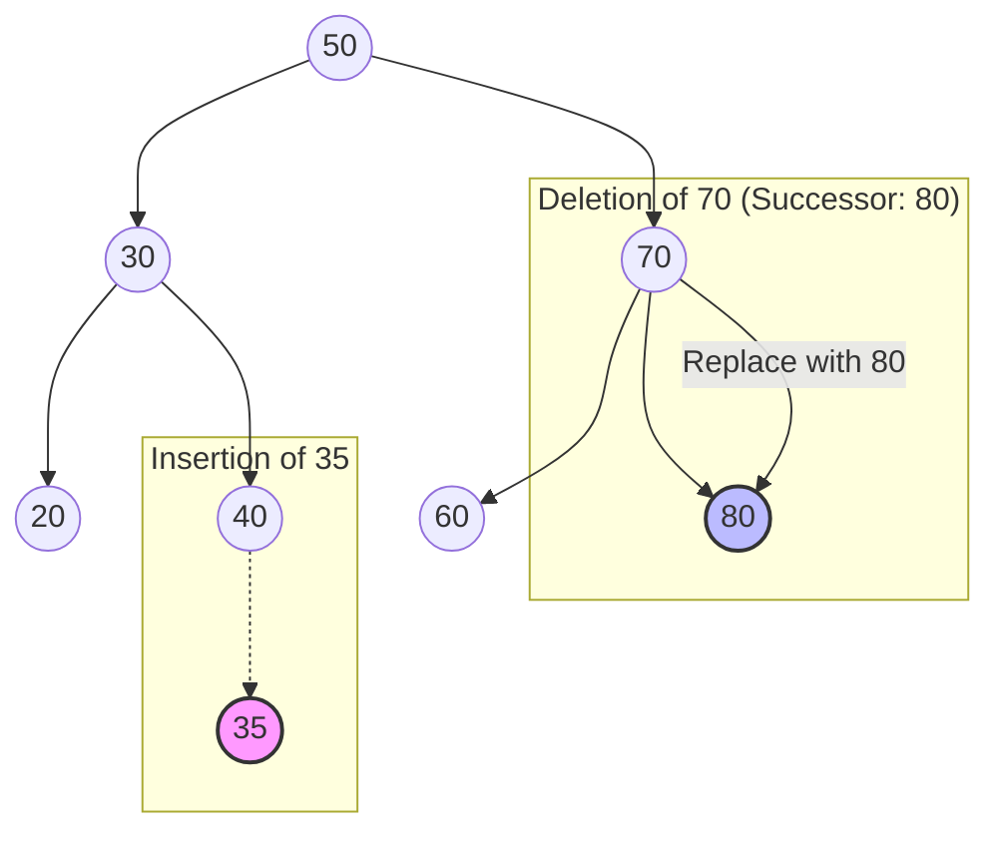

# Binary Search Tree Operations: Search, Insert, Delete, and Successor

> A Binary Search Tree (BST) is a node-based binary tree data structure where each node satisfies the BST property: the key in any node is greater than or equal to all keys in its left subtree and less than or equal to all keys in its right subtree.

## 1. Historical Background & Motivation

The Binary Search Tree (BST) emerged in the late 1950s and early 1960s as computer scientists sought a way to bridge the gap between the fast access of sorted arrays and the efficient modification of linked lists. The sorted array offers $O(\log n)$ search via binary search, but insertion or deletion requires $O(n)$ time due to shifting elements. Conversely, linked lists allow $O(1)$ insertions once a position is found but require $O(n)$ to find that position.

The concept was independently described by several researchers, most notably P.F. Windley, A.D. Booth, and A.J. Colin around 1960. As datasets grew from thousands to millions of records, the BST became the fundamental building block for dynamic sets. It solved the "static data" problem, allowing programs to maintain a sorted collection of items where insertions and deletions could occur on-the-fly without rebuilding the entire structure. In modern computing, the BST is the conceptual ancestor to more complex structures like AVL trees, Red-Black trees (used in C++ `std::map` and Java `TreeMap`), and B-Trees (the backbone of modern relational databases like PostgreSQL and MySQL).

## 2. Visual Intuition
:::demo
<div style="background:#1e1e1e;padding:16px;border-radius:10px;color:#e5e7eb;font-family:system-ui,sans-serif">
  <h3 style="margin:0 0 8px 0;color:#7dd3fc">Binary Search Tree Operations: Search, Insert, Delete, and Successor - Concept Map</h3>
  <svg width="100%" height="280" viewBox="0 0 640 280" role="img" aria-label="Binary Search Tree Operations: Search, Insert, Delete, and Successor visual intuition" style="background:#111827;border-radius:8px">
    <rect x="24" y="28" width="180" height="64" rx="10" fill="#1d4ed8" />
    <text x="114" y="66" text-anchor="middle" fill="#e5e7eb" font-size="14">Problem</text>
    <rect x="230" y="28" width="180" height="64" rx="10" fill="#0f766e" />
    <text x="320" y="66" text-anchor="middle" fill="#e5e7eb" font-size="14">Process</text>
    <rect x="436" y="28" width="180" height="64" rx="10" fill="#7c3aed" />
    <text x="526" y="66" text-anchor="middle" fill="#e5e7eb" font-size="14">Outcome</text>

    <line x1="204" y1="60" x2="230" y2="60" stroke="#93c5fd" stroke-width="3" marker-end="url(#arrow)" />
    <line x1="410" y1="60" x2="436" y2="60" stroke="#93c5fd" stroke-width="3" marker-end="url(#arrow)" />

    <rect x="24" y="130" width="592" height="120" rx="10" fill="#0b1220" stroke="#334155" />
    <text x="320" y="156" text-anchor="middle" fill="#cbd5e1" font-size="14">Key intuition for Binary Search Tree Operations: Search, Insert, Delete, and Successor</text>
    <text x="320" y="182" text-anchor="middle" fill="#94a3b8" font-size="12">Track state changes, constraints, and final behavior.</text>
    <text x="320" y="206" text-anchor="middle" fill="#94a3b8" font-size="12">Use this as a mental model before formal proofs or code.</text>

    <defs>
      <marker id="arrow" markerWidth="10" markerHeight="10" refX="8" refY="3" orient="auto">
        <polygon points="0 0, 10 3, 0 6" fill="#93c5fd" />
      </marker>
    </defs>
  </svg>
  <p style="margin-top:10px;color:#cbd5e1">Interactive-ready visual scaffold for the topic.</p>
</div>
:::
*Caption: The search process in a BST. To find 563, we start at the root. Since 563 > 400, we move right. Since 563 < 700, we move left. This "halving" of the search space is why the average case is logarithmic.*

## 3. Core Theory & Mathematical Foundations

A Binary Search Tree is formally defined as a binary tree $T$ where for every node $x$, all nodes $y$ in the left subtree of $x$ satisfy $key(y) \le key(x)$, and all nodes $z$ in the right subtree of $x$ satisfy $key(z) \ge key(x)$.

### 3.1 The Relationship Between Height and Complexity
The efficiency of all BST operations is tied to the height of the tree, denoted as $h$. The height is defined as the number of edges on the longest path from the root to a leaf.
1. **Best Case (Perfectly Balanced):** $h = \lfloor \log_2 n \rfloor$. Operations are $O(\log n)$.
2. **Worst Case (Degenerate/Skewed):** $h = n - 1$. The tree effectively becomes a linked list. Operations are $O(n)$.

The average height of a BST built from $n$ random keys is $O(\log n)$, which is the mathematical justification for using BSTs in practice despite the theoretical $O(n)$ worst-case.

### 3.2 Successor and Predecessor Logic
Successor logic is vital for the "Delete" operation and for in-order traversal. The **Successor** of a node $x$ is the node with the smallest key strictly greater than $key(x)$.
*   **Case A:** Node $x$ has a right subtree. The successor is the minimum element in that right subtree (the leftmost node of the right child).
*   **Case B:** Node $x$ has no right subtree. The successor is the lowest ancestor of $x$ whose left child is also an ancestor of $x$.

### 3.3 The Hibbard Deletion Complexity
Deletion is the most mathematically complex operation. Developed by Thomas Hibbard in 1962, the standard deletion algorithm maintains the BST property but has a subtle quirk: it is not symmetric. Over a long sequence of random insertions and deletions, the tree tends to become slightly left-heavy because we consistently replace deleted nodes with their successors (from the right). This asymmetry is a known research topic in theoretical computer science, often referred to as the "Hibbard Deletion Bias."

### 3.4 Formal Analysis (Complexity / Correctness)
**Theorem:** *A search, insertion, or deletion in a BST with height $h$ takes $O(h)$ time.*

**Proof Sketch (Search):** At each step of the search, we descend one level in the tree. The maximum number of levels we can descend is limited by the height $h$. Since each comparison takes $O(1)$ time, the total time is $O(1) \times (\text{number of levels}) = O(h)$.

**Theorem:** *In-order traversal of a BST visits nodes in non-decreasing order.*
**Proof (Induction):** Let $T$ be a BST. 
- *Base case:* If $T$ is empty, the property holds. 
- *Inductive step:* Assume in-order traversal prints keys in order for trees of size $< n$. For a tree of size $n$ with root $r$, in-order visits the left subtree, then $r$, then the right subtree. By the BST property, all keys in the left subtree are $\le key(r)$ and all in the right are $\ge key(r)$. By our inductive hypothesis, the left and right subtrees are printed in order. Thus, the entire sequence is ordered.

## 4. Algorithm / Process (Step-by-Step)

### 4.1 Search $(T, k)$
1. Start at the root.
2. If the current node is null or its key equals $k$, return the node.
3. If $k < current.key$, repeat search on the left child.
4. Else, repeat search on the right child.

### 4.2 Insert $(T, z)$
1. Maintain two pointers: $y$ (trailing pointer) and $x$ (leading pointer).
2. Start $x$ at the root and $y$ as null.
3. Traverse down: If $z.key < x.key$, go left; else go right. Update $y = x$.
4. Once $x$ is null, $y$ is the parent of the new node $z$.
5. Connect $z$ to $y$ as either the left or right child based on their keys.

### 4.3 Delete $(T, z)$
Deletion involves three cases:
1. **No Children (Leaf):** Simply remove the node.
2. **One Child:** Splice out the node by connecting its parent directly to its child.
3. **Two Children:** 
    a. Find the node's successor $y$ (the min of the right subtree).
    b. If $y$ is not $z$'s immediate right child, replace $y$ with its own right child, then replace $z$ with $y$.
    c. If $y$ is $z$'s immediate right child, simply replace $z$ with $y$.

### 4.4 Successor $(x)$
1. If $x.right$ exists: Return `Min(x.right)`.
2. Else: Follow parent pointers up from $x$ until we find a node $y$ such that $x$ is in the left subtree of $y$.

## 5. Visual Diagram


*Caption: Inserting 35 involves traversing 50 -> 30 -> 40 -> left. Deleting 70 (two children) involves finding its successor (80) and promoting it.*

## 6. Implementation

### 6.1 Core Implementation

```python
class Node:
    def __init__(self, key):
        self.key = key
        self.left = None
        self.right = None
        self.parent = None

class BST:
    def __init__(self):
        self.root = None

    def search(self, key):
        """
        Purpose: Find a node with the given key.
        Complexity: O(h), where h is tree height.
        """
        curr = self.root
        while curr and key != curr.key:
            if key < curr.key:
                curr = curr.left
            else:
                curr = curr.right
        return curr

    def insert(self, key):
        """
        Purpose: Insert a new key while maintaining BST property.
        Complexity: O(h).
        """
        new_node = Node(key)
        y = None
        x = self.root
        
        while x:
            y = x
            if new_node.key < x.key:
                x = x.left
            else:
                x = x.right
        
        new_node.parent = y
        if y is None:
            self.root = new_node # Tree was empty
        elif new_node.key < y.key:
            y.left = new_node
        else:
            y.right = new_node

    def _transplant(self, u, v):
        """
        Helper: Replaces subtree u with subtree v.
        """
        if u.parent is None:
            self.root = v
        elif u == u.parent.left:
            u.parent.left = v
        else:
            u.parent.right = v
        if v:
            v.parent = u.parent

    def delete(self, z):
        """
        Purpose: Remove node z.
        Complexity: O(h).
        """
        if z.left is None:
            self._transplant(z, z.right)
        elif z.right is None:
            self._transplant(z, z.left)
        else:
            # Two-child case: find successor
            y = self.minimum(z.right)
            if y.parent != z:
                self._transplant(y, y.right)
                y.right = z.right
                y.right.parent = y
            self._transplant(z, y)
            y.left = z.left
            y.left.parent = y

    def minimum(self, node):
        while node.left:
            node = node.left
        return node

# Example Usage:
# bst = BST()
# for k in [50, 30, 70, 20, 40]: bst.insert(k)
# node = bst.search(30)
# bst.delete(node)
```

### 6.2 Optimized / Production Variant
In production, we often avoid recursion to prevent stack overflow on deep trees and use iterative methods. We also might "augment" the node to store the size of the subtree for $O(\log n)$ order-statistic queries.

```python
def find_kth_smallest(root, k):
    """
    Augmented BST: Each node stores node.size (count of nodes in its subtree).
    Time: O(h)
    """
    if not root: return None
    left_size = root.left.size if root.left else 0
    if k == left_size + 1:
        return root
    elif k <= left_size:
        return find_kth_smallest(root.left, k)
    else:
        return find_kth_smallest(root.right, k - left_size - 1)
```

### 6.3 Common Pitfalls in Code
1. **Ignoring the `parent` pointer:** Many implementations forget to update the parent pointers during deletion, causing "broken" trees that cannot be traversed upwards.
2. **Handling the Root Deletion:** Forgetting to update `self.root` when the node being deleted is the root of the entire tree.
3. **Successor Logic:** Assuming the successor of $x$ is just `x.right.left`. You must loop until you find the leftmost leaf of the right subtree.
4. **Duplicate Keys:** Not defining a consistent policy for duplicate keys (e.g., always go right).

## 7. Interactive Demo

:::demo
<!-- title: BST Visualizer: Search and Insert -->
<!DOCTYPE html>
<html>
<head>
<meta charset="utf-8">
<style>
  body { margin:0; background:#0f1117; color:#e5e7eb; font-family: system-ui, sans-serif; font-size:13px; padding:16px; overflow:hidden;}
  canvas { background: #1a1c24; border: 1px solid #374151; border-radius: 8px; display: block; margin: 10px auto; }
  .controls { display: flex; gap: 8px; justify-content: center; margin-bottom: 10px; }
  input { background: #374151; border: 1px solid #4b5563; color: white; padding: 4px 8px; border-radius: 4px; width: 60px; }
  button { background: #3b82f6; color: white; border: none; padding: 4px 12px; border-radius: 4px; cursor: pointer; }
  button:hover { background: #2563eb; }
  .log { text-align: center; color: #9ca3af; height: 20px; }
</style>
</head>
<body>
<div class="controls">
  <input type="number" id="val" value="50">
  <button onclick="handleInsert()">Insert</button>
  <button onclick="handleSearch()">Search</button>
  <button onclick="resetTree()">Reset</button>
</div>
<div id="log" class="log">Enter a value to start</div>
<canvas id="bstCanvas" width="800" height="400"></canvas>

<script>
class Node {
  constructor(val, x, y) {
    self.val = val; self.x = x; self.y = y;
    self.left = null; self.right = null;
    self.highlight = false;
  }
}

let root = null;
const canvas = document.getElementById('bstCanvas');
const ctx = canvas.getContext('2d');
const log = document.getElementById('log');

function drawNode(node, px, py) {
  if (!node) return;
  if (px !== null) {
    ctx.beginPath(); ctx.moveTo(px, py); ctx.lineTo(node.x, node.y);
    ctx.strokeStyle = '#4b5563'; ctx.stroke();
  }
  ctx.beginPath();
  ctx.arc(node.x, node.y, 18, 0, Math.PI * 2);
  ctx.fillStyle = node.highlight ? '#ef4444' : '#3b82f6';
  ctx.fill();
  ctx.fillStyle = 'white';
  ctx.textAlign = 'center';
  ctx.fillText(node.val, node.x, node.y + 5);
  node.highlight = false;
  drawNode(node.left, node.x, node.y);
  drawNode(node.right, node.x, node.y);
}

function updatePositions(node, x, y, spacing) {
  if (!node) return;
  node.x = x; node.y = y;
  updatePositions(node.left, x - spacing, y + 60, spacing / 1.8);
  updatePositions(node.right, x + spacing, y + 60, spacing / 1.8);
}

async function handleInsert() {
  const val = parseInt(document.getElementById('val').value);
  if (isNaN(val)) return;
  log.innerText = `Inserting ${val}...`;
  root = await insertRecursive(root, val, 400, 40, 150);
  render();
}

async function insertRecursive(node, val, x, y, spacing) {
  if (!node) return {val, x, y, left:null, right:null, highlight:true};
  node.highlight = true; render(); 
  await new Promise(r => setTimeout(r, 500));
  if (val < node.val) node.left = await insertRecursive(node.left, val, node.x - spacing, node.y + 60, spacing/1.8);
  else node.right = await insertRecursive(node.right, val, node.x + spacing, node.y + 60, spacing/1.8);
  return node;
}

async function handleSearch() {
  const val = parseInt(document.getElementById('val').value);
  let curr = root;
  while(curr) {
    curr.highlight = true; render();
    log.innerText = `Checking ${curr.val}...`;
    await new Promise(r => setTimeout(r, 600));
    if (val === curr.val) { log.innerText = `Found ${val}!`; return; }
    curr = val < curr.val ? curr.left : curr.right;
  }
  log.innerText = `${val} not found.`;
}

function render() {
  ctx.clearRect(0, 0, canvas.width, canvas.height);
  drawNode(root, null, null);
}

function resetTree() { root = null; render(); log.innerText = "Tree reset."; }
render();
</script>
</body>
</html>
:::

## 8. Worked Examples

### Example 1 — Basic Application
**Input Sequence:** 45, 20, 60, 10, 30, 55, 70
**Goal:** Delete 45 (the root).

1. **Initial State:**
   ```
        45
       /  \
      20   60
     /  \ /  \
    10  30 55 70
   ```
2. **Identify Successor of 45:**
   - Go right (60).
   - Go as far left as possible (55).
   - Successor is 55.
3. **Execution:**
   - 55 is a leaf. Its parent (60) sets its left child to null.
   - 45 is replaced by 55.
   - 55's new left is 20, and its new right is 60.
4. **Final State:**
   ```
        55
       /  \
      20   60
     /  \    \
    10  30   70
   ```

### Example 2 — Successor of a Leaf
**Find Successor of 30 in Example 1.**
1. 30 has no right child.
2. We move up to the parent: 20.
3. Is 30 the left child of 20? No.
4. Move up to 20's parent: 45.
5. Is 20 the left child of 45? Yes.
6. The successor is 45.

## 9. Comparison with Alternatives

| Approach | Search | Insert | Delete | Pros | Cons | Best Used When |
|---|---|---|---|---|---|---|
| **BST (Average)** | $O(\log n)$ | $O(\log n)$ | $O(\log n)$ | Dynamic size, sorted output. | Can become skewed. | General purpose dynamic sets. |
| **Sorted Array** | $O(\log n)$ | $O(n)$ | $O(n)$ | Cache-friendly, simple. | Slow updates. | Static datasets. |
| **Hash Table** | $O(1)$ | $O(1)$ | $O(1)$ | Extremely fast search. | No order, hashing overhead. | Search-heavy, no range queries. |
| **AVL / Red-Black**| $O(\log n)$ | $O(\log n)$ | $O(\log n)$ | Guaranteed $O(\log n)$ worst case. | Complex implementation. | Production libraries (std::map). |

## 10. Industry Applications & Real Systems

- **B-Trees in Database Engines (PostgreSQL/MySQL)**: A B-Tree is a generalization of a BST where nodes can have multiple children. This minimizes disk I/O, allowing databases to find a single row among billions in 3-4 disk reads.
- **V8 JavaScript Engine**: Uses hidden classes and internal trees to manage property lookups. While not a pure BST, the logic of tree-based branching is used to optimize object property access.
- **Filesystems (NTFS/HFS+)**: Use B-trees or similar structures to manage directory hierarchies. When you search for a file in a folder with 100,000 files, the tree structure prevents a linear $O(n)$ scan.
- **Huffman Coding**: Used in ZIP compression and JPEG images. It builds a binary tree based on character frequencies to create optimal prefix codes.

## 11. Practice Problems

### 🟢 Easy
1. **Check Validity**: Given a binary tree, determine if it is a valid BST.
   *Hint: Do an in-order traversal and check if it's strictly increasing.*
   *Expected complexity: $O(n)$*

### 🟡 Medium
2. **LCA of a BST**: Find the Lowest Common Ancestor of two given nodes.
   *Hint: If both values are smaller than root, go left. If both are larger, go right. Otherwise, the current node is the LCA.*
   *Expected complexity: $O(h)$*

3. **In-order Successor**: Given a node in a BST, find its in-order successor.
   *Hint: Remember the two cases (has right child vs. no right child).*

### 🔴 Hard
4. **BST to Greater Sum Tree**: Convert a BST to a Greater Tree such that every key of the original BST is changed to the original key plus the sum of all keys greater than the original key in BST.
   *Hint: Use a reverse in-order traversal (Right-Root-Left) and keep a running sum.*
   *Expected complexity: $O(n)$*

5. **Recover BST**: Two nodes of a BST are swapped by mistake. Recover the tree without changing its structure.
   *Hint: An in-order traversal of a swapped BST will have two elements out of order. Find them and swap their values.*

## 12. Interactive Quiz

:::quiz
**Q1: What is the worst-case time complexity of searching in a BST with $n$ nodes?**
- A) $O(1)$
- B) $O(\log n)$
- C) $O(n)$
- D) $O(n \log n)$
> C — In a skewed (degenerate) tree, the BST behaves like a linked list, requiring a traversal of every node.

**Q2: During deletion, if a node has two children, we typically replace it with its:**
- A) Left child
- B) Right child
- C) In-order successor
- D) Parent
> C — The in-order successor (minimum of the right subtree) is guaranteed to have at most one child, making the subsequent removal simple while maintaining the BST property.

**Q3: Which traversal of a BST produces the keys in sorted order?**
- A) Pre-order
- B) In-order
- C) Post-order
- D) Level-order
> B — By definition, in-order (Left-Root-Right) visits all smaller elements, then the current, then all larger elements.

**Q4: What is the height of a BST containing only one node?**
- A) -1
- B) 0
- C) 1
- D) Undefined
> B — Height is defined as the number of edges. A single node has zero edges to any leaf.

**Q5: If we insert keys [10, 5, 15, 2, 7] into an empty BST, which node is the parent of 7?**
- A) 10
- B) 5
- C) 15
- D) 2
> B — 5 is the root of the left subtree. Since 7 > 5, 7 becomes the right child of 5.
:::

## 13. Interview Preparation

### Conceptual Questions
**Q: Explain BST as if teaching it to a fellow engineer.**
*A: A Binary Search Tree is a dynamic data structure that maintains sorted data. It works on the principle that for any node, everything to the left is smaller and everything to the right is larger. This allows us to perform search, insert, and delete in logarithmic time on average, effectively performing a binary search on a linked structure.*

**Q: What are the time and space complexities? Derive them.**
*A: Time complexity for Search/Insert/Delete is $O(h)$, where $h$ is height. In a balanced tree, $h = \log n$ because we divide the search space by half at each step. In a skewed tree, $h = n$. Space complexity is $O(h)$ for recursive implementations (stack depth) or $O(1)$ for iterative ones.*

**Q: How would you choose between a BST and a Hash Table?**
*A: Use a Hash Table for $O(1)$ lookups when the order doesn't matter. Use a BST if you need to perform range queries (e.g., "find all users aged 20-30"), find the minimum/maximum, or if you need the data to be consistently sorted.*

**Q: What happens if you insert already sorted data into a BST?**
*A: The tree becomes a degenerate "stick" or linked list. Every new node becomes the right child of the previous node. This results in $O(n)$ search time, defeating the purpose of the BST. This is why self-balancing trees like Red-Black trees were invented.*

### Quick Reference (Cheat Sheet)
| Property | Value |
|---|---|
| Average Time Complexity | $O(\log n)$ |
| Worst Time Complexity | $O(n)$ |
| Space Complexity (Iterative)| $O(1)$ |
| Space Complexity (Recursive)| $O(h)$ |
| In-place? | Yes |
| Sorted? | Yes (via In-order) |

## 14. Key Takeaways
1. **The BST Property** is the foundation: Left < Root < Right.
2. **Height is everything**: The performance of every operation depends directly on the tree's height, not the number of nodes.
3. **In-order traversal** is the bridge between the tree structure and sorted linear data.
4. **Successor logic** allows us to navigate the tree without full traversals.
5. **Deletion** is the only operation that significantly structuralizes the tree; the two-child case is the most important edge case to master for interviews.
6. **Balancing** is the real-world requirement; standard BSTs are rarely used in production without balancing logic (AVL/RB).

## 15. Common Misconceptions
- ❌ **"BST operations are always $O(\log n)$."** → ✅ Only if the tree is balanced. Without balancing, they are $O(n)$.
- ❌ **"The successor of a node is always its right child."** → ✅ The successor is the *minimum* of the right subtree, which might be many levels deeper.
- ❌ **"Deleting a node with two children requires moving many nodes."** → ✅ You only need to swap the value with the successor and delete the successor node (which has at most one child).

## 16. Further Reading
- *Introduction to Algorithms (CLRS), Chapter 12* — Comprehensive proofs and pseudocode.
- *The Art of Computer Programming (Knuth), Volume 3* — The definitive history and mathematical analysis of searching trees.
- [VisualGo.net](https://visualgo.net/en/bst) — Excellent interactive animations for BST and AVL trees.

## 17. Related Topics
- [[complexity-analysis]] — Understanding the Big-O of tree traversals.
- [[recursion-basics]] — The primary paradigm for tree-based algorithms.
- [[avl-trees]] — The self-balancing evolution of the BST.
- [[b-trees]] — The multi-way search tree used in databases.
