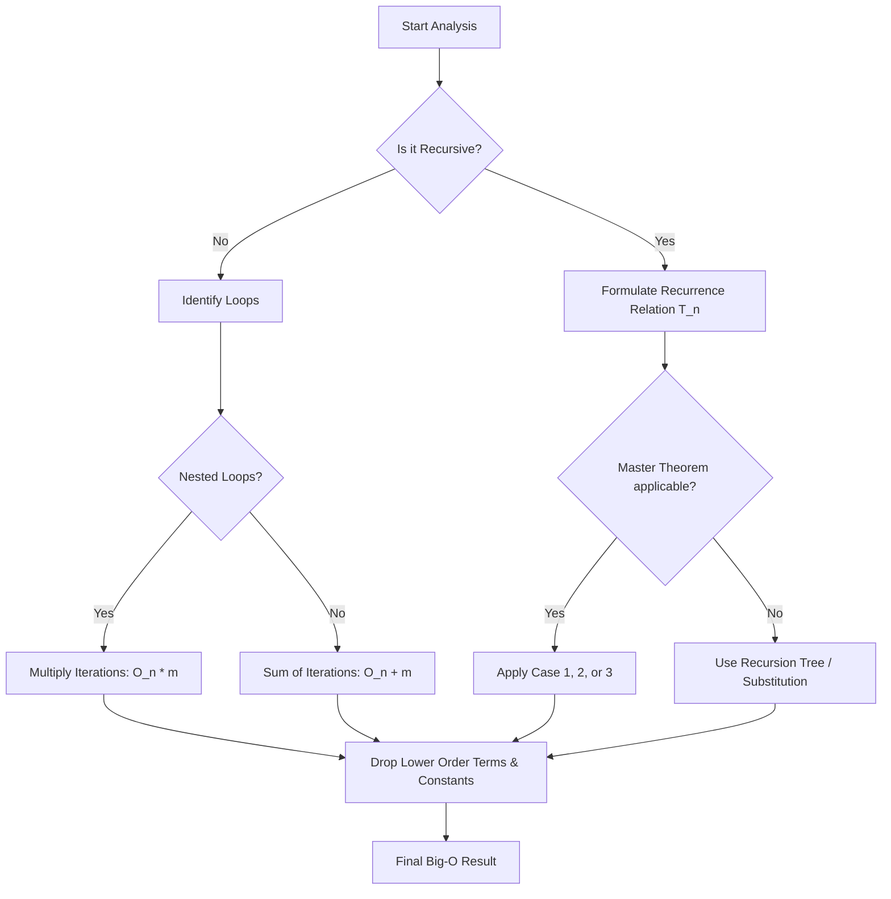

# Complexity Analysis: Big-O, Theta, Omega, and Space Complexity

> **Complexity analysis** is the theoretical study of computer program performance and resource usage, focusing on how the requirements for time and memory scale as the input size approaches infinity.

## 1. Historical Background & Motivation

The formalization of complexity analysis represents the pivot point where computer programming transformed from an empirical "craft" into a rigorous mathematical science. In the early days of computing (the 1940s and 50s), performance was measured in seconds or clock cycles on specific machines like the ENIAC. However, as hardware evolved rapidly, these measurements became obsolete within years. The industry needed a way to describe algorithm efficiency that was independent of the CPU clock speed, compiler optimizations, or memory architecture of the day.

The mathematical roots of this notation lie in the late 19th-century work of Paul Bachmann and Edmund Landau, who developed "number theory" tools to describe the growth of functions. It wasn't until 1976 that **Donald Knuth**, the father of modern algorithmic analysis, popularized "Big-O" and introduced "Big-Theta" and "Big-Omega" to the computer science community. Knuth realized that to build robust systems at scale—what we now call FAANG-level engineering—engineers must predict how an algorithm will behave when data grows from a thousand records to a billion. Without this theoretical framework, we could not design the distributed databases, real-time search engines, or global social networks that define the modern era.

## 2. Visual Intuition
:::demo
<div style="background:#1e1e1e;padding:16px;border-radius:10px;color:#e5e7eb;font-family:system-ui,sans-serif">
  <h3 style="margin:0 0 8px 0;color:#7dd3fc">Complexity Growth Rates (Worst-Case)</h3>
  <svg width="100%" height="250" viewBox="0 0 800 250" preserveAspectRatio="xMidYMid meet">
    <style>
      .grid-line { stroke: #4b5563; stroke-width: 0.5; stroke-dasharray: 2,2; }
      .axis-line { stroke: #4b5563; stroke-width: 1; }
      .axis-label { fill: #9ca3af; font-size: 10px; text-anchor: middle; }
      .y-axis-label { fill: #9ca3af; font-size: 12px; text-anchor: middle; }
      .x-axis-label { fill: #9ca3af; font-size: 12px; text-anchor: middle; }
      .legend-text { fill: #e5e7eb; font-size: 10px; }
    </style>

    <!-- Chart Area Background -->
    <rect x="50" y="30" width="700" height="190" fill="#1f2937"/>

    <!-- Y-Axis Grid Lines -->
    <line class="grid-line" x1="50" y1="30" x2="750" y2="30" /> <!-- Top (150) -->
    <line class="grid-line" x1="50" y1="77.5" x2="750" y2="77.5" /> <!-- 100 -->
    <line class="grid-line" x1="50" y1="125" x2="750" y2="125" /> <!-- 50 -->
    <line class="grid-line" x1="50" y1="220" x2="750" y2="220" /> <!-- Bottom (0) -->

    <!-- X-Axis Grid Lines -->
    <line class="grid-line" x1="50" y1="30" x2="50" y2="220" /> <!-- Left (0) -->
    <line class="grid-line" x1="190" y1="30" x2="190" y2="220" /> <!-- 2 -->
    <line class="grid-line" x1="330" y1="30" x2="330" y2="220" /> <!-- 4 -->
    <line class="grid-line" x1="470" y1="30" x2="470" y2="220" /> <!-- 6 -->
    <line class="grid-line" x1="610" y1="30" x2="610" y2="220" /> <!-- 8 -->
    <line class="grid-line" x1="750" y1="30" x2="750" y2="220" /> <!-- Right (10) -->

    <!-- X-Axis -->
    <line class="axis-line" x1="50" y1="220" x2="750" y2="220" />
    <text class="axis-label" x="50" y="240">0</text>
    <text class="axis-label" x="190" y="240">2</text>
    <text class="axis-label" x="330" y="240">4</text>
    <text class="axis-label" x="470" y="240">6</text>
    <text class="axis-label" x="610" y="240">8</text>
    <text class="axis-label" x="750" y="240">10</text>
    <text class="x-axis-label" x="400" y="248">Input Size (n)</text>

    <!-- Y-Axis -->
    <line class="axis-line" x1="50" y1="30" x2="50" y2="220" />
    <text class="axis-label" x="40" y="224">0</text>
    <text class="axis-label" x="40" y="129">50</text>
    <text class="axis-label" x="40" y="81.5">100</text>
    <text class="axis-label" x="40" y="34">150</text>
    <text class="y-axis-label" x="15" y="125" transform="rotate(-90 15 125)">Operations / Time</text>

    <!-- O(1) -->
    <polyline points="50.00,207.00 120.00,207.00 190.00,207.00 260.00,207.00 330.00,207.00 400.00,207.00 470.00,207.00 540.00,207.00 610.00,207.00 680.00,207.00 750.00,207.00" fill="none" stroke="#10b981" stroke-width="2" />
    <!-- O(log n) -->
    <polyline points="50.00,220.00 120.00,203.88 190.00,197.64 260.00,193.00 330.00,189.20 400.00,186.04 470.00,183.33 540.00,180.97 610.00,178.89 680.00,177.01 750.00,175.31" fill="none" stroke="#3b82f6" stroke-width="2" />
    <!-- O(n) -->
    <polyline points="50.00,220.00 120.00,210.50 190.00,201.00 260.00,191.50 330.00,182.00 400.00,172.50 470.00,163.00 540.00,153.50 610.00,144.00 680.00,134.50 750.00,125.00" fill="none" stroke="#f59e0b" stroke-width="2" />
    <!-- O(n^2) -->
    <polyline points="50.00,220.00 120.00,218.47 190.00,212.33 260.00,201.59 330.00,186.25 400.00,166.31 470.00,141.77 540.00,112.63 610.00,78.89 680.00,40.55 750.00,30.00" fill="none" stroke="#ef4444" stroke-width="2" />
    <!-- O(2^n) -->
    <polyline points="50.00,220.00 120.00,218.47 190.00,215.33 260.00,208.00 330.00,193.33 400.00,164.00 470.00,105.33 540.00,30.00 610.00,30.00 680.00,30.00 750.00,30.00" fill="none" stroke="#8b5cf6" stroke-width="2" />
    <!-- O(n!) -->
    <polyline points="50.00,220.00 120.00,218.47 190.00,216.93 260.00,211.33 330.00,194.00 400.00,137.33 470.00,30.00 540.00,30.00 610.00,30.00 680.00,30.00 750.00,30.00" fill="none" stroke="#e5e7eb" stroke-width="2" />

    <!-- Legend -->
    <rect x="760" y="30" width="10" height="10" fill="#10b981"/>
    <text x="775" y="39" class="legend-text">O(1)</text>
    <rect x="760" y="48" width="10" height="10" fill="#3b82f6"/>
    <text x="775" y="57" class="legend-text">O(log n)</text>
    <rect x="760" y="66" width="10" height="10" fill="#f59e0b"/>
    <text x="775" y="75" class="legend-text">O(n)</text>
    <rect x="760" y="84" width="10" height="10" fill="#ef4444"/>
    <text x="775" y="93" class="legend-text">O(n²)</text>
    <rect x="760" y="102" width="10" height="10" fill="#8b5cf6"/>
    <text x="775" y="111" class="legend-text">O(2ⁿ)</text>
    <rect x="760" y="120" width="10" height="10" fill="#e5e7eb"/>
    <text x="775" y="129" class="legend-text">O(n!)</text>
  </svg>
  <p style="margin-top:10px;color:#cbd5e1">Comparison of common growth rates. Notice how $O(2^n)$ and $O(n!)$ explode vertically, while $O(\log n)$ and $O(1)$ remain nearly flat, highlighting why choice of algorithm is more critical than hardware speed for large $n$.</p>
</div>
:::
*Caption: Comparison of common growth rates. Notice how $O(2^n)$ and $O(n!)$ explode vertically, while $O(\log n)$ and $O(1)$ remain nearly flat, highlighting why choice of algorithm is more critical than hardware speed for large $n$.*

## 3. Core Theory & Mathematical Foundations

Complexity analysis is predicated on the **RAM (Random Access Machine)** model of computation. In this model, we assume that basic operations (addition, assignment, memory access) take constant time, and we count these operations as a function of the input size $n$.

### 3.1 Asymptotic Notation: The Formal Definitions

We use three primary notations to bound the growth of functions:

**1. Big-O ($O$): Upper Bound**
Formally, $f(n) = O(g(n))$ if there exist positive constants $c$ and $n_0$ such that:
$$0 \le f(n) \le c \cdot g(n) \text{ for all } n \ge n_0$$
This represents the "worst-case" scenario or the maximum rate of growth.

**2. Big-Omega ($\Omega$): Lower Bound**
Formally, $f(n) = \Omega(g(n))$ if there exist positive constants $c$ and $n_0$ such that:
$$0 \le c \cdot g(n) \le f(n) \text{ for all } n \ge n_0$$
This represents the "best-case" or the minimum rate of growth.

**3. Big-Theta ($\Theta$): Tight Bound**
Formally, $f(n) = \Theta(g(n))$ if there exist positive constants $c_1, c_2,$ and $n_0$ such that:
$$0 \le c_1 \cdot g(n) \le f(n) \le c_2 \cdot g(n) \text{ for all } n \ge n_0$$
An algorithm is $\Theta(g(n))$ if and only if it is both $O(g(n))$ and $\Omega(g(n))$.

### 3.2 Properties of Asymptotic Growth

To analyze complex code, we rely on several mathematical lemmas:

*   **Sum Rule:** If $T_1(n) = O(f(n))$ and $T_2(n) = O(g(n))$, then $T_1(n) + T_2(n) = O(\max(f(n), g(n)))$.
*   **Product Rule:** If $T_1(n) = O(f(n))$ and $T_2(n) = O(g(n))$, then $T_1(n) \cdot T_2(n) = O(f(n) \cdot g(n))$.
*   **Transitivity:** If $f(n) = \Theta(g(n))$ and $g(n) = \Theta(h(n))$, then $f(n) = \Theta(h(n))$.

### 3.3 The Limit Definition
A more advanced way to determine the relationship between two functions $f(n)$ and $g(n)$ is to evaluate the limit of their ratio:
$$L = \lim_{n \to \infty} \frac{f(n)}{g(n)}$$
*   If $L = 0$, then $f(n) = o(g(n))$ (Little-o, strictly slower growth).
*   If $0 < L < \infty$, then $f(n) = \Theta(g(n))$.
*   If $L = \infty$, then $f(n) = \omega(g(n))$ (Little-omega, strictly faster growth).

### 3.4 Space Complexity: Memory vs. Time
While time complexity measures "ticks," space complexity measures "cells." It is divided into:
1.  **Auxiliary Space:** The extra space or temporary space used by the algorithm.
2.  **Input Space:** The space occupied by the input.
Total Space Complexity = Auxiliary Space + Input Space. In professional contexts, we usually focus on Auxiliary Space (e.g., is the sort "in-place"?).

## 4. Algorithm / Process (Step-by-Step Analysis)

To analyze the complexity of any arbitrary code block, follow this systematic procedure:

1.  **Identify the Input Size ($n$):** Determine what variable represents the scale of the data (length of an array, number of nodes in a tree).
2.  **Break into Primitive Operations:** Identify constant-time operations ($O(1)$) like assignments, arithmetic, and array indexing.
3.  **Analyze Consecutive Statements:** Use the **Sum Rule**. If you have a linear loop followed by a quadratic loop, the overall complexity is $O(n^2)$.
4.  **Analyze Loops:** Multiply the number of iterations by the work done inside the loop.
5.  **Analyze Nested Loops:** Work from the inside out. A loop running $n$ times inside another loop running $n$ times results in $O(n^2)$.
6.  **Analyze Branching (If-Else):** In worst-case analysis, take the complexity of the most expensive branch.
7.  **Analyze Recursive Calls:** Use recurrence relations and the **Master Theorem** or a **Recursion Tree**.

## 5. Visual Diagram


*Caption: Logical flow for determining algorithmic complexity. Recursive structures require recurrence relations, while iterative structures use the sum/product rules of loops.*

## 6. Implementation

### 6.1 Core Implementation: Complexity Demonstrations
The following Python code demonstrates different complexity classes within a single context.

```python
import math

def constant_time_demo(arr):
    """
    O(1) - Constant Time.
    Accessing an element by index takes the same time regardless of array size.
    """
    if len(arr) > 0:
        return arr[0] # O(1)
    return None

def linear_time_demo(arr):
    """
    O(n) - Linear Time.
    We must visit every element exactly once.
    """
    total = 0
    for x in arr: # n iterations
        total += x # O(1)
    return total

def logarithmic_time_demo(arr, target):
    """
    O(log n) - Logarithmic Time.
    Binary search: input size is halved each step.
    """
    low, high = 0, len(arr) - 1
    while low <= high:
        mid = (low + high) // 2
        if arr[mid] == target:
            return mid
        elif arr[mid] < target:
            low = mid + 1
        else:
            high = mid - 1
    return -1

def quadratic_time_demo(arr):
    """
    O(n^2) - Quadratic Time.
    Nested loops: for each n, we do n work.
    """
    pairs = []
    for i in range(len(arr)):
        for j in range(len(arr)):
            pairs.append((arr[i], arr[j]))
    return pairs

# Sample Execution
data = [1, 2, 3, 4, 5]
print(f"O(1): {constant_time_demo(data)}")
print(f"O(n): {linear_time_demo(data)}")
print(f"O(log n): {logarithmic_time_demo(sorted(data), 3)}")
print(f"O(n^2) pair count: {len(quadratic_time_demo(data))}")
```

### 6.2 Optimized / Production Variant: Space-Time Tradeoff
In industry, we often trade space for time. Here is a demonstration of using a Hash Map (Dictionary) to turn an $O(n^2)$ problem into $O(n)$.

```python
def find_two_sum_naive(nums, target):
    """
    Problem: Find indices of two numbers that sum to target.
    Naive Approach: O(n^2) time, O(1) space.
    """
    n = len(nums)
    for i in range(n):
        for j in range(i + 1, n):
            if nums[i] + nums[j] == target:
                return [i, j]
    return []

def find_two_sum_optimized(nums, target):
    """
    Optimized Approach: O(n) time, O(n) space.
    We use a hash map to store seen values.
    """
    lookup = {} # Space: O(n)
    for i, num in enumerate(nums): # Time: O(n)
        complement = target - num
        if complement in lookup:
            return [lookup[complement], i]
        lookup[num] = i
    return []

# Tradeoff: find_two_sum_optimized is significantly faster for large nums
# but consumes O(n) memory to store the dictionary.
```

### 6.3 Common Pitfalls in Code
*   **Hidden Costs:** Calling `list.pop(0)` in Python is $O(n)$, not $O(1)$, because all subsequent elements must be shifted. A loop containing `pop(0)` becomes $O(n^2)$.
*   **String Concatenation:** In some languages, `s += char` creates a new string each time, making building a string of length $n$ an $O(n^2)$ operation. Use `"".join(list)` instead ($O(n)$).
*   **Ignoring the Recursion Stack:** A recursive function with no local variables still uses $O(d)$ space, where $d$ is the depth of the recursion tree, due to the call stack.

## 7. Interactive Demo

:::demo
<!-- title: Growth Rate Visualizer -->
<!DOCTYPE html>
<html>
<head>
<meta charset="utf-8">
<style>
  body { margin:0; background:#0f1117; color:#e5e7eb; font-family: system-ui, sans-serif; font-size:13px; padding:16px; }
  canvas { background: #1f2937; border-radius: 8px; width: 100%; height: 300px; }
  .controls { display: grid; grid-template-columns: 1fr 1fr; gap: 10px; margin-bottom: 10px; }
  .stat-card { background: #374151; padding: 8px; border-radius: 4px; }
  .legend { display: flex; gap: 10px; flex-wrap: wrap; margin-top: 10px; }
  .legend-item { display: flex; align-items: center; gap: 4px; }
  .dot { width: 10px; height: 10px; border-radius: 50%; }
</style>
</head>
<body>
  <div class="controls">
    <div class="stat-card">
      <label>Input Size (n): <span id="n-val">50</span></label>
      <input type="range" id="n-slider" min="1" max="100" value="50" style="width:100%">
    </div>
    <div class="stat-card">
      <label>Simulation Speed</label>
      <input type="range" id="speed-slider" min="1" max="10" value="5" style="width:100%">
    </div>
  </div>
  <canvas id="chart"></canvas>
  <div class="legend" id="legend"></div>

<script>
  const canvas = document.getElementById('chart');
  const ctx = canvas.getContext('2d');
  const nSlider = document.getElementById('n-slider');
  const nVal = document.getElementById('n-val');
  
  const complexities = [
    { label: 'O(1)', color: '#10b981', func: n => 10 },
    { label: 'O(log n)', color: '#3b82f6', func: n => 15 * Math.log2(n + 1) },
    { label: 'O(n)', color: '#f59e0b', func: n => n },
    { label: 'O(n log n)', color: '#8b5cf6', func: n => n * Math.log2(n + 1) * 0.5 },
    { label: 'O(n²)', color: '#ef4444', func: n => n * n * 0.1 }
  ];

  function setupLegend() {
    const legend = document.getElementById('legend');
    complexities.forEach(c => {
      legend.innerHTML += `
        <div class="legend-item">
          <div class="dot" style="background:${c.color}"></div>
          <span>${c.label}</span>
        </div>`;
    });
  }

  function draw() {
    const n = parseInt(nSlider.value);
    nVal.innerText = n;
    
    ctx.clearRect(0, 0, canvas.width, canvas.height);
    const padding = 40;
    const width = canvas.width - padding * 2;
    const height = canvas.height - padding * 2;

    // Draw Axes
    ctx.strokeStyle = '#4b5563';
    ctx.beginPath();
    ctx.moveTo(padding, padding);
    ctx.lineTo(padding, canvas.height - padding);
    ctx.lineTo(canvas.width - padding, canvas.height - padding);
    ctx.stroke();

    // Draw Curves
    complexities.forEach(c => {
      ctx.strokeStyle = c.color;
      ctx.lineWidth = 2;
      ctx.beginPath();
      for(let x = 0; x <= n; x++) {
        const px = padding + (x / 100) * width;
        const val = c.func(x);
        const py = (canvas.height - padding) - (val / 100) * height;
        if(x === 0) ctx.moveTo(px, py);
        else ctx.lineTo(px, py);
      }
      ctx.stroke();
    });

    requestAnimationFrame(draw);
  }

  // Adjust for high DPI
  const dpr = window.devicePixelRatio || 1;
  canvas.width = canvas.offsetWidth * dpr;
  canvas.height = canvas.offsetHeight * dpr;
  ctx.scale(dpr, dpr);

  setupLegend();
  draw();
</script>
</body>
</html>
:::

## 8. Worked Examples

### Example 1 — Basic Application: Nested Loops
**Analyze the following code:**
```python
def sum_matrix(matrix):
    n = len(matrix) # Input size n
    total = 0 # O(1)
    for i in range(n): # Runs n times
        for j in range(n): # Runs n times
            total += matrix[i][j] # O(1)
    return total
```
**Step-by-step Derivation:**
1.  Outer loop runs $n$ iterations.
2.  Inner loop runs $n$ iterations for *each* iteration of the outer loop.
3.  Work inside inner loop is $O(1)$.
4.  Total operations: $n \times (n \times 1) = n^2$.
5.  **Complexity: $O(n^2)$**.

### Example 2 — Complex Case: Binary Search within a Loop
**Analyze the following code:**
```python
def custom_search(arr, targets):
    # arr is length n, targets is length m
    arr.sort() # O(n log n)
    results = []
    for t in targets: # m iterations
        idx = binary_search(arr, t) # O(log n)
        results.append(idx)
    return results
```
**Step-by-step Derivation:**
1.  Sorting `arr` takes $O(n \log n)$.
2.  The loop runs $m$ times (where $m$ is the size of `targets`).
3.  Inside the loop, `binary_search` takes $O(\log n)$.
4.  The loop total is $O(m \cdot \log n)$.
5.  Total Complexity: $O(n \log n + m \log n)$.
6.  Using the Sum Rule: $O((n+m) \log n)$.

## 9. Comparison with Alternatives

| Growth Class | Label | Time for $n=10^6$ | Scalability | Use Case |
|---|---|---|---|---|
| $O(1)$ | Constant | ~1 ns | Perfect | Hash table lookup, array access |
| $O(\log n)$ | Logarithmic | ~20 ns | Excellent | Binary Search, Balanced BSTs |
| $O(n)$ | Linear | ~1 ms | Good | Iterating arrays, Linked List traversal |
| $O(n \log n)$ | Linearithmic | ~20 ms | Acceptable | Merge Sort, Quick Sort, Timsort |
| $O(n^2)$ | Quadratic | ~16 mins | Poor | Nested loops, Bubble Sort |
| $O(2^n)$ | Exponential | > Decades | Terrible | Recursive Fibonacci, Power Set |
| $O(n!)$ | Factorial | > Age of Universe | Non-computable | Traveling Salesperson (Brute force) |

## 10. Industry Applications & Real Systems

-   **Google Search Index**: When indexing the web, Google cannot use $O(n^2)$ algorithms. If $n$ is the number of web pages (trillions), an $O(n^2)$ approach would never finish. They rely on $O(n)$ distributed processing (MapReduce) and $O(\log n)$ or $O(1)$ retrieval via inverted indices and distributed hash tables (BigTable).
-   **High-Frequency Trading (HFT)**: In HFT, the constant factor $c$ in $O(c \cdot n)$ matters as much as the growth rate. Engineers optimize for "cache locality" to ensure $O(1)$ memory accesses hit the L1 cache ($~1$ ns) rather than Main Memory ($~100$ ns), as a $100\times$ constant difference is the difference between profit and loss.
-   **Amazon DynamoDB**: This NoSQL database guarantees $O(1)$ performance for point lookups regardless of whether the table is 1 GB or 100 TB. This is achieved through consistent hashing, illustrating how $O(1)$ is the gold standard for global-scale systems.
-   **Netflix Video Encoding**: Video compression (like HEVC/AV1) uses extremely complex algorithms. While the player (decoder) must be $O(n)$ to run on your phone, the encoder can be $O(n^2)$ or higher to find the best compression, as it's run once on high-powered servers.

## 11. Practice Problems

### 🟢 Easy
1.  **Array Max**: Find the maximum value in an unsorted array of size $n$.
    *Hint: You must check every element.*
    *Expected complexity: $O(n)$*

### 🟡 Medium
2.  **Duplicate Detection**: Given an array of $n$ integers, determine if any value appears at least twice.
    *Hint: Consider sorting first or using a hash set.*
    *Expected complexity: $O(n \log n)$ or $O(n)$*

3.  **Matrix Power**: Calculate $A^k$ where $A$ is an $n \times n$ matrix.
    *Hint: Use binary exponentiation for the power.*
    *Expected complexity: $O(n^3 \log k)$*

### 🔴 Hard
4.  **Median of Two Sorted Arrays**: Find the median of two sorted arrays of sizes $m$ and $n$ in $O(\log(\min(m, n)))$ time.
    *Hint: Use a modified binary search to find the correct partition point.*

5.  **Longest Increasing Subsequence**: Find the length of the longest increasing subsequence in an array of $n$ elements.
    *Expected complexity: $O(n \log n)$*

## 12. Interactive Quiz

:::quiz
**Q1: If an algorithm has a time complexity of $O(n^2)$, what happens to the execution time if the input size $n$ triples?**
- A) It triples.
- B) It increases by a factor of 6.
- C) It increases by a factor of 9.
- D) It stays the same.
> C — Because $(3n)^2 = 9n^2$. The growth is proportional to the square of the input.

**Q2: Which of the following is the tightest upper bound for the expression $f(n) = 3n^3 + 10n^2 \log n + 100$?**
- A) $O(n^2)$
- B) $O(n^3)$
- C) $O(n^2 \log n)$
- D) $O(n^4)$
> B — In asymptotic analysis, we drop constants and lower-order terms. $n^3$ grows faster than $n^2 \log n$.

**Q3: What is the space complexity of a recursive function that calculates the Factorial of $n$?**
- A) $O(1)$
- B) $O(n)$
- C) $O(\log n)$
- D) $O(n!)$
> B — Each recursive call adds a frame to the call stack. For `fact(n)`, there are $n$ nested calls before reaching the base case.

**Q4: An algorithm is $\Omega(n)$ and $O(n^2)$. Which of the following statements MUST be true?**
- A) It is $\Theta(n)$.
- B) It is $\Theta(n^2)$.
- C) Its best case is at least linear.
- D) Its worst case is exactly quadratic.
> C — $\Omega(n)$ provides a lower bound, meaning it is at least as slow as $n$. The other options describe "tight" bounds which aren't guaranteed.

**Q5: Analyze: `for i in range(n): j = 1; while j < n: j *= 2`. What is the time complexity?**
- A) $O(n^2)$
- B) $O(n \log n)$
- C) $O(n)$
- D) $O(\log n)$
> B — The outer loop runs $n$ times. The inner loop doubles $j$ each time, which takes $\log n$ steps to reach $n$.
:::

## 13. Interview Preparation

### Conceptual Questions

**Q: Explain Big-O as if teaching it to a fellow engineer.**
*A: Big-O notation is a tool to describe how an algorithm's resource requirements scale relative to input size. It ignores constant factors and hardware specificities, focusing instead on the "growth rate." It effectively answers: "If I double my data, does the work double, quadruple, or barely change?"*

**Q: What is the difference between $O$, $\Omega$, and $\Theta$?**
*A: $O$ is an upper bound (worst case). $\Omega$ is a lower bound (best case). $\Theta$ is a tight bound, meaning the algorithm's complexity is exactly that growth rate ($O$ and $\Omega$ match).*

**Q: Why do we usually ignore constants in Big-O?**
*A: Constants depend on the compiler, CPU, and language. For very large $n$, the growth of the function (e.g., $n^2$ vs $n$) overwhelms any constant multiplier. However, in the "real world," if two algorithms are both $O(n)$, the one with the smaller constant is preferred.*

### Quick Reference (Cheat Sheet)

| Property | Value |
|---|---|
| Big-O ($O$) | Upper Bound (Maximum work) |
| Big-Omega ($\Omega$) | Lower Bound (Minimum work) |
| Big-Theta ($\Theta$) | Tight Bound (Exact growth) |
| Space Complexity | Auxiliary + Input Space |
| Logarithmic Growth | $O(\log n)$ (Usually base 2) |
| Linearithmic Growth | $O(n \log n)$ (Standard for sorting) |

## 14. Key Takeaways
1.  **Asymptotic focus**: We care about how $T(n)$ behaves as $n \to \infty$.
2.  **Dominance**: $n^2$ always eventually beats $1000n$ no matter how large the constant.
3.  **Space counts**: In modern cloud computing (AWS/GCP), memory usage costs money. $O(1)$ space is a major win.
4.  **Recursive overhead**: Always account for the call stack when calculating space complexity.
5.  **Worst-case is standard**: In interviews, unless specified, "complexity" refers to the Worst-Case Big-O.
6.  **Amortized Analysis**: Sometimes an operation is expensive once but cheap for the next 99 times (e.g., dynamic array resizing). We average this over time.
7.  **Know your defaults**: Python's `sort()` is $O(n \log n)$, `in` operator for lists is $O(n)$, but for sets/dicts is $O(1)$.

## 15. Common Misconceptions
- ❌ **"Big-O is the average case."** → ✅ Big-O is the *upper bound*. It can represent the average case, but by definition, it describes the worst-case ceiling.
- ❌ **"An $O(n^2)$ algorithm is always slower than $O(n)$."** → ✅ For small $n$, the constants might make $O(n^2)$ faster. Only as $n$ grows large does the $O(n)$ algorithm win.
- ❌ **"Space complexity only includes the variables I create."** → ✅ It also includes the call stack for recursive functions and any temporary structures created by library calls.

## 16. Further Reading
- *Introduction to Algorithms (CLRS), Chapter 3* — The definitive source for formal mathematical definitions.
- *The Art of Computer Programming, Vol 1 (Knuth)* — For historical context on Landau notation.
- *Cracking the Coding Interview, Chapter 6* — Practical application for FAANG interviews.
- *Algorithm Design Manual (Skiena)* — Excellent for visual intuitions and real-world trade-offs.

## 17. Related Topics
- [[recursion-basics]] — Foundational for understanding logarithmic time and stack space.
- [[dynamic-arrays]] — Critical for understanding amortized $O(1)$ complexity.
- [[string-operations]] — Explores the hidden complexities of immutable data types.
- [[matrix-operations]] — Deep dive into $O(n^3)$ and Strassen's $O(n^{2.81})$ optimization.
