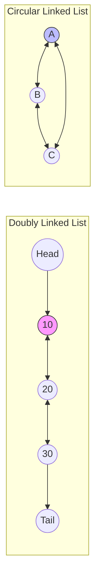

# Doubly and Circular Linked Lists: Operations and LRU Cache Implementation

> A **Doubly Linked List (DLL)** is a linear data structure where each element (node) contains a data field and two reference fields pointing to the previous and next nodes in the sequence, while a **Circular Linked List** connects the tail back to the head to form a closed ring.

## 1. Historical Background & Motivation

The concept of linked lists dates back to 1955-1956, developed by Allen Newell, Cliff Shaw, and Herbert Simon at the RAND Corporation as the primary data structure for their Information Processing Language (IPL). While the initial implementations were singly linked, the necessity for bidirectional traversal became apparent as early symbolic logic processing required backtracking through expressions. By the time McCarthy developed LISP in the late 1950s, the "list" had become a fundamental abstraction in computer science.

The transition from singly linked lists to doubly linked lists was driven by the computational cost of deletion and reverse traversal. In a singly linked list, deleting a node $n$ requires a reference to $n$'s predecessor, which necessitates an $O(n)$ search from the head. Doubly linked lists solved this by embedding the predecessor's address within the node itself, enabling $O(1)$ deletion if the node reference is already held. Circular variants emerged soon after to optimize applications like round-robin scheduling in early multi-programming operating systems (like CTSS and Multics), where the CPU needed to cycle through a set of active processes indefinitely. Today, these structures underpin everything from the Linux kernel’s task management to high-performance caching layers like Redis.

## 2. Visual Intuition
:::demo
<div style="background:#1e1e1e;padding:16px;border-radius:10px;color:#e5e7eb;font-family:system-ui,sans-serif">
  <h3 style="margin:0 0 8px 0;color:#7dd3fc">Doubly and Circular Linked Lists: Operations and LRU Cache Implementation - Concept Map</h3>
  <svg width="100%" height="280" viewBox="0 0 640 280" role="img" aria-label="Doubly and Circular Linked Lists: Operations and LRU Cache Implementation visual intuition" style="background:#111827;border-radius:8px">
    <rect x="24" y="28" width="180" height="64" rx="10" fill="#1d4ed8" />
    <text x="114" y="66" text-anchor="middle" fill="#e5e7eb" font-size="14">Problem</text>
    <rect x="230" y="28" width="180" height="64" rx="10" fill="#0f766e" />
    <text x="320" y="66" text-anchor="middle" fill="#e5e7eb" font-size="14">Process</text>
    <rect x="436" y="28" width="180" height="64" rx="10" fill="#7c3aed" />
    <text x="526" y="66" text-anchor="middle" fill="#e5e7eb" font-size="14">Outcome</text>

    <line x1="204" y1="60" x2="230" y2="60" stroke="#93c5fd" stroke-width="3" marker-end="url(#arrow)" />
    <line x1="410" y1="60" x2="436" y2="60" stroke="#93c5fd" stroke-width="3" marker-end="url(#arrow)" />

    <rect x="24" y="130" width="592" height="120" rx="10" fill="#0b1220" stroke="#334155" />
    <text x="320" y="156" text-anchor="middle" fill="#cbd5e1" font-size="14">Key intuition for Doubly and Circular Linked Lists: Operations and LRU Cache Implementation</text>
    <text x="320" y="182" text-anchor="middle" fill="#94a3b8" font-size="12">Track state changes, constraints, and final behavior.</text>
    <text x="320" y="206" text-anchor="middle" fill="#94a3b8" font-size="12">Use this as a mental model before formal proofs or code.</text>

    <defs>
      <marker id="arrow" markerWidth="10" markerHeight="10" refX="8" refY="3" orient="auto">
        <polygon points="0 0, 10 3, 0 6" fill="#93c5fd" />
      </marker>
    </defs>
  </svg>
  <p style="margin-top:10px;color:#cbd5e1">Interactive-ready visual scaffold for the topic.</p>
</div>
:::
*Caption: A Doubly Linked List node structure showing the value (center), the 'next' pointer (right), and the 'prev' pointer (left). Each node is linked bidirectionally.*

## 3. Core Theory & Mathematical Foundations

### 3.1 Formal Definition of a Node
Let $V$ be the set of all possible values. A node $N$ in a Doubly Linked List is a 3-tuple $(v, p, n)$ where:
- $v \in V$ is the data payload.
- $p \in \{Nodes\} \cup \{NIL\}$ is the pointer to the predecessor.
- $n \in \{Nodes\} \cup \{NIL\}$ is the pointer to the successor.

For a well-formed list $L = [N_0, N_1, \dots, N_k]$, the following invariants must hold:
1. $N_i.next = N_{i+1}$ for all $0 \le i < k$.
2. $N_i.prev = N_{i-1}$ for all $0 < i \le k$.
3. $N_0.prev = NIL$ (unless circular).
4. $N_k.next = NIL$ (unless circular).

### 3.2 The Circular Constraint
In a **Circular Doubly Linked List**, the boundary conditions change to:
- $N_0.prev = N_k$
- $N_k.next = N_0$

This forms a group structure where the successor function acts as a generator for the set of nodes. If we define a successor function $S(N_i) = N_{i+1 \pmod{m}}$, then $S^m(N_i) = N_i$. This is mathematically equivalent to a ring buffer but with dynamic allocation properties rather than contiguous memory constraints.

### 3.3 The "Pointer Tax" and Spatial Locality
While DLLs offer $O(1)$ flexibility, they suffer from two primary drawbacks compared to arrays:
1. **Memory Overhead:** On a 64-bit system, each node requires at least 16 bytes for two pointers (`prev` and `next`) plus the data payload and object overhead.
2. **Cache Misses:** Unlike `dynamic-arrays`, nodes in a linked list are scattered in the heap. Traversing a list results in "pointer chasing," where the CPU cannot effectively prefetch data into L1/L2 caches, leading to significantly higher latency in practice than $O(n)$ array iteration.

### 3.4 Formal Analysis of the LRU Policy
The Least Recently Used (LRU) eviction policy operates on the **Temporal Locality Principle**: if data was accessed recently, it is likely to be accessed again soon.
To implement this, we maintain a DLL of items in order of their last access.
- **Access (get):** Move node to head ($O(1)$).
- **Eviction (put):** Remove node from tail ($O(1)$).
- **Lookup:** Hash Map maps keys to DLL nodes ($O(1)$).

The correctness of the LRU cache is maintained by the invariant that the head always represents the "Most Recently Used" (MRU) element and the tail represents the "Least Recently Used" (LRU).

## 4. Algorithm / Process (Step-by-Step)

### Insertion at Head (DLL)
1.  Create a new node `newNode`.
2.  Set `newNode.next = head`.
3.  Set `newNode.prev = NIL`.
4.  If `head` is not `NIL`, set `head.prev = newNode`.
5.  Update `head = newNode`.

### Deletion of a Middle Node `curr` (DLL)
1.  Identify the neighbors: `prevNode = curr.prev` and `nextNode = curr.next`.
2.  Update the forward link: `prevNode.next = nextNode`.
3.  Update the backward link: `nextNode.prev = prevNode`.
4.  Nullify `curr.next` and `curr.prev` to assist garbage collection.

### LRU `get(key)` Operation
1.  Check if `key` exists in the Hash Map.
2.  If not, return -1.
3.  If yes, the value is stored in a DLL node. Use the node's `prev` and `next` pointers to detach it from its current position.
4.  Re-insert the node at the **head** of the DLL (MRU position).
5.  Return the value.

## 5. Visual Diagram


*Caption: Comparison of a standard DLL (top) with terminating NIL pointers, and a Circular DLL (bottom) where the end nodes point to each other.*

## 6. Implementation

### 6.1 Core Implementation (DLL with Sentinels)
Sentinels (dummy nodes) are a production-grade technique to eliminate null checks and edge cases at the boundaries.

```python
class Node:
    def __init__(self, key=0, value=0):
        self.key = key
        self.value = value
        self.prev = None
        self.next = None

class DoublyLinkedList:
    """
    A DLL implementation using sentinel nodes for head and tail.
    Complexity: All operations are O(1) given a node reference.
    """
    def __init__(self):
        # Sentinels simplify add/remove logic by removing null checks
        self.head = Node()
        self.tail = Node()
        self.head.next = self.tail
        self.tail.prev = self.head
        self.size = 0

    def add_to_front(self, node: Node):
        """Adds a node immediately after the head sentinel."""
        node.next = self.head.next
        node.prev = self.head
        self.head.next.prev = node
        self.head.next = node
        self.size += 1

    def remove_node(self, node: Node):
        """Removes a specific node from the list."""
        prev_node = node.prev
        next_node = node.next
        prev_node.next = next_node
        next_node.prev = prev_node
        self.size -= 1

    def pop_tail(self) -> Node:
        """Removes and returns the node before the tail sentinel."""
        if self.size == 0:
            return None
        last_node = self.tail.prev
        self.remove_node(last_node)
        return last_node

# Usage
# dll = DoublyLinkedList()
# n1 = Node(1, 100)
# dll.add_to_front(n1)
# dll.remove_node(n1)
```

### 6.2 LRU Cache (The Production Variant)
This combines a Python dictionary (Hash Map) with the `DoublyLinkedList` above.

```python
class LRUCache:
    """
    LRU Cache combining Hash Map for O(1) lookup 
    and DLL for O(1) eviction/ordering.
    """
    def __init__(self, capacity: int):
        self.capacity = capacity
        self.cache = {} # Map key -> Node
        self.list = DoublyLinkedList()

    def get(self, key: int) -> int:
        if key not in self.cache:
            return -1
        node = self.cache[key]
        # Move accessed node to head (Most Recently Used)
        self.list.remove_node(node)
        self.list.add_to_front(node)
        return node.value

    def put(self, key: int, value: int) -> None:
        if key in self.cache:
            # Update existing node
            node = self.cache[key]
            node.value = value
            self.list.remove_node(node)
            self.list.add_to_front(node)
        else:
            # Add new node
            if self.list.size >= self.capacity:
                # Evict Least Recently Used
                lru_node = self.list.pop_tail()
                if lru_node:
                    del self.cache[lru_node.key]
            
            new_node = Node(key, value)
            self.cache[key] = new_node
            self.list.add_to_front(new_node)

# Example Trace:
# lru = LRUCache(2)
# lru.put(1, 1) # cache: {1: Node(1)}, list: [1]
# lru.put(2, 2) # cache: {1: Node(1), 2: Node(2)}, list: [2, 1]
# lru.get(1)    # list: [1, 2] (1 moved to front)
# lru.put(3, 3) # evicts 2, list: [3, 1]
```

### 6.3 Common Pitfalls in Code
1.  **Orphaned Nodes:** Forgetting to update `prev.next` when deleting a node, leaving the node's `next` pointer pointing into space.
2.  **Sentinel Confusion:** Treating sentinel nodes as actual data nodes. Sentinels should never be used to store data or be returned to the user.
3.  **Circular Infinite Loops:** In a Circular List, failing to track the `head` during traversal, causing an infinite `while` loop.
4.  **Dictionary/List Sync:** In an LRU Cache, updating the dictionary but failing to update the DLL (or vice versa) leads to catastrophic state corruption.

## 7. Interactive Demo

:::demo
<!-- title: Doubly Linked List Visualizer -->
<!DOCTYPE html>
<html>
<head>
<meta charset="utf-8">
<style>
  body { margin:0; background:#0f1117; color:#e5e7eb; font-family: system-ui, sans-serif; font-size:13px; padding:16px; text-align: center;}
  .container { display: flex; align-items: center; justify-content: center; height: 200px; gap: 20px; overflow-x: auto; padding: 20px; }
  .node { border: 2px solid #4f46e5; border-radius: 8px; padding: 10px; min-width: 60px; position: relative; background: #1e293b; transition: all 0.3s; }
  .node::before, .node::after { content: '↔'; position: absolute; top: 50%; transform: translateY(-50%); color: #818cf8; font-weight: bold; font-size: 20px; }
  .node::before { left: -20px; }
  .node::after { right: -20px; }
  .node.first::before { content: 'NIL'; font-size: 10px; left: -25px; }
  .node.last::after { content: 'NIL'; font-size: 10px; right: -25px; }
  .controls { margin-top: 20px; display: flex; gap: 10px; justify-content: center; flex-wrap: wrap; }
  button { background: #4f46e5; border: none; color: white; padding: 8px 16px; border-radius: 4px; cursor: pointer; }
  button:hover { background: #4338ca; }
  input { background: #1f2937; border: 1px solid #374151; color: white; padding: 7px; width: 50px; border-radius: 4px; }
  .highlight { border-color: #fbbf24; transform: scale(1.1); box-shadow: 0 0 15px rgba(251, 191, 36, 0.5); }
</style>
</head>
<body>
  <h3>Doubly Linked List Live Operations</h3>
  <div class="container" id="list-container"></div>
  <div class="controls">
    <input type="number" id="val-input" value="10">
    <button onclick="addHead()">Add to Head</button>
    <button onclick="addTail()">Add to Tail</button>
    <button onclick="popHead()">Pop Head</button>
    <button onclick="popTail()">Pop Tail</button>
  </div>

<script>
  let list = [10, 20, 30];
  const container = document.getElementById('list-container');
  const input = document.getElementById('val-input');

  function render() {
    container.innerHTML = '';
    list.forEach((val, i) => {
      const el = document.createElement('div');
      el.className = 'node';
      if(i === 0) el.classList.add('first');
      if(i === list.length - 1) el.classList.add('last');
      el.innerHTML = `<div>val</div><div style="font-size:18px; font-weight:bold">${val}</div>`;
      container.appendChild(el);
    });
  }

  function addHead() {
    list.unshift(parseInt(input.value));
    render();
    animate(0);
  }

  function addTail() {
    list.push(parseInt(input.value));
    render();
    animate(list.length - 1);
  }

  function popHead() {
    if(list.length > 0) {
      animate(0, () => { list.shift(); render(); });
    }
  }

  function popTail() {
    if(list.length > 0) {
      animate(list.length - 1, () => { list.pop(); render(); });
    }
  }

  function animate(index, callback) {
    const nodes = document.querySelectorAll('.node');
    if(nodes[index]) {
      nodes[index].classList.add('highlight');
      setTimeout(() => {
        nodes[index].classList.remove('highlight');
        if(callback) callback();
      }, 500);
    }
  }

  render();
</script>
</body>
</html>
:::

## 8. Worked Examples

### Example 1 — Basic Insertion Trace
**Goal:** Insert value `15` at the head of list `[10] <-> [20]`.
1.  **Initial State:** `Head -> [10]`, `[10].next -> [20]`, `[20].prev -> [10]`.
2.  **Create Node:** `newNode(15)`.
3.  **Link Successor:** `newNode.next = 10`.
4.  **Link Predecessor:** `newNode.prev = NIL`.
5.  **Update Back Link:** `10.prev = newNode`.
6.  **Update Head:** `Head -> newNode`.
**Final State:** `[15] <-> [10] <-> [20]`.

### Example 2 — LRU Cache Hit & Eviction
**Configuration:** Capacity = 2. Sequence: `put(1,A), put(2,B), get(1), put(3,C)`.
1.  `put(1,A)`: List: `[1:A]`. Map: `{1: Node1}`.
2.  `put(2,B)`: List: `[2:B] <-> [1:A]`. (2 is MRU).
3.  `get(1)`: Node 1 exists. Remove from middle/tail and move to front. List: `[1:A] <-> [2:B]`.
4.  `put(3,C)`: Capacity reached. Tail is Node 2. Remove Node 2. Add Node 3 to head.
**Result:** Cache contains `1:A` and `3:C`. Node 2 was evicted despite being added *after* Node 1, because Node 1 was accessed more recently.

## 9. Comparison with Alternatives

| Approach | Access (Lookup) | Insert/Delete (Head) | Insert/Delete (Middle) | Space Complexity | Best Used When |
|---|---|---|---|---|---|
| **Singly Linked List** | $O(n)$ | $O(1)$ | $O(n)$ (search needed) | $O(n)$ | Simple stacks, memory-constrained lists. |
| **Doubly Linked List** | $O(n)$ | $O(1)$ | $O(1)$ (if node known) | $O(n + 2p)$ | Complex buffers, browser history, LRU caches. |
| **Dynamic Array** | $O(1)$ | $O(n)$ | $O(n)$ | $O(n)$ | Frequent access, rare insertions at head. |
| **Circular DLL** | $O(n)$ | $O(1)$ | $O(1)$ | $O(n + 2p)$ | Round-robin scheduling, media playlists. |

*Note: $p$ represents the size of a pointer.*

## 10. Industry Applications & Real Systems

-   **Linux Kernel (Task Scheduling):** The Linux kernel uses a circular doubly linked list (via the `list_head` structure) to manage the runqueue. This allows the scheduler to rotate through processes in $O(1)$ and remove a process that has blocked in $O(1)$.
-   **Redis (Internal Caching):** Redis uses a variation of LRU (and LFU) to manage memory exhaustion. While it uses a sampling-based approximation for efficiency, the core concept follows the DLL-based LRU principle.
-   **Browser History:** Navigating "Forward" and "Backward" in a web browser is a textbook application of a DLL. Each page is a node, and the "Back" and "Next" buttons traverse the `prev` and `next` pointers respectively.
-   **Filesystems (Buffer Cache):** Modern filesystems (like EXT4 or ZFS) use LRU or more advanced variants like ARC (Adaptive Replacement Cache) to keep frequently read disk blocks in RAM. The underlying structure relies on doubly linked lists to track the age of cached blocks.

## 11. Practice Problems

### 🟢 Easy
1.  **Reverse a DLL**: Given a doubly linked list, reverse it in-place.
    *Hint: Swap the `next` and `prev` pointers for every node.*
    *Expected complexity: $O(n)$ time, $O(1)$ space.*

### 🟡 Medium
2.  **Flatten a Multilevel DLL**: You are given a DLL where nodes may have a `child` pointer to a separate DLL. Flatten it into a single-level DLL.
    *Hint: Use a stack or recursion to process children before the next siblings.*
    *Expected complexity: $O(n)$ time.*

3.  **Find the Merge Point**: Two DLLs merge at a specific node. Find the intersection node.
    *Hint: Use the two-pointer technique or calculate length differences.*

### 🔴 Hard
4.  **LFU Cache (Least Frequently Used)**: Design a cache that evicts the least frequently used item. If there is a tie, evict the least recently used.
    *Hint: You will need a Hash Map of DLLs (one DLL for each frequency count).*
    *Expected complexity: $O(1)$ for both get and put.*

5.  **The Josephus Problem**: $N$ people are standing in a circle. Starting from a given point, every $K$-th person is removed until only one remains.
    *Hint: Use a Circular Linked List to simulate the removal efficiently.*

## 12. Interactive Quiz

:::quiz
**Q1: What is the primary advantage of a Doubly Linked List over a Singly Linked List during node deletion?**
- A) It uses less memory.
- B) It allows $O(1)$ deletion if you only have a reference to the node to be deleted.
- C) It is faster to traverse from the head.
- D) It prevents memory leaks automatically.
> B — In a Singly Linked List, you need to find the node's predecessor to delete it ($O(n)$). In a DLL, the node itself stores its predecessor ($O(1)$).

**Q2: In an LRU Cache implemented with a Hash Map and a DLL, what does the tail of the DLL represent?**
- A) The most recently accessed item.
- B) The item with the smallest key.
- C) The least recently accessed item.
- D) The item that was added first and never accessed again.
> C — The tail represents the "coldest" item. Every time an item is accessed, it's moved to the head, leaving the least recently used items at the tail for eviction.

**Q3: Which operation in a Doubly Linked List is $O(n)$?**
- A) Inserting at the tail (given a tail pointer).
- B) Deleting a node (given the node reference).
- C) Finding the $k$-th element from the start.
- D) Reversing the list.
> C — Linked lists do not support random access. Finding the $k$-th element requires traversing from the head node by node.

**Q4: Why are "Sentinels" used in production-grade Linked List implementations?**
- A) To reduce memory usage.
- B) To store metadata about the list (like its length).
- C) To eliminate null-pointer checks and simplify edge-case logic at the head and tail.
- D) To make the list searchable in $O(\log n)$.
> C — Sentinels ensure that every data node has a valid `prev` and `next`, so you don't need `if node.next is None` checks.

**Q5: What is the spatial complexity of a Doubly Linked List with $N$ elements on a 64-bit machine (ignoring data payload)?**
- A) $8N$ bytes
- B) $16N$ bytes
- C) $24N$ bytes
- D) $O(1)$
> B — Each node stores two 8-byte pointers (prev and next), totaling 16 bytes of pointer overhead per element.
:::

## 13. Interview Preparation

### Conceptual Questions
**Q: Explain how a Doubly Linked List and Hash Map work together in an LRU Cache.**
*A: The Hash Map provides $O(1)$ lookup for any key, returning a pointer to a specific node in the DLL. The DLL maintains the temporal order of access. When a key is accessed, we use the DLL's $O(1)$ removal and $O(1)$ prepend properties to move the node to the "Most Recently Used" (head) position. If the cache is full, we evict the "Least Recently Used" node from the tail.*

**Q: What is the time complexity of reversing a Doubly Linked List? Derive it.**
*A: The complexity is $O(n)$. We must visit every node exactly once to swap its `next` and `prev` pointers. Since the work done at each node (swapping two pointers) is constant $O(1)$, the total time is $c \times n$, which simplifies to $O(n)$.*

**Q: How would you choose between a DLL and a Dynamic Array?**
*A: I would choose a DLL if the application requires frequent insertions or deletions at both ends or in the middle (provided references are held), and if the total number of elements is highly volatile. I would choose a Dynamic Array if I need random access ($O(1)$ lookup by index) or if cache performance and memory overhead are critical, as arrays have better spatial locality.*

### Quick Reference (Cheat Sheet)
| Property | Value |
|---|---|
| Access | $O(n)$ |
| Search | $O(n)$ |
| Insert/Delete at Head | $O(1)$ |
| Insert/Delete at Tail | $O(1)$ |
| Delete Middle (with ref) | $O(1)$ |
| Space Complexity | $O(n)$ |
| Stability | Yes |

## 14. Key Takeaways
1.  **Bidirectionality:** DLLs allow $O(1)$ deletion and reverse traversal by storing a `prev` pointer.
2.  **Sentinel Nodes:** Using dummy nodes at the start and end is the standard way to write clean, bug-free list code.
3.  **LRU Pattern:** The combination of Hash Map + DLL is the gold standard for implementing cache eviction.
4.  **Pointer Overhead:** Be mindful of the "pointer tax"; DLLs use more memory and are less cache-friendly than arrays.
5.  **Circular Utility:** Circular lists are ideal for cyclic processes like round-robin scheduling.
6.  **Interview Meta:** If a problem involves "moving items to the front/back" in $O(1)$, think Doubly Linked List.

## 15. Common Misconceptions
-   ❌ **"DLLs are always faster than Singly Linked Lists."** → ✅ Not necessarily. They are faster for deletion, but they use more memory and have slightly more overhead during insertion (updating 4 pointers instead of 2).
-   ❌ **"An LRU cache can be implemented with just a Hash Map."** → ✅ A Hash Map has no inherent order. You need a second structure (like a list) to track the order of access.
-   ❌ **"Deleting a node in a DLL is $O(1)$ starting from the head."** → ✅ No, it's only $O(1)$ if you already have the reference to that node. If you have to find the node first, it's $O(n)$.

## 16. Further Reading
-   *Introduction to Algorithms (CLRS), Chapter 10* — Comprehensive proof of list operations.
-   *The Art of Computer Programming (Knuth), Vol 1* — The foundational theory of linked structures.
-   *Linux Kernel Development (Robert Love), Chapter 6* — Real-world `list_head` implementation in C.
-   *High Performance Browser Networking (Ilya Grigorik)* — Why LRU matters for web performance.

## 17. Related Topics
-   [[complexity-analysis]] — For analyzing the "pointer chasing" overhead.
-   [[singly-linked-list]] — The simpler precursor to DLLs.
-   [[stack-implementation]] — DLLs can be used to implement double-ended queues (deques).
-   [[dynamic-arrays]] — The primary competitor to linked structures.
