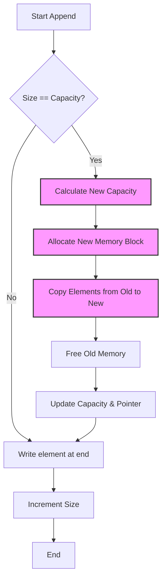

# Dynamic Arrays: Amortized Analysis and ArrayList Internals

> A dynamic array is a random-access, variable-size list data structure that abstracts away memory management by automatically resizing its underlying fixed-capacity storage, typically achieving $O(1)$ amortized time for insertions.

## 1. Historical Background & Motivation

In the early decades of computing, memory was a scarce and rigid resource. Language primitives like Fortran arrays or C arrays required the programmer to specify the size of a data structure at compile-time or upon initialization. This "static" nature presented a fundamental engineering challenge: if you underestimated the number of elements, the program crashed or suffered a buffer overflow; if you overestimated, you wasted precious memory. As software evolved from simple batch processing to complex, user-driven applications (like word processors and web browsers), the need for a structure that could grow "on the fly" became critical.

The dynamic array (often called `std::vector` in C++, `ArrayList` in Java, or simply `list` in Python) emerged as the standard solution. It was popularized by the C++ Standard Template Library (STL) in the 1990s, though the concept of geometric resizing dates back much further to early Lisp implementations and garbage-collected languages. The brilliance of the dynamic array lies in its compromise: it retains the $O(1)$ random access of static arrays (thanks to contiguous memory) while mimicking the flexibility of linked lists. In modern engineering, dynamic arrays are the default "workhorse" data structure, used in everything from high-frequency trading engines to the buffer management of database systems like PostgreSQL.

## 2. Visual Intuition
:::demo
<div style="background:#1e1e1e;padding:16px;border-radius:10px;color:#e5e7eb;font-family:system-ui,sans-serif">
  <h3 style="margin:0 0 8px 0;color:#7dd3fc">Dynamic Arrays: Amortized Analysis and ArrayList Internals - Concept Map</h3>
  <svg width="100%" height="280" viewBox="0 0 640 280" role="img" aria-label="Dynamic Arrays: Amortized Analysis and ArrayList Internals visual intuition" style="background:#111827;border-radius:8px">
    <rect x="24" y="28" width="180" height="64" rx="10" fill="#1d4ed8" />
    <text x="114" y="66" text-anchor="middle" fill="#e5e7eb" font-size="14">Problem</text>
    <rect x="230" y="28" width="180" height="64" rx="10" fill="#0f766e" />
    <text x="320" y="66" text-anchor="middle" fill="#e5e7eb" font-size="14">Process</text>
    <rect x="436" y="28" width="180" height="64" rx="10" fill="#7c3aed" />
    <text x="526" y="66" text-anchor="middle" fill="#e5e7eb" font-size="14">Outcome</text>

    <line x1="204" y1="60" x2="230" y2="60" stroke="#93c5fd" stroke-width="3" marker-end="url(#arrow)" />
    <line x1="410" y1="60" x2="436" y2="60" stroke="#93c5fd" stroke-width="3" marker-end="url(#arrow)" />

    <rect x="24" y="130" width="592" height="120" rx="10" fill="#0b1220" stroke="#334155" />
    <text x="320" y="156" text-anchor="middle" fill="#cbd5e1" font-size="14">Key intuition for Dynamic Arrays: Amortized Analysis and ArrayList Internals</text>
    <text x="320" y="182" text-anchor="middle" fill="#94a3b8" font-size="12">Track state changes, constraints, and final behavior.</text>
    <text x="320" y="206" text-anchor="middle" fill="#94a3b8" font-size="12">Use this as a mental model before formal proofs or code.</text>

    <defs>
      <marker id="arrow" markerWidth="10" markerHeight="10" refX="8" refY="3" orient="auto">
        <polygon points="0 0, 10 3, 0 6" fill="#93c5fd" />
      </marker>
    </defs>
  </svg>
  <p style="margin-top:10px;color:#cbd5e1">Interactive-ready visual scaffold for the topic.</p>
</div>
:::
*Caption: When the underlying capacity is exhausted, a new, larger block of memory is allocated. All existing elements are copied to the new block, and the old memory is deallocated. This "geometric expansion" is the key to maintaining efficiency.*

## 3. Core Theory & Mathematical Foundations

To understand dynamic arrays, we must move beyond "Average Case" analysis and into **Amortized Analysis**. While a single insertion might occasionally be very slow (due to resizing), the average cost over a long sequence of operations is constant.

### 3.1 The Geometry of Resizing
A dynamic array maintains two internal variables:
1.  **Size ($n$):** The number of elements currently stored.
2.  **Capacity ($C$):** The total number of slots available in the current memory block.

When $n = C$, the array is full. To insert the $(n+1)$-th element, the structure must:
1.  Allocate a new memory block of capacity $k \cdot C$ (where $k$ is the **growth factor**, usually 2 or 1.5).
2.  Copy all $n$ existing elements to the new block.
3.  Deallocate the old block.
4.  Insert the new element.

### 3.2 Amortized Analysis: The Aggregate Method
We want to prove that the total time for $n$ insertions is $O(n)$. Let $c_i$ be the cost of the $i$-th insertion.
If $i-1$ is not a power of 2, $c_i = 1$.
If $i-1$ is a power of 2, $c_i = (i-1) + 1$.

The total cost $T(n)$ is:
$$T(n) = \sum_{i=1}^n c_i \le n + \sum_{j=0}^{\lfloor \log_2 n \rfloor} 2^j$$

Using the geometric series formula $\sum_{j=0}^k 2^j = 2^{k+1} - 1$, we find:
$$T(n) \le n + (2 \cdot n - 1) < 3n$$
Thus, $T(n) = O(n)$, and the amortized cost per operation is $\frac{T(n)}{n} = O(1)$.

### 3.3 The Potential Method (Physicist's View)
The most rigorous way to analyze dynamic arrays is the Potential Method. We define a potential function $\Phi$ that represents "stored energy." Let $D_i$ be the state of the array after $i$ operations.
We define $\Phi(D_i) = 2n_i - C_i$, where $n_i$ is the number of elements and $C_i$ is the capacity.

**Constraints:**
1.  Immediately after a resize, $C = 2n$, so $\Phi = 2n - 2n = 0$.
2.  Just before a resize, $n = C$, so $\Phi = 2n - n = n$.

The amortized cost $\hat{c}_i$ is defined as the actual cost $c_i$ plus the change in potential:
$$\hat{c}_i = c_i + \Phi(D_i) - \Phi(D_{i-1})$$

*   **Case 1: No Resize.** Actual cost $c_i = 1$. Size increases by 1, capacity stays same.
    $$\hat{c}_i = 1 + (2(n+1) - C) - (2n - C) = 1 + 2 = 3$$
*   **Case 2: Resize.** Actual cost $c_i = n + 1$ (copying $n$ elements + 1 write).
    $$\hat{c}_i = (n+1) + (2(n+1) - 2C) - (2n - C)$$
    Since resizing only happens when $n=C$:
    $$\hat{c}_i = n + 1 + 2n + 2 - 2n - n = 3$$

In both cases, the amortized cost is a constant (3), proving $O(1)$ amortized complexity.

### 3.4 Why Growth Factor $k=2$ vs $k=1.5$?
The choice of $k$ involves a trade-off between time and space.
*   **$k=2$:** Used in Java and older C++ libraries. It allows for the simplest proof of $O(1)$ but has a memory reuse problem. In a standard memory allocator, the deallocated blocks of size $2, 4, 8 \dots$ will never sum up to a value large enough to satisfy the next request for $16, 32 \dots$, preventing the allocator from reusing the same memory region.
*   **$k=1.5$:** Used in MSVC and Facebook's `folly::fbvector`. Since $1.5 < \phi \approx 1.618$, eventually the sum of previously freed blocks can satisfy a new allocation request, leading to better cache locality and less memory fragmentation.

## 4. Algorithm / Process (Step-by-Step)

The `append(element)` operation follows these logic gates:

1.  **Check Capacity:** Compare internal `size` with `capacity`.
2.  **Boundary Condition:** If `size < capacity`, proceed to Step 6.
3.  **Allocate:** Request a new memory block of size `capacity * growth_factor`.
4.  **Migration:** Iteratively copy each element from `index 0` to `size-1` into the new block.
5.  **Clean up:** Update the internal pointer to the new block and free the old memory.
6.  **Write:** Place the new `element` at `index size`.
7.  **Increment:** Update `size = size + 1`.

## 5. Visual Diagram


*Caption: The control flow of a dynamic array insertion. Note the expensive 'Migration' path (D-E-F-G) which only triggers when capacity is exhausted.*

## 6. Implementation

### 6.1 Core Implementation
In Python, the `list` is already dynamic. To understand the internals, we use the `ctypes` library to interact with low-level raw arrays.

```python
import ctypes

class DynamicArray:
    """
    A custom implementation of a dynamic array to demonstrate 
    internal memory management and geometric resizing.
    """
    def __init__(self):
        self._n = 0                                # Actual number of elements
        self._capacity = 1                         # Default capacity
        self._A = self._make_array(self._capacity) # Low-level array

    def __len__(self):
        return self._n

    def __getitem__(self, k):
        if not 0 <= k < self._n:
            raise IndexError('Index out of bounds')
        return self._A[k]

    def append(self, obj):
        """Adds element to the end. Amortized O(1)."""
        if self._n == self._capacity:
            self._resize(2 * self._capacity) # Geometric growth
        
        self._A[self._n] = obj
        self._n += 1

    def _resize(self, c):
        """Resizes internal array to capacity c. O(n)."""
        B = self._make_array(c) # New bigger array
        for k in range(self._n):
            B[k] = self._A[k]   # Migration
        self._A = B             # Replace reference
        self._capacity = c

    def _make_array(self, c):
        """Returns new array with capacity c."""
        return (c * ctypes.py_object)()

# Sample usage and state trace
arr = DynamicArray()
for i in range(5):
    arr.append(i)
    print(f"Added {i}, Size: {len(arr)}, Capacity: {arr._capacity}")

# Output:
# Added 0, Size: 1, Capacity: 1
# Added 1, Size: 2, Capacity: 2
# Added 2, Size: 3, Capacity: 4
# Added 3, Size: 4, Capacity: 4
# Added 4, Size: 5, Capacity: 8
```

### 6.2 Optimized / Production Variant: Shrinking
Production dynamic arrays also shrink when many elements are removed to prevent memory leaks. However, we must avoid **thrashing** (constant resizing when size fluctuates around a power of 2).

```python
def pop(self):
    """Removes last element. Amortized O(1)."""
    if self._n == 0:
        raise IndexError('Pop from empty array')
    
    val = self._A[self._n - 1]
    self._A[self._n - 1] = None # Help garbage collection
    self._n -= 1

    # Shrink if size is 1/4 of capacity (Hysteresis)
    # We use 1/4 instead of 1/2 to avoid O(n) thrashing
    if 0 < self._n <= self._capacity // 4:
        self._resize(self._capacity // 2)
    return val
```

### 6.3 Common Pitfalls in Code
*   **Arithmetic Growth:** Resizing by a fixed amount (e.g., `capacity + 100`) leads to $O(n^2)$ total time for $n$ insertions. **Always use geometric growth.**
*   **Shallow Copying:** If the array contains pointers/references, ensure you understand if your `resize` is copying the pointers (standard) or the actual objects.
*   **Memory Fragmentation:** Allocating extremely large contiguous blocks can fail even if total free memory exists, as the memory must be *physically contiguous*.

## 7. Interactive Demo

:::demo
<!-- title: Dynamic Array Expansion Simulator -->
<!DOCTYPE html>
<html>
<head>
<meta charset="utf-8">
<style>
  body { margin:0; background:#0f1117; color:#e5e7eb; font-family: system-ui, sans-serif; font-size:13px; padding:16px; }
  .controls { display: flex; gap: 10px; margin-bottom: 20px; align-items: center; }
  button { background: #3b82f6; border: none; color: white; padding: 8px 16px; border-radius: 4px; cursor: pointer; font-weight: bold; }
  button:hover { background: #2563eb; }
  button:disabled { background: #374151; cursor: not-allowed; }
  .array-container { display: flex; flex-wrap: wrap; gap: 8px; border: 2px dashed #374151; padding: 15px; border-radius: 8px; min-height: 100px; }
  .cell { width: 40px; height: 40px; display: flex; align-items: center; justify-content: center; border: 1px solid #4b5563; border-radius: 4px; background: #1f2937; transition: all 0.3s ease; position: relative; }
  .cell.filled { background: #10b981; border-color: #059669; transform: scale(1.05); }
  .cell.copying { background: #f59e0b; animation: pulse 0.5s infinite; }
  .stats { margin-top: 20px; display: grid; grid-template-columns: repeat(3, 1fr); gap: 10px; }
  .stat-card { background: #1f2937; padding: 12px; border-radius: 6px; border: 1px solid #374151; }
  .stat-val { font-size: 18px; font-weight: bold; color: #3b82f6; }
  @keyframes pulse { 0% { opacity: 1; } 50% { opacity: 0.5; } 100% { opacity: 1; } }
  .log { margin-top: 15px; height: 60px; overflow-y: auto; background: #000; padding: 8px; font-family: monospace; font-size: 11px; color: #10b981; border-radius: 4px; }
</style>
</head>
<body>
  <div class="controls">
    <button id="addBtn">Append(x)</button>
    <button id="resetBtn" style="background:#6b7280">Reset</button>
    <span id="status">Ready</span>
  </div>
  
  <div class="array-container" id="arrayVisual"></div>

  <div class="stats">
    <div class="stat-card">Size: <div id="sizeVal" class="stat-val">0</div></div>
    <div class="stat-card">Capacity: <div id="capVal" class="stat-val">1</div></div>
    <div class="stat-card">Total Cost: <div id="costVal" class="stat-val">0</div></div>
  </div>

  <div class="log" id="logBox">System initialized. Capacity=1</div>

  <script>
    let size = 0;
    let capacity = 1;
    let totalCost = 0;
    let isAnimating = false;

    const arrayVisual = document.getElementById('arrayVisual');
    const logBox = document.getElementById('logBox');

    function log(msg) {
      const entry = document.createElement('div');
      entry.textContent = `> ${msg}`;
      logBox.prepend(entry);
    }

    function render() {
      arrayVisual.innerHTML = '';
      for (let i = 0; i < capacity; i++) {
        const cell = document.createElement('div');
        cell.className = 'cell' + (i < size ? ' filled' : '');
        cell.textContent = i < size ? i : '';
        arrayVisual.appendChild(cell);
      }
      document.getElementById('sizeVal').textContent = size;
      document.getElementById('capVal').textContent = capacity;
      document.getElementById('costVal').textContent = totalCost;
    }

    async function append() {
      if (isAnimating) return;
      isAnimating = true;
      document.getElementById('addBtn').disabled = true;

      if (size === capacity) {
        log(`Capacity reached (${capacity}). Resizing to ${capacity * 2}...`);
        const oldCells = document.querySelectorAll('.cell');
        oldCells.forEach(c => c.classList.add('copying'));
        
        // Simulate copy time
        await new Promise(r => setTimeout(r, 800));
        
        totalCost += size; // Cost of copying
        capacity *= 2;
        render();
      }

      size++;
      totalCost += 1; // Cost of insertion
      log(`Inserted element at index ${size-1}. Actual cost: 1`);
      render();
      
      isAnimating = false;
      document.getElementById('addBtn').disabled = false;
    }

    document.getElementById('addBtn').onclick = append;
    document.getElementById('resetBtn').onclick = () => {
      size = 0; capacity = 1; totalCost = 0;
      log("Reset system.");
      render();
    };

    render();
  </script>
</body>
</html>
:::

## 8. Worked Examples

### Example 1 — Basic Application
**Scenario:** An empty Dynamic Array with $k=2$ and initial capacity $C=1$. Perform 4 appends.

1.  **Append(A):** $n=0, C=1$. Array has space. Insert 'A'. $n=1$.
    *   State: `[A]`
    *   Cost: 1
2.  **Append(B):** $n=1, C=1$. Array is full. 
    *   Resize to $C=2$. Copy 'A' (cost 1).
    *   Insert 'B' (cost 1). $n=2$.
    *   State: `[A, B]`
    *   Total Cost: $1 + (1+1) = 3$.
3.  **Append(C):** $n=2, C=2$. Array is full.
    *   Resize to $C=4$. Copy 'A', 'B' (cost 2).
    *   Insert 'C' (cost 1). $n=3$.
    *   State: `[A, B, C, _]`
    *   Total Cost: $3 + (2+1) = 6$.
4.  **Append(D):** $n=3, C=4$. Array has space. Insert 'D'. $n=4$.
    *   State: `[A, B, C, D]`
    *   Total Cost: $6 + 1 = 7$.

**Result:** 4 operations, 7 units of work. Amortized cost: $7/4 = 1.75$ per op.

### Example 2 — The Hysteresis Trap
Consider an implementation that shrinks capacity by half as soon as $n < Capacity/2$.
1.  Array is at capacity $n=8, C=8$.
2.  **Insert:** Trigger resize to $C=16$. Cost: $8+1 = 9$.
3.  **Delete:** $n=8, C=16$.
4.  **Delete:** $n=7, C=16$. Since $n < 16/2$, resize to $C=8$. Cost: $7+1 = 8$.
5.  **Insert:** $n=8, C=8$.
6.  **Insert:** $n=9, C=8$. Trigger resize to $C=16$. Cost: $8+1 = 9$.

In this sequence, every few operations trigger an $O(n)$ cost. This is why we wait until $n \le Capacity/4$ to shrink to $Capacity/2$.

## 9. Comparison with Alternatives

| Approach | Access | Insert (End) | Insert (Middle) | Space Overhead | Best Used When |
|---|---|---|---|---|---|
| **Dynamic Array** | $O(1)$ | $O(1)^*$ | $O(n)$ | $O(n)$ (Slack) | General purpose, random access |
| **Singly Linked List** | $O(n)$ | $O(1)^\dagger$ | $O(1)$ | $O(n)$ (Pointers) | Frequent inserts at head/middle |
| **Static Array** | $O(1)$ | $O(1)$ | $O(n)$ | Minimal | Size is known at compile time |
| **B-Tree Node** | $O(\log n)$ | $O(\log n)$ | $O(\log n)$ | High | Massive data in disk/databases |

$^*$ Amortized time.
$^\dagger$ If tail pointer is maintained.

## 10. Industry Applications & Real Systems

-   **Python Interpreter (CPython):** The `PyListObject` uses a growth pattern of `0, 4, 8, 16, 24, 32, 40, 52, 64...`. It doesn't strictly double but uses a specific formula `new_allocated = (size_t)newsize + (newsize >> 3) + (newsize < 9 ? 3 : 6)` to balance speed and memory.
-   **Java Virtual Machine (JVM):** `ArrayList` defaults to $k=1.5$. This is a deliberate choice to be more memory-efficient than $k=2.0$ in environments where many small lists are created.
-   **C++ STL (GCC/libstdc++):** Uses $k=2.0$. This maximizes insertion speed at the cost of potential memory reuse issues in long-running processes.
-   **Redis:** Uses dynamic strings (SDS - Simple Dynamic Strings) which behave like dynamic arrays to manage string buffers, allowing $O(1)$ length retrieval and efficient concatenation.

## 11. Practice Problems

### 🟢 Easy
1.  **Capacity Trace**: Given an initial capacity of 2 and a growth factor of 2, what is the capacity after 10 insertions?
    *Hint: Track the powers of 2.*
    *Expected complexity: O(1) calculation.*

### 🟡 Medium
2.  **Design a Min-Stack**: Implement a stack using a dynamic array that supports `push`, `pop`, `top`, and `getMin` in $O(1)$ amortized time.
    *Hint: Use a second dynamic array to track current minimums.*
    *Expected complexity: O(1) amortized.*

3.  **Concatenate Lists**: Prove that concatenating two dynamic arrays of size $N$ and $M$ takes $O(N+M)$ time.
    *Hint: Think about the migration cost.*

### 🔴 Hard
4.  **Static to Dynamic Transformation**: You are given a library that only supports fixed-size arrays. Implement a wrapper that provides a dynamic array interface without ever using more than $O(N)$ total space.
    *Hint: You will need to manage two buffers during the migration phase.*

5.  **Geometric Shrinking**: Prove using the Potential Method that the amortized cost of `pop` is $O(1)$ if we shrink the array by half when it is $1/4$ full.

## 12. Interactive Quiz

:::quiz
**Q1: Why is a growth factor of $k=1$ (adding 1 slot at a time) inefficient?**
- A) It causes memory fragmentation.
- B) It results in $O(n)$ amortized time per insertion, making $n$ insertions $O(n^2)$.
- C) It is actually more efficient for small arrays.
- D) It violates the random access property.
> B — Because every single insertion triggers a full copy of the array, the sum of work is $1 + 2 + 3 + \dots + n$, which is $\frac{n(n+1)}{2}$.

**Q2: In the Potential Method, what must be true about the potential $\Phi$ at the start?**
- A) $\Phi(D_0)$ must be zero or positive.
- B) $\Phi(D_0)$ must be negative to account for initial costs.
- C) $\Phi(D_0)$ must be equal to the capacity.
- D) $\Phi(D_0)$ must be $O(\log n)$.
> A — For the amortized cost to bound the actual cost, the total potential change must be non-negative. Usually, we set $\Phi(D_0) = 0$.

**Q3: Which operation is typically SLOWER in a dynamic array compared to a Linked List?**
- A) Random access (indexing).
- B) Accessing the last element.
- C) Deleting the first element.
- D) Iterating through all elements.
> C — Deleting the first element in a dynamic array requires shifting all subsequent elements, taking $O(n)$. In a linked list, it's $O(1)$.

**Q4: What is "Hysteresis" in the context of dynamic arrays?**
- A) The delay between an insertion and its actual write.
- B) The property where the system state depends on its history, used here to prevent rapid resizing.
- C) The memory overhead of storing integers.
- D) The process of clearing deleted references.
> B — By creating a gap between the expansion threshold (100%) and the contraction threshold (25%), we prevent "thrashing."

**Q5: If you know exactly how many elements you will store (e.g., 1 million), what is the best optimization?**
- A) Set growth factor to 1.1.
- B) Use `pop` more frequently.
- C) Use `reserve(1000000)` or `ensureCapacity()`.
- D) Use a Linked List instead.
> C — Pre-allocating memory avoids all $O(n)$ resize/copy operations, making every insertion a true $O(1)$ operation.
:::

## 13. Interview Preparation

### Conceptual Questions
**Q: Explain Amortized Analysis as if teaching it to a fellow engineer.**
*A: Amortized analysis is a way to describe the "long-term" average cost of an operation. In a dynamic array, most appends are $O(1)$ because there's empty space. Occasionally, an append is $O(n)$ because we must resize. However, the $O(n)$ operations happen so infrequently that they "pay for themselves" using the extra time saved during the cheap $O(1)$ operations. Mathematically, we prove that $n$ appends take $O(n)$ time, so each individual append is $O(1)$ on average.*

**Q: What are the time and space complexities? Derive them.**
*A: Time: $O(1)$ amortized for `append`, $O(1)$ for indexing, $O(n)$ for arbitrary insertion/deletion. Space: $O(n)$, specifically between $n$ and $k \cdot n$ where $k$ is the growth factor. The derivation for time involves the geometric series $\sum 2^i$, which sums to $2n$, proving the total work is linear relative to $n$.*

**Q: How would you choose between a Dynamic Array and a Linked List?**
*A: Choose a Dynamic Array if you need random access ($O(1)$ indexing) or if your primary operation is appending at the end. Dynamic arrays are also much more "cache-friendly" due to memory locality. Choose a Linked List if you need $O(1)$ insertions/deletions at the beginning or middle of the list and don't care about random access.*

### Quick Reference (Cheat Sheet)
| Property | Value |
|---|---|
| Amortized Append | $O(1)$ |
| Random Access | $O(1)$ |
| Insert/Delete (Middle) | $O(n)$ |
| Growth Factor | Usually 1.5 or 2.0 |
| Cache Locality | Excellent (Contiguous) |
| Space Efficiency | $O(n)$ with some unused slack |

## 14. Key Takeaways
1.  **Geometric Resizing is Mandatory:** Constant-sized growth leads to $O(n^2)$ performance.
2.  **Contiguous Memory:** Provides $O(1)$ access via the formula `addr = start + index * size_of_type`.
3.  **Amortized vs Average:** Amortization is a guarantee over a sequence, not a probabilistic average.
4.  **Hysteresis:** Always shrink at a lower threshold than you expand to avoid performance "thrashing."
5.  **Memory Reuse:** A growth factor $< 2.0$ (like 1.5) is often better for memory allocators.
6.  **Pre-allocation:** If the final size is known, use `reserve()` to eliminate resizing overhead.

## 15. Common Misconceptions
- ❌ **"Amortized $O(1)$ means every operation is fast."** → ✅ Some operations are $O(n)$, which can be a problem for real-time systems (e.g., flight controls).
- ❌ **"Python lists are linked lists."** → ✅ Python lists are dynamic arrays. Linked lists in Python must be manually implemented or found in `collections.deque`.
- ❌ **"Resizing always doubles the size."** → ✅ This is common but not universal. CPython and Java use different factors.

## 16. Further Reading
- *Introduction to Algorithms (CLRS), Chapter 17* — Detailed proofs of Amortized Analysis.
- *The Art of Computer Programming (Knuth), Volume 1* — Fundamental array theory.
- *CPython Source Code (`Objects/listobject.c`)* — For the real-world C implementation of Python lists.
- *Facebook Folly Documentation* — For insights into `fbvector` and growth factor choices.

## 17. Related Topics
- [[complexity-analysis]] — Foundation for Big-O and Amortized math.
- [[singly-linked-list]] — The primary alternative to dynamic arrays.
- [[stack-implementation]] — Dynamic arrays are the most common underlying structure for stacks.
- [[cache-locality]] — Why contiguous arrays outperform linked lists in practice.
