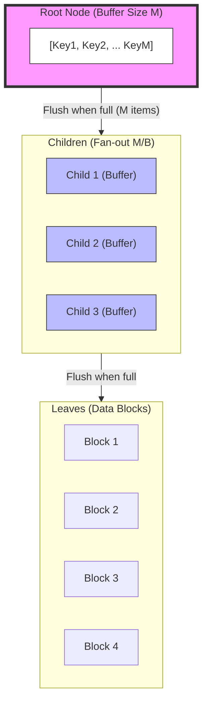

# External Memory Data Structures: Buffer Trees and Cache-Oblivious Layouts

> **External memory data structures** are specialized organizations of data designed to minimize the cost of data movement between levels of a memory hierarchy, specifically optimizing for the massive latency gap between main memory (RAM) and secondary storage (HDD/SSD).

## 1. Historical Background & Motivation

The fundamental model of computation for decades has been the Random Access Machine (RAM) model, which assumes that any memory location can be accessed in constant time $O(1)$. However, as CPU speeds decoupled from storage speeds in the late 1980s—a phenomenon known as the "Memory Wall"—this abstraction failed. Alok Aggarwal and Jeffrey Vitter proposed the **External Memory (EM) Model** (also known as the I/O Model or Disk Access Model) in 1988. They recognized that the bottleneck in large-scale data processing was not the number of instructions executed, but the number of blocks transferred between disk and memory.

This challenge birthed two distinct but related philosophies: **Cache-Aware** algorithms, which explicitly use parameters like block size $B$ and memory size $M$ (e.g., B-Trees, Buffer Trees), and **Cache-Oblivious** algorithms, introduced by Frigo, Leiserson, Prokop, and Ramachandran in 1999. Cache-oblivious structures are designed to perform optimally across *all* levels of a memory hierarchy without knowing the specific parameters of the cache. In modern engineering, these concepts are the bedrock of database engines like PostgreSQL, storage engines like RocksDB, and Big Data frameworks like Apache Spark, where data sets far exceed the capacity of physical RAM.

## 2. Visual Intuition
:::demo
<div style="background:#1e1e1e;padding:16px;border-radius:10px;color:#e5e7eb;font-family:system-ui,sans-serif">
  <h3 style="margin:0 0 8px 0;color:#7dd3fc">External Memory Data Structures: Buffer Trees and Cache-Oblivious Layouts - Concept Map</h3>
  <svg width="100%" height="280" viewBox="0 0 640 280" role="img" aria-label="External Memory Data Structures: Buffer Trees and Cache-Oblivious Layouts visual intuition" style="background:#111827;border-radius:8px">
    <rect x="24" y="28" width="180" height="64" rx="10" fill="#1d4ed8" />
    <text x="114" y="66" text-anchor="middle" fill="#e5e7eb" font-size="14">Problem</text>
    <rect x="230" y="28" width="180" height="64" rx="10" fill="#0f766e" />
    <text x="320" y="66" text-anchor="middle" fill="#e5e7eb" font-size="14">Process</text>
    <rect x="436" y="28" width="180" height="64" rx="10" fill="#7c3aed" />
    <text x="526" y="66" text-anchor="middle" fill="#e5e7eb" font-size="14">Outcome</text>

    <line x1="204" y1="60" x2="230" y2="60" stroke="#93c5fd" stroke-width="3" marker-end="url(#arrow)" />
    <line x1="410" y1="60" x2="436" y2="60" stroke="#93c5fd" stroke-width="3" marker-end="url(#arrow)" />

    <rect x="24" y="130" width="592" height="120" rx="10" fill="#0b1220" stroke="#334155" />
    <text x="320" y="156" text-anchor="middle" fill="#cbd5e1" font-size="14">Key intuition for External Memory Data Structures: Buffer Trees and Cache-Oblivious Layouts</text>
    <text x="320" y="182" text-anchor="middle" fill="#94a3b8" font-size="12">Track state changes, constraints, and final behavior.</text>
    <text x="320" y="206" text-anchor="middle" fill="#94a3b8" font-size="12">Use this as a mental model before formal proofs or code.</text>

    <defs>
      <marker id="arrow" markerWidth="10" markerHeight="10" refX="8" refY="3" orient="auto">
        <polygon points="0 0, 10 3, 0 6" fill="#93c5fd" />
      </marker>
    </defs>
  </svg>
  <p style="margin-top:10px;color:#cbd5e1">Interactive-ready visual scaffold for the topic.</p>
</div>
:::
*Caption: A standard B-Tree requires an I/O for every insertion. In contrast, a Buffer Tree accumulates many insertions in an internal buffer, flushing them to the next level in a single, large-block I/O operation, effectively amortizing the cost.*

## 3. Core Theory & Mathematical Foundations

To analyze external memory structures, we use the **Disk Access Model (DAM)**. We define:
- $N$: Number of elements in the problem.
- $M$: Number of elements that fit in internal memory (RAM).
- $B$: Number of elements per disk block.

The complexity of an algorithm is measured by the number of I/Os (block transfers) performed.

### 3.1 The I/O Lower Bound for Sorting
A pivotal result in EM theory is that sorting $N$ elements requires:
$$O\left( \frac{N}{B} \log_{M/B} \frac{N}{B} \right) \text{ I/Os}$$
This is the external memory equivalent of $O(N \log N)$. Any data structure that supports searching, such as a B-Tree, performs $O(\log_B N)$ I/Os per query. While $O(\log_B N)$ is optimal for point queries, it is sub-optimal for bulk updates if we compare it to the sorting bound.

### 3.2 The Buffer Tree Philosophy
The **Buffer Tree**, introduced by Lars Arge, is designed to bridge the gap between the search bound and the sorting bound. A standard B-Tree with fan-out $a$ requires $O(\log_a N)$ I/Os per insertion. If $a=B$, this is $O(\log_B N)$. 

The Buffer Tree increases the degree of the tree to $M/B$ and attaches a **buffer** of size $M$ to each node. When an operation (insert/delete) is performed, it is not immediately pushed to the leaves. Instead, it is appended to the root's buffer. Only when the buffer overflows ($>M$ elements) is it "flushed" to the children. Because we flush $M$ elements at once, and the child's block size is $B$, we effectively process many elements per I/O.

### 3.3 Cache-Oblivious Layouts (The vEB Layout)
While Buffer Trees are cache-aware (they need to know $M$ and $B$), **Cache-Oblivious** structures work without these parameters. The most famous is the **Van Emde Boas (vEB) Layout** for binary trees.

A vEB layout recursively divides a tree of height $h$ into a top recursive structure of height $h/2$ and several bottom recursive structures of height $h/2$.
Mathematically, if a tree has $N$ nodes, we lay out the top $\sqrt{N}$ nodes in memory, followed by the $\sqrt{N}$ subtrees (each of size $\sqrt{N}$) contiguously. This ensures that for *any* block size $B$, there exists a level of recursion where the subtree fits within a single block, minimizing cache misses.

### 3.4 Formal Analysis of Buffer Tree I/O
The amortized cost of an insertion in a Buffer Tree is derived by observing that each element is part of a flush at each level of the tree.
1. The height of the tree with fan-out $M/B$ is $O(\log_{M/B} (N/B))$.
2. During a flush, we spend $O(M/B)$ I/Os to distribute $M$ elements to $M/B$ children.
3. Cost per element per level: $\frac{M/B}{M} = \frac{1}{B}$.
4. Total amortized cost: $O\left( \frac{1}{B} \log_{M/B} \frac{N}{B} \right)$.

This matches the sorting bound. This means we can perform $N$ insertions into a Buffer Tree and then perform an empty-buffer traversal to extract sorted elements in the same time as External Merge Sort.

## 4. Algorithm / Process (Step-by-Step)

### Buffer Tree Insertion Process
1.  **Append to Root:** Place the update record (key, value, timestamp, type) into the root node's buffer.
2.  **Check Buffer Limit:** If `root.buffer.size < M`, return.
3.  **Buffer Flush:** If the buffer exceeds $M$ elements:
    -   Sort the elements in the buffer by key.
    -   Partition the sorted elements based on the split-keys of the children.
    -   For each child, "flush" the corresponding partition into that child's buffer.
4.  **Recursive Overflow:** If a child's buffer now exceeds $M$, recursively trigger the flush for that child.
5.  **Leaf Interaction:** When elements reach a leaf, perform the actual insertion/deletion into the leaf data structure.
6.  **Node Splitting:** If a leaf or internal node exceeds its capacity (number of children/keys), perform a standard B-Tree split. Note that in a Buffer Tree, splits are rare because the buffer absorbs the frequency of updates.

## 5. Visual Diagram


*Caption: The flow of data in a Buffer Tree. Data is "pushed" down in batches rather than individual steps, minimizing the I/O cost per element.*

## 6. Implementation

### 6.1 Core Implementation (Simulated External Memory)
This Python implementation simulates the buffer and the concept of "flushing" to child nodes. We use a high fan-out to represent the $M/B$ ratio.

```python
import math

class BufferTreeNode:
    """
    A node in a Buffer Tree.
    Each node has a buffer and pointers to children.
    """
    def __init__(self, is_leaf=True, M=4, fanout=2):
        self.is_leaf = is_leaf
        self.buffer = []  # Elements waiting to be pushed down
        self.children = [] # Child nodes
        self.keys = []     # Split keys for routing
        self.M = M         # Buffer capacity
        self.fanout = fanout # Max children

    def insert(self, element):
        """
        Inserts an element into the node's buffer.
        Amortized Complexity: O(1/B * log_{M/B}(N/B)) I/Os
        """
        self.buffer.append(element)
        print(f"Added {element} to buffer. Current buffer: {self.buffer}")
        
        if len(self.buffer) >= self.M:
            self.flush()

    def flush(self):
        """
        Flushes the buffer to children or processes if leaf.
        In a real system, this involves sequential disk writes.
        """
        if self.is_leaf:
            # Sort and finalize data in the leaf
            self.buffer.sort()
            print(f"Leaf processing: {self.buffer}")
            # If buffer was very large, we would split here.
            # For simplicity, we just keep it as a sorted list.
            return

        print(f"Flushing buffer {self.buffer} to children...")
        self.buffer.sort()
        
        # Distribute elements to children based on split keys
        for element in self.buffer:
            child_idx = self._find_child_idx(element)
            self.children[child_idx].insert(element)
            
        self.buffer = [] # Clear buffer after flushing

    def _find_child_idx(self, element):
        # Binary search for the correct child based on keys
        for i, key in enumerate(self.keys):
            if element < key:
                return i
        return len(self.keys)

class BufferTree:
    def __init__(self, M=4, fanout=2):
        self.root = BufferTreeNode(is_leaf=True, M=M, fanout=fanout)
        self.M = M
        self.fanout = fanout

    def bulk_insert(self, elements):
        for el in elements:
            self.root.insert(el)

# Example Usage
if __name__ == "__main__":
    # Create a tree where buffer capacity M=4 and fan-out=2
    # In reality, M would be thousands.
    bt = BufferTree(M=4, fanout=2)
    
    # Manually setting split keys for the root to create an internal node structure
    bt.root.is_leaf = False
    bt.root.keys = [50] # Elements < 50 go to child 0, >= 50 go to child 1
    bt.root.children = [BufferTreeNode(M=4), BufferTreeNode(M=4)]
    
    data = [10, 60, 20, 70, 30, 80, 40, 90]
    bt.bulk_insert(data)
    
    # Expected Output:
    # 1. Elements 10, 60, 20, 70 fill the buffer.
    # 2. On 70, flush triggers. 10, 20 go to child 0. 60, 70 go to child 1.
    # 3. Buffer clears. 30, 80, 40, 90 fill the buffer.
    # 4. On 90, flush triggers. 30, 40 go to child 0. 80, 90 go to child 1.
```

### 6.2 Optimized Production Variant (vEB Layout Logic)
Production systems often use the Van Emde Boas layout for static or semi-static search trees to ensure cache-obliviousness.

```python
def veb_layout(height, start_index=0):
    """
    Generates a vEB layout order for a binary tree of given height.
    This is used to map tree nodes to linear array indices.
    """
    if height == 1:
        return [start_index]
    
    # Recursive step: Divide height into h_top and h_bottom
    h_top = height // 2
    h_bottom = height - h_top
    
    layout = []
    # 1. Layout the top recursive structure
    layout.extend(veb_layout(h_top, start_index))
    
    # 2. Layout each of the bottom recursive structures
    num_subtrees = 2**h_top
    nodes_in_bottom = 2**h_bottom - 1
    
    current_idx = start_index + (2**h_top - 1)
    for i in range(num_subtrees):
        layout.extend(veb_layout(h_bottom, current_idx + 1))
        current_idx += nodes_in_bottom
        
    return layout

# print(veb_layout(3))
# A height-3 binary tree (7 nodes) laid out in vEB order.
```

### 6.3 Common Pitfalls in Code
1.  **Ignoring Serialization Costs:** In Python, the "buffer" is an object list. In a real system (C++/Rust), the buffer must be a contiguous memory segment or a series of disk blocks.
2.  **Incorrect Split Keys:** During a flush, if keys are not sorted, you end up doing random seeks. Always sort the buffer before flushing.
3.  **Recursion Depth:** Buffer Trees can become very deep if $M$ is small. In production, $M$ is tuned to the hardware's L3 cache or RAM page size.
4.  **Read Latency:** Buffer Trees optimize for *writes*. A *read* (query) might need to check every buffer on the path from root to leaf, which is $O(\log_{M/B} N)$. If the buffer is large, this is slow. Solution: Use Bloom filters on buffers.

## 7. Interactive Demo

:::demo
<!-- title: Buffer Tree Flush Visualization -->
<!DOCTYPE html>
<html>
<head>
<meta charset="utf-8">
<style>
  body { margin:0; background:#0f1117; color:#e5e7eb; font-family: system-ui, sans-serif; font-size:13px; padding:16px; }
  .node { border: 2px solid #4f46e5; border-radius: 8px; padding: 10px; margin: 10px; min-width: 200px; display: inline-block; vertical-align: top; }
  .buffer-slot { display: inline-block; width: 30px; height: 30px; border: 1px solid #374151; margin: 2px; text-align: center; line-height: 30px; background: #1f2937; transition: all 0.3s; }
  .buffer-slot.filled { background: #4f46e5; color: white; border-color: #818cf8; transform: scale(1.1); }
  .controls { margin-bottom: 20px; display: flex; gap: 10px; align-items: center; }
  button { background: #4f46e5; color: white; border: none; padding: 8px 16px; border-radius: 4px; cursor: pointer; }
  button:hover { background: #4338ca; }
  .status { font-weight: bold; color: #10b981; }
</style>
</head>
<body>
  <div class="controls">
    <button onclick="addNumber()">Insert Random Number</button>
    <button onclick="resetTree()">Reset</button>
    <div id="status-text" class="status">Waiting for input...</div>
  </div>
  <div id="tree-container"></div>

<script>
  let M = 4;
  let rootBuffer = [];
  let children = [[], []]; // Two children
  const statusEl = document.getElementById('status-text');

  function render() {
    const container = document.getElementById('tree-container');
    container.innerHTML = `
      <div class="node">
        <div><strong>Root Node (Buffer Cap: ${M})</strong></div>
        <div id="root-slots"></div>
      </div>
      <br>
      <div style="display: flex; justify-content: space-around; width: 100%;">
        <div class="node">
          <div><strong>Child 1 (Keys < 50)</strong></div>
          <div id="c1-slots"></div>
        </div>
        <div class="node">
          <div><strong>Child 2 (Keys >= 50)</strong></div>
          <div id="c2-slots"></div>
        </div>
      </div>
    `;

    const rSlots = document.getElementById('root-slots');
    for(let i=0; i<M; i++) {
      const val = rootBuffer[i];
      rSlots.innerHTML += `<div class="buffer-slot ${val !== undefined ? 'filled' : ''}">${val !== undefined ? val : ''}</div>`;
    }

    const c1Slots = document.getElementById('c1-slots');
    children[0].forEach(val => {
      c1Slots.innerHTML += `<div class="buffer-slot filled">${val}</div>`;
    });

    const c2Slots = document.getElementById('c2-slots');
    children[1].forEach(val => {
      c2Slots.innerHTML += `<div class="buffer-slot filled">${val}</div>`;
    });
  }

  function addNumber() {
    if (rootBuffer.length < M) {
      const num = Math.floor(Math.random() * 100);
      rootBuffer.push(num);
      statusEl.innerText = `Inserted ${num}`;
      render();
      
      if (rootBuffer.length === M) {
        statusEl.innerText = "Buffer Full! Flushing in 1s...";
        setTimeout(flush, 1000);
      }
    }
  }

  function flush() {
    statusEl.innerText = "Flushing elements to children...";
    rootBuffer.forEach(num => {
      if (num < 50) children[0].push(num);
      else children[1].push(num);
    });
    rootBuffer = [];
    render();
    statusEl.innerText = "Flush complete.";
  }

  function resetTree() {
    rootBuffer = [];
    children = [[], []];
    statusEl.innerText = "Reset done.";
    render();
  }

  render();
</script>
</body>
</html>
:::

## 8. Worked Examples

### Example 1 — Buffer Tree Trace
**Scenario:** A Buffer Tree with $M=3$ (Buffer Capacity) and one split key $50$ at the root.
**Operations:** Insert $10, 80, 25, 60$.

1.  **Insert 10:** Root Buffer = `[10]`. I/O = 0 (cached in RAM).
2.  **Insert 80:** Root Buffer = `[10, 80]`.
3.  **Insert 25:** Root Buffer = `[10, 80, 25]`. Buffer is full ($M=3$).
4.  **Insert 60:**
    -   Buffer is already full, so trigger **Flush**.
    -   Sort buffer: `[10, 25, 80]`.
    -   Compare with split key $50$:
        -   `10, 25` go to Left Child.
        -   `80` goes to Right Child.
    -   Root Buffer is now empty.
    -   Insert $60$ into Root Buffer: `[60]`.
**State:** Root `[60]`, Left Child `[10, 25]`, Right Child `[80]`.

### Example 2 — Cache-Oblivious vEB Layout
**Scenario:** Laying out a binary tree of 7 nodes ($N=7, H=3$) in memory to be cache-oblivious.
1.  **Split Tree:** $H_{top} = \lfloor 3/2 \rfloor = 1$, $H_{bottom} = 2$.
2.  **Layout Top:** The root node (Index 0).
3.  **Layout Bottom Subtrees:**
    -   The left subtree (3 nodes) is laid out recursively using vEB.
    -   The right subtree (3 nodes) is laid out recursively using vEB.
**Linear Result:** `[Root, L-Child-Root, L-Child-Left, L-Child-Right, R-Child-Root, R-Child-Left, R-Child-Right]`.
Note how the root's children are not necessarily adjacent to it, but subtrees are grouped, which is the key to minimizing I/Os regardless of the block size $B$.

## 9. Comparison with Alternatives

| Data Structure | Point Query I/O | Insertion I/O (Amortized) | Cache-Aware? | Best Used For |
| :--- | :--- | :--- | :--- | :--- |
| **B-Tree** | $O(\log_B N)$ | $O(\log_B N)$ | Yes | General Purpose Databases |
| **Buffer Tree** | $O(\log_{M/B} \frac{N}{B})$ | $O(\frac{1}{B} \log_{M/B} \frac{N}{B})$ | Yes | Write-heavy batch workloads |
| **vEB Tree** | $O(\log_B N)$ | $O(\log_B N)$ | **No** | Hierarchical cache optimization |
| **LSM-Tree** | $O(\text{varies})$ | $O(\frac{1}{B} \log_{M/B} \frac{N}{B})$ | Yes | NoSQL, High-throughput ingestion |

## 10. Industry Applications & Real Systems

-   **RocksDB / LevelDB**: These storage engines use Log-Structured Merge (LSM) Trees, which are conceptually descendents of the Buffer Tree. They buffer writes in a "MemTable" and flush them to disk as "SSTables," maintaining a multi-level structure that mimics the buffer tree's batch-processing of I/Os.
-   **PostgreSQL (GiST Indexes)**: PostgreSQL implemented a "buffering build" for Generalized Search Trees (GiST). Instead of inserting items one by one (which is slow for R-Trees), they use a buffer at each internal node to reduce random I/O during index creation.
-   **High-Frequency Trading (HFT)**: vEB layouts are used in HFT order books. Since the CPU's L1, L2, and L3 cache sizes vary between Intel and AMD processors, a cache-oblivious layout ensures the order book remains fast without needing custom-compiled code for every specific CPU model.
-   **Scientific Computing (Matrix Multiplication)**: Cache-oblivious algorithms are standard in BLAS (Basic Linear Algebra Subprograms) libraries. By using recursive Z-order curves or vEB-style layouts for matrices, they achieve peak performance on everything from a laptop to a supercomputer node.

## 11. Practice Problems

### 🟢 Easy
1. **The Scanning Lemma**: Prove that scanning $N$ elements stored contiguously on disk takes exactly $\lceil N/B \rceil$ I/Os.
   *Hint: Consider the alignment of the first element in the first block.*
   *Expected complexity: O(N/B)*

### 🟡 Medium
2. **Buffer Tree Depth**: Given $N=10^9$, $B=10^3$, and $M=10^6$, calculate the maximum number of levels in a Buffer Tree. Compare this to a standard B-Tree with $B=10^3$.
   *Hint: The fan-out of a Buffer Tree is $M/B$.*

3. **Range Queries**: Explain why a Buffer Tree is significantly worse than a B-Tree for a small range query (e.g., fetching 10 consecutive keys).
   *Hint: Consider where the most recent updates might be located.*

### 🔴 Hard
4. **Cache-Oblivious Matrix Transpose**: Design an algorithm to transpose an $N \times N$ matrix using $O(N^2/B)$ I/Os without knowing $B$ or $M$.
   *Hint: Use a divide-and-conquer approach, splitting the matrix into four quadrants.*
   *Expected complexity: O(N^2/B)*

5. **External Memory Sorting Proof**: Derive the $O(\frac{N}{B} \log_{M/B} \frac{N}{B})$ bound for a multi-way merge sort where you can merge $M/B$ runs at a time.

## 12. Interactive Quiz

:::quiz
**Q1: Why is the amortized insertion cost of a Buffer Tree $O(\frac{1}{B} \log_{M/B} \frac{N}{B})$ instead of $O(\log_B N)$?**
- A) Because it uses faster RAM.
- B) Because $M$ elements are moved per I/O during a flush, spreading the I/O cost over $M$ operations.
- C) Because it avoids the use of pointers.
- D) Because it only works on SSDs.
> B — The core advantage is batching. By waiting until we have $M$ elements, we can perform a massive sequential write, which is far more efficient than many random writes.

**Q2: What is the primary advantage of a Cache-Oblivious layout over a Cache-Aware one?**
- A) It is always faster.
- B) It uses less memory.
- C) It performs optimally on all levels of the memory hierarchy (L1, L2, L3, RAM, Disk) simultaneously.
- D) It is easier to implement.
> C — Cache-oblivious structures don't need to be tuned for a specific $B$ or $M$, meaning they adapt to different hardware architectures automatically.

**Q3: In the vEB layout of a tree, where are the subtrees located?**
- A) Scattered randomly.
- B) Contiguously in memory after the top recursive structure.
- C) In a separate file.
- D) In the CPU registers.
> B — Contiguity is the key to ensuring that once a subtree fits in a block, all its nodes can be fetched in a single I/O.

**Q4: Which system is most likely to use a Buffer Tree-like strategy?**
- A) A real-time sensor reading system with 1 write per hour.
- B) A read-heavy Wikipedia mirror.
- C) A high-volume logging service (e.g., Uber's trip history).
- D) A simple mobile app contact list.
> C — High-volume writes benefit most from the batching and amortization of Buffer Trees/LSM-Trees.

**Q5: What happens to a search query in a Buffer Tree if the key is in an internal node's buffer?**
- A) The search fails.
- B) The search must check every buffer on the path to the leaf to find the most recent version.
- C) The buffer is immediately flushed to disk.
- D) The search only checks the leaf.
> B — This is the "read penalty" of buffered structures. To ensure correctness, you must check all buffers for pending updates.
:::

## 13. Interview Preparation

### Conceptual Questions
**Q: Explain the difference between Cache-Aware and Cache-Oblivious algorithms.**
*A: Cache-aware algorithms (like B-Trees) are parameterized by the block size $B$ and memory size $M$. They are tuned for a specific hardware layer. Cache-oblivious algorithms achieve the same asymptotic I/O efficiency without knowing $B$ or $M$, making them "universal" across the L1/L2/L3/RAM/Disk hierarchy.*

**Q: Why do we use $M/B$ as the fan-out in external memory sorting?**
*A: In the DAM model, we have $M$ memory. To merge "runs" (sorted sequences), we need 1 block of memory for each input run and 1 block for the output. Thus, we can merge at most $(M/B) - 1$ runs simultaneously. This maximizing of the fan-out minimizes the depth of the recursion tree to $\log_{M/B} (N/B)$.*

**Q: How does a Buffer Tree handle deletions?**
*A: Deletions are handled as "tombstones." Instead of searching for the element and deleting it (which requires a random I/O), we insert a "Delete(Key)" record into the buffer. When this tombstone meets the actual "Insert(Key)" record during a flush or at the leaf, they cancel each other out.*

### Quick Reference (Cheat Sheet)
| Property | Buffer Tree | vEB Tree (Cache-Oblivious) |
|---|---|---|
| **Insertion (Amortized)** | $O(\frac{1}{B} \log_{M/B} \frac{N}{B})$ | $O(\log_B N)$ |
| **Search (Point)** | $O(\log_{M/B} \frac{N}{B})$ | $O(\log_B N)$ |
| **Implementation** | Complex (Buffer management) | Complex (Recursive indexing) |
| **Main Advantage** | High-throughput writes | Multi-level cache efficiency |

## 14. Key Takeaways
1.  **I/O is the Bottleneck:** For large datasets, the number of block transfers matters more than the number of instructions.
2.  **Batching Amortizes Cost:** Buffer Trees turn $N$ random writes into $O(N/B)$ sequential writes.
3.  **The Fan-out Rule:** In external memory, we want a fan-out of $M/B$, not 2.
4.  **Recursion is Powerful:** vEB layouts use recursive decomposition to achieve optimality across all cache levels.
5.  **Write vs. Read Trade-off:** Buffered structures (Buffer Trees, LSM-Trees) are excellent for writes but require extra logic (like Bloom filters) to keep reads fast.
6.  **Real-world Relevance:** You are likely already using these via RocksDB, Cassandra, or modern filesystem optimizations.

## 15. Common Misconceptions
- ❌ **"External memory algorithms are only for HDDs."** → ✅ **SSD and NVMe also have block-based access. While seek time is lower, the throughput of sequential access is still significantly higher than random access.**
- ❌ **"Cache-oblivious means the algorithm doesn't use the cache."** → ✅ **It means the algorithm is *unaware* of the cache parameters but uses it *optimally* nonetheless.**
- ❌ **"Buffer Trees are always faster than B-Trees."** → ✅ **Only for writes. For single-key lookups, a B-Tree is generally faster because it has no buffers to search.**

## 16. Further Reading
- *Introduction to Algorithms (CLRS), Chapter 18* — Detailed coverage of B-Trees.
- *Lars Arge, "The Buffer Tree: A New Technique for Optimal I/O-Algorithms"* — The original 1995 paper.
- *Erik Demaine, "Cache-Oblivious Algorithms and Data Structures"* — Excellent lecture notes from MIT.
- *Modern B-Tree Techniques by Goetz Graefe* — A deep dive into how industrial databases implement these concepts.

## 17. Related Topics
- [[complexity-analysis]] — Foundations of $O$ notation.
- [[databases]] — Where these structures live in the wild.
- [[lsm-trees]] — The industry-standard implementation of buffered writes.
- [[b-trees]] — The starting point for understanding external memory.
