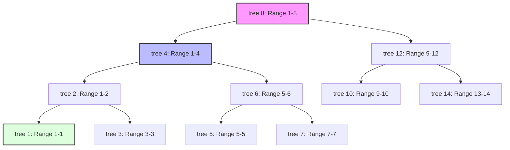

# Fenwick Tree (Binary Indexed Tree): Point Updates and Prefix Queries

> A Fenwick Tree, or Binary Indexed Tree (BIT), is a data structure that provides efficient methods for calculating prefix sums of an array of values while allowing the values to be updated in logarithmic time.

## 1. Historical Background & Motivation

The Fenwick Tree was proposed by Peter Fenwick in his 1994 paper, *"A New Data Structure for Cumulative Frequency Tables."* Historically, it emerged from the need to solve problems in data compression, specifically in the context of arithmetic coding. In arithmetic coding, one needs to maintain a cumulative frequency table of symbols that is updated as symbols are processed. Before Fenwick's innovation, engineers were forced to choose between a standard array (which allowed $O(1)$ updates but required $O(N)$ for prefix sums) or a pre-calculated prefix sum array (which allowed $O(1)$ queries but required $O(N)$ for updates).

The motivation for the BIT was to strike a balance. While the Segment Tree already existed and provided $O(\log N)$ for both operations, it was often considered "overkill" for simple prefix sum operations due to its high constant factors and $4N$ memory overhead. Fenwick’s contribution was a structure that achieved the same $O(\log N)$ complexity as Segment Trees but with significantly lower memory consumption (exactly $N$ or $N+1$ extra space) and a much simpler implementation based entirely on bitwise arithmetic. In modern computing, this efficiency makes it the go-to choice for high-frequency trading systems, real-time analytics, and competitive programming where execution speed and cache locality are paramount.

## 2. Visual Intuition
:::demo
<div style="background:#1e1e1e;padding:16px;border-radius:10px;color:#e5e7eb;font-family:system-ui,sans-serif">
  <h3 style="margin:0 0 8px 0;color:#7dd3fc">Fenwick Tree (Binary Indexed Tree): Point Updates and Prefix Queries - Concept Map</h3>
  <svg width="100%" height="280" viewBox="0 0 640 280" role="img" aria-label="Fenwick Tree (Binary Indexed Tree): Point Updates and Prefix Queries visual intuition" style="background:#111827;border-radius:8px">
    <rect x="24" y="28" width="180" height="64" rx="10" fill="#1d4ed8" />
    <text x="114" y="66" text-anchor="middle" fill="#e5e7eb" font-size="14">Problem</text>
    <rect x="230" y="28" width="180" height="64" rx="10" fill="#0f766e" />
    <text x="320" y="66" text-anchor="middle" fill="#e5e7eb" font-size="14">Process</text>
    <rect x="436" y="28" width="180" height="64" rx="10" fill="#7c3aed" />
    <text x="526" y="66" text-anchor="middle" fill="#e5e7eb" font-size="14">Outcome</text>

    <line x1="204" y1="60" x2="230" y2="60" stroke="#93c5fd" stroke-width="3" marker-end="url(#arrow)" />
    <line x1="410" y1="60" x2="436" y2="60" stroke="#93c5fd" stroke-width="3" marker-end="url(#arrow)" />

    <rect x="24" y="130" width="592" height="120" rx="10" fill="#0b1220" stroke="#334155" />
    <text x="320" y="156" text-anchor="middle" fill="#cbd5e1" font-size="14">Key intuition for Fenwick Tree (Binary Indexed Tree): Point Updates and Prefix Queries</text>
    <text x="320" y="182" text-anchor="middle" fill="#94a3b8" font-size="12">Track state changes, constraints, and final behavior.</text>
    <text x="320" y="206" text-anchor="middle" fill="#94a3b8" font-size="12">Use this as a mental model before formal proofs or code.</text>

    <defs>
      <marker id="arrow" markerWidth="10" markerHeight="10" refX="8" refY="3" orient="auto">
        <polygon points="0 0, 10 3, 0 6" fill="#93c5fd" />
      </marker>
    </defs>
  </svg>
  <p style="margin-top:10px;color:#cbd5e1">Interactive-ready visual scaffold for the topic.</p>
</div>
:::
*Caption: The animation illustrates how a point update at an index propagates through the Fenwick Tree, affecting only a logarithmic number of nodes that "cover" that index. Each node stores a range sum where the range length is a power of 2.*

## 3. Core Theory & Mathematical Foundations

To understand the Fenwick Tree, one must first master the decomposition of integers into sums of powers of two. Unlike a standard array where each index $i$ stores the value $A[i]$, a Fenwick Tree array (let's call it `tree`) stores the sum of values in a specific range $[i - LSB(i) + 1, i]$, where $LSB(i)$ is the **Least Significant Bit** of $i$ that is set to 1.

### 3.1 The Binary Decomposition Principle
Every positive integer $i$ can be uniquely represented as a sum of powers of two. For example, $13 = 8 + 4 + 1$. In the Fenwick Tree, the prefix sum up to index $i$ is calculated by breaking the range $[1, i]$ into sub-intervals whose lengths are powers of two. These lengths correspond exactly to the set bits in the binary representation of $i$.

Consider $i = 13$ ($1101_2$). The prefix sum $S_{13}$ is decomposed as:
$$S_{13} = \text{tree}[1101_2] + \text{tree}[1100_2] + \text{tree}[1000_2]$$
Notice that at each step, we remove the least significant set bit:
1. $1101_2 \to 13$
2. $1101_2 - (1101_2 \ \& \ -1101_2) = 1100_2 \to 12$
3. $1100_2 - (1100_2 \ \& \ -1100_2) = 1000_2 \to 8$

### 3.2 The Bitwise Magic: $i \ \& \ (-i)$
The core of the Fenwick Tree implementation relies on a specific bitwise trick to isolate the LSB. In Two's Complement notation, $-i$ is represented as $(\sim i + 1)$. 
For $i = 12$ ($00001100_2$):
- $\sim i = 11110011_2$
- $-i = 11110100_2$
- $i \ \& \ (-i) = 00000100_2$ (which is $4$, the $LSB$ of $12$)

This mathematical identity allows us to navigate the tree structure without explicitly storing pointers, as the "parent" or "next" nodes are determined purely by bit manipulation.

### 3.3 Tree Structure and Responsibility
Each index $i$ in the BIT is "responsible" for a range of elements in the original array.
- If $LSB(i) = 2^k$, then `tree[i]` stores the sum of the original elements from index $i - 2^k + 1$ to $i$.
- Indices that are powers of two ($1, 2, 4, 8, \dots$) store the prefix sums from $1$ to themselves.
- Odd indices $i$ always have $LSB(i) = 1$, meaning `tree[i]` stores only the value at $A[i]$.

### 3.4 Formal Analysis (Complexity / Correctness)
**Time Complexity:**
- **Query (Prefix Sum):** To find the sum up to index $i$, we traverse the tree by repeatedly subtracting $LSB(i)$. Since $i$ has at most $\lceil \log_2 N \rceil$ bits, the complexity is $O(\log N)$.
- **Update (Point Addition):** To update index $i$, we must update all nodes in the BIT that contain $i$ in their range. This is achieved by repeatedly adding $LSB(i)$ until we exceed the array size $N$. This also traverses at most $\lceil \log_2 N \rceil$ nodes, yielding $O(\log N)$.

**Space Complexity:**
- The structure requires $O(N)$ space to store the `tree` array. No additional pointers or metadata are required, unlike Segment Trees which typically require $4N$ nodes.

**Correctness Sketch:**
The correctness follows from the fact that the set of intervals defined by the BIT forms a disjoint partition of any prefix $[1, i]$. For any $j \leq i$, the element $A[j]$ is contained in exactly one interval used in the query for the prefix sum $S_k$ if and only if $j \leq k$. The update operation correctly propagates changes to all "covering" intervals because adding $LSB(i)$ effectively moves the index to the next value in the binary hierarchy that encompasses the current range.

## 4. Algorithm / Process (Step-by-Step)

### Prefix Sum Query (up to index $i$)
1. Initialize `sum = 0`.
2. While `i > 0`:
   a. Add `tree[i]` to `sum`.
   b. Decrement `i` by `i & -i`.
3. Return `sum`.

### Point Update (add $X$ to index $i$)
1. While `i <= N`:
   a. Add `X` to `tree[i]`.
   b. Increment `i` by `i & -i`.

### Range Sum Query (sum from $L$ to $R$)
1. Use the prefix sum logic: `Sum(R) - Sum(L-1)`.

## 5. Visual Diagram


*Caption: Logical hierarchy of a Fenwick Tree with 16 elements. Note that the physical implementation is just a flat array, but the dependencies follow this bit-based tree structure.*

## 6. Implementation

### 6.1 Core Implementation
The following implementation uses 1-based indexing internally, which is standard for Fenwick Trees to avoid infinite loops at index 0.

```python
class FenwickTree:
    """
    A standard Fenwick Tree (Binary Indexed Tree) for point updates 
    and prefix sum queries.
    """
    def __init__(self, size: int):
        # Initialize with size+1 to accommodate 1-based indexing
        self.size = size
        self.tree = [0] * (size + 1)

    def update(self, i: int, delta: int) -> None:
        """
        Adds delta to the element at index i (1-based).
        Complexity: O(log N)
        """
        if i <= 0:
            raise ValueError("Index must be 1-based and positive.")
        
        while i <= self.size:
            self.tree[i] += delta
            # The bitwise magic: add the least significant bit
            i += i & (-i)

    def query(self, i: int) -> int:
        """
        Returns the prefix sum from index 1 to i (inclusive).
        Complexity: O(log N)
        """
        s = 0
        while i > 0:
            s += self.tree[i]
            # The bitwise magic: subtract the least significant bit
            i -= i & (-i)
        return s

    def range_query(self, left: int, right: int) -> int:
        """
        Returns the sum of elements in the range [left, right] (inclusive).
        Complexity: O(log N)
        """
        return self.query(right) - self.query(left - 1)

# Sample Usage:
# arr = [1, 7, 3, 0, 5, 8, 3, 2, 6, 2]
# ft = FenwickTree(len(arr))
# for idx, val in enumerate(arr):
#     ft.update(idx + 1, val)
#
# print(ft.query(5))       # Output: 16 (1+7+3+0+5)
# ft.update(4, 10)         # Add 10 to index 4
# print(ft.query(5))       # Output: 26
# print(ft.range_query(2, 5)) # Output: 25 (7+3+10+5)
```

### 6.2 Optimized / Production Variant
In production, we often want to initialize the tree in $O(N)$ rather than $O(N \log N)$ by building it from the bottom up.

```python
class OptimizedFenwickTree:
    def __init__(self, arr: list):
        """
        Linear time initialization O(N).
        Each element is added to its immediate 'parent' in the BIT.
        """
        self.n = len(arr)
        self.tree = [0] + arr[:]
        for i in range(1, self.n + 1):
            parent = i + (i & -i)
            if parent <= self.n:
                self.tree[parent] += self.tree[i]

    def update(self, i: int, delta: int):
        while i <= self.n:
            self.tree[i] += delta
            i += i & -i

    def query(self, i: int):
        s = 0
        while i > 0:
            s += self.tree[i]
            i -= i & -i
        return s
```

### 6.3 Common Pitfalls in Code
1. **0-based vs 1-based indexing:** The BIT logic relies on `i & -i`. If `i` is 0, `i & -i` is 0, and `i += 0` results in an infinite loop. Always convert 0-based input indices to 1-based.
2. **Updating with the total value instead of the delta:** The `update` function adds to the current value. If you want to *set* index $i$ to value $V$, you must calculate `delta = V - current_value`. This requires either a separate array to track `current_value` or using `range_query(i, i)`.
3. **Array bounds:** Always ensure the size of the BIT is $N+1$ if the input is of size $N$.

## 7. Interactive Demo

:::demo
<!-- title: Fenwick Tree Step-by-Step Visualization -->
<!DOCTYPE html>
<html>
<head>
<meta charset="utf-8">
<style>
  body { margin:0; background:#0f1117; color:#e5e7eb; font-family: 'Segoe UI', Tahoma, Geneva, Verdana, sans-serif; font-size:13px; padding:16px; }
  .container { display: flex; flex-direction: column; gap: 20px; }
  .array-viz { display: flex; align-items: flex-end; height: 150px; gap: 4px; border-bottom: 2px solid #374151; padding-bottom: 5px; }
  .bar { background: #3b82f6; width: 30px; transition: height 0.3s, background 0.3s; position: relative; border-radius: 2px 2px 0 0; }
  .bar-label { position: absolute; bottom: -20px; width: 100%; text-align: center; font-size: 10px; color: #9ca3af; }
  .bar-value { position: absolute; top: -20px; width: 100%; text-align: center; font-weight: bold; }
  .controls { display: flex; gap: 10px; flex-wrap: wrap; }
  button { background: #1f2937; border: 1px solid #374151; color: white; padding: 8px 12px; cursor: pointer; border-radius: 4px; }
  button:hover { background: #374151; }
  .log { background: #1e1e1e; padding: 10px; border-radius: 4px; height: 100px; overflow-y: auto; font-family: monospace; border: 1px solid #333; }
  .highlight-query { background: #10b981 !important; }
  .highlight-update { background: #f59e0b !important; }
</style>
</head>
<body>
<div class="container">
  <h3>Fenwick Tree (BIT) Visualizer</h3>
  <div class="array-viz" id="viz"></div>
  <div class="controls">
    <button onclick="stepUpdate()">Update Random Index</button>
    <button onclick="stepQuery()">Query Prefix Sum</button>
    <button onclick="resetBIT()">Reset</button>
  </div>
  <div class="log" id="log">Click a button to start...</div>
</div>
<script>
  let n = 16;
  let tree = new Array(n + 1).fill(0);
  let values = new Array(n + 1).fill(0);
  const viz = document.getElementById('viz');
  const log = document.getElementById('log');

  function init() {
    viz.innerHTML = '';
    for(let i=1; i<=n; i++) {
      let bar = document.createElement('div');
      bar.className = 'bar';
      bar.id = 'bar-' + i;
      bar.style.height = '0px';
      bar.innerHTML = `<span class="bar-label">${i}</span><span class="bar-value">0</span>`;
      viz.appendChild(bar);
    }
  }

  function addLog(msg) {
    log.innerHTML = `<div>> ${msg}</div>` + log.innerHTML;
  }

  async function stepUpdate() {
    let idx = Math.floor(Math.random() * n) + 1;
    let delta = Math.floor(Math.random() * 20) + 1;
    addLog(`Updating index ${idx} with +${delta}`);
    let curr = idx;
    while(curr <= n) {
      document.querySelectorAll('.bar').forEach(b => b.classList.remove('highlight-update'));
      let el = document.getElementById('bar-' + curr);
      el.classList.add('highlight-update');
      tree[curr] += delta;
      let height = Math.min(tree[curr] * 2, 140);
      el.style.height = height + 'px';
      el.querySelector('.bar-value').innerText = tree[curr];
      addLog(`Traversing: tree[${curr}] updated to ${tree[curr]}`);
      await new Promise(r => setTimeout(r, 600));
      curr += curr & -curr;
    }
    document.querySelectorAll('.bar').forEach(b => b.classList.remove('highlight-update'));
  }

  async function stepQuery() {
    let idx = Math.floor(Math.random() * n) + 1;
    addLog(`Querying prefix sum up to ${idx}`);
    let curr = idx;
    let sum = 0;
    while(curr > 0) {
      document.querySelectorAll('.bar').forEach(b => b.classList.remove('highlight-query'));
      let el = document.getElementById('bar-' + curr);
      el.classList.add('highlight-query');
      sum += tree[curr];
      addLog(`Adding tree[${curr}] (${tree[curr]}), current sum: ${sum}`);
      await new Promise(r => setTimeout(r, 600));
      curr -= curr & -curr;
    }
    addLog(`Final Result: Prefix sum up to ${idx} is ${sum}`);
    document.querySelectorAll('.bar').forEach(b => b.classList.remove('highlight-query'));
  }

  function resetBIT() {
    tree.fill(0);
    init();
    log.innerHTML = 'Reset complete.';
  }

  init();
</script>
</body>
</html>
:::

## 8. Worked Examples

### Example 1 — Basic Application
Given an array `A = [3, 2, -1, 6, 5]`, perform the following:
1. Initialize the BIT.
2. Query prefix sum up to index 3.
3. Update index 2 by adding 5.
4. Query prefix sum up to index 3 again.

**Step 1: Initialization**
BIT array of size 6 (1-based):
- `update(1, 3)`: `tree[1]+=3`, `tree[2]+=3`, `tree[4]+=3`.
- `update(2, 2)`: `tree[2]+=2`, `tree[4]+=2`.
- `update(3, -1)`: `tree[3]+=-1`, `tree[4]+=-1`.
- `update(4, 6)`: `tree[4]+=6`.
- `update(5, 5)`: `tree[5]+=5`.
Resulting `tree = [0, 3, 5, -1, 10, 5]`

**Step 2: Query(3)**
- `sum = tree[3] (-1)`
- `i = 3 - (3&1) = 2`
- `sum += tree[2] (5) = 4`
- `i = 2 - (2&2) = 0`
- Result: **4**. (Verification: $3 + 2 + (-1) = 4$)

**Step 3: Update(2, 5)**
- `tree[2] += 5` (now 10)
- `i = 2 + 2 = 4`
- `tree[4] += 5` (now 15)
- `i = 4 + 4 = 8` (out of bounds)

**Step 4: Query(3) again**
- `sum = tree[3] (-1)`
- `sum += tree[2] (10) = 9`
- Result: **9**. (Verification: $3 + 7 + (-1) = 9$)

### Example 2 — Count Inversions
An "inversion" is a pair $(i, j)$ such that $i < j$ and $A[i] > A[j]$. 
**Input:** `[8, 4, 2, 1]`
1. We process from right to left: `1`.
2. `query(1-1)` on BIT gives 0. Total inversions = 0.
3. `update(1, 1)` on BIT. BIT marks that '1' has appeared.
4. Process `2`. `query(2-1)` gives 1 (the count of elements smaller than 2). Total inversions = 1.
5. `update(2, 1)`.
6. Process `4`. `query(4-1)` gives 2. Total inversions = 1 + 2 = 3.
7. Process `8`. `query(8-1)` gives 3. Total inversions = 3 + 3 = 6.
**Total: 6**. (Pairs: (8,4), (8,2), (8,1), (4,2), (4,1), (2,1))

## 9. Comparison with Alternatives

| Approach | Update | Prefix Query | Space | Pros | Cons | Best Used When |
|---|---|---|---|---|---|---|
| **Fenwick Tree** | $O(\log N)$ | $O(\log N)$ | $O(N)$ | Low overhead, very fast, easy to code. | Only prefix/range sums (associative). | Point updates, prefix sums. |
| **Segment Tree** | $O(\log N)$ | $O(\log N)$ | $O(N)$ (often $4N$) | Flexible: min, max, range updates. | High memory usage, complex code. | Need range-min, range-max, or range-updates. |
| **Naive Array** | $O(1)$ | $O(N)$ | $O(N)$ | Simple. | Slow queries. | Many updates, few queries. |
| **Prefix Sum Array**| $O(N)$ | $O(1)$ | $O(N)$ | Instant queries. | Very slow updates. | Static array, many queries. |
| **Sparse Table** | $O(N \log N)$ (init) | $O(1)$ | $O(N \log N)$ | $O(1)$ query for idempotent ops. | Static only (no updates). | No updates, many range-min-queries. |

## 10. Industry Applications & Real Systems

- **Google (AdSense/Analytics)**: BITs are used in processing large-scale telemetry data where counters need to be incremented frequently and cumulative counts (e.g., "how many events occurred between time T1 and T2") are requested in real-time.
- **Financial Trading (HFT)**: In limit order books, BITs track the total volume of shares available at different price levels. As orders are placed/canceled (point update), the system quickly calculates the total volume up to a certain price (prefix query) to determine execution slippage.
- **Database Indexing (B+ Tree internal optimizations)**: Some database engines use Fenwick Trees to manage internal statistics and cardinality estimates, allowing the query optimizer to quickly estimate the number of rows satisfying a range predicate.
- **Arithmetic Coding (Compression)**: As per Fenwick's original paper, compression algorithms like GZIP or modern adaptive arithmetic encoders use this structure to update the probability distribution of symbols on the fly, ensuring $O(\log \Sigma)$ time per symbol where $\Sigma$ is the alphabet size.

## 11. Practice Problems

### 🟢 Easy
1. **Range Sum Query - Mutable**: [LeetCode 307] Given an integer array `nums`, handle multiple queries of types `update` and `sumRange`.
   *Hint: Directly implement the Fenwick Tree class.*
   *Expected complexity: $O(\log N)$ per operation.*

### 🟡 Medium
2. **Count of Smaller Numbers After Self**: [LeetCode 315] For each element in an array, count how many elements to its right are strictly smaller.
   *Hint: Iterate backwards and use the BIT to store frequencies of numbers encountered so far.*
   *Expected complexity: $O(N \log (\max(A)))$ or coordinate compress first.*

3. **Inversion Count**: Given an array, find the total number of inversions.
   *Hint: Similar to the example in Section 8.*

### 🔴 Hard
4. **Create Sorted Array through Instructions**: [LeetCode 1649] For each element, the cost is the minimum of (elements strictly less) and (elements strictly greater).
   *Hint: Maintain two BITs or use one BIT to calculate both values.*
   *Expected complexity: $O(N \log (\max(\text{value})))$.*

5. **Range Update and Range Query**: Extend the Fenwick Tree to support adding $v$ to all elements in $A[L..R]$ and querying the sum of $A[L..R]$.
   *Hint: This requires two BITs to maintain the arithmetic progression of the prefix sums.*

## 12. Interactive Quiz

:::quiz
**Q1: In a Fenwick Tree for an array of size 16, what is the 'parent' of index 6 during a prefix sum query?**
- A) 12
- B) 4
- C) 5
- D) 8
> B — During a query, we subtract the LSB: $6 = 110_2$. $LSB(6) = 2 (10_2)$. $6 - 2 = 4$.

**Q2: What is the primary advantage of a Fenwick Tree over a Segment Tree?**
- A) Better time complexity for range-min queries.
- B) Ability to perform lazy propagation for range updates.
- C) Significantly lower memory usage and constant factor.
- D) Support for non-invertible operations like maximum.
> C — Fenwick Trees use $N$ space and simple bitwise math, leading to much faster execution and less memory compared to the $4N$ space and recursion of Segment Trees.

**Q3: Which bitwise operation isolates the Least Significant Bit (LSB) of $x$?**
- A) `x | -x`
- B) `x ^ -x`
- C) `x & -x`
- D) `x >> 1`
> C — Due to two's complement, `x & -x` masks all bits except the lowest set bit.

**Q4: Can a Fenwick Tree be used to find the maximum element in a range $[L, R]$ with updates?**
- A) Yes, natively.
- B) No, because max is not a prefix-sum compatible operation.
- C) Yes, but only if elements are strictly increasing.
- D) Yes, but queries become $O(\log^2 N)$.
> B — BIT requires the operation to be "prefixable" (like sum or XOR), where `Range(L, R)` can be derived from `Prefix(R)` and `Prefix(L-1)`. Max is not invertible.

**Q5: What happens if you try to `update(0, val)` in a Fenwick Tree?**
- A) It updates the root.
- B) It enters an infinite loop.
- C) It throws an IndexOutOfBounds error immediately.
- D) It updates all indices in the tree.
> B — Since $0 \& -0 = 0$, the line `i += i & -i` becomes `i += 0`, which never terminates.
:::

## 13. Interview Preparation

### Conceptual Questions
**Q: Explain Fenwick Tree as if teaching it to a fellow engineer.**
*A: A Fenwick Tree is a way to store partial sums of an array such that both updating a single element and finding the sum of a prefix take logarithmic time. It works by having each index in a special "tree" array be responsible for a range whose length is the power of 2 determined by its last set bit. By jumping through these powers of 2 using bitwise arithmetic, we can skip large chunks of the array during summation.*

**Q: What are the time and space complexities? Derive them.**
*A: Both update and query take $O(\log N)$. This is because every integer $i$ has at most $\lceil \log_2 i \rceil$ set bits. Since each step in our traversal adds or removes exactly one bit (the LSB), we perform at most $\log N$ operations. Space is $O(N)$ because we only need a single auxiliary array of the same size as the input.*

**Q: How would you choose between BIT and Segment Tree in a real system?**
*A: I would choose BIT if I only need prefix sums or range sums and memory/latency is a priority. BIT is cache-friendly and uses less space. I would choose a Segment Tree if I need more complex operations like range minimum/maximum, or if I need to perform range updates (like "add 5 to every element in index 10 to 500").*

**Q: System Design: How would you use a BIT in a high-concurrency scoreboard?**
*A: If we have millions of users and need to track "how many users have scores between $X$ and $Y$", we can treat the scores as indices in a BIT. When a user's score increases, we `update(old_score, -1)` and `update(new_score, 1)`. The `range_query(X, Y)` gives the count. To handle concurrency, we could shard the BIT or use atomic additions.*

### Quick Reference (Cheat Sheet)
| Property | Value |
|---|---|
| Time Complexity (Update) | $O(\log N)$ |
| Time Complexity (Query) | $O(\log N)$ |
| Space Complexity | $O(N)$ |
| Indexing | 1-based (crucial) |
| Core Operation | `i & -i` |
| In-place? | Yes (can be built on input) |

## 14. Key Takeaways
1. **LSB is Key**: The entire structure is governed by the binary representation of indices.
2. **Efficiency**: BIT is often faster than Segment Trees due to lower constant factors and avoidance of recursion.
3. **Prefix to Range**: Range queries are always calculated as `query(R) - query(L-1)`.
4. **Initialization**: Use the $O(N)$ build method for better performance in production.
5. **Invertibility**: BIT works best for operations that have an inverse (like addition/subtraction or XOR).
6. **No Index Zero**: Always ensure your indexing logic starts at 1 to prevent infinite loops.

## 15. Common Misconceptions
- ❌ **"BIT is a physical tree with nodes and pointers."** → ✅ No, it is a flat array where the tree structure is implicit in the index arithmetic.
- ❌ **"BIT can easily find range minimums."** → ✅ This is difficult for BIT because `min` is not easily invertible. Segment Trees are better suited for this.
- ❌ **"BIT is always better than Segment Tree."** → ✅ Only for specific tasks. Segment trees are much more generalized.

## 16. Further Reading
- *Introduction to Algorithms (CLRS)*, Chapter on "Data Structures for Disjoint Sets" (related logic) and Exercise on BITs.
- *Peter Fenwick (1994)* — "A New Data Structure for Cumulative Frequency Tables."
- *TopCoder Tutorials* — "Binary Indexed Trees" is a classic competitive programming resource.

## 17. Related Topics
- [[complexity-analysis]] — Understanding the $\log N$ behavior.
- [[segment-tree]] — The more powerful, but heavier, cousin of the BIT.
- [[prefix-sum]] — The static version of this problem.
- [[bit-manipulation]] — The underlying logic used for `i & -i`.
