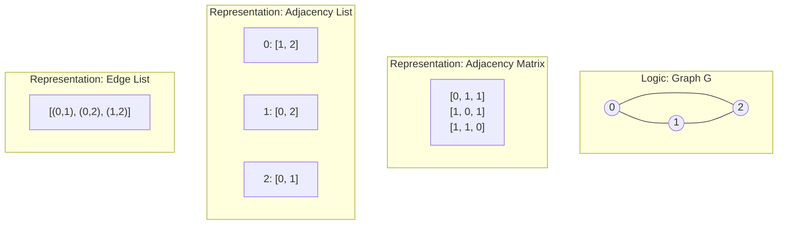

# Graph Representation: Adjacency Matrix, List, and Edge List Comparison

> **Graph representation** is the systematic method of encoding the set of vertices $V$ and edges $E$ of a graph $G=(V, E)$ into data structures that optimize for specific algorithmic operations, such as neighborhood traversal, edge existence queries, or memory footprint.

## 1. Historical Background & Motivation

The formal study of graphs began in 1736 when Leonhard Euler solved the Seven Bridges of Königsberg problem. However, the *representation* of graphs in computing only became a critical engineering challenge in the mid-20th century. Early computer scientists like Richard Bellman and Edsger Dijkstra realized that the efficiency of their shortest-path algorithms was inextricably linked to how the graph was stored in memory. Initially, when memory was extremely scarce (measured in kilobytes), the **Edge List** or compact bit-matrices were the standard.

As computational biology, social network analysis, and web search emerged in the 1990s and 2000s, the "Graph Scale" exploded. Representing the World Wide Web as a graph (where pages are vertices and links are edges) required moving beyond simple 2D arrays. A naive **Adjacency Matrix** for the web would require $O(V^2)$ space—roughly $10^{20}$ cells for 10 billion pages—which is physically impossible to store on any modern supercomputer. This necessitated the dominance of the **Adjacency List** and more advanced compressed formats like Compressed Sparse Row (CSR). Today, understanding these trade-offs is not just academic; it is the difference between a system that scales to billions of users and one that crashes on a single server.

## 2. Visual Intuition
:::demo
<div style="background:#1e1e1e;padding:16px;border-radius:10px;color:#e5e7eb;font-family:system-ui,sans-serif">
  <h3 style="margin:0 0 8px 0;color:#7dd3fc">Graph Representation: Adjacency Matrix, List, and Edge List Comparison - Concept Map</h3>
  <svg width="100%" height="280" viewBox="0 0 640 280" role="img" aria-label="Graph Representation: Adjacency Matrix, List, and Edge List Comparison visual intuition" style="background:#111827;border-radius:8px">
    <rect x="24" y="28" width="180" height="64" rx="10" fill="#1d4ed8" />
    <text x="114" y="66" text-anchor="middle" fill="#e5e7eb" font-size="14">Problem</text>
    <rect x="230" y="28" width="180" height="64" rx="10" fill="#0f766e" />
    <text x="320" y="66" text-anchor="middle" fill="#e5e7eb" font-size="14">Process</text>
    <rect x="436" y="28" width="180" height="64" rx="10" fill="#7c3aed" />
    <text x="526" y="66" text-anchor="middle" fill="#e5e7eb" font-size="14">Outcome</text>

    <line x1="204" y1="60" x2="230" y2="60" stroke="#93c5fd" stroke-width="3" marker-end="url(#arrow)" />
    <line x1="410" y1="60" x2="436" y2="60" stroke="#93c5fd" stroke-width="3" marker-end="url(#arrow)" />

    <rect x="24" y="130" width="592" height="120" rx="10" fill="#0b1220" stroke="#334155" />
    <text x="320" y="156" text-anchor="middle" fill="#cbd5e1" font-size="14">Key intuition for Graph Representation: Adjacency Matrix, List, and Edge List Comparison</text>
    <text x="320" y="182" text-anchor="middle" fill="#94a3b8" font-size="12">Track state changes, constraints, and final behavior.</text>
    <text x="320" y="206" text-anchor="middle" fill="#94a3b8" font-size="12">Use this as a mental model before formal proofs or code.</text>

    <defs>
      <marker id="arrow" markerWidth="10" markerHeight="10" refX="8" refY="3" orient="auto">
        <polygon points="0 0, 10 3, 0 6" fill="#93c5fd" />
      </marker>
    </defs>
  </svg>
  <p style="margin-top:10px;color:#cbd5e1">Interactive-ready visual scaffold for the topic.</p>
</div>
:::
*Caption: A visual mapping of a directed graph to its Adjacency Matrix representation. Each row $i$ and column $j$ corresponds to a vertex; a '1' at $M[i][j]$ indicates an edge from $i$ to $j$.*

## 3. Core Theory & Mathematical Foundations

A graph $G$ is defined as an ordered pair $G = (V, E)$, where $V$ is a set of vertices (or nodes) and $E \subseteq \{\{u, v\} \mid u, v \in V \land u \neq v\}$ for undirected graphs, or $E \subseteq V \times V$ for directed graphs. The density of a graph, denoted by $\rho$, is a critical metric:
$$\rho = \frac{|E|}{|V|(|V|-1)}$$
For a **sparse graph**, $|E| \approx O(V)$, meaning $\rho \to 0$ as $|V| \to \infty$. For a **dense graph**, $|E| \approx O(V^2)$, meaning $\rho \to 1$.

### 3.1 The Adjacency Matrix
The Adjacency Matrix $A$ for a graph $G$ with $n$ vertices is an $n \times n$ matrix where:
$$A_{i,j} = \begin{cases} w & \text{if there is an edge from } v_i \text{ to } v_j \text{ with weight } w \\ 0 & \text{otherwise} \end{cases}$$
For undirected graphs, the matrix is always symmetric ($A = A^T$), because an edge $\{u, v\}$ implies an edge from $u$ to $v$ and $v$ to $u$.

### 3.2 The Adjacency List
An Adjacency List represents a graph as an array $Adj$ of $|V|$ linked lists or dynamic arrays. For each vertex $u \in V$, the list $Adj[u]$ contains all vertices $v$ such that there exists an edge $(u, v) \in E$.
Mathematically, the space complexity is:
$$S = \Theta(|V| + |E|)$$
This is significantly more efficient for sparse graphs. In modern systems, these "lists" are often implemented as [[dynamic-arrays]] (e.g., `std::vector` in C++ or `list` in Python) to improve cache locality.

### 3.3 The Edge List
An Edge List is a simple collection (array or list) of all edges in the graph. Each edge is typically represented as a tuple $(u, v, w)$. 
$$E = \{(u_1, v_1, w_1), (u_2, v_2, w_2), \dots, (u_m, v_m, w_m)\}$$
While lookup is $O(E)$, this format is remarkably memory-efficient for algorithms that process edges globally, such as Kruskal's Minimum Spanning Tree or Bellman-Ford.

### 3.4 Formal Complexity Analysis
Let $n = |V|$ and $m = |E|$.

1.  **Adjacency Matrix**:
    *   **Space**: $O(n^2)$.
    *   **Add Edge**: $O(1)$.
    *   **Remove Edge**: $O(1)$.
    *   **Check Edge $(u, v)$**: $O(1)$.
    *   **Find Neighbors of $u$**: $O(n)$ because we must scan the entire row $u$.

2.  **Adjacency List**:
    *   **Space**: $O(n + m)$.
    *   **Add Edge**: $O(1)$ (append to list).
    *   **Remove Edge**: $O(degree(u))$ to find and remove $v$.
    *   **Check Edge $(u, v)$**: $O(degree(u))$. In the worst case (dense graph), $degree(u) = O(n)$.
    *   **Find Neighbors of $u$**: $O(degree(u))$.

3.  **Edge List**:
    *   **Space**: $O(m)$.
    *   **Add Edge**: $O(1)$.
    *   **Check Edge**: $O(m)$.

## 4. Algorithm / Process (Step-by-Step)

### Converting an Adjacency Matrix to an Adjacency List
1.  Initialize an empty array of lists `adj_list` of size $V$.
2.  Iterate through each row $i$ from $0$ to $V-1$:
    3.  Iterate through each column $j$ from $0$ to $V-1$:
        4.  If `matrix[i][j]` is non-zero:
            5.  Append $j$ (and weight `matrix[i][j]`) to `adj_list[i]`.
6.  Return `adj_list`.

### Checking Connectivity (Matrix)
1.  To check if $u$ is connected to $v$:
2.  Access `matrix[u][v]`.
3.  If value $> 0$, they are connected.

## 5. Visual Diagram


*Caption: Three ways to represent the same simple undirected triangle graph. Note how the matrix is symmetric.*

## 6. Implementation

### 6.1 Core Implementation
The following Python class demonstrates how to manage a graph using both Adjacency Matrix and Adjacency List representations.

```python
import numpy as np

class Graph:
    def __init__(self, num_vertices, directed=False):
        """
        Initializes graph structures.
        Space Complexity: O(V^2) for matrix, O(V) for initial list
        """
        self.v = num_vertices
        self.directed = directed
        # Adjacency Matrix initialized with zeros
        self.adj_matrix = np.zeros((num_vertices, num_vertices), dtype=int)
        # Adjacency List initialized with empty lists
        self.adj_list = {i: [] for i in range(num_vertices)}

    def add_edge(self, u, v, weight=1):
        """
        Adds an edge from u to v.
        Time Complexity: O(1)
        """
        # Update Matrix
        self.adj_matrix[u][v] = weight
        # Update List
        self.adj_list[u].append((v, weight))
        
        if not self.directed:
            self.adj_matrix[v][u] = weight
            self.adj_list[v].append((u, weight))

    def has_edge(self, u, v):
        """
        Checks if edge (u, v) exists.
        Matrix: O(1)
        List: O(degree(u))
        """
        return self.adj_matrix[u][v] != 0

    def get_neighbors(self, u):
        """
        Returns list of neighbors for vertex u.
        Matrix: O(V)
        List: O(degree(u))
        """
        # From list (Efficient)
        return [neighbor for neighbor, weight in self.adj_list[u]]

# Example Usage:
# g = Graph(3)
# g.add_edge(0, 1)
# g.add_edge(1, 2)
# print(g.adj_matrix)
# Output: [[0, 1, 0], [1, 0, 1], [0, 1, 0]]
```

### 6.2 Optimized / Production Variant
In high-performance systems (like those built with C++ or specialized Python libraries), we use **Compressed Sparse Row (CSR)** to represent adjacency lists. This minimizes memory overhead by using two arrays: one for edge destinations and one for offsets into that array.

```python
class CSRGraph:
    """
    A simplified Compressed Sparse Row representation.
    Used in Scipy and high-performance graph compute.
    """
    def __init__(self, num_vertices, edges):
        # edges is a list of (u, v) tuples
        edges.sort() # Sort by source vertex
        self.values = [1] * len(edges)
        self.column_indices = [v for u, v in edges]
        self.row_offsets = [0] * (num_vertices + 1)
        
        curr_edge = 0
        for i in range(num_vertices):
            self.row_offsets[i] = curr_edge
            while curr_edge < len(edges) and edges[curr_edge][0] == i:
                curr_edge += 1
        self.row_offsets[num_vertices] = len(edges)

    def get_neighbors(self, u):
        start = self.row_offsets[u]
        end = self.row_offsets[u+1]
        return self.column_indices[start:end]
```

### 6.3 Common Pitfalls in Code
*   **Memory Overflow**: Attempting to initialize an Adjacency Matrix for $V > 50,000$ will typically cause a `MemoryError` ($50,000^2 \times 4$ bytes $\approx 10$ GB).
*   **List Append Complexity**: In languages like Java or C++, if you don't use a [[dynamic-arrays]] and instead use a linked list for the adjacency list, you might lose cache locality, slowing down traversals significantly.
*   **Undirected Edge Duplication**: Forgetting to add *both* $(u, v)$ and $(v, u)$ in undirected graphs is the most common bug in BFS/DFS implementations.

## 7. Interactive Demo

:::demo
<!-- title: Graph Representation Visualizer -->
<!DOCTYPE html>
<html>
<head>
<meta charset="utf-8">
<style>
  body { margin:0; background:#0f1117; color:#e5e7eb; font-family: monospace; font-size:12px; padding:20px; }
  .container { display: flex; gap: 20px; }
  canvas { border: 1px solid #374151; background: #1f2937; border-radius: 8px; }
  .controls { margin-bottom: 10px; }
  .data-view { flex-grow: 1; display: grid; grid-template-rows: 1fr 1fr; gap: 10px; }
  .box { background: #111827; padding: 10px; border-radius: 4px; border: 1px solid #374151; overflow-y: auto; max-height: 200px;}
  h3 { margin-top: 0; color: #60a5fa; font-size: 14px;}
  button { cursor: pointer; background: #3b82f6; color: white; border: none; padding: 5px 10px; border-radius: 4px; }
  button:hover { background: #2563eb; }
</style>
</head>
<body>
  <div class="controls">
    <button onclick="addRandomEdge()">Add Random Edge</button>
    <button onclick="resetGraph()">Reset</button>
    <span>Click canvas to add nodes</span>
  </div>
  <div class="container">
    <canvas id="graphCanvas" width="300" height="400"></canvas>
    <div class="data-view">
      <div class="box">
        <h3>Adjacency Matrix</h3>
        <div id="matrix-display"></div>
      </div>
      <div class="box">
        <h3>Adjacency List</h3>
        <div id="list-display"></div>
      </div>
    </div>
  </div>
<script>
  const canvas = document.getElementById('graphCanvas');
  const ctx = canvas.getContext('2d');
  const matrixDiv = document.getElementById('matrix-display');
  const listDiv = document.getElementById('list-display');

  let nodes = [];
  let edges = [];

  canvas.addEventListener('mousedown', (e) => {
    const rect = canvas.getBoundingClientRect();
    nodes.push({ x: e.clientX - rect.left, y: e.clientY - rect.top, id: nodes.length });
    updateUI();
  });

  function addRandomEdge() {
    if (nodes.length < 2) return;
    const u = Math.floor(Math.random() * nodes.length);
    const v = Math.floor(Math.random() * nodes.length);
    if (u !== v && !edges.some(e => (e.u === u && e.v === v))) {
      edges.push({ u, v });
      updateUI();
    }
  }

  function resetGraph() {
    nodes = [];
    edges = [];
    updateUI();
  }

  function draw() {
    ctx.clearRect(0, 0, canvas.width, canvas.height);
    edges.forEach(e => {
      ctx.beginPath();
      ctx.moveTo(nodes[e.u].x, nodes[e.u].y);
      ctx.lineTo(nodes[e.v].x, nodes[e.v].y);
      ctx.strokeStyle = '#60a5fa';
      ctx.lineWidth = 2;
      ctx.stroke();
    });
    nodes.forEach(n => {
      ctx.beginPath();
      ctx.arc(n.x, n.y, 12, 0, Math.PI * 2);
      ctx.fillStyle = '#3b82f6';
      ctx.fill();
      ctx.fillStyle = 'white';
      ctx.fillText(n.id, n.x - 4, n.y + 4);
    });
  }

  function updateUI() {
    draw();
    // Update Matrix
    let mHtml = '<table>';
    for(let i=0; i<nodes.length; i++) {
      mHtml += '<tr>';
      for(let j=0; j<nodes.length; j++) {
        const connected = edges.some(e => (e.u === i && e.v === j) || (e.u === j && e.v === i));
        mHtml += `<td style="padding:4px; color:${connected ? '#fbbf24':'#4b5563'}">${connected ? 1 : 0}</td>`;
      }
      mHtml += '</tr>';
    }
    mHtml += '</table>';
    matrixDiv.innerHTML = mHtml;

    // Update List
    let lHtml = '';
    for(let i=0; i<nodes.length; i++) {
      const neighbors = edges.filter(e => e.u === i).map(e => e.v)
                       .concat(edges.filter(e => e.v === i).map(e => e.u));
      lHtml += `<div><strong>${i}</strong>: [${neighbors.join(', ')}]</div>`;
    }
    listDiv.innerHTML = lHtml;
  }
</script>
</body>
</html>
:::

## 8. Worked Examples

### Example 1 — Sparse Network Analysis
**Scenario**: You are representing a friendship network of 10,000 students. Each student has an average of 50 friends.
*   **$|V| = 10,000$**
*   **$|E| = (10,000 \times 50) / 2 = 250,000$** (undirected)

**Comparison**:
1.  **Matrix**: $10,000 \times 10,000 = 100,000,000$ entries. Using 4-byte integers, this is **400 MB**.
2.  **List**: $10,000$ pointers + $500,000$ edge entries (for undirected). This is approx **4.1 MB**.
*Decision*: The Adjacency List is ~100x more space-efficient.

### Example 2 — Complete Graph ($K_n$)
**Scenario**: In a mesh network where every node is connected to every other node (a "Complete Graph"), we have $n=1000$ nodes.
*   **$|E| = \frac{n(n-1)}{2} = 499,500$**.

**Analysis**:
*   An Adjacency Matrix uses $n^2$ bits if stored as a bitmask.
*   An Adjacency List uses $n + 2|E|$ integers.
*   For $n=1000$, $n^2 = 1,000,000$.
*   List uses $1000 + 999,000 = 1,000,000$ integers.
*Decision*: In a complete graph, the Adjacency Matrix is actually more compact because it doesn't store "neighbor" IDs; the position in the matrix *is* the ID.

## 9. Comparison with Alternatives

| Approach | Space Complexity | Check Edge $(u,v)$ | Visit All Neighbors | Best For |
|---|---|---|---|---|
| **Adjacency Matrix** | $O(V^2)$ | $O(1)$ | $O(V)$ | Dense graphs, constant edge checks |
| **Adjacency List** | $O(V+E)$ | $O(degree(u))$ | $O(degree(u))$ | Sparse graphs, large datasets |
| **Edge List** | $O(E)$ | $O(E)$ | $O(E)$ | Sorting edges (Kruskal's), batch updates |
| **Incidence Matrix** | $O(V \cdot E)$ | $O(E)$ | $O(E)$ | Theoretical properties, hypergraphs |

## 10. Industry Applications & Real Systems

-   **Facebook (The Social Graph)**: Facebook uses a modified **Adjacency List** stored across a massive distributed key-value store (TAO). Each vertex (user) is a key, and its value is an association list of friendships. They use this because the social graph is extremely sparse ($10^9$ users, but each only has $\approx 10^2$ friends).
-   **Google Maps (Road Networks)**: Road networks are planar or near-planar graphs where the degree of a vertex (intersection) is rarely more than 4 or 5. Google uses highly optimized adjacency lists with geographic tiling to ensure $O(1)$ lookup of local road segments.
-   **GraphQL / Graph Databases (Neo4j)**: Databases like Neo4j use "Index-free adjacency." Each node contains pointers directly to its adjacent nodes in memory (essentially a **doubly-circular-linked list** structure), avoiding the need for index lookups during traversals.
-   **Compilers (Data Flow Analysis)**: Compilers represent programs as Control Flow Graphs (CFGs). Since functions are relatively small ($V < 1000$), compilers often use **Adjacency Matrices** because bitwise operations (AND, OR) on rows allow for extremely fast data-flow calculations (e.g., reaching definitions).

## 11. Practice Problems

### 🟢 Easy
1.  **Matrix Symmetry**: Given an Adjacency Matrix of an undirected graph, prove that $M[i][j] = M[j][i]$ for all $i, j$. Write a function to check if a matrix is a valid undirected graph.
    *Hint: Iterate through the upper triangle and compare with the lower.*
    *Expected complexity: $O(V^2)$*

### 🟡 Medium
2.  **Conversion Efficiency**: Implement a function that converts an Adjacency List to an Adjacency Matrix. Discuss what happens if the input graph is very sparse.
    *Hint: You must allocate $V^2$ memory upfront.*
    *Expected complexity: $O(V^2)$*

3.  **Degree Calculator**: Given an Adjacency List, find the vertex with the maximum "out-degree" (most outgoing edges) and "in-degree" (most incoming edges).
    *Hint: Out-degree is just the length of the list; in-degree requires a full pass or a separate counter.*

### 🔴 Hard
4.  **Matrix Powering**: In an Adjacency Matrix $A$, prove that the entry $(A^k)_{ij}$ represents the number of paths of length exactly $k$ from vertex $i$ to vertex $j$.
    *Hint: Use induction on $k$. Use [[matrix-operations]].*
    *Expected complexity: $O(V^3 \log k)$ using binary exponentiation.*

5.  **Memory-Hard Graph**: Design a representation for a graph with $10^{12}$ edges that does not fit in RAM. Explain how you would perform a BFS on this graph using a disk-based Edge List.

## 12. Interactive Quiz

:::quiz
**Q1: For a sparse graph with 1,000,000 vertices and 2,000,000 edges, which representation is most space-efficient?**
- A) Adjacency Matrix
- B) Adjacency List
- C) Incidence Matrix
- D) Complete Graph Matrix
> B — The Adjacency Matrix would require $10^{12}$ entries, whereas the Adjacency List only needs $1,000,000 + 2,000,000$ entries.

**Q2: What is the time complexity to find all neighbors of a vertex $u$ in an Adjacency Matrix?**
- A) $O(1)$
- B) $O(degree(u))$
- C) $O(V)$
- D) $O(E)$
> C — You must iterate through the entire row $u$ of length $V$ to find which columns contain a 1.

**Q3: Which representation is best suited for Kruskal's algorithm, which requires sorting all edges by weight?**
- A) Adjacency List
- B) Adjacency Matrix
- C) Edge List
- D) Linked List of Nodes
> C — An Edge List stores edges directly as $(u, v, w)$ tuples, making it trivial to sort them.

**Q4: In an undirected graph represented by an Adjacency Matrix, if the sum of all elements in the matrix is $S$, how many edges are in the graph?**
- A) $S$
- B) $S/2$
- C) $2S$
- D) $\sqrt{S}$
> B — Each edge $(u, v)$ is represented twice: once at $M[u][v]$ and once at $M[v][u]$.

**Q5: Why is the Adjacency List often faster in practice than the Adjacency Matrix for BFS?**
- A) It uses less memory.
- B) It allows $O(1)$ edge checking.
- C) It only visits existing edges rather than scanning $V$ potential edges for every node.
- D) It uses bitwise operations.
> C — In BFS, we need to visit all neighbors. The Adjacency List provides these directly in $O(degree(u))$, while the Matrix forces an $O(V)$ scan.
:::

## 13. Interview Preparation

### Conceptual Questions
**Q: Explain graph representations as if teaching it to a fellow engineer.**
*A: Graph representation is the choice between an Adjacency Matrix (a 2D array) and an Adjacency List (an array of arrays). Use a matrix when your graph is dense ($|E| \approx V^2$) or when you need $O(1)$ checks to see if two specific nodes are connected. Use a list when the graph is sparse ($|E| \approx V$), which is the case for most real-world data like social networks or maps, to save memory and speed up neighbor traversals.*

**Q: What are the time and space complexities? Derive them.**
*A: For a graph with $V$ vertices and $E$ edges: The matrix uses $O(V^2)$ space because it stores every potential connection. The list uses $O(V+E)$ space because it stores each vertex once and each edge once (or twice if undirected). To find neighbors in a matrix, we scan a row of length $V$, so $O(V)$. In a list, we just read the existing neighbors, so $O(degree(u))$.*

**Q: How would you choose between them in a real system?**
*A: I'd look at the Graph Density. If I'm building a system for a dense neural network where every neuron connects to every other, I'd use a Matrix for its cache efficiency and $O(1)$ access. If I'm building a web crawler, I'd use an Adjacency List (specifically a distributed one) because the web is extremely sparse and $V$ is in the billions.*

**Q: What if the graph is too large to fit on one machine?**
*A: I would use a distributed Adjacency List. I'd partition the vertices across multiple machines using a hash of the Vertex ID (Consistent Hashing). Each machine would store the adjacency list for its subset of vertices. If an edge crosses machines, I'd handle it via RPC or by duplicating "ghost" vertices.*

### Quick Reference (Cheat Sheet)
| Property | Adjacency Matrix | Adjacency List |
|---|---|---|
| Space | $O(V^2)$ | $O(V+E)$ |
| Edge Lookup | $O(1)$ | $O(degree(u))$ |
| Iterate Neighbors | $O(V)$ | $O(degree(u))$ |
| Cache Locality | Excellent (Array) | Poor (Linked Lists) / Good (Dynamic Arrays) |
| Best For | Dense Graphs | Sparse Graphs |

## 14. Key Takeaways
1.  **Density is Destiny**: The ratio of edges to vertices ($|E|/|V|^2$) is the primary factor in choosing a representation.
2.  **Adjacency Matrix** is $O(1)$ for edge existence but $O(V^2)$ in space.
3.  **Adjacency List** is $O(V+E)$ space, making it the default for real-world sparse data.
4.  **Edge List** is best for algorithms that need to sort edges or operate on edges independently of their vertices.
5.  **Memory Layout Matters**: In production, "lists" should be implemented as contiguous [[dynamic-arrays]] to maximize CPU cache hits.
6.  **Symmetry**: For undirected graphs, matrices are symmetric and lists store each edge twice.
7.  **Scale**: At FAANG scale, graphs are almost always represented as distributed adjacency lists or adjacency sets.

## 15. Common Misconceptions
- ❌ **"Adjacency Lists are always better."** → ✅ Not if the graph is dense. In a complete graph, a matrix is more memory-efficient because it doesn't store the metadata/pointers of a list.
- ❌ **"Matrices are only for directed graphs."** → ✅ Matrices work for both; for undirected graphs, you simply ensure $M[i][j] = M[j][i]$.
- ❌ **"Linked lists must be used in Adjacency Lists."** → ✅ Modern implementations use dynamic arrays (vectors) for much better performance due to cache locality.

## 16. Further Reading
- *Introduction to Algorithms (CLRS), Chapter 22* — Detailed pseudocode for graph representations.
- *The Algorithm Design Manual (Skiena), Chapter 5* — Excellent practical advice on graph data structures.
- *Graph Algorithms (O'Reilly, Nedeljković)* — Focuses on practical implementations in Spark and Neo4j.
- *Original Paper: "The PageRank Citation Ranking" (Page et al.)* — Insight into how Google represents the web graph.

## 17. Related Topics
- [[complexity-analysis]] — Understanding the Big-O trade-offs mentioned.
- [[matrix-operations]] — Required for advanced graph theory like spectral analysis.
- [[dynamic-arrays]] — The modern backbone of adjacency lists.
- [[singly-linked-list]] — The traditional (though now less common) way to store neighbors.
