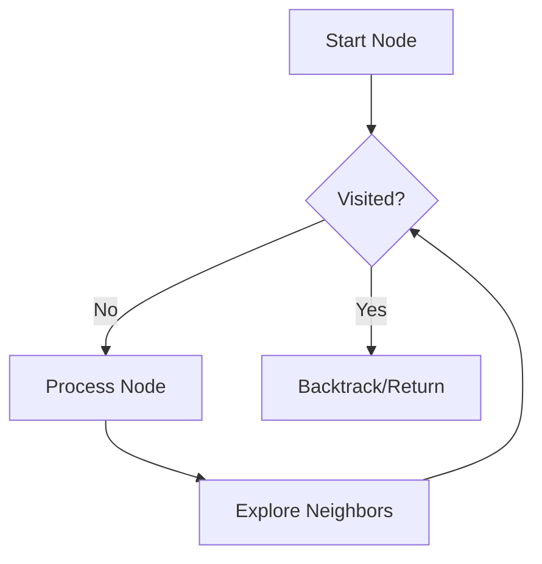

# Graph Data Structures and Traversals

> A graph is a mathematical abstraction of a complex system, composed of a set of vertices connected by edges that represent relationships, dependencies, or physical links between entities.

## Overview

Graphs serve as the foundational data structure for modeling pairwise relationships between objects. Unlike linear structures (arrays, linked lists) or hierarchical structures (trees), graphs provide the flexibility to represent cyclic dependencies and complex networks. In modern software engineering, they are the backbone of search engines, social media recommendation systems, logistics optimization, and network topology analysis.

The study of graphs began in 1736 with Leonhard Euler's solution to the "Seven Bridges of Königsberg" problem, which laid the groundwork for Graph Theory and Topology. Today, mastering graphs is mandatory for high-level software engineering roles, as they appear frequently in interview scenarios involving pathfinding, cycle detection, and topological sorting.

## 2. Visual Intuition
:::demo
<div style="background:#1e1e1e;padding:16px;border-radius:10px;color:#e5e7eb;font-family:system-ui,sans-serif">
  <h3 style="margin:0 0 8px 0;color:#7dd3fc">Graph Data Structures and Traversals - Concept Map</h3>
  <svg width="100%" height="280" viewBox="0 0 640 280" role="img" aria-label="Graph Data Structures and Traversals visual intuition" style="background:#111827;border-radius:8px">
    <rect x="24" y="28" width="180" height="64" rx="10" fill="#1d4ed8" />
    <text x="114" y="66" text-anchor="middle" fill="#e5e7eb" font-size="14">Problem</text>
    <rect x="230" y="28" width="180" height="64" rx="10" fill="#0f766e" />
    <text x="320" y="66" text-anchor="middle" fill="#e5e7eb" font-size="14">Process</text>
    <rect x="436" y="28" width="180" height="64" rx="10" fill="#7c3aed" />
    <text x="526" y="66" text-anchor="middle" fill="#e5e7eb" font-size="14">Outcome</text>

    <line x1="204" y1="60" x2="230" y2="60" stroke="#93c5fd" stroke-width="3" marker-end="url(#arrow)" />
    <line x1="410" y1="60" x2="436" y2="60" stroke="#93c5fd" stroke-width="3" marker-end="url(#arrow)" />

    <rect x="24" y="130" width="592" height="120" rx="10" fill="#0b1220" stroke="#334155" />
    <text x="320" y="156" text-anchor="middle" fill="#cbd5e1" font-size="14">Key intuition for Graph Data Structures and Traversals</text>
    <text x="320" y="182" text-anchor="middle" fill="#94a3b8" font-size="12">Track state changes, constraints, and final behavior.</text>
    <text x="320" y="206" text-anchor="middle" fill="#94a3b8" font-size="12">Use this as a mental model before formal proofs or code.</text>

    <defs>
      <marker id="arrow" markerWidth="10" markerHeight="10" refX="8" refY="3" orient="auto">
        <polygon points="0 0, 10 3, 0 6" fill="#93c5fd" />
      </marker>
    </defs>
  </svg>
  <p style="margin-top:10px;color:#cbd5e1">Interactive-ready visual scaffold for the topic.</p>
</div>
:::
*Caption: A Breadth-First Search (BFS) algorithm systematically explores a graph, expanding in layers from a source node.*

## Core Theory

A graph $G = (V, E)$ consists of a set of vertices $V$ and a set of edges $E \subseteq V \times V$. 

### Representations
*   **Adjacency Matrix:** A $V \times V$ matrix where $A_{ij}$ indicates the existence (and optional weight) of an edge between $i$ and $j$. 
    *   **Space:** $\Theta(V^2)$
    *   **Lookup:** $O(1)$
*   **Adjacency List:** An array of lists where `adj[u]` contains all neighbors of $u$.
    *   **Space:** $\Theta(V + E)$
    *   **Lookup:** $O(\text{degree}(u))$

### Traversal Algorithms
1.  **Breadth-First Search (BFS):** Uses a **Queue** to explore nodes in order of distance from the source. It is the optimal algorithm for finding the shortest path in an unweighted graph.
    *   Time: $O(V + E)$
2.  **Depth-First Search (DFS):** Uses a **Stack** (or recursion) to explore as deep as possible before backtracking.
    *   Time: $O(V + E)$

## Visual Diagram


*A conceptual flow of a graph traversal algorithm illustrating the dependency on a visited state.*

## Code Example

```python
from collections import deque, defaultdict

class Graph:
    def __init__(self):
        self.adj = defaultdict(list)

    def add_edge(self, u, v):
        self.adj[u].append(v)
        self.adj[v].append(u)  # Undirected

    def bfs(self, start_node):
        visited = set()
        queue = deque([start_node])
        visited.add(start_node)
        
        while queue:
            curr = queue.popleft()
            print(f"Visited: {curr}")
            for neighbor in self.adj[curr]:
                if neighbor not in visited:
                    visited.add(neighbor)
                    queue.append(neighbor)

# Execution
g = Graph()
g.add_edge(0, 1)
g.add_edge(0, 2)
g.add_edge(1, 3)
print("BFS Traversal starting from 0:")
g.bfs(0)
# Output: Visited: 0, Visited: 1, Visited: 2, Visited: 3
```

## Interactive Demo

:::demo
<!DOCTYPE html>
<html>
<style>
  .node { fill: #3b82f6; stroke: white; stroke-width: 2px; }
  .text { fill: white; pointer-events: none; }
</style>
<body>
<svg id="canvas" width="300" height="200"></svg>
<button onclick="animateBFS()">Start BFS Animation</button>
<script>
  const svg = document.getElementById('canvas');
  const nodes = [{x:50, y:100}, {x:150, y:50}, {x:150, y:150}, {x:250, y:100}];
  nodes.forEach((n, i) => {
    svg.innerHTML += `<circle class="node" id="n${i}" cx="${n.x}" cy="${n.y}" r="20"/>`;
  });
  function animateBFS() {
    nodes.forEach((_, i) => {
      setTimeout(() => { document.getElementById('n'+i).style.fill = '#ef4444'; }, i * 500);
    });
  }
</script>
</body>
</html>
:::

## Worked Example
Given a graph with edges `(0,1), (0,2), (1,2), (2,0), (2,3), (3,3)`:
1. Start DFS at node 0.
2. Mark 0 visited. Explore neighbor 1.
3. Mark 1 visited. Explore neighbor 2.
4. Mark 2 visited. Explore neighbor 3.
5. Mark 3 visited. 3 is a self-loop, ignore.
6. Return to 0; all neighbors explored.

## Industry Applications
- **Google Maps:** Dijkstra’s algorithm (graph traversal) for shortest path routing.
- **LinkedIn:** Finding degrees of separation (BFS) in social networks.
- **Facebook:** Content recommendation graphs (Graph Neural Networks).
- **Compilers:** Control Flow Graphs (CFG) for dead-code elimination.

## Practice Problems

### Easy
1. Find the number of connected components in an undirected graph. *(Hint: Use DFS/BFS traversal count)*

### Medium
2. Clone an Undirected Graph. *(Hint: Use a hash map to map original nodes to clones)*
3. Check if a graph contains a cycle. *(Hint: Use DFS with a recursion stack or Union-Find)*

### Hard
4. Course Schedule: Find if it's possible to finish courses given dependencies. *(Hint: Detect cycles in a Directed Graph using Topological Sort/Kahn's Algorithm)*

## Interactive Quiz

:::quiz
**Q1:** What is the space complexity of an Adjacency Matrix?
- A) $O(V+E)$
- B) $O(V^2)$
- C) $O(E)$
- D) $O(V)$
> B — An adjacency matrix requires a cell for every possible pair of vertices, regardless of how many edges exist.

**Q2:** When is DFS preferred over BFS?
- A) Finding the shortest path in unweighted graphs.
- B) Memory constraints are extremely tight (BFS queue grows large).
- C) Searching a very deep, narrow graph.
- D) Both B and C.
> D — DFS has $O(depth)$ space complexity versus BFS $O(width)$, and it is ideal for path detection in deep structures.

**Q3:** What is the time complexity to iterate over all neighbors of vertex $v$ using an Adjacency List?
- A) $O(1)$
- B) $O(V)$
- C) $O(\text{degree}(v))$
- D) $O(E)$
> C — The list at index `adj[v]` contains exactly `degree(v)` elements.
:::

## Interview Questions

**Q: Explain graph traversals to a senior engineer.**
*A: I view traversals as fundamental state-space explorations. BFS is essentially a layered search ideal for finding optimal path costs in unweighted structures, while DFS is a recursive descent strategy better suited for exhaustive search, back-tracking, or topological ordering.*

**Q: Complexity of edge lookup in an adjacency list?**
*A: $O(\text{degree}(v))$. Since each list contains only direct neighbors, we must perform a linear scan of that specific list. To achieve $O(1)$, one would need to use an adjacency set or matrix.*

**Q: How do you handle cyclic graphs in traversal?**
*A: Use a `visited` hash set to track nodes already processed. This prevents infinite loops and ensures each vertex is computed once, maintaining the $O(V+E)$ time complexity.*

**Q: Design a system to detect cycles in a massive directed graph.**
*A: Use an adaptation of DFS with three states: Unvisited, Visiting (in recursion stack), and Visited. If we hit a node already in the "Visiting" state, a cycle exists.*

## Key Takeaways
- Use Adjacency Lists for sparse graphs ($E \ll V^2$).
- BFS uses a Queue; DFS uses a Stack/Recursion.
- Always use a `visited` set to avoid cycles.
- BFS finds the shortest path in unweighted graphs.
- Graphs can represent anything from states in a game to servers in a network.

## Common Misconceptions
- ❌ DFS always finds the shortest path. → ✅ Only BFS guarantees the shortest path in unweighted graphs.
- ❌ Adjacency matrices are better for all graphs. → ✅ They are only better for dense graphs ($E \approx V^2$) due to constant-time lookup.

## Related Topics
- [[trees]] — A special type of graph with no cycles.
- [[dijkstra]] — Shortest path for weighted graphs.
- [[topological-sort]] — Ordering dependencies in a DAG.
