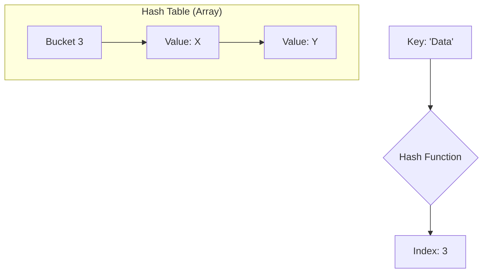

# Hash Tables

> A hash table is a high-performance data structure that utilizes a mathematical hash function to compute an array index, providing near-instantaneous data access.

## Overview
A hash table, or hash map, is a data structure that implements an associative array abstract data type. Its primary objective is to provide a mapping between unique keys and their associated values. Unlike arrays, which use integer offsets for access, hash tables allow for virtually any data type (strings, objects, tuples) to serve as a key by passing that key through a hash function, which maps the key to a specific "bucket" or "slot" within an underlying array.

Historically, the development of hashing techniques in the 1950s—most notably by Hans Peter Luhn at IBM—revolutionized how computers manage memory and state. By achieving an average-case time complexity of $O(1)$ for insertions, deletions, and lookups, hash tables bridge the gap between human-readable data identifiers and machine-level memory addressing. Today, they are the backbone of modern computing, powering everything from high-frequency trading database indexes to the runtime environments of high-level languages like Python and Ruby.

## 2. Visual Intuition
:::demo
<div style="background:#1e1e1e;padding:16px;border-radius:10px;color:#e5e7eb;font-family:system-ui,sans-serif">
  <h3 style="margin:0 0 8px 0;color:#7dd3fc">Hash Tables - Concept Map</h3>
  <svg width="100%" height="280" viewBox="0 0 640 280" role="img" aria-label="Hash Tables visual intuition" style="background:#111827;border-radius:8px">
    <rect x="24" y="28" width="180" height="64" rx="10" fill="#1d4ed8" />
    <text x="114" y="66" text-anchor="middle" fill="#e5e7eb" font-size="14">Problem</text>
    <rect x="230" y="28" width="180" height="64" rx="10" fill="#0f766e" />
    <text x="320" y="66" text-anchor="middle" fill="#e5e7eb" font-size="14">Process</text>
    <rect x="436" y="28" width="180" height="64" rx="10" fill="#7c3aed" />
    <text x="526" y="66" text-anchor="middle" fill="#e5e7eb" font-size="14">Outcome</text>

    <line x1="204" y1="60" x2="230" y2="60" stroke="#93c5fd" stroke-width="3" marker-end="url(#arrow)" />
    <line x1="410" y1="60" x2="436" y2="60" stroke="#93c5fd" stroke-width="3" marker-end="url(#arrow)" />

    <rect x="24" y="130" width="592" height="120" rx="10" fill="#0b1220" stroke="#334155" />
    <text x="320" y="156" text-anchor="middle" fill="#cbd5e1" font-size="14">Key intuition for Hash Tables</text>
    <text x="320" y="182" text-anchor="middle" fill="#94a3b8" font-size="12">Track state changes, constraints, and final behavior.</text>
    <text x="320" y="206" text-anchor="middle" fill="#94a3b8" font-size="12">Use this as a mental model before formal proofs or code.</text>

    <defs>
      <marker id="arrow" markerWidth="10" markerHeight="10" refX="8" refY="3" orient="auto">
        <polygon points="0 0, 10 3, 0 6" fill="#93c5fd" />
      </marker>
    </defs>
  </svg>
  <p style="margin-top:10px;color:#cbd5e1">Interactive-ready visual scaffold for the topic.</p>
</div>
:::
*Caption: An animation showing how keys are mapped to indices using a hash function, with collisions resolved via separate chaining.*

## Core Theory
The efficiency of a hash table relies on the performance of its **hash function** $h(k)$ and its **collision resolution strategy**. 

### 1. The Hash Function
A robust hash function must be:
*   **Deterministic:** $h(k)$ must always return the same index for key $k$.
*   **Uniform:** It must distribute keys uniformly across $m$ slots to prevent "clustering."
*   **Efficient:** It must compute in $O(1)$ time.

**Common Mathematical Methods:**
*   **Division Method:** $h(k) = k \pmod m$. Ideally, $m$ should be a prime number not close to a power of 2.
*   **Multiplication Method:** $h(k) = \lfloor m(k \cdot A \pmod 1) \rfloor$, where $A$ is a constant, typically the golden ratio $\approx 0.618$.

### 2. Collision Handling
When two keys $k_1$ and $k_2$ result in $h(k_1) = h(k_2)$, a collision occurs.

*   **Separate Chaining:** Each bucket stores a pointer to a linked list (or dynamic array) of elements. The load factor is $\alpha = n/m$. Searching takes $O(1 + \alpha)$ time.
*   **Open Addressing:** All elements are stored in the array itself. When a collision occurs, we calculate a "probe sequence":
    *   **Linear Probing:** $h(k, i) = (h'(k) + i) \pmod m$. Suffers from *primary clustering*.
    *   **Double Hashing:** $h(k, i) = (h_1(k) + i \cdot h_2(k)) \pmod m$. Virtually eliminates clustering.

## Visual Diagram

*A conceptual diagram of a hash table showing key-to-index mapping and a separate chaining bucket containing multiple values.*

## Code Example
```python
class HashTable:
    def __init__(self, size=10):
        self.size = size
        self.table = [[] for _ in range(self.size)]

    def _hash(self, key):
        return hash(key) % self.size

    def insert(self, key, value):
        idx = self._hash(key)
        # Check if key exists to update
        for i, (k, v) in enumerate(self.table[idx]):
            if k == key:
                self.table[idx][i] = (key, value)
                return
        self.table[idx].append((key, value))

    def get(self, key):
        idx = self._hash(key)
        for k, v in self.table[idx]:
            if k == key:
                return v
        return None

# Execution
ht = HashTable()
ht.insert("apple", 50)
ht.insert("orange", 100)
print(f"Value for 'apple': {ht.get('apple')}") # Output: 50
```

## Interactive Demo
:::demo
<!DOCTYPE html>
<html>
<body>
  <h3>Hash Visualizer</h3>
  <div id="display" style="font-family:monospace">Enter a key to hash:</div>
  <input id="in" type="text"><button onclick="hash()">Hash</button>
  <script>
    function hash() {
      const val = document.getElementById('in').value;
      let h = 0;
      for(let i=0; i<val.length; i++) h = (h << 5) - h + val.charCodeAt(i);
      document.getElementById('display').innerText = "Hash Index: " + (Math.abs(h) % 10);
    }
  </script>
</body>
</html>
:::

## Worked Example
Suppose we have a table of size $m=7$ and we insert keys $\{10, 20, 15\}$ using $h(k) = k \pmod 7$.
1.  **Insert 10**: $10 \pmod 7 = 3$. Place 10 at index 3.
2.  **Insert 20**: $20 \pmod 7 = 6$. Place 20 at index 6.
3.  **Insert 15**: $15 \pmod 7 = 1$. Place 15 at index 1.
4.  **Insert 17**: $17 \pmod 7 = 3$. Collision! Append 17 to the list at index 3.

## Industry Applications
- **Python (CPython)**: Dictionaries use open addressing with "perturbation" to handle collisions.
- **Redis**: Uses hash tables for its main key-value store and implements incremental rehashing to avoid blocking.
- **Java (JVM)**: `HashMap` uses separate chaining, transitioning to Red-Black Trees when list size > 8 for $O(\log n)$ worst-case per bucket.

## Practice Problems
### Easy
1. Given a string, count character frequencies using a hash map.

### Medium
2. Implement an LRU Cache using a hash map and a doubly linked list.
3. Determine if two strings are anagrams using a frequency map.

### Hard
4. Design a hash table that supports `insert`, `delete`, and `getRandom` in $O(1)$ average time. *(Hint: Use a hash map and an array together.)*

## Interactive Quiz
:::quiz
**Q1:** What is the primary cause of Primary Clustering?
- A) Separate Chaining
- B) Linear Probing
- C) Double Hashing
- D) Uniform Hashing
> B — Linear probing causes adjacent slots to fill up, creating long sequences that increase search time.

**Q2:** If the load factor $\alpha > 1$, which strategy is mandatory?
- A) Linear Probing
- B) Separate Chaining
- C) Double Hashing
- D) Rehash
> B — Open addressing cannot hold more elements than slots, while chaining handles $\alpha > 1$ gracefully.

**Q3:** What is the complexity of searching in a perfectly uniform hash table?
- A) $O(n)$
- B) $O(\log n)$
- C) $O(1)$
- D) $O(n^2)$
> C — In a perfect scenario with minimal collisions, access is constant time.
:::

## Interview Questions
**Q: Explain hash tables to a senior engineer.**
*A: Hash tables map keys to indices via a hash function. In production, we must optimize for load factor management—triggering resizing/rehashing when $\alpha$ exceeds a threshold—and choose collision resolution that balances CPU cache performance (Open Addressing) against worst-case search stability (Chaining).*

**Q: Time/space complexity of search?**
*A: Average case $O(1)$, worst case $O(n)$ if all keys hash to the same bucket. Space is $O(n + m)$.*

**Q: How to handle high collision rates?**
*A: Implement a better hash function (e.g., MurmurHash), increase table size $m$ (prime), or use cryptographic hashing if keys are adversarial.*

**Q: How do you handle resizing?**
*A: Create a new, larger array and re-insert all elements. In low-latency systems, use "Incremental Rehashing" to move elements in chunks.*

## Key Takeaways
- Hash tables provide $O(1)$ average-case lookup.
- The hash function must be uniform to prevent clustering.
- Load factor $\alpha = n/m$ dictates performance.
- Collisions are inevitable; choose between Chaining and Open Addressing.
- Resizing requires $O(n)$ rehashing, which must be handled carefully in production.

## Common Misconceptions
- ❌ Hash tables are always $O(1)$ → ✅ Only on average; $O(n)$ worst-case.
- ❌ Hashing is encryption → ✅ Hashing is a one-way mathematical reduction, not security encryption.

## Related Topics
- [[Arrays]] — The underlying storage mechanism.
- [[Linked-Lists]] — Used in separate chaining.
- [[Binary-Search-Trees]] — Alternative to chaining for $O(\log n)$ worst-case.
