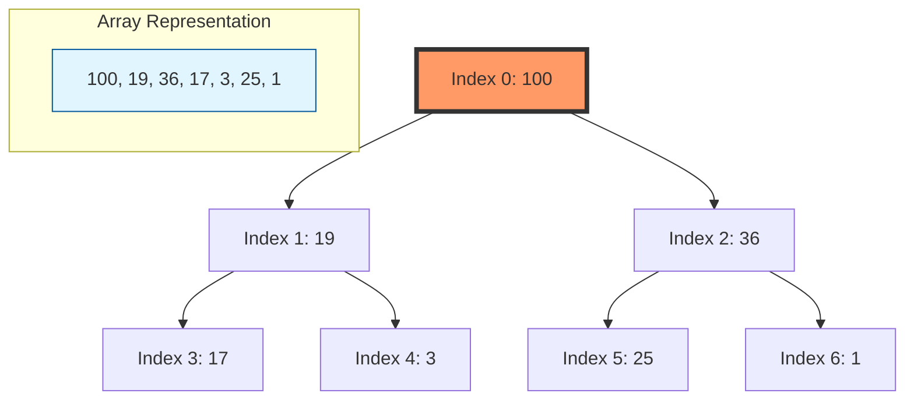

# Heap Operations: Heapify, Extract-Min/Max, Heap Sort, and k-th Largest

> A Binary Heap is a nearly complete binary tree that maintains the "Heap Property": in a Max-Heap, every parent node is greater than or equal to its children; in a Min-Heap, every parent is less than or equal to its children.

## 1. Historical Background & Motivation

The binary heap data structure was first introduced by J.W.J. Williams in 1964 as part of the **Heapsort** algorithm. Shortly thereafter, Robert W. Floyd published an improved method for constructing heaps in-place (the `Build-Heap` procedure). At the time, researchers were searching for a sorting algorithm that combined the $O(n \log n)$ worst-case performance of Merge Sort with the $O(1)$ auxiliary space complexity of Insertion Sort. The heap provided a elegant solution by mapping a logical tree structure directly onto a physical contiguous array.

In modern computing, the heap's relevance extends far beyond sorting. It is the fundamental engine behind **Priority Queues**, which govern everything from CPU task scheduling in the Linux kernel to the A* search algorithm used in robotics and game development. As datasets grew to exceed the size of L3 caches, the heap’s cache-friendly contiguous memory layout became a primary reason for its continued dominance over pointer-heavy structures like AVL or Red-Black trees in specific performance-critical applications like stream processing and real-time top-k filtering.

## 2. Visual Intuition

*Caption: A Max-Heap visualization showing the insertion process. Note how the "bubble-up" (or sift-up) operation maintains the heap property by swapping the new element with its parent until the parent is larger.*

## 3. Core Theory & Mathematical Foundations

### 3.1 The Array-Tree Mapping
The brilliance of the Binary Heap lies in its implicit structure. We represent a complete binary tree in a standard 0-indexed array. For any element at index $i$:
1.  **Left Child:** $2i + 1$
2.  **Right Child:** $2i + 2$
3.  **Parent:** $\lfloor (i - 1) / 2 \rfloor$

This mapping ensures that the tree is always "nearly complete"—filled level by level from left to right. This property guarantees a height of $h = \lfloor \log_2 n \rfloor$, which is the foundation of the $O(\log n)$ performance for primary operations.

### 3.2 The Heap Property
Formalizing the Max-Heap property:
$$\forall i > 0, A[\text{parent}(i)] \ge A[i]$$
This implies that the maximum element is always at the root ($A[0]$). Conversely, in a Min-Heap:
$$\forall i > 0, A[\text{parent}(i)] \le A[i]$$

### 3.3 The Mechanics of Heapify (Sift-Down)
`Max-Heapify` is the procedure used to maintain the heap property. When an element at index $i$ is smaller than its children, it "sinks" down the tree. 
Let $n$ be the heap size. The procedure compares $A[i]$ with $A[2i+1]$ and $A[2i+2]$. If the largest is a child, it swaps with $A[i]$ and recurses on the affected subtree. 

The time complexity of a single `Heapify` call is proportional to the height of the node, which is $O(\log n)$.

### 3.4 Build-Heap: The $O(n)$ Surprise
One of the most common misconceptions is that building a heap from an unsorted array takes $O(n \log n)$. While calling `Insert` $n$ times does take $O(n \log n)$, Floyd’s `Build-Heap` algorithm starts from the last non-leaf node and calls `Heapify` downwards. 

Mathematically, the number of nodes at height $h$ is at most $\lceil n/2^{h+1} \rceil$. The cost of `Heapify` at height $h$ is $O(h)$. The total cost $T(n)$ is:
$$T(n) = \sum_{h=0}^{\lfloor \log n \rfloor} \lceil \frac{n}{2^{h+1}} \rceil O(h) = O(n \sum_{h=0}^{\infty} \frac{h}{2^h})$$
Since the infinite series $\sum_{h=0}^{\infty} \frac{h}{2^h}$ converges to 2, the total complexity is:
$$T(n) = O(n)$$
This linear bound is crucial for the efficiency of Heap Sort and selection algorithms.

## 4. Algorithm / Process (Step-by-Step)

### 4.1 Extract-Max
1.  **Replace Root:** Copy the last element in the array to the root (index 0).
2.  **Shrink:** Decrease the heap size by 1.
3.  **Sift-Down:** Call `Max-Heapify(0)` to restore the heap property.
4.  **Return:** The original root value.

### 4.2 Heap Sort
1.  **Build-Heap:** Transform the input array into a Max-Heap ($O(n)$).
2.  **Iterate:** For $i$ from $n-1$ down to 1:
    *   Swap $A[0]$ (current max) with $A[i]$.
    *   Reduce the "active heap" size by 1.
    *   Call `Max-Heapify(0)` on the reduced heap ($O(\log n)$).
3.  **Result:** The array is now sorted in ascending order.

### 4.3 K-th Largest (Min-Heap Strategy)
1.  Initialize a Min-Heap with the first $k$ elements.
2.  For the remaining $n-k$ elements:
    *   If current element > heap root:
        *   Replace root with current element.
        *   `Min-Heapify(0)`.
3.  The root of the Min-Heap is the $k$-th largest element.

## 5. Visual Diagram

*Caption: Mapping of a Max-Heap to its array representation. Note the contiguous storage and the mathematical relationship between parent and child indices.*

## 6. Implementation

### 6.1 Core Implementation (Max-Heap)

```python
class MaxHeap:
    def __init__(self, arr=None):
        """
        Initializes the heap. If an array is provided, it builds the heap in-place.
        Complexity: O(N) for Build-Heap, O(1) for empty init.
        """
        self.heap = arr if arr else []
        if self.heap:
            self._build_heap()

    def _parent(self, i): return (i - 1) // 2
    def _left(self, i): return 2 * i + 1
    def _right(self, i): return 2 * i + 2

    def _heapify(self, i, size=None):
        """
        Maintains the Max-Heap property for the subtree at index i.
        Complexity: O(log N)
        """
        if size is None:
            size = len(self.heap)
            
        largest = i
        l, r = self._left(i), self._right(i)

        if l < size and self.heap[l] > self.heap[largest]:
            largest = l
        if r < size and self.heap[r] > self.heap[largest]:
            largest = r

        if largest != i:
            self.heap[i], self.heap[largest] = self.heap[largest], self.heap[i]
            self._heapify(largest, size)

    def _build_heap(self):
        """
        Builds a heap from an arbitrary array using Floyd's algorithm.
        Complexity: O(N)
        """
        n = len(self.heap)
        for i in range(n // 2 - 1, -1, -1):
            self._heapify(i)

    def extract_max(self):
        """
        Removes and returns the maximum element.
        Complexity: O(log N)
        """
        if not self.heap:
            raise IndexError("Heap is empty")
        
        root = self.heap[0]
        # Move the last element to the root
        self.heap[0] = self.heap[-1]
        self.heap.pop()
        
        if self.heap:
            self._heapify(0)
        return root

    def insert(self, key):
        """
        Adds a new key to the heap and sifts it up.
        Complexity: O(log N)
        """
        self.heap.append(key)
        idx = len(self.heap) - 1
        
        # Sift-up (Bubble-up)
        while idx > 0 and self.heap[self._parent(idx)] < self.heap[idx]:
            p = self._parent(idx)
            self.heap[idx], self.heap[p] = self.heap[p], self.heap[idx]
            idx = p

# Example Usage:
# h = MaxHeap([3, 10, 12, 8, 2, 14])
# print(h.extract_max()) # Output: 14
# print(h.heap) # Valid Max-Heap array
```

### 6.2 Optimized Heap Sort (In-Place)

```python
def heap_sort(arr):
    """
    Sorts an array in-place using the Heap Sort algorithm.
    Time Complexity: O(N log N)
    Space Complexity: O(1)
    """
    n = len(arr)

    # Helper function for in-place heapify
    def sift_down(idx, size):
        largest = idx
        l, r = 2 * idx + 1, 2 * idx + 2
        if l < size and arr[l] > arr[largest]: largest = l
        if r < size and arr[r] > arr[largest]: largest = r
        if largest != idx:
            arr[idx], arr[largest] = arr[largest], arr[idx]
            sift_down(largest, size)

    # Step 1: Build Max-Heap O(N)
    for i in range(n // 2 - 1, -1, -1):
        sift_down(i, n)

    # Step 2: Extract elements one by one O(N log N)
    for i in range(n - 1, 0, -1):
        arr[0], arr[i] = arr[i], arr[0] # Move current max to end
        sift_down(0, i) # Heapify on the reduced heap

    return arr

# Sample Input: [12, 11, 13, 5, 6, 7]
# Sample Output: [5, 6, 7, 11, 12, 13]
```

### 6.3 Common Pitfalls in Code
*   **Off-by-One in Parents:** Forgetting that leaf nodes start at index $\lfloor n/2 \rfloor$. Attempting to `heapify` leaf nodes is redundant.
*   **Recursive Depth:** In languages without tail-call optimization (like Python), very deep heaps can cause `RecursionError`. An iterative `sift_down` is preferred for production.
*   **Zero-Index vs One-Index:** Traditional textbooks (CLRS) often use 1-based indexing for math. In implementation, always translate to 0-based: `parent = (i-1)//2`.

## 7. Interactive Demo

:::demo
<!-- title: Heap Sift-Down Visualization -->
<!DOCTYPE html>
<html>
<head>
<meta charset="utf-8">
<style>
  body { margin:0; background:#0f1117; color:#e5e7eb; font-family: system-ui, sans-serif; font-size:13px; padding:16px; }
  .canvas-container { position: relative; width: 100%; height: 300px; background: #1e293b; border-radius: 8px; }
  canvas { width: 100%; height: 100%; }
  .controls { margin-top: 10px; display: flex; gap: 8px; }
  button { background: #3b82f6; border: none; color: white; padding: 6px 12px; border-radius: 4px; cursor: pointer; }
  button:hover { background: #2563eb; }
  .status { margin-top: 8px; color: #94a3b8; }
</style>
</head>
<body>
  <div class="canvas-container">
    <canvas id="heapCanvas"></canvas>
  </div>
  <div class="controls">
    <button onclick="resetHeap()">Reset</button>
    <button onclick="stepHeapify()">Step Heapify</button>
  </div>
  <div class="status" id="statusMsg">Click 'Step' to sift-down the root.</div>

<script>
  const canvas = document.getElementById('heapCanvas');
  const ctx = canvas.getContext('2d');
  let heap = [10, 40, 30, 5, 15, 20, 25];
  let activeIndex = 0;

  function drawNode(x, y, val, color="#3b82f6") {
    ctx.beginPath();
    ctx.arc(x, y, 20, 0, Math.PI * 2);
    ctx.fillStyle = color;
    ctx.fill();
    ctx.fillStyle = "white";
    ctx.textAlign = "center";
    ctx.fillText(val, x, y + 5);
  }

  function drawTree() {
    ctx.clearRect(0, 0, canvas.width, canvas.height);
    const coords = [];
    const levels = 3;
    const width = canvas.width;
    
    for(let i=0; i<heap.length; i++) {
        let level = Math.floor(Math.log2(i + 1));
        let posInLevel = i - (Math.pow(2, level) - 1);
        let numInLevel = Math.pow(2, level);
        let x = (width / (numInLevel + 1)) * (posInLevel + 1);
        let y = 50 + level * 70;
        coords.push({x, y});
        
        if (i > 0) {
            let pIdx = Math.floor((i-1)/2);
            ctx.beginPath();
            ctx.moveTo(coords[pIdx].x, coords[pIdx].y);
            ctx.lineTo(x, y);
            ctx.strokeStyle = "#475569";
            ctx.stroke();
        }
    }
    
    coords.forEach((c, idx) => {
        let color = (idx === activeIndex) ? "#ef4444" : "#3b82f6";
        drawNode(c.x, c.y, heap[idx], color);
    });
  }

  function resetHeap() {
    heap = [10, 40, 30, 5, 15, 20, 25];
    activeIndex = 0;
    document.getElementById('statusMsg').innerText = "Root (10) violates Max-Heap property.";
    drawTree();
  }

  function stepHeapify() {
    let i = activeIndex;
    let l = 2*i + 1, r = 2*i + 2;
    let largest = i;
    if(l < heap.length && heap[l] > heap[largest]) largest = l;
    if(r < heap.length && heap[r] > heap[largest]) largest = r;
    
    if(largest !== i) {
        document.getElementById('statusMsg').innerText = `Swapping ${heap[i]} with ${heap[largest]}`;
        [heap[i], heap[largest]] = [heap[largest], heap[i]];
        activeIndex = largest;
        drawTree();
    } else {
        document.getElementById('statusMsg').innerText = "Heap property restored.";
    }
  }

  window.addEventListener('resize', () => {
    canvas.width = canvas.offsetWidth;
    canvas.height = canvas.offsetHeight;
    drawTree();
  });
  canvas.width = canvas.offsetWidth;
  canvas.height = canvas.offsetHeight;
  drawTree();
</script>
</body>
</html>
:::

## 8. Worked Examples

### Example 1 — Build-Heap Numerically
**Input Array:** `[4, 10, 3, 5, 1]`
1.  **Identify last non-leaf:** Index $\lfloor 5/2 \rfloor - 1 = 1$. Value is `10`.
2.  **Heapify(1):** Children are `5` (index 3) and `1` (index 4). `10` is larger than both. No change.
3.  **Heapify(0):** Value is `4`. Children are `10` (index 1) and `3` (index 2).
    *   `10` is largest. Swap `4` and `10`.
    *   Array becomes `[10, 4, 3, 5, 1]`.
    *   Recurse Heapify on index 1: Value is now `4`. Children are `5` and `1`.
    *   `5` is largest. Swap `4` and `5`.
    *   Array becomes `[10, 5, 3, 4, 1]`.
4.  **Final Heap:** `[10, 5, 3, 4, 1]`.

### Example 2 — k-th Largest (k=3)
**Stream:** `[7, 10, 4, 3, 20, 15]`
1.  **Init Min-Heap (k=3):** `[4, 10, 7]`
2.  **Process 3:** `3 < root(4)`. Ignore.
3.  **Process 20:** `20 > root(4)`. Replace root. Heap: `[20, 10, 7]`. Sift-down: `[7, 10, 20]`.
4.  **Process 15:** `15 > root(7)`. Replace root. Heap: `[15, 10, 20]`. Sift-down: `[10, 15, 20]`.
5.  **Result:** Root is `10`.

## 9. Comparison with Alternatives

| Approach | Time (Avg) | Space | Pros | Cons | Best Used When |
|---|---|---|---|---|---|
| **Heap Sort** | $O(n \log n)$ | $O(1)$ | No worst-case pitfalls. | Not stable. | Embedded systems, memory-constrained. |
| **Quick Sort** | $O(n \log n)$ | $O(\log n)$ | Excellent cache locality. | $O(n^2)$ worst case. | General purpose sorting. |
| **Merge Sort** | $O(n \log n)$ | $O(n)$ | Stable sorting. | High memory overhead. | Linked lists, external sorting. |
| **Quickselect** | $O(n)$ | $O(1)$ | Faster for k-th element. | $O(n^2)$ worst case. | One-time k-th element query. |
| **Min-Heap (k)** | $O(n \log k)$ | $O(k)$ | Handles infinite streams. | Slightly slower than linear. | Real-time streaming data. |

## 10. Industry Applications & Real Systems

-   **Linux Kernel (CFS Scheduler):** The Completely Fair Scheduler uses a Red-Black tree but historically, schedulers used heaps to pick the task with the highest priority or lowest virtual runtime.
-   **Google Guava / Java Standard Library:** `PriorityQueue` implementations are used in heavy-duty backend services for processing event buses where events must be handled based on urgency rather than arrival time.
-   **Apache Lucene (Elasticsearch):** Uses a `PriorityQueue` (Min-Heap) to collect the "Top-N" search results from various shards. This ensures that only the most relevant documents are kept in memory during the merge phase.
-   **Network Routers:** Quality of Service (QoS) modules use priority queues to manage packet buffers. High-priority voice-over-IP (VoIP) packets are extracted from the heap before standard web traffic packets.

## 11. Practice Problems

### 🟢 Easy
1.  **Implement a Min-Heap:** Write a class that supports `push` and `pop` for a Min-Heap.
    *Hint: Use the array mapping but reverse the comparison logic.*
    *Expected complexity: O(log N)*

### 🟡 Medium
2.  **Top K Frequent Elements:** Given an array of integers, return the $k$ most frequent elements.
    *Hint: Use a hash map for counts, then a Min-Heap of size k to track frequencies.*
    *Expected complexity: O(N log k)*

3.  **Merge K Sorted Lists:** Merge $k$ sorted linked lists into one sorted list.
    *Hint: Push the head of each list into a Min-Heap. Extract min, then push its next node.*

### 🔴 Hard
4.  **Find Median from Data Stream:** Design a data structure that supports adding numbers and finding the median in $O(1)$ time.
    *Hint: Use two heaps—a Max-Heap for the lower half and a Min-Heap for the upper half.*
    *Expected complexity: O(log N) for add, O(1) for median.*

5.  **Smallest Range Covering Elements from K Lists:** Given $k$ lists of sorted integers, find the smallest range that includes at least one number from each of the $k$ lists.

## 12. Interactive Quiz

:::quiz
**Q1: What is the time complexity of building a heap from an unsorted array of size $n$ using Floyd's algorithm?**
- A) $O(n \log n)$
- B) $O(n)$
- C) $O(1)$
- D) $O(\log n)$
> B — While it seems like $O(n \log n)$ because of $n$ heapify calls, the mathematical summation of work per level converges to $O(n)$.

**Q2: In a Max-Heap stored in a 0-indexed array, what is the index of the parent of the node at index 14?**
- A) 7
- B) 6
- C) 13
- D) 5
> B — The formula is $(i-1)//2$. $(14-1)//2 = 6.5 \rightarrow 6$.

**Q3: Why is Heap Sort generally slower than Quick Sort in practice?**
- A) Heap Sort has a worse time complexity.
- B) Heap Sort requires more memory.
- C) Heap Sort has poor cache locality due to large jumps in array indices during heapify.
- D) Heap Sort is unstable.
> C — Quick Sort traverses memory linearly more often, making better use of the CPU cache than the logarithmic jumps in Heap Sort.

**Q4: Which data structure is most suitable for implementing a Priority Queue?**
- A) Sorted Array
- B) Linked List
- C) Binary Heap
- D) Hash Map
> C — Heaps provide $O(\log n)$ for both insertion and extraction, balancing the cost better than arrays ($O(n)$ insertion) or lists.

**Q5: What happens to the heap height if we double the number of elements?**
- A) It doubles.
- B) It increases by 1.
- C) It increases by $n/2$.
- D) It remains constant.
> B — Since $h = \log_2 n$, doubling $n$ results in $\log_2(2n) = \log_2 n + 1$.
:::

## 13. Interview Preparation

### Conceptual Questions
**Q: Explain how a Binary Heap can be used to find the $k$-th smallest element.**
*A: One can use a Max-Heap of size $k$. Iterate through the array; for each element, if it's smaller than the heap root, replace the root and heapify. After one pass, the Max-Heap root contains the $k$-th smallest element. This is efficient for $k \ll n$ because it uses $O(n \log k)$ time and $O(k)$ space.*

**Q: Derive the time complexity of the Extract-Max operation.**
*A: Extract-Max involves: 1) Accessing the root ($O(1)$), 2) Moving the last leaf to the root ($O(1)$), and 3) Sifting down the root to its correct position. Since the tree is nearly complete, its height is $\log n$. The sift-down process takes at most $h$ steps, where each step is a constant number of comparisons and a swap. Thus, the total time is $O(\log n)$.*

**Q: Can a Max-Heap be used to find all elements smaller than some value $X$ in $O(k)$ time, where $k$ is the number of such elements?**
*A: Yes. Start at the root. If root $< X$, then all elements in the heap are smaller than $X$ (not useful). If root $\ge X$, check its children. If a child is $< X$, then its entire subtree does NOT necessarily satisfy the condition. However, if we only traverse nodes that are $< X$, we can find all $k$ elements in $O(k)$ time because we only visit $k$ successful nodes and their immediate children.*

### Quick Reference (Cheat Sheet)
| Property | Value |
|---|---|
| Build-Heap Time | $O(n)$ |
| Insert / Extract | $O(\log n)$ |
| Find Min/Max | $O(1)$ |
| Heap Sort | $O(n \log n)$ |
| Space Complexity| $O(1)$ (in-place) |
| Stable? | No |

## 14. Key Takeaways
1.  **Binary Heaps are Array-Based:** They use mathematical indexing instead of pointers, making them space-efficient and cache-friendly.
2.  **Build-Heap is Linear:** Constructing a heap bottom-up is $O(n)$, making it faster than sorting the whole array.
3.  **Logarithmic Height:** The $O(\log n)$ height guarantee is maintained by the "nearly complete" property.
4.  **Priority Queue Engine:** Heaps are the go-to structure for any "highest priority first" problem.
5.  **In-Place Sort:** Heap Sort is one of the few $O(n \log n)$ sorts that requires zero extra memory.
6.  **Unstable Sort:** Relative order of equal elements is not guaranteed.

## 15. Common Misconceptions
- ❌ **Building a heap takes $O(n \log n)$** → ✅ Floyd's algorithm allows heap construction in $O(n)$.
- ❌ **Heaps are always sorted** → ✅ Only the relationship between parent and child is guaranteed. A level-order traversal of a heap is generally not sorted.
- ❌ **Searching for an arbitrary element is $O(\log n)$** → ✅ Searching for a non-min/max element requires a linear scan ($O(n)$) because there is no horizontal ordering.

## 16. Further Reading
- *Introduction to Algorithms (CLRS)* — Chapter 6: Heapsort. The gold standard for formal proofs.
- *The Art of Computer Programming (Knuth)* — Volume 3: Sorting and Searching.
- *Python `heapq` module source code* — Highly recommended to see how production-grade heaps are implemented using iterative logic.

## 17. Related Topics
- [[complexity-analysis]] — Understanding why Build-Heap is $O(n)$.
- [[priority-queues]] — The abstract data type implemented by heaps.
- [[binary-search-trees]] — Comparison of search performance vs. heap property.
- [[sorting-algorithms]] — How Heap Sort fits into the broader ecosystem.