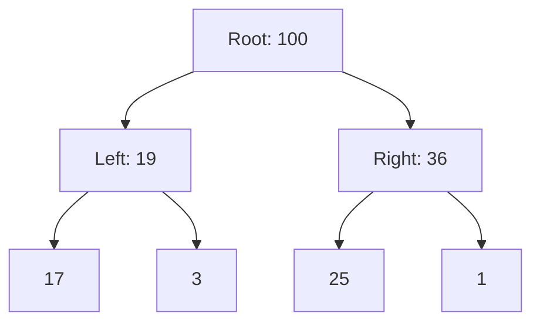

# Heap Data Structure

> A heap is a specialized, complete binary tree-based data structure that satisfies the heap property, providing efficient access to the extreme element of a collection.

## Overview

A heap is a fundamental data structure that organizes elements to ensure the "extremum" (the maximum or minimum) is always accessible at the root. Unlike a Binary Search Tree, which maintains a strict total ordering of all nodes, a heap is a **partially ordered tree**. Specifically, in a **max-heap**, every parent node is greater than or equal to its children, while in a **min-heap**, every parent is less than or equal to its children. Because a heap is a complete binary tree—meaning every level is filled except possibly the last, which is filled from left to right—it can be stored compactly in a contiguous array without the memory overhead of pointers.

The heap is the canonical implementation of a **Priority Queue**, an abstract data type where each element has a "priority" and elements with higher priority are served before those with lower priority. Beyond its use in scheduling, the heap is the engine behind **Heap Sort**, a comparison-based sorting algorithm that achieves $O(n \log n)$ time complexity with $O(1)$ auxiliary space. Its design balances the competing needs of fast insertion and fast extraction, making it indispensable in real-time systems and operating system schedulers.

## 2. Visual Intuition
:::demo
<div style="background:#1e1e1e;padding:16px;border-radius:10px;color:#e5e7eb;font-family:system-ui,sans-serif">
  <h3 style="margin:0 0 8px 0;color:#7dd3fc">Heap Data Structure - Concept Map</h3>
  <svg width="100%" height="280" viewBox="0 0 640 280" role="img" aria-label="Heap Data Structure visual intuition" style="background:#111827;border-radius:8px">
    <rect x="24" y="28" width="180" height="64" rx="10" fill="#1d4ed8" />
    <text x="114" y="66" text-anchor="middle" fill="#e5e7eb" font-size="14">Problem</text>
    <rect x="230" y="28" width="180" height="64" rx="10" fill="#0f766e" />
    <text x="320" y="66" text-anchor="middle" fill="#e5e7eb" font-size="14">Process</text>
    <rect x="436" y="28" width="180" height="64" rx="10" fill="#7c3aed" />
    <text x="526" y="66" text-anchor="middle" fill="#e5e7eb" font-size="14">Outcome</text>

    <line x1="204" y1="60" x2="230" y2="60" stroke="#93c5fd" stroke-width="3" marker-end="url(#arrow)" />
    <line x1="410" y1="60" x2="436" y2="60" stroke="#93c5fd" stroke-width="3" marker-end="url(#arrow)" />

    <rect x="24" y="130" width="592" height="120" rx="10" fill="#0b1220" stroke="#334155" />
    <text x="320" y="156" text-anchor="middle" fill="#cbd5e1" font-size="14">Key intuition for Heap Data Structure</text>
    <text x="320" y="182" text-anchor="middle" fill="#94a3b8" font-size="12">Track state changes, constraints, and final behavior.</text>
    <text x="320" y="206" text-anchor="middle" fill="#94a3b8" font-size="12">Use this as a mental model before formal proofs or code.</text>

    <defs>
      <marker id="arrow" markerWidth="10" markerHeight="10" refX="8" refY="3" orient="auto">
        <polygon points="0 0, 10 3, 0 6" fill="#93c5fd" />
      </marker>
    </defs>
  </svg>
  <p style="margin-top:10px;color:#cbd5e1">Interactive-ready visual scaffold for the topic.</p>
</div>
:::
*Caption: A visualization showing the hierarchy of a max-heap where each parent node maintains dominance over its children.*

## Core Theory

### Array Representation
Since a heap is a complete binary tree, we can map nodes to array indices $i$ (using 0-based indexing) without explicit references:
*   **Parent:** $\lfloor (i-1)/2 \rfloor$
*   **Left Child:** $2i + 1$
*   **Right Child:** $2i + 2$

### Complexity Analysis
The heap property is maintained via two primary procedures: `heapify-up` (sift-up) and `heapify-down` (sift-down).

1.  **Insertion:** Append the element to the end and `heapify-up`. Since the height of a complete tree is $H = \log_2 n$, the operation takes $O(\log n)$.
2.  **Extraction (Deletion of Root):** Replace the root with the last element and `heapify-down`. This also takes $O(\log n)$.
3.  **Build Heap:** Creating a heap from an unordered array using Floyd's algorithm. While inserting $n$ elements individually takes $O(n \log n)$, `build-heap` processes nodes from the last internal node to the root, achieving $O(n)$.

Mathematically, the complexity of `build-heap` is derived as:
$$\sum_{h=0}^{\log n} \frac{n}{2^{h+1}} O(h) = O(n)$$
This is because most nodes reside near the leaves (where $h$ is small), and they participate in fewer comparisons.

## Visual Diagram

*Structure of a Max-Heap represented as a tree.*

## Code Example

```python
import heapq

# Python's 'heapq' library implements a Min-Heap by default.
# For a Max-Heap, we negate the values.

def heap_example():
    data = [10, 5, 20, 1, 7]
    
    # Building a min-heap from an existing list: O(n)
    heapq.heapify(data)
    print(f"Min-Heap (array representation): {data}")
    
    # Inserting an element: O(log n)
    heapq.heappush(data, 2)
    print(f"After pushing 2: {data}")
    
    # Popping the smallest element: O(log n)
    smallest = heapq.heappop(data)
    print(f"Popped smallest: {smallest}, New Heap: {data}")

if __name__ == "__main__":
    heap_example()
# Expected Output:
# Min-Heap (array representation): [1, 5, 20, 10, 7]
# After pushing 2: [1, 2, 20, 10, 7, 5]
# Popped smallest: 1, New Heap: [2, 5, 20, 10, 7]
```

## Interactive Demo
:::demo
<!DOCTYPE html>
<html>
<body>
<h3>Heapify-Down Visualizer</h3>
<div id="heap" style="font-family: monospace; font-size: 20px;">[10, 5, 30, 2, 8]</div>
<button onclick="siftDown()">Heapify Down</button>
<script>
  let arr = [10, 5, 30, 2, 8];
  function siftDown() {
    // Basic demonstration of a single swap for index 0
    if (arr[0] < arr[2]) {
      [arr[0], arr[2]] = [arr[2], arr[0]];
      document.getElementById('heap').innerText = JSON.stringify(arr);
    }
  }
</script>
</body>
</html>
:::

## Worked Example
Given array: `[3, 1, 6, 5, 2, 4]`
1. **Start:** `[3, 1, 6, 5, 2, 4]` (Not a heap)
2. **Floyd's Build-Heap (Start at last internal node, index 1):**
   - Heapify index 1: `[3, 5, 6, 1, 2, 4]`
   - Heapify index 0: `[6, 5, 3, 1, 2, 4]`
3. **Result:** A valid Max-Heap where root is the maximum (6).

## Industry Applications
- **OS Kernels:** Scheduling processes based on priority (e.g., Linux CFS uses red-black trees, but heap structures are used for timers).
- **Network Routers:** Managing packet buffers where high-priority control packets are routed before data.
- **Data Compression:** Huffman Coding uses a min-heap to build the optimal prefix tree.
- **Big Data:** Finding the "Top K" elements in a massive stream using a heap of size K.

## Practice Problems
- **Easy:** Sort a nearly sorted array where elements are at most $k$ positions away. (Hint: Use a min-heap of size $k+1$).
- **Medium:** Merge $k$ sorted linked lists. (Hint: Store the head of each list in a min-heap).
- **Hard:** Design a MedianFinder class that returns the median of a stream of numbers. (Hint: Use one max-heap and one min-heap).

## Interactive Quiz
:::quiz
**Q1:** What is the time complexity to find the maximum element in a min-heap?
- A) $O(\log n)$
- B) $O(1)$
- C) $O(n)$
- D) $O(n \log n)$
> C — In a min-heap, the maximum element is guaranteed to be in the leaves. Since leaves comprise roughly half the heap, finding the max requires a linear search $O(n)$.

**Q2:** Why is a heap preferred over a sorted array for priority queues?
- A) Heap has better cache locality.
- B) Insertion is $O(1)$.
- C) Insertion is $O(\log n)$ versus $O(n)$ for a sorted array.
- D) Heaps support binary search.
> C — Inserting into a sorted array requires shifting elements $O(n)$, whereas a heap only requires sifting up $O(\log n)$.

**Q3:** What happens to the array representation of a heap when an element is deleted?
- A) Elements are shifted left to fill the gap.
- B) The last element replaces the root, followed by heapify-down.
- C) The heap is rebuilt from scratch.
- D) The structure becomes invalid.
> B — This is the standard procedure to maintain the "complete tree" property while ensuring the heap invariant is restored in $O(\log n)$.
:::

## Interview Questions
**Q: Explain the heap data structure to a senior engineer.**
*A: A heap is an array-backed complete binary tree that maintains a partial order. It provides $O(1)$ access to the extremum, $O(\log n)$ modification time, and is cache-efficient due to contiguous memory allocation, making it the ideal structure for priority-driven workflows.*

**Q: What is the time complexity of `build-heap`?**
*A: It is $O(n)$. Although the operation performs $n$ sift-down operations, most nodes are near the leaves and require very few swaps. Summing the heights of the nodes yields a geometric series that converges to linear time.*

**Q: How would you find the k-th largest element in an unsorted array?**
*A: Maintain a min-heap of size $k$. Iterate through the array; if an element is larger than the heap's root, pop the root and push the new element. At the end, the root of the heap is the k-th largest.*

**Q: How do you handle a "Decrease Key" operation in a heap?**
*A: Find the node, update its value, and perform `heapify-up` or `heapify-down` depending on whether the change violated the property relative to the parent or children. This requires $O(\log n)$ lookup plus $O(\log n)$ rebalancing.*

## Key Takeaways
- Heaps are complete binary trees mapped to arrays.
- Max-heaps keep the largest at the root; Min-heaps keep the smallest.
- `heapify-down` is used for extraction; `heapify-up` for insertion.
- `build-heap` is $O(n)$, significantly faster than $n$ individual insertions.
- The root of a min-heap is NOT the maximum element.
- Heaps are not suitable for fast search ($O(n)$ lookup).

## Common Misconceptions
- ❌ A heap is just a sorted array. → ✅ A heap is only partially ordered; only the parent-child relationship is guaranteed.
- ❌ A heap is a Binary Search Tree. → ✅ In a BST, the left child is always smaller than the right. In a heap, no relationship is enforced between siblings.

## Related Topics
- [[priority-queues]] — The abstract data type for which heaps are the primary implementation.
- [[binary-trees]] — The fundamental tree structure that heaps extend.
- [[sorting-algorithms]] — Comparison of Heap Sort against QuickSort and MergeSort.
