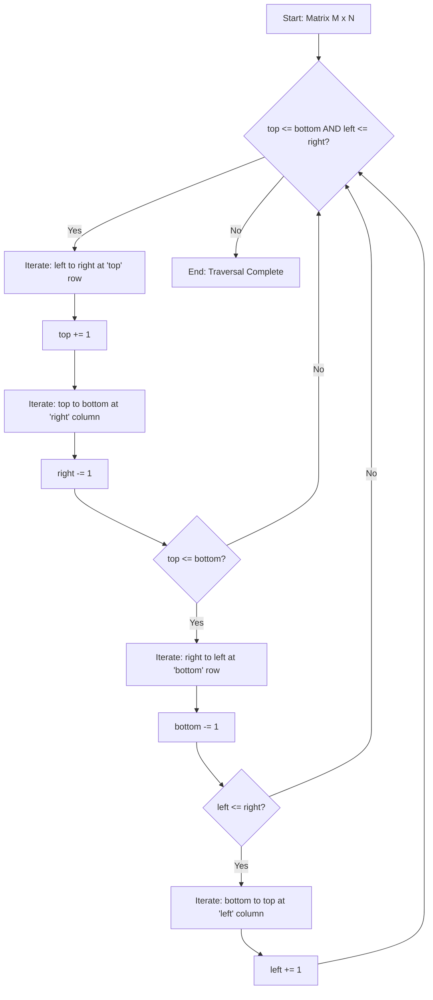

# Matrix Operations: 2D Arrays, Rotation, Transposition, and Spiral Traversal

> A matrix is a rectangular array of elements arranged in rows and columns, serving as the fundamental data structure for representing linear transformations, spatial data, and grid-based systems in computational space.

## 1. Historical Background & Motivation

The formalization of matrix theory began in the mid-19th century, primarily through the work of **Arthur Cayley** and **James Joseph Sylvester**. In 1858, Cayley published *"A Memoir on the Theory of Matrices,"* which decoupled the study of matrices from the study of determinants, establishing matrices as independent mathematical entities. Sylvester, who actually coined the term "matrix" (Latin for "womb," as he viewed the matrix as the generator of determinants), collaborated with Cayley to develop the algebraic rules that define how matrices are added, multiplied, and inverted.

In the modern computing era, the transition from theoretical linear algebra to efficient matrix operations became the backbone of computer science. The rise of Computer-Aided Design (CAD) in the 1960s and the subsequent birth of 3D computer graphics required high-performance transformations—specifically rotations and projections—calculated thousands of times per second. Today, matrix operations are the "atomic units" of Deep Learning. Whether it is the convolution layers in a Vision Transformer or the weight updates in a Large Language Model (LLM), the ability to manipulate 2D arrays efficiently (often via BLAS—Basic Linear Algebra Subprograms) determines the feasibility of modern AI. Understanding the low-level manipulation of these structures, such as transposition and spiral traversal, is critical for optimizing cache performance and implementing complex spatial algorithms.

## 2. Visual Intuition
:::demo
<div style="background:#1e1e1e;padding:16px;border-radius:10px;color:#e5e7eb;font-family:system-ui,sans-serif">
  <h3 style="margin:0 0 8px 0;color:#7dd3fc">Matrix Operations: 2D Arrays, Rotation, Transposition, and Spiral Traversal - Concept Map</h3>
  <svg width="100%" height="280" viewBox="0 0 640 280" role="img" aria-label="Matrix Operations: 2D Arrays, Rotation, Transposition, and Spiral Traversal visual intuition" style="background:#111827;border-radius:8px">
    <rect x="24" y="28" width="180" height="64" rx="10" fill="#1d4ed8" />
    <text x="114" y="66" text-anchor="middle" fill="#e5e7eb" font-size="14">Problem</text>
    <rect x="230" y="28" width="180" height="64" rx="10" fill="#0f766e" />
    <text x="320" y="66" text-anchor="middle" fill="#e5e7eb" font-size="14">Process</text>
    <rect x="436" y="28" width="180" height="64" rx="10" fill="#7c3aed" />
    <text x="526" y="66" text-anchor="middle" fill="#e5e7eb" font-size="14">Outcome</text>

    <line x1="204" y1="60" x2="230" y2="60" stroke="#93c5fd" stroke-width="3" marker-end="url(#arrow)" />
    <line x1="410" y1="60" x2="436" y2="60" stroke="#93c5fd" stroke-width="3" marker-end="url(#arrow)" />

    <rect x="24" y="130" width="592" height="120" rx="10" fill="#0b1220" stroke="#334155" />
    <text x="320" y="156" text-anchor="middle" fill="#cbd5e1" font-size="14">Key intuition for Matrix Operations: 2D Arrays, Rotation, Transposition, and Spiral Traversal</text>
    <text x="320" y="182" text-anchor="middle" fill="#94a3b8" font-size="12">Track state changes, constraints, and final behavior.</text>
    <text x="320" y="206" text-anchor="middle" fill="#94a3b8" font-size="12">Use this as a mental model before formal proofs or code.</text>

    <defs>
      <marker id="arrow" markerWidth="10" markerHeight="10" refX="8" refY="3" orient="auto">
        <polygon points="0 0, 10 3, 0 6" fill="#93c5fd" />
      </marker>
    </defs>
  </svg>
  <p style="margin-top:10px;color:#cbd5e1">Interactive-ready visual scaffold for the topic.</p>
</div>
:::
*Caption: A visual demonstration of Matrix Transposition, where elements $A[i][j]$ are mapped to $A[j][i]$, effectively flipping the matrix across its main diagonal.*

## 3. Core Theory & Mathematical Foundations

### 3.1 Memory Layout and Physical Mapping
In computer memory, "2D arrays" do not actually exist as physical grids. Memory is a linear sequence of bytes. Therefore, a matrix $M$ of dimensions $R \times C$ must be mapped to a 1D sequence via a mapping function. There are two primary layouts:

1.  **Row-Major Order** (Standard in C, C++, Python): Elements of a row are stored contiguously.
    The address of element $M[i][j]$ is calculated as:
    $$\text{Index} = i \times C + j$$
2.  **Column-Major Order** (Standard in Fortran, MATLAB, R): Elements of a column are stored contiguously.
    The address of element $M[i][j]$ is calculated as:
    $$\text{Index} = j \times R + i$$

Understanding this is vital for **spatial locality**. Accessing $M[0][0], M[0][1], M[0][2]$ in row-major order is fast because these elements likely reside in the same CPU cache line. Accessing $M[0][0], M[1][0], M[2][0]$ (vertical traversal) results in "strided" access, which can cause significant cache misses if the matrix is large.

### 3.2 Matrix Transposition
The transpose of a matrix $A$, denoted as $A^T$, is obtained by reflecting the matrix over its main diagonal. Formally, if $A$ is an $m \times n$ matrix, then $A^T$ is an $n \times m$ matrix such that:
$$(A^T)_{ij} = A_{ji}$$
For a square matrix ($n \times n$), an in-place transposition is possible by swapping $A[i][j]$ and $A[j][i]$ for all $i < j$. This maintains a space complexity of $O(1)$.

### 3.3 Matrix Rotation
Rotation is a transformation that moves every element by a specific angle around a center point. In competitive programming and technical interviews, we usually focus on $90^\circ$ increments.

A $90^\circ$ clockwise rotation can be decomposed into two simpler steps:
1.  **Transpose** the matrix: $A[i][j] \leftrightarrow A[j][i]$
2.  **Reverse each row**: $A[i][j] \leftrightarrow A[i][n-1-j]$

Mathematically, a rotation of a point $(x, y)$ in a Cartesian plane by $\theta$ is represented by the rotation matrix $R$:
$$R = \begin{pmatrix} \cos\theta & -\sin\theta \\ \sin\theta & \cos\theta \end{pmatrix}$$
In a discrete grid (matrix) where the top-left is $(0,0)$, the transformation for $90^\circ$ clockwise rotation maps index $(i, j)$ to $(j, N-1-i)$.

### 3.4 Spiral Traversal Logic
Spiral traversal involves visiting every element of a matrix in a clockwise spiral pattern starting from the top-left $(0, 0)$. This is not a standard linear transformation but a boundary-management problem. We define four boundaries: `top`, `bottom`, `left`, and `right`. After traversing a boundary, we "shrink" the search space by incrementing or decrementing the respective boundary variable until the boundaries cross.

### 3.5 Formal Analysis (Complexity / Correctness)
**Time Complexity:** For any operation that visits every element (Transpose, Rotate, Spiral, Search), the complexity is $\Theta(M \times N)$, where $M$ is the number of rows and $N$ is the number of columns. This is asymptotically optimal as we must at least read each value.

**Space Complexity:**
-   **In-place Rotation/Transpose:** $O(1)$ auxiliary space.
-   **Out-of-place:** $O(M \times N)$ to store the result.

**Proof Sketch for In-place Rotation:**
To rotate a square matrix in-place without a full transpose-then-reverse, we can perform a 4-way swap of elements. For a layer $k$, we swap:
-   $Temp = Top[i]$
-   $Top[i] = Left[i]$
-   $Left[i] = Bottom[i]$
-   $Bottom[i] = Right[i]$
-   $Right[i] = Temp$
This demonstrates that $O(1)$ space is sufficient because we only ever hold one element in a temporary register at a time.

## 4. Algorithm / Process (Step-by-Step)

### Spiral Traversal Algorithm:
1.  **Initialize Boundaries:** `top = 0`, `bottom = R-1`, `left = 0`, `right = C-1`.
2.  **While** `top <= bottom` and `left <= right`:
    a.  **Traverse Left to Right:** Move from `left` to `right` along the `top` row. Increment `top`.
    b.  **Traverse Top to Bottom:** Move from `top` to `bottom` along the `right` column. Decrement `right`.
    c.  **Check Boundary:** If `top <= bottom` (to avoid redundant traversal in single-row cases):
        i.  **Traverse Right to Left:** Move from `right` to `left` along the `bottom` row. Decrement `bottom`.
    d.  **Check Boundary:** If `left <= right` (to avoid redundant traversal in single-column cases):
        i.  **Traverse Bottom to Top:** Move from `bottom` to `top` along the `left` column. Increment `left`.
3.  **End.**

## 5. Visual Diagram


*Caption: The control flow logic for a Spiral Traversal, illustrating the boundary-shrinking mechanism.*

## 6. Implementation

### 6.1 Core Implementation: Spiral Traversal and Rotation

```python
from typing import List

def rotate_matrix_90_clockwise(matrix: List[List[int]]) -> None:
    """
    Rotates an n x n matrix 90 degrees clockwise in-place.
    Complexity: Time O(N^2), Space O(1).
    """
    n = len(matrix)
    
    # Step 1: Transpose the matrix
    # Mapping: matrix[i][j] -> matrix[j][i]
    for i in range(n):
        for j in range(i + 1, n):
            matrix[i][j], matrix[j][i] = matrix[j][i], matrix[i][j]
            
    # Step 2: Reverse each row
    # Mapping: matrix[i][j] -> matrix[i][n-1-j]
    for i in range(n):
        matrix[i].reverse()

def spiral_order(matrix: List[List[int]]) -> List[int]:
    """
    Returns all elements of an m x n matrix in spiral order.
    Complexity: Time O(M*N), Space O(M*N) to store result.
    """
    if not matrix or not matrix[0]:
        return []
    
    rows, cols = len(matrix), len(matrix[0])
    top, bottom = 0, rows - 1
    left, right = 0, cols - 1
    result = []
    
    while top <= bottom and left <= right:
        # Traverse Right
        for j in range(left, right + 1):
            result.append(matrix[top][j])
        top += 1
        
        # Traverse Down
        for i in range(top, bottom + 1):
            result.append(matrix[i][right])
        right -= 1
        
        if top <= bottom:
            # Traverse Left
            for j in range(right, left - 1, -1):
                result.append(matrix[bottom][j])
            bottom -= 1
            
        if left <= right:
            # Traverse Up
            for i in range(bottom, top - 1, -1):
                result.append(matrix[i][left])
            left += 1
            
    return result

# Sample Execution
if __name__ == "__main__":
    test_matrix = [
        [1, 2, 3],
        [4, 5, 6],
        [7, 8, 9]
    ]
    print(f"Spiral Order: {spiral_order(test_matrix)}")
    # Expected: [1, 2, 3, 6, 9, 8, 7, 4, 5]
    
    rotate_matrix_90_clockwise(test_matrix)
    print("Rotated Matrix:")
    for row in test_matrix:
        print(row)
    # Expected: [7,4,1], [8,5,2], [9,6,3]
```

### 6.2 Optimized / Production Variant (NumPy style)
In production environments (Data Science/ML), we use vectorization via libraries like NumPy to leverage SIMD (Single Instruction, Multiple Data) instructions.

```python
import numpy as np

def production_rotate(matrix_data: List[List[int]]):
    """
    Uses numpy for high-performance matrix manipulation.
    """
    arr = np.array(matrix_data)
    # np.rot90 is highly optimized C/Fortran under the hood
    # k=-1 signifies 90 degrees clockwise
    return np.rot90(arr, k=-1).tolist()
```

### 6.3 Common Pitfalls in Code
-   **Row vs Column Confusion:** Always use `matrix[row][col]`. It is easy to accidentally write `matrix[j][i]` and cause an `IndexError` in non-square matrices.
-   **Empty Input:** Always check `if not matrix or not matrix[0]` to handle cases with zero rows or columns.
-   **Spiral Redundancy:** In `spiral_order`, forgetting the `if top <= bottom` check inside the loop will cause the algorithm to re-traverse the middle row/column in odd-dimensioned matrices.
-   **In-place Modification:** In interviews, clarify if you can modify the input. If not, you must allocate a new 2D array, which changes space complexity from $O(1)$ to $O(N^2)$.

## 7. Interactive Demo

:::demo
<!-- title: Spiral Traversal Visualizer -->
<!DOCTYPE html>
<html>
<head>
<meta charset="utf-8">
<style>
  body { margin:0; background:#0f1117; color:#e5e7eb; font-family: system-ui, sans-serif; font-size:13px; padding:16px; }
  .grid { display: grid; grid-template-columns: repeat(5, 50px); gap: 5px; margin: 20px 0; }
  .cell { width: 50px; height: 50px; background: #1f2937; border: 1px solid #374151; display: flex; align-items: center; justify-content: center; font-weight: bold; border-radius: 4px; transition: all 0.3s; }
  .cell.active { background: #3b82f6; color: white; transform: scale(1.1); box-shadow: 0 0 15px rgba(59, 130, 246, 0.5); }
  .cell.visited { background: #064e3b; color: #10b981; }
  .controls { display: flex; gap: 10px; margin-bottom: 20px; }
  button { background: #3b82f6; color: white; border: none; padding: 8px 16px; border-radius: 4px; cursor: pointer; }
  button:disabled { background: #4b5563; }
  .status { font-family: monospace; color: #10b981; }
</style>
</head>
<body>
  <h3>Spiral Traversal Visualizer</h3>
  <div class="controls">
    <button id="startBtn">Start Animation</button>
    <button id="resetBtn">Reset</button>
  </div>
  <div class="status" id="status">Ready...</div>
  <div class="grid" id="grid"></div>

<script>
  const ROWS = 5, COLS = 5;
  const grid = document.getElementById('grid');
  const status = document.getElementById('status');
  const cells = [];

  function initGrid() {
    grid.innerHTML = '';
    cells.length = 0;
    for(let i=0; i<ROWS*COLS; i++) {
      const div = document.createElement('div');
      div.className = 'cell';
      div.innerText = i + 1;
      grid.appendChild(div);
      cells.push(div);
    }
  }

  async function animateSpiral() {
    document.getElementById('startBtn').disabled = true;
    let top = 0, bottom = ROWS-1, left = 0, right = COLS-1;
    
    while(top <= bottom && left <= right) {
      for(let i=left; i<=right; i++) await highlight(top, i);
      top++;
      for(let i=top; i<=bottom; i++) await highlight(i, right);
      right--;
      if(top <= bottom) {
        for(let i=right; i>=left; i--) await highlight(bottom, i);
        bottom--;
      }
      if(left <= right) {
        for(let i=bottom; i>=top; i--) await highlight(i, left);
        left++;
      }
    }
    status.innerText = "Traversal Complete!";
  }

  function highlight(r, c) {
    return new Promise(resolve => {
      const idx = r * COLS + c;
      const cell = cells[idx];
      cell.classList.add('active');
      status.innerText = `Visiting: Matrix[${r}][${c}]`;
      setTimeout(() => {
        cell.classList.remove('active');
        cell.classList.add('visited');
        resolve();
      }, 300);
    });
  }

  document.getElementById('startBtn').addEventListener('click', animateSpiral);
  document.getElementById('resetBtn').addEventListener('click', () => {
    initGrid();
    document.getElementById('startBtn').disabled = false;
    status.innerText = "Ready...";
  });

  initGrid();
</script>
</body>
</html>
:::

## 8. Worked Examples

### Example 1 — Rotating a $3 \times 3$ Matrix
Matrix $M$:
```
[1, 2, 3]
[4, 5, 6]
[7, 8, 9]
```
**Step 1: Transpose** (Swap $M[i][j]$ with $M[j][i]$)
- Swap (0,1) and (1,0): 2 and 4
- Swap (0,2) and (2,0): 3 and 7
- Swap (1,2) and (2,1): 6 and 8
Result after Transpose:
```
[1, 4, 7]
[2, 5, 8]
[3, 6, 9]
```
**Step 2: Reverse Rows**
- Row 0: `[1, 4, 7]` becomes `[7, 4, 1]`
- Row 1: `[2, 5, 8]` becomes `[8, 5, 2]`
- Row 2: `[3, 6, 9]` becomes `[9, 6, 3]`
**Final Result:**
```
[7, 4, 1]
[8, 5, 2]
[9, 6, 3]
```

### Example 2 — Spiral Traversal of a $2 \times 4$ Matrix
Matrix $M$:
```
[1, 2, 3, 4]
[5, 6, 7, 8]
```
1.  `top=0, bottom=1, left=0, right=3`
2.  Traverse Right (top=0): `1, 2, 3, 4`. Increment `top` to 1.
3.  Traverse Down (right=3): `8`. Decrement `right` to 2.
4.  Check `top <= bottom` (1 <= 1): True.
5.  Traverse Left (bottom=1): `7, 6, 5`. Decrement `bottom` to 0.
6.  Check `left <= right` (0 <= 2): True.
7.  Traverse Up (left=0): No elements left because `bottom` (0) is not $\geq$ `top` (1).
**Result:** `[1, 2, 3, 4, 8, 7, 6, 5]`

## 9. Comparison with Alternatives

| Approach | Time | Space | Pros | Cons | Best Used When |
|---|---|---|---|---|---|
| **In-place Swap** | $O(N^2)$ | $O(1)$ | Memory efficient | Only works for square matrices | Embedded systems, large datasets |
| **New Array Allocation** | $O(N^2)$ | $O(N^2)$ | Simplest to implement, works for any $M \times N$ | Memory heavy | Small matrices, functional programming |
| **Recursive Spiral** | $O(N^2)$ | $O(N)$ | Elegant logic | Risk of StackOverflow for massive matrices | Academic exercises, small $N$ |
| **Vectorized (NumPy)** | $O(N^2)$ | $O(N^2)$ | Extremely fast (C speed) | External dependency | Data Science, ML, production apps |

## 10. Industry Applications & Real Systems

-   **Image Processing (Adobe Photoshop / OpenCV)**: Every digital image is a 2D matrix of pixels. Rotating an image $90^\circ$ uses the exact Transpose + Reverse algorithm. At scale, this is implemented using SIMD instructions to process multiple pixels simultaneously.
-   **Game Development (Unity / Unreal Engine)**: 2D tile-based games (like *SimCity* or *Stardew Valley*) store maps in 2D arrays. Pathfinding algorithms (A*) traverse these matrices to find routes between points.
-   **Database Systems (Google BigTable / Apache Cassandra)**: These are "wide-column" stores that can be conceptually viewed as massive, sparse 2D matrices. Operations often involve scanning specific "rows" or "columns," where memory layout (row-major vs column-major) determines query latency.
-   **Recommendation Engines (Netflix / Amazon)**: User-item interactions are stored in a "Utility Matrix." Since this matrix is too large to fit in memory, engineers use **Matrix Factorization** (Singular Value Decomposition) to decompose the matrix into lower-dimensional representations.

## 11. Practice Problems

### 🟢 Easy
1.  **Transpose Matrix**: Given a 2D array, return its transpose.
    *Hint: Create a new matrix of dimensions $C \times R$.*
    *Expected complexity: $O(M \times N)$*

### 🟡 Medium
2.  **Rotate Image**: Rotate an $N \times N$ matrix by $90^\circ$ clockwise in-place.
    *Hint: Transpose then reverse.*
    *Expected complexity: $O(N^2)$ time, $O(1)$ space.*

3.  **Spiral Matrix II**: Given an integer $n$, generate an $n \times n$ matrix filled with elements from $1$ to $n^2$ in spiral order.
    *Hint: Use the boundary-shrinking method but assign values instead of reading them.*

### 🔴 Hard
4.  **Diagonal Traverse II**: Given a list of lists where rows have different lengths, return all elements in diagonal order.
    *Hint: Elements on the same diagonal have the same sum of indices $(i+j)$.*
    *Expected complexity: $O(\text{Total Elements})$*

5.  **Search a 2D Matrix II**: Write an efficient algorithm that searches for a value in an $m \times n$ matrix where rows and columns are sorted.
    *Hint: Start at the top-right corner. If target is smaller, move left; if larger, move down.*

## 12. Interactive Quiz

:::quiz
**Q1: For a matrix stored in Row-Major order with $C$ columns, what is the 1D memory index of element `matrix[i][j]`?**
- A) $j \times R + i$
- B) $i \times C + j$
- C) $(i + j) \times C$
- D) $i \times j$
> B — This is the standard mapping function where we skip $i$ full rows (each of size $C$) and then move $j$ columns deep into the current row.

**Q2: Why is transposing a matrix then reversing its rows equivalent to a $90^\circ$ clockwise rotation?**
- A) It isn't; it's a $90^\circ$ counter-clockwise rotation.
- B) Transposition flips over $y=x$, and reversing rows flips over the vertical axis; the composition results in the rotation.
- C) It is just a heuristic that only works for square matrices.
- D) Because the determinant remains constant.
> B — Mathematically, the mapping $(i, j) \to (j, i) \to (j, n-1-i)$ correctly represents a $90^\circ$ CW rotation.

**Q3: What is the primary risk of using a simple recursive approach for Spiral Traversal?**
- A) $O(N^3)$ complexity
- B) Cache thrashing
- C) StackOverflow on large matrices
- D) Floating point errors
> C — Each "layer" of the spiral adds a frame to the call stack. For a $10,000 \times 10,000$ matrix, you would have $5,000$ recursive calls, potentially exceeding default stack limits.

**Q4: In the Spiral Traversal algorithm, why do we need the second check `if top <= bottom` before moving left?**
- A) To handle non-square matrices where the last "spiral" might only be a single horizontal row.
- B) To prevent an infinite loop.
- C) To ensure we only visit prime numbers.
- D) Python requires it for list slicing.
> A — Without this check, if the matrix has an odd number of rows, the middle row would be traversed left-to-right, and then incorrectly traversed right-to-left again.

**Q5: Which memory layout is preferred for a matrix multiplication $A \times B$ to maximize cache hits?**
- A) Both Row-Major
- B) Both Column-Major
- C) A in Row-Major, B in Column-Major
- D) A in Column-Major, B in Row-Major
> C — Multiplication involves $A$'s rows and $B$'s columns. Storing them such that the accessed elements are contiguous in memory significantly improves performance.
:::

## 13. Interview Preparation

### Conceptual Questions
**Q: Explain how you would rotate a matrix by $180^\circ$ as if teaching it to a fellow engineer.**
*A: A $180^\circ$ rotation is conceptually simpler than $90^\circ$. You can think of it as reversing the matrix twice: first, reverse the order of the rows, and then reverse the order of the elements within each row. Alternatively, it is equivalent to a full reversal of the 1D array representation if the matrix is treated as a flat list, or performing two $90^\circ$ rotations. In-place, you swap $M[i][j]$ with $M[n-1-i][n-1-j]$.*

**Q: What are the time and space complexities of rotating an $N \times N$ matrix? Derive them.**
*A: The time complexity is $O(N^2)$ because we must visit each of the $N^2$ elements at least once to move it to its new location. Even with the transpose-reverse method, we perform $N^2/2$ swaps for transposition and $N^2/2$ swaps for reversal, totaling $N^2$ operations, which is $O(N^2)$. The space complexity is $O(1)$ if we perform the swaps in-place using a temporary variable, as no additional data structures proportional to the input size are required.*

**Q: How does cache locality affect your choice of matrix traversal?**
*A: Modern CPUs load data in "cache lines" (typically 64 bytes). In a row-major language like Python or C++, accessing `matrix[i][j]` followed by `matrix[i][j+1]` is a "cache-friendly" access because the next element is already in the cache. Traversing column-wise (`matrix[i][j]` followed by `matrix[i+1][j]`) requires jumping $C$ elements forward in memory. If $C$ is large, this jump exceeds the cache line, forcing a slow fetch from Main Memory (RAM). For high-performance systems, we often use "blocking" or "tiling" to process small sub-matrices that fit entirely in the L1 cache.*

### Quick Reference (Cheat Sheet)
| Property | Value |
|---|---|
| Time Complexity (Traversal) | $O(M \times N)$ |
| Space Complexity (In-place) | $O(1)$ |
| Transpose Mapping | $A[i][j] \to A[j][i]$ |
| $90^\circ$ CW Mapping | $A[i][j] \to A[j][n-1-i]$ |
| Row-Major Index | $i \times \text{cols} + j$ |

## 14. Key Takeaways
1.  **Matrices are 1D arrays** under the hood; the "2D" part is an abstraction handled by the mapping function $i \times C + j$.
2.  **Transposition is the foundation** of most matrix rotations. Master it first.
3.  **Boundary management** is the secret to spiral traversal. Use four pointers (`top`, `bottom`, `left`, `right`) and update them strictly.
4.  **Cache Locality matters.** Always try to process data row-by-row in Row-Major languages to minimize cache misses.
5.  **Non-square matrices** are the "trap" in interview questions. Always test your logic with a $2 \times 5$ or $5 \times 2$ matrix.
6.  **In-place vs. Out-of-place**: Always clarify this constraint. In-place rotation is a common "Hard" variant of an "Easy" problem.

## 15. Common Misconceptions
-   ❌ **"A 2D array in Python is a single block of memory."** → ✅ **Not exactly.** In Python, a 2D list is a list of pointers to other lists. This adds an extra layer of indirection compared to C's `int arr[R][C]`.
-   ❌ **"Rotating a matrix $90^\circ$ is $O(N)$."** → ✅ **Incorrect.** It is $O(N^2)$. People often confuse the dimension $N$ with the number of elements $N^2$.
-   ❌ **"Matrix Transpose is only possible for square matrices."** → ✅ **False.** Any $M \times N$ matrix can be transposed to an $N \times M$ matrix; it just cannot be done in-place easily if the dimensions differ.

## 16. Further Reading
-   **Introduction to Algorithms (CLRS), Chapter 28**: Matrix Operations and Strassen's Algorithm.
-   **Linear Algebra and Its Applications (Gilbert Strang)**: For the mathematical intuition behind transformations.
-   **What Every Computer Scientist Should Know About Floating-Point Arithmetic (David Goldberg)**: Crucial for understanding matrix precision in scientific computing.
-   **Modern Processor Design (Shen & Lipasti)**: To understand the cache hierarchy and why row-major access is faster.

## 17. Related Topics
-   [[complexity-analysis]] — For analyzing nested loops in matrix operations.
-   [[dynamic-arrays]] — How Python's list of lists is structured.
-   [[recursion-basics]] — For alternative implementations of spiral traversal.
-   [[search-algorithms]] — Matrix search techniques (Binary search on 2D).
