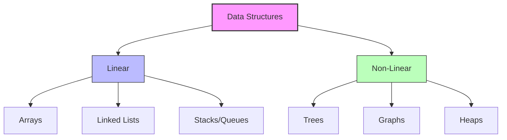

# Data Structures — Course Overview

> Data structures are the architectural blueprints of computer science, defining how we organize, store, and manipulate data to optimize computational efficiency.

## Overview
Data Structures are specialized formats for organizing, processing, retrieving, and storing data. In computer science, the "data" is the raw material, but the "structure" determines the intelligence of the system. From the simple contiguous memory blocks of an array to the complex, pointer-heavy topologies of a red-black tree, the choice of structure directly governs the performance characteristics of every algorithm that interacts with that data.

Historically, the study of data structures emerged alongside the development of high-level programming languages in the 1960s and 70s. As software systems grew from simple calculators to distributed global infrastructures, the need for formal rigor became paramount. Today, data structures are the foundational bedrock of everything from kernel-level memory management and database indexing to modern web frameworks. Mastering them is not merely about memorizing implementations; it is about developing an intuition for the trade-offs between speed, memory, and scalability.

Choosing the appropriate data structure requires a deep understanding of the problem constraints. An engineer must weigh the frequency of specific operations—such as search, insertion, and deletion—against the memory overhead. A failure to select the correct structure is a leading cause of technical debt and production performance bottlenecks in large-scale software systems.

## 2. Visual Intuition
:::demo
<div style="background:#1e1e1e;padding:16px;border-radius:10px;color:#e5e7eb;font-family:system-ui,sans-serif">
  <h3 style="margin:0 0 8px 0;color:#7dd3fc">Data Structures — Course Overview - Concept Map</h3>
  <svg width="100%" height="280" viewBox="0 0 640 280" role="img" aria-label="Data Structures — Course Overview visual intuition" style="background:#111827;border-radius:8px">
    <rect x="24" y="28" width="180" height="64" rx="10" fill="#1d4ed8" />
    <text x="114" y="66" text-anchor="middle" fill="#e5e7eb" font-size="14">Problem</text>
    <rect x="230" y="28" width="180" height="64" rx="10" fill="#0f766e" />
    <text x="320" y="66" text-anchor="middle" fill="#e5e7eb" font-size="14">Process</text>
    <rect x="436" y="28" width="180" height="64" rx="10" fill="#7c3aed" />
    <text x="526" y="66" text-anchor="middle" fill="#e5e7eb" font-size="14">Outcome</text>

    <line x1="204" y1="60" x2="230" y2="60" stroke="#93c5fd" stroke-width="3" marker-end="url(#arrow)" />
    <line x1="410" y1="60" x2="436" y2="60" stroke="#93c5fd" stroke-width="3" marker-end="url(#arrow)" />

    <rect x="24" y="130" width="592" height="120" rx="10" fill="#0b1220" stroke="#334155" />
    <text x="320" y="156" text-anchor="middle" fill="#cbd5e1" font-size="14">Key intuition for Data Structures — Course Overview</text>
    <text x="320" y="182" text-anchor="middle" fill="#94a3b8" font-size="12">Track state changes, constraints, and final behavior.</text>
    <text x="320" y="206" text-anchor="middle" fill="#94a3b8" font-size="12">Use this as a mental model before formal proofs or code.</text>

    <defs>
      <marker id="arrow" markerWidth="10" markerHeight="10" refX="8" refY="3" orient="auto">
        <polygon points="0 0, 10 3, 0 6" fill="#93c5fd" />
      </marker>
    </defs>
  </svg>
  <p style="margin-top:10px;color:#cbd5e1">Interactive-ready visual scaffold for the topic.</p>
</div>
:::
*Caption: An animated demonstration of elements being inserted into a Binary Search Tree, maintaining the ordering property where smaller values reside in left subtrees and larger values in right subtrees.*

## Core Theory

### Complexity Analysis and Big O
Complexity analysis allows us to quantify the performance of an algorithm as a function of its input size, denoted as $n$. We use **Big O notation** to describe the upper bound of an algorithm’s growth rate.

*   **Constant Time $O(1)$:** Operations take the same time regardless of input size.
*   **Logarithmic Time $O(\log n)$:** Typically found in divide-and-conquer algorithms (e.g., Binary Search).
*   **Linear Time $O(n)$:** The time grows proportionally with the number of elements.
*   **Linearithmic Time $O(n \log n)$:** The standard complexity for efficient comparison-based sorting.
*   **Quadratic Time $O(n^2)$:** Often seen in nested loops.

Amortized analysis is critical for structures like dynamic arrays (e.g., Python `list`), where most operations are $O(1)$, but occasional expensive resizes occur, leading to an average cost calculation:
$$T_{amortized} = \frac{\sum_{i=1}^{n} cost_i}{n}$$

### Classification
1.  **Linear Structures:** Elements are arranged sequentially (e.g., Arrays, Linked Lists, Stacks, Queues).
2.  **Non-Linear Structures:** Hierarchical or networked data (e.g., Trees, Graphs).
3.  **Hash-based:** Map keys to values using a hash function, theoretically providing $O(1)$ lookups.
4.  **Priority-based:** Heaps maintain partial ordering to allow $O(1)$ access to extreme values.

## Visual Diagram

*A taxonomy diagram categorizing data structures into linear and non-linear families.*

## Code Example
```python
# Demonstrating the performance trade-off: List vs Set for lookups
import time

# Create a list and a set of 1 million integers
data_size = 1_000_000
my_list = list(range(data_size))
my_set = set(range(data_size))

# Search for the last element
target = 999_999

# Time list search (O(n))
start = time.perf_counter()
_ = target in my_list
end = time.perf_counter()
print(f"List lookup time: {end - start:.6f} seconds")

# Time set search (O(1))
start = time.perf_counter()
_ = target in my_set
end = time.perf_counter()
print(f"Set lookup time: {end - start:.6f} seconds")

# Expected Output:
# List lookup time: ~0.015 seconds
# Set lookup time: ~0.000001 seconds
```

## Interactive Demo
:::demo
<!DOCTYPE html>
<html>
<body style="background:#1a1a1a; color:white;">
  <h3>Stack LIFO Visualization</h3>
  <div id="stack" style="border: 2px solid #555; width: 100px; height: 200px; display: flex; flex-direction: column-reverse; align-items: center;"></div>
  <button onclick="push()">Push</button>
  <script>
    let stack = [];
    function push() {
      stack.push(Math.floor(Math.random() * 100));
      render();
    }
    function render() {
      const container = document.getElementById('stack');
      container.innerHTML = stack.map(val => `<div style="background:blue; width:80%; margin:2px;">${val}</div>`).join('');
    }
  </script>
</body>
</html>
:::

## Worked Example
**Scenario:** Finding the median of a stream of numbers.
1.  **Step 1:** Maintain two heaps: a Max-Heap for the lower half and a Min-Heap for the upper half.
2.  **Step 2:** Insert a new value $x$ into the appropriate heap.
3.  **Step 3:** Rebalance heaps such that their sizes differ by at most 1.
4.  **Step 4:** If total count is even, median = (max\_heap.top + min\_heap.top) / 2. If odd, the top of the larger heap is the median.
*This approach ensures $O(\log n)$ insertion and $O(1)$ access.*

## Industry Applications
- **Database Indexing:** B-Trees/LSM Trees are used by **PostgreSQL** and **RocksDB** for rapid data retrieval.
- **Routing:** **Google Maps** uses Dijkstra’s algorithm (Graph/Heap) to find the shortest path in road networks.
- **Caching:** **Redis** utilizes Hash Maps and Skip Lists for high-speed key-value access.
- **Operating Systems:** **Linux Kernel** uses Red-Black trees for process scheduling and file system management.

## Practice Problems

### Easy
1. Reverse a Linked List. *(Hint: Use three pointers: prev, curr, and next.)*

### Medium
2. Implement a queue using two stacks. *(Hint: Use one for 'inbox' and one for 'outbox'.)*
3. Design a LRU Cache. *(Hint: Combine a Doubly Linked List with a Hash Map.)*

### Hard
4. Find the Median from a Data Stream using heaps. *(Hint: Manage a max-heap and min-heap balance.)*

## Interactive Quiz
:::quiz
**Q1:** What is the average time complexity of searching in a Hash Table?
- A) $O(n)$
- B) $O(1)$
- C) $O(\log n)$
- D) $O(n \log n)$
> B — Hash tables compute an index using a hash function, providing direct access to the bucket.

**Q2:** Which structure is best for LIFO (Last-In-First-Out) operations?
- A) Queue
- B) Linked List
- C) Stack
- D) Priority Queue
> C — Stacks explicitly follow the Last-In-First-Out constraint.

**Q3:** What is the primary advantage of a Binary Search Tree over an Array for dynamic data?
- A) Faster memory access
- B) Improved insertion/deletion efficiency
- C) Lower space usage
- D) Guaranteed $O(1)$ search
> B — Trees offer $O(\log n)$ insertions/deletions, whereas arrays require $O(n)$ to shift elements.
:::

## Interview Questions
**Q: Explain the difference between an Array and a Linked List.**
*A: Arrays provide $O(1)$ random access due to contiguous memory, whereas Linked Lists offer efficient $O(1)$ insertions/deletions at the head but require $O(n)$ to traverse or reach a specific index.*

**Q: What is the complexity of deleting from a Binary Heap?**
*A: Deleting the root is $O(\log n)$, as it requires removing the root and performing a 'sift-down' operation to restore the heap property.*

**Q: Why use a Hash Table if it has a worst-case $O(n)$?**
*A: The worst case is a rare occurrence dependent on the hash function quality. With a good hash function, $O(1)$ is the probabilistic average, making it superior for high-performance lookup.*

**Q: How would you design a system to detect cycle in a directed graph?**
*A: Use Depth First Search (DFS) with a recursion stack tracker to identify "back edges" that point to an ancestor node currently in the stack.*

## Key Takeaways
- Complexity notation ($O, \Omega, \Theta$) is the standard language for performance.
- Choosing between space and time is a design requirement.
- Linear structures (Arrays, Lists) vs Non-Linear (Trees, Graphs) define data relationships.
- Amortized analysis helps understand structures that resize dynamically.
- Always clarify the "most frequent operation" before selecting a structure.

## Common Misconceptions
- ❌ All trees are balanced → ✅ Most trees (like unbalanced BSTs) can degenerate into $O(n)$ linked lists.
- ❌ Hash tables always perform better than arrays → ✅ Arrays have better cache locality; for small datasets, arrays are often faster.

## Related Topics
- [[Algorithms]] — The logic that operates on these structures.
- [[Complexity-Analysis]] — The mathematical framework for Big O.
- [[Memory-Management]] — Understanding the underlying hardware reality.
