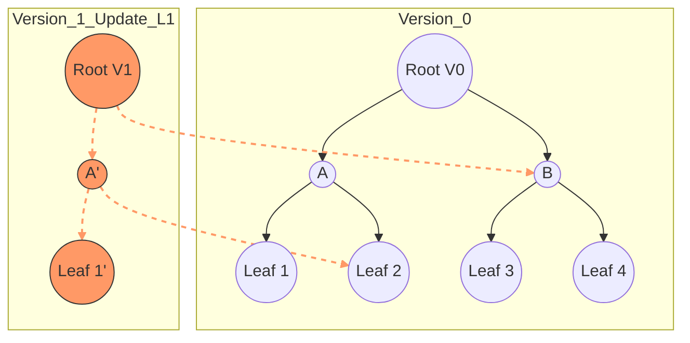

# Persistent Data Structures: Immutable Updates and Functional Trees

> A persistent data structure is a data structure that always preserves the previous version of itself when it is modified, allowing for queries and sometimes updates across the entire history of the structure.

## 1. Historical Background & Motivation

The concept of persistence in data structures emerged primarily from the intersection of functional programming research and geometric algorithms. While early Lisp implementations implicitly used persistent linked lists through `cons` cells (where the original list remains intact after prepending a new element), the formal mathematical treatment was codified in the late 1980s. The seminal work "Making Data Structures Persistent" (1986) by James Driscoll, Neil Sarnak, Daniel Sleator, and Robert Tarjan provided the theoretical framework for transforming ephemeral (ordinary) data structures into persistent ones. 

The motivation was two-fold. First, in computational geometry, algorithms for point location in a planar subdivision could be simplified by viewing one spatial dimension as "time," effectively turning a static 2D problem into a dynamic 1D problem using a persistent segment tree. Second, as functional programming languages like Haskell and ML gained traction, developers required efficient ways to maintain "immutability" without the $O(N)$ overhead of deep-copying structures on every update. In modern computing, persistence is the backbone of version control systems like Git, undo-redo buffers in text editors, and state management libraries like Redux or Immer.

## 2. Visual Intuition
:::demo
<div style="background:#1e1e1e;padding:16px;border-radius:10px;color:#e5e7eb;font-family:system-ui,sans-serif">
  <h3 style="margin:0 0 8px 0;color:#7dd3fc">Persistent Data Structures: Immutable Updates and Functional Trees - Concept Map</h3>
  <svg width="100%" height="280" viewBox="0 0 640 280" role="img" aria-label="Persistent Data Structures: Immutable Updates and Functional Trees visual intuition" style="background:#111827;border-radius:8px">
    <rect x="24" y="28" width="180" height="64" rx="10" fill="#1d4ed8" />
    <text x="114" y="66" text-anchor="middle" fill="#e5e7eb" font-size="14">Problem</text>
    <rect x="230" y="28" width="180" height="64" rx="10" fill="#0f766e" />
    <text x="320" y="66" text-anchor="middle" fill="#e5e7eb" font-size="14">Process</text>
    <rect x="436" y="28" width="180" height="64" rx="10" fill="#7c3aed" />
    <text x="526" y="66" text-anchor="middle" fill="#e5e7eb" font-size="14">Outcome</text>

    <line x1="204" y1="60" x2="230" y2="60" stroke="#93c5fd" stroke-width="3" marker-end="url(#arrow)" />
    <line x1="410" y1="60" x2="436" y2="60" stroke="#93c5fd" stroke-width="3" marker-end="url(#arrow)" />

    <rect x="24" y="130" width="592" height="120" rx="10" fill="#0b1220" stroke="#334155" />
    <text x="320" y="156" text-anchor="middle" fill="#cbd5e1" font-size="14">Key intuition for Persistent Data Structures: Immutable Updates and Functional Trees</text>
    <text x="320" y="182" text-anchor="middle" fill="#94a3b8" font-size="12">Track state changes, constraints, and final behavior.</text>
    <text x="320" y="206" text-anchor="middle" fill="#94a3b8" font-size="12">Use this as a mental model before formal proofs or code.</text>

    <defs>
      <marker id="arrow" markerWidth="10" markerHeight="10" refX="8" refY="3" orient="auto">
        <polygon points="0 0, 10 3, 0 6" fill="#93c5fd" />
      </marker>
    </defs>
  </svg>
  <p style="margin-top:10px;color:#cbd5e1">Interactive-ready visual scaffold for the topic.</p>
</div>
:::
*Caption: When inserting a new node into a persistent tree, we do not modify existing nodes. Instead, we create a new path from the root to the new node, while reusing (sharing) the subtrees that did not change. This is called **Path Copying**.*

## 3. Core Theory & Mathematical Foundations

Persistence is categorized into four distinct levels based on the operations allowed on previous versions:
1.  **Partially Persistent:** All versions can be queried, but only the latest version can be modified. This creates a linear history.
2.  **Fully Persistent:** All versions can be both queried and modified. This creates a version tree.
3.  **Confluently Persistent:** Versions can be merged to create a new version from two or more predecessors. This creates a Directed Acyclic Graph (DAG) of versions.
4.  **Functional (Ephemeral-Persistent):** Structures that are strictly immutable, typically found in purely functional languages.

### 3.1 Structural Sharing
The primary mechanism for achieving efficiency in persistent structures is **structural sharing**. If a data structure is represented as a graph (like a tree or a linked list), an update only affects a small subset of nodes. By copying only the affected nodes and pointing their children/neighbors to the original, unchanged nodes of the previous version, we minimize space.

For a tree of height $H$, a single point update requires copying only $O(H)$ nodes. In a balanced Binary Search Tree (BST), this translates to $O(\log N)$ space and time per update, rather than $O(N)$.

### 3.2 The Fat Node Method
In the "Fat Node" approach, we don't create new nodes. Instead, each node is "fat"—it can hold multiple values and version stamps. 
Formally, each node $u$ contains a list of modifications $(version, value, pointer)$.
- **Query:** To find the value of node $u$ at version $i$, we perform a binary search on the version list of $u$ to find the largest version $j \le i$.
- **Update:** Append a new version record to the node.
While this makes updates $O(1)$ (amortized), it makes queries $O(\log V)$ where $V$ is the number of versions.

### 3.3 Path Copying
Path copying is the standard for functional trees. When a leaf is updated, every ancestor of that leaf up to the root must be duplicated because their child pointers must change to point to the new versions. 
If $T$ is a tree and $f(T)$ is a modification:
$$T_{new} = \{ \text{new nodes for path } root \to node \} \cup \{ \text{shared subtrees from } T_{old} \}$$

### 3.4 Formal Analysis of Path Copying
Let $n$ be the number of elements and $m$ be the number of updates.
- **Time Complexity:** For a balanced tree, each update visits $\lceil \log_2 n \rceil$ nodes. Since we allocate a new node for each visited node, the update time is $O(\log n)$.
- **Space Complexity:** Each update creates $O(\log n)$ new nodes. After $m$ updates, the total space is $O(n + m \log n)$.
- **Query Complexity:** Queries operate exactly like standard BST queries on a specific root version, yielding $O(\log n)$.

## 4. Algorithm / Process (Step-by-Step)

### Procedure: Persistent Segment Tree Point Update
Let's define the process for updating a value at index $idx$ in a segment tree representing an array, creating a new version.

1.  **Identify Version:** Start with the root pointer of the most recent version $V_{curr}$.
2.  **Path Traversal:** Traverse down from the root toward the leaf representing index $idx$.
3.  **Node Duplication:** For every node $u$ on the path:
    -   Create a new node $u'$.
    -   Copy the data (e.g., sum, max) from $u$ to $u'$.
    -   If $idx$ is in the left child's range:
        -   $u'.left = \text{recurse on } u.left$
        -   $u'.right = u.right$ (Point to the **old** version's right child—this is the sharing step).
    -   Else ($idx$ is in the right range):
        -   $u'.left = u.left$ (Share old left child).
        -   $u'.right = \text{recurse on } u.right$.
4.  **Base Case:** At the leaf node, create a new leaf with the updated value.
5.  **Backtrack:** As the recursion unwinds, update the internal metadata of the new nodes $u'$ based on their new children.
6.  **Store Root:** Store the pointer to the new root $u'_{root}$ in a version array `roots[version_id]`.

## 5. Visual Diagram


*Caption: In Version 1, only the nodes on the path to Leaf 1 are recreated (orange). All other nodes (B0, L2, L3, L4) are shared between Version 0 and Version 1.*

## 6. Implementation

### 6.1 Core Implementation: Persistent Segment Tree
This implementation supports point updates and range queries across different versions.

```python
class Node:
    def __init__(self, val, left=None, right=None):
        self.val = val
        self.left = left
        self.right = right

class PersistentSegmentTree:
    def __init__(self, arr):
        self.n = len(arr)
        self.roots = [self._build(arr, 0, self.n - 1)]

    def _build(self, arr, l, r):
        """Build initial segment tree: O(N)"""
        if l == r:
            return Node(arr[l])
        mid = (l + r) // 2
        left_child = self._build(arr, l, mid)
        right_child = self._build(arr, mid + 1, r)
        return Node(left_child.val + right_child.val, left_child, right_child)

    def update(self, version_idx, pos, new_val):
        """Create new version with arr[pos] = new_val: O(log N)"""
        root = self.roots[version_idx]
        new_root = self._update_recursive(root, 0, self.n - 1, pos, new_val)
        self.roots.append(new_root)
        return len(self.roots) - 1

    def _update_recursive(self, node, l, r, pos, val):
        if l == r:
            return Node(val)
        
        mid = (l + r) // 2
        # Path copying: create a new node
        new_node = Node(node.val) 
        if pos <= mid:
            # Update left, share right
            new_node.left = self._update_recursive(node.left, l, mid, pos, val)
            new_node.right = node.right
        else:
            # Update right, share left
            new_node.left = node.left
            new_node.right = self._update_recursive(node.right, mid + 1, r, pos, val)
        
        # Recompute internal value
        new_node.val = new_node.left.val + new_node.right.val
        return new_node

    def query(self, version_idx, l, r, ql, qr):
        """Query range sum [ql, qr] in a specific version: O(log N)"""
        node = self.roots[version_idx]
        return self._query_recursive(node, l, r, ql, qr)

    def _query_recursive(self, node, l, r, ql, qr):
        if ql <= l and r <= qr:
            return node.val
        mid = (l + r) // 2
        res = 0
        if ql <= mid:
            res += self._query_recursive(node.left, l, mid, ql, qr)
        if qr > mid:
            res += self._query_recursive(node.right, mid + 1, r, ql, qr)
        return res

# Example Usage
# Initial array: [1, 2, 3, 4]
# Version 0: sum = 10
# Update index 1 to 10: [1, 10, 3, 4] -> Version 1 sum = 18
pst = PersistentSegmentTree([1, 2, 3, 4])
pst.update(0, 1, 10)

print(f"Version 0 Sum [0,3]: {pst.query(0, 0, 3, 0, 3)}") # Output: 10
print(f"Version 1 Sum [0,3]: {pst.query(1, 0, 3, 0, 3)}") # Output: 18
```

### 6.2 Optimized Variant: Hashed Array Mapped Trie (HAMT)
In industry-grade persistent collections (like those in Clojure or Immutable.js), we use **HAMT**. It uses a hash of the key to navigate a high-branching factor trie (usually 32-way). This keeps the tree very shallow ($O(\log_{32} N)$), making "effectively constant" time updates and lookups.

### 6.3 Common Pitfalls in Code
1.  **Memory Leaks:** In languages without garbage collection (C++), persistent structures can easily leak nodes. Use reference counting (e.g., `std::shared_ptr`).
2.  **Implicit Mutation:** Ensuring that the "old" nodes are truly immutable is critical. In Python, one could accidentally modify `node.left` instead of assigning a new node to `new_node.left`.
3.  **Recursive Depth:** For very large arrays, the recursion depth of $O(\log N)$ is usually safe, but in extreme cases, an iterative approach with an explicit stack might be needed to avoid `RecursionError`.

## 7. Interactive Demo

:::demo
<!-- title: Persistent Tree Path-Copying Visualizer -->
<!DOCTYPE html>
<html>
<head>
<meta charset="utf-8">
<style>
  body { margin:0; background:#0f1117; color:#e5e7eb; font-family: system-ui, sans-serif; font-size:13px; padding:16px; overflow: hidden; }
  canvas { background: #1a1d23; border-radius: 8px; cursor: crosshair; }
  .controls { position: absolute; top: 20px; left: 20px; background: rgba(0,0,0,0.7); padding: 15px; border-radius: 8px; border: 1px solid #333; }
  button { background: #3b82f6; color: white; border: none; padding: 6px 12px; border-radius: 4px; cursor: pointer; margin-right: 5px; }
  button:hover { background: #2563eb; }
  .info { margin-top: 10px; color: #9ca3af; line-height: 1.4; }
  .version-tag { display: inline-block; padding: 2px 6px; background: #ef4444; color: white; border-radius: 4px; font-weight: bold; }
</style>
</head>
<body>
  <div class="controls">
    <h3>Persistent Path Copying</h3>
    <button onclick="addNode()">Add Random Leaf</button>
    <button onclick="reset()">Reset</button>
    <div class="info">
      <p>Nodes in <span style="color:#f96">Orange</span> are new nodes created for Version N.</p>
      <p>Nodes in <span style="color:#3b82f6">Blue</span> are shared with previous versions.</p>
      <p id="stats">Versions: 1 | Total Nodes: 7</p>
    </div>
  </div>
  <canvas id="treeCanvas"></canvas>

<script>
  const canvas = document.getElementById('treeCanvas');
  const ctx = canvas.getContext('2d');
  canvas.width = window.innerWidth;
  canvas.height = window.innerHeight;

  class Node {
    constructor(val, x, y, left = null, right = null) {
      this.val = val;
      this.x = x;
      this.y = y;
      this.left = left;
      this.right = right;
      this.isNew = false;
    }
  }

  let versions = [];
  let currentVersion = 0;

  function buildInitialTree(depth, x, y, offset) {
    if (depth === 0) return new Node(Math.floor(Math.random()*100), x, y);
    const node = new Node(0, x, y);
    node.left = buildInitialTree(depth - 1, x - offset, y + 80, offset / 2);
    node.right = buildInitialTree(depth - 1, x + offset, y + 80, offset / 2);
    node.val = node.left.val + node.right.val;
    return node;
  }

  function copyAndPath(node, targetLeafVal) {
    // This simplifies the "update" by just picking a random path to "new" data
    if (!node.left && !node.right) {
      const newNode = new Node(Math.floor(Math.random()*100), node.x, node.y);
      newNode.isNew = true;
      return newNode;
    }
    const newNode = new Node(node.val, node.x, node.y);
    newNode.isNew = true;
    if (Math.random() > 0.5) {
      newNode.left = copyAndPath(node.left, targetLeafVal);
      newNode.right = node.right; // Share
    } else {
      newNode.left = node.left; // Share
      newNode.right = copyAndPath(node.right, targetLeafVal);
    }
    newNode.val = (newNode.left ? newNode.left.val : 0) + (newNode.right ? newNode.right.val : 0);
    return newNode;
  }

  function drawTree(node, isNewVersion = false) {
    if (!node) return;
    
    if (node.left) {
      ctx.beginPath();
      ctx.moveTo(node.x, node.y);
      ctx.lineTo(node.left.x, node.left.y);
      ctx.strokeStyle = (node.left.isNew) ? '#f96' : '#334155';
      ctx.lineWidth = (node.left.isNew) ? 3 : 1;
      ctx.stroke();
      drawTree(node.left, isNewVersion);
    }
    if (node.right) {
      ctx.beginPath();
      ctx.moveTo(node.x, node.y);
      ctx.lineTo(node.right.x, node.right.y);
      ctx.strokeStyle = (node.right.isNew) ? '#f96' : '#334155';
      ctx.lineWidth = (node.right.isNew) ? 3 : 1;
      ctx.stroke();
      drawTree(node.right, isNewVersion);
    }

    ctx.beginPath();
    ctx.arc(node.x, node.y, 18, 0, Math.PI * 2);
    ctx.fillStyle = node.isNew ? '#f96' : '#3b82f6';
    ctx.fill();
    ctx.fillStyle = '#fff';
    ctx.textAlign = 'center';
    ctx.fillText(node.val, node.x, node.y + 5);
  }

  function animate() {
    ctx.clearRect(0, 0, canvas.width, canvas.height);
    if (versions.length > 0) {
      drawTree(versions[versions.length - 1]);
    }
    requestAnimationFrame(animate);
  }

  function addNode() {
    const oldRoot = versions[versions.length - 1];
    // Reset isNew flags for the visual
    const clearFlags = (n) => { if(!n) return; n.isNew = false; clearFlags(n.left); clearFlags(n.right); };
    clearFlags(oldRoot);
    
    const newRoot = copyAndPath(oldRoot, 99);
    versions.push(newRoot);
    document.getElementById('stats').innerText = `Versions: ${versions.length} | Path Copying creates log(N) new nodes.`;
  }

  function reset() {
    versions = [buildInitialTree(3, canvas.width / 2, 80, 200)];
  }

  reset();
  animate();
</script>
</body>
</html>
:::

## 8. Worked Examples

### Example 1 — Persistent Array Updates
Suppose we have an array `A = [5, 10, 15, 20]` and we want to perform two operations:
1. `Update(index 2, value 30)` to create Version 1.
2. `Query(Version 0, range [1, 2])`.

**Step 1: Version 0 Build**
- Leaf Nodes: $L_0=5, L_1=10, L_2=15, L_3=20$.
- Parents: $P_{01}=15, P_{23}=35$.
- Root: $R_0=50$.

**Step 2: Version 1 Update (Index 2)**
- Identify path to $L_2$: $R_0 \to P_{23} \to L_2$.
- Create $L_2' = 30$.
- Create $P_{23}'$ where $left = L_2'$ and $right = L_3$ (shared).
- $P_{23}'.val = 30 + 20 = 50$.
- Create $R_1$ where $left = P_{01}$ (shared) and $right = P_{23}'$.
- $R_1.val = 15 + 50 = 65$.

**Step 3: Query Version 0**
- Access $R_0$. Range $[1, 2]$ splits into $L_1$ and $L_2$.
- Result: $10 + 15 = 25$. 
- Note: This uses the *original* $L_2=15$, even though Version 1 exists.

### Example 2 — The "K-th Smallest" Problem
A classic use of persistence is finding the $k$-th smallest element in a range $[L, R]$ of an array.
1.  **Pre-process:** Build a persistent segment tree where Version $i$ represents the frequency of elements in the prefix $Arr[0 \dots i]$.
2.  **Query:** To query range $[L, R]$, look at the *difference* between Version $R$ and Version $L-1$.
    -   If the count of elements in the left subtree of $(Root_R - Root_{L-1})$ is $\ge k$, the answer is in the left child.
    -   Else, recurse right with $k = k - count_{left}$.
This reduces a complex range query to $O(\log (\max A_i))$ time.

## 9. Comparison with Alternatives

| Approach | Update Time | Query Time | Space per Update | Best Used When |
|---|---|---|---|---|
| **Ephemeral Structure** | $O(\log N)$ | $O(\log N)$ | $O(1)$ | No need for history/undo. |
| **Fat Nodes** | $O(1)^*$ | $O(\log V \cdot \log N)$ | $O(1)^*$ | Space is extremely limited. |
| **Path Copying** | $O(\log N)$ | $O(\log N)$ | $O(\log N)$ | Functional programming, BSTs. |
| **Full Copying** | $O(N)$ | $O(\log N)$ | $O(N)$ | Tiny structures or few versions. |

*Note: Fat nodes require amortized analysis and complex garbage collection.*

## 10. Industry Applications & Real Systems

-   **Git (Version Control System):** Git uses a Merkle Tree structure, which is a form of persistent tree. When you commit a change, Git doesn't duplicate the whole repository; it creates new "tree" objects for the changed directories that point to the existing "blob" objects for unchanged files.
-   **React/Redux (UI State):** Redux encourages "reducer" functions that treat state as immutable. By using structural sharing (often via libraries like Immer), React can determine if a component needs re-rendering by doing a simple reference check ($O(1)$) rather than a deep comparison ($O(N)$).
-   **Databases (MVCC):** Multi-Version Concurrency Control (used in PostgreSQL and CouchDB) allows multiple transactions to read and write without locking. Readers query a "snapshot" (a persistent version) while writers create a new version.
-   **Clojure Programming Language:** Clojure's core data structures (Maps, Vectors, Sets) are all persistent Hashed Array Mapped Tries. This allows for safe multi-threaded programming without locks, as every thread sees its own immutable version of the data.

## 11. Practice Problems

### 🟢 Easy
1.  **Persistent Stack:** Implement a stack where `push` and `pop` return a new version of the stack.
    *Hint: A linked list where each node points to the previous head is naturally persistent.*
    *Expected complexity: $O(1)$ time and space.*

### 🟡 Medium
2.  **History Array:** Implement an array where you can `set(index, val)` and `get(index, version)`.
    *Hint: Use a Persistent Segment Tree or a list of versions for each index.*
    *Expected complexity: $O(\log N)$ update and query.*

3.  **Point in Versioned Range:** Given a series of point updates to an array, find the maximum element in range $[L, R]$ as it existed at version $T$.

### 🔴 Hard
4.  **K-th Smallest in Range:** Given an array of $10^5$ elements, answer $10^5$ queries: "What is the $k$-th smallest element in the sub-segment $A[L \dots R]$?"
    *Hint: Use the prefix-versioned segment tree technique from Section 8.*
    *Expected complexity: $O(N \log N)$ preprocessing, $O(\log N)$ per query.*

5.  **Confluent Merge:** Implement a persistent tree that supports a `merge(root1, root2)` operation that combines two versions into one in $O(\log N)$ time.

## 12. Interactive Quiz

:::quiz
**Q1: Why is "Path Copying" preferred over "Fat Nodes" in most functional languages?**
- A) Fat nodes are slower for updates.
- B) Path copying allows the use of standard, unmodified tree query algorithms.
- C) Fat nodes require $O(N)$ space per version.
- D) Path copying uses $O(1)$ space.
> B — Because path copying creates a "new" root that looks like a standard tree, you can pass it to any existing search or traversal function without changing the logic.

**Q2: What is the space complexity of making $M$ updates to a persistent balanced BST with $N$ nodes?**
- A) $O(N + M)$
- B) $O(N \cdot M)$
- C) $O(N + M \log N)$
- D) $O(N \log N + M)$
> C — The initial tree takes $O(N)$, and each of the $M$ updates creates a new path of length $O(\log N)$.

**Q3: In a persistent segment tree update, if the update index is in the left subtree, what happens to the right child of the new node?**
- A) It is set to NULL.
- B) A new right child is created as a copy.
- C) It points to the right child of the old node.
- D) The update is aborted.
> C — This is structural sharing. Since the right subtree remains unchanged, we simply reuse the pointer to the old version's right child.

**Q4: Which industry tool uses persistence principles to handle branching and merging?**
- A) Redis
- B) Git
- C) Apache Kafka
- D) MySQL
> B — Git's object model is a persistent directed acyclic graph where commits share tree and blob objects.

**Q5: What is a major disadvantage of strictly persistent structures in languages like C?**
- A) They are impossible to implement.
- B) They require manual memory management and reference counting to avoid leaks.
- C) They cannot be used for search.
- D) They always require $O(N)$ time per update.
> B — Unlike functional languages with built-in GC, C/C++ requires careful tracking of node references since many versions might share a single node.
:::

## 13. Interview Preparation

### Conceptual Questions

**Q: Explain Persistent Data Structures as if teaching it to a fellow engineer.**
*A: Persistent data structures are "versioned" collections. Unlike standard structures where an update overwrites the old data, a persistent update returns a new pointer to the modified structure while keeping the original intact. The key trick is structural sharing: we only copy the path of nodes that changed ($O(\log N)$) and point the new nodes back to the existing unchanged subtrees. This gives us the power of full history without the $O(N)$ cost of copying everything.*

**Q: What are the time and space complexities of a persistent BST?**
*A: In a balanced persistent BST, both search and update take $O(\log N)$ time. Space complexity for an update is $O(\log N)$ because we must create new nodes for every ancestor of the updated leaf. For $M$ updates, the total space is $O(N + M \log N)$. This is significantly better than $O(NM)$ for full copies but more expensive than the $O(N)$ space of an ephemeral BST.*

**Q: How would you choose between a Persistent Segment Tree and a standard Array with a History log?**
*A: If you only need to query history rarely and mostly work on the latest version, a history log (or "Fat Node" approach) might save space. However, if you need to perform complex range queries on any version at any time, a Persistent Segment Tree is superior because it provides $O(\log N)$ guarantees for all versions, whereas searching a log could degenerate to $O(M)$ where $M$ is the number of changes.*

### Quick Reference (Cheat Sheet)

| Property | Value |
|---|---|
| Update Time (Tree) | $O(\log N)$ |
| Query Time (Tree) | $O(\log N)$ |
| Space (per update) | $O(\log N)$ |
| Structural Sharing | Yes |
| Thread Safe | Yes (Immutable) |

## 14. Key Takeaways
1.  **Immutability is Power:** Persistence makes data structures thread-safe and allows for "Time Travel" debugging.
2.  **Structural Sharing:** The efficiency of persistence relies on reusing nodes from previous versions.
3.  **Path Copying:** Updating a node requires duplicating its entire path to the root.
4.  **$O(\log N)$ is the Standard:** Most persistent tree operations mirror the time complexity of their ephemeral counterparts with a logarithmic space trade-off.
5.  **Garbage Collection:** Persistent structures generate many short-lived objects; they perform best in environments with efficient GCs (like the JVM or V8).

## 15. Common Misconceptions
- ❌ **"Persistent means saved to disk."** → ✅ In this context, persistence refers to *versioning in memory*. While these can be serialized to disk, the term refers to the structure's logical history.
- ❌ **"Persistent structures are slower for queries."** → ✅ Path-copied trees have the exact same query performance as standard trees.
- ❌ **"You have to copy the whole tree to be persistent."** → ✅ No, structural sharing ensures we only copy the path that changed.

## 16. Further Reading
- *Introduction to Algorithms (CLRS)* — Chapter on Advanced Data Structures (some editions).
- *Purely Functional Data Structures* by Chris Okasaki — The definitive book on this topic.
- *Driscoll et al. (1986)* — "Making Data Structures Persistent."
- *Clojure's Implementation of HAMT* — A deep dive into how industrial-grade persistence works.

## 17. Related Topics
- [[complexity-analysis]] — For analyzing the space-time trade-off of versioning.
- [[recursion-basics]] — Fundamental for implementing path-copying logic.
- [[string-operations]] — Persistent tries are often used for efficient string storage (Ropes).
- [[singly-linked-list]] — The simplest example of a persistent structure (via the head pointer).
