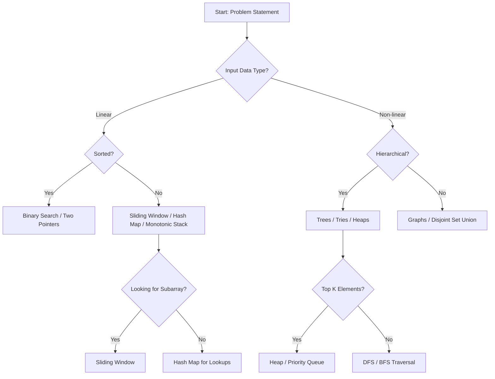

# Placement Guide: Data Structures Interview Tips and Common Patterns

> **Placement Mastery** — The systematic identification of algorithmic motifs and the mapping of problem constraints to optimal data structure selection to achieve efficient $O(f(n))$ time and space bounds.

## 1. Historical Background & Motivation

The modern coding interview is an evolution of the "brain teaser" era initiated by Microsoft in the 1990s. Initially, candidates were asked puzzles like "Why are manhole covers round?" to gauge abstract reasoning. However, as software systems scaled to billions of users at companies like Google and Amazon, the industry realized that reasoning about data structure efficiency was a better predictor of engineering success. The shift moved toward rigorous algorithmic analysis, influenced heavily by the seminal work of Cormen, Leiserson, Rivest, and Stein (CLRS).

In contemporary engineering, especially at FAANG (Facebook, Amazon, Apple, Netflix, Google) and high-frequency trading firms, the "Placement Guide" represents the bridge between academic theory and production-grade software. The ability to recognize a "Sliding Window" pattern or a "Monotonic Stack" requirement isn't just a trick for interviews; it is the same skill used to optimize database indexing, design network packet buffers, and manage memory in low-latency environments. This chapter systematizes these patterns to transform interview preparation from memorization into an engineering discipline.

## 2. Visual Intuition
:::demo
<div style="background:#1e1e1e;padding:16px;border-radius:10px;color:#e5e7eb;font-family:system-ui,sans-serif">
  <h3 style="margin:0 0 8px 0;color:#7dd3fc">Placement Guide: Data Structures Interview Tips and Common Patterns - Concept Map</h3>
  <svg width="100%" height="280" viewBox="0 0 640 280" role="img" aria-label="Placement Guide: Data Structures Interview Tips and Common Patterns visual intuition" style="background:#111827;border-radius:8px">
    <rect x="24" y="28" width="180" height="64" rx="10" fill="#1d4ed8" />
    <text x="114" y="66" text-anchor="middle" fill="#e5e7eb" font-size="14">Problem</text>
    <rect x="230" y="28" width="180" height="64" rx="10" fill="#0f766e" />
    <text x="320" y="66" text-anchor="middle" fill="#e5e7eb" font-size="14">Process</text>
    <rect x="436" y="28" width="180" height="64" rx="10" fill="#7c3aed" />
    <text x="526" y="66" text-anchor="middle" fill="#e5e7eb" font-size="14">Outcome</text>

    <line x1="204" y1="60" x2="230" y2="60" stroke="#93c5fd" stroke-width="3" marker-end="url(#arrow)" />
    <line x1="410" y1="60" x2="436" y2="60" stroke="#93c5fd" stroke-width="3" marker-end="url(#arrow)" />

    <rect x="24" y="130" width="592" height="120" rx="10" fill="#0b1220" stroke="#334155" />
    <text x="320" y="156" text-anchor="middle" fill="#cbd5e1" font-size="14">Key intuition for Placement Guide: Data Structures Interview Tips and Common Patterns</text>
    <text x="320" y="182" text-anchor="middle" fill="#94a3b8" font-size="12">Track state changes, constraints, and final behavior.</text>
    <text x="320" y="206" text-anchor="middle" fill="#94a3b8" font-size="12">Use this as a mental model before formal proofs or code.</text>

    <defs>
      <marker id="arrow" markerWidth="10" markerHeight="10" refX="8" refY="3" orient="auto">
        <polygon points="0 0, 10 3, 0 6" fill="#93c5fd" />
      </marker>
    </defs>
  </svg>
  <p style="margin-top:10px;color:#cbd5e1">Interactive-ready visual scaffold for the topic.</p>
</div>
:::
*Caption: The hierarchical relationship between abstract data types (ADTs) and their concrete implementations. Choosing the right "path" in this hierarchy is the core of interview success.*

## 3. Core Theory & Mathematical Foundations

### 3.1 The Constraint-Complexity Mapping
In technical interviews, the input size $N$ is the most significant clue to the expected time complexity. This is rooted in the physical limits of modern CPUs, which typically execute $\approx 10^8$ operations per second.

$$
\begin{array}{|l|l|}
\hline
\text{Constraint } (N) & \text{Expected Complexity} \\
\hline
N \le 10 & O(N!) \text{ or } O(2^N \cdot N^2) \\
N \le 20 & O(2^N) \text{ or } O(N \cdot 2^N) \\
N \le 500 & O(N^3) \\
N \le 5000 & O(N^2) \\
N \le 10^5 & O(N \log N) \text{ or } O(N) \\
N \le 10^7 & O(N) \text{ or } O(\log N) \\
\hline
\end{array}
$$

### 3.2 The Master Theorem and Patterns
Many interview patterns rely on recursive divide-and-conquer. The Master Theorem provides the foundation for their analysis:
$$T(n) = aT(n/b) + f(n)$$
where $a \ge 1$ is the number of subproblems, $n/b$ is the size of each subproblem, and $f(n)$ is the cost of work outside the recursive calls. Understanding this allows a candidate to justify why a "Divide and Conquer" approach (like Merge Sort) is $O(N \log N)$ while a "Tree Traversal" (visiting every node) is $O(N)$.

### 3.3 Amortized Analysis in Patterns
Certain patterns, like the **Monotonic Stack** or **Two Pointers**, involve nested loops that at first glance appear to be $O(N^2)$. However, we use the **Aggregate Method** of amortized analysis to prove they are $O(N)$.

**Theorem:** If each element in a sequence is pushed onto a stack exactly once and popped at most once, the total time for $N$ operations is $O(N)$.
*Proof:* Let $P$ be the number of push operations and $O$ be the number of pop operations. Since $P \le N$ and $O \le P$, the total operations $P + O \le 2N$. Thus, the total complexity is $O(N)$, regardless of how many pops occur in a single iteration of the outer loop.

### 3.4 The Pigeonhole Principle in Cycle Detection
The **Fast and Slow Pointer** pattern (Tortoise and Hare) relies on the Pigeonhole Principle. In a finite state machine (or linked list with a cycle), if you traverse more elements than the total number of unique states, you *must* revisit a state.
Mathematically, if a cycle starts at index $\mu$ and has length $\lambda$, then the pointers meet at a step $k$ where:
$$k \equiv 2k \pmod \lambda \implies k \text{ is a multiple of } \lambda$$

## 4. Algorithm / Process (Step-by-Step)

The "Unified Interview Framework" consists of five distinct phases:

1.  **Clarification & Constraint Discovery:**
    *   Ask about data types (Integers? Strings?).
    *   Check for duplicates and negatives.
    *   Determine the size of $N$ to establish the "Big-O Target."

2.  **Pattern Matching (The Signal Phase):**
    *   *Signal:* "Top K", "Frequent", "Closest" $\to$ **Heap / Priority Queue**.
    *   *Signal:* "Sorted Array", "Sum equals X" $\to$ **Two Pointers**.
    *   *Signal:* "Subarray", "Contiguous", "Shortest/Longest" $\to$ **Sliding Window**.
    *   *Signal:* "Tree", "Graph", "Shortest Path" $\to$ **BFS/DFS**.
    *   *Signal:* "Dependencies", "Ordering" $\to$ **Topological Sort**.

3.  **The Brute Force Blueprint:**
    *   Verbally describe the $O(N^2)$ or $O(2^N)$ approach. This sets a baseline and prevents "brain freeze."

4.  **Optimization via Data Structures:**
    *   Can we trade space for time? (e.g., using a **Hash Map** [[dynamic-arrays]]).
    *   Can we process elements once? (e.g., using a **Monotonic Stack** [[stack-implementation]]).

5.  **Dry Run & Code:**
    *   Trace the logic with a small, non-trivial example (e.g., $N=4$ with one edge case).

## 5. Visual Diagram


*Caption: A decision tree for mapping problem types to optimal data structure patterns.*

## 6. Implementation

### 6.1 Core Implementation: The Sliding Window Template
The sliding window is the most common interview pattern. This implementation solves the "Longest Substring with K Distinct Characters" problem.

```python
def longest_substring_k_distinct(s: str, k: int) -> int:
    """
    Finds the length of the longest substring with at most k distinct characters.
    Complexity: O(N) Time, O(K) Space.
    
    Args:
        s: Input string
        k: Maximum distinct characters allowed
    Returns:
        Int: Maximum length found
    """
    if k == 0:
        return 0
        
    window_start = 0
    max_length = 0
    char_frequency = {}

    # Iterate through the string using 'window_end' as the leading pointer
    for window_end in range(len(s)):
        right_char = s[window_end]
        char_frequency[right_char] = char_frequency.get(right_char, 0) + 1

        # If we exceed k distinct characters, shrink the window from the left
        while len(char_frequency) > k:
            left_char = s[window_start]
            char_frequency[left_char] -= 1
            if char_frequency[left_char] == 0:
                del char_frequency[left_char]
            window_start += 1 # Shrink phase
            
        # Current window [window_start, window_end] is valid
        max_length = max(max_length, window_end - window_start + 1)

    return max_length

# Sample Input/Output
# Input: s="araaci", k=2
# Output: 4 (Substring: "araa")
# Input: s="cbbebi", k=3
# Output: 5 (Substring: "bbebi")
```

### 6.2 Optimized Variant: The Monotonic Stack
Used for "Next Greater Element" problems. This is a crucial $O(N)$ optimization over the $O(N^2)$ brute force.

```python
def next_greater_element(nums):
    """
    Finds the next greater element for every index in the array.
    Uses a Monotonic Decreasing Stack.
    Complexity: O(N) Time, O(N) Space.
    """
    res = [-1] * len(nums)
    stack = [] # Stores indices

    for i in range(len(nums)):
        # While stack is not empty and current element is greater than 
        # the element at the index stored on top of the stack
        while stack and nums[i] > nums[stack[-1]]:
            index = stack.pop()
            res[index] = nums[i]
        stack.append(i)
        
    return res

# Example: [2, 1, 2, 4, 3] -> [4, 2, 4, -1, -1]
```

### 6.3 Common Pitfalls in Code
*   **Off-by-one in Windows:** Forgetting that `window_end - window_start + 1` is the length of the window.
*   **Integer Overflow:** In Python, integers have arbitrary precision, but in Java/C++, `(left + right) // 2` can overflow. Use `left + (right - left) // 2`.
*   **Empty Inputs:** Always check `if not input_data: return 0`.
*   **Updating State before Shrink:** In Sliding Window, ensure the frequency map is updated *before* checking the `while` condition.

## 7. Interactive Demo

:::demo
<!-- title: Sliding Window Visualization (Dynamic) -->
<!DOCTYPE html>
<html>
<head>
<meta charset="utf-8">
<style>
  body { margin:0; background:#0f1117; color:#e5e7eb; font-family: 'Segoe UI', Tahoma, Geneva, Verdana, sans-serif; font-size:14px; padding:20px; }
  .container { display: flex; flex-direction: column; align-items: center; gap: 20px; }
  .array-container { display: flex; gap: 8px; position: relative; padding: 20px; background: #1f2937; border-radius: 8px; }
  .cell { width: 40px; height: 40px; border: 2px solid #374151; display: flex; align-items: center; justify-content: center; font-weight: bold; border-radius: 4px; transition: all 0.3s; }
  .active-window { background: rgba(59, 130, 246, 0.2); border-color: #3b82f6; }
  .pointer { position: absolute; top: -10px; font-size: 12px; font-weight: bold; color: #f59e0b; transition: all 0.3s; }
  .controls { display: flex; gap: 10px; }
  button { background: #3b82f6; color: white; border: none; padding: 8px 16px; border-radius: 4px; cursor: pointer; font-weight: 600; }
  button:disabled { background: #4b5563; cursor: not-allowed; }
  .stats { background: #111827; padding: 15px; border-radius: 8px; width: 100%; max-width: 400px; border-left: 4px solid #3b82f6; }
</style>
</head>
<body>
<div class="container">
  <h3>Sliding Window: Max Sum Subarray (Size K=3)</h3>
  <div class="array-container" id="array-box">
    <!-- Generated by JS -->
  </div>
  <div class="controls">
    <button id="prevBtn" onclick="step(-1)">Previous</button>
    <button id="nextBtn" onclick="step(1)">Next Step</button>
    <button id="resetBtn" onclick="reset()">Reset</button>
  </div>
  <div class="stats">
    <div>Current Window Sum: <span id="currSum">0</span></div>
    <div>Max Sum Seen: <span id="maxSum">0</span></div>
    <div id="status-msg" style="margin-top:10px; color:#9ca3af;">Click "Next Step" to begin.</div>
  </div>
</div>

<script>
  const data = [2, 1, 5, 1, 3, 2, 10, 1];
  const K = 3;
  let currentStep = -1;
  let maxSum = 0;
  let currSum = 0;

  function init() {
    const box = document.getElementById('array-box');
    box.innerHTML = '';
    data.forEach((val, i) => {
      const div = document.createElement('div');
      div.className = 'cell';
      div.id = `cell-${i}`;
      div.innerText = val;
      box.appendChild(div);
    });
    updateUI();
  }

  function step(dir) {
    if (dir === 1 && currentStep < data.length - 1) {
      currentStep++;
      if (currentStep < K) {
        currSum += data[currentStep];
        if (currentStep === K - 1) maxSum = currSum;
      } else {
        currSum = currSum + data[currentStep] - data[currentStep - K];
        maxSum = Math.max(maxSum, currSum);
      }
    } else if (dir === -1 && currentStep >= 0) {
      // Simplification: Resetting for backward logic in demo
      reset();
      return;
    }
    updateUI();
  }

  function reset() {
    currentStep = -1;
    maxSum = 0;
    currSum = 0;
    updateUI();
  }

  function updateUI() {
    const cells = document.querySelectorAll('.cell');
    const start = Math.max(0, currentStep - K + 1);
    const end = currentStep;

    cells.forEach((cell, i) => {
      cell.classList.remove('active-window');
      if (currentStep >= K - 1 && i >= start && i <= end) {
        cell.classList.add('active-window');
      } else if (currentStep < K - 1 && i <= currentStep) {
        cell.classList.add('active-window');
      }
    });

    document.getElementById('currSum').innerText = (currentStep >= 0) ? currSum : 0;
    document.getElementById('maxSum').innerText = maxSum;
    
    const msg = document.getElementById('status-msg');
    if (currentStep < K - 1) msg.innerText = `Growing window... (Filling first ${K} elements)`;
    else if (currentStep < data.length) msg.innerText = `Sliding... Adding ${data[currentStep]}, removing ${data[currentStep-K]}`;
    if (currentStep === data.length - 1) msg.innerText = "Done! Max sum found.";
  }

  init();
</script>
</body>
</html>
:::

## 8. Worked Examples

### Example 1 — Basic Application: Two Sum (Sorted)
**Problem:** Given a sorted array of integers `nums` and a `target`, find two numbers such that they add up to the `target`.

*   **Input:** `nums = [2, 7, 11, 15], target = 9`
*   **Step 1:** Initialize `left = 0`, `right = 3`.
*   **Step 2:** `nums[0] + nums[3] = 2 + 15 = 17`. $17 > 9$, so decrement `right`.
*   **Step 3:** `nums[0] + nums[2] = 2 + 11 = 13`. $13 > 9$, so decrement `right`.
*   **Step 4:** `nums[0] + nums[1] = 2 + 7 = 9`. $9 == 9$. **Match Found.**
*   **Decision:** We use Two Pointers because the array is sorted, allowing us to eliminate half the pairs in $O(1)$ each step.

### Example 2 — Complex Case: Trapping Rain Water
**Problem:** Given $N$ non-negative integers representing an elevation map, compute how much water it can trap after raining.

*   **Input:** `[0,1,0,2,1,0,1,3,2,1,2,1]`
*   **Pattern:** **Two Pointers with Extremum Tracking.**
*   **Insight:** Water trapped at index $i$ is $\min(\text{max\_left}, \text{max\_right}) - \text{height}[i]$.
*   **Process:**
    1.  Maintain `left`, `right` pointers and `left_max`, `right_max` variables.
    2.  If `height[left] < height[right]`:
        *   If `height[left] >= left_max`, update `left_max`.
        *   Else, add `left_max - height[left]` to `total_water`.
        *   Increment `left`.
    3.  Repeat until `left == right`.
*   **Complexity:** $O(N)$ time, $O(1)$ space. This is a "Hard" problem made "Medium" by recognizing the extremum pattern.

## 9. Comparison with Alternatives

| Approach | Time | Space | Pros | Cons | Best Used When |
|---|---|---|---|---|---|
| **Brute Force** | $O(N^2)$ | $O(1)$ | Simple to implement | Too slow for large $N$ | Small constraints ($N < 1000$) |
| **Hash Map** | $O(N)$ | $O(N)$ | Fast lookups | High memory overhead | Need $O(1)$ lookup, unsorted data |
| **Two Pointers** | $O(N)$ | $O(1)$ | Memory efficient | Requires sorted input | Sorted arrays, sum problems |
| **Sliding Window** | $O(N)$ | $O(K)$ | Optimal for contiguous data | Complex state management | Subarrays, substrings |
| **Monotonic Stack**| $O(N)$ | $O(N)$ | Linearizes nested logic | Difficult to visualize | Range queries, "Next Greater" |

## 10. Industry Applications & Real Systems

-   **Google Search Indexing**: Uses **Tries** and **Hash Maps** to map keywords to document IDs at petabyte scale. The selection of a Trie over a Hash Map is often a space optimization to store common prefixes.
-   **Netflix Content Delivery (CDN)**: Uses **Heap/Priority Queues** for their cache eviction algorithms (LFU - Least Frequently Used). Choosing the "best" content to keep in memory involves constant $O(1)$ access to the "minimum" frequency.
-   **Database Query Optimizer (PostgreSQL)**: When you run a `JOIN` on two tables, the engine decides between a **Hash Join** ($O(N+M)$ space/time) and a **Merge Join** ($O(N \log N)$ time, $O(1)$ space). This is the real-world application of the "Two Sum" pattern.
-   **TCP Congestion Control**: The "Sliding Window" is a literal implementation in networking protocols. It manages flow control by allowing multiple packets to be in flight before requiring an acknowledgment (ACK), maximizing throughput without overwhelming the receiver.

## 11. Practice Problems

### 🟢 Easy
1.  **Maximum Sum Subarray (Size K)**: Given an array, find the maximum sum of any contiguous subarray of size $k$.
    *Hint: Use a fixed-size sliding window. Add the new element and subtract the old one.*
    *Expected complexity: $O(N)$*

### 🟡 Medium
2.  **Longest Substring Without Repeating Characters**: Find the length of the longest substring without repeating characters.
    *Hint: Use a sliding window and a Hash Map to store the last seen index of each character.*
    *Expected complexity: $O(N)$*

3.  **3Sum**: Find all unique triplets in an array that sum to zero.
    *Hint: Sort the array, iterate with one pointer, and use Two Pointers for the remaining two values.*

### 🔴 Hard
4.  **Sliding Window Maximum**: Given an array and window size $k$, return the max of every window as it slides.
    *Hint: Use a **Deque** (Double-ended queue) to maintain a monotonic decreasing sequence of indices.*
    *Expected complexity: $O(N)$*

5.  **Smallest Window Containing Substring**: Given strings $S$ and $T$, find the smallest window in $S$ which contains all characters of $T$.
    *Hint: This is the "ultimate" sliding window problem. Track character counts and a "formed" variable to know when the window is valid.*

## 12. Interactive Quiz

:::quiz
**Q1: You are given an unsorted array and told to find two numbers that sum to a target. What is the most efficient time complexity?**
- A) $O(N \log N)$ using Binary Search
- B) $O(N)$ using a Hash Map
- C) $O(N^2)$ using nested loops
- D) $O(\log N)$ using a Heap
> B — By storing seen values in a Hash Map, you can check for the complement (target - current) in $O(1)$ time, totaling $O(N)$.

**Q2: Which pattern is best suited for "Finding the nearest smaller value for every element in an array"?**
- A) Sliding Window
- B) Two Pointers
- C) Monotonic Stack
- D) Breadth-First Search
> C — A Monotonic Stack allows you to process elements and maintain an invariant that allows you to find the "nearest" neighbor in $O(N)$ total time.

**Q3: If a problem involves "Finding the Top K elements", which data structure is the standard choice?**
- A) Balanced BST
- B) Doubly Linked List
- C) Min-Heap
- D) Stack
> C — A Min-Heap of size K allows you to track the largest K elements by popping the smallest of the "winners" in $O(\log K)$ time.

**Q4: In the Sliding Window pattern, what typically triggers the "shrink" (moving the left pointer)?**
- A) The window size becomes smaller than K
- B) The window condition (e.g., number of distinct characters) is violated
- C) The right pointer reaches the end of the array
- D) The sum of the window becomes zero
> B — The "contract phase" of the sliding window starts when the current window no longer satisfies the problem's constraints.

**Q5: What is the space complexity of the "Fast and Slow Pointer" approach for cycle detection?**
- A) $O(N)$
- B) $O(\log N)$
- C) $O(1)$
- D) $O(N \log N)$
> C — Unlike using a Hash Set to track seen nodes ($O(N)$ space), the pointer approach only uses two pointers, regardless of the list size.
:::

## 13. Interview Preparation

### Conceptual Questions
**Q: Explain the Sliding Window pattern as if teaching it to a fellow engineer.**
*A: Sliding Window is an optimization technique used to convert nested loops into a single loop. We define a "window" using two pointers on a linear structure. As we move the leading pointer to expand the window, we check if a condition is met. If the condition is violated, we contract the window from the back. This ensures we process each element at most twice, resulting in $O(N)$ time instead of $O(N^2)$.*

**Q: What are the time and space complexities of Merge Sort? Derive them.**
*A: Time complexity is $O(N \log N)$ and space is $O(N)$. We can derive this using the Master Theorem: $T(n) = 2T(n/2) + O(n)$. Here $a=2, b=2, d=1$. Since $\log_b(a) = \log_2(2) = 1$, we fall into the case where $T(n) = \Theta(n^d \log n) = \Theta(n^1 \log n)$.*

**Q: How would you choose between a Hash Map and a Sorted Array for a lookup-heavy problem?**
*A: It depends on the requirements beyond lookups. If we only need $O(1)$ average time lookups and don't care about order, a **Hash Map** is superior. However, if we need to find the "closest" value, perform "range queries" (e.g., all values between $A$ and $B$), or have strict memory constraints, a **Sorted Array** with Binary Search is better as it provides $O(\log N)$ lookups with $O(1)$ extra space and maintains order.*

### Quick Reference (Cheat Sheet)
| Property | Value |
|---|---|
| Binary Search Time | $O(\log N)$ |
| Two Pointers Time | $O(N)$ |
| Sliding Window Time | $O(N)$ |
| Heap Insertion/Removal | $O(\log K)$ |
| Space of BFS (Tree) | $O(W)$ where $W$ is max width |
| Space of DFS (Tree) | $O(H)$ where $H$ is height |

## 14. Key Takeaways
1.  **Analyze Constraints First**: $N=10^5$ is the "magic number" that signals you must avoid $O(N^2)$.
2.  **Sorted = Binary Search**: Never forget that sorted input allows $O(\log N)$ or Two Pointers.
3.  **Hash Map is the "Trade-off" King**: Use it to turn $O(N)$ lookups into $O(1)$ at the cost of $O(N)$ memory.
4.  **Monotonic Stack for Neighbors**: If the problem asks for the "next" or "previous" greater/smaller element, think Monotonic Stack.
5.  **Dry Run Edge Cases**: Null, single element, and all-duplicates are where most interviewees fail.
6.  **Amortized Thinking**: Nested loops are not always $O(N^2)$; look for pointers that only move in one direction.
7.  **Systematic Communication**: Explain the *why* before the *how*.

## 15. Common Misconceptions
- ❌ **"Two loops always mean $O(N^2)$"** $\to$ ✅ **In patterns like Sliding Window, the inner loop only runs enough to move the left pointer to the right pointer once over the entire execution, making it $O(N)$.**
- ❌ **"Recursion is always better than iteration"** $\to$ ✅ **Recursion adds $O(H)$ overhead on the call stack, which can cause stack overflow for deep trees; iterative BFS/DFS is often safer in production.**
- ❌ **"Heaps are only for sorting"** $\to$ ✅ **Heaps are primarily for dynamic tracking of extremums (min/max) in a stream of data.**

## 16. Further Reading
- *Introduction to Algorithms (CLRS), Chapter 3 & 4* — On Big-O and Recurrences.
- *Elements of Programming Interviews (Azad et al.)* — For pattern-specific deep dives.
- *Cracking the Coding Interview (McDowell)* — For the behavioral and "soft" side of the placement process.
- *The Algorithm Design Manual (Skiena)* — Excellent sections on "War Stories" from real industry problems.

## 17. Related Topics
- [[complexity-analysis]] — Mathematical basis for Big-O.
- [[recursion-basics]] — Foundational logic for DFS and Divide & Conquer.
- [[dynamic-arrays]] — Understanding the $O(1)$ amortized cost of `append`.
- [[stack-implementation]] — The engine behind Monotonic Stacks and DFS.
