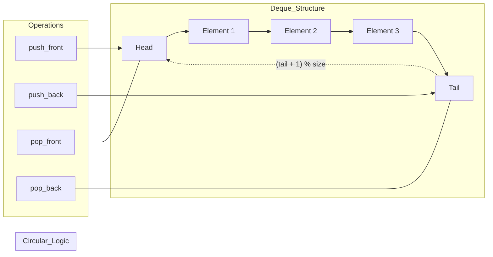

# Queue and Deque: Circular Buffer, Priority Queue, and Sliding Window Maximum

> A queue is a linear collection of entities that are maintained in a sequence and can be modified by the addition of entities at one end and the removal of entities from the other end, following the First-In-First-Out (FIFO) principle, while the double-ended queue (deque) generalizes this by allowing insertion and deletion at both ends.

## 1. Historical Background & Motivation

The concept of the "Queue" as a formal data structure traces its roots back to the early 1950s, paralleling the development of operational research and queueing theory by Agner Krarup Erlang, who modeled telephone traffic. However, in the context of computer science, the formalization of the queue occurred during the design of the first multitasking operating systems. In 1963, programmers at IBM and MIT, working on the Compatible Time-Sharing System (CTSS), required a method to manage CPU time among multiple users fairly. The FIFO queue provided the mathematical guarantee of fairness: the first process to request resources would be the first to receive them, preventing starvation.

The "Deque" (Double-Ended Queue) was first characterized by Donald Knuth in *The Art of Computer Programming* (Volume 1). Knuth identified that many algorithms, particularly those involving search and backtracking, required the flexibility of both stacks and queues. This led to the creation of the deque, which serves as a Swiss-army-knife data structure. In modern computing, these structures have evolved into high-performance primitives. For instance, the **Circular Buffer** (or Ring Buffer) is the industry standard for high-throughput, low-latency applications like audio processing and networking, where memory allocation must be minimized. The **Priority Queue**, often implemented via a binary heap, became the backbone of Dijkstra's algorithm and modern task schedulers in the Linux kernel.

## 2. Visual Intuition
:::demo
<div style="background:#1e1e1e;padding:16px;border-radius:10px;color:#e5e7eb;font-family:system-ui,sans-serif">
  <h3 style="margin:0 0 8px 0;color:#7dd3fc">Queue and Deque: Circular Buffer, Priority Queue, and Sliding Window Maximum - Concept Map</h3>
  <svg width="100%" height="280" viewBox="0 0 640 280" role="img" aria-label="Queue and Deque: Circular Buffer, Priority Queue, and Sliding Window Maximum visual intuition" style="background:#111827;border-radius:8px">
    <rect x="24" y="28" width="180" height="64" rx="10" fill="#1d4ed8" />
    <text x="114" y="66" text-anchor="middle" fill="#e5e7eb" font-size="14">Problem</text>
    <rect x="230" y="28" width="180" height="64" rx="10" fill="#0f766e" />
    <text x="320" y="66" text-anchor="middle" fill="#e5e7eb" font-size="14">Process</text>
    <rect x="436" y="28" width="180" height="64" rx="10" fill="#7c3aed" />
    <text x="526" y="66" text-anchor="middle" fill="#e5e7eb" font-size="14">Outcome</text>

    <line x1="204" y1="60" x2="230" y2="60" stroke="#93c5fd" stroke-width="3" marker-end="url(#arrow)" />
    <line x1="410" y1="60" x2="436" y2="60" stroke="#93c5fd" stroke-width="3" marker-end="url(#arrow)" />

    <rect x="24" y="130" width="592" height="120" rx="10" fill="#0b1220" stroke="#334155" />
    <text x="320" y="156" text-anchor="middle" fill="#cbd5e1" font-size="14">Key intuition for Queue and Deque: Circular Buffer, Priority Queue, and Sliding Window Maximum</text>
    <text x="320" y="182" text-anchor="middle" fill="#94a3b8" font-size="12">Track state changes, constraints, and final behavior.</text>
    <text x="320" y="206" text-anchor="middle" fill="#94a3b8" font-size="12">Use this as a mental model before formal proofs or code.</text>

    <defs>
      <marker id="arrow" markerWidth="10" markerHeight="10" refX="8" refY="3" orient="auto">
        <polygon points="0 0, 10 3, 0 6" fill="#93c5fd" />
      </marker>
    </defs>
  </svg>
  <p style="margin-top:10px;color:#cbd5e1">Interactive-ready visual scaffold for the topic.</p>
</div>
:::
*Caption: A visual representation of a FIFO Queue. Elements enter from the 'Rear' and exit from the 'Front', maintaining their relative order.*

## 3. Core Theory & Mathematical Foundations

### 3.1 The Abstract Data Type (ADT)
Mathematically, a Queue $Q$ is defined over a set $S$ as a sequence of elements $(e_1, e_2, ..., e_n)$ supporting two primary operations:
1.  **Enqueue($Q, x$):** $Q' = (e_1, e_2, ..., e_n, x)$
2.  **Dequeue($Q$):** $Q' = (e_2, e_3, ..., e_n)$ and returns $e_1$.

The Deque generalizes this by adding `push_front`, `pop_back`, `push_back`, and `pop_front`.

### 3.2 The Circular Buffer and Modulo Arithmetic
A naive implementation of a queue using a dynamic array suffers from $O(n)$ time complexity for dequeueing, as all elements must be shifted left. To achieve $O(1)$ time, we use a **Circular Buffer**. 

We maintain two pointers: $head$ (index of the first element) and $tail$ (index where the next element will be inserted). The key is the use of modulo arithmetic to "wrap around" the end of the array. Given an array of size $N$:
-   New Tail: $tail_{new} = (tail_{old} + 1) \pmod N$
-   New Head: $head_{new} = (head_{old} + 1) \pmod N$

**Full vs. Empty State:**
A common pitfall is that $head == tail$ occurs both when the buffer is empty and when it is completely full. To distinguish these, we can either:
1.  Maintain a `size` variable.
2.  Leave one slot empty (Full is defined as $(tail + 1) \pmod N == head$).

### 3.3 Priority Queues and Heap Invariants
A Priority Queue is a Deque where each element has a priority $p$. Dequeueing always returns the element with the highest priority. This is typically implemented using a **Binary Heap**.

A Binary Heap is a nearly complete binary tree satisfying the **Heap Property**:
$$\forall \text{ nodes } i, \text{ Value}(Parent(i)) \geq \text{ Value}(i) \quad (\text{Max-Heap})$$

For an array-based heap (0-indexed):
-   $Parent(i) = \lfloor (i-1)/2 \rfloor$
-   $LeftChild(i) = 2i + 1$
-   $RightChild(i) = 2i + 2$

### 3.4 Monotonic Deque and Amortized Analysis
A Monotonic Deque is a deque where elements are strictly increasing or decreasing. This is essential for the **Sliding Window Maximum** problem. 

**Theorem:** Finding the maximum in every sliding window of size $k$ for an array of size $n$ can be done in $O(n)$ time.
**Proof Sketch:** Each element $i$ is pushed into the deque exactly once and popped at most once. While we use a `while` loop inside the `for` loop, the total number of operations across the entire algorithm is bounded by $2n$. Thus, the **amortized cost** per element is $O(1)$.

## 4. Algorithm: Sliding Window Maximum
The goal is to find the maximum in every contiguous subarray of size $k$.

1.  Initialize an empty Deque `dq`. This deque will store *indices* of array elements.
2.  Iterate through the array with index `i`:
    a. If the element at the front of the deque is outside the current window ($dq[0] \leq i - k$), remove it.
    b. While the deque is not empty and $arr[dq.back()] < arr[i]$, remove elements from the back (they can never be the maximum because the current element is larger and will stay in the window longer).
    c. Push the current index `i` to the back of `dq`.
    d. If $i \geq k-1$, the current maximum is $arr[dq.front()]$.

## 5. Visual Diagram

*Caption: A logical representation of a Circular Deque. Pointers wrap around the underlying array boundaries using modulo arithmetic.*

## 6. Implementation

### 6.1 Core Implementation: Circular Buffer Queue
This implementation avoids the $O(n)$ shifting overhead of standard lists.

```python
class CircularQueue:
    def __init__(self, capacity: int):
        """
        Initialize the queue with a fixed capacity.
        Complexity: O(N) to pre-allocate memory.
        """
        self.capacity = capacity
        self.queue = [None] * capacity
        self.head = 0
        self.tail = 0
        self.size = 0

    def enqueue(self, value: int) -> bool:
        """
        Inserts an element at the tail.
        Complexity: O(1)
        """
        if self.is_full():
            return False
        
        self.queue[self.tail] = value
        self.tail = (self.tail + 1) % self.capacity
        self.size += 1
        return True

    def dequeue(self) -> int:
        """
        Removes and returns the element at the head.
        Complexity: O(1)
        """
        if self.is_empty():
            raise IndexError("Queue is empty")
        
        value = self.queue[self.head]
        self.queue[self.head] = None  # GC friendly
        self.head = (self.head + 1) % self.capacity
        self.size -= 1
        return value

    def is_empty(self) -> bool:
        return self.size == 0

    def is_full(self) -> bool:
        return self.size == self.capacity

# Example Usage:
# cq = CircularQueue(3)
# cq.enqueue(10) -> True
# cq.enqueue(20) -> True
# cq.dequeue()   -> 10
```

### 6.2 Production Variant: Sliding Window Maximum
Using `collections.deque` (implemented in C for efficiency).

```python
from collections import deque
from typing import List

def sliding_window_maximum(nums: List[int], k: int) -> List[int]:
    """
    Computes the maximum for every window of size k.
    Args:
        nums: Input list of integers.
        k: Window size.
    Returns:
        List of maximums for each window.
    Complexity:
        Time: O(n) - Each index is pushed and popped at most once.
        Space: O(k) - Deque stores at most k indices.
    """
    if not nums or k == 0:
        return []
    
    dq = deque() # Stores indices
    result = []
    
    for i, val in enumerate(nums):
        # 1. Remove indices that are out of bounds of the current window
        if dq and dq[0] == i - k:
            dq.popleft()
            
        # 2. Maintain Monotonic Decreasing Property:
        # Remove elements from back that are smaller than the current element
        while dq and nums[dq[-1]] < val:
            dq.pop()
            
        dq.append(i)
        
        # 3. If we have processed at least k elements, the front is the max
        if i >= k - 1:
            result.append(nums[dq[0]])
            
    return result

# Example:
# nums = [1, 3, -1, -3, 5, 3, 6, 7], k = 3
# Output: [3, 3, 5, 5, 6, 7]
```

### 6.3 Common Pitfalls in Code
*   **Off-by-One in Modulo:** Forgetting that `(tail + 1) % capacity` is the correct way to increment pointers in a circular buffer.
*   **Empty Deque Access:** Attempting to `dq[0]` or `dq.pop()` on an empty deque in the sliding window algorithm without checking `if dq`.
*   **Indices vs. Values:** In sliding window maximum, always store **indices** in the deque, not values. Storing values makes it impossible to check if the maximum is still inside the current window's range ($i - k$).
*   **Priority Queue Logic:** In Python's `heapq`, the implementation is a **min-heap**. To use it as a max-heap, you must multiply values by -1.

## 7. Interactive Demo

:::demo
<!-- title: Circular Buffer Visualization -->
<!DOCTYPE html>
<html>
<head>
<meta charset="utf-8">
<style>
  body { margin:0; background:#0f1117; color:#e5e7eb; font-family: system-ui, sans-serif; font-size:13px; padding:16px; }
  .container { display: flex; flex-direction: column; align-items: center; gap: 20px; }
  .buffer { display: flex; gap: 10px; border: 2px solid #3b82f6; padding: 15px; border-radius: 8px; background: #1e293b; }
  .slot { width: 50px; height: 50px; border: 1px solid #475569; display: flex; align-items: center; justify-content: center; position: relative; border-radius: 4px; font-weight: bold; }
  .slot.active { background: #3b82f6; color: white; }
  .pointer { position: absolute; font-size: 10px; color: #fbbf24; font-weight: bold; }
  .head-p { bottom: -18px; }
  .tail-p { top: -18px; }
  .controls { display: flex; gap: 10px; }
  button { padding: 8px 16px; cursor: pointer; border: none; border-radius: 4px; background: #3b82f6; color: white; font-weight: 600; }
  button:hover { background: #2563eb; }
  button:disabled { background: #475569; cursor: not-allowed; }
  .log { width: 100%; max-width: 400px; height: 100px; background: #000; padding: 10px; overflow-y: auto; font-family: monospace; border-radius: 4px; border: 1px solid #334155; }
</style>
</head>
<body>
<div class="container">
  <h3>Circular Buffer (Capacity: 8)</h3>
  <div class="buffer" id="buffer">
    <!-- Slots generated by JS -->
  </div>
  <div class="controls">
    <button onclick="enqueue()">Enqueue Random</button>
    <button onclick="dequeue()">Dequeue</button>
    <button onclick="reset()" style="background:#ef4444">Reset</button>
  </div>
  <div class="log" id="log">System initialized...</div>
</div>
<script>
  const CAP = 8;
  let queue = new Array(CAP).fill(null);
  let head = 0;
  let tail = 0;
  let size = 0;

  function render() {
    const container = document.getElementById('buffer');
    container.innerHTML = '';
    for (let i = 0; i < CAP; i++) {
      const slot = document.createElement('div');
      slot.className = `slot ${queue[i] !== null ? 'active' : ''}`;
      slot.innerText = queue[i] !== null ? queue[i] : '';
      
      if (i === head) {
        const p = document.createElement('div');
        p.className = 'pointer head-p';
        p.innerText = 'HEAD ▲';
        slot.appendChild(p);
      }
      if (i === tail) {
        const p = document.createElement('div');
        p.className = 'pointer tail-p';
        p.innerText = 'TAIL ▼';
        slot.appendChild(p);
      }
      container.appendChild(slot);
    }
  }

  function log(msg) {
    const l = document.getElementById('log');
    l.innerHTML += `<div>> ${msg}</div>`;
    l.scrollTop = l.scrollHeight;
  }

  function enqueue() {
    if (size === CAP) {
      log('Error: Buffer Full!');
      return;
    }
    const val = Math.floor(Math.random() * 99);
    queue[tail] = val;
    log(`Enqueued: ${val} at index ${tail}`);
    tail = (tail + 1) % CAP;
    size++;
    render();
  }

  function dequeue() {
    if (size === 0) {
      log('Error: Buffer Empty!');
      return;
    }
    const val = queue[head];
    queue[head] = null;
    log(`Dequeued: ${val} from index ${head}`);
    head = (head + 1) % CAP;
    size--;
    render();
  }

  function reset() {
    queue = new Array(CAP).fill(null);
    head = 0;
    tail = 0;
    size = 0;
    log('Buffer reset.');
    render();
  }

  render();
</script>
</body>
</html>
:::

## 8. Worked Examples

### Example 1 — Sliding Window Trace
**Input:** `nums = [10, 2, 5, 8], k = 2`

| Step | Current Element | Deque State (Indices) | Action | Result List |
|---|---|---|---|---|
| 1 | 10 (idx 0) | `[0]` | Push 0 | |
| 2 | 2 (idx 1) | `[0, 1]` | 2 < 10, push 1. Window full. | `[10]` |
| 3 | 5 (idx 2) | `[0, 2]` | 5 > 2, pop 1. Push 2. idx 0 is out of window `(2-2=0)`, pop 0. Deque: `[2]` | `[10, 5]` |
| 4 | 8 (idx 3) | `[3]` | 8 > 5, pop 2. Push 3. Window full. | `[10, 5, 8]` |

### Example 2 — Priority Queue Task Scheduling
**Problem:** Given tasks with priorities (lower value = higher priority), execute them.
`Tasks: (T1, 3), (T2, 1), (T3, 2)`

1.  **Insert T1 (3):** Heap = `[(3, T1)]`.
2.  **Insert T2 (1):** Heap = `[(1, T2), (3, T1)]`. T2 bubbles up because $1 < 3$.
3.  **Insert T3 (2):** Heap = `[(1, T2), (3, T1), (2, T3)]`.
4.  **Extract Min:** Return `(1, T2)`. Heap moves last element (2, T3) to root and bubbles down.
5.  **Final order:** T2, T3, T1.

## 9. Comparison with Alternatives
| Approach | Time (Avg) | Space | Pros | Cons | Best Used When |
|---|---|---|---|---|---|
| **Circular Buffer** | $O(1)$ Enq/Deq | $O(N)$ fixed | Zero allocation, Cache friendly | Fixed capacity | High-frequency streaming |
| **Doubly Linked List** | $O(1)$ Enq/Deq | $O(N)$ dynamic | Flexible size | High memory overhead (pointers) | General purpose queues |
| **Binary Heap** | $O(\log N)$ Ins/Del | $O(N)$ | Maintains order | $O(\log N)$ is slower than $O(1)$ | Schedulers, Dijkstra's |
| **Monotonic Deque** | Amortized $O(1)$ | $O(k)$ | Solving sliding window in $O(N)$ | Niche application | Windowed stats, Max-rect |

## 10. Industry Applications & Real Systems

-   **Linux Kernel Scheduler (CFS):** The Completely Fair Scheduler uses a **Red-Black Tree** (functioning as a Priority Queue) to select the next task based on 'vruntime'. Tasks with less CPU time are prioritized to ensure fairness.
-   **Kafka/Messaging Logs:** Apache Kafka uses a commit log which acts like a massive distributed **Circular Buffer**. Old data is overwritten or deleted once the storage limit (tail) catches up to the head, using a sequential write pattern for extreme throughput.
-   **LMAX Disruptor:** A high-performance inter-thread communication library used in retail banking. It uses a **Ring Buffer** (Circular Buffer) with memory barriers to achieve millions of transactions per second without the overhead of locks.
-   **Network Packet Buffering:** Routers use hardware-level circular queues to hold incoming packets. If the "tail" reaches the "head" (buffer overflow), packets are dropped (Tail Drop policy), a common cause of network congestion.

## 11. Practice Problems

### 🟢 Easy
1.  **Implement Queue using Stacks**: Implement a FIFO queue using only two stacks.
    *   *Hint: Transfer elements from Stack A to Stack B only when Stack B is empty.*
    *   *Expected complexity: $O(1)$ amortized for enqueue and dequeue.*

### 🟡 Medium
2.  **Design Circular Deque**: Design a deque that supports `insertFront`, `getRear`, `isEmpty`, etc., using a fixed-size array.
    *   *Hint: Be careful with the (index - 1 + capacity) % capacity logic for front operations.*
    *   *Expected complexity: $O(1)$ per operation.*

3.  **Kth Largest Element in a Stream**: Design a class to find the $k$-th largest element in a stream of integers.
    *   *Hint: Use a Min-Heap of size $k$. The root is always the $k$-th largest.*

### 🔴 Hard
4.  **Sliding Window Maximum**: Given an array $nums$, there is a sliding window of size $k$. Return the max of each window.
    *   *Hint: Use a Monotonic Deque to keep track of potential maximums.*
    *   *Expected complexity: $O(n)$ time.*

5.  **Constrained Subsequence Sum**: Given an array `nums` and an integer `k`, return the maximum sum of a non-empty subsequence such that for every two consecutive elements in the subsequence, their indices $i$ and $j$ satisfy $j - i \leq k$.
    *   *Hint: This is DP + Sliding Window Maximum. $dp[i] = nums[i] + \max(0, \max(dp[i-k...i-1]))$.*

## 12. Interactive Quiz

:::quiz
**Q1: In a circular buffer of capacity $N$, if the 'head' is at index 5 and the 'tail' is at index 4, assuming the buffer is full, how many elements are currently stored?**
- A) $N-1$
- B) $N$
- C) 0
- D) 1
> B — If the tail has wrapped around and is exactly behind the head, the buffer is full (if using a size counter or the $N-1$ implementation variant where we define full as such).

**Q2: Why is a binary heap used for a Priority Queue instead of a sorted array?**
- A) Sorted arrays have $O(\log N)$ insertion.
- B) Binary heaps have $O(1)$ extraction.
- C) Binary heaps offer $O(\log N)$ insertion, while sorted arrays require $O(N)$ to shift elements.
- D) Binary heaps use less memory.
> C — While both have $O(1)$ or $O(\log N)$ for finding/extracting the max, the sorted array requires $O(N)$ time to maintain order upon insertion.

**Q3: What is the time complexity of the "Sliding Window Maximum" algorithm for an array of size $N$?**
- A) $O(N \log K)$
- B) $O(N \cdot K)$
- C) $O(N)$
- D) $O(N^2)$
> C — Every index is added to and removed from the deque exactly once, leading to $2N$ operations.

**Q4: Which data structure is best suited for a 'First-In-First-Out' (FIFO) buffer in an embedded system with no dynamic memory allocation?**
- A) Linked List
- B) Doubly Linked List
- C) Circular Buffer
- D) Priority Queue
> C — Circular buffers use a fixed-size array allocated at compile time, making them perfect for embedded systems.

**Q5: In a monotonic deque used for a maximum sliding window, why do we remove elements from the back if they are smaller than the new element?**
- A) To keep the deque size small.
- B) Because those elements can never be the maximum in any future window.
- C) Because the deque must be sorted in increasing order.
- D) To prevent integer overflow.
> B — A smaller element that appears earlier in the array than a larger element will also leave the sliding window earlier; thus, it can never be the maximum.
:::

## 13. Interview Preparation

### Conceptual Questions
**Q: How do you implement a Deque using only dynamic arrays? What are the trade-offs?**
*A: You use a circular buffer approach. You maintain `head` and `tail` pointers. When the `size == capacity`, you reallocate a new array of size $2N$ and carefully copy elements from `head` to `tail` into the new array's start. The trade-off is $O(1)$ amortized time but occasional $O(N)$ latency during resize, which might be unacceptable in real-time systems.*

**Q: Explain the difference between a Queue and a Stack in terms of scheduling.**
*A: A Queue represents "fairness" (FIFO), where the first task to arrive is served first. A Stack represents "LIFO", often used in depth-first explorations or interrupt handling where the most recent (and often most urgent) task is handled first. In OS scheduling, queues are standard, whereas stacks are used for function calls and recursion.*

**Q: Derive the time complexity of building a heap from an unordered array.**
*A: While it looks like $O(N \log N)$ (doing $N$ insertions), it is actually $O(N)$. We perform `siftDown` starting from the last non-leaf node. The work done is $\sum_{h=0}^{\log n} \frac{n}{2^{h+1}} O(h)$. This geometric series converges to $O(N)$.*

**Q: Describe a scenario where a Priority Queue is better than a simple Queue.**
*A: In an emergency room triage system, a simple Queue (FIFO) would be disastrous. A patient with a heart attack (high priority) must be seen before someone with a broken finger (lower priority), even if the latter arrived first. A Priority Queue ensures the most critical task is always at the front.*

### Quick Reference (Cheat Sheet)
| Property | Circular Buffer | Binary Heap | Monotonic Deque |
|---|---|---|---|
| **Insertion** | $O(1)$ | $O(\log N)$ | $O(1)$ (Amortized) |
| **Deletion** | $O(1)$ | $O(\log N)$ | $O(1)$ (Amortized) |
| **Peek Max/Front** | $O(1)$ | $O(1)$ | $O(1)$ |
| **Stable?** | Yes | No | Yes |
| **In-place?** | Yes | Yes | No (requires extra space) |

## 14. Key Takeaways
1.  **Circular Buffers** are the go-to for fixed-size, high-performance FIFO requirements.
2.  **Modulo Arithmetic** $(i + 1) \pmod N$ is the heart of circular logic.
3.  **Heaps** implement Priority Queues efficiently, providing $O(\log N)$ for both insertion and removal.
4.  **Monotonic Deques** solve sliding window problems by discarding "useless" elements, achieving $O(N)$ total time.
5.  **Indices over Values:** When implementing sliding window algorithms, store indices in your deque to easily track window boundaries.
6.  **Amortized Analysis** is crucial for understanding why deques are efficient despite inner `while` loops.
7.  **Python's `collections.deque`** is a doubly-linked list of blocks, making it $O(1)$ for end operations but $O(N)$ for random access.

## 15. Common Misconceptions
- ❌ **"A Priority Queue always keeps the entire array sorted."** → ✅ It only guarantees that the *root* is the maximum/minimum. The rest of the array is only partially ordered.
- ❌ **"Using `list.pop(0)` in Python is $O(1)$."** → ✅ It is $O(N)$ because every other element must be shifted. Always use `collections.deque` for $O(1)$ pops from the left.
- ❌ **"Sliding Window Maximum requires a Segment Tree."** → ✅ A Segment Tree can solve it in $O(N \log N)$, but a Monotonic Deque is superior at $O(N)$.

## 16. Further Reading
- *Introduction to Algorithms (CLRS)* — Chapter 6 (Heaps) and Chapter 10 (Elementary Data Structures).
- *The Art of Computer Programming (Knuth)* — Volume 1, Section 2.2.1 (Queues and Deques).
- *LMAX Disruptor Whitepaper* — For high-performance circular buffer implementation details.
- *Python `heapq` source code* — For a clean, production-grade heap implementation.

## 17. Related Topics
- [[complexity-analysis]] — Understanding amortized $O(1)$.
- [[singly-linked-list]] — Basic structure for dynamic queues.
- [[doubly-circular-linked]] — The underlying implementation of many deques.
- [[stack-implementation]] — The LIFO counterpart to the Queue.
- [[heapsort]] — Applying priority queue logic to sorting.
