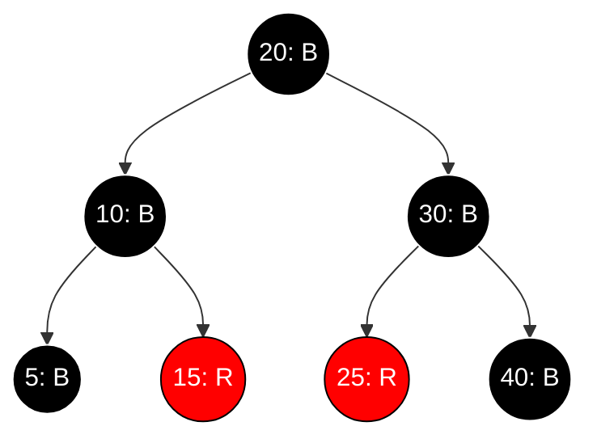

# Red-Black Trees: Color Properties, Insertions, and Deletions

> A Red-Black Tree is a self-balancing binary search tree where each node stores an extra bit representing color (red or black), used to ensure the tree remains approximately balanced during insertions and deletions, guaranteeing $O(\log n)$ time for all major operations.

## 1. Historical Background & Motivation

The Red-Black Tree (RBT) was first conceived in 1972 by Rudolf Bayer, who originally named the structure "Symmetric Binary B-Trees." While Bayer's work laid the foundational logic for maintaining balance through node splitting and merging, the modern nomenclature and the specific color-based abstraction were introduced in 1978 by Leonidas J. Guibas and Robert Sedgewick in their seminal paper, "A Dichromatic Framework for Balanced Trees." Their innovation was to represent the complex transformations of 2-3-4 trees using a simple binary structure with a single bit of metadata per node.

The motivation for Red-Black Trees stems from the limitations of basic Binary Search Trees (BSTs). In a standard BST, the performance of search, insertion, and deletion is proportional to the height of the tree. In the worst-case scenario (e.g., inserting sorted data), a BST degrades into a linked list with $O(n)$ complexity, nullifying the efficiency gains of the tree structure. While earlier structures like AVL trees (Adelson-Velsky and Landis) provided a solution for strict balance, they often required frequent, costly rotations during updates. Red-Black Trees emerged as a more flexible alternative, providing "good enough" balance (the height is at most $2 \log(n+1)$) while significantly reducing the number of rotations required during insertions and deletions. In modern computing, this makes them the data structure of choice for high-performance associative containers and system schedulers.

## 2. Visual Intuition
:::demo
<div style="background:#1e1e1e;padding:16px;border-radius:10px;color:#e5e7eb;font-family:system-ui,sans-serif">
  <h3 style="margin:0 0 8px 0;color:#7dd3fc">Red-Black Trees: Color Properties, Insertions, and Deletions - Concept Map</h3>
  <svg width="100%" height="280" viewBox="0 0 640 280" role="img" aria-label="Red-Black Trees: Color Properties, Insertions, and Deletions visual intuition" style="background:#111827;border-radius:8px">
    <rect x="24" y="28" width="180" height="64" rx="10" fill="#1d4ed8" />
    <text x="114" y="66" text-anchor="middle" fill="#e5e7eb" font-size="14">Problem</text>
    <rect x="230" y="28" width="180" height="64" rx="10" fill="#0f766e" />
    <text x="320" y="66" text-anchor="middle" fill="#e5e7eb" font-size="14">Process</text>
    <rect x="436" y="28" width="180" height="64" rx="10" fill="#7c3aed" />
    <text x="526" y="66" text-anchor="middle" fill="#e5e7eb" font-size="14">Outcome</text>

    <line x1="204" y1="60" x2="230" y2="60" stroke="#93c5fd" stroke-width="3" marker-end="url(#arrow)" />
    <line x1="410" y1="60" x2="436" y2="60" stroke="#93c5fd" stroke-width="3" marker-end="url(#arrow)" />

    <rect x="24" y="130" width="592" height="120" rx="10" fill="#0b1220" stroke="#334155" />
    <text x="320" y="156" text-anchor="middle" fill="#cbd5e1" font-size="14">Key intuition for Red-Black Trees: Color Properties, Insertions, and Deletions</text>
    <text x="320" y="182" text-anchor="middle" fill="#94a3b8" font-size="12">Track state changes, constraints, and final behavior.</text>
    <text x="320" y="206" text-anchor="middle" fill="#94a3b8" font-size="12">Use this as a mental model before formal proofs or code.</text>

    <defs>
      <marker id="arrow" markerWidth="10" markerHeight="10" refX="8" refY="3" orient="auto">
        <polygon points="0 0, 10 3, 0 6" fill="#93c5fd" />
      </marker>
    </defs>
  </svg>
  <p style="margin-top:10px;color:#cbd5e1">Interactive-ready visual scaffold for the topic.</p>
</div>
:::
*Caption: A dynamic visualization of a Red-Black Tree undergoing insertions. Notice how the tree performs "recoloring" first, and only resorts to "rotations" when recoloring cannot satisfy the structural invariants.*

## 3. Core Theory & Mathematical Foundations

A Red-Black Tree is a binary search tree that satisfies five specific properties. These properties, when maintained collectively, ensure that the path from the root to the farthest leaf is no more than twice as long as the path from the root to the nearest leaf.

### 3.1 The Five Structural Invariants
To qualify as a Red-Black Tree, every node must conform to these rules:
1.  **Every node is either red or black.**
2.  **The root is always black.**
3.  **Every leaf (NIL) is black.** (We treat all null pointers as actual nodes that are colored black).
4.  **If a node is red, then both its children are black.** (No two red nodes can be adjacent; no "Red-Red" violations).
5.  **For each node, all simple paths from the node to descendant leaves contain the same number of black nodes.** This number is known as the **black-height**, denoted $bh(x)$.

### 3.2 The Black-Height Lemma
The most critical property of Red-Black Trees is their guaranteed logarithmic height. We can prove this using the concept of black-height.

**Theorem:** A red-black tree with $n$ internal nodes has height $h \le 2 \log_2(n + 1)$.

**Proof Sketch:**
First, we show by induction that a subtree rooted at any node $x$ contains at least $2^{bh(x)} - 1$ internal nodes.
*   **Base Case:** If $x$ is a leaf (NIL), $bh(x) = 0$, and the number of internal nodes is $2^0 - 1 = 0$.
*   **Inductive Step:** Consider an internal node $x$ with two children. Each child has a black-height of either $bh(x)$ (if the child is red) or $bh(x) - 1$ (if the child is black). In either case, the black-height of a child is at least $bh(x) - 1$. Applying the inductive hypothesis, each child has at least $2^{bh(x)-1} - 1$ internal nodes. Thus, the tree rooted at $x$ has at least $(2^{bh(x)-1} - 1) + (2^{bh(x)-1} - 1) + 1 = 2^{bh(x)} - 1$ nodes.

Now, let $h$ be the height of the tree. According to Property 4, at least half the nodes on any path from root to leaf (excluding the root) must be black. Therefore, $bh(root) \ge h/2$.
Substituting this into our node count formula:
$$n \ge 2^{h/2} - 1$$
$$n + 1 \ge 2^{h/2}$$
$$\log_2(n + 1) \ge h/2$$
$$h \le 2 \log_2(n + 1)$$
This confirms that the search time is $O(\log n)$.

### 3.3 Rotations: The Primitive Operations
To maintain balance, Red-Black Trees use **Left-Rotation** and **Right-Rotation**. These operations change the local structure of the tree while preserving the in-order traversal (BST) property: $LeftChild < Parent < RightChild$.

For a Left-Rotation on node $x$:
1.  Let $y$ be $x$'s right child.
2.  Turn $y$'s left subtree into $x$'s right subtree.
3.  Link $x$'s parent to $y$.
4.  Make $x$ the left child of $y$.

### 3.4 Formal Analysis (Complexity / Correctness)
*   **Space Complexity:** $O(n)$ to store $n$ nodes. Each node requires 1 additional bit for color.
*   **Search:** $O(\log n)$ because the height is bounded by $2 \log(n+1)$.
*   **Insertion:** $O(\log n)$ to find the insertion point, followed by $O(1)$ to $O(\log n)$ recolorings and a maximum of **two rotations**.
*   **Deletion:** $O(\log n)$ to find the node, followed by $O(1)$ to $O(\log n)$ recolorings and a maximum of **three rotations**.

The fact that rotations are strictly bounded (2 for insertion, 3 for deletion) is what makes Red-Black trees highly efficient in write-heavy workloads compared to AVL trees, which may require $O(\log n)$ rotations during deletion.

## 4. Algorithm / Process (Step-by-Step)

### Insertion Algorithm
1.  **Standard BST Insert:** Insert the new node $z$ and color it **RED**.
2.  **Fix-up:** If $z$'s parent is also RED, we have a violation of Property 4. We check $z$'s **uncle** (the sibling of $z$'s parent):
    *   **Case 1: Uncle is RED.** Recolor parent, uncle, and grandparent. Move the "problem" up to the grandparent.
    *   **Case 2: Uncle is BLACK (Triangle Configuration).** Perform a rotation to turn the triangle into a line (Case 3).
    *   **Case 3: Uncle is BLACK (Line Configuration).** Perform a rotation on the grandparent and recolor parent and grandparent.

### Deletion Algorithm
1.  **Standard BST Delete:** Find node $z$ to delete. If it has two children, find its successor $y$, swap values, and delete $y$ instead. $y$ will have at most one child.
2.  **The Double Black Problem:** If the deleted node was BLACK and its replacing child $x$ is also BLACK, we create a "Double Black" node (violating Property 5).
3.  **Fix-up (4 Cases based on sibling $w$):**
    *   **Case 1:** Sibling $w$ is RED. Rotate to make $w$ black and proceed to cases 2, 3, or 4.
    *   **Case 2:** Sibling $w$ is BLACK, and both of $w$'s children are BLACK. "Push" the blackness up; recolor $w$ to RED.
    *   **Case 3:** Sibling $w$ is BLACK, $w$'s inner child is RED, and outer child is BLACK. Rotate $w$ to transform into Case 4.
    *   **Case 4:** Sibling $w$ is BLACK, and $w$'s outer child is RED. Perform a rotation and recoloring to resolve the double-blackness.

## 5. Visual Diagram


*Caption: A valid Red-Black Tree. Note Property 5: Every path from root to leaf contains exactly 2 black nodes (20-10-5, 20-10-15-NIL, 20-30-25-NIL, 20-30-40).*

## 6. Implementation

### 6.1 Core Implementation
The following Python code implements a robust Red-Black Tree with the `insert` logic and balancing fix-ups.

```python
class Node:
    def __init__(self, data, color="RED"):
        self.data = data
        self.color = color  # "RED" or "BLACK"
        self.left = None
        self.right = None
        self.parent = None

class RedBlackTree:
    def __init__(self):
        self.TNULL = Node(0, color="BLACK") # Sentinel NIL leaf
        self.root = self.TNULL

    def left_rotate(self, x):
        y = x.right
        x.right = y.left
        if y.left != self.TNULL:
            y.left.parent = x
        y.parent = x.parent
        if x.parent == None:
            self.root = y
        elif x == x.parent.left:
            x.parent.left = y
        else:
            x.parent.right = y
        y.left = x
        x.parent = y

    def right_rotate(self, y):
        x = y.left
        y.left = x.right
        if x.right != self.TNULL:
            x.right.parent = y
        x.parent = y.parent
        if y.parent == None:
            self.root = x
        elif y == y.parent.right:
            y.parent.right = x
        else:
            y.parent.left = x
        x.right = y
        y.parent = x

    def insert(self, key):
        # 1. Standard BST Insert
        node = Node(key)
        node.parent = None
        node.data = key
        node.left = self.TNULL
        node.right = self.TNULL
        node.color = "RED"

        y = None
        x = self.root

        while x != self.TNULL:
            y = x
            if node.data < x.data:
                x = x.left
            else:
                x = x.right

        node.parent = y
        if y == None:
            self.root = node
        elif node.data < y.data:
            y.left = node
        else:
            y.right = node

        # 2. Fix violations
        if node.parent == None:
            node.color = "BLACK"
            return
        if node.parent.parent == None:
            return

        self.fix_insert(node)

    def fix_insert(self, k):
        while k.parent.color == "RED":
            if k.parent == k.parent.parent.right:
                u = k.parent.parent.left # uncle
                if u.color == "RED":
                    # Case 1: Uncle is Red
                    u.color = "BLACK"
                    k.parent.color = "BLACK"
                    k.parent.parent.color = "RED"
                    k = k.parent.parent
                else:
                    if k == k.parent.left:
                        # Case 2: Triangle
                        k = k.parent
                        self.right_rotate(k)
                    # Case 3: Line
                    k.parent.color = "BLACK"
                    k.parent.parent.color = "RED"
                    self.left_rotate(k.parent.parent)
            else:
                u = k.parent.parent.right # uncle
                if u.color == "RED":
                    # Case 1: Uncle is Red
                    u.color = "BLACK"
                    k.parent.color = "BLACK"
                    k.parent.parent.color = "RED"
                    k = k.parent.parent
                else:
                    if k == k.parent.right:
                        # Case 2: Triangle
                        k = k.parent
                        self.left_rotate(k)
                    # Case 3: Line
                    k.parent.color = "BLACK"
                    k.parent.parent.color = "RED"
                    self.right_rotate(k.parent.parent)
            if k == self.root:
                break
        self.root.color = "BLACK"

# Usage Example:
# rbt = RedBlackTree()
# rbt.insert(55); rbt.insert(40); rbt.insert(65); rbt.insert(60); rbt.insert(75); rbt.insert(57)
# Complexity: O(log n)
```

### 6.2 Optimized / Production Variant
In production environments (like the Linux kernel), Red-Black Trees are often implemented as **augmented data structures**. For example, in an OS scheduler, nodes might store the `sum_runtime` of tasks to allow for $O(\log n)$ range queries.

Additionally, production code often uses a **parent-pointer-free** iterative approach or a **bit-packed** color field. Since memory alignment usually ensures pointers are 4- or 8-byte aligned, the least significant bit of the `parent` pointer is used to store the color, saving 4-8 bytes per node.

### 6.3 Common Pitfalls in Code
1.  **Forgetting NIL leaves:** Standard BST logic uses `None` for leaves. RBT logic *requires* that NIL leaves be treated as Black nodes. Using a single `TNULL` sentinel object is the most memory-efficient way to handle this.
2.  **The Root Color:** Every operation must end with `self.root.color = "BLACK"`. It is easy to forget this after a Case 1 recoloring.
3.  **Parent Pointer Updates:** Rotations are pointer-heavy. Failing to update the `parent` attribute of the nodes involved in a rotation is the #1 cause of infinite loops and segmentation faults.

## 7. Interactive Demo

:::demo
<!-- title: Red-Black Tree Visualizer -->
<!DOCTYPE html>
<html>
<head>
<meta charset="utf-8">
<style>
  body { margin:0; background:#0f1117; color:#e5e7eb; font-family: system-ui, sans-serif; overflow: hidden; }
  #controls { position: absolute; top:10px; left:10px; z-index:10; background:rgba(30,41,59,0.8); padding:12px; border-radius:8px; display:flex; gap:8px; align-items:center; }
  input { background:#334155; border:1px solid #475569; color:white; padding:4px 8px; border-radius:4px; width:60px; }
  button { background:#3b82f6; color:white; border:none; padding:4px 12px; border-radius:4px; cursor:pointer; }
  button:hover { background:#2563eb; }
  canvas { display: block; }
  .status { font-size: 12px; color: #94a3b8; margin-top: 5px; }
</style>
</head>
<body>
  <div id="controls">
    <input type="number" id="val" value="10">
    <button onclick="insertVal()">Insert</button>
    <button onclick="resetTree()">Reset</button>
    <div class="status" id="status">Add nodes to see balancing...</div>
  </div>
  <canvas id="treeCanvas"></canvas>

<script>
  const canvas = document.getElementById('treeCanvas');
  const ctx = canvas.getContext('2d');
  canvas.width = window.innerWidth;
  canvas.height = window.innerHeight;

  class TNode {
    constructor(val, color = 'RED') {
      this.val = val;
      this.color = color;
      this.left = null;
      this.right = null;
      this.parent = null;
      this.x = 0; this.y = 0;
    }
  }

  let root = null;

  function leftRotate(x) {
    let y = x.right;
    x.right = y.left;
    if (y.left) y.left.parent = x;
    y.parent = x.parent;
    if (!x.parent) root = y;
    else if (x === x.parent.left) x.parent.left = y;
    else x.parent.right = y;
    y.left = x;
    x.parent = y;
  }

  function rightRotate(y) {
    let x = y.left;
    y.left = x.right;
    if (x.right) x.right.parent = y;
    x.parent = y.parent;
    if (!y.parent) root = x;
    else if (y === y.parent.left) y.parent.left = x;
    else y.parent.right = x;
    x.right = y;
    y.parent = x;
  }

  function fixInsert(k) {
    while (k.parent && k.parent.color === 'RED') {
      if (k.parent === k.parent.parent?.left) {
        let u = k.parent.parent.right;
        if (u && u.color === 'RED') {
          u.color = 'BLACK';
          k.parent.color = 'BLACK';
          k.parent.parent.color = 'RED';
          k = k.parent.parent;
        } else {
          if (k === k.parent.right) {
            k = k.parent;
            leftRotate(k);
          }
          k.parent.color = 'BLACK';
          k.parent.parent.color = 'RED';
          rightRotate(k.parent.parent);
        }
      } else {
        let u = k.parent.parent?.left;
        if (u && u.color === 'RED') {
          u.color = 'BLACK';
          k.parent.color = 'BLACK';
          k.parent.parent.color = 'RED';
          k = k.parent.parent;
        } else {
          if (k === k.parent.left) {
            k = k.parent;
            rightRotate(k);
          }
          k.parent.color = 'BLACK';
          k.parent.parent.color = 'RED';
          leftRotate(k.parent.parent);
        }
      }
      if (k === root) break;
    }
    root.color = 'BLACK';
  }

  function insertVal() {
    const val = parseInt(document.getElementById('val').value);
    const newNode = new TNode(val);
    let y = null;
    let x = root;
    while (x) {
      y = x;
      if (newNode.val < x.val) x = x.left;
      else x = x.right;
    }
    newNode.parent = y;
    if (!y) root = newNode;
    else if (newNode.val < y.val) y.left = newNode;
    else y.right = newNode;
    
    fixInsert(newNode);
    draw();
  }

  function resetTree() { root = null; draw(); }

  function calculatePositions(node, x, y, spacing) {
    if (!node) return;
    node.x = x;
    node.y = y;
    calculatePositions(node.left, x - spacing, y + 60, spacing / 1.8);
    calculatePositions(node.right, x + spacing, y + 60, spacing / 1.8);
  }

  function drawNode(node) {
    if (!node) return;
    if (node.left) {
      ctx.beginPath();
      ctx.moveTo(node.x, node.y);
      ctx.lineTo(node.left.x, node.left.y);
      ctx.strokeStyle = '#475569';
      ctx.stroke();
      drawNode(node.left);
    }
    if (node.right) {
      ctx.beginPath();
      ctx.moveTo(node.x, node.y);
      ctx.lineTo(node.right.x, node.right.y);
      ctx.strokeStyle = '#475569';
      ctx.stroke();
      drawNode(node.right);
    }
    ctx.beginPath();
    ctx.arc(node.x, node.y, 18, 0, Math.PI * 2);
    ctx.fillStyle = node.color === 'RED' ? '#ef4444' : '#1e293b';
    ctx.fill();
    ctx.strokeStyle = '#fff';
    ctx.lineWidth = 2;
    ctx.stroke();
    ctx.fillStyle = '#fff';
    ctx.textAlign = 'center';
    ctx.fillText(node.val, node.x, node.y + 5);
  }

  function draw() {
    ctx.clearRect(0, 0, canvas.width, canvas.height);
    if (!root) return;
    calculatePositions(root, canvas.width / 2, 80, canvas.width / 4);
    drawNode(root);
  }

  window.addEventListener('resize', draw);
  draw();
</script>
</body>
</html>
:::

## 8. Worked Examples

### Example 1 — Basic Insertion Sequence
Insert the values: **10, 20, 30** into an empty RBT.

1.  **Insert 10:**
    *   Initially Red, but since it's the root, recolor to **Black**.
    *   *Tree:* `(10: B)`
2.  **Insert 20:**
    *   Standard BST: 20 becomes right child of 10. Color it **Red**.
    *   *Invariants:* Root is Black, 20 is Red (Children are NIL/Black). OK.
    *   *Tree:* `(10: B) -> (20: R)`
3.  **Insert 30:**
    *   Standard BST: 30 becomes right child of 20. Color it **Red**.
    *   *Violation:* Both 20 and 30 are Red (Double Red violation).
    *   *Action:* 20 is `k`, 10 is `parent`, 30 is `child`. Uncle is NIL (Black).
    *   *Case:* Line Configuration (Case 3).
    *   *Resolution:* Left Rotate at 10. Recolor 20 to Black, 10 to Red.
    *   *Result:* 20 is the new Black root, with 10 (Red) on left and 30 (Red) on right.

### Example 2 — The Uncle Recolor (Case 1)
Starting with the result of Example 1, insert **15**.

1.  **Standard BST Insert:** 15 becomes right child of 10. Color it **Red**.
2.  **Violation:** 10 is Red, 15 is Red.
3.  **Check Uncle:** `k` is 15, `parent` is 10. `parent`'s sibling is 30.
4.  **Action:** Node 30 is **Red**. This is **Case 1 (Red Uncle)**.
5.  **Recolor:** 10 and 30 become Black. Grandparent (20) becomes Red.
6.  **Root Fix:** Since 20 is the root, recolor it back to Black.
7.  **Final State:** 20 (Black Root), 10 (Black left), 30 (Black right), 15 (Red child of 10).

## 9. Comparison with Alternatives

| Approach | Time (Avg/Worst) | Rotation Complexity | Pros | Cons | Best Used When |
|---|---|---|---|---|---|
| **Red-Black Tree** | $O(\log n) / O(\log n)$ | Max 2 (Ins), 3 (Del) | Faster insertions/deletions | Slightly taller than AVL | OS Schedulers, Maps |
| **AVL Tree** | $O(\log n) / O(\log n)$ | $O(\log n)$ | Strict balance, faster search | Costly rebalancing | Search-heavy lookups |
| **Splay Tree** | $O(\log n)$ amortized | Variable | Moves frequent items to root | $O(n)$ worst-case | Caches, data locality |
| **Skip List** | $O(\log n) / O(\log n)$ | N/A (Probabilistic) | Easier to implement concurrent | Uses more memory | Lock-free structures |

## 10. Industry Applications & Real Systems

-   **Linux Kernel (CFS Scheduler)**: The Completely Fair Scheduler uses a Red-Black Tree to manage runnable processes indexed by their virtual runtime. The RBT allows the scheduler to find the process with the minimum runtime in $O(1)$ (by caching the leftmost node) and re-insert processes in $O(\log n)$.
-   **Java standard library**: `java.util.TreeMap` and `java.util.TreeSet` are implemented using Red-Black Trees. Since Java 8, `HashMap` also uses an RBT for "bucket" storage when a single hash bin exceeds a threshold (8 elements), preventing DOS attacks that exploit hash collisions.
-   **C++ Standard Template Library (STL)**: Most implementations of `std::map`, `std::multimap`, `std::set`, and `std::multiset` use Red-Black Trees as the underlying engine to maintain sorted order and logarithmic access.
-   **Epoll (Linux I/O)**: The `epoll` system call in Linux uses an RBT to track file descriptors that are being monitored. This allows for efficient addition, removal, and modification of monitored descriptors even when the set size grows into the millions.

## 11. Practice Problems

### 🟢 Easy
1.  **Black-Height Calculation**: Given a RBT with 15 nodes and a height of 4, what is the maximum possible black-height?
    *Hint: Consider the path with the most black nodes.*
    *Expected complexity: $O(1)$ reasoning.*

### 🟡 Medium
2.  **RBT Validation**: Write a function `is_red_black_tree(node)` that returns true if all 5 RBT properties are satisfied for a given binary tree.
    *Hint: Use recursion to check black-height consistency and parent-child color rules.*
    *Expected complexity: $O(n)$.*

3.  **Total Rotations**: Prove that in any sequence of $m$ Red-Black Tree insertions, the total number of rotations performed is $O(m)$.
    *Hint: Analyze the potential function of the tree structure.*

### 🔴 Hard
4.  **Delete with No Parent Pointers**: Implement a Red-Black Tree deletion algorithm without using parent pointers in the Node class.
    *Hint: Use a stack or recursion to keep track of the path from the root.*
    *Expected complexity: $O(\log n)$ time, $O(\log n)$ space.*

5.  **2-3-4 Tree Isomorphism**: Map a Red-Black Tree to its equivalent 2-3-4 tree. Describe how a Red-Black Tree "Case 1" (recoloring) corresponds to a node split in a 2-3-4 tree.

## 12. Interactive Quiz

:::quiz
**Q1: What is the maximum height of a Red-Black Tree with $n$ internal nodes?**
- A) $\log_2(n)$
- B) $2 \log_2(n + 1)$
- C) $1.44 \log_2(n)$
- D) $n / 2$
> B — Property 4 and 5 ensure that no path is more than twice as long as any other, leading to a height bound of $2 \log_2(n + 1)$.

**Q2: During a Red-Black Tree insertion, what is the maximum number of rotations required?**
- A) $O(\log n)$
- B) 1
- C) 2
- D) 3
> C — While we may perform $O(\log n)$ recolorings, the rotation logic terminates after at most 2 rotations (Case 2 followed by Case 3).

**Q3: Why are the NIL leaves considered Black?**
- A) To save memory
- B) To simplify the implementation of "Double Black" cases
- C) To satisfy the property that every path to a leaf has the same black-height
- D) Both B and C
> D — Treat NILs as black nodes allows the algorithms to be uniform; every real node has two children, and every path naturally ends in a black leaf.

**Q4: Which of the following is NOT a property of Red-Black Trees?**
- A) The root is black.
- B) A red node cannot have a red child.
- C) The path from the root to the shallowest leaf is exactly the same as the path to the deepest leaf.
- D) Every path from a node to its leaves has the same number of black nodes.
> C — This property describes a "Perfectly Balanced Tree." Red-Black trees allow for a height difference factor of up to 2.

**Q5: In the Red-Black Tree "Uncle is Red" case (Case 1), what happens to the grandparent node?**
- A) It is rotated left.
- B) It is rotated right.
- C) It is recolored Red.
- D) It remains Black.
> C — To resolve the red-red violation between parent and child, we push the "redness" up to the grandparent.
:::

## 13. Interview Preparation

### Conceptual Questions
**Q: Explain Red-Black Trees as if teaching it to a fellow engineer.**
*A: A Red-Black Tree is a self-balancing BST that uses a simple coloring scheme to enforce a "roughly balanced" state. Unlike AVL trees which are very strict about height, RBTs allow paths to differ in length by a factor of two. This is achieved by ensuring no two red nodes are adjacent and that every path has the same number of black nodes. This flexibility means we do fewer rotations during updates, making it better for general-purpose use.*

**Q: What are the time and space complexities? Derive them.**
*A: Time: $O(\log n)$ for Search, Insert, and Delete. Derivation comes from the black-height lemma, proving $h \le 2 \log(n+1)$. Space: $O(n)$ total, with $O(1)$ additional bits per node for the color property. In practice, the color bit is often packed into the alignment padding of pointers.*

**Q: How would you choose between an RBT and a Hash Table in a real system?**
*A: Use an RBT if you need to perform range queries (e.g., "Find all users aged 20-30"), if you need the data to stay sorted, or if you need guaranteed $O(\log n)$ worst-case performance. Use a Hash Table if you only need point lookups and can afford $O(1)$ average performance, keeping in mind that hash tables can have $O(n)$ worst-case scenarios and don't maintain order.*

**Q: Can you optimize an RBT for memory-constrained environments?**
*A: Yes. One can use "pointer tagging" where the lowest bit of the child or parent pointers stores the color, as pointers are usually 8-byte aligned. One could also replace the parent pointer with a stack-based traversal during updates to save 8 bytes per node.*

### Quick Reference (Cheat Sheet)
| Property | Value |
|---|---|
| Max Height | $2 \log_2(n+1)$ |
| Search Complexity | $O(\log n)$ |
| Insert Complexity | $O(\log n)$ (Max 2 Rotations) |
| Delete Complexity | $O(\log n)$ (Max 3 Rotations) |
| Stable? | No (It's a Tree) |
| In-place? | Yes (Nodes are updated via pointers) |

## 14. Key Takeaways
1.  **Balance through Color:** RBTs don't track height; they track "black-height."
2.  **Logarithmic Guarantee:** The worst-case height is $2 \log n$, ensuring $O(\log n)$ performance.
3.  **Write Efficiency:** RBTs are generally faster than AVL trees for insertions and deletions because they require fewer rotations.
4.  **Rotation Primitives:** Left and Right rotations are the atomic operations that maintain BST order while shifting node depths.
5.  **2-3-4 Isomorphism:** Every Red-Black tree is just a binary representation of a B-Tree of order 4.
6.  **Sentinels:** Using a single `TNULL` node simplifies logic significantly.
7.  **Ubiquity:** From Java's `TreeMap` to the Linux Kernel, RBTs are the "gold standard" for balanced search trees.

## 15. Common Misconceptions
- ❌ **RBTs are perfectly balanced.** → ✅ They are *approximately* balanced. The longest path can be twice as long as the shortest.
- ❌ **RBTs are always better than AVL trees.** → ✅ AVL trees are actually better for search-intensive tasks because they are flatter. RBTs win on insertions/deletions.
- ❌ **The color of a node is permanent.** → ✅ Nodes are frequently recolored during the "fix-up" phases of insertion and deletion to maintain invariants.

## 16. Further Reading
- *Introduction to Algorithms (CLRS), Chapter 13* — The definitive formal treatment of RBTs.
- *Algorithms (Sedgewick & Wayne), Chapter 3.3* — Focuses on Left-Leaning Red-Black trees (LLRBT).
- *The Linux Kernel Archive* — Search for `lib/rbtree.c` to see a production-grade C implementation.
- *Guibas and Sedgewick (1978)* — The original paper "A Dichromatic Framework for Balanced Trees."

## 17. Related Topics
- [[complexity-analysis]] — For understanding why $O(\log n)$ matters.
- [[recursion-basics]] — Used extensively in tree traversals.
- [[doubly-circular-linked]] — Often used in conjunction with trees for ordering.
- [[singly-linked-list]] — The degenerate case of an unbalanced BST.
