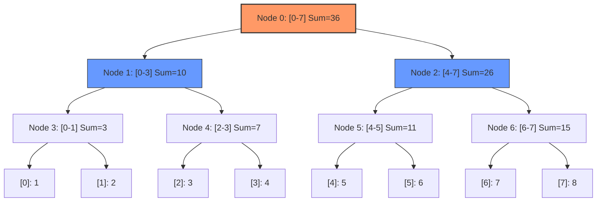

# Segment Trees: Range Sum, Range Minimum, and Lazy Propagation

> A **Segment Tree** is a versatile, heap-like tree data structure that allows for efficient $O(\log n)$ range queries and point/range updates by storing precomputed aggregate information over intervals of a linear array.

## 1. Historical Background & Motivation

The genesis of the Segment Tree is rooted in the field of computational geometry during the late 1970s. It was originally proposed by **Jon Bentley** in 1977 to solve "Klee’s Rectangle Problem"—a challenge involving finding the area of the union of $n$ rectangles. Bentley's innovation was the realization that by decomposing the 1D projection of these rectangles into a static set of elementary intervals, one could query and update properties of these segments with logarithmic efficiency. While Bentley's original version was somewhat specialized, the data structure evolved into a more generalized form that could handle any associative binary operation.

The motivation for Segment Trees arises from a fundamental tension in data processing: the trade-off between update speed and query speed. In a standard array, a point update is $O(1)$, but a range sum query is $O(n)$. Conversely, using a Prefix Sum array (as discussed in [[matrix-operations]]), a range sum query is $O(1)$, but any update to the original array necessitates an $O(n)$ rebuild of the prefix sums. In modern high-frequency trading (HFT) systems, real-time analytics engines, and game physics engines, neither extreme is acceptable. The Segment Tree provides a middle ground—the "logarithmic sweet spot"—where both operations are performed in $O(\log n)$ time, making it the industry standard for dynamic range query problems.

## 2. Visual Intuition
:::demo
<div style="background:#1e1e1e;padding:16px;border-radius:10px;color:#e5e7eb;font-family:system-ui,sans-serif">
  <h3 style="margin:0 0 8px 0;color:#7dd3fc">Segment Trees: Range Sum, Range Minimum, and Lazy Propagation - Concept Map</h3>
  <svg width="100%" height="280" viewBox="0 0 640 280" role="img" aria-label="Segment Trees: Range Sum, Range Minimum, and Lazy Propagation visual intuition" style="background:#111827;border-radius:8px">
    <rect x="24" y="28" width="180" height="64" rx="10" fill="#1d4ed8" />
    <text x="114" y="66" text-anchor="middle" fill="#e5e7eb" font-size="14">Problem</text>
    <rect x="230" y="28" width="180" height="64" rx="10" fill="#0f766e" />
    <text x="320" y="66" text-anchor="middle" fill="#e5e7eb" font-size="14">Process</text>
    <rect x="436" y="28" width="180" height="64" rx="10" fill="#7c3aed" />
    <text x="526" y="66" text-anchor="middle" fill="#e5e7eb" font-size="14">Outcome</text>

    <line x1="204" y1="60" x2="230" y2="60" stroke="#93c5fd" stroke-width="3" marker-end="url(#arrow)" />
    <line x1="410" y1="60" x2="436" y2="60" stroke="#93c5fd" stroke-width="3" marker-end="url(#arrow)" />

    <rect x="24" y="130" width="592" height="120" rx="10" fill="#0b1220" stroke="#334155" />
    <text x="320" y="156" text-anchor="middle" fill="#cbd5e1" font-size="14">Key intuition for Segment Trees: Range Sum, Range Minimum, and Lazy Propagation</text>
    <text x="320" y="182" text-anchor="middle" fill="#94a3b8" font-size="12">Track state changes, constraints, and final behavior.</text>
    <text x="320" y="206" text-anchor="middle" fill="#94a3b8" font-size="12">Use this as a mental model before formal proofs or code.</text>

    <defs>
      <marker id="arrow" markerWidth="10" markerHeight="10" refX="8" refY="3" orient="auto">
        <polygon points="0 0, 10 3, 0 6" fill="#93c5fd" />
      </marker>
    </defs>
  </svg>
  <p style="margin-top:10px;color:#cbd5e1">Interactive-ready visual scaffold for the topic.</p>
</div>
:::
*Caption: A Segment Tree for an array of size 8. Each leaf node represents an individual element, while internal nodes store the sum (or other aggregate) of their children's ranges. Notice the recursive halving of the range at each level.*

## 3. Core Theory & Mathematical Foundations

A Segment Tree is fundamentally a binary tree where each node represents a specific interval $[L, R]$ of the input array. The root of the tree represents the entire range $[0, n-1]$. For any node representing $[L, R]$, its left child represents $[L, \text{mid}]$ and its right child represents $[\text{mid}+1, R]$, where $\text{mid} = \lfloor \frac{L+R}{2} \rfloor$.

### 3.1 The Algebraic Monoid Requirement
For a Segment Tree to function, the operation being performed (Sum, Min, Max, GCD) must satisfy the properties of a **Monoid**. A set $S$ and a binary operation $\oplus$ form a monoid if:
1. **Closure**: For all $a, b \in S$, $a \oplus b \in S$.
2. **Associativity**: For all $a, b, c \in S$, $(a \oplus b) \oplus c = a \oplus (b \oplus c)$.
3. **Identity Element**: There exists an element $e \in S$ such that $a \oplus e = a$ and $e \oplus a = a$.

Associativity is the most critical property. It allows us to break a range query $[i, j]$ into several sub-ranges, compute their results independently, and combine them in any order that preserves the relative sequence. For example, in a range sum query over $[0, 3]$, we can compute `Sum([0, 1]) + Sum([2, 3])`.

### 3.2 Tree Height and Node Bounds
Given an input array of size $n$, the height of the Segment Tree is exactly $\lceil \log_2 n \rceil$. 
The total number of nodes in a complete binary tree with $n$ leaves is $2n - 1$. However, because $n$ may not be a power of 2, the standard array-based representation (where node $i$ has children $2i+1$ and $2i+2$) requires an array of size approximately $4n$.

**Proof of the $4n$ Bound:**
If $n$ is a power of 2, the number of nodes is exactly $2n-1$. If $n$ is not a power of 2, let $N$ be the smallest power of 2 such that $N > n$. The number of nodes is $2N - 1$. Since $N < 2n$, the total number of nodes is less than $2(2n) - 1 = 4n - 1$. Thus, an array of size $4n$ is always sufficient to store a Segment Tree for $n$ elements.

### 3.3 Lazy Propagation: The Theory of Deferred Updates
Standard Segment Trees handle point updates in $O(\log n)$. However, updating a *range* of elements $[i, j]$ would take $O(k \log n)$ where $k$ is the number of elements in the range. In the worst case, this is $O(n \log n)$. 

**Lazy Propagation** optimizes this by deferring updates. When a range update is performed on $[i, j]$, we only update the nodes that perfectly cover segments of $[i, j]$. We mark these nodes with a "lazy tag" (storing the pending update value) and stop. We only push these tags down to children when we are forced to visit those children during a subsequent query or update. This ensures that range updates maintain an $O(\log n)$ complexity.

### 3.4 Formal Analysis of Complexity
- **Build Time**: $O(n)$. We visit each of the $4n$ nodes exactly once.
- **Point Update**: $O(\log n)$. We traverse from the root to a leaf, affecting one node at each level.
- **Range Query**: $O(\log n)$. 
  *Lemma*: A range query $[i, j]$ visits at most $4 \log n$ nodes.
  *Proof sketch*: At any level of the tree, we can visit at most 4 nodes. Two of these nodes will be on the boundaries of the query range, and the others will be fully contained or excluded. Since the height is $\log n$, the total nodes visited is $O(\log n)$.
- **Range Update (with Lazy Prop)**: $O(\log n)$. Same logic as the range query; we only update the highest nodes that cover the range.

## 4. Algorithm / Process (Step-by-Step)

### Build Process (Recursive)
1. Start at the root node (index 0, representing range $[0, n-1]$).
2. If the current range is a single element ($L = R$), assign the array value `A[L]` to the tree node.
3. Otherwise, split the range: $mid = (L+R)//2$.
4. Recursively build the left child ($[L, mid]$) and right child ($[mid+1, R]$).
5. After children return, compute the current node's value by merging children (e.g., `tree[node] = tree[left] + tree[right]`).

### Query Process (Range Sum)
1. **No Overlap**: If the current node range $[L, R]$ is completely outside the query range $[i, j]$, return the identity element (e.g., 0 for sum).
2. **Total Overlap**: If $[L, R]$ is completely inside $[i, j]$, return the value stored in the current node.
3. **Partial Overlap**: Split the range, recurse into both children, and return the merged result of the two calls.

### Lazy Update Process
1. **Push Pending Upates**: If the current node has a lazy tag, apply it to the node's value and pass the tag to children. Clear the current node's tag.
2. **No Overlap**: Exit.
3. **Total Overlap**: Apply the update to the current node, mark children as lazy, and exit.
4. **Partial Overlap**: Recurse into children, then update the current node value based on the (now updated) children.

## 5. Visual Diagram


*Caption: Structural decomposition of an 8-element array into a Segment Tree. Each level represents a higher degree of granularity.*

## 6. Implementation

### 6.1 Core Implementation (Range Sum with Point Update)

```python
class SegmentTree:
    def __init__(self, data):
        """
        Initializes the Segment Tree.
        Complexity: O(n) time, O(n) space
        """
        self.n = len(data)
        self.tree = [0] * (4 * self.n)
        self._build(data, 0, 0, self.n - 1)

    def _build(self, data, node, start, end):
        if start == end:
            # Leaf node stores the actual array element
            self.tree[node] = data[start]
        else:
            mid = (start + end) // 2
            self._build(data, 2 * node + 1, start, mid)
            self._build(data, 2 * node + 2, mid + 1, end)
            # Internal node stores the sum of children
            self.tree[node] = self.tree[2 * node + 1] + self.tree[2 * node + 2]

    def update(self, idx, val):
        """
        Updates the element at idx to val.
        Complexity: O(log n)
        """
        self._update(0, 0, self.n - 1, idx, val)

    def _update(self, node, start, end, idx, val):
        if start == end:
            self.tree[node] = val
        else:
            mid = (start + end) // 2
            if start <= idx <= mid:
                self._update(2 * node + 1, start, mid, idx, val)
            else:
                self._update(2 * node + 2, mid + 1, end, idx, val)
            self.tree[node] = self.tree[2 * node + 1] + self.tree[2 * node + 2]

    def query(self, L, R):
        """
        Returns the sum of elements in range [L, R].
        Complexity: O(log n)
        """
        return self._query(0, 0, self.n - 1, L, R)

    def _query(self, node, start, end, L, R):
        if R < start or end < L:
            # Range outside the current segment
            return 0
        if L <= start and end <= R:
            # Current segment fully within query range
            return self.tree[node]
        
        # Partial overlap
        mid = (start + end) // 2
        p1 = self._query(2 * node + 1, start, mid, L, R)
        p2 = self._query(2 * node + 2, mid + 1, end, L, R)
        return p1 + p2

# Example Usage:
# arr = [1, 3, 5, 7, 9, 11]
# st = SegmentTree(arr)
# print(st.query(1, 3)) # Output: 15 (3+5+7)
# st.update(1, 10)
# print(st.query(1, 3)) # Output: 22 (10+5+7)
```

### 6.2 Optimized Variant (Lazy Propagation for Range Updates)

This variant adds a `lazy` array to handle range increments efficiently.

```python
class LazySegmentTree:
    def __init__(self, data):
        self.n = len(data)
        self.tree = [0] * (4 * self.n)
        self.lazy = [0] * (4 * self.n)
        self._build(data, 0, 0, self.n - 1)

    def _push(self, node, start, end):
        if self.lazy[node] != 0:
            # Apply pending update to current node
            # For sum, multiply update value by range length
            self.tree[node] += (end - start + 1) * self.lazy[node]
            if start != end:
                # Mark children as lazy
                self.lazy[2 * node + 1] += self.lazy[node]
                self.lazy[2 * node + 2] += self.lazy[node]
            self.lazy[node] = 0

    def range_update(self, L, R, val):
        self._range_update(0, 0, self.n - 1, L, R, val)

    def _range_update(self, node, start, end, L, R, val):
        self._push(node, start, end)
        if start > end or start > R or end < L:
            return
        if start >= L and end <= R:
            self.lazy[node] += val
            self._push(node, start, end)
            return
        mid = (start + end) // 2
        self._range_update(2 * node + 1, start, mid, L, R, val)
        self._range_update(2 * node + 2, mid + 1, end, L, R, val)
        self.tree[node] = self.tree[2 * node + 1] + self.tree[2 * node + 2]

    def query(self, L, R):
        return self._query(0, 0, self.n - 1, L, R)

    def _query(self, node, start, end, L, R):
        self._push(node, start, end)
        if start > end or start > R or end < L:
            return 0
        if start >= L and end <= R:
            return self.tree[node]
        mid = (start + end) // 2
        return self._query(2 * node + 1, start, mid, L, R) + \
               self._query(2 * node + 2, mid + 1, end, L, R)

    def _build(self, data, node, start, end):
        if start == end:
            self.tree[node] = data[start]
            return
        mid = (start + end) // 2
        self._build(data, 2 * node + 1, start, mid)
        self._build(data, 2 * node + 2, mid + 1, end)
        self.tree[node] = self.tree[2 * node + 1] + self.tree[2 * node + 2]
```

### 6.3 Common Pitfalls in Code
1. **The 4N Rule**: Forgetting that an array of size $2N$ is only enough if $N$ is a power of 2. Always use $4N$ to be safe in array-based implementations.
2. **Pushing Lazy Tags**: Failing to call `push()` at the very beginning of *both* the query and update functions. This leads to stale data being read or incorrect aggregates being built.
3. **Range Length in Lazy Sums**: When updating a range for a **Sum Tree**, the lazy value added to `tree[node]` must be `lazy_val * (end - start + 1)`. For a **Min Tree**, you just add `lazy_val`. This distinction is a frequent source of bugs.
4. **Off-by-one in mid**: Using `mid = (start + end) // 2` for the left child and `mid + 1` for the right child is standard. Ensure consistency throughout.

## 7. Interactive Demo

:::demo
<!-- title: Segment Tree Visualization -->
<!DOCTYPE html>
<html>
<head>
<meta charset="utf-8">
<style>
  body { margin:0; background:#0f1117; color:#e5e7eb; font-family: monospace; padding:16px; }
  canvas { border: 1px solid #334155; display: block; margin: 10px auto; background: #1e293b; border-radius: 8px; }
  .controls { display: flex; gap: 10px; justify-content: center; margin-bottom: 10px; flex-wrap: wrap; }
  button { background: #3b82f6; color: white; border: none; padding: 6px 12px; border-radius: 4px; cursor: pointer; }
  button:hover { background: #2563eb; }
  .status { text-align: center; color: #94a3b8; font-size: 14px; margin-top: 5px; }
  input { background: #0f1117; border: 1px solid #334155; color: white; padding: 4px; width: 40px; border-radius: 4px; }
</style>
</head>
<body>
<div class="controls">
  <button onclick="buildTree()">Reset/Build</button>
  <button onclick="queryRange()">Query Sum [2, 5]</button>
  <button onclick="updatePoint()">Update Idx 4 to 20</button>
  <span>Speed:</span>
  <input type="range" id="speed" min="1" max="10" value="5">
</div>
<canvas id="treeCanvas" width="800" height="400"></canvas>
<div id="status" class="status">Click a button to start. Nodes highlight during traversal.</div>

<script>
  const canvas = document.getElementById('treeCanvas');
  const ctx = canvas.getContext('2d');
  const status = document.getElementById('status');
  
  let data = [5, 2, 8, 1, 9, 3, 7, 4];
  let tree = [];
  let nodes = []; // To store coordinates for drawing

  function buildTree() {
    tree = new Array(32).fill(null);
    nodes = [];
    status.innerText = "Building Segment Tree...";
    _build(0, 0, data.length - 1, 1);
    draw();
  }

  function _build(idx, L, R, level) {
    if (L === R) {
      tree[idx] = data[L];
    } else {
      let mid = Math.floor((L+R)/2);
      _build(2*idx+1, L, mid, level+1);
      _build(2*idx+2, mid+1, R, level+1);
      tree[idx] = tree[2*idx+1] + tree[2*idx+2];
    }
    // Calculate coordinates for visualization
    let x = (canvas.width / (Math.pow(2, level - 1) + 1)) * ( (idx - (Math.pow(2, level-1)-1)) + 1 );
    let y = level * 60;
    nodes[idx] = {x, y, L, R, val: tree[idx], active: false};
  }

  function draw() {
    ctx.clearRect(0, 0, canvas.width, canvas.height);
    
    // Draw edges
    ctx.strokeStyle = "#475569";
    for(let i=0; i < tree.length; i++) {
      if (nodes[i] && nodes[2*i+1]) {
        ctx.beginPath();
        ctx.moveTo(nodes[i].x, nodes[i].y);
        ctx.lineTo(nodes[2*i+1].x, nodes[2*i+1].y);
        ctx.stroke();
      }
      if (nodes[i] && nodes[2*i+2]) {
        ctx.beginPath();
        ctx.moveTo(nodes[i].x, nodes[i].y);
        ctx.lineTo(nodes[2*i+2].x, nodes[2*i+2].y);
        ctx.stroke();
      }
    }

    // Draw nodes
    nodes.forEach((node, i) => {
      if (!node) return;
      ctx.beginPath();
      ctx.arc(node.x, node.y, 22, 0, Math.PI*2);
      ctx.fillStyle = node.active ? "#fbbf24" : "#334155";
      ctx.fill();
      ctx.strokeStyle = "#94a3b8";
      ctx.stroke();
      
      ctx.fillStyle = "white";
      ctx.font = "bold 12px Arial";
      ctx.textAlign = "center";
      ctx.fillText(node.val, node.x, node.y + 5);
      
      ctx.fillStyle = "#94a3b8";
      ctx.font = "10px Arial";
      ctx.fillText(`[${node.L}-${node.R}]`, node.x, node.y + 35);
    });
  }

  async function queryRange() {
    status.innerText = "Querying range [2, 5]...";
    nodes.forEach(n => n && (n.active = false));
    let result = await _query(0, 0, data.length - 1, 2, 5);
    status.innerText = "Query result: " + result;
  }

  async function _query(nodeIdx, start, end, L, R) {
    if (nodes[nodeIdx]) nodes[nodeIdx].active = true;
    draw();
    await new Promise(r => setTimeout(r, 600));

    if (R < start || end < L) {
       if (nodes[nodeIdx]) nodes[nodeIdx].active = false;
       draw();
       return 0;
    }
    if (L <= start && end <= R) return tree[nodeIdx];
    
    let mid = Math.floor((start + end)/2);
    let s1 = await _query(2*nodeIdx+1, start, mid, L, R);
    let s2 = await _query(2*nodeIdx+2, mid+1, end, L, R);
    return s1 + s2;
  }

  function updatePoint() {
    data[4] = 20;
    buildTree();
    status.innerText = "Index 4 updated to 20. Tree rebuilt.";
  }

  buildTree();
</script>
</body>
</html>
:::

## 8. Worked Examples

### Example 1 — Range Minimum Query (RMQ)
Given array $A = [18, 17, 13, 19, 15, 11, 20]$. Find the minimum in range $[1, 4]$.

1. **Root [0, 6]**: Query $[1, 4]$ partially overlaps. Split to $[0, 3]$ and $[4, 6]$.
2. **Left Child [0, 3]**: Partially overlaps $[1, 4]$. Split to $[0, 1]$ and $[2, 3]$.
   - **[0, 1]**: Partially overlaps. Split to $[0, 0]$ (No overlap) and $[1, 1]$ (Total overlap). Return $A[1] = 17$.
   - **[2, 3]**: Total overlap. Return node value $\min(13, 19) = 13$.
   - **Merge**: $\min(17, 13) = 13$.
3. **Right Child [4, 6]**: Partially overlaps. Split to $[4, 5]$ and $[6, 6]$.
   - **[4, 5]**: Partially overlaps. Split to $[4, 4]$ (Total overlap) and $[5, 5]$ (No overlap). Return $A[4] = 15$.
   - **[6, 6]**: No overlap. Return $\infty$.
   - **Merge**: $\min(15, \infty) = 15$.
4. **Final Merge**: $\min(13, 15) = 13$.

### Example 2 — Lazy Propagation with Addition
Array $A = [0, 0, 0, 0]$. Perform `range_update(0, 2, +5)`.

1. **Root [0, 3]**: Range $[0, 2]$ partially overlaps.
2. **Left Child [0, 1]**: Completely inside $[0, 2]$. Update node value to $10$ (since $0+5*2$). Set `lazy[left] = 5`. Stop recursing.
3. **Right Child [2, 3]**: Partially overlaps. Split.
   - **[2, 2]**: Inside $[0, 2]$. Update value to $5$. Set `lazy = 5`.
   - **[3, 3]**: Outside. No change.
4. **Root Update**: Root value becomes `LeftChild(10) + RightChild(5) = 15`.
5. **Next Query**: If we query `A[1]`, the code will see `lazy[0, 1] = 5`, "push" it to leaves `[0, 0]` and `[1, 1]`, and return the updated value.

## 9. Comparison with Alternatives

| Approach | Range Query | Point Update | Range Update | Space | Best Used When |
|---|---|---|---|---|---|
| **Prefix Sum** | $O(1)$ | $O(n)$ | $O(n)$ | $O(n)$ | Static data, many queries. |
| **Fenwick Tree** | $O(\log n)$ | $O(\log n)$ | $O(\log n)$ | $O(n)$ | Sum/Prefix queries only; memory is tight. |
| **Segment Tree** | $O(\log n)$ | $O(\log n)$ | $O(\log n)$ | $O(4n)$ | Flexible ops (Min/Max/GCD), complex updates. |
| **Sqrt Decomposition**| $O(\sqrt{n})$ | $O(1)$ | $O(\sqrt{n})$ | $O(n)$ | Large block updates, easier implementation. |
| **Sparse Table** | $O(1)$ | $O(n \log n)$| $O(n \log n)$| $O(n \log n)$| Static data, RMQ specific. |

## 10. Industry Applications & Real Systems

- **Database Query Optimizers (e.g., PostgreSQL/BigQuery)**: Segment Trees or similar interval structures are used to manage histogram data and estimate the selectivity of range predicates (e.g., `WHERE age BETWEEN 20 AND 30`).
- **Computational Geometry Engines (e.g., CGAL)**: Used for windowing queries where one must find all points or lines within a specific bounding box.
- **Game Development (e.g., Unity/Unreal)**: 1D segment trees are used in broad-phase collision detection for temporal intervals, determining which objects might collide over a given time step.
- **Quantitative Finance**: Real-time volatility calculations and "Maximum Drawdown" tracking in a sliding window of stock prices. The Segment Tree allows for updating the window and recalculating the statistic in logarithmic time.

## 11. Practice Problems

### 🟢 Easy
1. **Range Sum Query - Mutable**: Implement a class that supports `update(i, val)` and `sumRange(i, j)`.
   *Hint: This is the vanilla Segment Tree.*
   *Expected complexity: $O(\log n)$ per op.*

### 🟡 Medium
2. **Range Minimum and Frequency**: Given an array, find the minimum value in a range AND the number of times it appears in that range.
   *Hint: Each node should store a pair `(min_val, count)`. Define a custom merge function.*
   *Expected complexity: $O(\log n)$.*

3. **Inversion Count**: Use a Segment Tree to count how many pairs $(i, j)$ exist such that $i < j$ and $A[i] > A[j]$.
   *Hint: Process elements one by one, use the tree to count how many larger elements have already been seen.*

### 🔴 Hard
4. **Range Chmin Chmax Add Range Sum**: Support: 1) Add $v$ to $[l, r]$, 2) $A[i] = \min(A[i], v)$ for $i \in [l, r]$, 3) Query sum $[l, r]$.
   *Hint: This requires Segment Tree Beats, an advanced variation where you track the largest and second largest values in each node.*
   *Expected complexity: $O(\log^2 n)$ or $O(\log n)$ amortized.*

5. **Rectangle Area II (LeetCode 850)**: Find the total area covered by a set of $n$ rectangles.
   *Hint: Use a sweep-line algorithm combined with a Segment Tree to track the active vertical length at each x-coordinate.*

## 12. Interactive Quiz

:::quiz
**Q1: Why is the Segment Tree array usually sized at 4N?**
- A) To account for the pointers in the tree.
- B) Because a complete binary tree with N leaves can have up to 4N-1 nodes if N is not a power of 2.
- C) To store the lazy tags in the same array.
- D) It is a heuristic to prevent cache misses.
> B — If $n=5$, the smallest power of 2 is $8$. A tree with 8 leaves has 15 nodes. $15 \approx 3n$, and $4n$ is the safe upper bound.

**Q2: Which property is NOT required for an operation to be used in a standard Segment Tree?**
- A) Associativity
- B) Closure
- C) Commutativity
- D) Identity Element
> C — Commutativity is not required because the tree preserves the left-to-right order of the array. $A + B$ is always computed in order.

**Q3: What is the time complexity of performing a Range Update without Lazy Propagation?**
- A) $O(1)$
- B) $O(\log n)$
- C) $O(k \log n)$ where $k$ is range size
- D) $O(n)$
> C — Without lazy prop, you would have to update every leaf in the range individually, each taking $O(\log n)$.

**Q4: In a Range Sum Segment Tree with Lazy Prop, if we add `v` to a range of size `L`, what is the updated value of the node?**
- A) node.val + v
- B) node.val + v * L
- C) node.val + v / L
- D) v * L
> B — The node stores the sum of all elements in its range. If every element increases by `v`, the total sum increases by `v * L`.

**Q5: When should we use a Fenwick Tree over a Segment Tree?**
- A) When we need to find the Range Minimum.
- B) When we need to perform Range Updates and Range Queries.
- C) When we only need Range Sums and memory usage is a critical concern.
- D) When the operation is not associative.
> C — Fenwick Trees use $1N$ space compared to $4N$ but are less flexible than Segment Trees.
:::

## 13. Interview Preparation

### Conceptual Questions

**Q: Explain Segment Trees as if teaching it to a fellow engineer.**
*A: A Segment Tree is a heap-like structure that breaks an array into hierarchical intervals. By precomputing the aggregate (like sum or min) of these intervals, we can answer range queries in logarithmic time. It’s essentially a way to cache partial results of a linear scan so that any arbitrary range can be composed of at most $O(\log n)$ cached blocks.*

**Q: What are the time and space complexities? Derive them.**
*A: Build is $O(n)$ because we visit $2n$ nodes. Queries/Updates are $O(\log n)$ because we traverse the height of the tree, which is $\log_2 n$. Space is $O(n)$, specifically $4n$ nodes, because each node represents a range and each leaf is an array element, forming a near-complete binary tree.*

**Q: How would you choose between a Segment Tree and Sqrt Decomposition?**
*A: Segment Trees are faster ($O(\log n)$ vs $O(\sqrt{n})$) but more complex to implement and use more memory. Sqrt Decomposition is preferable if the update operation is extremely complex or if you need to perform "Mo's Algorithm" for offline queries.*

**Q: Can a Segment Tree be used for non-invertible operations?**
*A: Yes. Unlike Fenwick Trees, which rely on the existence of an inverse (like subtraction for addition), Segment Trees only require associativity. This is why Segment Trees can handle Range Minimum Queries (where `min` has no inverse), whereas basic Fenwick Trees cannot.*

### Quick Reference (Cheat Sheet)

| Property | Value |
|---|---|
| Query Time | $O(\log n)$ |
| Update Time | $O(\log n)$ |
| Build Time | $O(n)$ |
| Space | $O(n)$ (often $4n$ for safety) |
| Monoid? | Required |
| Lazy Prop? | For range updates |

## 14. Key Takeaways
1. **Logarithmic Performance**: It provides the best general-purpose complexity for dynamic range query problems.
2. **Recursive Structure**: The tree mimics the divide-and-conquer paradigm.
3. **Lazy Propagation is Essential**: For range-to-range operations, lazy propagation is the difference between $O(n)$ and $O(\log n)$.
4. **Monoid Operation**: Any associative operation with an identity can be used.
5. **Memory Overhead**: Be mindful of the $4n$ space requirement in memory-constrained environments.
6. **Point vs Range**: Know when point updates suffice and when the complexity of lazy prop is justified.

## 15. Common Misconceptions
- ❌ **"Segment Trees are only for sums."** → ✅ They work for any associative operation: Min, Max, GCD, Matrix Multiplication, and even bitwise AND/OR.
- ❌ **"Segment Trees must be built on arrays of size $2^k$."** → ✅ While the math is cleaner for powers of 2, the recursive structure handles any $n$ correctly.
- ❌ **"Lazy propagation is always faster."** → ✅ Lazy prop has overhead. If you only do point updates, a standard Segment Tree is faster and simpler.

## 16. Further Reading
- *Introduction to Algorithms (CLRS)*, Chapter 14 (Augmenting Data Structures) and related problems.
- *Competitive Programmer's Handbook (Antti Laaksonen)*, Chapter 9.
- *Visualizing Segment Trees* on [VisuAlgo.net](https://visualgo.net/en/segmenttree).
- *Original Paper*: Jon Bentley, "Algorithms for Klee's Rectangle Problem" (1977).

## 17. Related Topics
- [[complexity-analysis]] — For deriving the $O(\log n)$ bounds.
- [[recursion-basics]] — The foundation of the tree traversal.
- [[dynamic-arrays]] — How the underlying tree is stored.
- [[matrix-operations]] — For prefix sum comparisons.
