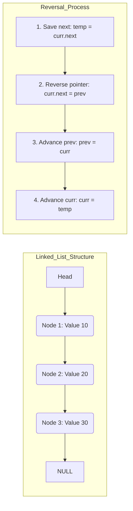

# Singly Linked List: Insertion, Deletion, Reversal, and Floyd’s Cycle Detection

> A Singly Linked List is a fundamental linear data structure where elements, known as nodes, are stored in non-contiguous memory locations and connected sequentially via unidirectional pointers.

## 1. Historical Background & Motivation

The concept of the linked list was pioneered between 1955 and 1956 by **Allen Newell, Cliff Shaw, and Herbert Simon** at the RAND Corporation. It was developed as the primary data structure for their **Information Processing Language (IPL)**. At the time, early computers had extremely limited memory, and the prevailing method of organizing data—contiguous arrays—was brittle. If the size of a dataset wasn't known upfront, programmers faced "memory overflow" or inefficient re-allocation. The linked list solved this by allowing memory to be claimed "on-the-fly."

By 1958, **John McCarthy** adopted linked lists as the foundational structure for **LISP** (List Processing), the second-oldest high-level programming language still in use. McCarthy’s innovation was to treat the list not just as a storage mechanism, but as a mathematical abstraction (the "cons" cell). In modern computing, while dynamic arrays (see [[dynamic-arrays]]) benefit from CPU cache locality, linked lists remain indispensable in systems where $O(1)$ insertion/deletion and fragmentation-resistant memory management are prioritized—such as in the Linux kernel's task scheduling and filesystem block management.

## 2. Visual Intuition
:::demo
<div style="background:#1e1e1e;padding:16px;border-radius:10px;color:#e5e7eb;font-family:system-ui,sans-serif">
  <h3 style="margin:0 0 8px 0;color:#7dd3fc">Singly Linked List: Insertion, Deletion, Reversal, and Floyd’s Cycle Detection - Concept Map</h3>
  <svg width="100%" height="280" viewBox="0 0 640 280" role="img" aria-label="Singly Linked List: Insertion, Deletion, Reversal, and Floyd’s Cycle Detection visual intuition" style="background:#111827;border-radius:8px">
    <rect x="24" y="28" width="180" height="64" rx="10" fill="#1d4ed8" />
    <text x="114" y="66" text-anchor="middle" fill="#e5e7eb" font-size="14">Problem</text>
    <rect x="230" y="28" width="180" height="64" rx="10" fill="#0f766e" />
    <text x="320" y="66" text-anchor="middle" fill="#e5e7eb" font-size="14">Process</text>
    <rect x="436" y="28" width="180" height="64" rx="10" fill="#7c3aed" />
    <text x="526" y="66" text-anchor="middle" fill="#e5e7eb" font-size="14">Outcome</text>

    <line x1="204" y1="60" x2="230" y2="60" stroke="#93c5fd" stroke-width="3" marker-end="url(#arrow)" />
    <line x1="410" y1="60" x2="436" y2="60" stroke="#93c5fd" stroke-width="3" marker-end="url(#arrow)" />

    <rect x="24" y="130" width="592" height="120" rx="10" fill="#0b1220" stroke="#334155" />
    <text x="320" y="156" text-anchor="middle" fill="#cbd5e1" font-size="14">Key intuition for Singly Linked List: Insertion, Deletion, Reversal, and Floyd’s Cycle Detection</text>
    <text x="320" y="182" text-anchor="middle" fill="#94a3b8" font-size="12">Track state changes, constraints, and final behavior.</text>
    <text x="320" y="206" text-anchor="middle" fill="#94a3b8" font-size="12">Use this as a mental model before formal proofs or code.</text>

    <defs>
      <marker id="arrow" markerWidth="10" markerHeight="10" refX="8" refY="3" orient="auto">
        <polygon points="0 0, 10 3, 0 6" fill="#93c5fd" />
      </marker>
    </defs>
  </svg>
  <p style="margin-top:10px;color:#cbd5e1">Interactive-ready visual scaffold for the topic.</p>
</div>
:::
*Caption: A visual representation of a Singly Linked List where each node contains a data field and a 'next' pointer referencing the subsequent node, terminating in a NULL (None) reference.*

## 3. Core Theory & Mathematical Foundations

A Singly Linked List (SLL) is a collection of nodes $S = \{n_1, n_2, \dots, n_k\}$. Formally, a node $n_i$ is a tuple $(v_i, p_i)$ where $v_i \in \text{Data Domain}$ and $p_i$ is a pointer to $n_{i+1}$, with $p_k = \text{null}$.

### 3.1 Non-Contiguous Memory Model
Unlike an array, where the address of the $i$-th element is calculated as $\text{Base} + i \times \text{size}$, a linked list node's address is arbitrary. If $Addr(n_i)$ is the memory address of the $i$-th node:
$$Addr(n_{i+1}) = n_i.\text{next}$$
This means random access is impossible; to reach $n_i$, one must traverse all $i-1$ preceding nodes, resulting in $O(n)$ access time. However, this decoupling from physical adjacency allows the list to grow until the system's entire heap is exhausted, avoiding the $O(n)$ resizing cost associated with dynamic arrays.

### 3.2 Formal Proof of Floyd’s Cycle Detection (The Tortoise and the Hare)
Floyd’s Cycle-Finding Algorithm is a pointer algorithm that uses two pointers moving at different speeds to detect a cycle in $O(n)$ time and $O(1)$ space.

**Theorem:** If a cycle exists, the fast pointer ($f$) and slow pointer ($s$) will eventually meet.
**Proof:** 
1. Let $\mu$ be the distance from the head to the start of the cycle.
2. Let $\lambda$ be the length of the cycle.
3. When the slow pointer enters the cycle (after $\mu$ steps), the fast pointer has taken $2\mu$ steps and is at some position $k$ within the cycle, where $k = \mu \pmod \lambda$.
4. Let the distance between $f$ and $s$ be $d = (\lambda - k) \pmod \lambda$. 
5. In each subsequent step, the gap $d$ decreases by 1 because $f$ moves 2 steps and $s$ moves 1 step ($2 - 1 = 1$).
6. Since the gap decreases by 1 per step, they will meet in exactly $d$ steps after $s$ enters the cycle. Because $d < \lambda$, the total steps taken is $O(\mu + \lambda)$, which is $O(n)$.

### 3.3 Reversal Logic: The Three-Pointer State Machine
Reversing an SLL requires transforming the relation $(n_i \to n_{i+1})$ into $(n_{i+1} \to n_i)$. To do this without losing the rest of the list, we must maintain a reference to three nodes at any given time $t$:
1. **Prev**: The node that will become the new `next`.
2. **Curr**: The node currently being processed.
3. **Next**: A temporary reference to the original `curr.next` to prevent "breaking the chain."

### 3.4 Formal Analysis (Complexity / Correctness)
- **Time Complexity**:
    - Access/Search: $O(n)$ — Linear scan required.
    - Insertion/Deletion at Head: $O(1)$ — Only pointer updates.
    - Insertion/Deletion at Tail: $O(n)$ (without tail pointer) or $O(1)$ (with tail pointer).
    - Reversal: $O(n)$ — Single pass.
- **Space Complexity**: 
    - Iterative operations: $O(1)$ extra space.
    - Recursive operations: $O(n)$ due to call stack (see [[recursion-basics]]).

## 4. Algorithm / Process (Step-by-Step)

### Inserting at the Head
1. Create a new node $N$ with value $X$.
2. Set $N.\text{next}$ to the current `head`.
3. Update `head` to point to $N$.

### Deleting a Node (Given Value $V$)
1. Initialize `curr` at `head`.
2. If `head.val == V`, set `head = head.next` and return.
3. Traverse until `curr.next.val == V` or `curr.next` is null.
4. If found, set `curr.next = curr.next.next`, effectively bypassing the target node.

### Floyd’s Cycle Detection
1. Initialize `slow` and `fast` pointers at `head`.
2. Loop:
    - Move `slow` by 1 step.
    - Move `fast` by 2 steps.
    - If `fast == slow`, return **True** (cycle detected).
    - If `fast` or `fast.next` is null, return **False**.

## 5. Visual Diagram


*Caption: Top: Logical view of a Singly Linked List. Bottom: The atomic state transition required for in-place reversal.*

## 6. Implementation

### 6.1 Core Implementation (Python)

```python
class Node:
    """A single node in a singly linked list."""
    def __init__(self, data):
        self.data = data
        self.next = None

class SinglyLinkedList:
    """
    Standard Singly Linked List with common operations.
    Focuses on clarity and pointer manipulation logic.
    """
    def __init__(self):
        self.head = None

    def insert_at_head(self, data: int) -> None:
        """Complexity: O(1)"""
        new_node = Node(data)
        new_node.next = self.head
        self.head = new_node

    def delete_value(self, key: int) -> bool:
        """Complexity: O(n)"""
        curr = self.head
        
        # Case 1: Head node itself holds the key
        if curr and curr.data == key:
            self.head = curr.next
            return True
            
        # Case 2: Search for the key
        prev = None
        while curr and curr.data != key:
            prev = curr
            curr = curr.next
            
        # Case 3: Key not present
        if not curr:
            return False
            
        # Unlink the node
        prev.next = curr.next
        return True

    def reverse(self) -> None:
        """
        In-place reversal. 
        Complexity: O(n) time, O(1) space.
        """
        prev = None
        curr = self.head
        while curr:
            next_node = curr.next  # Save next
            curr.next = prev       # Reverse
            prev = curr            # Move prev
            curr = next_node       # Move curr
        self.head = prev

    def has_cycle(self) -> bool:
        """
        Floyd's Cycle-Finding Algorithm.
        Complexity: O(n) time, O(1) space.
        """
        slow = self.head
        fast = self.head
        
        while fast and fast.next:
            slow = slow.next          # 1 step
            fast = fast.next.next     # 2 steps
            if slow == fast:
                return True
        return False

# Example Usage:
# llist = SinglyLinkedList()
# llist.insert_at_head(30)
# llist.insert_at_head(20)
# llist.insert_at_head(10)
# llist.reverse()
# print(llist.head.data) # Output: 30
```

### 6.2 Optimized / Production Variant
In production environments (like the CPython source or low-level drivers), linked lists often include a `tail` pointer and a `size` attribute to turn `append` and `len()` operations into $O(1)$.

```python
class ProductionLinkedList:
    def __init__(self):
        self.head = None
        self.tail = None
        self._size = 0

    def append(self, data):
        """O(1) append using tail pointer."""
        new_node = Node(data)
        if not self.head:
            self.head = self.tail = new_node
        else:
            self.tail.next = new_node
            self.tail = new_node
        self._size += 1

    def __len__(self):
        """O(1) size lookup."""
        return self._size
```

### 6.3 Common Pitfalls in Code
1.  **Losing the Head**: Updating `head` before saving its reference in a temporary variable during traversal or insertion.
2.  **Dereferencing NULL**: Accessing `curr.next` without first checking if `curr` is `None`. This is the most common cause of `AttributeError` (Python) or `Segmentation Fault` (C++).
3.  **Cycle Creation**: During insertion or reversal, inadvertently pointing a node back to one of its predecessors, creating an infinite loop.
4.  **Off-by-One in Deletion**: Stopping the traversal at the node to be deleted rather than the node *before* it.

## 7. Interactive Demo

:::demo
<!-- title: Singly Linked List Visualizer -->
<!DOCTYPE html>
<html>
<head>
<meta charset="utf-8">
<style>
  body { margin:0; background:#0f1117; color:#e5e7eb; font-family: system-ui, sans-serif; font-size:13px; padding:16px; overflow: hidden; }
  .controls { margin-bottom: 20px; display: flex; gap: 10px; flex-wrap: wrap; }
  button { background: #3b82f6; color: white; border: none; padding: 6px 12px; border-radius: 4px; cursor: pointer; transition: 0.2s; }
  button:hover { background: #2563eb; }
  button:disabled { background: #4b5563; cursor: not-allowed; }
  #canvas-container { position: relative; width: 100%; height: 250px; border: 1px solid #374151; border-radius: 8px; background: #1f2937; }
  canvas { width: 100%; height: 100%; }
  .status { font-family: monospace; color: #10b981; margin-top: 10px; }
</style>
</head>
<body>
  <div class="controls">
    <button onclick="addNode()">Push Front</button>
    <button onclick="reverseList()">Reverse Step</button>
    <button onclick="resetList()">Reset</button>
  </div>
  <div id="canvas-container">
    <canvas id="listCanvas"></canvas>
  </div>
  <div class="status" id="statusLabel">Status: Ready. Add nodes to start.</div>

<script>
  const canvas = document.getElementById('listCanvas');
  const ctx = canvas.getContext('2d');
  const statusLabel = document.getElementById('statusLabel');
  
  let list = []; // Simple array representation for visualization
  let nodes = []; // Visual properties
  let animationId = null;

  function initCanvas() {
    canvas.width = canvas.offsetWidth;
    canvas.height = canvas.offsetHeight;
  }

  class VisualNode {
    constructor(val, x, y) {
      this.val = val;
      this.x = x;
      this.y = y;
      this.targetX = x;
      this.targetY = y;
    }
    draw(hasNext) {
      ctx.strokeStyle = '#60a5fa';
      ctx.fillStyle = '#1e3a8a';
      ctx.lineWidth = 2;
      ctx.beginPath();
      ctx.roundRect(this.x, this.y, 60, 40, 5);
      ctx.fill();
      ctx.stroke();
      
      ctx.fillStyle = '#fff';
      ctx.font = 'bold 14px Arial';
      ctx.fillText(this.val, this.x + 20, this.y + 25);

      if (hasNext) {
        ctx.beginPath();
        ctx.moveTo(this.x + 60, this.y + 20);
        ctx.lineTo(this.x + 100, this.y + 20);
        ctx.strokeStyle = '#10b981';
        ctx.stroke();
        // Arrow head
        ctx.lineTo(this.x + 95, this.y + 15);
        ctx.moveTo(this.x + 100, this.y + 20);
        ctx.lineTo(this.x + 95, this.y + 25);
        ctx.stroke();
      } else {
        ctx.fillStyle = '#ef4444';
        ctx.font = '10px Arial';
        ctx.fillText('NULL', this.x + 65, this.y + 25);
      }
    }
    update() {
      this.x += (this.targetX - this.x) * 0.1;
      this.y += (this.targetY - this.y) * 0.1;
    }
  }

  function addNode() {
    const val = Math.floor(Math.random() * 100);
    list.unshift(val);
    updatePositions();
    statusLabel.innerText = `Status: Pushed ${val} to front.`;
  }

  function reverseList() {
    if(list.length < 2) return;
    list.reverse();
    updatePositions();
    statusLabel.innerText = `Status: Reversed list pointers.`;
  }

  function resetList() {
    list = [];
    nodes = [];
    statusLabel.innerText = `Status: List cleared.`;
  }

  function updatePositions() {
    nodes = list.map((val, i) => new VisualNode(val, 50 + i * 110, 100));
  }

  function animate() {
    ctx.clearRect(0, 0, canvas.width, canvas.height);
    nodes.forEach((node, i) => {
      node.update();
      node.draw(i < nodes.length - 1);
    });
    requestAnimationFrame(animate);
  }

  window.addEventListener('resize', initCanvas);
  initCanvas();
  animate();
</script>
</body>
</html>
:::

## 8. Worked Examples

### Example 1 — Basic Reversal Application
**Input**: A linked list $1 \to 2 \to 3 \to \text{None}$.
**Step 1**: Initialize `prev=None`, `curr=1`.
- `next = curr.next` (points to 2).
- `curr.next = prev` (1 now points to None).
- `prev = curr` (prev becomes 1).
- `curr = next` (curr becomes 2).
**Step 2**:
- `next = curr.next` (points to 3).
- `curr.next = prev` (2 now points to 1).
- `prev = curr` (prev becomes 2).
- `curr = next` (curr becomes 3).
**Step 3**:
- `next = curr.next` (points to None).
- `curr.next = prev` (3 now points to 2).
- `prev = curr` (prev becomes 3).
- `curr = next` (curr becomes None).
**End**: `head` becomes `prev` (3). New list: $3 \to 2 \to 1 \to \text{None}$.

### Example 2 — Cycle Detection Calculation
Consider a list with nodes $\{A, B, C, D, E\}$ where $E \to C$.
- Step 0: `slow=A`, `fast=A`.
- Step 1: `slow=B`, `fast=C`.
- Step 2: `slow=C`, `fast=E`.
- Step 3: `slow=D`, `fast=D` ($E.\text{next} \to C$, then $C.\text{next} \to D$).
**Result**: `slow == fast` at node D. Cycle detected.

## 9. Comparison with Alternatives

| Feature | Singly Linked List | Dynamic Array | Doubly Linked List |
|---|---|---|---|
| **Access Time** | $O(n)$ | $O(1)$ | $O(n)$ |
| **Insert/Delete at Start** | $O(1)$ | $O(n)$ | $O(1)$ |
| **Insert/Delete at End** | $O(n)$ (or $O(1)$ with tail) | $O(1)$ amortized | $O(1)$ (with tail) |
| **Memory Overhead** | 1 pointer per node | Low (contiguous buffer) | 2 pointers per node |
| **Cache Locality** | Poor | Excellent | Poor |
| **Best Used When** | Frequent insertions/deletions; unknown size. | Frequent access; memory efficiency. | Frequent deletions from both ends. |

## 10. Industry Applications & Real Systems

- **Linux Kernel**: Uses circular singly and doubly linked lists extensively for task lists (running processes). The `list_head` structure is a classic example of "intrusive" linked lists.
- **Git (Version Control)**: A Git commit history is essentially a linked list (technically a Directed Acyclic Graph, but the chain of parent commits follows SLL logic). Each commit "points" to its parent.
- **Music Players**: Playlists are often implemented as linked lists, allowing for $O(1)$ reordering and additions without moving thousands of subsequent track pointers in memory.
- **Filesystems**: FAT (File Allocation Table) uses a linked list of clusters. Each entry in the table points to the next cluster index on the disk.
- **Browser History**: The forward/backward mechanism in web browsers typically utilizes a doubly linked list variant, but the fundamental sequence is a linear chain of nodes representing URLs.

## 11. Practice Problems

### 🟢 Easy
1. **Middle of the Linked List**: Given the head of an SLL, return the middle node. If there are two middle nodes, return the second one.
   *Hint: Use two pointers moving at different speeds.*
   *Expected complexity: $O(n)$ time, $O(1)$ space.*

### 🟡 Medium
2. **Remove Nth Node From End**: Given the head of a linked list, remove the $n$-th node from the end of the list and return its head.
   *Hint: Use two pointers separated by $n$ steps.*
   *Expected complexity: $O(n)$ time, $O(1)$ space.*

3. **Odd Even Linked List**: Group all nodes with odd indices together followed by the nodes with even indices.
   *Hint: Maintain two separate chains and connect them at the end.*

### 🔴 Hard
4. **Merge k Sorted Lists**: You are given an array of $k$ linked-lists, each sorted in ascending order. Merge all of them into one sorted list.
   *Hint: Use a Min-Heap to track the smallest current element across all lists.*
   *Expected complexity: $O(N \log k)$ where $N$ is total nodes.*

5. **Reverse Nodes in k-Group**: Reverse the nodes of a linked list $k$ at a time and return its modified head. If the number of nodes is not a multiple of $k$ left out nodes, in the end, should remain as it is.

## 12. Interactive Quiz

:::quiz
**Q1: What happens if you try to reverse a Singly Linked List without using a temporary variable for 'next'?**
- A) The code runs correctly but slower.
- B) You lose the reference to the rest of the list, making it unreachable.
- C) The list becomes a circular list.
- D) Memory leaks are automatically handled by the garbage collector.
> B — If you update `curr.next` to point to `prev` without saving the original `curr.next`, the pointer to the remainder of the list is overwritten and the nodes are lost in memory.

**Q2: In Floyd’s Cycle Detection, if the cycle length is $L$, what is the maximum number of steps the fast pointer can stay ahead of the slow pointer before they meet?**
- A) $L$
- B) $2L$
- C) $L/2$
- D) $\infty$
> A — Once both pointers are in the cycle, the relative speed is 1. The maximum gap between them is $L-1$, so they must meet in at most $L$ steps.

**Q3: Which operation is significantly faster in a Singly Linked List than in a Dynamic Array?**
- A) Accessing the 500th element.
- B) Appending an element when capacity is full.
- C) Inserting an element at the beginning.
- D) Binary Search.
> C — SLL is $O(1)$ for head insertion; Arrays are $O(n)$ because every subsequent element must be shifted.

**Q4: Given a list $1 \to 2 \to 3 \to 4$, after one step of the reversal algorithm (processing node 1), what does node 1 point to?**
- A) Node 2
- B) Node 0
- C) NULL (None)
- D) Node 4
> C — In the first step, node 1 (current) points to `prev`, which was initialized to `None`.

**Q5: What is the space complexity of reversing a linked list using recursion?**
- A) $O(1)$
- B) $O(n)$
- C) $O(\log n)$
- D) $O(n^2)$
> B — Each recursive call adds a frame to the system call stack. For a list of size $n$, there are $n$ frames.
:::

## 13. Interview Preparation

### Conceptual Questions
**Q: Explain Floyd's Cycle Detection as if teaching it to a fellow engineer.**
*A: It's a two-pointer technique often called "The Tortoise and the Hare." We move a 'slow' pointer one step at a time and a 'fast' pointer two steps at a time. If there's no cycle, the fast pointer hits the end (None). If there is a cycle, the fast pointer eventually "laps" the slow pointer. They are guaranteed to meet within the cycle because the gap between them reduces by exactly one in every iteration, eventually reaching zero.*

**Q: What are the time and space complexities? Derive them.**
*A: For reversal, time is $O(n)$ because we visit each of the $n$ nodes exactly once. Space is $O(1)$ for the iterative approach because we only use three pointers (`prev`, `curr`, `next`) regardless of list size. For recursion, space is $O(n)$ due to the call stack depth.*

**Q: How would you choose between a Singly Linked List and a Dynamic Array in a real system?**
*A: It depends on the access pattern. If I need random access (e.g., "get the 10th item"), I use a dynamic array. If the primary operations are adding/removing items from the front (like a stack) or I'm in a memory-constrained environment where I can't afford a large contiguous block of memory, I'd choose a Singly Linked List.*

**Q: Can you find the start of the cycle, not just detect its presence?**
*A: Yes. Once the slow and fast pointers meet, leave one at the meeting point and reset the other to the head. Move both one step at a time. The point where they meet again is the start of the cycle. This is because the distance from the head to the cycle start is equal to the distance from the meeting point to the cycle start (mod cycle length).*

### Quick Reference (Cheat Sheet)
| Property | Value |
|---|---|
| **Access Time** | $O(n)$ |
| **Search Time** | $O(n)$ |
| **Insert at Head** | $O(1)$ |
| **Insert at Tail** | $O(n)$ (or $O(1)$ if tail-pointer kept) |
| **Stable?** | Yes |
| **In-place?** | Yes (for reversal/deletion) |
| **Memory** | Non-contiguous (Heap) |

## 14. Key Takeaways
1. **Pointers are the core**: Success with SLLs requires visualizing pointer reassignment before writing code.
2. **$O(1)$ Advantage**: The main reason to use SLLs is $O(1)$ head insertion/deletion, which beats $O(n)$ in arrays.
3. **No Random Access**: SLLs are not suitable for algorithms requiring indices (like Binary Search).
4. **Sentinel Nodes**: Using a "dummy" or sentinel node can simplify edge cases during insertion/deletion.
5. **Cycle Detection**: Floyd’s is the gold standard for $O(1)$ space cycle detection.
6. **Reversal is a 3-Step Dance**: Save `next`, flip `curr.next`, move `prev` and `curr`.
7. **Cache Penalty**: Be aware that linked list nodes can be scattered in memory, leading to more cache misses than arrays.

## 15. Common Misconceptions
- ❌ **"Linked Lists are always better than arrays."** → ✅ Not true. For modern CPUs, arrays are often faster even for some $O(n)$ operations because of cache pre-fetching and spatial locality.
- ❌ **"Singly Linked Lists use less memory than Doubly Linked Lists."** → ✅ This is usually true (one pointer vs. two), but the overall memory footprint depends on the data size vs. pointer size.
- ❌ **"You can't reverse a list in $O(n)$ without extra space."** → ✅ You can, using the iterative three-pointer technique.

## 16. Further Reading
- *Introduction to Algorithms (CLRS), 3rd Ed., Chapter 10.2* — Formal treatment of linked data structures.
- *The Art of Computer Programming (Knuth), Vol 1* — Fundamental Algorithms, specifically "Information Structures."
- *Programming Pearls (Bentley)* — Discusses the practical performance of lists vs. arrays.
- [Linux Kernel list.h](https://github.com/torvalds/linux/blob/master/include/linux/list.h) — See how production-grade intrusive lists are implemented.

## 17. Related Topics
- [[doubly-circular-linked]] — Lists with both forward and backward pointers.
- [[complexity-analysis]] — For calculating Big O of list operations.
- [[recursion-basics]] — Essential for understanding recursive list reversals.
- [[stack-implementation]] — Often implemented using a Singly Linked List.
- [[dynamic-arrays]] — The primary competitor to linked lists.
