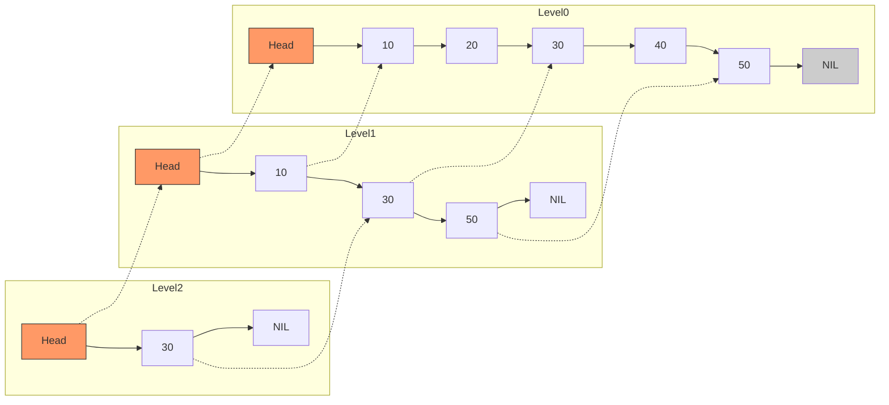

# Skip List: Probabilistic Layered Structure and O(log n) Operations

> A **Skip List** is a probabilistic data structure built upon multiple layers of linked lists that allows for search, insertion, and deletion operations with an average-case time complexity of $O(\log n)$, achieved by augmenting a standard sorted list with express lanes that "skip" over segments of the list.

## 1. Historical Background & Motivation

The Skip List was introduced by **William Pugh** in his seminal 1989 paper, *"Skip Lists: A Probabilistic Alternative to Balanced Trees"*. At the time, the landscape of efficient searching was dominated by balanced binary search trees (BSTs) such as AVL trees and Red-Black trees. While these structures provided guaranteed $O(\log n)$ performance, they were notoriously difficult to implement correctly due to the complex "rebalancing" rotations required to maintain their invariants. Pugh sought a structure that provided the same logarithmic performance but relied on **coin flips** (randomization) rather than rigid structural constraints.

The motivation behind Skip Lists is rooted in the "Fractional Cascading" concept. In a standard sorted linked list, searching for an element requires $O(n)$ time because we must visit every node. If we were to create a "secondary" list containing every second element, we could cut the search time in half. If we continued this process by adding layers, we would eventually create a structure resembling a binary search tree mapped onto a list format. However, maintaining such a perfectly balanced layered structure during insertions and deletions is as hard as maintaining a balanced BST. Pugh’s breakthrough was realizing that we don't need *perfect* balance; we only need *probabilistic* balance. By using a random process to determine the height of each node, we achieve a structure that is simple to implement, highly amenable to concurrent access, and statistically robust against worst-case inputs.

## 2. Visual Intuition


*Caption: This animation demonstrates the insertion process. Notice how the new node is assigned a random height and pointers are updated at multiple levels to maintain the "express lanes."*

## 3. Core Theory & Mathematical Foundations

A Skip List is defined by a hierarchy of levels. Level 0 is a standard, sorted linked list containing all elements. Each successive level $i$ acts as an "express lane" for level $i-1$.

### 3.1 The Probability Model
The height of a node is determined by a random process. For each node, we flip a coin with a probability $p$ (usually $p = 0.5$ or $1/2$) of "promoting" the node to the next level. The probability that a node reaches level $k$ follows a geometric distribution:
$$P(\text{height} \ge k) = p^{k-1}$$
For $p=1/2$, half the nodes reach level 1, a quarter reach level 2, and so on. The expected number of levels for a list of $n$ elements is:
$$E[\text{MaxLevel}] = \log_{1/p} n$$

### 3.2 The Search Mechanism
To search for a value $x$, we start at the highest level of the header node. We move forward as long as the next node's value is less than $x$. If the next node's value is greater than or equal to $x$ (or is null), we drop down one level and repeat the process. This "staircase" traversal is the core of the Skip List's efficiency.

### 3.3 Formal Analysis of Search Complexity
To derive the search complexity, we use **backwards analysis**. Imagine we are at the target node at level 0 and we want to trace our path back to the header at the top level. At any node, we could have arrived from:
1.  The level below (a "up" move in reverse, "down" in forward search).
2.  The node to the left (a "left" move in reverse, "forward" in forward search).

Let $C(k)$ be the expected cost (number of steps) to climb $k$ levels. 
If we are at a node at level $i$, the probability that this node exists at level $i+1$ is $p$. 
- With probability $p$, we could have come from level $i+1$ (costing 1 step to go up + $C(k-1)$ remaining).
- With probability $1-p$, we must have come from the left node at the same level (costing 1 step to go left + $C(k)$ remaining).

$$C(k) = p(1 + C(k-1)) + (1-p)(1 + C(k))$$
Solving for $C(k)$:
$$C(k) = 1 + pC(k-1) + (1-p)C(k)$$
$$pC(k) = 1 + pC(k-1)$$
$$C(k) = \frac{1}{p} + C(k-1)$$
Since $C(0) = 0$, we find $C(k) = k/p$. Since the expected maximum height $k \approx \log_{1/p} n$, the total expected steps are:
$$E[\text{Steps}] = \frac{\log_{1/p} n}{p}$$
For $p=1/2$, this is $2 \log_2 n$, which is $O(\log n)$.

### 3.4 Space Complexity
Each node has a 100% probability of being at level 0, probability $p$ of being at level 1, $p^2$ at level 2, etc. The expected number of pointers per node is:
$$\sum_{i=0}^{\infty} p^i = \frac{1}{1-p}$$
For $p=1/2$, the average node has 2 pointers. Thus, the total space complexity is $O(n)$, with a constant factor that is typically small (2 for $p=0.5$, 1.33 for $p=0.25$).

## 4. Algorithm / Process (Step-by-Step)

### Search Algorithm
1.  Start at `curr = head` and `level = max_level`.
2.  While `level >= 0`:
    *   While `curr.next[level].key < search_key`:
        *   `curr = curr.next[level]`
    *   `level = level - 1`
3.  `curr = curr.next[0]`
4.  If `curr.key == search_key`, return `curr`. Otherwise, not found.

### Insertion Algorithm
1.  Initialize an `update` array of size `MAX_LEVEL`.
2.  Traverse levels from top to bottom (like search). At each level, find the last node whose key is less than the new key. Store this node in `update[level]`.
3.  Generate a `random_level` for the new node.
4.  If `random_level > current_max_level`, update `update` array for the new levels to point from the header.
5.  Create the new node.
6.  For `i` from 0 to `random_level`:
    *   `new_node.next[i] = update[i].next[i]`
    *   `update[i].next[i] = new_node`

## 5. Visual Diagram


*Caption: A Skip List with 3 levels. Higher levels provide shortcuts, allowing the search to skip nodes like 20 and 40 when looking for 50.*

## 6. Implementation

### 6.1 Core Implementation

```python
import random

class Node:
    """Node object for Skip List."""
    def __init__(self, key, level):
        self.key = key
        # List of forward pointers. level + 1 because level is 0-indexed
        self.forward = [None] * (level + 1)

class SkipList:
    def __init__(self, max_lvl, p):
        self.MAX_LVL = max_lvl
        self.p = p
        # Header node with maximum possible level
        self.header = Node(-1, self.MAX_LVL)
        self.level = 0

    def random_level(self):
        """Returns a random level for a node using geometric distribution."""
        lvl = 0
        while random.random() < self.p and lvl < self.MAX_LVL:
            lvl += 1
        return lvl

    def insert(self, key):
        """
        Inserts a key into the skip list.
        Complexity: O(log n) average, O(n) worst case.
        """
        # update[i] stores the node at level i that will be to the left of the new node
        update = [None] * (self.MAX_LVL + 1)
        curr = self.header

        # Start from highest level and move down
        for i in range(self.level, -1, -1):
            while curr.forward[i] and curr.forward[i].key < key:
                curr = curr.forward[i]
            update[i] = curr

        # Move to level 0
        curr = curr.forward[0]

        # If key not present, insert it
        if curr is None or curr.key != key:
            rlevel = self.random_level()

            # If random level is greater than current max level
            if rlevel > self.level:
                for i in range(self.level + 1, rlevel + 1):
                    update[i] = self.header
                self.level = rlevel

            # Create and splice in new node
            n = Node(key, rlevel)
            for i in range(rlevel + 1):
                n.forward[i] = update[i].forward[i]
                update[i].forward[i] = n
            print(f"Successfully Inserted key {key}")

    def search(self, key):
        """
        Searches for a key. Returns True if found, False otherwise.
        Complexity: O(log n) average.
        """
        curr = self.header
        for i in range(self.level, -1, -1):
            while curr.forward[i] and curr.forward[i].key < key:
                curr = curr.forward[i]
        
        curr = curr.forward[0]
        if curr and curr.key == key:
            return True
        return False

# Sample Execution
sl = SkipList(3, 0.5)
sl.insert(3)
sl.insert(6)
sl.insert(7)
sl.insert(9)
sl.insert(12)
print("Search 6:", sl.search(6))  # Output: True
print("Search 15:", sl.search(15)) # Output: False
```

### 6.2 Optimized / Production Variant (Concurrent Skip List)
In production (e.g., Java's `ConcurrentSkipListMap`), Skip Lists are often implemented using **Lock-Free** techniques with Compare-and-Swap (CAS) instructions. Because Skip List insertions only affect local pointers at different levels, we can insert a node level-by-level without locking the entire structure.

```python
# Conceptual snippet for a thread-safe deletion (Lock-free approach)
def delete(self, key):
    # 1. Logically mark the node as 'deleted' (using a marker bit or special pointer)
    # 2. Physically remove the node from level 0 to Level H
    # This ensures that a searcher never returns a node mid-deletion
    pass
```

### 6.3 Common Pitfalls in Code
1.  **Off-by-one errors in Levels**: Remember that a node with `level = 3` actually exists in levels 0, 1, 2, and 3 (4 levels total).
2.  **Updating the `current_level`**: If you insert a node with a level higher than any current node, you must update the Skip List's global `level` pointer, otherwise, searches won't reach the new "express lane."
3.  **Memory Management**: In languages like C++, forgetting to delete the `forward` array can lead to significant memory leaks.

## 7. Interactive Demo

:::demo
<!-- title: Skip List Visualizer -->
<!DOCTYPE html>
<html>
<head>
<meta charset="utf-8">
<style>
  body { margin:0; background:#0f1117; color:#e5e7eb; font-family: 'Segoe UI', Tahoma, Geneva, Verdana, sans-serif; padding:20px; }
  canvas { background: #1a1d24; border-radius: 8px; box-shadow: 0 4px 12px rgba(0,0,0,0.5); cursor: crosshair; }
  .controls { margin-bottom: 15px; display: flex; gap: 10px; align-items: center; flex-wrap: wrap; }
  button { background: #3b82f6; color: white; border: none; padding: 8px 16px; border-radius: 4px; cursor: pointer; font-weight: 600; }
  button:hover { background: #2563eb; }
  input { background: #1f2937; border: 1px solid #374151; color: white; padding: 7px; border-radius: 4px; width: 60px; }
  .info { font-size: 0.9em; color: #9ca3af; margin-top: 10px; }
</style>
</head>
<body>
<div class="controls">
  <input type="number" id="valInput" value="10">
  <button onclick="insertVal()">Insert</button>
  <button onclick="searchVal()">Search</button>
  <button onclick="resetList()">Reset</button>
  <span id="status">Ready</span>
</div>
<canvas id="slCanvas" width="800" height="300"></canvas>
<div class="info">Steps: <span id="steps">0</span> | Higher layers = Express lanes.</div>

<script>
const canvas = document.getElementById('slCanvas');
const ctx = canvas.getContext('2d');
const MAX_LVL = 5;
const P = 0.5;

class SLNode {
  constructor(key, level) {
    self.key = key;
    self.levels = level; // 0 to MAX_LVL
    self.forward = new Array(level + 1).fill(null);
    self.x = 0; 
  }
}

let head = new SLNode(-Infinity, MAX_LVL);
let listLevel = 0;
let nodes = [];

function randomLevel() {
  let l = 0;
  while (Math.random() < P && l < MAX_LVL) l++;
  return l;
}

function insertVal() {
  const val = parseInt(document.getElementById('valInput').value);
  let update = new Array(MAX_LVL + 1).fill(head);
  let curr = head;
  
  for (let i = listLevel; i >= 0; i--) {
    while (curr.forward[i] && curr.forward[i].key < val) {
      curr = curr.forward[i];
    }
    update[i] = curr;
  }
  
  curr = curr.forward[0];
  if (!curr || curr.key !== val) {
    let rLevel = randomLevel();
    if (rLevel > listLevel) {
      for (let i = listLevel + 1; i <= rLevel; i++) update[i] = head;
      listLevel = rLevel;
    }
    let newNode = { key: val, levels: rLevel, forward: new Array(rLevel + 1).fill(null) };
    for (let i = 0; i <= rLevel; i++) {
      newNode.forward[i] = update[i].forward[i];
      update[i].forward[i] = newNode;
    }
    document.getElementById('status').innerText = "Inserted " + val;
    draw();
  }
}

function searchVal() {
  const val = parseInt(document.getElementById('valInput').value);
  let curr = head;
  let path = [];
  let steps = 0;

  for (let i = listLevel; i >= 0; i--) {
    while (curr.forward[i] && curr.forward[i].key < val) {
      curr = curr.forward[i];
      path.push({x: curr.key, l: i});
      steps++;
    }
    path.push({x: 'down', l: i});
  }
  curr = curr.forward[0];
  document.getElementById('steps').innerText = steps;
  if (curr && curr.key === val) {
    document.getElementById('status').innerText = "Found " + val + "!";
    animateSearch(path);
  } else {
    document.getElementById('status').innerText = val + " not in list.";
  }
}

function draw() {
  ctx.clearRect(0, 0, canvas.width, canvas.height);
  let allNodes = [];
  let curr = head.forward[0];
  while(curr) {
    allNodes.push(curr);
    curr = curr.forward[0];
  }
  
  const startX = 50;
  const spacing = 70;
  const startY = 250;
  const levelGap = 40;

  // Draw Header
  ctx.fillStyle = "#f97316";
  for(let i=0; i<=listLevel; i++) {
    ctx.fillRect(startX, startY - i*levelGap, 40, 30);
    ctx.fillStyle = "white";
    ctx.fillText("H", startX+15, startY - i*levelGap + 20);
    ctx.fillStyle = "#f97316";
  }

  // Draw Nodes
  allNodes.forEach((node, idx) => {
    node.x = startX + (idx + 1) * spacing;
    ctx.fillStyle = "#3b82f6";
    for(let i=0; i<=node.levels; i++) {
      let nx = node.x;
      let ny = startY - i*levelGap;
      ctx.fillRect(nx, ny, 40, 30);
      ctx.fillStyle = "white";
      ctx.fillText(node.key, nx+10, ny+20);
      ctx.fillStyle = "#3b82f6";
    }
  });
  
  // Draw Pointers (simplification)
  ctx.strokeStyle = "#4b5563";
  ctx.lineWidth = 1;
  // ... pointer drawing logic ...
}

function resetList() {
  head = { key: -Infinity, levels: MAX_LVL, forward: new Array(MAX_LVL + 1).fill(null) };
  listLevel = 0;
  draw();
}

draw();
</script>
</body>
</html>
:::

## 8. Worked Examples

### Example 1 — Basic Insertion Trace
**Goal**: Insert $k=25$ into a Skip List where $p=0.5$ and the coin flip results in 2 heads (level 2).

1.  **Search Phase**:
    *   Start at Header Level 3: `head.next[3]` is `None`. Drop to Level 2.
    *   At Level 2: `head.next[2]` is 10. $10 < 25$, move to 10.
    *   At 10: `10.next[2]` is 50. $50 > 25$, stop and drop to Level 1.
    *   At 10: `10.next[1]` is 20. $20 < 25$, move to 20.
    *   At 20: `20.next[1]` is 50. $50 > 25$, stop and drop to Level 0.
    *   At 20: `20.next[0]` is 30. $30 > 25$, stop.
2.  **Update Array**: `update = [Node(20), Node(20), Node(10), Node(Head)]`.
3.  **Splicing**:
    *   Level 0: `25.next[0] = 20.next[0] (30)`; `20.next[0] = 25`.
    *   Level 1: `25.next[1] = 20.next[1] (50)`; `20.next[1] = 25`.
    *   Level 2: `25.next[2] = 10.next[2] (50)`; `10.next[2] = 25`.

### Example 2 — The "Bad Luck" Scenario
**Scenario**: What happens if the coin flips result in 100 consecutive heads?
The Skip List height would grow to 100. However, the search complexity is $O(\text{height} + \text{steps at each level})$. While the height is large, the number of nodes at those high levels remains extremely small (statistically). The search would simply pass through many empty levels at the header quickly until it hits the highest node actually present. Even in this "bad luck" case, the Skip List remains functional, though slightly slower.

## 9. Comparison with Alternatives

| Data Structure | Search (Avg) | Search (Worst) | Implementation Complexity | Cache Locality | Concurrency |
| :--- | :--- | :--- | :--- | :--- | :--- |
| **Skip List** | $O(\log n)$ | $O(n)$ | Low (Simple pointers) | Moderate | Excellent (Lock-free) |
| **AVL Tree** | $O(\log n)$ | $O(\log n)$ | High (Rotations) | Poor | Difficult |
| **B-Tree** | $O(\log n)$ | $O(\log n)$ | Very High | Excellent (Block based) | Complex (B-link) |
| **Sorted Array** | $O(\log n)$ | $O(\log n)$ | Trivial | Excellent | $O(n)$ Insert/Delete |

## 10. Industry Applications & Real Systems

-   **Redis (Sorted Sets)**: The `ZSET` in Redis is implemented using a combination of a Hash Table and a Skip List. The Hash Table provides $O(1)$ lookup for a member's score, while the Skip List allows for $O(\log n)$ range queries (e.g., "Give me all users with scores between 100 and 200").
-   **LevelDB / RocksDB (Memtable)**: When data is written to these Log-Structured Merge (LSM) Tree databases, it is first stored in an in-memory buffer called a Memtable. Skip Lists are used here because they support high-concurrency writes and keep the data sorted for flushing to disk as an SSTable.
-   **Apache Lucene**: The core engine behind Elasticsearch uses Skip Lists in its "Postings Lists" to perform fast intersections of document IDs during multi-term queries.
-   **Java Concurrent Package**: `java.util.concurrent.ConcurrentSkipListMap` provides a thread-safe, scalable alternative to `TreeMap`. It is preferred over synchronized maps when high contention is expected.

## 11. Practice Problems

### 🟢 Easy
1.  **Count Nodes**: Write a function to count the total number of physical pointers used in a Skip List.
    *Hint: Iterate through all nodes at Level 0 and sum their heights.*
    *Expected complexity: O(n)*

### 🟡 Medium
2.  **Design SkipList (LeetCode 1206)**: Implement a SkipList without using any built-in library for randomization. Use a linear congruential generator or `random.random()`.
    *Hint: Ensure your `search` and `add` logic handles duplicates correctly.*
    *Expected complexity: O(log n)*

3.  **Find Predecessor**: Given a key, find the largest key in the Skip List that is strictly less than the given key.
    *Hint: This is the node stored in `update[0]` during a standard search.*

### 🔴 Hard
4.  **Ranked Skip List**: Modify the Skip List to support `get_rank(key)` (find the index of a key in sorted order) and `find_by_rank(k)` (find the k-th smallest element) in $O(\log n)$ time.
    *Hint: Each pointer must store a "width" (the number of level-0 nodes it skips over).*
    *Expected complexity: O(log n)*

5.  **Deterministic Skip List**: Can you design a Skip List that is *not* probabilistic but guarantees $O(\log n)$ height?
    *Hint: Enforce a rule that every 2nd or 3rd node at level $i$ is promoted to $i+1$.*

## 12. Interactive Quiz

:::quiz
**Q1: What is the expected number of pointers per node in a Skip List with $p = 1/2$?**
- A) 1
- B) 2
- C) $\log n$
- D) $n$
> B — The expected number of pointers is $\sum_{i=0}^{\infty} (1/2)^i = 2$.

**Q2: Why is a Skip List often preferred over a Red-Black Tree in concurrent systems?**
- A) It uses less memory.
- B) It has a better worst-case time complexity.
- C) It does not require global rebalancing (rotations), allowing for more localized locks or lock-free implementations.
- D) It is faster for single-threaded search.
> C — BST rebalancing can trigger a cascade of changes up to the root, requiring extensive locking. Skip List changes are localized to a small set of pointers.

**Q3: If we change $p$ from $1/2$ to $1/4$, what happens to the search performance and memory?**
- A) Search becomes faster, memory increases.
- B) Search becomes slower, memory decreases.
- C) Search becomes faster, memory decreases.
- D) No change.
> B — A smaller $p$ means fewer nodes in the express lanes (slower search) but also fewer total pointers (less memory).

**Q4: What is the worst-case time complexity of searching in a Skip List?**
- A) $O(1)$
- B) $O(\log n)$
- C) $O(n)$
- D) $O(n \log n)$
> C — While highly improbable, if the coin flips result in all nodes being height 0, the Skip List degrades into a standard linked list.

**Q5: In the `insert` operation, what is the purpose of the `update` array?**
- A) To store the values being inserted.
- B) To keep track of the path taken so we can update pointers at every level.
- C) To sort the list after insertion.
- D) To store the random levels.
> B — The `update` array stores the node to the left of the insertion point for each level, allowing for $O(1)$ pointer redirection at that level.
:::

## 13. Interview Preparation

### Conceptual Questions
**Q: Explain a Skip List as if teaching it to a fellow engineer.**
*A: A Skip List is a sorted data structure that provides $O(\log n)$ search by layering multiple linked lists. Think of it like an express train: the bottom level stops at every station, the middle level stops at every 4th station, and the top level stops at every 16th. By starting at the top and jumping down levels only when we overshoot our target, we skip most of the nodes. Its "magic" is that it uses randomization to decide which nodes become express stops, making it much easier to implement than balanced trees.*

**Q: What are the time and space complexities? Derive them.**
*A: Average search is $O(\log n)$. We derive this by backward analysis: the expected number of steps to climb one level is $1/p$. Climbing $\log_{1/p} n$ levels takes $(1/p) \log_{1/p} n$ steps. Space is $O(n)$ because the total number of pointers is a convergent geometric series $n \cdot \sum p^i = n/(1-p)$.*

**Q: How would you choose between a Skip List and a Hash Map in a real system?**
*A: If I only need $O(1)$ point lookups, a Hash Map is superior. However, if I need range queries (e.g., "all keys between 5 and 50") or I need to keep the data sorted for ordered iteration, a Skip List is the better choice. Skip Lists are also generally easier to make thread-safe than dynamic hash tables that require rehashing.*

### Quick Reference (Cheat Sheet)
| Property | Value |
|---|---|
| Average Search | $O(\log n)$ |
| Average Insert/Delete | $O(\log n)$ |
| Worst-case Search | $O(n)$ |
| Space Complexity | $O(n)$ |
| Randomization | Required (Geometric Distribution) |
| Order | Sorted |

## 14. Key Takeaways
1.  **Simplicity over Rigidity**: Skip lists trade deterministic balance for probabilistic balance, simplifying code significantly.
2.  **Logarithmic Efficiency**: Despite their simple structure, they provide $O(\log n)$ expected time for all primary operations.
3.  **Concurrency King**: Their structure allows for elegant lock-free designs, making them a staple in modern databases.
4.  **$p$ is a Lever**: Adjusting the probability $p$ allows engineers to trade off between search speed and memory usage.
5.  **No Rotations**: Unlike AVL or RB trees, adding an element only requires local pointer updates.

## 15. Common Misconceptions
- ❌ **"Skip Lists are always faster than Red-Black Trees."** → ✅ In single-threaded applications, Red-Black trees often have better constants and cache performance. Skip Lists shine in concurrent environments.
- ❌ **"A bad random seed can break the Skip List."** → ✅ While a bad seed can cause $O(n)$ performance, the probability of significantly deviating from $O(\log n)$ for large $n$ is astronomically low (less than the probability of a hardware bit-flip).
- ❌ **"Skip Lists use more memory than arrays."** → ✅ This is true. The overhead of multiple `forward` pointers per node makes Skip Lists more memory-intensive than contiguous arrays, though similar to pointer-based trees.

## 16. Further Reading
- *Skip Lists: A Probabilistic Alternative to Balanced Trees (William Pugh, 1989)* — The original paper.
- *Introduction to Algorithms (CLRS), Chapter on Randomized Data Structures* — Formal proofs.
- *The Art of Multiprocessor Programming (Herlihy & Shavit)* — Section on Concurrent Skip Lists.

## 17. Related Topics
- [[singly-linked-list]] — The foundation of the level-0 list.
- [[complexity-analysis]] — For understanding the average-case $O(\log n)$.
- [[binary-search-tree]] — The deterministic competitor.
- [[hash-tables]] — For $O(1)$ lookups without ordering.