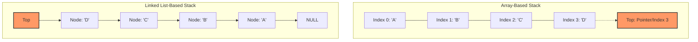

# Stack Implementation: Array and Linked List Backed, Monotonic Stack Uses

> A **Stack** is a linear data structure that restricts access to a "Last-In, First-Out" (LIFO) order, where all insertions (push) and deletions (pop) are performed at a single end called the **top**.

## 1. Historical Background & Motivation

The concept of the stack as a fundamental computing structure was formalized independently by several pioneers. In 1945, Alan Turing used the term "reversion" to describe the process of storing and retrieving return addresses during subroutine calls in his design for the Automatic Computing Engine (ACE). However, it was not until 1955 that Friedrich L. Bauer and Klaus Samelson filed a patent for the "stack" (originally called the "cellar") as a mechanism for expression evaluation and parsing. Their work laid the foundation for modern compiler theory and the Shunting-yard algorithm.

In modern computing, the stack is the bedrock of execution. Every time a function is called in a high-level language like Python, C++, or Java, a "stack frame" is pushed onto the **Call Stack**. This frame stores local variables, parameters, and the return address. Without the stack, recursion—a fundamental pillar of computer science—would be impossible to implement efficiently. Furthermore, stacks are ubiquitous in hardware architecture, where stack pointers (e.g., the `ESP/RSP` register in x86) manage memory at the CPU level. The evolution of the stack has moved from a hardware-constrained fixed-size buffer to sophisticated dynamic implementations that power everything from the "Undo" button in your text editor to the "Back" button in your web browser.

## 2. Visual Intuition
:::demo
<div style="background:#1e1e1e;padding:16px;border-radius:10px;color:#e5e7eb;font-family:system-ui,sans-serif">
  <h3 style="margin:0 0 8px 0;color:#7dd3fc">Stack Implementation: Array and Linked List Backed, Monotonic Stack Uses - Concept Map</h3>
  <svg width="100%" height="280" viewBox="0 0 640 280" role="img" aria-label="Stack Implementation: Array and Linked List Backed, Monotonic Stack Uses visual intuition" style="background:#111827;border-radius:8px">
    <rect x="24" y="28" width="180" height="64" rx="10" fill="#1d4ed8" />
    <text x="114" y="66" text-anchor="middle" fill="#e5e7eb" font-size="14">Problem</text>
    <rect x="230" y="28" width="180" height="64" rx="10" fill="#0f766e" />
    <text x="320" y="66" text-anchor="middle" fill="#e5e7eb" font-size="14">Process</text>
    <rect x="436" y="28" width="180" height="64" rx="10" fill="#7c3aed" />
    <text x="526" y="66" text-anchor="middle" fill="#e5e7eb" font-size="14">Outcome</text>

    <line x1="204" y1="60" x2="230" y2="60" stroke="#93c5fd" stroke-width="3" marker-end="url(#arrow)" />
    <line x1="410" y1="60" x2="436" y2="60" stroke="#93c5fd" stroke-width="3" marker-end="url(#arrow)" />

    <rect x="24" y="130" width="592" height="120" rx="10" fill="#0b1220" stroke="#334155" />
    <text x="320" y="156" text-anchor="middle" fill="#cbd5e1" font-size="14">Key intuition for Stack Implementation: Array and Linked List Backed, Monotonic Stack Uses</text>
    <text x="320" y="182" text-anchor="middle" fill="#94a3b8" font-size="12">Track state changes, constraints, and final behavior.</text>
    <text x="320" y="206" text-anchor="middle" fill="#94a3b8" font-size="12">Use this as a mental model before formal proofs or code.</text>

    <defs>
      <marker id="arrow" markerWidth="10" markerHeight="10" refX="8" refY="3" orient="auto">
        <polygon points="0 0, 10 3, 0 6" fill="#93c5fd" />
      </marker>
    </defs>
  </svg>
  <p style="margin-top:10px;color:#cbd5e1">Interactive-ready visual scaffold for the topic.</p>
</div>
:::
*Caption: A LIFO stack in action: Elements are added to the top and removed from the top. Notice how the first element pushed (bottom) is the last one removed.*

## 3. Core Theory & Mathematical Foundations

### 3.1 Formal Definition
Formally, a stack $S$ is an algebraic data type defined by a sequence of elements and a set of operations. Let $T$ be the type of elements stored. A stack can be viewed as a tuple $(L, n)$ where $L = (e_1, e_2, \dots, e_n)$ is a sequence and $n \in \mathbb{N}$ is the current size.

The operations are defined as:
1.  **Push**: $S \times T \to S$
    If $S = (e_1, \dots, e_n)$ and $x \in T$, then $push(S, x) = (e_1, \dots, e_n, x)$.
2.  **Pop**: $S \to S \times T$
    If $S = (e_1, \dots, e_n)$ and $n > 0$, then $pop(S) = ((e_1, \dots, e_{n-1}), e_n)$.
3.  **Peek/Top**: $S \to T$
    $top(S) = e_n$.

### 3.2 Memory Models: Array vs. Linked List
There are two primary ways to manifest a stack in memory:

#### The Sequential Model (Array-based)
In this model, elements are stored in contiguous memory blocks. 
- **Pros**: Excellent **cache locality**. Since elements are adjacent, the CPU can pre-fetch data into L1/L2 caches, leading to significant performance gains in tight loops.
- **Cons**: Fixed size (unless using dynamic arrays). Resizing involves an $O(N)$ copy operation.

#### The Linked Model (Node-based)
In this model, each element is a "node" containing a value and a pointer to the element below it.
- **Pros**: Non-contiguous memory. The stack grows and shrinks dynamically without needing to reallocate a massive block of memory.
- **Cons**: Pointer overhead (each node requires extra memory for the `next` reference). Poor cache locality because nodes may be scattered throughout the heap.

### 3.3 Monotonic Stacks: The "Waiting Room" Principle
A **Monotonic Stack** is a specialized stack where elements are always sorted in a specific order (either strictly increasing or decreasing). 
To maintain a **Monotonic Increasing Stack**: 
Before pushing an element $x$, we pop all elements $y$ from the stack such that $y > x$. 
This structure is vital for solving "Nearest Neighbor" problems. If we want to find the "Next Greater Element" (NGE) for every index in an array, the monotonic stack allows us to do this in $O(N)$ time instead of the naive $O(N^2)$.

### 3.4 Formal Analysis (Complexity / Correctness)

#### Amortized Analysis of Array-based Push
For a dynamic array implementation (like Python's `list`), the $O(1)$ push time is "amortized." 
**Proof using the Potential Method:**
Define a potential function $\Phi$ such that:
$$\Phi(D_i) = 2 \cdot i - size(D_i)$$
where $i$ is the number of elements and $size(D_i)$ is the current capacity. 
1. When the array is half full, $\Phi = 0$.
2. Just before doubling, $i = size$, so $\Phi = size$.
3. After doubling, the capacity becomes $2 \cdot size$, so $\Phi = 2 \cdot size - 2 \cdot size = 0$.
The actual cost of a doubling push is $i + 1$. The change in potential is $\Phi(D_i) - \Phi(D_{i-1}) = 0 - size = -size$.
Amortized cost $c_i' = c_i + \Delta\Phi = (size + 1) + (-size) = 1$. Thus, the amortized cost is $O(1)$.

## 4. Algorithm / Process (Step-by-Step)

### Push Operation (Linked List Backed)
1.  **Create Node**: Instantiate a new node object with the given data.
2.  **Link**: Set the `next` pointer of the new node to the current `top`.
3.  **Update Top**: Set the `top` pointer of the stack to the new node.
4.  **Increment**: Increase the `size` counter.

### Pop Operation (Array Backed)
1.  **Underflow Check**: Check if `size == 0`. If so, throw an error.
2.  **Access**: Retrieve the value at `array[size - 1]`.
3.  **Decrement**: Decrease the `size` counter.
4.  **Optional Shrink**: If `size < capacity / 4`, consider resizing the array to save memory.
5.  **Return**: Return the retrieved value.

## 5. Visual Diagram


*Caption: Comparison of physical memory layouts. The array uses contiguous blocks with an index-based top, while the linked list uses nodes with pointers.*

## 6. Implementation

### 6.1 Core Implementation (Linked List Backed)

```python
class Node:
    """A single node in the stack."""
    def __init__(self, value):
        self.value = value
        self.next = None

class LinkedStack:
    """
    Standard Stack implementation using a Singly Linked List.
    All operations (push, pop, peek) are O(1).
    """
    def __init__(self):
        self._top = None
        self._size = 0

    def push(self, value):
        """Adds an element to the top. O(1)."""
        new_node = Node(value)
        new_node.next = self._top
        self._top = new_node
        self._size += 1

    def pop(self):
        """Removes and returns the top element. O(1)."""
        if self.is_empty():
            raise IndexError("Pop from empty stack")
        
        popped_val = self._top.value
        self._top = self._top.next
        self._size -= 1
        return popped_val

    def peek(self):
        """Returns the top element without removing it. O(1)."""
        if self.is_empty():
            raise IndexError("Peek from empty stack")
        return self._top.value

    def is_empty(self):
        """Returns True if the stack is empty."""
        return self._top is None

    def __len__(self):
        return self._size

# Sample Usage:
# s = LinkedStack()
# s.push(10)
# s.push(20)
# print(s.pop()) # Output: 20
```

### 6.2 Optimized / Monotonic Variant

```python
def next_greater_element(nums):
    """
    Given an array, find the next greater element for every element.
    Uses a Monotonic Decreasing Stack.
    Complexity: O(N) Time, O(N) Space.
    """
    res = [-1] * len(nums)
    stack = []  # Indices of elements waiting for their NGE
    
    for i in range(len(nums)):
        # While the current number is greater than the number represented 
        # by the index on the stack top, we've found the NGE for that index.
        while stack and nums[i] > nums[stack[-1]]:
            idx = stack.pop()
            res[idx] = nums[i]
        
        stack.append(i)
        
    return res

# Input: [2, 1, 2, 4, 3]
# Output: [4, 2, 4, -1, -1]
```

### 6.3 Common Pitfalls in Code
1.  **Memory Leaks (Java/C++/Python)**: In an array-based stack, when you "pop" an item by decrementing the index, the reference to the object still exists in the array. This prevents the Garbage Collector from reclaiming it. Always set `array[top] = None` (in Python/Java) or call destructors (in C++).
2.  **Underflow Exceptions**: Attempting to `pop` or `peek` from an empty stack is a common cause of production crashes. Always guard these calls with `is_empty()` checks.
3.  **Recursive Stack Overflow**: Using the system call stack for deep recursion. For inputs where $N > 1000$, always prefer an explicit `while` loop with a manual `stack` object to avoid `RecursionError`.

## 7. Interactive Demo

:::demo
<!-- title: Stack Visualization Demo -->
<!DOCTYPE html>
<html>
<head>
<meta charset="utf-8">
<style>
  body { margin:0; background:#0f1117; color:#e5e7eb; font-family: 'Segoe UI', Tahoma, Geneva, Verdana, sans-serif; font-size:13px; padding:16px; }
  .controls { display: flex; gap: 10px; margin-bottom: 20px; flex-wrap: wrap; }
  .stack-container { display: flex; flex-direction: column-reverse; align-items: center; border-bottom: 4px solid #4b5563; min-height: 300px; width: 120px; margin: 0 auto; padding-bottom: 5px; }
  .stack-node { 
    width: 100px; height: 40px; background: #3b82f6; border: 2px solid #1e40af; 
    display: flex; justify-content: center; align-items: center; margin-bottom: 4px;
    font-weight: bold; border-radius: 4px; transition: all 0.3s ease;
    animation: slideDown 0.3s ease-out;
  }
  @keyframes slideDown { from { transform: translateY(-100px); opacity: 0; } to { transform: translateY(0); opacity: 1; } }
  .pop-animation { transform: translateX(200px); opacity: 0; }
  button { padding: 6px 12px; cursor: pointer; background: #374151; color: white; border: none; border-radius: 4px; }
  button:hover { background: #4b5563; }
  .info { text-align: center; margin-top: 10px; font-family: monospace; }
</style>
</head>
<body>
  <div class="controls">
    <input type="text" id="valInput" placeholder="Value" style="width: 50px; background:#1f2937; color:white; border:1px solid #4b5563;">
    <button onclick="pushVal()">Push</button>
    <button onclick="popVal()">Pop</button>
    <button onclick="clearStack()">Reset</button>
  </div>
  <div class="stack-container" id="stack"></div>
  <div class="info" id="status">Stack: Empty</div>

<script>
  let stackData = [];
  const stackEl = document.getElementById('stack');
  const statusEl = document.getElementById('status');
  const inputEl = document.getElementById('valInput');

  function updateDisplay() {
    stackEl.innerHTML = '';
    stackData.forEach((val, i) => {
      const div = document.createElement('div');
      div.className = 'stack-node';
      div.innerText = val;
      if (i === stackData.length - 1) div.style.background = '#10b981';
      stackEl.appendChild(div);
    });
    statusEl.innerText = `Size: ${stackData.length} | Top: ${stackData.length > 0 ? stackData[stackData.length-1] : 'None'}`;
  }

  function pushVal() {
    const val = inputEl.value || Math.floor(Math.random() * 100);
    if (stackData.length >= 7) { alert("Stack Overflow (Demo limit)"); return; }
    stackData.push(val);
    inputEl.value = '';
    updateDisplay();
  }

  function popVal() {
    if (stackData.length === 0) { alert("Stack Underflow!"); return; }
    const nodes = document.querySelectorAll('.stack-node');
    const topNode = nodes[nodes.length - 1];
    topNode.classList.add('pop-animation');
    setTimeout(() => {
      stackData.pop();
      updateDisplay();
    }, 250);
  }

  function clearStack() {
    stackData = [];
    updateDisplay();
  }
</script>
</body>
</html>
:::

## 8. Worked Examples

### Example 1 — Valid Parentheses
**Problem**: Determine if a string containing `(`, `)`, `{`, `}`, `[` and `]` is balanced.
**Input**: `"{ [ ] ( ) }"`
1.  Initialize empty stack $S$.
2.  Scan `{`: It's an opener, `push('{')`. $S = ['{']$.
3.  Scan `[`: It's an opener, `push('[')`. $S = ['{', '[']$.
4.  Scan `]`: It's a closer. Check $top(S)$. $top(S) = '['$. Since they match, `pop()`. $S = ['{']$.
5.  Scan `(`: It's an opener, `push('(')`. $S = ['{', '(']$.
6.  Scan `)`: It's a closer. Check $top(S)$. $top(S) = '('$. Since they match, `pop()`. $S = ['{']$.
7.  Scan `}`: It's a closer. Check $top(S)$. $top(S) = '{'$. Since they match, `pop()`. $S = []$.
8.  End of string. Stack is empty. **Result: Balanced**.

### Example 2 — Monotonic Stack (Next Greater Element)
**Problem**: For `[4, 5, 2, 25]`, find the first greater element to the right of each.
1.  Input: `[4, 5, 2, 25]`, $S = []$.
2.  `4`: $S$ empty, `push(4)`. $S = [4]$.
3.  `5`: `5 > top(S) (4)`. Pop `4`, answer for `4` is `5`. `push(5)`. $S = [5]$.
4.  `2`: `2 < top(S) (5)`. `push(2)`. $S = [5, 2]$.
5.  `25`:
    - `25 > top(S) (2)`. Pop `2`, answer for `2` is `25`.
    - `25 > top(S) (5)`. Pop `5`, answer for `5` is `25`.
    - `push(25)`. $S = [25]$.
6.  End. Pop remaining in $S$ and set to `-1`. Answer for `25` is `-1`.

## 9. Comparison with Alternatives

| Approach | Push Time | Pop Time | Space Complexity | Cache Locality | Best Used When |
|---|---|---|---|---|---|
| **Array-Backed** | O(1)* | O(1) | O(N) (Contiguous) | **Excellent** | High performance, known size, or memory is tight. |
| **Linked List** | O(1) | O(1) | O(N) (Overhead) | Poor | Unpredictable growth, frequent reallocations. |
| **Monotonic Stack** | O(1)* | O(1)* | O(N) | Excellent | Solving "Nearest Neighbor" or "Histogram" problems. |
| **Recursion** | O(1) | O(1) | O(D) (Depth) | Poor | Tree traversals, naturally recursive logic. |

*\*Amortized for Dynamic Arrays.*

## 10. Industry Applications & Real Systems

- **Google V8 Engine**: JavaScript engines use a call stack to manage function execution. In the Chrome DevTools, you can actually view the "Call Stack" at any breakpoint to see the chain of execution.
- **Adobe Photoshop**: The "Undo/Redo" functionality is implemented using two stacks. When you perform an action, it's pushed to the `Undo` stack. When you hit `Ctrl+Z`, the action is popped from `Undo` and pushed to `Redo`.
- **Git (Version Control)**: Although technically a DAG (Directed Acyclic Graph), Git's `stash` command uses a stack. `git stash push` stores current changes, and `git stash pop` applies the most recent changes back to the working directory.
- **Compilers (LLVM/GCC)**: Compilers use stacks to convert infix expressions (e.g., $3 + 4 * 2$) into Postfix/Reverse Polish Notation (RPN) for easier CPU evaluation without needing to understand operator precedence during the final calculation.
- **Operating Systems**: Stacks are used for interrupt handling. When a hardware interrupt occurs, the CPU pushes the current program counter and register state onto a kernel stack before switching to the interrupt handler.

## 11. Practice Problems

### 🟢 Easy
1.  **Min Stack**: Design a stack that supports `push`, `pop`, `top`, and retrieving the minimum element in constant time.
    *Hint: Use a second auxiliary stack to keep track of the current minimum at each state.*
    *Expected complexity: O(1) for all operations.*

### 🟡 Medium
2.  **Daily Temperatures**: Given an array `temperatures`, return an array such that `results[i]` is the number of days you have to wait after the $i$-th day to get a warmer temperature.
    *Hint: Use a monotonic decreasing stack to store indices.*
    *Expected complexity: O(N) time.*

3.  **Evaluate Reverse Polish Notation**: Evaluate the value of an arithmetic expression in RPN. Input: `["2", "1", "+", "3", "*"]` -> `(2 + 1) * 3 = 9`.
    *Hint: Push numbers; when you see an operator, pop two numbers, apply it, and push the result.*

### 🔴 Hard
4.  **Largest Rectangle in Histogram**: Given an array of integers `heights` representing a histogram's bar height where the width of each bar is 1, find the area of the largest rectangle in the histogram.
    *Hint: Maintain a monotonic increasing stack of indices. When you find a shorter bar, you've found the right boundary for the rectangle formed by the bar at the top of the stack.*
    *Expected complexity: O(N).*

5.  **Trapping Rain Water**: Given `n` non-negative integers representing an elevation map where the width of each bar is 1, compute how much water it can trap after raining.
    *Hint: A monotonic stack can find the 'bounded' areas between peaks.*

## 12. Interactive Quiz

:::quiz
**Q1: Why is an array-based stack generally faster than a linked-list stack despite both having O(1) time complexity?**
- A) Arrays use less total memory.
- B) Linked lists require O(N) to find the tail.
- C) Array-based stacks benefit from spatial locality and CPU caching.
- D) Arrays have faster mathematical additions.
> C — Spatial locality means elements are next to each other in memory. CPUs load memory in blocks (cache lines), so accessing `arr[i+1]` after `arr[i]` is significantly faster than following a pointer to a random memory address in a heap.

**Q2: In a Monotonic Increasing Stack, what happens when you try to push a value $x$ that is smaller than the current top $y$?**
- A) The push is rejected.
- B) $x$ is pushed normally.
- C) $y$ is popped, and the process repeats until the top is $\leq x$.
- D) The stack is sorted using Quicksort.
> C — To maintain a monotonic increasing order (e.g., [1, 3, 5, 8]), if you want to push '4', you must remove '8' and '5' first so that the stack remains sorted.

**Q3: What is the primary risk of using a recursive approach (the system stack) instead of an explicit stack for a Depth First Search on a large graph?**
- A) Stack Overflow (Recursion Limit).
- B) Time complexity becomes O(N^2).
- C) The graph will be traversed in BFS order instead.
- D) Memory will be leaked.
> A — Most OS/Languages have a fixed limit for the call stack (often 1MB-8MB). A graph with 1,000,000 nodes in a line would crash a recursive DFS but work fine with an explicit heap-allocated stack.

**Q4: In the amortized analysis of a dynamic array, why is the doubling factor usually 2?**
- A) It's the only way to get O(1).
- B) It balances the cost of copying with the frequency of reallocations.
- C) Hardware can only multiply by 2.
- D) To prevent memory fragmentation.
> B — A geometric growth (like doubling) ensures that the total cost of all copies remains $O(N)$ for $N$ insertions, resulting in $O(1)$ amortized cost. Linear growth (e.g., adding 100 slots) would result in $O(N^2)$ total time.

**Q5: Which of the following is NOT a LIFO structure application?**
- A) Browser History (Back button).
- B) Function calls in a program.
- C) Task scheduling in a multi-threaded OS.
- D) Undo mechanism in text editors.
> C — Task scheduling usually requires a Queue (First-In, First-Out) or a Priority Queue, not a Stack, to ensure fairness and responsiveness.
:::

## 13. Interview Preparation

### Conceptual Questions
**Q: Explain the difference between the Stack Data Structure and the System Stack.**
*A: A stack data structure is a generic abstract data type (LIFO) used to solve algorithmic problems. The system stack is a specific implementation of this structure in memory (usually managed by the OS/CPU) used to store local variables and return addresses during function execution. While they follow the same LIFO logic, the system stack has rigid size limits and is managed automatically.*

**Q: What is the time complexity of a Monotonic Stack algorithm (like Next Greater Element)?**
*A: It is $O(N)$. Even though there is a `while` loop inside the `for` loop, every element is pushed onto the stack exactly once and popped from the stack exactly once. Therefore, the total number of operations across the entire algorithm is $2N$, which simplifies to $O(N)$.*

**Q: How would you implement a stack that is thread-safe?**
*A: In a multi-threaded environment, two threads might try to `pop` the same element simultaneously, leading to a race condition. I would use a **Mutex (Lock)**. Before any `push` or `pop`, the thread must acquire the lock. For high-concurrency systems, I might use a "Lock-free" stack using `Compare-And-Swap` (CAS) atomic operations to update the `top` pointer.*

**Q: Tell me about a time you had to optimize memory using a stack.**
*A: (STAR approach) I was working on a tree-parsing utility that used recursion. For deeply nested files (3000+ levels), we hit `StackOverflowError`. I refactored the recursion into an iterative approach using an explicit `deque` in Python as a stack. This allowed the memory to be allocated on the heap, which is much larger, and also improved performance by avoiding function call overhead.*

### Quick Reference (Cheat Sheet)
| Property | Value |
|---|---|
| Average Push | $O(1)$ |
| Average Pop | $O(1)$ |
| Search Time | $O(N)$ |
| Access Time | $O(1)$ (Top only) |
| Space Complexity | $O(N)$ |
| Stable? | N/A (Not a sort) |
| In-place? | Yes (Array-based) |

## 14. Key Takeaways
1.  **LIFO is the Core**: Every stack problem boils down to "the most recent thing I saw is the most important."
2.  **Monotonic Stacks are Powerhouse Tools**: They turn $O(N^2)$ nested-loop problems into $O(N)$ linear scans by "remembering" indices.
3.  **Arrays for Performance**: Use array-based stacks (like Python's `[]`) for better cache performance unless the stack size is wildly volatile.
4.  **The "Underflow" Trap**: Always check `if stack:` before popping in an interview. It's the most common "gotcha."
5.  **Recursion vs. Iteration**: Every recursive algorithm can be implemented iteratively with a stack. This is often safer for production systems.
6.  **Stack as a Buffer**: Stacks are used whenever you need to reverse an order or process elements in a nested structure (HTML tags, JSON, Parentheses).

## 15. Common Misconceptions
- ❌ **"Stacks are only for recursion"** → ✅ Stacks are used in graph algorithms (DFS), expression evaluation, memory management, and undo logic.
- ❌ **"Linked list stacks are always better because they grow"** → ✅ Modern CPUs are so much faster at reading contiguous memory (arrays) that linked lists are often slower due to "cache misses."
- ❌ **"Pop returns nothing"** → ✅ In many formal definitions, `pop()` returns the value. In some implementations (like C++ `std::stack`), `pop()` returns void and you must call `top()` first. Always clarify the API.

## 16. Further Reading
- *Introduction to Algorithms (CLRS)* — Chapter 10.1: Stacks and Queues.
- *The Art of Computer Programming (Knuth)* — Volume 1, Section 2.2.1: Stacks.
- *Effective Java (Bloch)* — Item 7: Eliminate obsolete object references (covers stack memory leaks).
- *Original Paper*: Bauer, F. L., & Samelson, K. (1959). "The Sequential Formula Translation." *Communications of the ACM*.

## 17. Related Topics
- [[complexity-analysis]] — For deep dives into amortized costs.
- [[singly-linked-list]] — The underlying structure for node-based stacks.
- [[recursion-basics]] — How the system uses the stack.
- [[dynamic-arrays]] — How `list` in Python works internally.
- [[queue-implementation]] — The FIFO counterpart to the stack.
