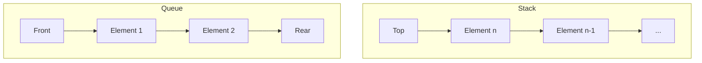

# Stacks and Queues

> Stacks and queues serve as the fundamental linear data structures that govern access patterns through LIFO and FIFO disciplines, providing the architectural scaffolding for complex algorithmic processes.

## Overview
Stacks and queues are restricted-access data structures where elements are added and removed according to specific rules. A stack operates on the **Last-In, First-Out (LIFO)** principle, mirroring the physical behavior of a stack of plates. Conversely, a queue operates on the **First-In, First-Out (FIFO)** principle, mirroring a standard line at a service counter. Both structures serve as the cornerstone of computer science, abstracting the memory management and process synchronization tasks essential for operating systems and compiler design.

Historically, the stack was formalized by Alan Turing to manage subroutines (the call stack), while the queue emerged from the need for asynchronous buffer management in early batch processing systems. Understanding these structures is not merely about storage; it is about controlling the flow of execution and data within high-performance software systems.

## 2. Visual Intuition
:::demo
<div style="background:#1e1e1e;padding:16px;border-radius:10px;color:#e5e7eb;font-family:system-ui,sans-serif">
  <h3 style="margin:0 0 8px 0;color:#7dd3fc">Stacks and Queues - Concept Map</h3>
  <svg width="100%" height="280" viewBox="0 0 640 280" role="img" aria-label="Stacks and Queues visual intuition" style="background:#111827;border-radius:8px">
    <rect x="24" y="28" width="180" height="64" rx="10" fill="#1d4ed8" />
    <text x="114" y="66" text-anchor="middle" fill="#e5e7eb" font-size="14">Problem</text>
    <rect x="230" y="28" width="180" height="64" rx="10" fill="#0f766e" />
    <text x="320" y="66" text-anchor="middle" fill="#e5e7eb" font-size="14">Process</text>
    <rect x="436" y="28" width="180" height="64" rx="10" fill="#7c3aed" />
    <text x="526" y="66" text-anchor="middle" fill="#e5e7eb" font-size="14">Outcome</text>

    <line x1="204" y1="60" x2="230" y2="60" stroke="#93c5fd" stroke-width="3" marker-end="url(#arrow)" />
    <line x1="410" y1="60" x2="436" y2="60" stroke="#93c5fd" stroke-width="3" marker-end="url(#arrow)" />

    <rect x="24" y="130" width="592" height="120" rx="10" fill="#0b1220" stroke="#334155" />
    <text x="320" y="156" text-anchor="middle" fill="#cbd5e1" font-size="14">Key intuition for Stacks and Queues</text>
    <text x="320" y="182" text-anchor="middle" fill="#94a3b8" font-size="12">Track state changes, constraints, and final behavior.</text>
    <text x="320" y="206" text-anchor="middle" fill="#94a3b8" font-size="12">Use this as a mental model before formal proofs or code.</text>

    <defs>
      <marker id="arrow" markerWidth="10" markerHeight="10" refX="8" refY="3" orient="auto">
        <polygon points="0 0, 10 3, 0 6" fill="#93c5fd" />
      </marker>
    </defs>
  </svg>
  <p style="margin-top:10px;color:#cbd5e1">Interactive-ready visual scaffold for the topic.</p>
</div>
:::
*Caption: A visual representation of LIFO (Stack) vs FIFO (Queue) logic.*

## Core Theory
### Stack Mechanics
A stack is defined by a set of operations that maintain the invariant of the top element. Let $S$ be a stack of size $n$. The primary operations are:
1. `push(x)`: $S[top+1] = x; top = top + 1$
2. `pop()`: $result = S[top]; top = top - 1$
3. `peek()`: Return $S[top]$

The time complexity for these operations in an array-based implementation is $O(1)$. In a linked-list implementation, the head of the list serves as the stack top, allowing $O(1)$ push and pop without the risk of stack overflow (unless the heap is exhausted).

### Queue Dynamics
A queue is defined by operations on both ends. Let $Q$ be a queue with `front` and `rear` pointers.
- `enqueue(x)`: $Q[rear] = x; rear = (rear + 1) \pmod N$
- `dequeue()`: $result = Q[front]; front = (front + 1) \pmod N$

The use of modular arithmetic transforms a fixed-size array into a **circular buffer**, preventing the "lost space" problem inherent in simple array-based queues. The effective storage capacity is $N-1$ to distinguish between empty and full states.

## Visual Diagram

*Comparison of access patterns: The stack restricts access to the most recently added item, while the queue maintains the insertion order.*

## Code Example
```python
from collections import deque

# Stack Implementation using List
stack = []
stack.append('A') # Push
stack.append('B')
top = stack.pop() # Pop -> returns 'B'
print(f"Popped from Stack: {top}")

# Queue Implementation using deque (Double-Ended Queue)
# deque is optimized for O(1) appends and pops from both ends
queue = deque()
queue.append('Task 1') # Enqueue
queue.append('Task 2')
item = queue.popleft() # Dequeue -> returns 'Task 1'
print(f"Dequeued from Queue: {item}")

# Expected Output:
# Popped from Stack: B
# Dequeued from Queue: Task 1
```

## Interactive Demo
:::demo
<!DOCTYPE html>
<html>
<body>
<div id="display">Stack: []</div>
<button onclick="push()">Push</button>
<button onclick="pop()">Pop</button>
<script>
  let s = [];
  const d = document.getElementById('display');
  function push() { s.push(Math.floor(Math.random()*100)); d.innerText = "Stack: [" + s.join(', ') + "]"; }
  function pop() { s.pop(); d.innerText = "Stack: [" + s.join(', ') + "]"; }
</script>
</body>
</html>
:::

## Worked Example
**Problem:** Convert the infix expression `A + B * C` to postfix.
1. Scan `A`: Output `A`. Stack: empty.
2. Scan `+`: Stack: `[+]`. Output: `A`.
3. Scan `B`: Output `AB`. Stack: `[+]`.
4. Scan `*`: Since `*` > `+` (precedence), push `*`. Stack: `[+, *]`.
5. Scan `C`: Output `ABC`. Stack: `[+, *]`.
6. Pop remainder: Output `ABC*+`.

## Industry Applications
- **Compiler Design (Google/Clang):** Use stacks for operator precedence and syntax tree construction.
- **Message Queues (AWS SQS/RabbitMQ):** Enable asynchronous communication between microservices via FIFO buffers.
- **Operating Systems (Linux Kernel):** Use circular queues for Interrupt Request (IRQ) handling and process scheduling.
- **Undo/Redo Systems (Adobe/JetBrains):** Use dual-stack architectures to track command history.

## Practice Problems

### Easy
1. **Valid Parentheses:** Given a string of brackets, check if they are balanced using a stack. *(Hint: Push open, pop/compare on close.)*

### Medium
2. **Min Stack:** Design a stack that supports `getMin()` in $O(1)$ time. *(Hint: Store a parallel stack or tuple of (val, min).)*
3. **Queue via Stacks:** Implement a queue using two stacks.

### Hard
4. **LRU Cache:** Design a cache with $O(1)$ lookup and eviction using a Hash Map and a Doubly Linked List (Deque variant).

## Interactive Quiz
:::quiz
**Q1: What is the primary advantage of a circular queue over a linear queue?**
- A) Faster access.
- B) Memory reuse.
- C) Thread safety.
- D) Support for priority.
> B — Circular queues reuse the indices vacated by dequeue operations, preventing array overflow when space is actually available.

**Q2: Which data structure best models the "undo" functionality in text editors?**
- A) Queue.
- B) Deque.
- C) Stack.
- D) Heap.
> C — The LIFO nature of a stack perfectly mirrors the sequence of actions, allowing the most recent action to be reverted first.

**Q3: What is the time complexity of searching for an element in a stack?**
- A) O(1).
- B) O(log n).
- C) O(n).
- D) O(n log n).
> C — Stacks do not support direct indexing; finding an element requires popping all top elements, resulting in linear time.
:::

## Interview Questions
**Q: Explain stacks and queues to a senior engineer.**
*A: Stacks and queues are fundamental ADTs (Abstract Data Types) used to enforce ordering constraints. Stacks (LIFO) are essential for depth-first traversal and state restoration, while Queues (FIFO) facilitate breadth-first search and asynchronous task buffering. We choose between them based on whether we need to prioritize recency (stack) or fairness (queue).*

**Q: What is the complexity of an array-based queue dequeue operation?**
*A: In a naive implementation, removing the front element requires shifting $n-1$ elements, making it $O(n)$. By using a circular array with `front` and `rear` pointers, we shift indices rather than memory, achieving $O(1)$ amortized time.*

**Q: Why use a deque over a stack or queue?**
*A: A deque (double-ended queue) provides a flexible interface supporting both stacks and queues. It is commonly used in algorithms like the Sliding Window Maximum, where elements need to be added or removed from either end efficiently.*

**Q: How would you scale a queue in a distributed system?**
*A: Use a message broker like Kafka. Decouple producers and consumers, partition the queue for parallel processing, and implement acknowledgement patterns to ensure at-least-once or exactly-once delivery.*

## Key Takeaways
- **Stack:** LIFO, push/pop/peek at top, $O(1)$.
- **Queue:** FIFO, enqueue/dequeue at ends, $O(1)$ with circular array.
- **Circular Buffer:** Prevents $O(n)$ shifting in fixed-size arrays.
- **Function Call Stack:** Uses a stack for frame management.
- **BFS/DFS:** BFS utilizes a Queue; DFS utilizes a Stack.

## Common Misconceptions
- ❌ **Queue dequeue is always O(1)** → ✅ Only with circular arrays or linked lists; naive array shifts are $O(n)$.
- ❌ **Stack can access any element** → ✅ Stacks only allow access to the top; searching requires destructive popping.

## Related Topics
- [[linked-lists]] — Fundamental for dynamic allocation of queues/stacks.
- [[trees]] — Uses stacks/queues for DFS/BFS traversals.
- [[recursion]] — Relies entirely on the system stack for state maintenance.
