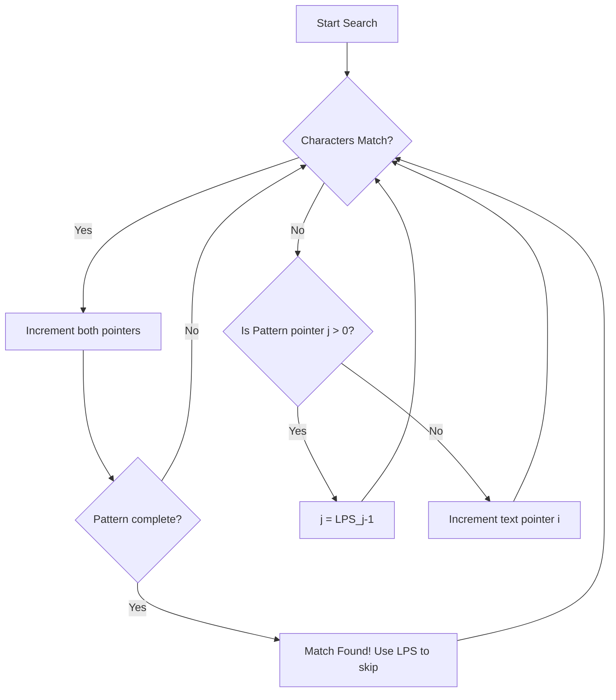

# String Operations: Manipulation, Pattern Matching, and StringBuilder

> A string is a finite sequence of characters from an alphabet, and string operations encompass the algorithmic techniques used to search, modify, and efficiently construct these sequences.

## 1. Historical Background & Motivation

The formalization of string algorithms traces its roots back to the early 1960s and 70s, driven by two primary catalysts: the birth of computational linguistics and the need for efficient biological sequence analysis. Before the advent of high-level string abstractions, programmers treated text as mere arrays of integers (ASCII or EBCDIC values). The breakthrough came when Donald Knuth and Vaughan Pratt, and independently James H. Morris, developed the first linear-time pattern-matching algorithm in 1970 (KMP), which solved a problem that had plagued early text editors: the inefficiency of the "naive" $O(N \cdot M)$ search.

In the modern era, string operations are the bedrock of the Internet. Every search query you type into Google, every DNA sequence analyzed for genomic research, and every piece of data transmitted over JSON utilizes these fundamental algorithms. As systems scaled, the "Immutable String" problem emerged in languages like Java and Python, where concatenating strings in a loop resulted in $O(N^2)$ time complexity. This led to the development of the `StringBuilder` pattern and "Rope" data structures, which optimize memory allocation and copy operations. Understanding strings is not merely about character arrays; it is about managing memory, minimizing redundant comparisons, and leveraging mathematical properties like rolling hashes and finite automata.

## 2. Visual Intuition
:::demo
<div style="background:#1e1e1e;padding:16px;border-radius:10px;color:#e5e7eb;font-family:system-ui,sans-serif">
  <h3 style="margin:0 0 8px 0;color:#7dd3fc">String Operations: Manipulation, Pattern Matching, and StringBuilder - Concept Map</h3>
  <svg width="100%" height="280" viewBox="0 0 640 280" role="img" aria-label="String Operations: Manipulation, Pattern Matching, and StringBuilder visual intuition" style="background:#111827;border-radius:8px">
    <rect x="24" y="28" width="180" height="64" rx="10" fill="#1d4ed8" />
    <text x="114" y="66" text-anchor="middle" fill="#e5e7eb" font-size="14">Problem</text>
    <rect x="230" y="28" width="180" height="64" rx="10" fill="#0f766e" />
    <text x="320" y="66" text-anchor="middle" fill="#e5e7eb" font-size="14">Process</text>
    <rect x="436" y="28" width="180" height="64" rx="10" fill="#7c3aed" />
    <text x="526" y="66" text-anchor="middle" fill="#e5e7eb" font-size="14">Outcome</text>

    <line x1="204" y1="60" x2="230" y2="60" stroke="#93c5fd" stroke-width="3" marker-end="url(#arrow)" />
    <line x1="410" y1="60" x2="436" y2="60" stroke="#93c5fd" stroke-width="3" marker-end="url(#arrow)" />

    <rect x="24" y="130" width="592" height="120" rx="10" fill="#0b1220" stroke="#334155" />
    <text x="320" y="156" text-anchor="middle" fill="#cbd5e1" font-size="14">Key intuition for String Operations: Manipulation, Pattern Matching, and StringBuilder</text>
    <text x="320" y="182" text-anchor="middle" fill="#94a3b8" font-size="12">Track state changes, constraints, and final behavior.</text>
    <text x="320" y="206" text-anchor="middle" fill="#94a3b8" font-size="12">Use this as a mental model before formal proofs or code.</text>

    <defs>
      <marker id="arrow" markerWidth="10" markerHeight="10" refX="8" refY="3" orient="auto">
        <polygon points="0 0, 10 3, 0 6" fill="#93c5fd" />
      </marker>
    </defs>
  </svg>
  <p style="margin-top:10px;color:#cbd5e1">Interactive-ready visual scaffold for the topic.</p>
</div>
:::
*Caption: The KMP algorithm avoids redundant character comparisons by using a "failure function" (LPS array) to skip over sections of the text that have already been partially matched.*

## 3. Core Theory & Mathematical Foundations

### 3.1 The Immutability Constraint and Memory Allocation
In many high-level languages (Python, Java, C#), strings are **immutable**. This is a design choice that facilitates thread safety, string interning (reusing memory for identical strings), and hash-key stability. However, it introduces a significant performance pitfall. 

Consider the operation: `s = s + "a"`. 
Since `s` cannot be changed in place, the runtime must:
1. Allocate a new block of memory of size $len(s) + 1$.
2. Copy all characters of $s$ into the new block.
3. Append "a".
4. Update the reference `s`.

Performing this in a loop of $N$ iterations leads to a summation: $1 + 2 + 3 + \dots + N$, which is $\sum_{i=1}^{N} i = \frac{N(N+1)}{2} = O(N^2)$. To solve this, we use the `StringBuilder` pattern (or `"".join()` in Python), which leverages **dynamic arrays** (growth factor $\gamma$, usually $1.5$ or $2$) to achieve $O(N)$ amortized time for $N$ appends.

### 3.2 Rabin-Karp and Rolling Hashes
The Rabin-Karp algorithm uses hashing to find a pattern in a text. The core idea is that if two strings are equal, their hash values must also be equal (ignoring collisions). To make this efficient, we use a **Rolling Hash**.

Given a string $S$, we treat it as a number in base $b$ (where $b$ is the size of the alphabet, e.g., 256 for ASCII). The hash value $H(S[i \dots i+m-1])$ is calculated as:
$$H = (s_0 \cdot b^{m-1} + s_1 \cdot b^{m-2} + \dots + s_{m-1} \cdot b^0) \pmod q$$
where $q$ is a large prime number to minimize collisions.

When sliding the window from index $i$ to $i+1$, the new hash $H_{new}$ is derived from $H_{old}$ in $O(1)$ time:
$$H_{new} = \left( (H_{old} - s_i \cdot b^{m-1}) \cdot b + s_{i+m} \right) \pmod q$$

### 3.3 Knuth-Morris-Pratt (KMP) Theory
KMP improves the naive $O(N \cdot M)$ search by utilizing the **Longest Prefix which is also a Suffix (LPS)**. Let $P$ be a pattern of length $M$. We precompute an array $\pi$ where $\pi[i]$ is the length of the longest proper prefix of $P[0 \dots i]$ that is also a suffix of $P[0 \dots i]$.

**Formal Definition:**
$$\pi[q] = \max \{k : k < q \text{ and } P_k \sqsupset P_q \}$$
where $P_k$ denotes the prefix of $P$ of length $k$, and $\sqsupset$ denotes the suffix relation.

### 3.4 Formal Analysis (Complexity / Correctness)
- **KMP:** The preprocessing step takes $O(M)$ by using two pointers that never backtrack. The matching step takes $O(N)$ because the pointer in the text only moves forward. Even though the pattern pointer $j$ might move backward, the total number of backward moves is bounded by the total number of forward moves.
- **Rabin-Karp:** The average time is $O(N + M)$. However, in the worst case (many hash collisions), it can degrade to $O(N \cdot M)$. The probability of a collision is approximately $1/q$, so choosing a large prime $q \approx 10^9 + 7$ makes the worst case statistically negligible.

## 4. Algorithm / Process (Step-by-Step)

### The KMP Preprocessing (LPS Array Construction)
1. Initialize `lps[0] = 0` and a pointer `length = 0`.
2. Iterate `i` from 1 to $M-1$:
   - If `pattern[i] == pattern[length]`, increment `length`, set `lps[i] = length`, and increment `i`.
   - If mismatch:
     - If `length != 0`, update `length = lps[length - 1]` (try the next shortest prefix).
     - If `length == 0`, set `lps[i] = 0` and increment `i`.

### The KMP Search Process
1. Initialize `i = 0` (text index) and `j = 0` (pattern index).
2. While `i < N`:
   - If `text[i] == pattern[j]`, increment both.
   - If `j == M`, pattern found at `i - j`. Update `j = lps[j - 1]` to find the next match.
   - If mismatch `text[i] != pattern[j]`:
     - If `j != 0`, set `j = lps[j - 1]`.
     - If `j == 0`, increment `i`.

## 5. Visual Diagram


*Caption: The flow of control in KMP, highlighting the logic that avoids re-scanning the text.*

## 6. Implementation

### 6.1 Core Implementation (KMP in Python)

```python
def compute_lps(pattern):
    """
    Computes the Longest Prefix Suffix (LPS) array for KMP.
    Time Complexity: O(M)
    Space Complexity: O(M)
    """
    m = len(pattern)
    lps = [0] * m
    length = 0  # length of the previous longest prefix suffix
    i = 1

    while i < m:
        if pattern[i] == pattern[length]:
            length += 1
            lps[i] = length
            i += 1
        else:
            if length != 0:
                # Crucial step: do not increment i, skip back in pattern
                length = lps[length - 1]
            else:
                lps[i] = 0
                i += 1
    return lps

def kmp_search(text, pattern):
    """
    KMP String Matching Algorithm.
    Returns a list of start indices where pattern occurs in text.
    Time Complexity: O(N + M)
    Space Complexity: O(M)
    """
    n, m = len(text), len(pattern)
    if m == 0: return []
    
    lps = compute_lps(pattern)
    results = []
    i = 0  # index for text
    j = 0  # index for pattern
    
    while i < n:
        if pattern[j] == text[i]:
            i += 1
            j += 1
        
        if j == m:
            results.append(i - j)
            j = lps[j - 1]
        elif i < n and pattern[j] != text[i]:
            if j != 0:
                j = lps[j - 1]
            else:
                i += 1
                
    return results

# Sample Usage:
# text = "ABABDABACDABABCABAB"
# pattern = "ABABCABAB"
# Output: [10]
```

### 6.2 Optimized / Production Variant (StringBuilder pattern)

In Python, the most efficient way to build a string from many components is to use a list and the `.join()` method. This is the idiomatic "StringBuilder."

```python
def build_large_string(data_list):
    """
    Efficiently concatenates many strings.
    Complexity: O(Total_Length)
    """
    # Bad practice: O(N^2)
    # result = ""
    # for s in data_list: result += s
    
    # Best practice: O(N)
    return "".join(data_list)

import io

def buffer_example():
    """
    Using io.StringIO for complex, multi-step construction.
    Mimics Java's StringBuilder or C#'s StringWriter.
    """
    output = io.StringIO()
    output.write("Performance ")
    output.write("is ")
    output.write("paramount.")
    final_str = output.getvalue()
    output.close()
    return final_str
```

### 6.3 Common Pitfalls in Code
- **Off-by-one in LPS:** Forgetting that `lps[length - 1]` is the correct index to jump back to, not `lps[length]`.
- **Inefficient Concatenation:** Using `+=` inside a loop in Python. While some modern Python interpreters (CPython 3.6+) have optimizations for simple `s += t`, it is not guaranteed and fails for complex scenarios.
- **Rabin-Karp Modulo Arithmetic:** Forgetting to handle negative results of `(A - B) % mod` in languages like C++/Java. In Python, `%` always returns a positive value if the divisor is positive.

## 7. Interactive Demo

:::demo
<!-- title: KMP Search Visualizer -->
<!DOCTYPE html>
<html>
<head>
<meta charset="utf-8">
<style>
  body { margin:0; background:#0f1117; color:#e5e7eb; font-family: 'Courier New', monospace; font-size:14px; padding:20px; }
  .grid { display: flex; gap: 4px; margin-bottom: 10px; }
  .cell { width: 35px; height: 35px; border: 1px solid #374151; display: flex; align-items: center; justify-content: center; border-radius: 4px; transition: all 0.3s; }
  .active { background: #3b82f6; border-color: #60a5fa; color: white; transform: scale(1.1); }
  .match { background: #10b981; border-color: #34d399; color: white; }
  .mismatch { background: #ef4444; border-color: #f87171; color: white; }
  .pointer { font-weight: bold; color: #f59e0b; text-align: center; margin-top: 5px; }
  .controls { margin-top: 20px; display: flex; gap: 10px; }
  button { padding: 8px 16px; background: #1f2937; border: 1px solid #374151; color: white; cursor: pointer; border-radius: 4px; }
  button:hover { background: #374151; }
  .info { margin-top: 20px; padding: 15px; background: #1a1d24; border-radius: 8px; line-height: 1.6; }
</style>
</head>
<body>
  <h3>KMP Pattern Matching Step-by-Step</h3>
  <div id="text-row" class="grid"></div>
  <div id="pattern-row" class="grid"></div>
  <div id="info-box" class="info">Click "Start" to see the LPS-based jump in action.</div>
  
  <div class="controls">
    <button onclick="init()">Reset</button>
    <button onclick="step()">Next Step</button>
    <button onclick="run()">Play/Pause</button>
  </div>

<script>
  const text = "AABAACAADAABAABA";
  const pattern = "AABA";
  let i = 0, j = 0;
  let lps = [0, 1, 0, 1]; // Simplified for demo
  let interval = null;
  let running = false;

  function init() {
    i = 0; j = 0;
    document.getElementById('text-row').innerHTML = text.split('').map((c, idx) => `<div class="cell" id="t-${idx}">${c}</div>`).join('');
    render();
    document.getElementById('info-box').innerText = "Initialized. Text: " + text + " | Pattern: " + pattern;
  }

  function render() {
    const pRow = document.getElementById('pattern-row');
    pRow.innerHTML = '';
    // Add offset for visualization
    for(let k=0; k < i - j; k++) pRow.innerHTML += '<div style="width:39px"></div>';
    for(let k=0; k < pattern.length; k++) {
      let status = "";
      if (k === j) status = "active";
      pRow.innerHTML += `<div class="cell ${status}" id="p-${k}">${pattern[k]}</div>`;
    }
    
    // Highlight cells in text
    for(let k=0; k < text.length; k++) {
      const cell = document.getElementById(`t-${k}`);
      cell.className = "cell";
      if (k === i) cell.classList.add('active');
    }
  }

  function step() {
    if (i >= text.length) {
      document.getElementById('info-box').innerText = "Search Complete.";
      clearInterval(interval);
      return;
    }

    if (text[i] === pattern[j]) {
      document.getElementById('info-box').innerText = `Match: text[${i}] == pattern[${j}]. Incrementing both.`;
      i++; j++;
      if (j === pattern.length) {
        document.getElementById('info-box').innerText = `FOUND MATCH at index ${i-j}! Skipping using LPS[${j-1}].`;
        j = lps[j-1];
      }
    } else {
      if (j !== 0) {
        document.getElementById('info-box').innerText = `Mismatch! Skipping back in pattern. j = lps[${j-1}] = ${lps[j-1]}`;
        j = lps[j-1];
      } else {
        document.getElementById('info-box').innerText = `Mismatch at start of pattern. Incrementing text index i.`;
        i++;
      }
    }
    render();
  }

  function run() {
    if(running) { clearInterval(interval); running=false; }
    else { interval = setInterval(step, 800); running=true; }
  }

  init();
</script>
</body>
</html>
:::

## 8. Worked Examples

### Example 1 — Basic Application
Find all occurrences of pattern $P = \text{"ABA"}$ in text $T = \text{"ABABA"}$.

**Step 1: Compute LPS Array for "ABA"**
- `lps[0] = 0`
- `lps[1]` (for "AB"): No proper prefix is suffix. `lps[1] = 0`.
- `lps[2]` (for "ABA"): Prefix "A" is suffix "A". `lps[2] = 1`.
- **LPS Table:** `[0, 0, 1]`

**Step 2: Matching**
1. $i=0, j=0$: $T[0]=P[0]$ ('A'). Both pointers $\to$ 1.
2. $i=1, j=1$: $T[1]=P[1]$ ('B'). Both pointers $\to$ 2.
3. $i=2, j=2$: $T[2]=P[2]$ ('A'). Both pointers $\to$ 3. Match found!
4. **Action:** Result index $3-3=0$. Set $j = lps[2] = 1$.
5. $i=3, j=1$: $T[3]=P[1]$ ('B'). Both pointers $\to$ $i=4, j=2$.
6. $i=4, j=2$: $T[4]=P[2]$ ('A'). Both pointers $\to$ $i=5, j=3$. Match found!
7. **Action:** Result index $5-3=2$. Set $j = lps[2] = 1$.
8. Final Results: `[0, 2]`.

### Example 2 — Complex Edge Case
Text: `AAAAA`, Pattern: `AAA`
*KMP excels here because it finds overlapping patterns efficiently.*
1. LPS for `AAA` is `[0, 1, 2]`.
2. First match found at index 0. $j$ becomes $lps[2] = 2$.
3. Next character in text is `T[3]` ('A'). $P[2]$ is also 'A'. Match! Index 1.
4. $j$ becomes $lps[2] = 2$ again.
5. Next character in text is `T[4]` ('A'). $P[2]$ is also 'A'. Match! Index 2.
6. **Total matches: 3 (at indices 0, 1, 2).**

## 9. Comparison with Alternatives

| Approach | Time (Avg) | Time (Worst) | Space | Best Used When |
|---|---|---|---|---|
| **Naive Search** | $O(N)$ | $O(N \cdot M)$ | $O(1)$ | Short text/pattern, rare matches. |
| **KMP** | $O(N+M)$ | $O(N+M)$ | $O(M)$ | Large text, pattern has many repetitions. |
| **Rabin-Karp** | $O(N+M)$ | $O(N \cdot M)$ | $O(1)$ | Searching for multiple patterns simultaneously. |
| **Boyer-Moore** | $O(N/M)$ | $O(N \cdot M)$ | $O(\Sigma)$ | Large alphabets, pattern matching in text editors. |
| **Aho-Corasick**| $O(N + M + k)$| $O(N + M + k)$ | $O(M \cdot \Sigma)$| Dictionary matching (many different patterns). |

## 10. Industry Applications & Real Systems

- **Google Search Engine**: Uses specialized variations of Rabin-Karp and Aho-Corasick in their indexing crawlers to find keywords across billions of documents.
- **Git (Source Control)**: When you run `git diff`, Git uses string alignment and diffing algorithms (like Myers' algorithm) which rely on finding the Longest Common Subsequence, a relative of string matching.
- **Bioinformatics (BLAST)**: The Basic Local Alignment Search Tool (BLAST) uses heuristic string matching (based on $k$-mer hashing) to compare DNA sequences against genomic databases.
- **Snort (Intrusion Detection System)**: Uses the Aho-Corasick algorithm to match incoming packet data against a database of thousands of known malware signatures in real-time.

## 11. Practice Problems

### 🟢 Easy
1. **Valid Palindrome**: Given a string, determine if it is a palindrome, considering only alphanumeric characters and ignoring cases.
   *Hint: Use two pointers meeting in the center.*
   *Expected complexity: $O(N)$*

### 🟡 Medium
2. **Longest Palindromic Substring**: Find the longest contiguous string that reads the same forwards and backwards.
   *Hint: Expand around centers or use Manacher's Algorithm for $O(N)$.*
   *Expected complexity: $O(N^2)$ or $O(N)$.*

3. **Repeated Substring Pattern**: Check if a string can be constructed by taking a substring and appending multiple copies of it.
   *Hint: If $S$ is a repetition, $S$ will be found in $(S+S)[1:-1]$.*

### 🔴 Hard
4. **Shortest Palindrome**: Find the shortest string you can add to the front of a given string to make it a palindrome.
   *Hint: Use the KMP LPS table property on $S + \# + reverse(S)$.*
   *Expected complexity: $O(N)$.*

5. **Multi-Pattern Search**: Given a text and a list of $k$ patterns, find all occurrences of all patterns.
   *Hint: Implement the Aho-Corasick automaton.*

## 12. Interactive Quiz

:::quiz
**Q1: Why is string concatenation using `+` in a loop $O(N^2)$ in Python?**
- A) Python strings are mutable and require constant re-indexing.
- B) Each concatenation creates a new string object and copies the old content.
- C) The `+` operator has a built-in sleep timer for safety.
- D) It's only $O(N^2)$ if the strings contain Unicode characters.
> B — Because strings are immutable, the runtime cannot extend them in place. It must allocate a new buffer and copy all previous characters, leading to quadratic time as the length grows.

**Q2: What is the primary purpose of the LPS array in KMP?**
- A) To store the hash value of each prefix.
- B) To determine how many characters to skip after a mismatch.
- C) To reverse the string efficiently.
- D) To count the occurrences of each character.
> B — The LPS array allows the pattern pointer to jump back to the longest prefix that is also a suffix, ensuring we don't re-check characters in the text that we already know match.

**Q3: Rabin-Karp is most efficient when:**
- A) The alphabet size is very small (e.g., binary).
- B) We need to search for multiple patterns of the same length simultaneously.
- C) We are searching in a sorted text.
- D) Memory is extremely limited.
> B — Rolling hashes allow us to check multiple patterns against the same text hash in $O(1)$ on average per window.

**Q4: Which complexity is correct for building a string of length $N$ using `"".join(list_of_chars)`?**
- A) $O(N^2)$
- B) $O(N \log N)$
- C) $O(N)$
- D) $O(1)$
> C — Python's `join` calculates the total required memory first, allocates one buffer, and performs a single pass to copy characters.

**Q5: In KMP, if `pattern = "AAAA"`, what is the LPS array?**
- A) [0, 0, 0, 0]
- B) [0, 1, 2, 3]
- C) [1, 2, 3, 4]
- D) [0, 1, 1, 1]
> B — For "AA", length is 1. For "AAA", length is 2. For "AAAA", length is 3. This enables maximum skipping.
:::

## 13. Interview Preparation

### Conceptual Questions
**Q: Explain the difference between KMP and Rabin-Karp.**
*A: KMP is a deterministic algorithm that uses the internal symmetry of the pattern (LPS) to achieve $O(N+M)$ time. It never needs to re-scan text characters. Rabin-Karp is a probabilistic algorithm that uses rolling hashes. While its worst case is $O(NM)$, its average case is linear, and it is superior for multi-pattern matching.*

**Q: What are the time and space complexities of KMP? Derive them.**
*A: Time complexity is $O(N+M)$. The $O(M)$ comes from precomputing the LPS array. The $O(N)$ matching occurs because the text pointer $i$ never decreases. Although the pattern pointer $j$ can jump back, the total number of decrements to $j$ cannot exceed the total number of increments, making the amortized time linear. Space is $O(M)$ to store the LPS array.*

**Q: How would you handle a stream of text too large to fit in memory?**
*A: Use a sliding window approach. For KMP, we only need the current character and the current state (index $j$). For Rabin-Karp, we only need to maintain the current rolling hash. This makes string matching algorithms naturally "online" and suitable for streaming.*

### Quick Reference (Cheat Sheet)
| Property | Value |
|---|---|
| KMP Time | $O(N + M)$ |
| KMP Space | $O(M)$ |
| Rabin-Karp Time | $O(N + M)$ Average |
| StringBuilder Append | $O(1)$ Amortized |
| `"".join()` Time | $O(N)$ |

## 14. Key Takeaways
1. **Immutability Matters:** Avoid `+=` in loops for string building; use `join()` or `io.StringIO`.
2. **KMP skip logic:** The power of KMP lies in the LPS array, which uses the pattern's own repetition against itself.
3. **Rolling Hash:** A mathematical trick to turn string comparison into integer comparison.
4. **Preprocessing:** Always consider if preprocessing the pattern (KMP) or the text (Suffix Trees) is more beneficial for the use case.
5. **Python Interning:** Small strings and literals are often stored in a global cache (interned) to save memory.
6. **Efficiency:** For most real-world scenarios, Python's built-in `in` operator and `.find()` use a highly optimized hybrid of Boyer-Moore and Horspool algorithms.

## 15. Common Misconceptions
- ❌ **"Python strings are just like lists of characters."** → ✅ Strings are immutable and specialized objects in memory; you cannot do `s[0] = 'a'`.
- ❌ **"KMP is always faster than Naive search."** → ✅ For very short patterns or texts where mismatches occur early, the overhead of computing the LPS array might make KMP slower than a simple loop.
- ❌ **"Rabin-Karp is always $O(N)$."** → ✅ It is $O(N)$ on average, but a poor choice of prime number or a malicious input can cause $O(NM)$ collisions.

## 16. Further Reading
- *Introduction to Algorithms (CLRS)* — Chapter 32 (String Matching).
- *Algorithms (Sedgewick & Wayne)* — Chapter 5 (Strings).
- *The Boyer-Moore Paper (1977)* — "A Fast String Searching Algorithm."
- *Python Documentation* — The "String Theory" behind the implementation of `str.find`.

## 17. Related Topics
- [[complexity-analysis]] — For understanding $O(N^2)$ vs $O(N)$ scaling.
- [[dynamic-arrays]] — The underlying mechanism of `StringBuilder`.
- [[matrix-operations]] — Used in 2D pattern matching.
- [[recursion-basics]] — Some string problems (like permutations) are naturally recursive.
