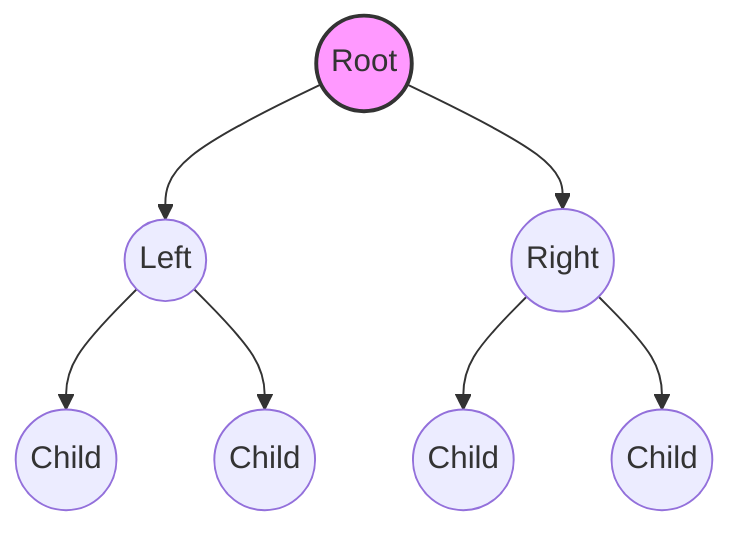

# Tree Data Structures

> Trees are non-linear, hierarchical data structures that represent relationships through a root-oriented graph of nodes, providing the foundational logic for efficient searching, indexing, and data storage.

## Overview
A tree is an abstract data type (ADT) that simulates a hierarchical structure, with a root value and subtrees of children with a parent node, represented as a set of linked nodes. Unlike linear structures (arrays, linked lists, stacks), trees are non-linear, allowing for more intuitive representation of nested data like the DOM of a webpage, file system directory structures, or even the call stack in recursive programming.

Mathematically, a tree is a connected, acyclic, undirected graph. In computer science, we typically deal with "rooted" trees where the "root" is the top-most node. Because they offer logarithmic time complexity for searching, inserting, and deleting data (in balanced variants), they are the bedrock of database indexing and high-performance language runtimes. Understanding these structures is a prerequisite for mastering graph theory and advanced algorithm design.

## 2. Visual Intuition
:::demo
<div style="background:#1e1e1e;padding:16px;border-radius:10px;color:#e5e7eb;font-family:system-ui,sans-serif">
  <h3 style="margin:0 0 8px 0;color:#7dd3fc">Tree Data Structures - Concept Map</h3>
  <svg width="100%" height="280" viewBox="0 0 640 280" role="img" aria-label="Tree Data Structures visual intuition" style="background:#111827;border-radius:8px">
    <rect x="24" y="28" width="180" height="64" rx="10" fill="#1d4ed8" />
    <text x="114" y="66" text-anchor="middle" fill="#e5e7eb" font-size="14">Problem</text>
    <rect x="230" y="28" width="180" height="64" rx="10" fill="#0f766e" />
    <text x="320" y="66" text-anchor="middle" fill="#e5e7eb" font-size="14">Process</text>
    <rect x="436" y="28" width="180" height="64" rx="10" fill="#7c3aed" />
    <text x="526" y="66" text-anchor="middle" fill="#e5e7eb" font-size="14">Outcome</text>

    <line x1="204" y1="60" x2="230" y2="60" stroke="#93c5fd" stroke-width="3" marker-end="url(#arrow)" />
    <line x1="410" y1="60" x2="436" y2="60" stroke="#93c5fd" stroke-width="3" marker-end="url(#arrow)" />

    <rect x="24" y="130" width="592" height="120" rx="10" fill="#0b1220" stroke="#334155" />
    <text x="320" y="156" text-anchor="middle" fill="#cbd5e1" font-size="14">Key intuition for Tree Data Structures</text>
    <text x="320" y="182" text-anchor="middle" fill="#94a3b8" font-size="12">Track state changes, constraints, and final behavior.</text>
    <text x="320" y="206" text-anchor="middle" fill="#94a3b8" font-size="12">Use this as a mental model before formal proofs or code.</text>

    <defs>
      <marker id="arrow" markerWidth="10" markerHeight="10" refX="8" refY="3" orient="auto">
        <polygon points="0 0, 10 3, 0 6" fill="#93c5fd" />
      </marker>
    </defs>
  </svg>
  <p style="margin-top:10px;color:#cbd5e1">Interactive-ready visual scaffold for the topic.</p>
</div>
:::
*Caption: A step-by-step animation showing how values are inserted into a BST based on their magnitude relative to existing nodes.*

## Core Theory
A tree is defined recursively. A tree consists of a root node and zero or more subtrees. The fundamental metric is the **height** $h$, the number of edges on the longest path from the root to a leaf.

### Binary Tree Properties
In a binary tree, each node has a maximum degree of 2. For a perfect binary tree, the number of nodes $n$ at depth $d$ is $2^d$, and the total nodes $N$ in a tree of height $h$ is:
$$N = 2^{h+1} - 1$$

### Traversals
Traversals visit every node in the tree exactly once.
- **In-order ($L, Root, R$):** Visits nodes in ascending order if the tree is a BST.
- **Pre-order ($Root, L, R$):** Essential for cloning the tree or prefix notation evaluation.
- **Post-order ($L, R, Root$):** Used for bottom-up processing, such as deleting a tree or evaluating an expression tree.
- **Level-order:** Uses a Queue (BFS) to visit nodes by depth.

### Self-Balancing (AVL Trees)
To prevent the $O(n)$ degeneration of a skewed BST, AVL trees enforce the **Balance Factor** ($BF$):
$$BF(node) = height(left\_subtree) - height(right\_subtree)$$
If $|BF| > 1$, the tree triggers rotations (LL, RR, LR, RL) to restore $BF \in \{-1, 0, 1\}$. This ensures operations remain $O(\log n)$.

## Visual Diagram

*A standard binary tree showing the branching hierarchy from root to leaves.*

## Code Example
```python
class Node:
    def __init__(self, key):
        self.val = key
        self.left = None
        self.right = None

def insert(root, key):
    if root is None: return Node(key)
    if key < root.val:
        root.left = insert(root.left, key)
    else:
        root.right = insert(root.right, key)
    return root

def inorder(root):
    if root:
        inorder(root.left)
        print(root.val, end=" ")
        inorder(root.right)

# Driver code
root = Node(50)
keys = [30, 20, 40, 70, 60, 80]
for k in keys:
    insert(root, k)

print("In-order traversal of the BST:")
inorder(root) # Output: 20 30 40 50 60 70 80
```

## Interactive Demo
:::demo
<!DOCTYPE html>
<html>
<body>
  <canvas id="treeCanvas" width="400" height="200" style="background:#1a1a1a"></canvas>
  <script>
    const canvas = document.getElementById('treeCanvas');
    const ctx = canvas.getContext('2d');
    function drawNode(x, y, text) {
      ctx.beginPath();
      ctx.arc(x, y, 15, 0, Math.PI*2);
      ctx.fillStyle = "#4a90e2";
      ctx.fill();
      ctx.fillStyle = "white";
      ctx.fillText(text, x-5, y+5);
    }
    drawNode(200, 30, 50);
    drawNode(120, 100, 30);
    drawNode(280, 100, 70);
  </script>
</body>
</html>
:::

## Worked Example
**Task:** Insert sequence [10, 5, 15, 2] into a BST.
1. **Insert 10:** Root is 10.
2. **Insert 5:** 5 < 10, go left. 5 is new left child.
3. **Insert 15:** 15 > 10, go right. 15 is new right child.
4. **Insert 2:** 2 < 10, go left. 2 < 5, go left. 2 is new left child of 5.
*Final state: Root(10) -> Left(5(Left: 2)), Right(15).*

## Industry Applications
- **Database Indexing:** B-Trees/B+ Trees used by **PostgreSQL** and **MySQL** for rapid row lookup.
- **File Systems:** The **Linux VFS** (Virtual File System) uses tree structures to manage directory hierarchies.
- **Compiler Design:** **GCC/Clang** use Abstract Syntax Trees (AST) for parsing source code.
- **Routing:** Network routers use Tries (prefix trees) for IP packet forwarding.

## Practice Problems
### Easy
1. Find the height of a binary tree. *(Hint: Recursion: 1 + max(h(left), h(right)))*
### Medium
2. Check if a binary tree is a valid BST. *(Hint: Pass a range [min, max] during traversal)*
3. Serialize and deserialize a binary tree. *(Hint: Use pre-order with null placeholders)*
### Hard
4. Find the Lowest Common Ancestor (LCA) in a binary tree. *(Hint: Recursion: if root matches p or q, return root)*

## Interactive Quiz
:::quiz
**Q1:** What is the worst-case time complexity of searching a standard BST?
- A) $O(1)$
- B) $O(\log n)$
- C) $O(n)$
- D) $O(n \log n)$
> C — In a skewed tree (essentially a linked list), the search must traverse every node.

**Q2:** Which traversal visits nodes in the order: Left, Right, Root?
- A) Pre-order
- B) In-order
- C) Post-order
- D) Level-order
> C — Post-order is specifically designed for bottom-up operations like tree deletion.

**Q3:** What is the balance factor of a node in an AVL tree?
- A) Height of right minus left
- B) Number of children
- C) Height of left minus right
- D) Max depth
> C — By convention, AVL trees use $H_L - H_R$. If it exceeds $\pm 1$, rotation is required.
:::

## Interview Questions
**Q: Explain tree data structures to a senior engineer.**
*A: Trees are acyclic connected graphs where nodes maintain parent-child relationships. We prioritize them for their $O(\log n)$ search efficiency in balanced forms. I focus on selecting the right variant—AVL for read-heavy, Red-Black for balanced insertion/deletion—based on the specific workload constraints.*

**Q: Complexity of search in a perfectly balanced tree?**
*A: $O(\log n)$ because the tree height is logarithmic relative to the number of nodes. Each comparison halves the remaining search space.*

**Q: How do you handle tree deletion if a node has two children?**
*A: Replace the node's value with its in-order successor (the smallest value in the right subtree) or predecessor, then recursively delete the successor.*

**Q: How does a Tries differ from a BST?**
*A: Tries use common prefixes to optimize string searches, effectively making search time independent of the number of strings in the set, relying instead on string length.*

## Key Takeaways
- Trees are recursive, non-linear structures.
- BSTs allow $O(\log n)$ search only if balanced.
- AVL trees enforce balance via rotations.
- Traversals serve distinct purposes (copying, sorting, deleting).
- Always consider the edge case of a skewed tree.
- Space complexity for recursion is $O(h)$ (call stack).

## Common Misconceptions
- ❌ All binary trees are BSTs → ✅ A BST is a special binary tree where ordering invariants are enforced.
- ❌ Trees always provide $O(\log n)$ speed → ✅ Unbalanced BSTs can degrade to $O(n)$.

## Related Topics
- [[graphs]] — Generalization of trees with cycles.
- [[heaps]] — Specialized complete binary trees for priority queues.
- [[recursion]] — The primary method for traversing and manipulating trees.
