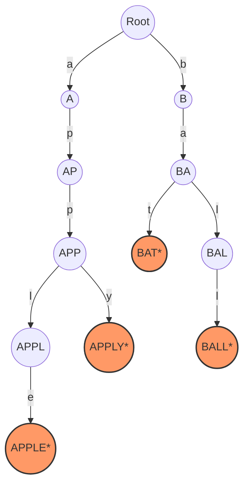

# Trie (Prefix Tree): Insert, Search, Autocomplete, and Compressed Trie

> A Trie—derived from "retrieval"—is a specialized $k$-ary search tree used for storing and searching a dynamic set of strings where keys share common prefixes, enabling search operations proportional to the length of the query string rather than the number of items in the collection.

## 1. Historical Background & Motivation

The Trie data structure occupies a unique position in the history of computer science, bridging the gap between abstract string theory and high-performance information retrieval. It was first described by René de la Briandais in 1959, though the name "Trie" was coined a year later by Edward Fredkin. Fredkin derived the name from the middle syllable of "re**trie**val," although, ironically, the community is split on pronunciation: some follow the etymology ("tree"), while others pronounce it like "try" to distinguish it from the standard binary tree.

The motivation for the Trie arose from the inefficiencies of Binary Search Trees (BSTs) and Hash Tables when dealing with large sets of strings. In a BST, comparing two strings of length $L$ takes $O(L)$ time. If the tree contains $N$ strings, a search takes $O(L \cdot \log N)$. As $N$ grows into the millions (common in dictionary or genomic applications), the $\log N$ factor becomes a significant bottleneck. Hash Tables offer $O(L)$ average-case search, but they lose the "ordered" nature of the data, making prefix-based queries (e.g., "Find all words starting with 'apple'") computationally expensive $O(N \cdot L)$. The Trie solves this by exploiting the internal structure of the keys, achieving $O(L)$ search time regardless of $N$, while natively supporting prefix-based operations.

## 2. Visual Intuition
:::demo
<div style="background:#1e1e1e;padding:16px;border-radius:10px;color:#e5e7eb;font-family:system-ui,sans-serif">
  <h3 style="margin:0 0 8px 0;color:#7dd3fc">Trie (Prefix Tree): Insert, Search, Autocomplete, and Compressed Trie - Concept Map</h3>
  <svg width="100%" height="280" viewBox="0 0 640 280" role="img" aria-label="Trie (Prefix Tree): Insert, Search, Autocomplete, and Compressed Trie visual intuition" style="background:#111827;border-radius:8px">
    <rect x="24" y="28" width="180" height="64" rx="10" fill="#1d4ed8" />
    <text x="114" y="66" text-anchor="middle" fill="#e5e7eb" font-size="14">Problem</text>
    <rect x="230" y="28" width="180" height="64" rx="10" fill="#0f766e" />
    <text x="320" y="66" text-anchor="middle" fill="#e5e7eb" font-size="14">Process</text>
    <rect x="436" y="28" width="180" height="64" rx="10" fill="#7c3aed" />
    <text x="526" y="66" text-anchor="middle" fill="#e5e7eb" font-size="14">Outcome</text>

    <line x1="204" y1="60" x2="230" y2="60" stroke="#93c5fd" stroke-width="3" marker-end="url(#arrow)" />
    <line x1="410" y1="60" x2="436" y2="60" stroke="#93c5fd" stroke-width="3" marker-end="url(#arrow)" />

    <rect x="24" y="130" width="592" height="120" rx="10" fill="#0b1220" stroke="#334155" />
    <text x="320" y="156" text-anchor="middle" fill="#cbd5e1" font-size="14">Key intuition for Trie (Prefix Tree): Insert, Search, Autocomplete, and Compressed Trie</text>
    <text x="320" y="182" text-anchor="middle" fill="#94a3b8" font-size="12">Track state changes, constraints, and final behavior.</text>
    <text x="320" y="206" text-anchor="middle" fill="#94a3b8" font-size="12">Use this as a mental model before formal proofs or code.</text>

    <defs>
      <marker id="arrow" markerWidth="10" markerHeight="10" refX="8" refY="3" orient="auto">
        <polygon points="0 0, 10 3, 0 6" fill="#93c5fd" />
      </marker>
    </defs>
  </svg>
  <p style="margin-top:10px;color:#cbd5e1">Interactive-ready visual scaffold for the topic.</p>
</div>
:::
*Caption: A Trie representing the keys "A", "to", "tea", "ted", "ten", "i", "in", and "inn". Each path from the root represents a prefix, and colored nodes indicate the end of a valid word.*

## 3. Core Theory & Mathematical Foundations

### 3.1 Formal Definition
A Trie is a rooted tree where each edge is labeled with a character from a fixed alphabet $\Sigma$. Formally, a Trie $T = (V, E)$ for a set of strings $S$ satisfies:
1. Each node $v \in V$ represents a prefix $p$ of one or more strings in $S$.
2. The root node represents the empty string $\epsilon$.
3. If there is an edge from node $u$ to node $v$ labeled with character $c$, then the prefix represented by $v$ is the prefix of $u$ concatenated with $c$.
4. A boolean flag `is_end` (or a terminal marker) is set at node $v$ if the prefix represented by $v$ is a complete string in $S$.

### 3.2 State Transition Logic
We can view a Trie as a Deterministic Finite Automaton (DFA) without cycles. Let $\delta: Q \times \Sigma \to Q$ be the transition function where $Q$ is the set of nodes (states) and $\Sigma$ is the alphabet.
For a string $w = c_1 c_2 ... c_L$, the search operation follows the transitions:
$$q_0 \xrightarrow{c_1} q_1 \xrightarrow{c_2} q_2 \dots \xrightarrow{c_L} q_L$$
The string $w$ exists in the Trie if and only if the transition sequence is valid and $q_L$ is marked as a terminal state.

### 3.3 Memory-Efficiency Trade-offs
The primary challenge in Trie theory is the implementation of the transition function $\delta$. There are three common approaches:
1. **Fixed-Size Array:** Each node contains an array of size $|\Sigma|$.
   - *Time:* $O(1)$ per character.
   - *Space:* $O(N \cdot L \cdot |\Sigma|)$. High waste for sparse Tries.
2. **Hash Map:** Each node contains a hash table mapping characters to child nodes.
   - *Time:* $O(1)$ average, $O(L)$ total.
   - *Space:* $O(N \cdot L)$. Better for large alphabets (e.g., Unicode).
3. **Sorted Vector / Binary Search:** Each node contains a sorted list of children.
   - *Time:* $O(L \cdot \log |\Sigma|)$.
   - *Space:* $O(N \cdot L)$.

### 3.4 The Compressed Trie (Radix Tree)
A standard Trie can be space-inefficient when many nodes have only one child (creating long "chains"). A **Compressed Trie** or **Radix Tree** optimizes this by merging edges. If a node $u$ is the only child of $v$ and $v$ is not a terminal node, they are merged into a single edge labeled with the concatenation of their characters.
Mathematically, this reduces the number of nodes from $\sum |s_i|$ to $O(N)$, where $N$ is the number of strings, making it significantly more memory-efficient for long, non-overlapping strings.

### 3.5 Formal Analysis
**Time Complexity:**
- **Insertion:** $O(L)$, where $L$ is the length of the word. We perform $L$ lookups and at most $L$ node creations.
- **Search:** $O(L)$. We traverse at most $L$ edges.
- **Prefix Search:** $O(P)$, where $P$ is the length of the prefix.
- **Deletion:** $O(L)$. We traverse to the end and prune nodes upwards if they have no other children.

**Space Complexity:**
The worst-case space is $O(M \cdot |\Sigma|)$, where $M$ is the total number of characters across all unique strings. However, the true strength of a Trie is that the space approaches $O(L_{avg} \cdot N)$ as the prefix overlap increases.

## 4. Algorithm / Process (Step-by-Step)

### Insertion Algorithm
1. Start at the `root` node.
2. For each character $c$ in the input string:
   - Check if $c$ exists in the current node's `children`.
   - If no, create a new `TrieNode` and add it to `children`.
   - Move the current pointer to the child node corresponding to $c$.
3. After the last character, set the current node's `is_end` flag to `True`.

### Search Algorithm
1. Start at the `root` node.
2. For each character $c$ in the search string:
   - If $c$ is not in the current node's `children`, return `False`.
   - Move the current pointer to the child node.
3. Return the value of the `is_end` flag. (Note: Simply reaching the node isn't enough; it must be a marked end).

### Autocomplete (Prefix Search) Algorithm
1. Start at the `root` node and traverse using the prefix.
2. If the prefix traversal fails, return an empty list.
3. Once the end of the prefix is reached, perform a Depth-First Search (DFS) or Breadth-First Search (BFS) from that node to collect all reachable terminal nodes.
4. Return the list of strings formed by the prefix + paths found.

## 5. Visual Diagram


*Caption: A Trie containing "apple", "apply", "bat", and "ball". Nodes marked with an asterisk (*) represent terminal states.*

## 6. Implementation

### 6.1 Core Implementation
The following Python implementation uses a dictionary for children, providing a balance between memory efficiency and $O(1)$ child lookup.

```python
class TrieNode:
    def __init__(self):
        # Use a dictionary for flexible O(1) average lookup
        self.children = {}
        self.is_end = False

class Trie:
    def __init__(self):
        """
        Initialize the root node.
        """
        self.root = TrieNode()

    def insert(self, word: str) -> None:
        """
        Inserts a word into the trie.
        Complexity: O(L) time, O(L) space (worst case).
        """
        node = self.root
        for char in word:
            if char not in node.children:
                node.children[char] = TrieNode()
            node = node.children[char]
        node.is_end = True

    def search(self, word: str) -> bool:
        """
        Returns if the word is in the trie.
        Complexity: O(L) time, O(1) auxiliary space.
        """
        node = self._navigate_to_prefix(word)
        return node is not None and node.is_end

    def starts_with(self, prefix: str) -> bool:
        """
        Returns if there is any word in the trie that starts with prefix.
        Complexity: O(L) time, O(1) auxiliary space.
        """
        return self._navigate_to_prefix(prefix) is not None

    def _navigate_to_prefix(self, prefix: str) -> TrieNode:
        """
        Helper to traverse the trie based on a string.
        """
        node = self.root
        for char in prefix:
            if char not in node.children:
                return None
            node = node.children[char]
        return node

    def get_autocomplete_suggestions(self, prefix: str):
        """
        Returns all words in the trie starting with the given prefix.
        Complexity: O(P + S) where P is prefix length, S is sum of lengths of suffixes.
        """
        node = self._navigate_to_prefix(prefix)
        if not node:
            return []
        
        results = []
        self._dfs(node, prefix, results)
        return results

    def _dfs(self, node, current_path, results):
        if node.is_end:
            results.append(current_path)
        
        for char, next_node in node.children.items():
            self._dfs(next_node, current_path + char, results)

# Sample Usage
# trie = Trie()
# trie.insert("apple")
# trie.insert("app")
# print(trie.search("apple"))   # Output: True
# print(trie.search("app"))     # Output: True
# print(trie.starts_with("ap")) # Output: True
# print(trie.get_autocomplete_suggestions("ap")) # Output: ['app', 'apple']
```

### 6.2 Optimized / Production Variant: Compressed Trie (Radix Tree)
In production systems (like routing tables), a Compressed Trie is used to save space on long paths without branching.

```python
class RadixNode:
    def __init__(self, prefix="", is_end=False):
        self.children = {}  # key: string prefix, value: RadixNode
        self.is_end = is_end

class RadixTree:
    def __init__(self):
        self.root = RadixNode()

    def insert(self, word: str):
        """
        Inserts word into Radix Tree by splitting edges where necessary.
        """
        curr = self.root
        i = 0
        while i < len(word):
            match_found = False
            for edge_prefix in list(curr.children.keys()):
                # Find common prefix length
                common_len = 0
                for j in range(min(len(edge_prefix), len(word) - i)):
                    if edge_prefix[j] == word[i + j]:
                        common_len += 1
                    else:
                        break
                
                if common_len > 0:
                    match_found = True
                    child = curr.children[edge_prefix]
                    
                    if common_len < len(edge_prefix):
                        # Split edge
                        new_node = RadixNode(edge_prefix[:common_len], False)
                        del curr.children[edge_prefix]
                        curr.children[edge_prefix[:common_len]] = new_node
                        
                        # Adjust old child
                        child_suffix = edge_prefix[common_len:]
                        new_node.children[child_suffix] = child
                        
                        curr = new_node
                    else:
                        curr = child
                    
                    i += common_len
                    break
            
            if not match_found:
                curr.children[word[i:]] = RadixNode(is_end=True)
                return
        curr.is_end = True
```

### 6.3 Common Pitfalls in Code
*   **Memory Overhead:** In Python, a dictionary for every node can be heavy. Use `__slots__ = ['children', 'is_end']` to reduce memory consumption.
*   **Case Sensitivity:** Be consistent with `.lower()` calls; otherwise, "Apple" and "apple" will reside in different branches.
*   **Recursive Limits:** DFS for autocomplete on a very deep Trie might hit Python's recursion limit. Use an explicit stack for an iterative DFS in production.
*   **Empty Strings:** Always consider how the system handles the root node when searching for an empty string or inserting one.

## 7. Interactive Demo

:::demo
<!-- title: Trie Visualization and Search -->
<!DOCTYPE html>
<html>
<head>
<meta charset="utf-8">
<style>
  body { margin:0; background:#0f1117; color:#e5e7eb; font-family: 'Segoe UI', Tahoma, Geneva, Verdana, sans-serif; font-size:13px; padding:20px; }
  #canvas-container { position: relative; width: 100%; height: 400px; background: #1a1d24; border-radius: 8px; border: 1px solid #374151; overflow: hidden; }
  canvas { width: 100%; height: 100%; }
  .controls { margin-top: 15px; display: flex; gap: 10px; align-items: center; }
  input { background: #374151; border: 1px solid #4b5563; color: white; padding: 5px 10px; border-radius: 4px; }
  button { background: #3b82f6; color: white; border: none; padding: 5px 15px; border-radius: 4px; cursor: pointer; transition: background 0.2s; }
  button:hover { background: #2563eb; }
  .status { font-family: monospace; color: #10b981; }
</style>
</head>
<body>
  <div id="canvas-container">
    <canvas id="trieCanvas"></canvas>
  </div>
  <div class="controls">
    <input type="text" id="wordInput" placeholder="Enter word...">
    <button onclick="addWord()">Insert</button>
    <button onclick="searchWord()">Search</button>
    <button onclick="resetTrie()">Reset</button>
    <span class="status" id="statusMsg">Ready</span>
  </div>

<script>
  const canvas = document.getElementById('trieCanvas');
  const ctx = canvas.getContext('2d');
  const input = document.getElementById('wordInput');
  const status = document.getElementById('statusMsg');

  class Node {
    constructor(char = '') {
      self.char = char;
      self.children = {};
      self.isEnd = false;
      self.x = 0; self.y = 0;
    }
  }

  let root = new Node('root');
  
  function resize() {
    canvas.width = canvas.offsetWidth;
    canvas.height = canvas.offsetHeight;
    draw();
  }

  function addWord() {
    const word = input.value.trim().toLowerCase();
    if(!word) return;
    let curr = root;
    for(let char of word) {
      if(!curr.children[char]) curr.children[char] = new Node(char);
      curr = curr.children[char];
    }
    curr.isEnd = true;
    status.innerText = `Inserted: "${word}"`;
    input.value = '';
    draw();
  }

  function searchWord() {
    const word = input.value.trim().toLowerCase();
    let curr = root;
    for(let char of word) {
      if(!curr.children[char]) {
        status.innerText = `"${word}" not found`;
        return;
      }
      curr = curr.children[char];
    }
    status.innerText = curr.isEnd ? `Found: "${word}"` : `"${word}" is a prefix, not a full word`;
  }

  function resetTrie() {
    root = new Node('root');
    status.innerText = "Trie Reset";
    draw();
  }

  function drawNode(node, x, y, dx) {
    node.x = x; node.y = y;
    const childrenKeys = Object.keys(node.children);
    const count = childrenKeys.length;
    
    childrenKeys.forEach((key, i) => {
      const nextX = x - (dx/2) + (i * dx / Math.max(1, count - 1));
      const nextY = y + 60;
      ctx.beginPath();
      ctx.strokeStyle = '#4b5563';
      ctx.moveTo(x, y);
      ctx.lineTo(nextX, nextY);
      ctx.stroke();
      drawNode(node.children[key], nextX, nextY, dx / 2.2);
    });

    ctx.beginPath();
    ctx.arc(x, y, 15, 0, Math.PI * 2);
    ctx.fillStyle = node.isEnd ? '#f59e0b' : '#3b82f6';
    ctx.fill();
    ctx.fillStyle = 'white';
    ctx.textAlign = 'center';
    ctx.fillText(node.char || '•', x, y + 5);
  }

  function draw() {
    ctx.clearRect(0, 0, canvas.width, canvas.height);
    drawNode(root, canvas.width/2, 40, canvas.width/1.5);
  }

  window.addEventListener('resize', resize);
  resize();
</script>
</body>
</html>
:::

## 8. Worked Examples

### Example 1 — Basic Application: Insert and Overlap
**Dataset:** `["cat", "cap", "can"]`
1.  **Insert "cat"**:
    - Root $\to$ 'c' (new) $\to$ 'a' (new) $\to$ 't' (new, `is_end=True`).
2.  **Insert "cap"**:
    - Start at Root. 'c' exists. 'a' exists.
    - 'p' does not exist. Create 'p' as child of 'a'. Mark `is_end=True`.
3.  **Insert "can"**:
    - Start at Root. 'c' exists. 'a' exists.
    - 'n' does not exist. Create 'n' as child of 'a'. Mark `is_end=True`.

**Structure Check:** The node 'a' now has three children: 't', 'p', and 'n'. Searching for "ca" returns `False` for `search()` but `True` for `starts_with()`.

### Example 2 — The "Prefix within Prefix" Edge Case
**Dataset:** `["apple", "app"]`
1.  **Insert "apple"**: Creates path Root $\to$ a $\to$ p $\to$ p $\to$ l $\to$ e. Node 'e' is terminal.
2.  **Insert "app"**: Traverses Root $\to$ a $\to$ p $\to$ p. This node already exists. We simply update the second 'p' node's `is_end` flag to `True`.
3.  **Search "app"**: Traversal ends at the second 'p'. Since `is_end == True`, it returns `True`.
4.  **Search "appl"**: Traversal ends at 'l'. Since `is_end == False`, it returns `False`.

## 9. Comparison with Alternatives

| Approach | Search Time | Prefix Search | Space Complexity | Best Used When |
|---|---|---|---|---|
| **Trie** | $O(L)$ | $O(L)$ | $O(N \cdot L \cdot |\Sigma|)$ | Autocomplete, dictionary, IP routing. |
| **Hash Map** | $O(L)$ | $O(N \cdot L)$ | $O(N \cdot L)$ | Exact matches only, memory is tight. |
| **Sorted Array** | $O(L \cdot \log N)$ | $O(L \cdot \log N)$ | $O(N \cdot L)$ | Static dataset, memory-constrained. |
| **BST (Strings)** | $O(L \cdot \log N)$ | $O(L \cdot \log N)$ | $O(N \cdot L)$ | General purpose, needs sorting. |

## 10. Industry Applications & Real Systems

- **Cloudflare (IP Routing)**: Cloudflare and Cisco use Radix Tries (Compressed Tries) for Longest Prefix Matching (LPM) in IP routing tables. When a packet arrives with IP `192.168.1.5`, the router must find the most specific subnet mask in the table. The Trie allows finding this in $O(32)$ for IPv4 or $O(128)$ for IPv6, independent of table size.
- **Google Search (Autocomplete)**: While the actual Google autocomplete is a massive distributed system involving Machine Learning, the underlying data structure for candidate generation from the "search suggest" corpus is often a variant of a weighted Trie (where nodes also store the frequency/popularity of the prefix).
- **Lucene / Elasticsearch**: The Apache Lucene engine (powering Elasticsearch) uses a Finite State Transducer (FST), which is essentially a highly compressed Trie with shared suffixes as well as prefixes. This allows Lucene to keep a massive dictionary of terms in RAM.
- **Genomics (Bioinformatics)**: Tries (specifically Suffix Tries and Suffix Trees) are used to store DNA sequences. Given that the DNA alphabet is small ($|\Sigma| = 4$ for A, T, C, G), the Trie is exceptionally efficient for finding genetic patterns or sequences within a genome.

## 11. Practice Problems

### 🟢 Easy
1.  **Implement Trie (Prefix Tree)**: Implement `insert`, `search`, and `startsWith` methods.
    *Hint: Use a dictionary or a fixed-size array of 26.*
    *Expected complexity: O(L) for all.*

### 🟡 Medium
2.  **Word Search II**: Given an $m \times n$ board and a list of words, find all words on the board.
    *Hint: Use a Trie to store the words and backtrack on the board. The Trie allows you to prune the search space as soon as a prefix is not found.*
    *Expected complexity: O(M \cdot 3^L) where M is board cells.*
3.  **Map Sum Pairs**: Design a map-sum object where you can insert (key-string, value-int) and query the sum of all values whose keys start with a specific prefix.
    *Hint: Each TrieNode can store the cumulative sum of all keys passing through it.*

### 🔴 Hard
4.  **Stream of Characters**: Design an algorithm that checks if any suffix of a stream of characters (added one by one) exists in a given dictionary.
    *Hint: Store words in the Trie in REVERSE. When a character is added, check the Trie starting from the most recent character backwards.*
    *Expected complexity: O(L) per character.*
5.  **Word Squares**: Given a set of words, find all combinations of words such that the $i$-th row and $i$-th column form the same word.
    *Hint: Use a Trie to quickly find words that satisfy the prefix constraint for the next row.*

## 12. Interactive Quiz

:::quiz
**Q1: What is the primary advantage of a Trie over a Hash Map for string storage?**
- A) Tries use less memory in all scenarios.
- B) Tries offer faster average-case search for exact matches.
- C) Tries support prefix-based range queries and ordered traversal.
- D) Tries have $O(1)$ space complexity.
> C — While Hash Maps are $O(L)$ for exact matches, they cannot efficiently find all words starting with "pre...". Tries handle this in $O(L + K)$.

**Q2: In a standard Trie with $N$ words of average length $L$ and an alphabet size $|\Sigma|$, what is the worst-case space complexity?**
- A) $O(N \cdot L)$
- B) $O(N \cdot L \cdot |\Sigma|)$
- C) $O(L^{|\Sigma|})$
- D) $O(\log N)$
> B — Each character in every word could potentially result in a new node with $|\Sigma|$ pointers.

**Q3: Which optimization transforms a Trie into a Radix Tree?**
- A) Converting the tree into a binary search tree.
- B) Using a hash map at each node.
- C) Merging nodes with only one child to save space.
- D) Limiting the depth of the tree to $\log N$.
> C — Radix Trees (Compressed Tries) collapse non-branching paths into single edges.

**Q4: If we implement a Trie using a fixed-size array of size 26 at each node, what is the time complexity to search for a word of length $L$?**
- A) $O(L \cdot 26)$
- B) $O(L \cdot \log 26)$
- C) $O(L)$
- D) $O(26^L)$
> C — Accessing an index in an array is $O(1)$. We do this $L$ times.

**Q5: When should you avoid using a Trie?**
- A) When the alphabet size $|\Sigma|$ is very large (e.g., full Unicode) and memory is highly limited.
- B) When you need to find all strings starting with a prefix.
- C) When the keys are integers.
- D) When the keys have many common prefixes.
> A — For very large alphabets with low overlap, the overhead of node pointers (even in dictionaries) can exceed the size of the strings themselves.
:::

## 13. Interview Preparation

### Conceptual Questions
**Q: Explain a Trie as if teaching it to a fellow engineer.**
*A: A Trie is a tree-like data structure where each node represents a character of a string. Instead of storing entire strings in each node, the path from the root to a node represents the string or prefix. It’s essentially a specialized DFA for string sets. It excels at prefix lookups, autocomplete, and longest-prefix matching, providing $O(L)$ performance that is independent of the number of keys stored.*

**Q: What are the time and space complexities? Derive them.**
*A: Insertion and search are $O(L)$ where $L$ is word length because we perform exactly $L$ transitions. Space is $O(M \cdot |\Sigma|)$ worst-case, where $M$ is total characters. The derivation follows from the fact that in the worst case (no common prefixes), every character of every word requires its own node, and every node has $|\Sigma|$ pointers/slots for its children.*

**Q: How would you choose between a Trie and a Hash Map in a real system?**
*A: Choose a Trie if you need prefix-based functionality (autocomplete, spell check) or if you need to iterate through strings in alphabetical order. Choose a Hash Map if you only need exact matches and want to minimize implementation complexity or if the keys share no common prefixes, as the Trie's pointer overhead would waste memory.*

**Q: What if the input is the entire English Wikipedia? How does a Trie scale?**
*A: A standard Trie would explode in memory due to the millions of unique terms. I would use a Radix Tree to compress paths and potentially use a "Burst Tries" approach where nodes are initially stored as simple arrays and "burst" into Trie structures only when they reach a certain size. I'd also use `bit-packing` to store the child pointers.*

### Quick Reference (Cheat Sheet)
| Property | Value |
|---|---|
| Search Time | $O(L)$ |
| Insert Time | $O(L)$ |
| Space Complexity | $O(Total Characters \cdot |\Sigma|)$ |
| Best for Prefixes | Yes |
| Sorting | Native (Lexicographical) |
| Alphabet size | Significant impact on memory |

## 14. Key Takeaways
1.  **Prefix Power**: Tries are the gold standard for prefix-based searching.
2.  **Performance Invariance**: Unlike BSTs, Trie search time $O(L)$ does not increase as you add more words.
3.  **Space Trade-off**: Standard Tries trade memory for speed; Radix Trees mitigate this.
4.  **Terminal Nodes**: Always remember the `is_end` flag; otherwise, searching for "app" in a Trie containing "apple" will incorrectly return true.
5.  **Small Alphabet Advantage**: Tries are most efficient when the alphabet $\Sigma$ is small (e.g., DNA, lowercase English, IP addresses).
6.  **Interview Tip**: When an interview question involves a "dictionary" and "prefixes," a Trie is almost always the intended solution.

## 15. Common Misconceptions
- ❌ **"Tries are always more space-efficient than storing a list of strings."** → ✅ **Fact:** If words have no common prefixes, the Trie uses *more* space due to the overhead of node objects and child pointers.
- ❌ **"Search in a Trie is O(1)."** → ✅ **Fact:** It is $O(L)$ (length of string). It's only $O(1)$ relative to the number of keys $N$.
- ❌ **"You must use an array of size 26 for children."** → ✅ **Fact:** Using a Hash Map (dictionary) is often better in modern languages to handle varied characters and save space.

## 16. Further Reading
- *Introduction to Algorithms (CLRS), Chapter 12 & 18* — Focuses on tree structures and B-trees; Tries are often discussed in the context of string matching.
- *Algorithms (Sedgewick & Wayne), Section 5.2* — Excellent coverage of R-way Tries and Ternary Search Tries.
- *Modern Information Retrieval (Baeza-Yates)* — Covers the use of Tries in search engines.

## 17. Related Topics
- [[complexity-analysis]] — For understanding $O(L)$ vs $O(\log N)$.
- [[string-operations]] — Fundamental string manipulation used in Trie traversal.
- [[recursion-basics]] — Essential for implementing DFS-based autocomplete.
- [[suffix-trees]] — An advanced relative of the Trie used for complex pattern matching.
