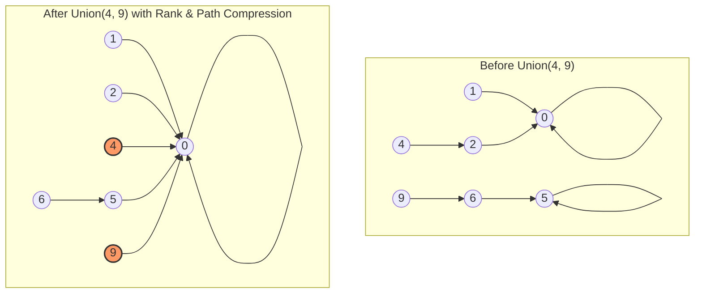

# Union-Find (Disjoint Sets): Union by Rank and Path Compression

> A Disjoint Set Union (DSU) is a sophisticated data structure that tracks a partition of a set into disjoint, non-overlapping subsets, providing near-constant time operations to merge sets and identify the set containing a specific element.

## 1. Historical Background & Motivation

The Disjoint Set Union (DSU) data structure, commonly known as Union-Find, represents one of the most elegant triumphs of amortized analysis in computer science history. The fundamental problem it solves—efficiently maintaining a collection of disjoint sets under the operations of merging and membership testing—dates back to the early days of graph theory and network design. The first formal description of the data structure is often attributed to Bernard A. Galler and Michael J. Fisher in their 1964 paper, "An Improved Equivalence Algorithm." However, their initial version did not achieve the near-optimal performance we associate with the structure today.

The evolution of DSU is a story of incremental optimization. In the late 1960s and early 1970s, researchers like Hopcroft and Ullman explored the "Union by Rank" heuristic, which bounded tree heights to logarithmic levels. The real breakthrough came in 1975 when Robert Tarjan published his landmark paper, "Efficiency of a Good But Not Quite Optimal Set Union Algorithm." Tarjan was the first to prove that the combination of Union by Rank and Path Compression results in a complexity involving the inverse Ackermann function, $\alpha(n)$. This discovery was profound because it demonstrated a performance level that is, for all practical purposes, indistinguishable from constant time, yet theoretically distinct. Today, DSU is the backbone of Kruskal's Minimum Spanning Tree algorithm, cycle detection in undirected graphs, and high-performance image segmentation in computer vision.

## 2. Visual Intuition
:::demo
<div style="background:#1e1e1e;padding:16px;border-radius:10px;color:#e5e7eb;font-family:system-ui,sans-serif">
  <h3 style="margin:0 0 8px 0;color:#7dd3fc">Union-Find (Disjoint Sets): Union by Rank and Path Compression - Concept Map</h3>
  <svg width="100%" height="280" viewBox="0 0 640 280" role="img" aria-label="Union-Find (Disjoint Sets): Union by Rank and Path Compression visual intuition" style="background:#111827;border-radius:8px">
    <rect x="24" y="28" width="180" height="64" rx="10" fill="#1d4ed8" />
    <text x="114" y="66" text-anchor="middle" fill="#e5e7eb" font-size="14">Problem</text>
    <rect x="230" y="28" width="180" height="64" rx="10" fill="#0f766e" />
    <text x="320" y="66" text-anchor="middle" fill="#e5e7eb" font-size="14">Process</text>
    <rect x="436" y="28" width="180" height="64" rx="10" fill="#7c3aed" />
    <text x="526" y="66" text-anchor="middle" fill="#e5e7eb" font-size="14">Outcome</text>

    <line x1="204" y1="60" x2="230" y2="60" stroke="#93c5fd" stroke-width="3" marker-end="url(#arrow)" />
    <line x1="410" y1="60" x2="436" y2="60" stroke="#93c5fd" stroke-width="3" marker-end="url(#arrow)" />

    <rect x="24" y="130" width="592" height="120" rx="10" fill="#0b1220" stroke="#334155" />
    <text x="320" y="156" text-anchor="middle" fill="#cbd5e1" font-size="14">Key intuition for Union-Find (Disjoint Sets): Union by Rank and Path Compression</text>
    <text x="320" y="182" text-anchor="middle" fill="#94a3b8" font-size="12">Track state changes, constraints, and final behavior.</text>
    <text x="320" y="206" text-anchor="middle" fill="#94a3b8" font-size="12">Use this as a mental model before formal proofs or code.</text>

    <defs>
      <marker id="arrow" markerWidth="10" markerHeight="10" refX="8" refY="3" orient="auto">
        <polygon points="0 0, 10 3, 0 6" fill="#93c5fd" />
      </marker>
    </defs>
  </svg>
  <p style="margin-top:10px;color:#cbd5e1">Interactive-ready visual scaffold for the topic.</p>
</div>
:::
*Caption: This animation illustrates the two primary operations. First, `Find` traverses up from a node to the root, while `Path Compression` flattens the tree structure by pointing all traversed nodes directly to the root. Second, `Union` merges two distinct trees by attaching the root of the "shorter" tree (lower rank) to the root of the "taller" tree.*

## 3. Core Theory & Mathematical Foundations

At its core, Union-Find manages a set of elements $S = \{0, 1, 2, \dots, n-1\}$. This set is partitioned into several disjoint subsets. We maintain this partition using two primary operations:
1.  **Find(x):** Returns a representative (or root) of the set containing element $x$. If `Find(x) == Find(y)`, then $x$ and $y$ belong to the same set.
2.  **Union(x, y):** Merges the set containing $x$ and the set containing $y$ into a single set.

### 3.1 The Tree-Based Representation
While a partition could be managed using linked lists or arrays of set IDs, these approaches lead to $O(n)$ or $O(\log n)$ worst-case performance for one of the two operations. The Disjoint Set Forest represents each set as a directed tree where each node points to its parent. The "representative" of the set is the root of the tree—the unique node that points to itself.

### 3.2 Heuristic 1: Union by Rank
If we perform unions arbitrarily, we might create a degenerate tree (a linked list), leading to $O(n)$ search time. To prevent this, we use **Union by Rank**. We associate a "rank" with each node, which is an upper bound on the height of the tree. When merging two trees:
- If the roots have different ranks, attach the tree with the smaller rank to the tree with the larger rank.
- If the ranks are equal, pick one to be the new root and increment its rank by one.

**Theorem 1:** *Using Union by Rank alone, a tree with $n$ nodes has a height of at most $\lfloor \log_2 n \rfloor$.*
*Proof Sketch:* A tree of rank $k$ is formed only by merging two trees of rank $k-1$. By induction, if $N(k)$ is the minimum nodes in a tree of rank $k$, then $N(k) = 2 \cdot N(k-1)$. Since $N(0) = 1$, we have $N(k) = 2^k$. Thus $n \ge 2^k$, or $k \le \log_2 n$.

### 3.3 Heuristic 2: Path Compression
While Union by Rank ensures logarithmic height, **Path Compression** optimizes the `Find` operation by flattening the structure of the tree whenever `Find` is called. During `Find(i)`, we follow parent pointers to find the root. After finding the root, we update the parent pointers of all nodes on the path from $i$ to the root to point directly to the root.

### 3.4 Formal Analysis (Complexity / Correctness)
The most striking feature of DSU is its amortized complexity. When both Union by Rank and Path Compression are used, the amortized time per operation is $O(\alpha(n))$, where $\alpha$ is the **Inverse Ackermann function**.

The Ackermann function $A(m, n)$ grows incredibly fast:
$$A(m, n) = \begin{cases} n+1 & \text{if } m=0 \\ A(m-1, 1) & \text{if } m > 0, n=0 \\ A(m-1, A(m, n-1)) & \text{if } m > 0, n > 0 \end{cases}$$

The inverse function $\alpha(n)$ is defined as the smallest $k$ such that $A(k, 1) \ge n$. For any $n$ that can be represented in our physical universe (e.g., $n = 10^{80}$, the estimated number of atoms in the observable universe), $\alpha(n) \le 5$. Thus, for all practical engineering purposes, Union-Find operates in constant time $O(1)$.

## 4. Algorithm / Process (Step-by-Step)

### The Find Operation (with Path Compression)
1.  Check if node $x$ is its own parent.
2.  If yes, $x$ is the root; return $x$.
3.  If no, recursively call `Find(parent[x])`.
4.  **Compression Step:** Set `parent[x]` to the result of the recursive call.
5.  Return the root.

### The Union Operation (with Union by Rank)
1.  Find the root of $x$ (let it be `rootX`) and the root of $y$ (let it be `rootY`).
2.  If `rootX == rootY`, the elements are already in the same set; do nothing.
3.  Compare `rank[rootX]` and `rank[rootY]`.
4.  If `rank[rootX] < rank[rootY]`, make `rootY` the parent of `rootX`.
5.  Else if `rank[rootX] > rank[rootY]`, make `rootX` the parent of `rootY`.
6.  Else (`rank[rootX] == rank[rootY]`), make `rootX` the parent of `rootY` and increment `rank[rootX]`.

## 5. Visual Diagram


*Caption: The diagram shows how `Find(4)` and `Find(9)` trigger path compression, flattening the tree and directly connecting nodes to the new global root `0` during the union process.*

## 6. Implementation

### 6.1 Core Implementation
The following Python class implements the DSU with both optimizations. It is designed for production-level clarity and efficiency.

```python
class UnionFind:
    """
    An implementation of the Disjoint Set Union (DSU) data structure.
    Uses Union by Rank and Path Compression to achieve O(alpha(N)) performance.
    """
    def __init__(self, size: int):
        # parent[i] stores the parent of element i. 
        # Initially, every element is its own parent (n disjoint sets).
        self.parent = list(range(size))
        # rank[i] stores the approximate height of the tree rooted at i.
        self.rank = [0] * size
        self.num_sets = size

    def find(self, i: int) -> int:
        """
        Finds the representative of the set containing i.
        Implements Path Compression.
        Complexity: Amortized O(alpha(N))
        """
        if self.parent[i] == i:
            return i
        
        # Path Compression: Point i directly to the root
        self.parent[i] = self.find(self.parent[i])
        return self.parent[i]

    def union(self, i: int, j: int) -> bool:
        """
        Merges the sets containing i and j.
        Implements Union by Rank.
        Returns True if a merge occurred, False if they were already in the same set.
        Complexity: Amortized O(alpha(N))
        """
        root_i = self.find(i)
        root_j = self.find(j)

        if root_i != root_j:
            # Union by Rank: Attach smaller rank tree under larger rank tree
            if self.rank[root_i] < self.rank[root_j]:
                self.parent[root_i] = root_j
            elif self.rank[root_i] > self.rank[root_j]:
                self.parent[root_j] = root_i
            else:
                self.parent[root_i] = root_j
                self.rank[root_j] += 1
            
            self.num_sets -= 1
            return True
        return False

# Example Usage:
# dsu = UnionFind(10)
# dsu.union(1, 2)
# dsu.union(2, 3)
# print(dsu.find(1) == dsu.find(3)) # Expected: True
# print(dsu.num_sets)               # Expected: 8
```

### 6.2 Optimized / Production Variant (Iterative Find)
Recursive path compression can hit recursion depth limits in very large datasets or deep initial trees. The iterative version is safer for competitive programming and large-scale data processing.

```python
def find_iterative(self, i: int) -> int:
    # 1. Find the root
    root = i
    while self.parent[root] != root:
        root = self.parent[root]
    
    # 2. Compress the path
    while self.parent[i] != root:
        next_node = self.parent[i]
        self.parent[i] = root
        i = next_node
        
    return root
```

### 6.3 Common Pitfalls in Code
1.  **Forgetting to update the root:** In `union`, beginners often set `parent[i] = j` instead of `parent[root_i] = root_j`. This breaks the tree structure and violates the Union by Rank heuristic.
2.  **Path Compression in Find:** Omitting `self.parent[i] = self.find(...)` leads to $O(\log n)$ rather than $O(\alpha(n))$ time.
3.  **Initialization:** Forgetting that sets are 0-indexed or 1-indexed can cause off-by-one errors. Always allocate `size + 1` if the input nodes are 1-indexed.

## 7. Interactive Demo

:::demo
<!-- title: Union-Find Visualizer: Path Compression and Rank -->
<!DOCTYPE html>
<html>
<head>
<meta charset="utf-8">
<style>
  body { margin:0; background:#0f1117; color:#e5e7eb; font-family: system-ui, sans-serif; font-size:13px; padding:16px; display: flex; flex-direction: column; align-items: center; }
  canvas { border: 1px solid #374151; border-radius: 8px; background: #1f2937; cursor: crosshair; }
  .controls { margin-top: 15px; display: flex; gap: 10px; flex-wrap: wrap; justify-content: center; }
  button { background: #3b82f6; color: white; border: none; padding: 8px 16px; border-radius: 4px; cursor: pointer; font-weight: 600; }
  button:hover { background: #2563eb; }
  button:disabled { background: #4b5563; cursor: not-allowed; }
  .status { margin-top: 10px; font-family: monospace; background: #000; padding: 10px; border-radius: 4px; width: 100%; max-width: 570px; }
  .log { color: #10b981; }
</style>
</head>
<body>
  <h3>Union-Find Visualizer</h3>
  <canvas id="dsuCanvas" width="600" height="350"></canvas>
  <div class="controls">
    <button id="btnUnion">Random Union</button>
    <button id="btnFind">Find Random</button>
    <button id="btnReset">Reset</button>
  </div>
  <div class="status">
    <div>Array State (Parents): <span id="parentArr"></span></div>
    <div class="log" id="logMsg">Click 'Random Union' to start.</div>
  </div>

<script>
  const canvas = document.getElementById('dsuCanvas');
  const ctx = canvas.getContext('2d');
  const logMsg = document.getElementById('logMsg');
  const parentArrDisp = document.getElementById('parentArr');

  const NUM_NODES = 8;
  let parents = Array.from({length: NUM_NODES}, (_, i) => i);
  let ranks = Array(NUM_NODES).fill(0);
  let nodePositions = [];

  // Init positions in a circle
  for(let i=0; i<NUM_NODES; i++) {
    const angle = (i / NUM_NODES) * Math.PI * 2;
    nodePositions.push({
      x: 300 + Math.cos(angle) * 120,
      y: 175 + Math.sin(angle) * 120
    });
  }

  function draw() {
    ctx.clearRect(0, 0, canvas.width, canvas.height);
    
    // Draw Edges
    ctx.lineWidth = 2;
    for(let i=0; i<NUM_NODES; i++) {
      if(parents[i] !== i) {
        const start = nodePositions[i];
        const end = nodePositions[parents[i]];
        ctx.beginPath();
        ctx.moveTo(start.x, start.y);
        ctx.lineTo(end.x, end.y);
        ctx.strokeStyle = '#6366f1';
        ctx.stroke();
        // Arrow head
        const headlen = 10;
        const dx = end.x - start.x;
        const dy = end.y - start.y;
        const angle = Math.atan2(dy, dx);
        ctx.beginPath();
        ctx.moveTo(end.x, end.y);
        ctx.lineTo(end.x - headlen * Math.cos(angle - Math.PI/6), end.y - headlen * Math.sin(angle - Math.PI/6));
        ctx.lineTo(end.x - headlen * Math.cos(angle + Math.PI/6), end.y - headlen * Math.sin(angle + Math.PI/6));
        ctx.closePath();
        ctx.fillStyle = '#6366f1';
        ctx.fill();
      }
    }

    // Draw Nodes
    nodePositions.forEach((pos, i) => {
      ctx.beginPath();
      ctx.arc(pos.x, pos.y, 18, 0, Math.PI * 2);
      ctx.fillStyle = (parents[i] === i) ? '#10b981' : '#3b82f6';
      ctx.fill();
      ctx.strokeStyle = '#fff';
      ctx.stroke();
      ctx.fillStyle = '#fff';
      ctx.textAlign = 'center';
      ctx.textBaseline = 'middle';
      ctx.font = 'bold 14px sans-serif';
      ctx.fillText(i, pos.x, pos.y);
      ctx.font = '10px sans-serif';
      ctx.fillText(`r:${ranks[i]}`, pos.x, pos.y + 28);
    });

    parentArrDisp.innerText = JSON.stringify(parents);
  }

  function find(i, compress = true) {
    if (parents[i] === i) return i;
    if (compress) {
        parents[i] = find(parents[i], true);
        return parents[i];
    }
    return find(parents[i], false);
  }

  document.getElementById('btnUnion').onclick = () => {
    let u = Math.floor(Math.random() * NUM_NODES);
    let v = Math.floor(Math.random() * NUM_NODES);
    if(find(u, false) === find(v, false)) {
        logMsg.innerText = `Nodes ${u} and ${v} already in same set.`;
    } else {
        let rootU = find(u, false);
        let rootV = find(v, false);
        if(ranks[rootU] < ranks[rootV]) parents[rootU] = rootV;
        else if(ranks[rootU] > ranks[rootV]) parents[rootV] = rootU;
        else { parents[rootU] = rootV; ranks[rootV]++; }
        logMsg.innerText = `Merged set of ${u} and ${v}.`;
    }
    draw();
  };

  document.getElementById('btnFind').onclick = () => {
    let u = Math.floor(Math.random() * NUM_NODES);
    logMsg.innerText = `Performing Find(${u}) with Path Compression...`;
    find(u, true);
    draw();
  };

  document.getElementById('btnReset').onclick = () => {
    parents = Array.from({length: NUM_NODES}, (_, i) => i);
    ranks = Array(NUM_NODES).fill(0);
    logMsg.innerText = "Reset complete.";
    draw();
  };

  draw();
</script>
</body>
</html>
:::

## 8. Worked Examples

### Example 1 — Sequence of Operations
Given a set $\{0, 1, 2, 3, 4, 5\}$, perform the following:
1. `Union(0, 1)`
2. `Union(2, 3)`
3. `Union(4, 5)`
4. `Union(1, 3)`

**Step-by-step Trace:**
- **Initial State:** `parents = [0, 1, 2, 3, 4, 5]`, `ranks = [0, 0, 0, 0, 0, 0]`
- **Union(0, 1):** roots are 0, 1. Ranks equal (0). Set `parent[0] = 1`, `rank[1] = 1`.
- **Union(2, 3):** roots are 2, 3. Ranks equal (0). Set `parent[2] = 3`, `rank[3] = 1`.
- **Union(4, 5):** roots are 4, 5. Ranks equal (0). Set `parent[4] = 5`, `rank[5] = 1`.
- **Union(1, 3):** roots are 1, 3. Ranks equal (1). Set `parent[1] = 3`, `rank[3] = 2`.

**Final parent array:** `[1, 3, 3, 3, 5, 5]`. (Note: Node 0 points to 1, which points to 3).

### Example 2 — Path Compression in Find
Using the final state from Example 1, call `Find(0)`.
1. `Find(0)` calls `Find(parent[0])` → `Find(1)`.
2. `Find(1)` calls `Find(parent[1])` → `Find(3)`.
3. `Find(3)` returns 3 (since `parent[3] == 3`).
4. **Compression:** `parent[1]` is set to 3 (already was).
5. **Compression:** `parent[0]` is set to 3.
**Result:** The path is shortened. `parent[0]` now points directly to the root 3.

## 9. Comparison with Alternatives

| Approach | Find | Union | Pros | Cons | Best Used When |
|---|---|---|---|---|---|
| **DSU (Rank + Compression)** | $O(\alpha(n))$ | $O(\alpha(n))$ | Fastest possible amortized time. | Overhead of keeping rank array. | Almost all connectivity problems. |
| **DSU (No optimizations)** | $O(n)$ | $O(n)$ | Extremely simple to code. | Terrible performance on skewed trees. | Never in production. |
| **Adjacency List + BFS/DFS** | $O(V+E)$ | $N/A$ | Can find paths, not just connectivity. | Slow for dynamic updates; $O(V+E)$ per query. | Static graphs, need the actual path. |
| **Matrix-based Connectivity** | $O(1)$ | $O(n^2)$ | Immediate find. | Extremely slow union (merging rows/cols). | Rarely used for sets. |

## 10. Industry Applications & Real Systems

-   **Google Maps (Dynamic Connectivity)**: Road networks are essentially large graphs. When a road is closed or a new one opens, DSU can quickly update whether two regions of a city are still connected without re-running an $O(V+E)$ search over the entire global graph.
-   **Adobe Photoshop (Magic Wand Tool)**: The "Magic Wand" uses a technique called Connected Component Labeling. It treats pixels as nodes and connects adjacent pixels if their color difference is below a threshold. DSU is the primary engine for grouping these millions of pixels into sets in linear time.
-   **Linux Kernel (Network Bridge)**: In networking, a bridge connects different network segments. DSU is used to detect and prevent "switching loops" (cycles) in a local area network (part of the Spanning Tree Protocol).
-   **Compilers (Alias Analysis)**: Modern compilers use DSU to track variable aliases. If two pointers are determined to point to the same memory location, they are "unified" in a disjoint set structure to simplify optimization passes.

## 11. Practice Problems

### 🟢 Easy
1.  **Number of Provinces**: Given an adjacency matrix representing connections between cities, find the total number of connected components.
    *Hint: Iterate through the matrix; if `matrix[i][j] == 1`, perform `union(i, j)`. The number of sets is the answer.*
    *Expected complexity: $O(N^2 \alpha(N))$*

### 🟡 Medium
2.  **Redundant Connection**: You are given an undirected graph that started as a tree, but one extra edge was added. Find the edge that can be removed so the graph becomes a tree again.
    *Hint: Process edges one by one. If two nodes are already in the same set, that edge creates a cycle.*
    *Expected complexity: $O(E \alpha(V))$*

3.  **Satisfiability of Equality Equations**: Given an array of strings representing equations like `a==b` or `x!=y`, determine if all equations can be satisfied.
    *Hint: Perform unions for all `==` pairs first. Then, for each `!=` pair, check if they are in the same set.*

### 🔴 Hard
4.  **Smallest String With Swaps**: You are given a string `s` and pairs of indices that can be swapped. Find the lexicographically smallest string possible.
    *Hint: Swapping is transitive. If (0,1) and (1,2) can be swapped, {0,1,2} is a connected component. Sort characters within each component.*
    *Expected complexity: $O(N \log N)$ due to sorting.*

5.  **Grid Illumination**: (Variant) Given a grid and "on" bulbs, determine if specific target cells are illuminated. Use DSU to track connected components of powered regions.

## 12. Interactive Quiz

:::quiz
**Q1: What happens to the rank of a tree root during a Union operation if Path Compression is enabled?**
- A) The rank always increases by 1.
- B) The rank stays the same or increases by 1 only if two trees of equal rank are merged.
- C) The rank is reset to 0.
- D) The rank becomes $\alpha(n)$.
> B — Union by Rank uses the "rank" as an upper bound on tree height. Because Path Compression changes heights but rank is not strictly updated during Find, rank remains an upper bound. It only increases when two trees of the same rank merge.

**Q2: Which function grows the SLOWEST?**
- A) $\log(n)$
- B) $\log(\log(n))$
- C) $\alpha(n)$
- D) $\sqrt{n}$
> C — The Inverse Ackermann function $\alpha(n)$ grows slower than any iterated logarithm. For all practical purposes, it is considered constant.

**Q3: In the `find(i)` operation with Path Compression, why is the recursive approach often used?**
- A) It is faster than the iterative approach.
- B) It naturally allows updating all parents on the path after the root is found.
- C) It uses less memory.
- D) It avoids the Inverse Ackermann complexity.
> B — Recursion allows the "unwinding" phase to update the parents of every node in the recursion stack to point to the root, effectively flattening the tree.

**Q4: If we only use Path Compression but NOT Union by Rank, what is the worst-case complexity of $M$ operations on $N$ elements?**
- A) $O(M \log N)$
- B) $O(M \alpha(N))$
- C) $O(M \log^* N)$
- D) $O(M \log_{1+M/N} N)$
> A — Without Union by Rank (or Size), Path Compression alone provides an $O(M \log N)$ bound. While better than $O(N)$, it is significantly worse than the $O(\alpha(N))$ achieved with both.

**Q5: Can DSU be used to find the shortest path between two nodes in a graph?**
- A) Yes, it's more efficient than BFS.
- B) No, DSU only tracks connectivity, not distance or path details.
- C) Yes, by storing the depth in the rank array.
- D) Only if the graph is a DAG.
> B — DSU is excellent for answering "Are these connected?" but it loses the structural information required to determine the shortest path or the specific edges connecting them.
:::

## 13. Interview Preparation

### Conceptual Questions
**Q: Explain Union-Find as if teaching it to a fellow engineer.**
*A: Union-Find is a data structure for keeping track of partitioned groups. Imagine you have people and you want to group them into families. `Union(A, B)` marries two families into one, and `Find(A)` tells you the family patriarch. We optimize it by making everyone in the family report directly to the patriarch (Path Compression) and ensuring smaller families always join the larger family (Union by Rank).*

**Q: What is the complexity? Derive it briefly.**
*A: The complexity is $O(\alpha(n))$ per operation. This comes from combining two heuristics. Union by Rank ensures that tree heights are logarithmic $O(\log n)$. Path Compression then aggressively flattens these trees. The formal proof by Tarjan uses a potential function to show that the amortized cost per operation is bounded by the inverse of the rapidly growing Ackermann function.*

**Q: How would you choose between Union by Rank and Union by Size?**
*A: In practice, they are nearly identical. Union by Size (tracking number of nodes) is sometimes more intuitive if you need the size of the component anyway. Union by Rank (tracking height) is slightly more efficient as ranks stay small (max $\sim 30$), whereas sizes can be large, though this doesn't impact complexity.*

**Q: What if the graph is directed? Can we use DSU?**
*A: Standard DSU is strictly for undirected graphs because the "parent" relationship in DSU represents "set membership," not the actual edge direction. For directed graphs, if you need to find reachability, you typically use Tarjan’s or Kosaraju’s algorithm for Strongly Connected Components.*

### Quick Reference (Cheat Sheet)
| Property | Value |
|---|---|
| **Time Complexity** | $O(\alpha(n))$ amortized |
| **Space Complexity** | $O(n)$ to store parents/ranks |
| **In-place?** | Yes (uses arrays) |
| **Dynamic?** | Yes (can add edges on the fly) |
| **Delete allowed?**| No (Standard DSU does not support "un-union") |

## 14. Key Takeaways
1.  **Dual Optimizations:** Path Compression and Union by Rank must be used together to achieve $O(\alpha(n))$ performance.
2.  **Representative Element:** Every set is identified by a unique root.
3.  **Amortized analysis:** While a single operation might look slow, a sequence of $M$ operations is guaranteed to be extremely fast.
4.  **Static Data Requirement:** Standard DSU cannot easily "undo" a union. If you need deletion, you need the "Persistent DSU" variant or "Rollback DSU."
5.  **Connectivity over Pathfinding:** Use DSU for "is $A$ connected to $B$?" use BFS/Dijkstra for "what is the path from $A$ to $B$?"

## 15. Common Misconceptions
- ❌ **"Rank is the same as height."** → ✅ Rank is an *upper bound* on height. Path compression can reduce the actual height, but we don't update the rank every time because it would be too expensive.
- ❌ **"DSU can be used for Minimum Spanning Trees on directed graphs."** → ✅ Kruskal’s (and DSU) only works for undirected graphs. Directed MSTs require Edmonds' Algorithm.
- ❌ **"The parent array always shows the actual connections."** → ✅ The parent array is a logical structure for set membership. After path compression, the parent array looks nothing like the input edges.

## 16. Further Reading
- *Introduction to Algorithms (CLRS), Chapter 21* — The definitive formal treatment of Disjoint Sets.
- *The Design and Analysis of Computer Algorithms (Aho, Hopcroft, Ullman)* — Excellent historical context on the complexity proof.
- *Tarjan, R. E. (1975)* — "Efficiency of a Good But Not Quite Optimal Set Union Algorithm" (Original paper).

## 17. Related Topics
- [[complexity-analysis]] — For understanding amortized bounds.
- [[recursion-basics]] — Essential for the recursive `Find` implementation.
- [[matrix-operations]] — Often the input format for connectivity problems.
- [[singly-linked-list]] — An alternative (though slower) way to store sets.
