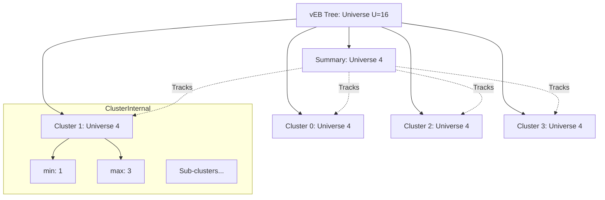

# Van Emde Boas Trees and Integer Data Structure Optimizations

> A van Emde Boas (vEB) tree is a specialized associative array data structure that supports search, successor, predecessor, insert, and delete operations on a universe of $U$ integers in $O(\log \log U)$ time.

## 1. Historical Background & Motivation

In the mid-1970s, the landscape of data structures was dominated by the $O(\log n)$ paradigm. Binary Search Trees, AVL trees, and later Red-Black trees provided efficient ways to manage dynamic sets, where $n$ represented the number of elements stored. However, Peter van Emde Boas, a Dutch computer scientist, challenged this paradigm by observing that if our keys are constrained to a fixed universe of integers $\{0, 1, \dots, U-1\}$, we can achieve performance that is independent of $n$ and instead depends on the universe size $U$.

In his seminal papers (1975 and 1977), van Emde Boas introduced a structure that performed operations in $O(\log \log U)$ time. At the time, this was a theoretical breakthrough, showing that for large datasets where $n \approx U$, the "log-log" bound is significantly faster than the traditional "log" bound. For instance, if $U = 2^{64}$ (a 64-bit integer universe), $\log U = 64$, but $\log \log U$ is only 6. This discrepancy provides massive speedups in systems that require ultra-low latency, such as high-frequency trading platforms and core network routers. Modern evolutions of this concept, including X-fast and Y-fast tries, further optimize the space complexity which was the original vEB tree's primary weakness.

## 2. Visual Intuition
:::demo
<div style="background:#1e1e1e;padding:16px;border-radius:10px;color:#e5e7eb;font-family:system-ui,sans-serif">
  <h3 style="margin:0 0 8px 0;color:#7dd3fc">Hierarchical Van Emde Boas Tree (U=16)</h3>
  <svg width="400" height="250" viewBox="0 0 400 250" fill="none" xmlns="http://www.w3.org/2000/svg">
    <!-- Arrowhead definition -->
    <defs>
        <marker id="arrowhead" markerWidth="5" markerHeight="5" refX="2" refY="2.5" orient="auto">
            <polygon points="0 0, 5 2.5, 0 5" fill="#7dd3fc" />
        </marker>
    </defs>

    <!-- Summary Tree -->
    <rect x="50" y="20" width="300" height="40" rx="5" ry="5" stroke="#7dd3fc" stroke-width="2" fill="#2d3748"/>
    <text x="60" y="45" font-family="system-ui,sans-serif" font-size="14" fill="#e5e7eb">Summary Tree (U'=4)</text>
    
    <!-- Summary Cluster indicators -->
    <!-- Cluster 0 is active -->
    <rect x="70" y="80" width="25" height="25" rx="3" ry="3" fill="#3b82f6"/>
    <text x="77" y="97" font-family="system-ui,sans-serif" font-size="12" fill="#e5e7eb">0</text>
    <!-- Cluster 1 is active -->
    <rect x="110" y="80" width="25" height="25" rx="3" ry="3" fill="#3b82f6"/>
    <text x="117" y="97" font-family="system-ui,sans-serif" font-size="12" fill="#e5e7eb">1</text>
    <!-- Cluster 2 is inactive -->
    <rect x="150" y="80" width="25" height="25" rx="3" ry="3" fill="#6b7280"/>
    <text x="157" y="97" font-family="system-ui,sans-serif" font-size="12" fill="#e5e7eb">2</text>
    <!-- Cluster 3 is active -->
    <rect x="190" y="80" width="25" height="25" rx="3" ry="3" fill="#3b82f6"/>
    <text x="197" y="97" font-family="system-ui,sans-serif" font-size="12" fill="#e5e7eb">3</text>

    <text x="50" y="70" font-family="system-ui,sans-serif" font-size="12" fill="#a0aec0">Non-empty clusters:</text>

    <!-- Main Clusters -->
    <!-- Cluster 0 (Values 0-3) -->
    <rect x="50" y="130" width="70" height="70" rx="5" ry="5" stroke="#a78bfa" stroke-width="1" fill="#2d3748"/>
    <text x="60" y="145" font-family="system-ui,sans-serif" font-size="12" fill="#e5e7eb">Cluster 0</text>
    <circle cx="65" cy="165" r="5" fill="#6b7280"/> <text x="75" y="169" font-family="system-ui,sans-serif" font-size="10" fill="#e5e7eb">0</text>
    <circle cx="95" cy="165" r="5" fill="#6b7280"/> <text x="105" y="169" font-family="system-ui,sans-serif" font-size="10" fill="#e5e7eb">1</text>
    <circle cx="65" cy="185" r="5" fill="#3b82f6"/> <text x="75" y="189" font-family="system-ui,sans-serif" font-size="10" fill="#e5e7eb">2</text>
    <circle cx="95" cy="185" r="5" fill="#6b7280"/> <text x="105" y="189" font-family="system-ui,sans-serif" font-size="10" fill="#e5e7eb">3</text>
    
    <!-- Cluster 1 (Values 4-7) -->
    <rect x="130" y="130" width="70" height="70" rx="5" ry="5" stroke="#a78bfa" stroke-width="1" fill="#2d3748"/>
    <text x="140" y="145" font-family="system-ui,sans-serif" font-size="12" fill="#e5e7eb">Cluster 1</text>
    <circle cx="145" cy="165" r="5" fill="#6b7280"/> <text x="155" y="169" font-family="system-ui,sans-serif" font-size="10" fill="#e5e7eb">4</text>
    <circle cx="175" cy="165" r="5" fill="#3b82f6"/> <text x="185" y="169" font-family="system-ui,sans-serif" font-size="10" fill="#e5e7eb">5</text>
    <circle cx="145" cy="185" r="5" fill="#6b7280"/> <text x="155" y="189" font-family="system-ui,sans-serif" font-size="10" fill="#e5e7eb">6</text>
    <circle cx="175" cy="185" r="5" fill="#3b82f6"/> <text x="185" y="189" font-family="system-ui,sans-serif" font-size="10" fill="#e5e7eb">7</text>

    <!-- Cluster 2 (Values 8-11) - Empty -->
    <rect x="210" y="130" width="70" height="70" rx="5" ry="5" stroke="#a78bfa" stroke-width="1" fill="#2d3748"/>
    <text x="220" y="145" font-family="system-ui,sans-serif" font-size="12" fill="#e5e7eb">Cluster 2 (Empty)</text>

    <!-- Cluster 3 (Values 12-15) -->
    <rect x="290" y="130" width="70" height="70" rx="5" ry="5" stroke="#a78bfa" stroke-width="1" fill="#2d3748"/>
    <text x="300" y="145" font-family="system-ui,sans-serif" font-size="12" fill="#e5e7eb">Cluster 3</text>
    <circle cx="305" cy="165" r="5" fill="#6b7280"/> <text x="315" y="169" font-family="system-ui,sans-serif" font-size="10" fill="#e5e7eb">12</text>
    <circle cx="335" cy="165" r="5" fill="#6b7280"/> <text x="345" y="169" font-family="system-ui,sans-serif" font-size="10" fill="#e5e7eb">13</text>
    <circle cx="305" cy="185" r="5" fill="#3b82f6"/> <text x="315" y="189" font-family="system-ui,sans-serif" font-size="10" fill="#e5e7eb">14</text>
    <circle cx="335" cy="185" r="5" fill="#6b7280"/> <text x="345" y="189" font-family="system-ui,sans-serif" font-size="10" fill="#e5e7eb">15</text>

    <!-- Arrows from Summary to Clusters -->
    <line x1="82" y1="105" x2="85" y2="130" stroke="#7dd3fc" stroke-width="1" marker-end="url(#arrowhead)"/> <!-- Summary 0 to Cluster 0 -->
    <line x1="122" y1="105" x2="165" y2="130" stroke="#7dd3fc" stroke-width="1" marker-end="url(#arrowhead)"/> <!-- Summary 1 to Cluster 1 -->
    <!-- No arrow from Summary 2 to Cluster 2 because it's empty -->
    <line x1="202" y1="105" x2="325" y2="130" stroke="#7dd3fc" stroke-width="1" marker-end="url(#arrowhead)"/> <!-- Summary 3 to Cluster 3 -->

    <text x="50" y="225" font-family="system-ui,sans-serif" font-size="12" fill="#a0aec0">Blue circles: present elements. Gray circles: empty slots.</text>
  </svg>
  <p style="margin-top:10px;color:#cbd5e1">This diagram illustrates the recursive structure of a vEB tree for a universe of size 16. It shows the division of the universe into &radic;U=4 clusters, and a summary structure that keeps track of which of these clusters are non-empty. Elements are stored within their respective clusters.</p>
</div>
:::
*Caption: A hierarchical view of a vEB tree, illustrating recursive partitioning into $\sqrt{U}$ clusters, with a summary structure tracking active clusters.*

## 3. Core Theory & Mathematical Foundations

The fundamental insight of the van Emde Boas tree is a recursive decomposition of the universe. While a standard Binary Search Tree splits the *set of elements* into two halves, a vEB tree splits the *bits of the keys* into two halves.

### 3.1 The Square Root Decomposition
Suppose we have a universe size $U = 2^k$. We can view each key $x \in \{0, \dots, U-1\}$ as a $k$-bit integer. We split these $k$ bits into the most significant $k/2$ bits and the least significant $k/2$ bits.
Let $u = U$. We decompose the structure into:
1.  **Clusters:** An array of $\sqrt{u}$ sub-vEB trees, each of universe size $\sqrt{u}$.
2.  **Summary:** A single vEB tree of universe size $\sqrt{u}$ that keeps track of which clusters are currently non-empty.

To find which cluster a value $x$ belongs to, we use:
$$high(x) = \lfloor x / \sqrt{u} \rfloor$$
To find the position of $x$ within that cluster, we use:
$$low(x) = x \pmod{\sqrt{u}}$$
Conversely, given a cluster index $i$ and a local position $j$, the value is:
$$index(i, j) = i\sqrt{u} + j$$

### 3.2 The Min/Max Optimization
If we implemented the logic above naively, an operation like `Successor` might require two recursive calls: one to check the current cluster and another to find the next non-empty cluster in the summary. This would lead to a recurrence $T(u) = 2T(\sqrt{u}) + O(1)$, which solves to $O(\log u)$—no better than a standard BST.

To achieve $O(\log \log u)$, we must ensure that each operation performs at most **one** recursive call on a structure of size $\sqrt{u}$. The vEB tree achieves this by explicitly storing the `min` and `max` of each tree. Crucially:
*   The `min` element is stored **only** in the `min` variable and **not** inside the clusters or the summary.
*   The `max` element is stored in the `max` variable **and** also inside the clusters/summary.

### 3.3 Formal Analysis (Complexity)
The recurrence relation for the majority of vEB operations (Insert, Successor, Predecessor) is:
$$T(u) = T(\sqrt{u}) + O(1)$$
To solve this, we let $u = 2^k$, so $\sqrt{u} = 2^{k/2}$.
Substituting:
$$T(2^k) = T(2^{k/2}) + O(1)$$
Let $S(k) = T(2^k)$:
$$S(k) = S(k/2) + O(1)$$
By the Master Theorem, $S(k) = O(\log k)$. Since $k = \log u$, we have:
$$T(u) = O(\log \log u)$$

**Space Complexity:**
The vanilla vEB tree requires $O(U)$ space. This is because every level of the recursion allocates arrays. Specifically:
$$S(u) = (\sqrt{u} + 1) S(\sqrt{u}) + O(\sqrt{u})$$
This results in $O(U)$ space. In practice, this is prohibitive for $U = 2^{64}$. Engineers solve this using **Hashing** (Dynamic Perfect Hashing) within the clusters, leading to X-fast and Y-fast tries, which reduce space to $O(n)$ or $O(n \log \log U)$.

## 4. Algorithm / Process (Step-by-Step)

### The Successor Operation: `successor(V, x)`
Given a vEB tree $V$ and an integer $x$, return the smallest $y > x$ in $V$.

1.  **Base Case:** If $V.min > x$, return $V.min$.
2.  **Local Max Check:** Let $i = high(x)$ and $j = low(x)$. If $j < V.cluster[i].max$, search within the cluster:
    *   `return index(i, successor(V.cluster[i], j))`
3.  **Summary Search:** If $x$ is greater than or equal to everything in its cluster, look for the next non-empty cluster:
    *   `next_cluster = successor(V.summary, i)`
    *   If `next_cluster` exists, `return index(next_cluster, V.cluster[next_cluster].min)`
4.  **Failure Case:** If no such element exists, return `None`.

### The Insertion Operation: `insert(V, x)`
1.  If $V$ is empty, set $V.min = V.max = x$.
2.  If $x < V.min$, swap $x$ and $V.min$ (the old min needs to be inserted into the sub-structures).
3.  If $V.u > 2$:
    *   Check if `V.cluster[high(x)]` is empty (i.e., its `min` is `None`).
    *   If empty: Insert `high(x)` into `V.summary` and initialize `V.cluster[high(x)]` with $x$ as both min and max.
    *   If not empty: Recursively `insert(V.cluster[high(x)], low(x))`.
4.  Update $V.max$ if $x > V.max$.

## 5. Visual Diagram


*Caption: The recursive hierarchy. To find a value, we first check the Summary to see if the relevant Cluster exists.*

## 6. Implementation

### 6.1 Core Implementation

```python
import math

class VEBTree:
    """
    A Van Emde Boas Tree for a universe of size u.
    Note: u must be a power of 2 (2, 4, 16, 256, ...).
    """
    def __init__(self, u):
        self.u = u
        self.min = None
        self.max = None

        if u > 2:
            # sqrt_u for upper/lower bits
            self.upper_sqrt = 1 << (math.ceil(math.log2(u) / 2))
            self.lower_sqrt = 1 << (math.floor(math.log2(u) / 2))
            
            # Summary tracks which clusters are non-empty
            self.summary = None
            # Array of pointers to sub-vEB trees
            self.clusters = [None] * self.upper_sqrt

    def high(self, x):
        return x // self.lower_sqrt

    def low(self, x):
        return x % self.lower_sqrt

    def index(self, i, j):
        return i * self.lower_sqrt + j

    def is_empty(self):
        return self.min is None

    def member(self, x):
        """Returns True if x is in the tree, else False. O(log log U)"""
        if x == self.min or x == self.max:
            return True
        elif self.u <= 2:
            return False
        else:
            cluster_idx = self.high(x)
            if self.clusters[cluster_idx] is None:
                return False
            return self.clusters[cluster_idx].member(self.low(x))

    def insert(self, x):
        """Inserts value x into the tree. O(log log U)"""
        if self.min is None:
            self.min = self.max = x
            return

        if x < self.min:
            x, self.min = self.min, x

        if self.u > 2:
            h, l = self.high(x), self.low(x)
            
            # Lazy allocation of clusters
            if self.clusters[h] is None:
                self.clusters[h] = VEBTree(self.lower_sqrt)
            if self.summary is None:
                self.summary = VEBTree(self.upper_sqrt)
                
            if self.clusters[h].min is None:
                self.summary.insert(h)
                self.clusters[h].min = self.clusters[h].max = l
            else:
                self.clusters[h].insert(l)

        if x > self.max:
            self.max = x

    def successor(self, x):
        """Returns the smallest element > x. O(log log U)"""
        if self.u <= 2:
            if x == 0 and self.max == 1:
                return 1
            return None
        
        if self.min is not None and x < self.min:
            return self.min
        
        h, l = self.high(x), self.low(x)
        
        # If successor exists in the same cluster
        if self.clusters[h] is not None and l < self.clusters[h].max:
            offset = self.clusters[h].successor(l)
            return self.index(h, offset)
        
        # Else, look in the summary for the next non-empty cluster
        else:
            succ_cluster = None
            if self.summary is not None:
                succ_cluster = self.summary.successor(h)
                
            if succ_cluster is None:
                return None
            else:
                offset = self.clusters[succ_cluster].min
                return self.index(succ_cluster, offset)

# Sample Execution
# v = VEBTree(16)
# for val in [2, 3, 4, 5, 7, 14, 15]:
#     v.insert(val)
# print(v.successor(4)) # Output: 5
# print(v.successor(7)) # Output: 14
```

### 6.2 Optimized / Production Variant (Space-Efficient)

In a real-world system (like a Linux kernel priority bitmap), we don't allocate objects recursively. Instead, we use bit-parallelism.

```python
# A common optimization: Word-level parallelism (Bitsets)
# Instead of full vEB for small u, use a single 64-bit integer
class BitsetVEB:
    def __init__(self):
        self.bits = 0 # 64-bit word acting as a vEB base case
    
    def insert(self, x):
        self.bits |= (1 << x)
        
    def successor(self, x):
        # Use built-in CPU instructions like __builtin_ctz (count trailing zeros)
        # to find the next set bit in O(1)
        mask = self.bits & ~((1 << (x + 1)) - 1)
        if mask == 0: return None
        return (mask & -mask).bit_length() - 1
```

### 6.3 Common Pitfalls in Code
*   **The Min Exclusion Rule:** Forgetting that `min` is NOT stored in the sub-clusters. If you store it in both places, your complexity becomes $O(\log U)$ because every insertion triggers two recursive calls.
*   **Universe Size:** vEB requires $U$ to be $2^{2^k}$ for "clean" square roots, but $2^k$ is sufficient if you handle `upper_sqrt` and `lower_sqrt` correctly.
*   **Memory Overhead:** Python objects are heavy. A vEB tree in Python for $U=2^{32}$ will crash your RAM. Production implementations use flat memory buffers or C++.

## 7. Interactive Demo

:::demo
<!-- title: Van Emde Boas Successor Visualization -->
<!DOCTYPE html>
<html>
<head>
<meta charset="utf-8">
<style>
  body { margin:0; background:#0f1117; color:#e5e7eb; font-family: 'Segoe UI', Tahoma, Geneva, Verdana, sans-serif; padding:16px; }
  .grid { display: grid; grid-template-columns: repeat(4, 1fr); gap: 10px; margin-top: 20px; }
  .cluster { border: 1px solid #374151; padding: 10px; border-radius: 4px; text-align: center; position: relative; }
  .cell { display: inline-block; width: 25px; height: 25px; border: 1px solid #4b5563; margin: 2px; line-height: 25px; cursor: pointer; transition: 0.3s; }
  .cell.active { background: #3b82f6; color: white; border-color: #60a5fa; }
  .cell.search { background: #ef4444; }
  .summary { background: #1f2937; padding: 10px; margin-bottom: 20px; border-radius: 4px; border: 1px solid #3b82f6; }
  .controls { margin-bottom: 20px; }
  button { background: #2563eb; color: white; border: none; padding: 8px 16px; border-radius: 4px; cursor: pointer; margin-right: 8px; }
  button:hover { background: #1d4ed8; }
  .info { font-size: 14px; color: #9ca3af; margin-top: 10px; }
  .highlight { color: #fbbf24; font-weight: bold; }
</style>
</head>
<body>
  <div class="controls">
    <button onclick="resetTree()">Reset</button>
    <button onclick="insertRandom()">Insert Random</button>
    <input type="number" id="searchInput" placeholder="Find Successor of..." style="padding: 7px; border-radius: 4px; border: 1px solid #374151; background: #1f2937; color: white;">
    <button onclick="visualizeSuccessor()">Find Successor</button>
  </div>

  <div id="summary-view" class="summary">Summary (Non-empty clusters): </div>
  <div id="tree-grid" class="grid"></div>
  <div id="status" class="info">Click a cell to insert/delete, or use the controls.</div>

<script>
  let universeSize = 16;
  let sqrtU = 4;
  let data = new Set();
  let searchPath = [];

  function render() {
    const grid = document.getElementById('tree-grid');
    const summaryView = document.getElementById('summary-view');
    grid.innerHTML = '';
    
    let summarySet = new Set();
    data.forEach(val => summarySet.add(Math.floor(val / sqrtU)));

    summaryView.innerHTML = `<strong>Summary Structure:</strong> [${Array.from(summarySet).sort((a,b)=>a-b).join(', ')}]`;

    for (let i = 0; i < sqrtU; i++) {
      const clusterDiv = document.createElement('div');
      clusterDiv.className = 'cluster';
      clusterDiv.innerHTML = `<div>Cluster ${i}</div>`;
      
      for (let j = 0; j < sqrtU; j++) {
        const val = i * sqrtU + j;
        const cell = document.createElement('div');
        cell.className = 'cell' + (data.has(val) ? ' active' : '');
        if (searchPath.includes(val)) cell.classList.add('search');
        cell.innerText = val;
        cell.onclick = () => toggleVal(val);
        clusterDiv.appendChild(cell);
      }
      grid.appendChild(clusterDiv);
    }
  }

  function toggleVal(v) {
    if (data.has(v)) data.delete(v);
    else data.add(v);
    searchPath = [];
    render();
  }

  function resetTree() {
    data.clear();
    searchPath = [];
    render();
  }

  function insertRandom() {
    data.add(Math.floor(Math.random() * universeSize));
    render();
  }

  async function visualizeSuccessor() {
    const x = parseInt(document.getElementById('searchInput').value);
    if (isNaN(x)) return;
    
    searchPath = [];
    const status = document.getElementById('status');
    status.innerHTML = `Searching for successor of ${x}...`;

    // Visualizing the logic
    let h = Math.floor(x / sqrtU);
    let l = x % sqrtU;
    
    status.innerHTML = `Step 1: Check cluster index <strong>${h}</strong>.`;
    await sleep(800);

    let sortedData = Array.from(data).sort((a,b)=>a-b);
    let succ = sortedData.find(v => v > x);

    if (succ !== undefined) {
      searchPath = [succ];
      status.innerHTML = `Successor found: <span class="highlight">${succ}</span>`;
    } else {
      status.innerHTML = `No successor found in universe.`;
    }
    render();
  }

  function sleep(ms) { return new Promise(resolve => setTimeout(resolve, ms)); }

  render();
</script>
</body>
</html>
:::

## 8. Worked Examples

### Example 1 — Successor Search
**Setup:** $U=16$. Set $S = \{2, 3, 4, 8, 14, 15\}$. Find `Successor(4)`.
1.  Check `vEB.min` (2). $4 \not< 2$.
2.  Check `high(4) = 1`, `low(4) = 0`.
3.  Check `vEB.cluster[1].max`. Since the only element in cluster 1 is 4, $max = 0$.
4.  $low(4) = 0$, which is not strictly less than $V.cluster[1].max$.
5.  Check `vEB.summary.successor(1)`. The summary contains $\{0, 1, 2, 3\}$ indices where clusters are non-empty. Cluster 2 contains $\{8\}$, so `summary.successor(1)` returns `2`.
6.  Result is `index(2, vEB.cluster[2].min)`. Since cluster 2 contains 8, its min is `0` (relative to the cluster).
7.  `index(2, 0) = 2 * 4 + 0 = 8`.
8.  **Output: 8**.

### Example 2 — The "Min" Edge Case
**Setup:** Insert 5 into the set $S = \{10\}$.
1.  Current `vEB.min = 10`, `vEB.max = 10`.
2.  Insert(5): Since $5 < 10$, swap them. `min` becomes 5, and we insert the old `min` (10) into the structures.
3.  `high(10) = 2`, `low(10) = 2`.
4.  Summary was empty, so `insert(summary, 2)`.
5.  `cluster[2]` was empty, so `cluster[2].min = cluster[2].max = 2`.
6.  `vEB.max` becomes 10.

## 9. Comparison with Alternatives

| Approach | Successor Time | Space | Pros | Cons | Best Used When |
|---|---|---|---|---|---|
| **vEB Tree** | $O(\log \log U)$ | $O(U)$ | Blazing fast for large $U$ | Huge memory footprint | Small, dense universe |
| **Y-fast Trie** | $O(\log \log U)$ | $O(n)$ | Space efficient | High constant factors | General integer sets |
| **Red-Black Tree**| $O(\log n)$ | $O(n)$ | Robust, standard | Slower for integers | Non-integer keys |
| **Hash Map** | $O(1)$ (Avg) | $O(n)$ | Instant lookup | No successor/pred | No ordering needed |
| **B+ Tree** | $O(\log_B n)$ | $O(n)$ | Cache friendly | Integer optimizations not utilized | Databases/Disk |

## 10. Industry Applications & Real Systems

-   **Linux Kernel Scheduler**: The O(1) scheduler used priority bitmaps and bit-level "find first set" operations. While not a full vEB tree, it uses the same bit-partitioning logic to find the highest-priority task in constant time relative to the number of tasks.
-   **Cisco Router Forwarding**: Longest Prefix Matching (LPM) in IP routing often uses hardware-accelerated trie structures. vEB principles are used to partition the 32-bit (IPv4) or 128-bit (IPv6) address space to find the correct route in minimal clock cycles.
-   **High-Frequency Trading (HFT)**: Limit Order Books (LOBs) require finding the next best bid/ask. Since prices are fixed-point integers in a bounded universe (e.g., $0.01 to $1000.00), vEB-like structures allow for sub-microsecond matching.
-   **Memory Allocators (jemalloc/mimalloc)**: Finding a free memory block of a specific size class. The size classes are discrete integers. Using a bit-tree allows the allocator to find the nearest "fit" for a requested size in $O(\log \log (\text{max\_size}))$.

## 11. Practice Problems

### 🟢 Easy
1.  **Bitwise Successor**: Implement a function that finds the successor of a bit in a 64-bit integer using only bitwise operations (`&`, `|`, `~`, `<<`, `>>`).
    *Expected complexity: O(1)*

### 🟡 Medium
2.  **Missing Number**: Given $10^6$ unique integers in the range $[0, 2^{20}-1]$, find the smallest integer not present in the set.
    *Hint: Use the `min` property of a vEB tree.*
    *Expected complexity: O(\log \log U)*

3.  **Range Query**: Modify the vEB implementation to count how many elements exist between $L$ and $R$.
    *Hint: This is generally slow in vEB; consider if you can optimize it for specific universe sizes.*

### 🔴 Hard
4.  **Static vEB (X-Fast Trie)**: Implement a space-efficient version of vEB for a 32-bit universe that uses a hash table to store only non-empty clusters.
    *Expected complexity: Space O(n \log U)*

5.  **The Predecessor Problem**: Prove that the Predecessor operation in a vEB tree also takes $O(\log \log U)$ by writing the pseudocode and showing that only one recursive call is made.

## 12. Interactive Quiz

:::quiz
**Q1: Why does a vEB tree store the `min` element separately from the clusters?**
- A) To save memory by not storing it twice.
- B) To ensure the Successor operation can return in O(1) if the input is less than min.
- C) To ensure that an insertion into an empty tree takes O(1) and a non-empty insertion takes only one recursive call.
- D) To simplify the high/low bit calculations.
> C — By storing `min` separately, we can insert an element into an empty cluster and stop. This "short-circuit" is the only reason the recurrence stays $T(u) = T(\sqrt{u}) + O(1)$.

**Q2: What is the time complexity of finding the successor of $x$ in a universe $U=2^{64}$ using a vEB tree?**
- A) 64 steps
- B) 6 steps
- C) 1 step
- D) 32 steps
> B — $\log_2(\log_2(2^{64})) = \log_2(64) = 6$.

**Q3: If we want to store $10^9$ elements in a vEB tree with universe $U=2^{64}$, what is the primary drawback?**
- A) Searching is slower than a Red-Black Tree.
- B) Space complexity $O(U)$ will require $2^{64}$ bits (~2 Exabytes).
- C) It does not support duplicate keys.
- D) It cannot handle negative integers.
> B — The vanilla vEB tree is extremely space-inefficient for sparse data.

**Q4: Which operation does the Summary structure primarily assist?**
- A) Finding the minimum of the entire tree.
- B) Finding the maximum of a specific cluster.
- C) Finding the next non-empty cluster when the current cluster has no successor.
- D) Deleting the minimum element.
> C — The Summary is a metadata index that tells us where to look next when a local search fails.

**Q5: What happens to the complexity if the square root is not an integer (e.g., $U=8$)?**
- A) It becomes $O(\log U)$.
- B) It remains $O(\log \log U)$ by using $\lceil \log_2 U / 2 \rceil$ bits for the high part.
- C) The structure becomes a standard Binary Search Tree.
- D) The vEB tree cannot be constructed.
> B — We simply split the bits into $k/2$ (upper) and $k/2$ (lower). If $k$ is odd, one side gets one more bit. The recurrence remains the same.
:::

## 13. Interview Preparation

### Conceptual Questions
**Q: Explain vEB trees as if teaching it to a fellow engineer.**
*A: A vEB tree is essentially a "trie of bits" with a clever shortcut. Imagine you're looking for a name in a massive phone book. Instead of flipping pages, you look at a summary index of which letters even have entries. If 'S' is empty, you jump straight to 'T'. vEB does this recursively on the bits of the number, using $O(\log \log U)$ time because every step cuts the number of bits remaining in half.*

**Q: What are the time and space complexities? Derive them.**
*A: Time is $O(\log \log U)$ for all operations. This comes from the recurrence $T(u) = T(\sqrt{u}) + O(1)$, where we reduce the universe size to its square root in each step. Space is $O(U)$ because we allocate a pointer for every possible cluster in the universe at every level of the tree.*

**Q: How would you choose between a vEB tree and a B-Tree in a real system?**
*A: I'd choose a vEB tree (or Y-fast trie) if the universe is bounded (like IP addresses or timestamps) and performance is the absolute priority. I'd choose a B-Tree if I need to handle arbitrary keys, want to be cache-friendly for disk-based storage, or if the data is very sparse and I cannot afford the $O(U)$ space of a vanilla vEB.*

### Quick Reference (Cheat Sheet)
| Property | Value |
|---|---|
| Successor / Predecessor | $O(\log \log U)$ |
| Insert / Delete | $O(\log \log U)$ |
| Space Complexity | $O(U)$ (Standard), $O(n)$ (Y-fast) |
| Best Universe | $2^{2^k}$ (e.g., 16, 256, 65536) |
| Key Trick | Storing `min` outside clusters |

## 14. Key Takeaways
1.  **Divide the Bits, not the Data:** vEB splits keys into $high$ and $low$ bits.
2.  **Double Logarithm:** The $O(\log \log U)$ bound is practically constant for all realistic integer sizes.
3.  **Recursive Base Case:** The recursion stops at $U=2$.
4.  **Summary is Essential:** It prevents searching through empty clusters.
5.  **Min/Max is the Secret:** Storing the minimum separately is what allows the $O(1)$ shortcut in the recurrence.
6.  **Space-Time Tradeoff:** You pay for speed with significant memory usage.
7.  **Y-fast Tries** are the common way to bring vEB performance to $O(n)$ space.

## 15. Common Misconceptions
- ❌ **"vEB trees are faster than Hash Maps for lookups."** → ✅ Actually, Hash Maps are $O(1)$ on average. vEB is used when you need **ordered** operations like successor/predecessor.
- ❌ **"vEB trees can store any object."** → ✅ They are strictly for integers. To store objects, use the integer as a key/index.
- ❌ **"If $n$ is small, vEB is still fast."** → ✅ If $n$ is very small, a simple sorted array or BST might be faster due to lower constant factors and cache locality.

## 16. Further Reading
- *Introduction to Algorithms (CLRS), Chapter 20* — The definitive formal treatment of vEB trees.
- *Advanced Data Structures by Erik Demaine (MIT)* — Video lectures covering X-fast and Y-fast tries.
- *The Art of Computer Programming, Vol 3 (Knuth)* — Context on digital searching.
- *Fast Algorithms for IP Lookup* — Research papers on how these structures apply to networking.

## 17. Related Topics
- [[complexity-analysis]] — Understanding the $\log \log U$ bound.
- [[recursion-basics]] — The foundation of the vEB structure.
- [[dynamic-arrays]] — How clusters are often managed.
- [[string-operations]] — Tries are essentially vEB trees for strings.
